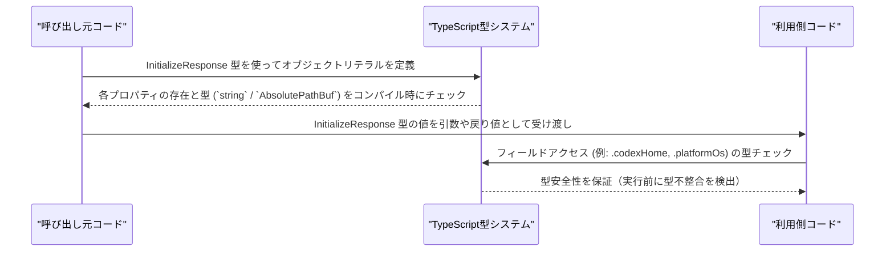

# app-server-protocol\schema\typescript\InitializeResponse.ts コード解説

## 0. ざっくり一言

このファイルは、Rust から `ts-rs` によって自動生成された **初期化レスポンス情報を表すオブジェクト型 `InitializeResponse`** の TypeScript 型定義です（`InitializeResponse.ts:L1-3, L6-20`）。  

---

## 1. このモジュールの役割

### 1.1 概要

- このモジュールは、アプリケーションサーバに関する環境情報をまとめたレスポンスデータを表す **`InitializeResponse` 型** を提供します（`InitializeResponse.ts:L6-20`）。
- `InitializeResponse` には、クライアントのユーザーエージェント、サーバの `$CODEX_HOME` 絶対パス、プラットフォームファミリー、OS 名が含まれます（`InitializeResponse.ts:L6-7, L10-10, L11-15, L16-20`）。
- ファイル先頭のコメントから、**Rust 側の型定義を `ts-rs` で変換した自動生成コード**であり、手動編集してはいけないことが明示されています（`InitializeResponse.ts:L1-3`）。

用途（どの関数から返されるか・どこで使われるか）は、このチャンクからは分かりません。

### 1.2 アーキテクチャ内での位置づけ

- このモジュールは、1 つの公開型 `InitializeResponse` を定義し、その内部で `AbsolutePathBuf` 型に依存しています（`InitializeResponse.ts:L4, L6-10`）。
- `AbsolutePathBuf` は同一ディレクトリの `"./AbsolutePathBuf"` からインポートされており、`codexHome` フィールドの型として使用されています（`InitializeResponse.ts:L4, L10`）。
- `InitializeResponse` を利用する側（関数・クラスなど）はこのチャンクには現れず、このファイル単体からは依存元を特定できません。

依存関係を簡略化した図は次のとおりです。

```mermaid
graph TD
    %% InitializeResponse.ts:L4-20
    IR["InitializeResponse 型 (L6-20)"]
    APB["AbsolutePathBuf 型 (import \"./AbsolutePathBuf\" L4)"]

    IR --> APB
```

### 1.3 設計上のポイント

- **自動生成 & 手動編集禁止**  
  - ファイル先頭に「GENERATED CODE! DO NOT MODIFY BY HAND」と明記され、`ts-rs` による自動生成であることが示されています（`InitializeResponse.ts:L1-3`）。
- **シンプルなオブジェクト型エイリアス**  
  - `InitializeResponse` はクラスではなく、プロパティのみからなるオブジェクト型の **型エイリアス** として定義されています（`InitializeResponse.ts:L6-20`）。
- **絶対パス専用の型を利用**  
  - `codexHome` は `string` ではなく `AbsolutePathBuf` 型で表現され、「サーバの `$CODEX_HOME` ディレクトリへの絶対パス」であるとコメントされています（`InitializeResponse.ts:L7-10`）。
- **プラットフォーム情報は文字列で表現**  
  - `platformFamily` は `"unix"` や `"windows"` などのプラットフォームファミリーを示す文字列（`InitializeResponse.ts:L11-15`）。
  - `platformOs` は `"macos"`, `"linux"`, `"windows"` など具体的な OS 名を示す文字列です（`InitializeResponse.ts:L16-18`）。
- **状態・ロジック・エラーハンドリングなし**  
  - 関数やメソッド、状態を持つオブジェクトは定義されておらず、**型定義のみ** が含まれます（`InitializeResponse.ts:L1-20`）。
  - そのため、このファイル単体にはエラーハンドリングや並行性に関するロジックは存在しません。

---

## 2. 主要な機能一覧（コンポーネントインベントリー）

このファイルは 1 つの公開型を提供します。

- **`InitializeResponse` 型定義**（`InitializeResponse.ts:L6-20`）  
  初期化処理に関連する環境情報（`userAgent`, `codexHome`, `platformFamily`, `platformOs`）をひとまとめに扱うためのオブジェクト型エイリアス。

---

## 3. 公開 API と詳細解説

### 3.1 型一覧（構造体・列挙体など）

#### 公開型一覧

| 名前                | 種別                         | 役割 / 用途                                                                                           | 定義位置                         |
|---------------------|------------------------------|--------------------------------------------------------------------------------------------------------|----------------------------------|
| `InitializeResponse`| 型エイリアス（オブジェクト） | 初期化レスポンス用の環境情報（ユーザーエージェント、Codex ホームディレクトリ、プラットフォーム情報）を保持する | `InitializeResponse.ts:L6-20`   |

#### `InitializeResponse` プロパティ一覧

| プロパティ名      | 型               | 説明                                                                                       | 定義位置                         |
|-------------------|------------------|--------------------------------------------------------------------------------------------|----------------------------------|
| `userAgent`       | `string`         | ユーザーエージェントを表す文字列と解釈できるプロパティ。コメントはなく、用途は名前からの推測に留まります。 | `InitializeResponse.ts:L6`      |
| `codexHome`       | `AbsolutePathBuf`| サーバの `$CODEX_HOME` ディレクトリへの絶対パス（コメントにより明示）（`ts-rs` 由来の型）（`InitializeResponse.ts:L7-10`） | `InitializeResponse.ts:L7-10`   |
| `platformFamily`  | `string`         | 実行中の app-server のプラットフォームファミリー。例として `"unix"` や `"windows"` がコメントに記載（`InitializeResponse.ts:L11-15`）。 | `InitializeResponse.ts:L11-15`  |
| `platformOs`      | `string`         | 実行中の app-server の OS 名。例として `"macos"`, `"linux"`, `"windows"` がコメントに記載（`InitializeResponse.ts:L16-18`）。 | `InitializeResponse.ts:L16-18`  |

> 補足: いずれのプロパティにも `?`（オプショナル指定）は付いていないため、**すべて必須** プロパティです（`InitializeResponse.ts:L6-20`）。

#### 外部依存型

| 名前             | 種別 | 役割 / 関係                                               | 出現位置                       |
|------------------|------|------------------------------------------------------------|--------------------------------|
| `AbsolutePathBuf`| 型   | `codexHome` プロパティの型。絶対パスを表す型として利用。定義本体は別ファイルで、このチャンクには現れません。 | `InitializeResponse.ts:L4, L10`|

### 3.2 関数詳細（最大 7 件）

このファイルには **関数・メソッド・クラスの定義は一切存在しません**（`InitializeResponse.ts:L1-20`）。  
そのため、ここで詳細解説すべき公開関数はありません。

- エラー処理 (`Result` / `Promise` など) や例外、非同期処理、並行性に関連する要素も、このファイルにはありません。

### 3.3 その他の関数

- 該当なし（ユーティリティ関数やラッパー関数は定義されていません）（`InitializeResponse.ts:L1-20`）。

---

## 4. データフロー

このファイル自体には処理ロジックはありませんが、**TypeScript の型システムの観点で見た `InitializeResponse` 型の典型的な利用イメージ**を示します。  
ここで示すシーケンスはあくまで抽象的な例であり、このリポジトリ内の具体的実装を指すものではありません。



要点:

- `InitializeResponse` は **コンパイル時の型安全性** を提供し、間違ったフィールド名や型を使った場合にはコンパイルエラーになります（`InitializeResponse.ts:L6-20`）。
- ランタイム時のバリデーション（例えば実際に絶対パスかどうか、値が `"unix"` かどうか）は、この型定義単体では行われません。

---

## 5. 使い方（How to Use）

### 5.1 基本的な使用方法

`InitializeResponse` を関数の戻り値や変数の型として利用する簡単な例です。  
ここで定義する関数は **説明用の架空のコード** であり、実際のリポジトリに存在するとは限りません。

```typescript
// app.ts （利用側のイメージコード）

// InitializeResponse 型を型としてインポートする                       // InitializeResponse.ts:L6-20 に対応
import type { InitializeResponse } from "./schema/typescript/InitializeResponse";
// codexHome に必要な AbsolutePathBuf 型もインポートする                // InitializeResponse.ts:L4, L10 に対応
import type { AbsolutePathBuf } from "./schema/typescript/AbsolutePathBuf";

// 仮の関数: Codex のホームディレクトリの絶対パスを取得する            // 説明用のダミー関数（実コードとは限らない）
declare function getCodexHome(): AbsolutePathBuf;

// InitializeResponse 型の値を構築する                                  // InitializeResponse.ts:L6-20
const initResponse: InitializeResponse = {
    userAgent: "my-app/1.0.0",       // userAgent: string
    codexHome: getCodexHome(),       // codexHome: AbsolutePathBuf
    platformFamily: "unix",          // platformFamily: string ("unix" / "windows" など)
    platformOs: "linux",             // platformOs: string ("macos" / "linux" / "windows" など)
};

// フィールドに型安全にアクセスできる                                   // TypeScript の型チェックが働く
console.log(initResponse.platformOs.toUpperCase());
```

ポイント:

- すべてのフィールドを正しい型で指定しないと、TypeScript のコンパイルエラーになります（`InitializeResponse.ts:L6-20`）。
- 特に `codexHome` は `string` ではなく `AbsolutePathBuf` 型である点に注意が必要です（`InitializeResponse.ts:L7-10`）。

### 5.2 よくある使用パターン

1. **初期化処理の戻り値として使うパターン（例）**

```typescript
import type { InitializeResponse } from "./schema/typescript/InitializeResponse";

// 説明用の架空の初期化関数
async function initializeServer(): Promise<InitializeResponse> {
    // 実装は任意。ここではダミー値を返す
    return {
        userAgent: "cli/2.0.0",
        codexHome: /* AbsolutePathBuf 型の値 */,
        platformFamily: "unix",
        platformOs: "linux",
    };
}
```

- `Promise<InitializeResponse>` のように、**非同期処理の戻り値の型**として使うと、呼び出し側は返却されるオブジェクトの構造をコンパイル時に把握できます。

1. **他の型の一部としてネストするパターン（例）**

```typescript
import type { InitializeResponse } from "./schema/typescript/InitializeResponse";

interface SessionState {
    initialized: boolean;
    initInfo?: InitializeResponse; // 初期化済みのときにのみ存在する情報
}
```

- `InitializeResponse` を他のインターフェースのフィールドとして埋め込むことで、初期化済み状態に紐づく情報をまとめて扱うことができます。

### 5.3 よくある間違い

前提: `InitializeResponse` の全プロパティは必須であり、型も固定です（`InitializeResponse.ts:L6-20`）。

```typescript
import type { InitializeResponse } from "./schema/typescript/InitializeResponse";

// 間違い例1: codexHome を string 型で指定している
const wrong1: InitializeResponse = {
    userAgent: "ua",
    codexHome: "/not/absolute/path",  // ❌ エラー: string は AbsolutePathBuf に代入できない
    platformFamily: "unix",
    platformOs: "linux",
};

// 間違い例2: 必須プロパティの書き忘れ
const wrong2: InitializeResponse = {
    userAgent: "ua",
    // codexHome がない                           // ❌ エラー: プロパティ 'codexHome' が不足
    platformFamily: "unix",
    platformOs: "linux",
};
```

- TypeScript はコンパイル時にこれらの間違いを検出し、実行前に修正を促します。
- このファイルにはランタイム側のチェックは含まれないため、**値の妥当性（本当に `"unix"` か・パスが存在するかなど）は別途検証が必要**です。

### 5.4 使用上の注意点（まとめ）

- **全プロパティ必須**  
  - `userAgent`, `codexHome`, `platformFamily`, `platformOs` はすべて必須で、オプショナルではありません（`InitializeResponse.ts:L6-20`）。
- **`codexHome` は `AbsolutePathBuf` 型**  
  - 文字列リテラルを直接代入するのではなく、`AbsolutePathBuf` 型の値を用意する必要があります（`InitializeResponse.ts:L7-10`）。
- **型はコンパイル時のみ有効**  
  - TypeScript の型はコンパイル時のチェックにのみ利用され、ランタイムには影響しません。値の検証やセキュリティチェックは別の層で行う必要があります。
- **並行性・エラー処理は対象外**  
  - このファイルには関数や非同期処理がなく、並行性やエラー処理の設計は含まれません（`InitializeResponse.ts:L1-20`）。
- **自動生成ファイルのため手動変更禁止**  
  - このファイルを直接編集すると、次回 `ts-rs` による再生成で上書きされる可能性があります（`InitializeResponse.ts:L1-3`）。

---

## 6. 変更の仕方（How to Modify）

### 6.1 新しい機能を追加する場合

新しいフィールドを `InitializeResponse` に追加したい場合、**この TypeScript ファイルを直接編集してはいけません**（`InitializeResponse.ts:L1-3`）。

一般的な手順（このプロジェクトに特有ではなく、`ts-rs` を利用する場合の典型的な流れ）:

1. Rust 側にある `InitializeResponse` 相当の構造体定義を探す。  
   - このファイルのコメントから、Rust 側に元の定義が存在することは確実ですが、ファイルパスはこのチャンクには現れません（`InitializeResponse.ts:L1-3`）。
2. Rust の構造体にフィールドを追加・変更する。
3. `ts-rs` を再実行して TypeScript 定義を再生成する。
4. `InitializeResponse` を利用している TypeScript コードを検索し、新しいフィールドに対応するよう修正する。

### 6.2 既存の機能を変更する場合

例えばフィールド名を変更したり型を変えたい場合も、手順は同様です。

- **変更時の注意点**
  - フィールド名や型を変更すると、それに依存している TypeScript コードはすべて修正が必要になります。
  - 特に `codexHome` のように別の型（`AbsolutePathBuf`）に依存しているフィールドに変更を加える場合、その型の意味や制約（絶対パスであることなど）を維持するかどうかを検討する必要があります（`InitializeResponse.ts:L7-10`）。
  - 変更後は、コンパイルが通るかどうかだけでなく、実際のランタイム挙動やサーバ側（Rust）の定義との整合性も確認する必要があります。

---

## 7. 関連ファイル

このモジュールと関連があると分かるファイル・コンポーネントを列挙します。

| パス / 識別子                             | 役割 / 関係                                                                                     | 根拠 |
|------------------------------------------|--------------------------------------------------------------------------------------------------|------|
| `./AbsolutePathBuf`                      | `codexHome` フィールドの型として利用される外部型。絶対パスを表現する型であることがコメントから分かります。具体的な定義は別ファイルにあります。 | `InitializeResponse.ts:L4, L7-10` |
| Rust 側の `InitializeResponse` 相当の型  | この TypeScript ファイルを生成した元の Rust 型。`ts-rs` により変換されていること以外の詳細（ファイルパスなど）は、このチャンクには現れません。 | `InitializeResponse.ts:L1-3` |

> このチャンクにはテストコードや、この型を実際に利用する関数・クラスは現れません。そのため、どのレイヤー（HTTP, RPC, CLI など）から使われるかは不明です。
