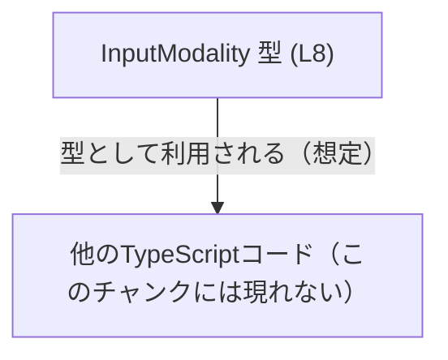
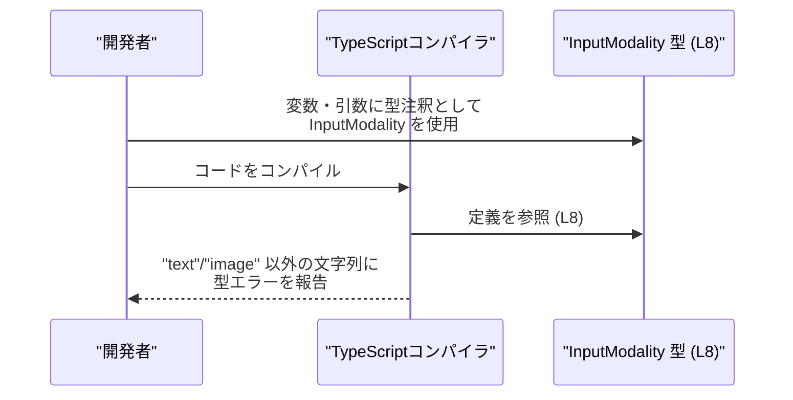

# app-server-protocol/schema/typescript/InputModality.ts

## 0. ざっくり一言

- モデルがサポートするユーザー入力のモダリティ（`"text"` / `"image"`）を表す **文字列リテラル型エイリアス**を定義するファイルです（InputModality.ts:L5-7, L8）。

---

## 1. このモジュールの役割

### 1.1 概要

- このモジュールは、モデルが広告（advertise）するユーザー入力のモダリティを、**型で表現するためのスキーマ定義**として存在しています（InputModality.ts:L5-7）。
- `InputModality` 型は `"text"` または `"image"` のどちらか一方だけを許容する **ユニオン型**として定義されています（InputModality.ts:L8）。

### 1.2 アーキテクチャ内での位置づけ

- ファイル先頭のコメントから、このファイルは `ts-rs` によって自動生成された TypeScript スキーマであり、**他言語側のスキーマ定義から生成されたインターフェースの一部**であることが分かります（InputModality.ts:L1-3）。
- このチャンク内にはインポートやエクスポート先の情報がないため、**どのモジュールから利用されているかは不明**です（InputModality.ts 全体）。

概念上の依存関係（このファイル単体から読み取れる範囲と、「不明」であることを示す図）:



> 図中の B ノードは「一般的にこのような型は他コードから利用される」という**一般的なイメージ**であり、実際の依存関係はこのチャンクからは分かりません。

### 1.3 設計上のポイント

- **自動生成コード**  
  - 「手で編集しないこと」「`ts-rs` による生成物」であることが明示されています（InputModality.ts:L1-3）。
- **状態を持たない純粋な型定義**  
  - 値やロジックを含まず、`type` エイリアスのみをエクスポートしています（InputModality.ts:L8）。
- **コンパイル時のみ有効な制約**  
  - TypeScript の文字列リテラルユニオン型として `"text"` / `"image"` に値を制限しますが、実行時のチェックは含まれません（InputModality.ts:L8）。
- **エラーハンドリング・並行性は関与しない**  
  - 関数・クラス・非同期処理が存在しないため、このファイル自体はエラー処理や並行処理に直接関与しません（InputModality.ts 全体）。

---

## 2. 主要な機能一覧

- `InputModality` 型定義: モデルが扱うユーザー入力モダリティを `"text"` / `"image"` の 2 値に制約する文字列リテラルユニオン型（InputModality.ts:L8）。

---

## 3. 公開 API と詳細解説

### 3.1 型一覧（構造体・列挙体など）

このファイルで定義・エクスポートされている主要な型は次の 1 つです。

| 名前            | 種別       | 役割 / 用途                                                                 | 定義箇所                     |
|-----------------|------------|------------------------------------------------------------------------------|------------------------------|
| `InputModality` | 型エイリアス | モデルがサポートするユーザー入力モダリティを `"text"` または `"image"` に制約する | InputModality.ts:L8          |

#### `InputModality` 型の詳細

- 定義:

  ```ts
  export type InputModality = "text" | "image"; // (InputModality.ts:L8)
  ```

- 型の意味
  - TypeScript の**文字列リテラルユニオン型**です。
  - `InputModality` を型注釈に使うことで、変数・関数引数・戻り値が `"text"` または `"image"` 以外の文字列を受け付けないようにコンパイル時に制約できます（InputModality.ts:L8）。
- 契約（Contract）
  - `InputModality` と注釈された値は、**コンパイル時点では必ず `"text"` または `"image"` のどちらか**であることが保証されます。
  - 実行時に外部から受け取る文字列は、この型だけでは検証されないため、別途ランタイムバリデーションが必要になります（TypeScript の一般的性質として）。

**エラー / 安全性**

- コンパイル時:
  - 例えば `const m: InputModality = "audio";` のような代入は、TypeScript コンパイラによって型エラーになります（InputModality.ts:L8 に基づく制約）。
- 実行時:
  - このファイルには実行時のチェックロジックが含まれないため、`any` や `unknown` からのキャスト、外部入力の直接代入などを行うと、**実行時には `"text"` / `"image"` 以外の値が入り得る**ことに注意が必要です（これは TypeScript の型システム一般の特性です）。

**エッジケース**

- 空文字列 `""` やその他任意の文字列は、型上許可されないため、コンパイルエラーとなります（InputModality.ts:L8）。
- `null` や `undefined` は、`InputModality` に含まれていないため、許容されません。必要であれば `InputModality | null` のように別途ユニオンを定義する必要があります（InputModality.ts:L8 に `null` / `undefined` が含まれていないことから）。

**使用上の注意点**

- このファイルはコメントにより**手動で編集しないこと**が明示されているため（InputModality.ts:L1-3）、新しいモダリティ（例: `"audio"`）を追加したい場合は、**生成元のスキーマ定義を変更する必要がある**と考えられます。
- この型はあくまで **コンパイル時の安全性向上**を目的としたものであり、実行時の入力値検証は別途行う必要があります。

### 3.2 関数詳細（最大 7 件）

- このファイルには関数は定義されていません（InputModality.ts 全体）。

### 3.3 その他の関数

- 該当なし（関数定義が存在しません）。

---

## 4. データフロー

このファイルにはロジックや関数がないため、**実行時データフロー**は存在しません。ここでは、`InputModality` 型が**コンパイル時にどのように関わるか**を概念的に示します。



要点:

- `InputModality` は TypeScript コンパイル時にのみ使われ、実行時の値や制御フローには登場しません（InputModality.ts:L8）。
- 実行時にデータがどのコンポーネントを通過するかは、このチャンクからは分かりません。

---

## 5. 使い方（How to Use）

### 5.1 基本的な使用方法

`InputModality` を関数引数やオブジェクトのプロパティの型として利用する例です。

```typescript
// InputModality 型をインポートする（パスは例示）
// 実際のパスはプロジェクト構成によります。
import type { InputModality } from "./InputModality"; // (このファイル)

interface ModelCapabilities {
    // モデルがサポートする入力モダリティ
    inputModality: InputModality; // "text" または "image" のみ許可
}

// InputModality を引数に取る関数の例
function setModality(modality: InputModality) {          // modality: "text" | "image"
    // ここで modality に対して分岐などを行う
    if (modality === "text") {                           // ユニオン型の片側に対する分岐
        console.log("テキスト入力を処理します");
    } else {
        console.log("画像入力を処理します");
    }
}

// 利用例
const m1: InputModality = "text";                       // OK
// const m2: InputModality = "audio";                   // コンパイルエラー: "audio" は許可されていない
setModality(m1);                                        // 正常
```

このように、`InputModality` を使うことで、**誤った文字列をコンパイル時に防ぐ**ことができます（InputModality.ts:L8）。

### 5.2 よくある使用パターン

1. **設定オブジェクトのフィールドとして利用**

```typescript
import type { InputModality } from "./InputModality";

type ModelConfig = {
    name: string;                 // モデル名
    inputModality: InputModality; // 入力モダリティ
};

const config: ModelConfig = {
    name: "example-model",
    inputModality: "image",       // OK
};
```

1. **ユニオン型の分岐（絞り込み）に利用**

```typescript
import type { InputModality } from "./InputModality";

function describeModality(modality: InputModality): string {
    switch (modality) {
        case "text":
            return "テキスト入力を受け付けるモデルです";
        case "image":
            return "画像入力を受け付けるモデルです";
        // default 分岐は不要: 2 値のみでコンパイル時に網羅チェックが可能
    }
}
```

- `switch` 文の `default` を書かない場合でも、将来ユニオンに新しい値が追加されるとコンパイル時に網羅性の不足を検出できる点が TypeScript の利点です（一般的な TypeScript の性質）。

### 5.3 よくある間違い

```typescript
import type { InputModality } from "./InputModality";

// 間違い例: 広すぎる型を使ってしまう
function setModalityWrong(modality: string) {   // string は何でも入ってしまう
    // "audio" など予期しない値も許容してしまう
}

// 正しい例: InputModality を使って許可される値を限定する
function setModalityCorrect(modality: InputModality) {
    // "text" / "image" のみが許可される
}
```

```typescript
import type { InputModality } from "./InputModality";

declare const fromApi: string;

// 間違い例: 型アサーションで無理やり通してしまう
const m1 = fromApi as InputModality; // コンパイルは通るが、実行時に "audio" などが入りうる

// より安全な例: 実行時チェックを行う
function parseModality(value: string): InputModality | null {
    if (value === "text" || value === "image") {
        return value;
    }
    return null; // 不正値の場合は null などにフォールバック
}
```

- `as InputModality` のような強制的な型アサーションは、**型安全性を損なう可能性**があるため注意が必要です（TypeScript 一般の注意点）。

### 5.4 使用上の注意点（まとめ）

- **実行時検証は別途必要**  
  - `InputModality` はコンパイル時の型制約のみを提供し、実行時に外部から受け取る値の検証は行いません。API からのレスポンスなどには、**明示的なバリデーション**が必要です。
- **自動生成コードの直接編集禁止**  
  - コメントにより「手で編集しない」ことが明示されているため（InputModality.ts:L1-3）、値の追加・変更は生成元の定義を更新する形で行う必要があります。
- **並行性・パフォーマンスへの影響はほぼない**  
  - 型定義のみでランタイムコードを含まないため、このファイル自体がパフォーマンスや並行処理に与える影響はありません（InputModality.ts:L8）。

---

## 6. 変更の仕方（How to Modify）

### 6.1 新しい機能を追加する場合

ここでの「機能」は、主に **新しい入力モダリティの追加**を意味します。

1. **直接編集しない**  
   - ファイル先頭で「GENERATED CODE」「Do not edit this file manually」と警告されているため（InputModality.ts:L1-3）、このファイルを直接編集するのは避ける前提です。
2. **生成元のスキーマを更新**  
   - 新しいモダリティ（例: `"audio"`）を追加したい場合、`ts-rs` によって TypeScript に変換されている元の定義（おそらく他言語側の型定義）を更新する必要がありますが、その具体的な場所はこのチャンクからは分かりません。
3. **再生成**  
   - 生成元を変更した後、`ts-rs` を用いて再生成することで、このファイルの `InputModality` ユニオンにも新しい値が反映される形になると考えられます（コメントより推測される一般的なワークフローであり、具体的なコマンドや手順はこのチャンクからは分かりません: InputModality.ts:L1-3）。

### 6.2 既存の機能を変更する場合

- `"text"` や `"image"` といった既存の値を変更・削除する場合も、**必ず生成元の定義から変更する必要がある**と考えられます（InputModality.ts:L1-3）。
- 変更時に確認すべき点（一般的な観点）:
  - `InputModality` を利用しているすべての箇所（関数引数、設定オブジェクト、switch 文など）で、**新しいユニオン値に対する処理が網羅されているか**。
  - API プロトコルや他言語側の型定義との整合性が保たれているか。
- このファイル単体からは利用箇所やテストコードが分からないため、**影響範囲の特定にはリポジトリ全体の検索が必要**です。

---

## 7. 関連ファイル

このチャンクには他ファイルへの参照がないため、関連ファイルの具体的なパスは特定できません。

| パス                          | 役割 / 関係                                                                 |
|-------------------------------|------------------------------------------------------------------------------|
| （不明）ts-rs 生成元          | コメントから、このファイルが `ts-rs` により自動生成されていることのみ分かるが、具体的な元ファイルのパスは不明です（InputModality.ts:L1-3）。 |
| （不明）InputModality 利用側  | `InputModality` を利用するコード（モデル設定や API レスポンス型など）が存在すると考えられますが、このチャンクには現れません。 |

---

### Bugs / Security / Tests / Performance に関する補足（このファイルに限定）

- **Bugs**  
  - このファイルは型定義のみであり、ロジックや状態を持たないため、このファイル単体で実行時バグを直接引き起こす可能性は低いです（InputModality.ts:L8）。
- **Security**  
  - セキュリティ検証やサニタイズ処理は含まれず、外部入力の妥当性チェックは別レイヤーで行う必要があります。
- **Tests**  
  - このファイル内にテストコードは含まれていません（InputModality.ts 全体）。
- **Performance / Scalability**  
  - コンパイル時のみ利用される型定義であり、ランタイムのパフォーマンスやスケーラビリティに直接の影響はありません（InputModality.ts:L8）。
