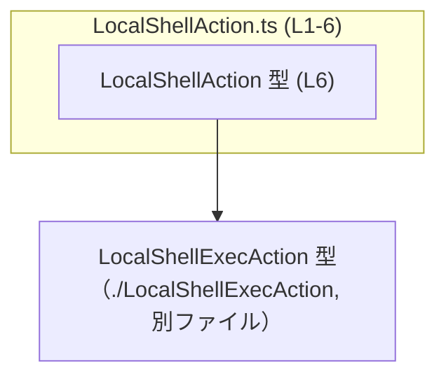
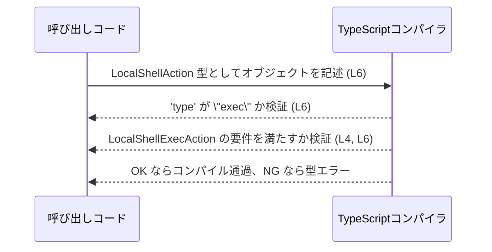
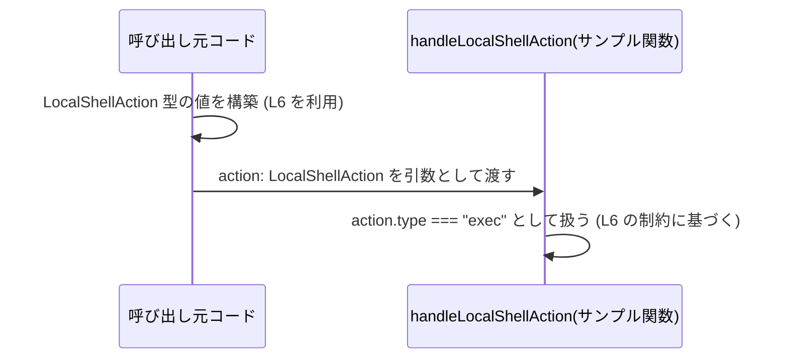

# app-server-protocol\schema\typescript\LocalShellAction.ts

## 0. ざっくり一言

`LocalShellAction` は、`type: "exec"` という固定の種類を持つローカルシェル関連のアクションを表す **型エイリアス** で、別ファイルの `LocalShellExecAction` 型と交差型（intersection）で結合したものです（LocalShellAction.ts:L4-6）。  
ファイル全体は ts-rs による **自動生成コード** であり、手動で編集しないことが明示されています（LocalShellAction.ts:L1-3）。

---

## 1. このモジュールの役割

### 1.1 概要

- このモジュールは、TypeScript 側で `LocalShellAction` という型を 1 つ公開することを目的としています（LocalShellAction.ts:L6）。
- `LocalShellAction` は  
  `{"type": "exec"}` と `LocalShellExecAction` 型の **交差型（`&`）** で定義されており、  
  「`type` プロパティが `"exec"` 固定で、かつ `LocalShellExecAction` のすべてのプロパティを持つオブジェクト」を表現します（LocalShellAction.ts:L4-6）。
- 実行時の処理や関数は一切含まれず、**静的な型定義だけ** が含まれています（LocalShellAction.ts:L4-6）。

### 1.2 アーキテクチャ内での位置づけ

このファイルは、`LocalShellExecAction` 型に依存し、その型に `type: "exec"` という識別用プロパティを付与したラッパ的な型を提供します（LocalShellAction.ts:L4-6）。



- `LocalShellExecAction` は `import type` により **型としてのみ** 参照されており（LocalShellAction.ts:L4）、このファイルのコンパイル後 JavaScript には実行時依存関係を発生させません。
- コメントにより、このファイルは ts-rs によって生成されたことが示されていますが、生成元や利用箇所はこのチャンクには現れません（LocalShellAction.ts:L1-3）。

### 1.3 設計上のポイント

- **自動生成コード**  
  - 「GENERATED CODE! DO NOT MODIFY BY HAND!」と明記されており（LocalShellAction.ts:L1）、また ts-rs による生成ファイルであるとされています（LocalShellAction.ts:L3）。
  - 運用としては、直接編集ではなく「生成元の定義を変更して再生成する」前提で設計されていると解釈できます（コメントに基づく解釈）。
- **型専用のモジュール**  
  - `import type` と `export type` のみを使用しており（LocalShellAction.ts:L4, L6）、コンパイル後に JavaScript コードを生成しない「型のみのモジュール」になっています。
- **識別子付きのアクション型**  
  - `{"type": "exec"}` という文字列リテラル型のプロパティを持つことで、将来的に他のアクションと並べた **判別可能共用体（discriminated union）** に組み込める構造になっています（LocalShellAction.ts:L6）。
- **交差型（intersection）による拡張**  
  - 既存の `LocalShellExecAction` 型に対して、`type` プロパティを「追加」する形で拡張しているため、`LocalShellExecAction` 自体の定義を変更せずに識別情報を付与できます（LocalShellAction.ts:L4-6）。

---

## 2. コンポーネントインベントリー（主要な機能・要素一覧）

このファイルに登場する型・インポートの一覧です。

| 種別 | 名前 | 役割 / 説明 | 定義位置 |
|------|------|------------|----------|
| コメント | （自動生成フラグ） | このファイルが ts-rs による自動生成コードであり、手動編集しないよう注意喚起している | LocalShellAction.ts:L1-3 |
| 型インポート | `LocalShellExecAction` | `LocalShellAction` の一部を構成する交差型の片方として参照される型。詳細な構造はこのチャンクには現れません | LocalShellAction.ts:L4-4 |
| 型エイリアス（公開） | `LocalShellAction` | `{"type": "exec"}` と `LocalShellExecAction` の交差型。`type: "exec"` を持つローカルシェル実行アクションを表現する | LocalShellAction.ts:L6-6 |

---

## 3. 公開 API と詳細解説

### 3.1 型一覧（構造体・列挙体など）

このファイルが外部に公開する主な型は 1 つです。

| 名前 | 種別 | 構造 / 定義 | 役割 / 用途 | 定義位置 |
|------|------|-------------|------------|----------|
| `LocalShellAction` | 型エイリアス | `{ "type": "exec" } & LocalShellExecAction` | `type` プロパティが `"exec"` のアクションであり、かつ `LocalShellExecAction` のすべてのプロパティを持つオブジェクトを表す | LocalShellAction.ts:L6-6 |

#### `LocalShellAction`

**概要**

- `LocalShellAction` は、次の 2 つの要素を **交差型（intersection）** で結合した型です（LocalShellAction.ts:L6）。

  1. リテラル型オブジェクト `{ "type": "exec" }`  
  2. 別ファイルで定義された `LocalShellExecAction` 型（LocalShellAction.ts:L4-6）

- そのため、「`type` プロパティが常に `"exec"` であることが保証された `LocalShellExecAction`」という意味を持つ型になります。

**構造**

- 必須プロパティ（このファイルから読み取れる範囲）

  | プロパティ名 | 型 | 説明 | 根拠 |
  |--------------|----|------|------|
  | `type` | `"exec"`（文字列リテラル型） | アクションの種類を表す識別子。常に `"exec"` でなければならない | LocalShellAction.ts:L6-6 |

- それ以外のプロパティ
  - `LocalShellExecAction` が定義するすべてのプロパティを **同時に持つ必要** があります（交差型の性質に基づく TypeScript の仕様）。
  - 具体的なプロパティ名・型は `LocalShellExecAction` の定義側にあり、このチャンクには現れません（LocalShellAction.ts:L4）。

**使用例**

`LocalShellAction` を変数の型として利用する例です。  
`LocalShellExecAction` の具体的なフィールドは不明なため、コメントで示しています。

```typescript
import type { LocalShellAction } from "./LocalShellAction";          // LocalShellAction 型をインポートする

// LocalShellAction 型の値を作成する例
const action: LocalShellAction = {                                   // action は LocalShellAction 型
    type: "exec",                                                    // 必須: リテラル "exec" でなければならない
    // ここに LocalShellExecAction で要求されるプロパティをすべて記述する
    // 例: command: "ls", args: ["-la"], ... （実際のプロパティ名はこのチャンクには現れません）
};
```

`LocalShellAction` を受け取る関数の例です（この関数自体はレポジトリには存在せず、説明用のサンプルです）。

```typescript
import type { LocalShellAction } from "./LocalShellAction";          // LocalShellAction 型をインポート

function handleLocalShellAction(action: LocalShellAction) {          // 引数に LocalShellAction 型を指定
    // action.type は "exec" に絞り込まれている
    if (action.type === "exec") {                                    // 条件分岐は形だけだが、型はもともと "exec" 固定
        // ここでは action は LocalShellExecAction のプロパティもすべて持つとみなせる
        // 例: 実際には action.command や action.args などを参照することが想定される（プロパティ名はこのチャンクには現れません）
    }
}
```

**Errors / 型安全性**

- `type` プロパティに `"exec"` 以外の文字列を指定すると、**コンパイルエラー** となります。

  ```typescript
  const invalid: LocalShellAction = {
      // @ts-expect-error - "run" は "exec" ではないためエラー
      type: "run",                                                   // コンパイル時エラー
      // LocalShellExecAction のプロパティ群 ...
  };
  ```

- `LocalShellExecAction` で要求されているプロパティを欠いている場合にも、コンパイルエラーになります。
  - どのプロパティが不足しているかは `LocalShellExecAction` の定義に依存し、このチャンクには現れません。

**Edge cases（エッジケース）**

- `type` プロパティを指定しない場合

  ```typescript
  // @ts-expect-error - type プロパティがないため LocalShellAction としては不完全
  const missingType: LocalShellAction = {
      // LocalShellExecAction のプロパティのみ ...
  };
  ```

  → `type` は必須のため、コンパイルエラーになります。

- `type` を `"exec"` 以外に変更しようとした場合
  - 代入時・更新時どちらもコンパイル時にエラーとなります。
- 実行時のエラー
  - このファイルは **型定義のみ** であり、実行時のコードや例外処理は含まれていません（LocalShellAction.ts:L4-6）。
  - したがって、エラーは **コンパイル時の型エラー** としてのみ現れます。

**使用上の注意点**

- このファイルは自動生成コードであり、「Do not edit this file manually」と明記されています（LocalShellAction.ts:L1-3）。  
  `LocalShellAction` の構造を変更したい場合は、**生成元の定義を変更して ts-rs により再生成する**運用が前提と考えられます。
- `import type` により型のみをインポートしているため（LocalShellAction.ts:L4）、  
  `LocalShellAction` を使用してもバンドル後のコードサイズやランタイム性能には影響しません（TypeScript の型情報はコンパイル時に消えるため）。
- 並行性・非同期処理・例外処理に関するロジックは一切含まれていないため、  
  それらに関する安全性は、この型を利用する側の実装に依存します。

### 3.2 関数詳細

- このファイルには **関数・メソッド定義は存在しません**（LocalShellAction.ts:L1-6）。
- したがって、関数ごとのアルゴリズム・エラー条件・パフォーマンス特性などは、このチャンクからは読み取れません。

### 3.3 その他の関数

- 該当なし（このチャンクには関数が一切現れません）。

---

## 4. データフロー

このファイル自体は実行時の処理を持たないため、ここでは **型チェック時のデータフロー** と、  
`LocalShellAction` 型を利用するコード側での典型的な流れを示します。

### 4.1 型チェックの流れ（コンパイル時）



- `Dev`（開発者のコード）が `LocalShellAction` を型注釈として利用すると、TypeScript コンパイラは（LocalShellAction.ts:L6）:
  - `type` プロパティが `"exec"` であること（リテラル型制約）、
  - 交差先の `LocalShellExecAction` 型の構造をすべて満たしていること（LocalShellAction.ts:L4, L6）  
  を同時にチェックします。
- この検証は **コンパイル時のみ** 行われ、実行時には型情報は存在しません。

### 4.2 利用コード内での呼び出しイメージ

`LocalShellAction` の値を、何らかの処理関数に渡す流れの例です（関数自体はサンプルコードです）。



- `Caller` 側で `LocalShellAction` 型の値を構築し（LocalShellAction.ts:L6）、それを処理関数に渡す、というデータの流れが想定されます。
- 実際にどのモジュールが `LocalShellAction` を利用しているかは、このチャンクには現れません。

---

## 5. 使い方（How to Use）

### 5.1 基本的な使用方法

`LocalShellAction` をインポートして値を作成し、処理関数に渡す基本的なパターンです。

```typescript
// LocalShellAction 型をインポートする                                  // 型定義ファイルから LocalShellAction を取り込む
import type { LocalShellAction } from "./LocalShellAction";            // LocalShellAction.ts:L6 に対応

// LocalShellAction 型の値を生成する関数（サンプル）                       // LocalShellAction 型の値を組み立てる
function createExecAction(/* ... */): LocalShellAction {               // 戻り値の型として LocalShellAction を指定
    return {
        type: "exec",                                                  // 必須: "exec" で固定（LocalShellAction.ts:L6）
        // LocalShellExecAction で要求されるプロパティをここに列挙する     // 具体的な項目はこのチャンクには現れない
    };
}

// LocalShellAction 型を受け取る処理関数（サンプル）                        // LocalShellAction を使った処理
function processAction(action: LocalShellAction) {
    // action.type は常に "exec" として扱える                              // 判別値としての type
    console.log(action.type);                                          // "exec" と推論される
    // action の他のプロパティは LocalShellExecAction に従う               // 実際の処理は LocalShellExecAction の定義に依存
}
```

### 5.2 よくある使用パターン

1. **引数・戻り値の型として利用する**

   - 関数の引数に `LocalShellAction` を指定すると、その関数に渡されるオブジェクトは必ず `type: "exec"` を含むことが保証されます。
   - 戻り値に指定することで、「この関数は `exec` 型のローカルシェルアクションを生成する」という契約を表現できます。

2. **他のアクション型との共用体に含める（サンプル）**

   ※以下の `OtherAction` はダミーの型名であり、このチャンクには存在しません。

   ```typescript
   type Action = LocalShellAction | OtherAction;                      // 複数アクションの共用体（サンプル）

   function handle(action: Action) {
       if (action.type === "exec") {                                  // "exec" をキーに LocalShellAction に絞り込む
           // ここでは action は LocalShellAction として扱える
       } else {
           // その他のアクション型を処理
       }
   }
   ```

   - `type` を判別キーとして利用することで、TypeScript が自動的に `action` の型を絞り込む（型ガード）ことができます。
   - このパターンは、`{"type": "exec"}` のようなリテラル型プロパティによって支えられています（LocalShellAction.ts:L6）。

### 5.3 よくある間違い

```typescript
import type { LocalShellAction } from "./LocalShellAction";

// 間違い例: type プロパティの値を変えてしまう
const wrongType: LocalShellAction = {
    // @ts-expect-error - "EXEC" は "exec" と一致しない
    type: "EXEC",                                                     // 大文字小文字の違いでもコンパイルエラー
    // LocalShellExecAction のプロパティ ...
};

// 正しい例: "exec" をそのまま使用する
const correct: LocalShellAction = {
    type: "exec",                                                     // リテラル "exec" と一致
    // LocalShellExecAction のプロパティ ...
};
```

- **誤りパターン**
  - `type` を `"exec"` 以外の文字列にする
  - `type` プロパティ自体を省略する
- **正しいパターン**
  - `type: "exec"` を必ず含める
  - `LocalShellExecAction` が要求する全プロパティを満たすオブジェクトを渡す

### 5.4 使用上の注意点（まとめ）

- このファイルは自動生成されるため、**直接編集しないことが推奨されます**（LocalShellAction.ts:L1-3）。
- `LocalShellAction` は **型レベルの制約** を提供するだけであり、実行時の検証は行われません。  
  実行時に安全性を確保したい場合は、別途ランタイム検証（バリデーション）を実装する必要があります。
- 並行性・非同期処理などに関する仕様はこの型には含まれず、それらはこの型を利用するコード側で決まります。
- `import type` により実行時依存を持たないため、他のモジュールからこの型を多用しても、実行時パフォーマンスやメモリ使用量には直接影響しません（LocalShellAction.ts:L4, L6）。

---

## 6. 変更の仕方（How to Modify）

### 6.1 新しい機能を追加する場合

- コメントにより「GENERATED CODE! DO NOT MODIFY BY HAND!」と宣言されているため（LocalShellAction.ts:L1-3）、  
  **このファイル自体に新しい機能やフィールドを直接追加することは想定されていません**。
- 新しいフィールドやアクション種別を追加する必要がある場合は:
  - 生成元（ts-rs による元の定義）がどこかに存在するはずですが、その場所はこのチャンクには現れません。
  - 一般的には、生成元の定義を変更し、ts-rs の生成プロセスを再実行する形になります（これはコメント内容と一般的なコード生成の慣行に基づく説明です）。

### 6.2 既存の機能を変更する場合

- `LocalShellAction` の構造を変更すると、それを利用しているすべてのコードに影響します。
- 特に次の点に注意が必要です:

  - `type` プロパティのリテラル `"exec"` を変更・削除すると、
    - それに依存して型ガードや分岐を書いている箇所がコンパイルエラーになる可能性があります。
  - `LocalShellExecAction` 側の定義を変更すると、
    - `LocalShellAction` を利用しているコードで不足プロパティが発生し、コンパイルエラーになる可能性があります。

- ただし、どこで `LocalShellAction` が使われているか、どのような契約があるかは、このチャンクには現れません。  
  変更前には IDE の参照検索などで利用箇所を確認する必要があります。

---

## 7. 関連ファイル

このファイルと直接的な依存関係にあるファイルは、インポート文から次の 1 つだけが明示されています。

| パス（推定） | 役割 / 関係 | 根拠 |
|-------------|------------|------|
| `app-server-protocol\schema\typescript\LocalShellExecAction.ts` | `LocalShellExecAction` 型を定義していると考えられるファイル。`LocalShellAction` の交差型の片方として参照されている | 相対インポート `"./LocalShellExecAction"`（LocalShellAction.ts:L4-4）からの推定。拡張子はビルド設定によるため厳密には不明 |

- テストコードや、この型を実際に利用しているモジュール（例: ハンドラーやシリアライザなど）は、このチャンクには現れません。  
  それらの存在有無やパスについては「不明」です。

---

このレポートは、`app-server-protocol\schema\typescript\LocalShellAction.ts` の内容（L1-6）に基づき、  
型定義とその利用方法に関する事実と TypeScript の言語仕様から読み取れる範囲での解釈のみを記述しています。
