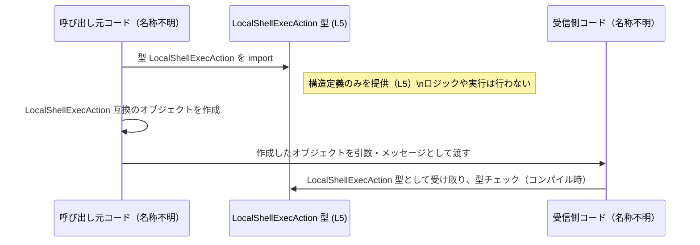

# app-server-protocol/schema/typescript/LocalShellExecAction.ts

## 0. ざっくり一言

- `LocalShellExecAction` という **1 つの型エイリアスのみ** を定義する、コード生成された TypeScript スキーマファイルです（`app-server-protocol/schema/typescript/LocalShellExecAction.ts:L1-5`）。
- ローカルでのシェル実行に関する設定・パラメータを表していると解釈できますが、実際の利用方法や意味づけはこのファイルからは分かりません（命名からの推測です）。

---

## 1. このモジュールの役割

### 1.1 概要

- このモジュールは、`LocalShellExecAction` というオブジェクト型の構造を TypeScript 側に提供するために存在しています（`L5`）。
- 冒頭コメントから、このファイルは Rust から TypeScript 型を生成するツール `ts-rs` によって **自動生成** されていることが分かります（`L1-3`）。
- そのため、このファイル自体にはビジネスロジックや処理関数は存在せず、「データ構造の定義」のみを担っています。

### 1.2 アーキテクチャ内での位置づけ

このチャンクから確実に言えるのは次の点です。

- `ts-rs` によって生成された TypeScript 側のスキーマ定義である（`L1-3`）。
- 型 `LocalShellExecAction` は外部から `import` されて利用される公開 API である（`export type ...` なので、`L5`）。

Rust 側の型や、この型を利用する他モジュールの具体的な名前・場所は、このファイルからは分かりません。

その前提で、「想定される位置づけ」を図示すると次のようになります（Rust 側や利用コードの名称は不明であることを明記しています）。


- ノード A, D は「存在が推測されるコンポーネント」であり、このチャンクには定義が現れません。
- ノード C は本ファイルそのものです。

### 1.3 設計上のポイント

コードから読み取れる設計上の特徴は次のとおりです。

- **コード生成前提**  
  - 先頭コメントに「GENERATED CODE! DO NOT MODIFY BY HAND!」とあり（`L1`）、手動編集を禁止しています。
  - `ts-rs` による自動生成であることが明記されています（`L3`）。

- **データのみ・ロジックなし**  
  - 関数・メソッド・クラスは一切なく、`export type` による型エイリアス定義のみです（`L5`）。

- **TypeScript の型安全性の活用**  
  - `bigint` や `string | null`、インデックスシグネチャ `{ [key in string]?: string } | null` などを使い、各フィールドの存在有無や型を静的に表現しています（`L5`）。
  - これにより、利用側は **コンパイル時に** プロパティの型チェックを受けられます（ランタイムチェックはこのファイルにはありません）。

- **状態や並行性の管理は行わない**  
  - 状態を持つオブジェクトや非同期処理は定義されておらず、並行性・エラーハンドリングといった要素はこのモジュールの関心事ではありません（`L1-5` 全体）。

---

## 2. 主要な機能一覧

このファイルは「機能」というより「データ構造」を 1 つだけ提供します。

- `LocalShellExecAction`: ローカルシェル実行に関するパラメータを表現するオブジェクト型（と解釈できる）を公開する型エイリアス（`L5`）。

※ 実際にどのような文脈で利用されるか（RPC のペイロードなのか、設定ファイルのモデルなのかなど）は、このチャンクからは分かりません。

---

## 3. 公開 API と詳細解説

### 3.1 型一覧（構造体・列挙体など）

#### 型エイリアス一覧

| 名前                    | 種別        | 役割 / 用途（解釈）                                                                 | 定義位置 |
|-------------------------|-------------|--------------------------------------------------------------------------------------|----------|
| `LocalShellExecAction`  | 型エイリアス | ローカルシェル実行用と思われる設定オブジェクトの形を表現する TypeScript 型。実際の利用方法はこのチャンクからは不明。 | `LocalShellExecAction.ts:L5-5` |

#### プロパティ一覧（`LocalShellExecAction` の構造）

`LocalShellExecAction` は次のようなオブジェクト型として定義されています（`L5`）。

```ts
export type LocalShellExecAction = {
  command: Array<string>,
  timeout_ms: bigint | null,
  working_directory: string | null,
  env: { [key in string]?: string } | null,
  user: string | null,
};
```

各フィールドを表にまとめます（いずれも `L5` からの情報です）。

| プロパティ名          | 型                                      | 必須/任意           | 説明（コードから読める範囲と命名からの解釈）                            | 定義位置 |
|----------------------|-----------------------------------------|----------------------|---------------------------------------------------------------------------|----------|
| `command`            | `Array<string>`                         | **必須**             | 文字列の配列。シェルに渡すコマンドと引数のリストと思われます。          | `L5-5`   |
| `timeout_ms`         | `bigint \| null`                        | **必須（値はnull可）** | ミリ秒単位のタイムアウト値（と解釈できる）。指定なしを `null` で表現。 | `L5-5`   |
| `working_directory`  | `string \| null`                        | **必須（値はnull可）** | 実行時の作業ディレクトリパス（と解釈できる）。未指定は `null`。        | `L5-5`   |
| `env`                | `{ [key in string]?: string } \| null`  | **必須（値はnull可）** | 環境変数名→値のマップ（と解釈できる）。`null` は「指定なし」。         | `L5-5`   |
| `user`               | `string \| null`                        | **必須（値はnull可）** | 実行ユーザー名（と解釈できる）。未指定は `null`。                       | `L5-5`   |

- 「必須/任意」はオブジェクトのプロパティとして必須かどうかを表します。`timeout_ms: bigint | null` のように `| null` が付いているものは「プロパティは必ず存在するが、値として `null` も許容される」という意味です（`L5`）。

### 3.2 関数詳細（最大 7 件）

このファイルには関数・メソッドは定義されていません。

- すべての行を確認しても `function`, `=>`, メソッド定義などの記述は存在せず（`L1-5`）、唯一の公開 API は `export type LocalShellExecAction` です（`L5`）。

そのため、このセクションで詳細解説すべき関数は「該当なし」となります。

### 3.3 その他の関数

- 該当なし（このチャンクには関数定義が存在しません）。

---

## 4. データフロー

このモジュール自体はデータ型のみを提供し、処理ロジックは含みません。そのため、データフローはあくまで「この型が他のコードからどう参照されるか」というレベルに留まります。

一般的な TypeScript スキーマ型の利用パターンを前提とした「想定シナリオ」を、図として示します（利用側の具体的な名称は不明であることに注意してください）。



- この図は、「コンパイル時の型チェックに利用される」という TypeScript 型の一般的な流れを説明するものであり、実際のプロジェクト構成やモジュール名は、このチャンクからは分かりません。
- 並行性・非同期処理・エラー処理などは、この型の定義には含まれていません（`L1-5`）。

---

## 5. 使い方（How to Use）

### 5.1 基本的な使用方法

`LocalShellExecAction` を利用する際の、典型的な型付きオブジェクト生成例です。  
（インポートパスは、このファイルと同じディレクトリにあると仮定した例です。）

```typescript
// LocalShellExecAction 型をインポートする                           // 型定義だけを利用するために import type を使う
import type { LocalShellExecAction } from "./LocalShellExecAction";   // 実際のパスはプロジェクト構成に依存

// LocalShellExecAction 型に適合するオブジェクトを作成する           // ここではサンプルとしてコマンドとパラメータを固定で記述する
const action: LocalShellExecAction = {                                // action は LocalShellExecAction 型になる
    command: ["ls", "-la"],                                           // command は string の配列（必須）
    timeout_ms: 10_000n,                                              // timeout_ms は bigint または null
    working_directory: "/tmp",                                        // working_directory は string または null
    env: { PATH: "/usr/bin" },                                        // env は string→string のマップ または null
    user: "deploy",                                                   // user は string または null
};

// action を他の関数に渡して利用する                                // 実際の処理（シェル実行など）はこのファイルの外側で行われる
someExecutor(action);                                                 // someExecutor の具体的な定義はこのチャンクには現れない
```

- `timeout_ms` に `10_000n` のような `bigint` リテラルを使用する必要があります（`L5`）。
- `timeout_ms`, `working_directory`, `env`, `user` は `null` も許容されるため、未指定を `null` で表現できます（`L5`）。

### 5.2 よくある使用パターン

#### 例1: 部分的に値を組み立てる

アプリケーション側でデフォルト値を決めておき、一部だけ上書きするような使い方が考えられます。

```typescript
import type { LocalShellExecAction } from "./LocalShellExecAction";

// デフォルト設定を用意する                                      // すべてのプロパティを埋めておくと扱いやすい
const defaultAction: LocalShellExecAction = {
    command: [],                                                   // command は必須なので空配列でも入れておく
    timeout_ms: null,                                              // デフォルトではタイムアウトなし（という意味だと解釈できる）
    working_directory: null,                                       // デフォルトの作業ディレクトリなし
    env: null,                                                     // デフォルトでは環境変数上書きなし
    user: null,                                                    // デフォルトのユーザー指定なし
};

// ユーザー入力などから一部を上書きして使う                        // 実際のマージ処理はアプリケーション側で実装する
const userSpecifiedCommand = ["echo", "hello"];
const action: LocalShellExecAction = {
    ...defaultAction,                                              // デフォルト値を展開
    command: userSpecifiedCommand,                                 // command だけを上書き
};
```

#### 例2: 関数の引数として受け取る

```typescript
import type { LocalShellExecAction } from "./LocalShellExecAction";

// LocalShellExecAction を受け取る関数を定義する                   // この関数内で実際の実行や検証を行う（ここではイメージのみ）
function executeLocalShell(action: LocalShellExecAction): void {
    // action.command / action.timeout_ms などを使って処理する     // 実装はこの型定義ファイルには含まれない
}
```

### 5.3 よくある間違い

型定義から推測できる、起こりそうな誤用とその修正例です。

```typescript
import type { LocalShellExecAction } from "./LocalShellExecAction";

// 間違い例: 必須プロパティ command を省略している
const badAction1: LocalShellExecAction = {
    // command: ["ls"],                                            // 省略するとコンパイルエラーになる
    timeout_ms: null,
    working_directory: null,
    env: null,
    user: null,
};

// 正しい例: command を必ず指定する
const goodAction1: LocalShellExecAction = {
    command: ["ls"],                                               // command は必須
    timeout_ms: null,
    working_directory: null,
    env: null,
    user: null,
};

// 間違い例: timeout_ms を number で指定している
const badAction2: LocalShellExecAction = {
    command: ["sleep", "10"],
    timeout_ms: 10_000,                                            // number 型なのでコンパイルエラー
    working_directory: null,
    env: null,
    user: null,
};

// 正しい例: timeout_ms を bigint で指定する
const goodAction2: LocalShellExecAction = {
    command: ["sleep", "10"],
    timeout_ms: 10_000n,                                           // bigint リテラル
    working_directory: null,
    env: null,
    user: null,
};
```

### 5.4 使用上の注意点（まとめ）

- **必須プロパティ**  
  - `command` は `Array<string>` で必須です（`L5`）。省略するとコンパイルエラーになります。
- **`null` と未定義の違い**  
  - `timeout_ms`, `working_directory`, `env`, `user` は「プロパティとして必須だが、値として `null` を許容する」型になっています（`L5`）。  
    - つまり `{}` のようにプロパティ自体を省略することは型的に許されません。
- **bigint の取り扱い**  
  - `timeout_ms` は `bigint` 型であり、`number` ではないため、`10_000` ではなく `10_000n` のような表記が必要です（`L5`）。
- **ランタイム検証は別途必要**  
  - この型はあくまでコンパイル時の型定義であり、実行時に値の妥当性を検証するロジックは含まれていません（`L1-5`）。  
    外部入力（JSON 等）から値を受け取る場合は、パースとバリデーションを別途実装する必要があります。

---

## 6. 変更の仕方（How to Modify）

### 6.1 新しい機能を追加する場合

このファイルは `ts-rs` によって生成されているため（`L1-3`）、**直接編集は推奨されません**。

新しいフィールドを追加したり、型を変更したい場合は、通常次のような手順になります（一般的な ts-rs 利用パターンに基づく説明であり、具体的なファイル名はこのチャンクからは分かりません）。

1. **元となる Rust 側の型定義を変更する**  
   - `LocalShellExecAction` に対応する Rust の構造体や型エイリアスに、新しいフィールドを追加するなど。
   - この Rust 側の定義は、このチャンクには現れませんが、`ts-rs` が参照しているはずです（`L3` のコメントからの推測）。

2. **ts-rs のコード生成を再実行する**  
   - プロジェクトのビルドスクリプトや専用コマンドを通じて、TypeScript ファイルを再生成します。

3. **生成された TypeScript ファイルを確認する**  
   - `app-server-protocol/schema/typescript/LocalShellExecAction.ts` が更新され、新しいフィールドが反映されていることを確認します。

### 6.2 既存の機能を変更する場合

- **このファイルを直接編集しない**  
  - `// GENERATED CODE! DO NOT MODIFY BY HAND!` と `Do not edit this file manually.` が明記されているため（`L1`, `L3`）、このファイルを直接変更すると、次回のコード生成で上書きされる可能性があります。

- **互換性への注意**  
  - フィールドの型や名前を変更すると、それを利用している TypeScript コード全体に影響します。  
    変更する場合は、Rust 側の定義と、TypeScript 側の利用箇所の両方で影響範囲を確認する必要があります（ただし、その具体的な場所はこのチャンクには現れません）。

---

## 7. 関連ファイル

このチャンクから「具体的なパス」を特定できる関連ファイルはありませんが、概念的に次のような関連が想定されます。

| パス / コンポーネント（概念的）          | 役割 / 関係 |
|------------------------------------------|------------|
| 対応する Rust 側の型定義（ファイル不明） | `ts-rs` が参照し、本ファイルの元になっていると考えられる。`L3` のコメントから推測されるが、実際のパスや型名は不明。 |
| `ts-rs` のコード生成設定（ファイル不明） | どの Rust 型をどのパスに TypeScript として出力するかを制御していると考えられる。`L3` より、何らかの形でこのファイル生成に関与。 |
| `LocalShellExecAction` を import する TypeScript コード群（不明） | 実際に `LocalShellExecAction` 型を利用しているコード。ユースケースやモジュール名はこのチャンクには現れない。 |

---

### 言語固有の安全性・エラー・並行性について（補足）

- **型安全性**  
  - TypeScript の静的型チェックにより、`command` の必須性や `timeout_ms` が `bigint` であることなどがコンパイル時に保証されます（`L5`）。
  - ただし、実行時には型情報が消えるため、外部入力に対するランタイムチェックは別途必要です。

- **エラー処理**  
  - このモジュール自体は関数を持たないため、エラーや例外を直接扱うコードは存在しません（`L1-5`）。

- **並行性**  
  - このファイルは純粋な型定義であり、スレッドやイベントループに関する API は含まれていません。  
    並行性に関わるのは、この型を利用して実際に処理を行う別モジュールの責務になります。
