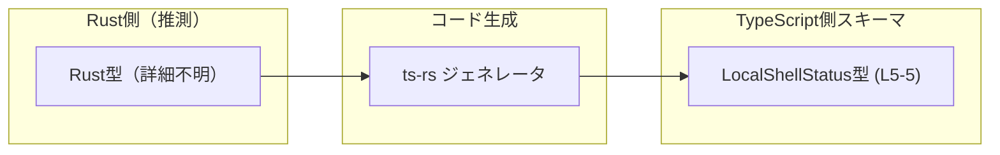
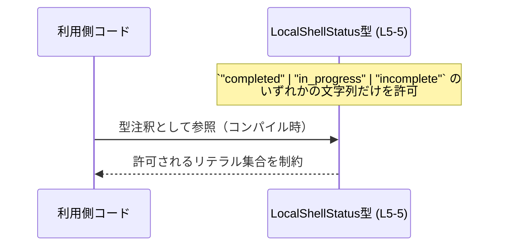

# app-server-protocol/schema/typescript/LocalShellStatus.ts

## 0. ざっくり一言

`LocalShellStatus` は、文字列 `"completed" | "in_progress" | "incomplete"` のいずれかだけを許可する **文字列リテラルのユニオン型** を定義する自動生成ファイルです（LocalShellStatus.ts:L5-5）。

---

## 1. このモジュールの役割

### 1.1 概要

- このファイルは、`LocalShellStatus` という TypeScript の型エイリアス（別名）を定義します（LocalShellStatus.ts:L5-5）。
- `LocalShellStatus` 型は、値が `"completed"`, `"in_progress"`, `"incomplete"` の 3 種類の文字列のいずれかに限定されることをコンパイル時に保証します（LocalShellStatus.ts:L5-5）。
- ファイル先頭のコメントから、この定義は `ts-rs` によって自動生成されており、手動編集しないことが明示されています（LocalShellStatus.ts:L1-3）。

### 1.2 アーキテクチャ内での位置づけ

コードから読み取れる事実:

- `// GENERATED CODE! DO NOT MODIFY BY HAND!` というコメントにより、自動生成されたスキーマ定義であることが分かります（LocalShellStatus.ts:L1-1）。
- `This file was generated by [ts-rs]` というコメントにより、Rust から TypeScript 型を生成するツール `ts-rs` によって生成されていることが分かります（LocalShellStatus.ts:L3-3）。

このことから、アーキテクチャ上の位置づけは次のように整理できます（Rust 側の具体的な型定義の場所は、このチャンクからは不明です）。



> Rust 側の型 `R` の存在と ts-rs の挙動は、`ts-rs` の一般的な仕様に基づく推測ですが、「このファイルが ts-rs によって生成されている」という点はコメントから直接読み取れます（LocalShellStatus.ts:L3-3）。

### 1.3 設計上のポイント

コードから分かる設計上の特徴は次のとおりです。

- **自動生成ファイルであることの明示**  
  - 「GENERATED CODE」「Do not edit this file manually」と書かれており、手動編集を禁止する設計方針が示されています（LocalShellStatus.ts:L1-3）。
- **責務の限定**  
  - 1つの型エイリアス `LocalShellStatus` だけを公開する非常に小さなファイルです（LocalShellStatus.ts:L5-5）。
- **文字列リテラルユニオン型による型安全性**  
  - `"completed" | "in_progress" | "incomplete"` の 3 値に限定することで、TypeScript のコンパイル時にそれ以外の文字列の代入をエラーにできます（LocalShellStatus.ts:L5-5）。
- **状態を持たない**  
  - 実行時のオブジェクトや関数はなく、「型情報のみ」を提供します（LocalShellStatus.ts:L5-5）。
- **エラー・並行性**  
  - 実行時コードを含まないため、このファイル自体はランタイムエラーや並行性（非同期処理・スレッド）とは直接関係しません。  
    TypeScript の型はコンパイル時のみ存在し、JavaScript 出力には含まれないためです。

---

## 2. 主要な機能一覧

このファイルが提供する主要な機能は 1 つです。

- `LocalShellStatus` 型定義: `"completed"`, `"in_progress"`, `"incomplete"` の 3 種類の状態を表す文字列リテラルユニオン型（LocalShellStatus.ts:L5-5）

---

## 3. 公開 API と詳細解説

### 3.1 型一覧（構造体・列挙体など）

| 名前                | 種別                    | 役割 / 用途                                                                 | 定義位置                       |
|---------------------|-------------------------|------------------------------------------------------------------------------|--------------------------------|
| `LocalShellStatus`  | 型エイリアス（ユニオン） | `"completed" \| "in_progress" \| "incomplete"` のいずれかの文字列を表す型   | LocalShellStatus.ts:L5-5      |

#### `LocalShellStatus` 型の意味

- 値として許可されるのは、以下の 3 つの文字列リテラルのみです（LocalShellStatus.ts:L5-5）。
  - `"completed"`
  - `"in_progress"`
  - `"incomplete"`
- これにより、たとえば `"done"` のような別の文字列を `LocalShellStatus` 型の変数に代入すると、TypeScript のコンパイル時にエラーになります（TypeScript の言語仕様に基づく挙動）。

### 3.2 関数詳細（最大 7 件）

- このファイルには **関数・メソッドは定義されていません**（LocalShellStatus.ts 全体）。

### 3.3 その他の関数

- 補助関数やラッパー関数も一切定義されていません（LocalShellStatus.ts 全体）。

---

## 4. データフロー

このファイルには実行時に動作する処理は含まれず、「型定義のみ」が存在します（LocalShellStatus.ts:L5-5）。  
したがって、ランタイム上のデータフローはこのファイル単体からは分かりません。

一方で、型としては他のモジュールからインポートされ、関数の引数・戻り値・オブジェクトのプロパティなどに使われると考えられます。この型定義の利用イメージを、**コンパイル時の関係図**として表現すると次のようになります。



- この図は「コンパイル時に `LocalShellStatus` 型が利用コード `C` の値を制約する」という **概念図** です。
- 実際の呼び出し元モジュール名やパスは、このチャンクには現れていないため **不明** です。

---

## 5. 使い方（How to Use）

### 5.1 基本的な使用方法

`LocalShellStatus` をインポートして、変数や関数の型として利用する例です。  
インポートパスはプロジェクト構成に依存するため、ここでは相対パス例として示します。

```typescript
// LocalShellStatus 型をインポートする例
import type { LocalShellStatus } from "./LocalShellStatus";  // 実際のパスはプロジェクト構成に依存

// 変数の型として利用
let status: LocalShellStatus;           // status には 3 つの文字列のどれかしか代入できない

status = "completed";                   // OK
status = "in_progress";                 // OK
status = "incomplete";                  // OK
// status = "done";                     // コンパイルエラー: "done" は LocalShellStatus ではない
```

- TypeScript の型システムにより、`"done"` などの想定外の値がコンパイル時に検出されます。
- 実行時（JavaScript）には `LocalShellStatus` 型は存在しないため、ランタイムでのチェックは別途実装する必要があります。

### 5.2 よくある使用パターン

#### 1. 関数の引数・戻り値として利用する

状態を受け取ったり返したりする関数の型に `LocalShellStatus` を使う例です。

```typescript
import type { LocalShellStatus } from "./LocalShellStatus";

// コマンドの状態を取得する関数の戻り値として利用
function getShellStatus(): LocalShellStatus {      // 戻り値は3値のどれか
    // 実装例（ダミー）
    return "in_progress";                          // 3 つのいずれかならコンパイルOK
}

// 状態に応じて処理を分岐
function handleShellStatus(status: LocalShellStatus) {  // 引数: LocalShellStatus 型
    switch (status) {
        case "completed":
            console.log("完了しました");
            break;
        case "in_progress":
            console.log("実行中です");
            break;
        case "incomplete":
            console.log("未完了です");
            break;
        // default: 分岐不要（status が3値に限定されているため）
    }
}
```

- `switch` 文で全てのケースを網羅でき、将来値が追加された場合、コンパイラが未対応ケースを検出できる設計に拡張できます（ここでは 3 値固定です）。

#### 2. オブジェクトのプロパティとして利用する

```typescript
import type { LocalShellStatus } from "./LocalShellStatus";

interface LocalShellInfo {
    id: string;                     // シェルを識別するID（例: コマンドID）
    status: LocalShellStatus;       // 状態
}

const info: LocalShellInfo = {
    id: "shell-123",
    status: "completed",            // 3 つのいずれか
};
```

### 5.3 よくある間違い

#### 間違い例: 任意の文字列から無条件に型アサーションする

```typescript
import type { LocalShellStatus } from "./LocalShellStatus";

declare const externalStatus: string;          // 外部入力: 任意の文字列が入る可能性がある

// 悪い例: 検証なしで LocalShellStatus にアサートする
const status = externalStatus as LocalShellStatus;  // コンパイルは通るが、実行時は不正値の可能性
```

- 型アサーション `as LocalShellStatus` はコンパイル時のチェックを回避するため、外部入力に対して無条件に使うと **型安全性が失われます**。

#### 正しい例: 値を検証してから扱う

```typescript
import type { LocalShellStatus } from "./LocalShellStatus";

function isLocalShellStatus(value: string): value is LocalShellStatus {
    // LocalShellStatus の 3 値のみを許可
    return value === "completed" ||
           value === "in_progress" ||
           value === "incomplete";
}

declare const externalStatus: string;

let status: LocalShellStatus;

if (isLocalShellStatus(externalStatus)) {      // 実行時に値を検証
    status = externalStatus;                   // OK: 型ガードにより LocalShellStatus と確定
} else {
    // ここでエラーハンドリングやデフォルト値の設定を行う
    status = "incomplete";
}
```

- このように **型ガード関数** を用意すると、コンパイル時の型安全性と実行時の安全性の両方を確保できます。

### 5.4 使用上の注意点（まとめ）

- **コンパイル時のみ有効**  
  - `LocalShellStatus` は TypeScript 型であり、JavaScript にコンパイルすると削除されます。  
    外部入力（API からの JSON など）については、実行時の検証が別途必要です。
- **型アサーションの乱用に注意**  
  - `as LocalShellStatus` を安易に使うと、型チェックを無効化してしまい、想定外の文字列が紛れ込む可能性があります。
- **自動生成ファイルを直接編集しない**  
  - ファイル先頭のコメントにある通り、手動編集は禁止されています（LocalShellStatus.ts:L1-3）。  
    状態の種類を増やしたい場合などは、**元になっている Rust 側の定義やコード生成設定を変更する必要がある**と考えられます（元定義の場所はこのチャンクからは不明）。

---

## 6. 変更の仕方（How to Modify）

### 6.1 新しい機能を追加する場合

このファイルは `ts-rs` による自動生成ファイルであり、先頭コメントで手動編集禁止が明示されています（LocalShellStatus.ts:L1-3）。  
そのため、**このファイルに直接コードを追加することは推奨されません**。

機能追加の一般的な方針:

1. **元定義の場所を特定する**  
   - `ts-rs` は通常 Rust 側の型から TypeScript 型を生成するため、`LocalShellStatus` に対応する Rust の型定義が存在すると考えられます（コメントと `ts-rs` の仕様に基づく推測）。
   - ただし、どのファイルかはこのチャンクには現れていないため **不明** です。
2. **Rust 側の定義を変更する**  
   - 状態を追加したい場合は、Rust 側の列挙型などに新しい値を追加し、コード生成を再実行する、というフローが想定されます（推測）。
3. **コード生成を実行する**  
   - プロジェクト標準の方法（ビルドスクリプト、Makefile、npmスクリプトなど）で `ts-rs` による生成処理を再実行します。
4. **生成結果を確認する**  
   - 新しい状態が `LocalShellStatus` に反映されていることを確認します。

### 6.2 既存の機能を変更する場合

`LocalShellStatus` の 3 つの文字列リテラルを変更・削除する場合も、**同様に元の生成元を変更する必要があります**。

注意点:

- **呼び出し側への影響**  
  - `LocalShellStatus` を利用している全ての TypeScript コード（関数の引数・戻り値、オブジェクトのプロパティ、switch 分岐など）に影響します。
- **契約（Contract）の変更**  
  - `"completed"` を削除し `"success"` に変更するなど、値の変更は **外部とのインターフェース契約の変更** に相当します。
  - プロトコルのクライアント／サーバー双方で整合性を保つ必要がありますが、その全体像はこのチャンクからは分かりません。
- **ビルド・テストの再実行**  
  - 変更後は TypeScript 側・Rust 側のビルドとテストを再実行し、不整合がないか確認する必要があります。

---

## 7. 関連ファイル

このチャンクには `LocalShellStatus.ts` 以外の具体的なファイル名は現れていません。  
コメントから推測される関連は次の通りです（パスは不明であることを明示します）。

| パス/名称                          | 役割 / 関係                                                                 |
|------------------------------------|-----------------------------------------------------------------------------|
| Rust側の元定義（ファイルパス不明） | `ts-rs` によってこの TypeScript 型へ変換される元の Rust 型と考えられます（コメントと `ts-rs` の一般的な用途に基づく推測）。 |
| 同一ディレクトリ内の他の `.ts` スキーマ（不明） | `schema/typescript` 配下に同様に自動生成された他の型定義が存在する可能性がありますが、このチャンクからは具体的な名前は分かりません。 |

---

### まとめ（安全性・エッジケース・契約の整理）

- **型安全性**: `LocalShellStatus` により許可される文字列が 3 値に限定され、TypeScript コンパイラが誤ったリテラルを検出できます（LocalShellStatus.ts:L5-5）。
- **ランタイム安全性**: 型は実行時に存在しないため、外部入力を受け取る場合は実行時チェック（型ガードなど）が必要です。
- **エッジケース**:
  - 外部から `"completed"` 以外の文字列が来るケース → コンパイル時には検出できないため、実行時検証がないと不正な状態値が紛れます。
- **契約（Contract）**:
  - `LocalShellStatus` を用いる API・メッセージ・DB スキーマなどは、「状態は `"completed" | "in_progress" | "incomplete"` のいずれか」という契約を前提としていると解釈できます（型定義の内容に基づく事実）。
- **並行性**:
  - このファイルは型定義のみであり、非同期処理やスレッドセーフティとは直接関係しません。  
    並行性の問題は、この型を利用する実行時コード側で発生しうるものとなります。
