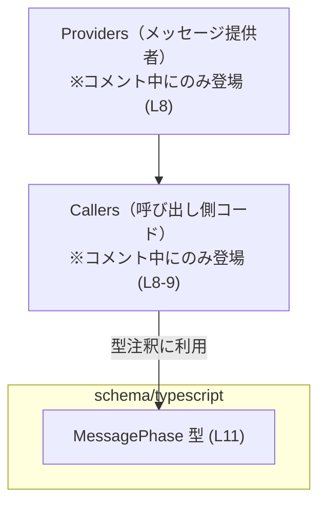
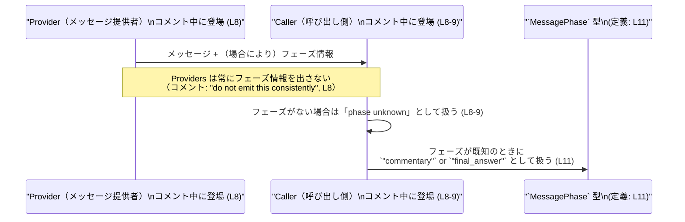

# app-server-protocol/schema/typescript/MessagePhase.ts

## 0. ざっくり一言

アシスタントのメッセージが「途中コメント（commentary）」か「最終回答（final_answer）」かを区別するための、**文字列リテラル union 型 `MessagePhase` を定義する生成済み TypeScript ファイル**です (MessagePhase.ts:L1-3, L11)。

---

## 1. このモジュールの役割

### 1.1 概要

- このモジュールは、アシスタントメッセージの「フェーズ」を  
  `"commentary"` または `"final_answer"` の 2 値で分類するための型 `MessagePhase` を提供します (MessagePhase.ts:L11)。
- JSDoc コメントにより、「途中のコメント的な文か最終回答テキストかを分類する」目的が明示されています (MessagePhase.ts:L5-6)。
- 生成コードであり、手動編集は想定されていません (MessagePhase.ts:L1-3)。

### 1.2 アーキテクチャ内での位置づけ

このファイルは **TypeScript スキーマ定義層**に属し、他モジュールから `MessagePhase` 型として参照されることを意図していると考えられます（`export type` で公開されているため (MessagePhase.ts:L11)）。

コメント中には「Providers」「callers」という語が出てきます (MessagePhase.ts:L8-9)。したがって、少なくとも次の 3 つの役者が存在する前提の型定義と読み取れます。

- **Providers**: メッセージを生成する外部の提供者（モデル API 等）  
- **Callers**: それを利用する側のコード
- **MessagePhase 型**: メッセージのフェーズを表す型（このファイル）

依存関係のイメージを Mermaid で示します（呼び出し側・プロバイダの具体的な実装はこのチャンクには現れません）。



### 1.3 設計上のポイント

- **生成コードであることが明示**  
  - 冒頭コメントで「GENERATED CODE」「Do not edit this file manually」と書かれています (MessagePhase.ts:L1-3)。
- **純粋な型定義のみ**  
  - `export type MessagePhase = "commentary" | "final_answer";` だけが本体で、関数やクラスはありません (MessagePhase.ts:L11)。
- **文字列リテラル union 型**  
  - TypeScript の string literal union により、コンパイル時に `"commentary"` か `"final_answer"` 以外の値を禁止する設計です (MessagePhase.ts:L11)。
- **フェーズ未定義（unknown）への配慮**  
  - コメントで「callers must treat `None` as 'phase unknown'」とあり (MessagePhase.ts:L8-9)、フェーズ情報がないケースも考慮する契約が示唆されています（ただしその表現方法はこの TypeScript 型のみからは確定できません）。
- **状態や並行性を持たない**  
  - 値オブジェクトや関数を含まず、単一の型エイリアスのみなので、内部状態や並行性（スレッド・非同期処理）に関する要素はありません (MessagePhase.ts:L1-11)。

---

## 2. 主要な機能一覧

このファイルが提供する機能は 1 つです。

- `MessagePhase` 型: アシスタントメッセージを **「commentary」または「final_answer」** の 2 種類のフェーズに分類するための TypeScript の文字列リテラル union 型 (MessagePhase.ts:L11)。

---

## 3. 公開 API と詳細解説

### 3.1 型一覧（構造体・列挙体など）

このファイルに登場する公開型は次の 1 つです。

| 名前 | 種別 | 役割 / 用途 | 定義箇所 |
|------|------|-------------|-----------|
| `MessagePhase` | 型エイリアス（string literal union） | アシスタントメッセージが「途中コメント」か「最終回答」かを表すフェーズ情報の型 | MessagePhase.ts:L11 |

#### 3.1.1 `MessagePhase` 型の詳細

**概要**

- アシスタントメッセージを **「interim commentary」** か **「final answer text」** のどちらかに分類するための型です (MessagePhase.ts:L5-6)。
- 型そのものは文字列の union であり、実行時ロジックは含みません (MessagePhase.ts:L11)。

**型定義**

```typescript
export type MessagePhase = "commentary" | "final_answer";
```

（MessagePhase.ts:L11）

**取りうる値**

- `"commentary"`  
  - コメントによると「interim commentary」に相当するフェーズと解釈できます (MessagePhase.ts:L5-6)。
- `"final_answer"`  
  - コメントによると「final answer text」に相当するフェーズと解釈できます (MessagePhase.ts:L5-6)。

それ以外の文字列リテラルは、コンパイル時に `MessagePhase` 型としては認められません。

**言語固有の安全性 / エラー / 並行性**

- **型安全性（コンパイル時）**
  - `MessagePhase` 型に他の文字列（例: `"final"` や `"answer"`）を代入すると、TypeScript コンパイラがエラーにします。
  - これにより、「スペルミス」や「値のばらつき」による不具合をコンパイル時に検出できます。
- **実行時の挙動**
  - TypeScript の型はコンパイル時のみ存在し、実行時は消えるため、JavaScript に変換された後は自動的なバリデーションは行われません。
  - したがって、外部入力（API レスポンス等）をそのまま信頼すると、実行時には `"commentary"` / `"final_answer"` 以外の文字列が入りうる点には注意が必要です（このファイルには実行時チェックはありません (MessagePhase.ts:L1-11)）。
- **エラー**
  - このファイル自体には関数がないため、「例外を投げる」「エラーを返す」といったランタイムエラーの発生箇所はありません。
  - エラーはあくまで TypeScript の型チェックエラーとしてコンパイル時に発生します。
- **並行性**
  - 非同期処理 (`Promise` / `async` 関数) や共有状態を扱うコードはなく、並行性に関する懸念点はこのファイル単体では存在しません (MessagePhase.ts:L1-11)。

**Contracts / Edge cases（契約とエッジケース）**

- 契約（読み取れる範囲）:
  - `MessagePhase` 型の値は `"commentary"` か `"final_answer"` のいずれかである (MessagePhase.ts:L11)。
  - コメントより、「Providers がフェーズ情報を常に出さない」ケースがあり、その場合は `None` を「phase unknown」として扱う必要がある (MessagePhase.ts:L8-9)。  
    TypeScript 側でこれをどう表現するか（例: `MessagePhase | null | undefined` など）は、このファイルだけからは分かりません。
- エッジケース:
  - フェーズが **存在しない（unknown）**:
    - コメント内で「callers must treat `None` as 'phase unknown'」とあるため (MessagePhase.ts:L8-9)、フェーズ未設定を意味する値（`None` 相当）がありうる契約になっています。
    - ただし TypeScript の `MessagePhase` 型自体には `null` や `undefined` は含まれていません (MessagePhase.ts:L11)。  
      そのため、「フェーズがない」ケースは別のレイヤ（オプショナルプロパティ、Union 型など）で表現している可能性がありますが、このチャンクには現れません。
  - 型外の文字列:
    - TypeScript の型注釈が適切に付いていればコンパイルエラーになりますが、実行時に動的に組み立てたオブジェクトなどでは `"commentary"` / `"final_answer"` 以外の文字列が入り込む可能性があります。
    - このファイルは実行時チェックを提供しないため、必要であれば別途ランタイムバリデーションが必要です。

**使用上の注意点**

- このファイルは生成コードであり、**直接編集してはならない**と明示されています (MessagePhase.ts:L1-3)。
- フェーズが不明なケース（`None`）をどう表現するかは、この型単体では表せないため、上位の型やロジックで `MessagePhase` が「存在しない」状態を扱う設計が必要です（ただしその実装はこのチャンクには現れません）。
- 実行時の入力データが自由文字列の場合、`MessagePhase` 型にキャストする前に `"commentary"` / `"final_answer"` のいずれかかをチェックすることが望ましいです（このファイルにはチェック機構はありません）。

### 3.2 関数詳細

- このファイルには関数定義・メソッド定義は存在しません (MessagePhase.ts:L1-11)。  
  したがって、詳細解説の対象となる公開関数はありません。

### 3.3 その他の関数

- 同上の理由により、補助的な関数やラッパー関数も存在しません (MessagePhase.ts:L1-11)。

---

## 4. データフロー

### 4.1 コメントから読み取れるデータフローの抽象図

JSDoc コメントから、少なくとも次のようなやり取りが想定されています。

- **Providers** がメッセージ（と場合によってはフェーズ情報）を出力する (MessagePhase.ts:L8)。
- **Callers** はそれを受け取り、フェーズが未定義 (`None`) の場合には「phase unknown」として扱う必要がある (MessagePhase.ts:L8-9)。
- `MessagePhase` 型は、フェーズが既知である場合に `"commentary"` / `"final_answer"` どちらかであることを表現するために使われます (MessagePhase.ts:L11)。

この関係をシーケンス図として表現します（具体的な関数名・フィールド名はこのチャンクには現れないため、抽象的な図です）。



> 注: 上記はコメントに現れる役者と `MessagePhase` 型の関係を抽象化した図であり、具体的な API/関数の姿はこのチャンクからは分かりません。

---

## 5. 使い方（How to Use）

このセクションでは、`MessagePhase` 型を用いる典型的な利用例を **仮想コード** として示します。  
※ 実際のプロジェクト内の import パスや周辺型は、このチャンクからは分からないため、例はあくまでイメージです。

### 5.1 基本的な使用方法

`MessagePhase` 型をメッセージ構造体のプロパティとして使う基本例です。

```typescript
// 仮の import。実際のパスはこのチャンクからは分かりません。
import type { MessagePhase } from "./MessagePhase"; // MessagePhase.ts:L11 で定義されている型を想定してインポート

// アシスタントメッセージを表す型の一例
interface AssistantMessage {                         // メッセージ全体を表すインターフェースの例
    content: string;                                 // メッセージ本文
    phase?: MessagePhase;                            // メッセージのフェーズ（任意）: "commentary" | "final_answer"
}

// MessagePhase を使って分岐する例
function handleMessage(msg: AssistantMessage) {      // メッセージを処理する関数の例
    if (msg.phase === "final_answer") {              // フェーズが "final_answer" の場合
        console.log("最終回答として扱う:", msg.content);
    } else if (msg.phase === "commentary") {         // フェーズが "commentary" の場合
        console.log("途中コメントとして扱う:", msg.content);
    } else {                                         // phase がない / 不明な場合
        console.log("フェーズ不明として扱う:", msg.content);
    }
}
```

このように、`MessagePhase` 型を用いることで、`phase` に許される文字列を `"commentary"` / `"final_answer"` に限定できます。

### 5.2 よくある使用パターン

#### パターン 1: Discriminated Union の一部として使用する

```typescript
import type { MessagePhase } from "./MessagePhase";

// フェーズ確定メッセージ
interface KnownPhaseMessage {
    content: string;
    phase: MessagePhase;                             // 必須: "commentary" | "final_answer"
}

// フェーズ不明メッセージ
interface UnknownPhaseMessage {
    content: string;
    phase: undefined;                                // フェーズ未定義を明示
}

// Discriminated Union
type AnyPhaseMessage = KnownPhaseMessage | UnknownPhaseMessage;

function isFinalAnswer(msg: AnyPhaseMessage): boolean {
    // phase の値に応じて判定する
    return msg.phase === "final_answer";             // "final_answer" 以外は false
}
```

#### パターン 2: API パラメータに使う

```typescript
import type { MessagePhase } from "./MessagePhase";

interface FetchMessagesParams {
    phase?: MessagePhase;                            // 特定フェーズのみ取得したい場合に指定
}

// 仮の関数シグネチャ例
function fetchMessages(params: FetchMessagesParams) {
    // params.phase が指定されている場合は、そのフェーズに絞って取得する…といったフィルタリングが考えられます。
    // 実装はこのチャンクからは分かりません。
}
```

### 5.3 よくある間違い

`MessagePhase` 型を使う際に起こりうる典型的な誤用例を示します。

```typescript
import type { MessagePhase } from "./MessagePhase";

// 間違い例: 定義されていない文字列を使ってしまう
const wrongPhase: MessagePhase = "final";           // ❌ コンパイルエラー: "final" は "commentary" | "final_answer" に含まれない

// 正しい例: 定義済みの文字列のみを使用する
const okPhase1: MessagePhase = "final_answer";      // ✅ OK
const okPhase2: MessagePhase = "commentary";        // ✅ OK

// 間違い例: any 経由で型チェックを回避してしまう
const fromAny: any = "final";                       // any 型は何でも通る
const unsafePhase: MessagePhase = fromAny;          // ❌ 実行時には "final" が混入しうるが、コンパイラはチェックできない

// 正しい例: unknown + 自前チェック
const fromUnknown: unknown = "final_answer";

function toMessagePhase(value: unknown): MessagePhase | undefined {
    if (value === "commentary" || value === "final_answer") { // 手動でチェック
        return value;                                         // この時点で value は MessagePhase 型と互換
    }
    return undefined;                                         // 不正値は undefined として扱う
}
```

### 5.4 使用上の注意点（まとめ）

- **生成コードである点**  
  - コメントに「GENERATED CODE! DO NOT MODIFY BY HAND!」とあり (MessagePhase.ts:L1-3)、直接編集しないことが前提です。
- **実行時バリデーションは別途必要**  
  - TypeScript 型はコンパイル時のみ有効であり、実行時には `"commentary"` / `"final_answer"` 以外の値が混入する可能性があります。
  - 外部入力（Providers からのレスポンスなど）に対しては、必要に応じてランタイムチェックを行う必要があります（このファイルにはそのロジックはありません）。
- **フェーズ不明 (`None`) への対応**  
  - コメントで `None` を「phase unknown」として扱う必要があるとされているため (MessagePhase.ts:L8-9)、`MessagePhase` を使う側では「フェーズが存在しない状態」をどう表現するか（`undefined` / `null` / 別の型など）を明確に決めておく必要があります。

---

## 6. 変更の仕方（How to Modify）

### 6.1 新しい機能を追加する場合

このファイルは生成コードであり、次のコメントが明示されています。

- `// GENERATED CODE! DO NOT MODIFY BY HAND!` (MessagePhase.ts:L1)
- `// This file was generated by [ts-rs](...). Do not edit this file manually.` (MessagePhase.ts:L3)

したがって、**直接このファイルを編集するのではなく、元になっている定義（おそらく Rust 側と ts-rs の設定）を変更して再生成する必要があります**。  
このチャンクには元定義の場所や内容は現れないため、以下は一般的な手順の説明となります。

- 新しいフェーズ（例: `"tool_result"` など）を追加したい場合:
  1. 元のスキーマ定義（Rust の型など）に新しいバリアントを追加する。  
     ※ 具体的な場所はこのチャンクからは分かりません。
  2. ts-rs 等のコード生成プロセスを再実行する。
  3. 生成された TypeScript ファイルで `MessagePhase` の union に新しい文字列が含まれていることを確認する。

### 6.2 既存の機能を変更する場合

`MessagePhase` の値を変更・削除する場合の注意点を、契約の観点から整理します。

- **値の変更（例: `"final_answer"` → `"final"`）**
  - 既存コードが `"final_answer"` に依存している場合、ビルド時にコンパイルエラーが発生するため、影響箇所を洗い出しやすいという利点があります。
  - 一方で、外部システムやストレージに `"final_answer"` 文字列が保存されている場合は互換性問題が起こりうるため、型変更前にその契約を確認する必要があります（このチャンクには外部契約は現れません）。
- **値の追加**
  - 追加されたフェーズに対して分岐処理が未対応な既存コードは、`switch` 文で `default` に落ちる、あるいは単に無視される、といった挙動になります。
  - 型的にはコンパイルは通るケースもあるため、`switch` 文に `never` チェックを入れるなどのパターンでコンパイル時に取りこぼしを検知する設計が望ましいです（ただし、そのようなコードが実際にあるかどうかはこのチャンクからは分かりません）。

---

## 7. 関連ファイル

このチャンクには `MessagePhase` 型を利用しているファイルは現れず、関連ファイルのパスも明示されていません。

| パス | 役割 / 関係 |
|------|------------|
| （不明） | `MessagePhase` を import して使用しているモジュール。`export type` で公開されているため (MessagePhase.ts:L11)、少なくとも何らかの利用箇所が存在することが想定されますが、このチャンクには現れません。 |

テストコードや生成元（Rust 側の型定義など）も、このチャンク単体からは特定できません。

---

### 付録: コンポーネントインベントリー（行番号付きまとめ）

最後に、このファイル内のコンポーネントを行番号付きで整理します。

| コンポーネント | 種別 | 内容 | 行範囲 |
|----------------|------|------|--------|
| 生成コード警告コメント | コメント | 「GENERATED CODE」「Do not edit manually」等の注意書き | MessagePhase.ts:L1-3 |
| フェーズ説明 JSDoc | コメント | メッセージフェーズの意味、Providers/Callers の扱い、`None` = phase unknown の説明 | MessagePhase.ts:L5-9 |
| `MessagePhase` | 型エイリアス | `"commentary" \| "final_answer"` という文字列リテラル union 型 | MessagePhase.ts:L11 |

このインベントリー以外に、関数・クラス・列挙体・定数などは定義されていません (MessagePhase.ts:L1-11)。
