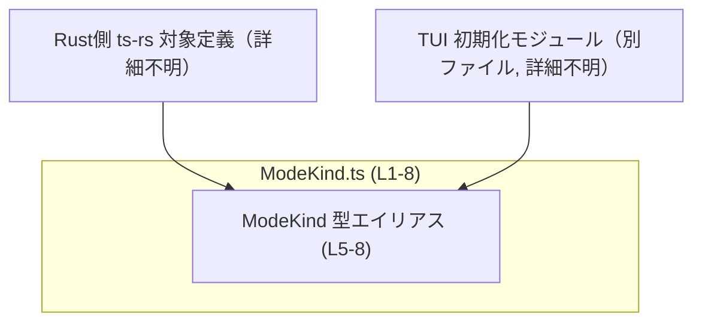
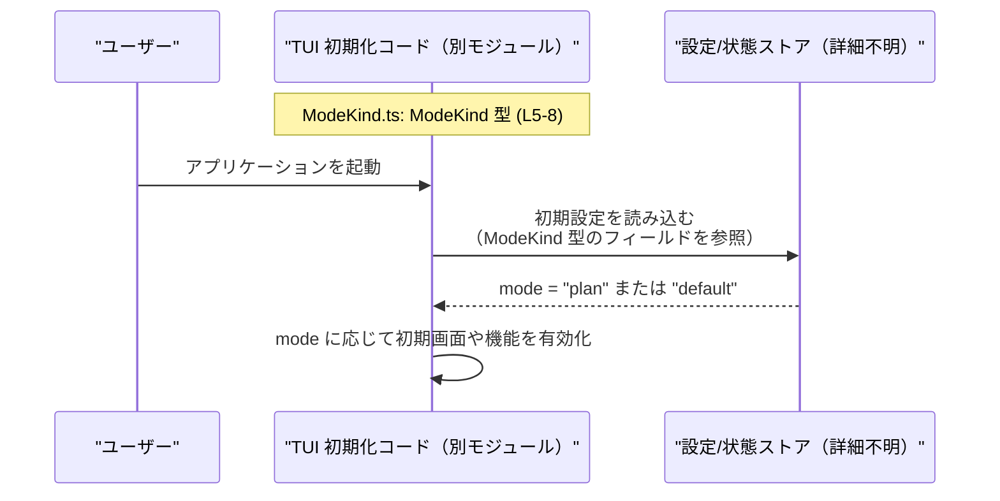

# app-server-protocol/schema/typescript/ModeKind.ts コード解説

## 0. ざっくり一言

- TUI（テキストユーザーインターフェース）が起動するときの「初期コラボレーションモード」を表す、文字列リテラルのユニオン型（型エイリアス）を定義した自動生成ファイルです（`ModeKind.ts:L5-8`）。

---

## 1. このモジュールの役割

### 1.1 概要

- このモジュールは、TUI が起動した直後にどの協調モードを使うかを **型レベルで制約するための型定義** を提供します（コメントより, `ModeKind.ts:L5-7`）。
- 具体的には、`"plan"` または `"default"` のいずれかのみを許可する `ModeKind` 型を公開し、TypeScript の静的型チェックによって不正なモード文字列の使用を防ぎます（`ModeKind.ts:L8`）。

### 1.2 アーキテクチャ内での位置づけ

- このファイル自身は **型定義のみ** を持ち、関数やロジックは含みません（`ModeKind.ts:L8`）。
- 冒頭コメントから、このファイルは Rust 側の定義を元に `ts-rs` によって自動生成されていることが分かります（`ModeKind.ts:L1-3`）。
- コメントから読み取れる用途としては、TUI 初期化処理を行う別モジュールが、`ModeKind` を用いて初期モードを決定する構造と解釈できます（用途はコメントに基づく推測, `ModeKind.ts:L5-7`）。



> 上図は、コメントから読み取れる範囲での位置づけを示した概念図です。Rust 側定義 → `ts-rs` → `ModeKind.ts` → TUI 初期化コード、という依存関係が想定されます。

### 1.3 設計上のポイント

- **自動生成コード**  
  - ファイル先頭に「GENERATED CODE」「Do not edit manually」と明記されており（`ModeKind.ts:L1-3`）、人手による直接編集は前提にされていません。
- **純粋な型定義のみ**  
  - 実行時コード（関数・クラスなど）は存在せず、コンパイル時の型制約だけを提供します（`ModeKind.ts:L8`）。
- **文字列リテラルユニオン型**  
  - `ModeKind` は `"plan" | "default"` という文字列リテラルのユニオン型であり、許可されるモード値を限定します（`ModeKind.ts:L8`）。
- **エラーハンドリング／安全性**  
  - 型レベルの制約であり、誤った文字列を代入した場合は **コンパイル時エラー** になります。ランタイムの例外処理ロジックはこのファイルには存在しません。

---

## 2. 主要な機能一覧（コンポーネントインベントリー）

このモジュールで定義される公開コンポーネントは 1 つです。

| 名前      | 種別           | 説明                                                                 | 定義位置 |
|-----------|----------------|----------------------------------------------------------------------|----------|
| `ModeKind` | 型エイリアス（文字列リテラルユニオン） | TUI 起動時の初期コラボレーションモードを `"plan"` または `"default"` に制約する型 | `ModeKind.ts:L5-8` |

---

## 3. 公開 API と詳細解説

### 3.1 型一覧（構造体・列挙体など）

| 名前      | 種別           | 役割 / 用途                                                                 | 定義位置 |
|-----------|----------------|------------------------------------------------------------------------------|----------|
| `ModeKind` | 型エイリアス（`"plan" \| "default"`） | TUI の初期モードを表す型。許可される値を `"plan"` と `"default"` のみに制限します。 | `ModeKind.ts:L5-8` |

### 3.2 詳細解説: `ModeKind` 型エイリアス

`ModeKind` は関数ではありませんが、重要な公開 API であるため、関数テンプレートに準じて詳細を整理します。

#### `export type ModeKind = "plan" | "default";`

**概要**

- `ModeKind` は、TUI の起動時に使用する「初期コラボレーションモード」を表す文字列リテラルユニオン型です（`ModeKind.ts:L5-8`）。
- 型として `"plan"` または `"default"` の **どちらか一方のみ** を許可し、それ以外の文字列をコンパイル時に排除します（`ModeKind.ts:L8`）。

**バリアント（許可される値）**

| 値        | 説明                               | 根拠 |
|-----------|------------------------------------|------|
| `"plan"`   | 「計画（plan）」モードを示すと解釈できる値。具体的な意味はこのチャンクには現れません。 | `ModeKind.ts:L8` |
| `"default"` | デフォルト動作モードを示す値。詳細な挙動はこのチャンクには現れません。               | `ModeKind.ts:L8` |

> `"plan"` / `"default"` の具体的な機能差は、本ファイルのコメントやコードからは判断できません。

**引数 / 戻り値**

- `ModeKind` は値ではなく型定義のため、直接の引数・戻り値はありません。
- 典型的には、関数の引数や設定オブジェクトのプロパティの型として使用されることが想定されます（用途はコメントからの推測, `ModeKind.ts:L5-7`）。

**内部処理の流れ（アルゴリズム）**

- 実行時の処理は一切含まれていません。コンパイル時に TypeScript コンパイラが次のように振る舞います。
  - `ModeKind` 型の変数に文字列リテラルが代入されるとき、その値が `"plan"` または `"default"` かどうかをチェックする。
  - フォールバックとして `string` 型を受け取る関数に `ModeKind` を渡すことはできますが、逆方向（`string` を `ModeKind` として扱う）は安全でないため、型チェックが必要になります（一般的な TypeScript の挙動）。

**Examples（使用例）**

以下は、この型を利用する側の代表的なパターン例です（いずれもこのチャンクには存在しないコードであり、利用イメージを示すものです）。

```typescript
// ModeKind 型をインポートする例
import type { ModeKind } from "./ModeKind";          // ModeKind.ts (L5-8) に定義された型を参照している想定

// TUI の初期化時に ModeKind を引数として受け取る関数
function initTui(mode: ModeKind) {                   // mode は "plan" または "default" のみ許可される
    if (mode === "plan") {                           // "plan" モード時の初期化
        // 計画用の画面や状態を準備する処理を書く想定
    } else {                                         // "default" モード時の初期化
        // 通常モードの初期化処理を書く想定
    }
}

// 正しい使い方
const mode1: ModeKind = "plan";                      // OK
const mode2: ModeKind = "default";                   // OK

// 間違い例（コンパイルエラーになる）
const mode3: ModeKind = "planning";                  // エラー: "planning" は ModeKind に含まれない
```

**Errors / Panics**

- このファイル自体にはランタイムエラーや例外を投げるコードは存在しません。
- 型安全性に関して:
  - `"planning"` や `"foo"` のような文字列を `ModeKind` 型の変数に代入すると、**コンパイルエラー** になります（TypeScript の型チェック機能による）。
  - ランタイム上は単なる文字列であり、型情報は消えます。そのため、外部から渡ってきた任意の文字列を `ModeKind` として扱う場合には、アプリケーション側で検証が必要です。この検証ロジックは本チャンクには含まれていません。

**Edge cases（エッジケース）**

- `ModeKind` に対する代表的なエッジケースは次の通りです。
  - **空文字列 `""`**  
    - `ModeKind` の定義には空文字列が含まれていないため、`const m: ModeKind = "";` はコンパイルエラーになります。
  - **大文字・小文字の違い**  
    - `"Plan"`, `"PLAN"` などは `ModeKind` に含まれません。厳密に `"plan"`（小文字）と `"default"` のみ許可されます（`ModeKind.ts:L8`）。
  - **`string` との相互運用**  
    - `ModeKind` は `string` の部分型なので、`ModeKind` を `string` として使うのは安全ですが、`string` を `ModeKind` に代入する場合は型チェックが必要です。
  - **`null` / `undefined`**  
    - `ModeKind` の定義には `null` や `undefined` は含まれていないため、これらを直接代入しようとするとコンパイルエラーになります。

**使用上の注意点**

- このファイルは自動生成コードであり、コメントに「Do not edit this file manually」と明記されているため、**直接編集しないことが前提** です（`ModeKind.ts:L1-3`）。
- 新しいモード（例: `"review"`）を追加する場合は、このファイルではなく、`ts-rs` の生成元である Rust 側の定義を変更し、再生成する必要があると考えられます（自動生成のコメントに基づく推測, `ModeKind.ts:L1-3`）。
- ランタイムにおける入力（設定ファイルやユーザー入力）からモード文字列を受け取る場合、それが `"plan"` / `"default"` のどちらかであるかを **アプリケーション側で検証** する必要があります。この検証処理は本チャンクには存在しません。

### 3.3 その他の関数

- このファイルには関数やメソッドは定義されていません（`ModeKind.ts:L1-8`）。

---

## 4. データフロー

このファイル自体には処理ロジックがないため、**内部データフローは存在しません**。  
ただし、コメントから読み取れる用途（TUI 起動時の初期モード）に基づき、外部の典型的な利用シナリオを概念的に示します。



> 上記は `ModeKind` のコメント（`ModeKind.ts:L5-7`）から推測した利用イメージであり、実際の実装コードはこのチャンクには現れません。

---

## 5. 使い方（How to Use）

### 5.1 基本的な使用方法

`ModeKind` を関数の引数として使用し、初期モードごとに処理を分ける例です。

```typescript
// ModeKind 型をインポートする                                // ModeKind.ts (L5-8) の定義を利用する想定
import type { ModeKind } from "./ModeKind";                  // 実際の相対パスはプロジェクト構成に依存（このチャンクからは不明）

// TUI の初期化関数の例                                      // 初期モードを ModeKind で受け取る
function initTui(mode: ModeKind) {                           // mode は "plan" または "default" のみ許可される
    if (mode === "plan") {                                   // "plan" モードの場合の処理
        console.log("plan モードで起動します");              // ここではログ出力を例示
    } else {                                                 // "default" モードの場合の処理
        console.log("default モードで起動します");           // デフォルトモードの処理
    }
}

// 呼び出し側の例                                            // 呼び出し時にも ModeKind の制約が働く
const mode: ModeKind = "plan";                               // 正しい値なのでコンパイルが通る
initTui(mode);                                               // initTui を安全に呼び出せる

// const badMode: ModeKind = "planning";                     // コンパイルエラー: "planning" は ModeKind に含まれない
// initTui(badMode);
```

このように、`ModeKind` を使うことで、TUI 初期化時に許可されるモードの値を **型レベルで限定** できます。

### 5.2 よくある使用パターン

1. **設定オブジェクトのプロパティとして使用する**

```typescript
// 設定オブジェクトの型定義の例                               // ModeKind をフィールドとして利用
import type { ModeKind } from "./ModeKind";                  // ModeKind 型を利用

interface TuiConfig {                                        // TUI の設定を表すインターフェース
    initialMode: ModeKind;                                   // 初期モードを ModeKind で制約
    // その他の設定項目...
}

// 設定値を作成する例
const config: TuiConfig = {                                  // config は TuiConfig 型
    initialMode: "default",                                  // "plan" か "default" のみ許可
};
```

1. **`string` から `ModeKind` への変換（型ガードの利用イメージ）**

```typescript
import type { ModeKind } from "./ModeKind";                  // ModeKind 型を利用

// 任意の文字列を ModeKind に絞り込む型ガードの例（利用イメージ）
function isModeKind(value: string): value is ModeKind {      // value が ModeKind かどうかを判定する関数
    return value === "plan" || value === "default";          // ModeKind.ts (L8) に基づくチェック
}

function parseMode(input: string): ModeKind | null {         // 入力文字列を ModeKind に変換する例
    if (isModeKind(input)) {                                 // ModeKind であれば
        return input;                                        // そのまま ModeKind として返す
    }
    return null;                                             // 不正な値は null 扱い（挙動はアプリケーション毎に異なる）
}
```

> `isModeKind` / `parseMode` はこのファイルには定義されていません。`ModeKind` を安全に利用するための実装例です。

### 5.3 よくある間違い

```typescript
import type { ModeKind } from "./ModeKind";

// 間違い例: 許可されていない文字列を使う
const badMode: ModeKind = "PLAN";        // エラー: "PLAN" は ModeKind に含まれない（大文字小文字が違う）

// 間違い例: string をそのまま ModeKind に代入する
declare const rawMode: string;
// const mode: ModeKind = rawMode;       // エラー: string から ModeKind への代入は安全でない

// 正しい例: 型ガードや変換関数を挟む
function isModeKind(v: string): v is ModeKind {
    return v === "plan" || v === "default";
}

let mode: ModeKind;
if (isModeKind(rawMode)) {
    mode = rawMode;                      // OK: 型ガードにより rawMode が ModeKind と確定
    // mode を使った処理を書く
}
```

### 5.4 使用上の注意点（まとめ）

- `ModeKind` は `"plan"` と `"default"` のみを許可するため、**新しいモードを追加したい場合は自動生成元の定義を変更し、再生成する必要があります**（自動生成コメントに基づく推測, `ModeKind.ts:L1-3`）。
- ランタイム入力を直接 `ModeKind` として扱うことは安全ではないため、**必ず文字列チェックや型ガードで検証** する必要があります。
- このファイルは自動生成されるため、プロジェクトのビルドやコード生成プロセスで上書きされます。直接編集すると変更が失われる可能性があります。

---

## 6. 変更の仕方（How to Modify）

### 6.1 新しい機能を追加する場合（例: 新しいモードを追加）

このファイルは自動生成であるため、直接編集ではなく生成元を変更する必要があります。

1. **Rust 側の ts-rs 対象定義を変更**  
   - コメントに `ts-rs` による生成とあるため（`ModeKind.ts:L1-3`）、Rust サイドの対応する型（たとえば `enum ModeKind` など）が存在すると考えられます。  
   - そこに新しいバリアント（例: `Review`）を追加することが必要です（Rust 側コードはこのチャンクには現れません）。
2. **コード生成プロセスを実行**  
   - `ts-rs` を用いたコード生成ステップを再実行し、新しい `ModeKind.ts` を生成します。
3. **TypeScript 側の利用コードを更新**  
   - `ModeKind` に新しい値が追加された場合、それを扱う `switch` / `if` 文などの分岐処理を更新する必要があります。

> 生成元やビルド手順の詳細は、このチャンクからは分かりません。「ts-rs による自動生成」というコメントに基づく一般的な推測です（`ModeKind.ts:L1-3`）。

### 6.2 既存の機能を変更する場合（例: `"plan"` を `"planning"` に変更）

- 変更前に確認すべきこと
  - `"plan"` / `"default"` がどこで使用されているかを検索し、影響範囲を把握する必要があります（使用箇所はこのチャンクには現れません）。
  - 文字列値を外部とのプロトコルや設定ファイルフォーマットとして使用している場合、後方互換性への影響が大きくなります。
- 変更時の注意点
  - 自動生成ファイルは直接編集せず、Rust 側の定義を修正し再生成することが必要です（`ModeKind.ts:L1-3`）。
  - 文字列値の変更は、TypeScript 側だけでなく、サーバー側や他クライアントとの通信仕様にも影響する可能性があります。この点は本チャンクからは分かりませんが、一般的な注意点として挙げられます。
- 変更後に行うべきこと
  - TypeScript のコンパイルを実行して、`ModeKind` の変更によりビルドエラーになる箇所を洗い出す。
  - 必要に応じてテストを実行し、動作確認を行う。テストコードはこのチャンクには現れません。

---

## 7. 関連ファイル

このチャンクから特定のファイルパスは分かりませんが、論理的に関連が強いコンポーネントは次の通りです。

| パス / コンポーネント名          | 役割 / 関係 |
|----------------------------------|------------|
| Rust 側の `ts-rs` 対象定義（パス不明） | `ModeKind.ts` の生成元。`ModeKind` の実体定義とバリアントが置かれていると考えられます（`ModeKind.ts:L1-3` に基づく推測）。 |
| TUI 初期化モジュール（パス不明）      | コメントにある「Initial collaboration mode to use when the TUI starts」を実際に利用するコードが存在すると考えられます（`ModeKind.ts:L5-7` に基づく推測）。 |
| 設定・コンフィグ関連の TypeScript ファイル（パス不明） | TUI の初期モードを設定ファイルや環境変数から読み込む場合、その型として `ModeKind` を利用する可能性があります。このチャンクには現れません。 |

---

### 付記: バグ・セキュリティ・パフォーマンス観点（簡潔な整理）

- **バグの可能性**
  - このファイル自体は型定義のみのため、ロジック由来のバグは含まれません。
  - ただし、`ModeKind` の値を期待する箇所で、ランタイムに検証を行わないと、不正な文字列が混入した場合に意図しない挙動を招く可能性があります（検証コードは別モジュール側の責務です）。
- **セキュリティ**
  - 直接的なセキュリティリスクとなる処理（I/O、認証、暗号化など）は一切含まれていません。
- **並行性**
  - 実行時状態を保持しない純粋な型定義のため、スレッドセーフティ・並行アクセスの問題はありません。
- **パフォーマンス**
  - コンパイル時の型チェックにのみ関わるため、ランタイムパフォーマンスへの影響は事実上ありません。
