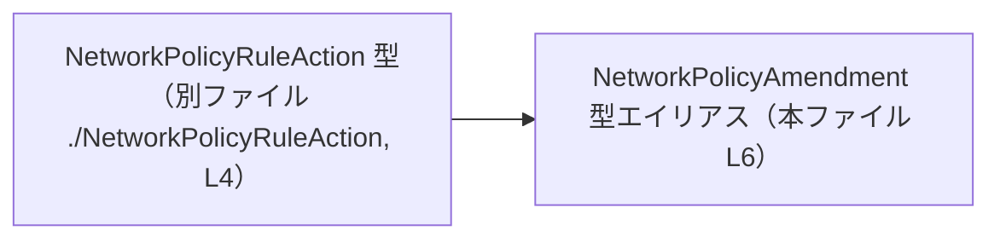
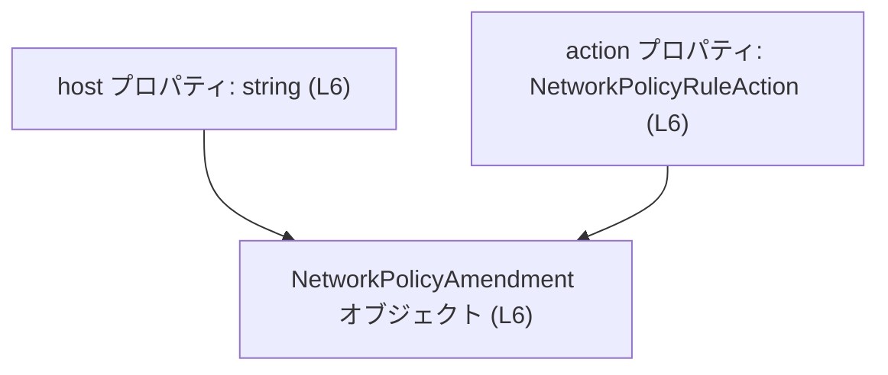
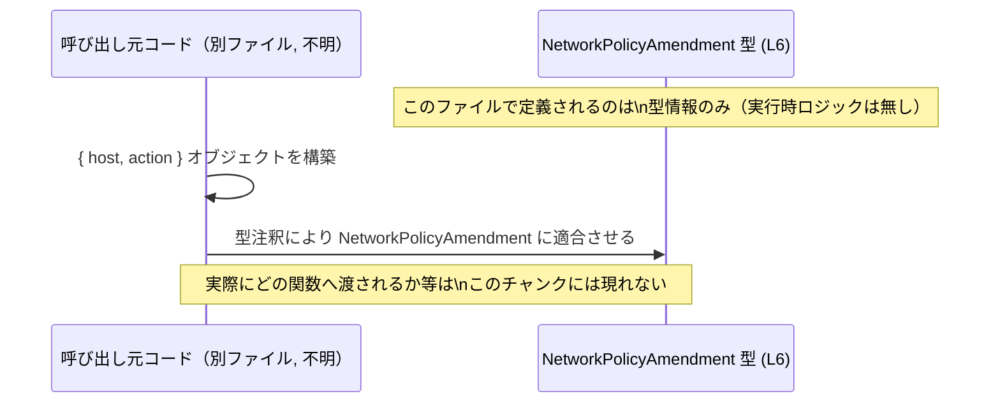

# app-server-protocol/schema/typescript/NetworkPolicyAmendment.ts

## 0. ざっくり一言

`NetworkPolicyAmendment` という名前の **オブジェクト型（型エイリアス）** を 1 つだけ定義する、ts-rs により自動生成された TypeScript ファイルです（`NetworkPolicyAmendment.ts:L1-3, L6`）。

---

## 1. このモジュールの役割

### 1.1 概要

- コメントにある通り、このファイルは [`ts-rs`](https://github.com/Aleph-Alpha/ts-rs) によって自動生成されています（`NetworkPolicyAmendment.ts:L1-3`）。
- `NetworkPolicyAmendment` 型を定義し、その中に `host: string` と `action: NetworkPolicyRuleAction` という 2 つのプロパティを持つオブジェクトの静的型情報を提供します（`NetworkPolicyAmendment.ts:L6`）。
- 型名からは「ネットワークポリシーの変更（amendment）」を表すデータと解釈できますが、**具体的に何を意味するかはこのファイルだけでは断定できません**。

### 1.2 アーキテクチャ内での位置づけ

このファイル内の依存関係は非常にシンプルです。

- `NetworkPolicyAmendment` は、別ファイル `./NetworkPolicyRuleAction` で定義されている型 `NetworkPolicyRuleAction` に依存します（型インポート）（`NetworkPolicyAmendment.ts:L4, L6`）。
- 実行時のロジックや、この型をどこから利用しているかは **このチャンクには現れていません**。



この図は、「`NetworkPolicyAmendment` が `NetworkPolicyRuleAction` 型に依存している」という **静的型依存関係**のみを表現しています。

### 1.3 設計上のポイント

コードから読み取れる特徴は次の通りです。

- **自動生成コード**  
  - 冒頭コメントに「GENERATED CODE! DO NOT MODIFY BY HAND!」と明記されています（`NetworkPolicyAmendment.ts:L1-3`）。
  - 変更は生成元（ts-rs の入力側）で行う前提の設計です。
- **型専用の依存関係**  
  - `import type { NetworkPolicyRuleAction } from "./NetworkPolicyRuleAction";` と `type` 修飾子付きインポートになっており、実行時には削除される **型専用依存** です（`NetworkPolicyAmendment.ts:L4`）。
- **状態やロジックを持たない**  
  - クラスや関数ではなく、単一の `export type` のみで構成されているため、実行時の状態やビジネスロジックは一切含みません（`NetworkPolicyAmendment.ts:L6`）。
- **エラーハンドリング・並行性**  
  - 実行コードがないため、エラーハンドリングや並行処理に関する記述もありません。  
    代わりに、型チェックの失敗という **コンパイル時エラー** を通じて安全性を高める役割を持ちます。

---

## 2. 主要な機能一覧

このファイルが提供する「機能」は、1 つの型定義に集約されています。

- `NetworkPolicyAmendment` 型:  
  `host: string` と `action: NetworkPolicyRuleAction` を持つオブジェクトの形を表す型エイリアスです（`NetworkPolicyAmendment.ts:L6`）。

---

## 3. 公開 API と詳細解説

### 3.1 型一覧（構造体・列挙体など）

#### このファイル内で定義されている型

| 名前                     | 種別         | 役割 / 用途                                                                 | 定義位置                               | 根拠 |
|--------------------------|--------------|------------------------------------------------------------------------------|----------------------------------------|------|
| `NetworkPolicyAmendment` | 型エイリアス | `host` と `action` をプロパティに持つオブジェクト型を表す公開 API          | `NetworkPolicyAmendment.ts:L6-6`       | `export type NetworkPolicyAmendment = { ... }` より |

`NetworkPolicyAmendment` の構造（`NetworkPolicyAmendment.ts:L6`）:

- `host: string`
  - ホスト名などを表す文字列と推測できますが、形式（FQDN、IP アドレスなど）の制約はこのファイルからは分かりません。
- `action: NetworkPolicyRuleAction`
  - 別ファイル `./NetworkPolicyRuleAction` で定義された型です（`NetworkPolicyAmendment.ts:L4`）。
  - 列挙型なのかユニオン型なのかなど、**具体的な定義内容はこのチャンクには現れません**。

#### 外部依存の型

| 名前                      | 種別 | 役割 / 用途                                  | 参照位置                               | 根拠 |
|---------------------------|------|----------------------------------------------|----------------------------------------|------|
| `NetworkPolicyRuleAction` | 型   | `NetworkPolicyAmendment.action` の型として利用 | インポート: `NetworkPolicyAmendment.ts:L4`<br>使用: `L6` | `import type { ... }` とオブジェクト型のフィールドより |

### 3.2 関数詳細（最大 7 件）

このファイルには **関数・メソッドは定義されていません**（`NetworkPolicyAmendment.ts:L1-6` すべてを見ても `function` / `=>` での関数定義が存在しないため）。

したがって、「関数詳細」のテンプレートを適用すべき対象はありません。

### 3.3 その他の関数

同様に、ヘルパー関数やラッパー関数も存在しません。

---

## 4. データフロー

このファイルは型定義のみで実行コードを含まないため、**具体的な処理シーケンス**はこのチャンクからは読み取れません。

ここでは、型レベルでの関係と、一般的な利用イメージを「コードから分かる事実」と「推測」を分けて整理します。

### 4.1 型レベルのデータ関係（事実ベース）

- 事実:
  - 何らかのオブジェクトが `NetworkPolicyAmendment` 型を持つとき、そのオブジェクトは `host: string` と `action: NetworkPolicyRuleAction` という 2 つのプロパティを持つ必要があります（`NetworkPolicyAmendment.ts:L6`）。

これを型レベルの「構造的な流れ」として図示します。



この図は、「`NetworkPolicyAmendment` 型の値は `host` と `action` の 2 つの情報から構成される」という **データ構造の流れ**を示します。

### 4.2 一般的な利用シーケンス（利用イメージ）

以下は、このファイルだけでは利用箇所は分からないものの、TypeScript の通常の使い方に基づく **一般的な利用イメージ**です。  
※ここからは「推測」であることを明示します。



- この図は「どこかのコードが `{ host, action }` 形式のオブジェクトを作り、それを `NetworkPolicyAmendment` 型として扱う」という一般的なパターンを表しています。
- 具体的にどのコンポーネント間でやり取りされるかは、このファイルからは不明です。

---

## 5. 使い方（How to Use）

### 5.1 基本的な使用方法

`NetworkPolicyAmendment` を **型注釈**として利用する、最小限の例です。  
ここでは `NetworkPolicyRuleAction` の具体的な値は、このファイルの外で定義されているものとします。

```typescript
// NetworkPolicyAmendment と NetworkPolicyRuleAction を型としてインポートする
import type { NetworkPolicyAmendment } from "./NetworkPolicyAmendment";          // 本ファイル
import type { NetworkPolicyRuleAction } from "./NetworkPolicyRuleAction";        // 依存先（定義はこのチャンク外）

// どこか別の場所で用意された action 値を使う（具体的な定義はこのファイルからは分からない）
declare const action: NetworkPolicyRuleAction;                                   // NetworkPolicyRuleAction 型の値があると仮定

// NetworkPolicyAmendment 型に適合するオブジェクトを作成する
const amendment: NetworkPolicyAmendment = {                                      // 型注釈：NetworkPolicyAmendment
    host: "example.com",                                                         // host は string 型
    action,                                                                      // action は NetworkPolicyRuleAction 型
};

// 以降、amendment は NetworkPolicyAmendment 型として安全に扱える
```

この例から分かるポイント:

- `host` に `string` 以外を指定すると、TypeScript のコンパイル時エラーになります。
- `action` に `NetworkPolicyRuleAction` に適合しない値を指定しても、同様にコンパイル時エラーになります。
- 実行時のバリデーション（例えば host の形式チェック）は、このファイルからは提供されません。必要であれば利用側で実装する必要があります。

### 5.2 よくある使用パターン（一般的なもの）

このファイルには利用箇所は含まれていませんが、TypeScript の型としては次のようなパターンが想定しやすいです。  
※以下はいずれも「一般的な TypeScript コードの書き方」であり、**このプロジェクト固有の仕様はこのチャンクからは分かりません**。

#### パターン 1: 関数の引数として扱う

```typescript
import type { NetworkPolicyAmendment } from "./NetworkPolicyAmendment";

// NetworkPolicyAmendment 型の引数を受け取る関数（処理内容は任意）
function applyNetworkPolicyAmendment(amendment: NetworkPolicyAmendment) {        // amendment 引数に型を付与
    // ここで amendment.host や amendment.action を利用する
}
```

#### パターン 2: 配列で複数の変更をまとめる

```typescript
import type { NetworkPolicyAmendment } from "./NetworkPolicyAmendment";

const amendments: NetworkPolicyAmendment[] = [];                                 // 複数の amendment を保持する配列
```

### 5.3 よくある間違い

型から推測できる、起こりやすいコンパイルエラー例です。

```typescript
import type { NetworkPolicyAmendment } from "./NetworkPolicyAmendment";

// ❌ 間違い例: host の型が string ではない
const bad1: NetworkPolicyAmendment = {
    // host: 123,                                      // number を指定するとコンパイル時エラー
    host: "example.com",                               // ✅ string なら OK
    action: undefined as any,                          // ここでは例示のため any を使っているが、本来は NetworkPolicyRuleAction 型が必要
};

// ❌ 間違い例: action プロパティを指定していない
const bad2: NetworkPolicyAmendment = {
    host: "example.com",                               // action が欠けているためコンパイル時エラー
    // action: ...,                                    // 必須
};
```

これらはすべて **TypeScript の型チェックによるコンパイル時エラー** であり、実行時エラーではありません。

### 5.4 使用上の注意点（まとめ）

- **自動生成ファイルを直接編集しない**  
  - コメントに「DO NOT MODIFY BY HAND!」とあるため（`NetworkPolicyAmendment.ts:L1-3`）、直接修正すると再生成時に上書きされる可能性があります。
- **`host` の意味・形式はこのファイルからは分からない**  
  - ドメイン名か IP アドレスかなどは別の仕様やコードを確認する必要があります。
- **実行時検証は別途必要**  
  - この型は構造を保証しますが、変数の値が実行時に正しいかどうか（例: 実在するホストかどうか）は別の層でチェックする必要があります。
- **並行性・スレッド安全性**  
  - 実行コードではなく型定義のみのため、このファイル単体には並行性に関する問題はありません。

---

## 6. 変更の仕方（How to Modify）

### 6.1 新しい機能（プロパティ）を追加する場合

- コメントにある通り、このファイルは **ts-rs による生成物** です（`NetworkPolicyAmendment.ts:L1-3`）。
- 一般的に ts-rs は **Rust 側の型定義**（構造体など）から TypeScript の型を生成します。
- したがって:

  1. 生成元となる Rust の型定義や ts-rs の設定ファイルを探す（このチャンクには現れません）。
  2. Rust 側でフィールドを追加・変更する。
  3. ts-rs を再実行して TypeScript ファイルを再生成する。

> このファイル自体を編集しても、次回の自動生成で上書きされる可能性があります。

### 6.2 既存の機能（構造）を変更する場合

- `host` / `action` の型や名前を変えたい場合も、同様に **生成元の Rust 側を変更**する必要があります。
- 変更時の注意点（このファイルから言える範囲）:

  - `NetworkPolicyAmendment` 型を参照している他の TypeScript コード（別ファイル）は、すべて影響を受けます。  
    影響箇所はエディタの「参照検索」などで確認する必要があります（このチャンクには現れません）。
  - `action` の型 `NetworkPolicyRuleAction` を変更するときは、**両ファイル**（`NetworkPolicyRuleAction` の生成元と `NetworkPolicyAmendment` を利用しているコード）への影響を考える必要があります。

---

## 7. 関連ファイル

このファイルから **明示的に分かる** 関連ファイルは次の 1 つです。

| パス                          | 役割 / 関係                                                                                     | 根拠                                  |
|-------------------------------|--------------------------------------------------------------------------------------------------|---------------------------------------|
| `./NetworkPolicyRuleAction`   | `NetworkPolicyRuleAction` 型を定義するファイル。`NetworkPolicyAmendment.action` の型として参照される。 | `import type { NetworkPolicyRuleAction } from "./NetworkPolicyRuleAction";`（`NetworkPolicyAmendment.ts:L4`） |

- テストコードやその他の関連ユーティリティについては、このチャンクには現れていないため **不明** です。
- 生成元の Rust ファイル（ts-rs の入力）はコメントから存在が推測できますが、具体的なパスや構造はこのファイルからは分かりません。
