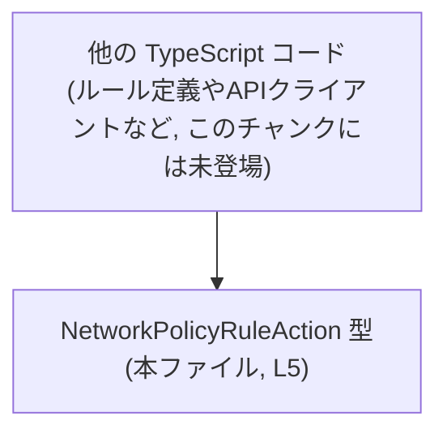
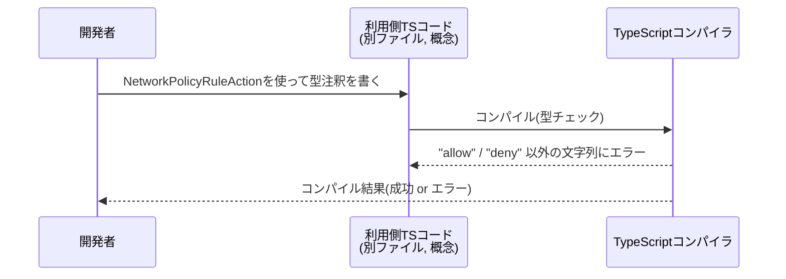

# app-server-protocol/schema/typescript/NetworkPolicyRuleAction.ts コード解説

## 0. ざっくり一言

- ネットワークポリシーの「ルールのアクション」を `"allow"` または `"deny"` の 2 値に限定するための **文字列リテラル型エイリアス** を定義した、ts-rs 生成コードです（`NetworkPolicyRuleAction.ts:L1-5`）。

---

## 1. このモジュールの役割

### 1.1 概要

- このモジュールは、ポリシールールの「アクション」を表すために、`"allow"` か `"deny"` のどちらかのみを取れる TypeScript 型 `NetworkPolicyRuleAction` を提供します（`NetworkPolicyRuleAction.ts:L5`）。
- ファイル先頭のコメントから、この型定義は Rust 側などの別の定義から **ts-rs によって自動生成**されていることが分かります（`NetworkPolicyRuleAction.ts:L1-3`）。

### 1.2 アーキテクチャ内での位置づけ

- このファイルは `schema/typescript` 配下にあり、アプリケーションサーバーのプロトコル（スキーマ）を TypeScript で表現する層の一部と考えられます（パス名からの推測であり、このチャンクから利用側コードは確認できません）。
- 実行時のロジックは一切含まず、**他の TypeScript ファイルからインポートされて使われる前提の「型定義専用モジュール」**です（`NetworkPolicyRuleAction.ts:L5`）。

概念的な依存関係を Mermaid 図で示します（利用側コードはこのチャンクには現れませんが、一般的な利用イメージです）。



- ノード A は本ファイルに定義された型です。
- ノード B は、この型をインポートして利用する側のコードを表す概念ノードです（このチャンクには存在せず、利用イメージとしての補足です）。

### 1.3 設計上のポイント

- **生成コードであることが明示**されています（`"GENERATED CODE! DO NOT MODIFY BY HAND!"`, `NetworkPolicyRuleAction.ts:L1`）。
- ts-rs によって生成されており、**元定義（おそらく Rust 側）を変更 → 再生成**する設計になっています（`NetworkPolicyRuleAction.ts:L3` の ts‑rs への言及に基づく）。
- TypeScript の **文字列リテラル union 型** を使うことで、アクションを `"allow"` / `"deny"` に静的に制約しています（`NetworkPolicyRuleAction.ts:L5`）。
- 型エイリアスのみで、クラスや関数、実行時状態は持ちません（`NetworkPolicyRuleAction.ts:L5` に型定義以外が存在しない）。

---

## 2. 主要な機能一覧

このモジュールが提供する機能は 1 つです。

- `NetworkPolicyRuleAction` 型: ポリシールールのアクションを `"allow"` または `"deny"` の文字列に制限する型エイリアス（`NetworkPolicyRuleAction.ts:L5`）。

---

## 3. 公開 API と詳細解説

### 3.1 型一覧（構造体・列挙体など）

| 名前                     | 種別       | 役割 / 用途                                                                                 | 定義位置                               |
|--------------------------|------------|----------------------------------------------------------------------------------------------|----------------------------------------|
| `NetworkPolicyRuleAction` | 型エイリアス | ポリシールールのアクションを `"allow"` / `"deny"` に限定するための文字列リテラル union 型 | `NetworkPolicyRuleAction.ts:L5` |

#### `NetworkPolicyRuleAction`（type エイリアス）

**概要**

- `"allow"` または `"deny"` のどちらかの文字列しか代入できない、**コンパイル時専用の制約付き文字列型**です（`NetworkPolicyRuleAction.ts:L5`）。

```ts
export type NetworkPolicyRuleAction = "allow" | "deny";
```

**意味・契約**

- **契約（コンパイル時）**
  - `NetworkPolicyRuleAction` として宣言された変数・プロパティ・関数引数には、`"allow"` か `"deny"` 以外の文字列を代入すると **TypeScript の型エラー**になります。
- **実行時**
  - コンパイル後は純粋な JavaScript になり、この型情報は消えるため、実行時に自動で検証されることはありません。
  - 未型付けの入力（JSON, 外部API, フォーム入力など）から値を受け取る場合は、**別途ランタイムバリデーションを実装する必要**があります（このファイルには含まれていません）。

**言語特有の観点（TypeScript）**

- これは **文字列リテラル union 型** であり、`enum` とは異なり **実行時オブジェクトを生成しない**ため、ランタイムコストはありません。
- IDE での補完や型チェックが効き、誤字（`"alow"` など）をコンパイル時に防げます。

**Edge cases（エッジケース）**

- `"allow"` / `"deny"` 以外の文字列リテラル：
  - 型位置に書いた時点でコンパイラエラーになります。
- 変数経由の代入：
  - 変数の型が `string` の場合、そのまま `NetworkPolicyRuleAction` に代入するとコンパイルエラーです。
  - 型ガードやキャストを行った上で利用する必要があります（キャストは安全性を損ねるので注意）。

**Errors / Panics**

- このファイルは型定義のみであり、**実行時エラーや例外を発生させるコードは含まれていません**（`NetworkPolicyRuleAction.ts:L1-5`）。
- エラーはすべて **TypeScript コンパイル時の型エラー**として顕在化します。

**使用上の注意点**

- ファイル先頭コメントの通り、**手で直接編集してはいけません**（`NetworkPolicyRuleAction.ts:L1-3`）。生成元の定義を変更して再生成する必要があります。
- ランタイムで外部入力をそのままこの型として扱うと、**型レベルの保証が実行時には必ずしも守られない**ため、別途チェック関数などが必要です（このファイルには未定義）。

### 3.2 関数詳細（最大 7 件）

- このファイルには関数・メソッドは一切定義されていません（`NetworkPolicyRuleAction.ts:L1-5`）。

### 3.3 その他の関数

- なし。

---

## 4. データフロー

このファイル自身は実行時ロジックを持たないため、**コンパイル時の型チェックにおけるデータフロー**を概念図で示します。

### 4.1 型チェックの流れ（概念図）



- `NetworkPolicyRuleAction` 型そのものは、**型チェックにのみ影響**し、実行時データは通常の文字列として流れます。
- 実行時に `"allow"` / `"deny"` 以外の文字列を受け取る可能性がある場合は、利用側コードでチェックを追加する必要があります（本チャンクにはその処理は含まれません）。

---

## 5. 使い方（How to Use）

### 5.1 基本的な使用方法

以下は、この型を利用する側の **例示コード**です（このリポジトリ内に実在するコードではありません）。

```typescript
// 利用側コードの例（別ファイル）
import type { NetworkPolicyRuleAction } from "./NetworkPolicyRuleAction";

// ポリシールールの型例
interface NetworkPolicyRule {
    action: NetworkPolicyRuleAction;  // "allow" または "deny" のみ許可
    // 他のフィールドは任意
}

const rule: NetworkPolicyRule = {
    action: "allow",                  // OK: 型に合致
};

const invalidRule: NetworkPolicyRule = {
    // @ts-expect-error
    action: "block",                  // NG: NetworkPolicyRuleAction には存在しない値
};
```

- `action` プロパティが `NetworkPolicyRuleAction` になっているため、誤った文字列を代入するとコンパイル時に検出されます。

### 5.2 よくある使用パターン

1. **関数の引数として使う**

```typescript
import type { NetworkPolicyRuleAction } from "./NetworkPolicyRuleAction";

// ルールのアクションに応じた処理を行う関数（例）
function applyAction(action: NetworkPolicyRuleAction): void {
    if (action === "allow") {
        // 許可処理
    } else {
        // "deny" の場合の処理
    }
}
```

- `action` の型が `NetworkPolicyRuleAction` のため、`if (action === "deny")` のような比較は 2 パターンで完結し、`switch` などでの網羅性チェックも効きます。

1. **外部入力のバリデーションで使う**

```typescript
import type { NetworkPolicyRuleAction } from "./NetworkPolicyRuleAction";

function isNetworkPolicyRuleAction(
    value: unknown
): value is NetworkPolicyRuleAction {
    return value === "allow" || value === "deny";
}
```

- 外部から来た `unknown` な値を、この型に安全に絞り込む **ユーザー定義型ガード** の例です。
- こうした関数はこのファイルには含まれていないため、必要に応じて利用側で定義することになります。

### 5.3 よくある間違い

```typescript
import type { NetworkPolicyRuleAction } from "./NetworkPolicyRuleAction";

let action: NetworkPolicyRuleAction;

// 間違い例: 大文字表記
// @ts-expect-error
action = "ALLOW";   // 型エラー: "allow" | "deny" のどちらでもない

// 間違い例: boolean で表現しようとする
// @ts-expect-error
action = true;      // 型エラー: string ですらない

// 正しい例
action = "allow";
action = "deny";
```

- `"ALLOW"` のように大文字にしてしまうと、別の文字列として扱われ、型に合致しません。
- `boolean` など別の型で「許可/拒否」を表そうとすると、`NetworkPolicyRuleAction` と互換性がありません。

### 5.4 使用上の注意点（まとめ）

- **生成コードのため直接編集しない**
  - `// GENERATED CODE! DO NOT MODIFY BY HAND!` と明記されています（`NetworkPolicyRuleAction.ts:L1`）。
  - 値のバリエーションを変えたい場合は、ts-rs の生成元（通常は Rust の型定義）を変更して再生成する必要があります（`NetworkPolicyRuleAction.ts:L3` のコメントより）。
- **実行時の型安全性**
  - TypeScript の型はコンパイル時にのみ効きます。
  - 外部入力を扱う場合、`isNetworkPolicyRuleAction` のようなランタイムチェックを利用側で用意しないと、実行時に `"allow"` / `"deny"` 以外が紛れ込む可能性があります。
- **並行性やスレッド安全性**
  - このファイルは純粋な型定義であり、共有状態や I/O を持たないため、並行実行やスレッド安全性に関する懸念は直接的にはありません。
- **性能面**
  - 型エイリアスのみで、コンパイル後の JavaScript には追加のコードを生成しないため、実行時オーバーヘッドはありません。

---

## 6. 変更の仕方（How to Modify）

### 6.1 新しい機能（アクション）を追加する場合

例として、新しいアクション `"log"` を追加したいケースを考えます。

1. **このファイルを直接編集しない**
   - 冒頭コメントにより手動編集禁止であることが明示されています（`NetworkPolicyRuleAction.ts:L1-3`）。
2. **生成元の定義を特定する**
   - コメントに ts-rs の URL が記載されているため、この TypeScript 型は ts-rs の出力であることが分かります（`NetworkPolicyRuleAction.ts:L3`）。
   - 通常、ts-rs は Rust の型定義から TypeScript を生成しますが、具体的な生成元ファイル名や型名はこのチャンクには現れません。
3. **生成元で union に相当するバリエーションを拡張**
   - Rust 側など、ts-rs の入力となる型定義に `"log"` に相当する値を追加します（詳細はプロジェクト側の ts-rs 設定に依存し、このチャンクからは不明です）。
4. **コード生成を再実行**
   - プロジェクトのビルド／コード生成手順に従って ts-rs を再実行し、本ファイルを再生成します。
5. **利用側コードの対応**
   - `switch` 文や `if` 文で `NetworkPolicyRuleAction` を網羅的に扱っている箇所は、新しい `"log"` も扱うように修正する必要があります（利用側コードはこのチャンクにはありません）。

### 6.2 既存の機能（"allow"/"deny"）を変更する場合

- `"allow"` と `"deny"` は、この型を使う全てのコードにとっての **契約（protocol）** になっています。
- 例えば `"deny"` を `"block"` に変えると、`NetworkPolicyRuleAction` を使っているあらゆる箇所でコンパイルエラーが発生します。
- 変更前に確認すべき点（このファイル単体からは利用箇所は特定できないため、一般的な観点です）:
  - この型を参照している TypeScript ファイルの一覧
  - サーバー側の API スキーマやデータベースにおける `"allow"` / `"deny"` の扱い
- 変更手順自体は 6.1 と同様に、生成元定義の変更 → ts-rs による再生成、となる想定です。

---

## 7. 関連ファイル

このチャンクには他ファイルの import / export 記述がなく、**直接の関連ファイルを特定できる情報は含まれていません**（`NetworkPolicyRuleAction.ts:L1-5`）。

| パス / 名称 | 役割 / 関係 |
|------------|------------|
| （不明）   | この型をインポートして利用する TypeScript ファイル。パスやファイル名は、このチャンクには現れません。 |
| （不明）   | ts-rs の生成元となる型定義（通常は Rust 側の型）。コメントから生成ツールは分かりますが、具体的なファイルは不明です。 |

---

## 補足：根拠行番号の整理

- **生成コードであること**  
  - `// GENERATED CODE! DO NOT MODIFY BY HAND!`  
    → 手動編集禁止であることの根拠（`NetworkPolicyRuleAction.ts:L1`）。
  - `// This file was generated by [ts-rs](https://github.com/Aleph-Alpha/ts-rs). Do not edit this file manually.`  
    → ts-rs による生成物であること、および手動編集禁止の再確認（`NetworkPolicyRuleAction.ts:L3`）。

- **型定義の内容**  
  - `export type NetworkPolicyRuleAction = "allow" | "deny";`  
    → 公開されている型が `NetworkPolicyRuleAction` であり、その値が `"allow"` / `"deny"` に限定されていることの根拠（`NetworkPolicyRuleAction.ts:L5`）。

- **関数や追加のロジックが存在しないこと**  
  - 上記 3 行以外にコードが存在しないため、実行時ロジックや関数定義が無いと判断できます（`NetworkPolicyRuleAction.ts:L1-5` からの消極的証拠）。
