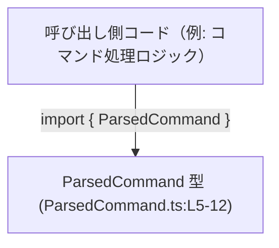
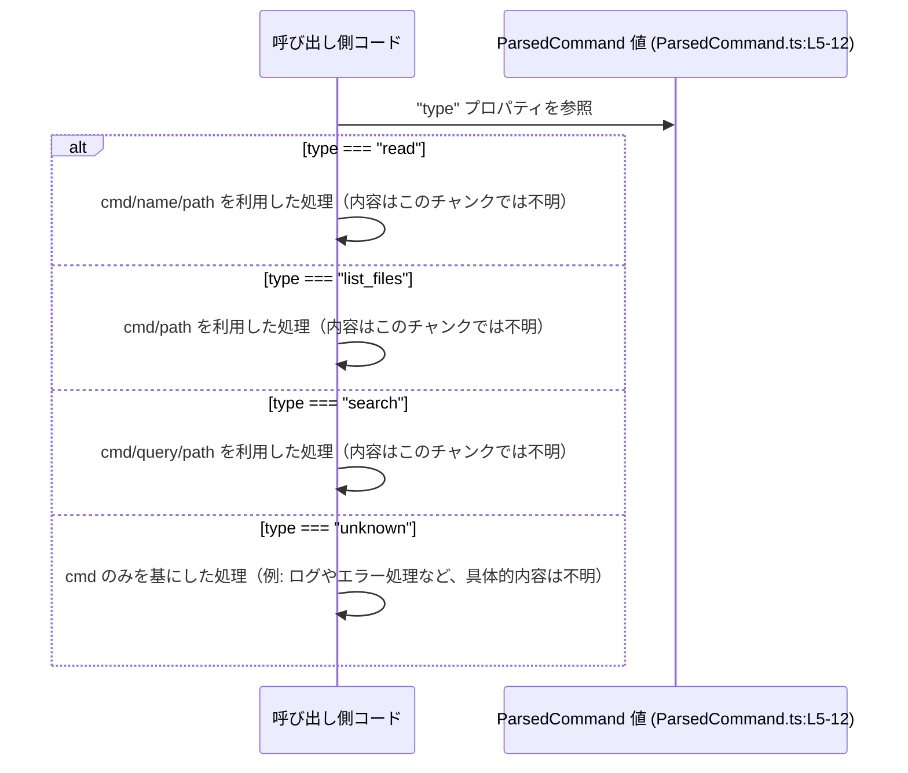

# app-server-protocol/schema/typescript/ParsedCommand.ts コード解説

## 0. ざっくり一言

`ParsedCommand` は、アプリケーション側で扱う「コマンド」を表す **判別共用体（discriminated union）型** で、`"read" / "list_files" / "search" / "unknown"` の4種類のコマンド形を表現するための TypeScript 型定義です（`ParsedCommand.ts:L5-12`）。

---

## 1. このモジュールの役割

### 1.1 概要

- このモジュールは、コマンドの解析結果を表現するための **型スキーマ** を提供します（`export type ParsedCommand`、`ParsedCommand.ts:L5-12`）。
- 4種類のコマンド:
  - ファイル読み取り (`"read"`)
  - ファイル一覧 (`"list_files"`)
  - 検索 (`"search"`)
  - 種類不明のコマンド (`"unknown"`)
  を、共通の `ParsedCommand` 型として統一的に表します（`ParsedCommand.ts:L5-12`）。
- このファイルは `ts-rs` により自動生成されるものであり、**手動編集しないことが前提**となっています（コメント、`ParsedCommand.ts:L1-3`）。

### 1.2 アーキテクチャ内での位置づけ

このファイルは、他モジュールへの `import` がなく、純粋に型エイリアスを `export` しているだけのモジュールです（`ParsedCommand.ts:L5-12`）。  
そのため、アーキテクチャ上は「**他の TypeScript コードから参照されるスキーマ定義**」という位置づけになります。

想定される依存関係のイメージ（利用コードのモジュール名はこのファイルからは分からないため抽象化しています）:



- `ParsedCommand` は他の型に依存しておらず、このファイル単体で完結しています（`ParsedCommand.ts:L5-12`）。
- 逆に、実際のビジネスロジック側は `ParsedCommand` をインポートして、`cmd.type` などのフィールドに基づき処理を分岐する形で利用すると考えられますが、その具体的な利用箇所はこのチャンクには現れません。

### 1.3 設計上のポイント

コードから読み取れる設計上の特徴は次の通りです。

- **判別共用体**  
  - すべてのバリアントが `"type"` プロパティを持ち、その値で分岐する設計になっています（`"read" | "list_files" | "search" | "unknown"`、`ParsedCommand.ts:L5-12`）。
- **コマンド文字列の共通化**  
  - すべてのバリアントが `cmd: string` を持ち、元のコマンド文字列を保持します（`ParsedCommand.ts:L5-12`）。
- **用途に応じた追加フィールド**  
  - `"read"`: `name: string`, `path: string`（`ParsedCommand.ts:L5-12`）
  - `"list_files"`: `path: string | null`（`ParsedCommand.ts:L5-12`）
  - `"search"`: `query: string | null`, `path: string | null`（`ParsedCommand.ts:L5-12`）
  - `"unknown"`: 追加フィールドなし、`cmd` のみ（`ParsedCommand.ts:L5-12`）
- **Null 許容フィールドの利用**  
  - `"list_files"` と `"search"` の `path`、および `"search"` の `query` は `null` 許容です。利用側は `null` チェックが必要になります（`ParsedCommand.ts:L5-12`）。
- **生成コードであること**  
  - コメントで `ts-rs` による自動生成であることが明示されており、手動変更は想定されていません（`ParsedCommand.ts:L1-3`）。

---

## 2. 主要な機能一覧

このモジュールは関数ではなく **型定義** だけを提供しますが、その型が表現する「機能」を整理すると次のようになります（すべて `ParsedCommand.ts:L5-12` に基づく）。

- `"read"` コマンド: `cmd`, `name`, `path` を持つファイル読み取りコマンドを表現する
- `"list_files"` コマンド: `cmd`, `path`（任意）を持つファイル一覧コマンドを表現する
- `"search"` コマンド: `cmd`, `query`（任意）, `path`（任意）を持つ検索コマンドを表現する
- `"unknown"` コマンド: `cmd` のみを持つ、型レベルで分類できなかったコマンドを表現する
- 共通の `ParsedCommand` 型: 上記4種類のコマンドを 1 つの union 型としてまとめ、利用側で `type` による型安全な分岐を可能にする

---

## 3. 公開 API と詳細解説

### 3.1 型一覧（構造体・列挙体など）

| 名前 | 種別 | 役割 / 用途 | 主なフィールド | 根拠 |
|------|------|-------------|----------------|------|
| `ParsedCommand` | 型エイリアス（判別共用体） | 解析済みコマンドを表現するトップレベルの型。`"read" / "list_files" / "search" / "unknown"` の4バリアントをまとめる。 | `type: "read" \| "list_files" \| "search" \| "unknown"`, `cmd: string`, 各バリアント特有のフィールド | `ParsedCommand.ts:L5-12` |

`ParsedCommand` の各バリアントとフィールド構成:

1. `"read"` バリアント（`ParsedCommand.ts:L5-12`）
   - フィールド:
     - `type: "read"`
     - `cmd: string`
     - `name: string`
     - `path: string`
       - コメントにより、「実行時の `cwd`（カレントディレクトリ）に対して解決されるパス」であることが説明されています（`ParsedCommand.ts:L6-10`）。

2. `"list_files"` バリアント（`ParsedCommand.ts:L5-12`）
   - フィールド:
     - `type: "list_files"`
     - `cmd: string`
     - `path: string | null`

3. `"search"` バリアント（`ParsedCommand.ts:L5-12`）
   - フィールド:
     - `type: "search"`
     - `cmd: string`
     - `query: string | null`
     - `path: string | null`

4. `"unknown"` バリアント（`ParsedCommand.ts:L5-12`）
   - フィールド:
     - `type: "unknown"`
     - `cmd: string`

### 3.2 関数詳細（最大 7 件）

このファイルには **関数定義が存在しません**。  
したがって、ここで詳解すべき公開関数はありません（`ParsedCommand.ts:L1-12` 全体を確認しても `function` や `=>` を伴う関数宣言がないため）。

### 3.3 その他の関数

- 該当なし（関数が存在しません、`ParsedCommand.ts:L1-12`）。

---

## 4. データフロー

このセクションでは、`ParsedCommand` 型がどのように利用されるかという **典型的な処理フロー** を、概念的なレベルで説明します。  
実際の利用コードはこのチャンクには現れないため、「呼び出し側コード」を抽象化した形で示します。

### 4.1 代表的な処理シナリオの概要

1. 何らかの手段（Rust 側や別モジュール）で **コマンド文字列が解析され**、`ParsedCommand` 型に準拠したオブジェクトが生成される（生成プロセスはこのファイルには含まれません）。
2. 呼び出し側コードが `ParsedCommand` を受け取り、`command.type` の値に応じて処理を分岐する。
3. 各バリアント固有のフィールド（`name`, `path`, `query` など）を使って具体的な処理が行われる。

### 4.2 シーケンス図



- 上記は、「`ParsedCommand` を受けた後、`type` で分岐する」という **型レベルのデータフロー** を示しています。
- 各分岐の中身（ファイルを実際に読む／一覧する／検索するなどの実処理）は、このモジュールには定義されていないため「不明」としています。

---

## 5. 使い方（How to Use）

### 5.1 基本的な使用方法

`ParsedCommand` を利用する典型的なコード例です。  
この例では、`ParsedCommand` 値を受け取って `type` に基づき処理を分岐します。

```typescript
// ParsedCommand 型をインポートする（実際のパスはプロジェクト構成に依存する）
import type { ParsedCommand } from "./ParsedCommand"; // パスは例

// ParsedCommand を受け取って処理する関数
function handleCommand(command: ParsedCommand) {
    // "type" プロパティによる判別共用体の分岐
    switch (command.type) {
        case "read": {
            // command はここでは { type: "read"; cmd: string; name: string; path: string } 型として扱われる
            const { cmd, name, path } = command;
            // 実際の読み取り処理（このファイルからは詳細不明）
            console.log("READ", cmd, name, path);
            break;
        }
        case "list_files": {
            // command はここでは { type: "list_files"; cmd: string; path: string | null }
            const { cmd, path } = command;
            // path が null かどうかを明示的に確認する必要がある
            if (path === null) {
                console.log("LIST FILES (default path)", cmd);
            } else {
                console.log("LIST FILES in", path, "cmd:", cmd);
            }
            break;
        }
        case "search": {
            // command はここでは { type: "search"; cmd: string; query: string | null; path: string | null }
            const { cmd, query, path } = command;
            if (query == null) {
                // query が null / undefined の場合の扱いを決める必要がある
                console.log("SEARCH with no query", cmd);
            } else {
                console.log("SEARCH", query, "in", path ?? "(default path)", "cmd:", cmd);
            }
            break;
        }
        case "unknown": {
            // command はここでは { type: "unknown"; cmd: string }
            console.warn("Unknown command:", command.cmd);
            break;
        }
    }
}
```

- TypeScript の **判別共用体の型狭窄** によって、`switch` の各ケース内部で `command` の具体的なフィールドが型安全に利用できます。
- `path` や `query` が `string | null` であるケースでは、利用前に必ず `null` チェックを行う必要があります（`ParsedCommand.ts:L5-12`）。

### 5.2 よくある使用パターン

1. **特定のバリアントだけを処理する**

```typescript
// search コマンドだけを処理する例
function handleSearchOnly(command: ParsedCommand) {
    if (command.type !== "search") {
        return; // 他のタイプはここでは無視
    }

    // ここでは command は search バリアントとして扱われる
    const { query, path } = command;

    if (query == null) {
        // 検索語がないケース
        console.log("Empty search query");
        return;
    }

    console.log("Searching for", query, "in", path ?? "(default path)");
}
```

1. **型安全な exhaustiveness チェック**

```typescript
function exhaustiveHandle(command: ParsedCommand) {
    switch (command.type) {
        case "read":
            // ...
            break;
        case "list_files":
            // ...
            break;
        case "search":
            // ...
            break;
        case "unknown":
            // ...
            break;
        default: {
            // 将来にバリアントが増えたとき、ここでコンパイルエラーにできるパターン
            const _exhaustive: never = command;
            return _exhaustive;
        }
    }
}
```

- 上記の `default` 分岐は、「すべてのバリアントを列挙できているか」を型レベルで検査するテクニックです。
- 将来 Rust 側でコマンドが増え、`ParsedCommand.ts` が再生成された場合でも、コンパイラが未対応のケースを検知できます。

### 5.3 よくある間違い

**誤り例1: `null` を考慮せずに `path` を使用する**

```typescript
// 誤り例: path が null である可能性を無視している
function listFilesBad(command: ParsedCommand) {
    if (command.type === "list_files") {
        // command.path の型は string | null だが、そのまま使っている
        console.log("Listing files in", command.path.toLowerCase()); // 実行時にエラーの可能性
    }
}
```

**正しい例**

```typescript
function listFilesSafe(command: ParsedCommand) {
    if (command.type === "list_files") {
        const { path } = command; // path: string | null

        if (path === null) {
            console.log("Listing files in default directory");
        } else {
            console.log("Listing files in", path.toLowerCase());
        }
    }
}
```

**誤り例2: `"unknown"` バリアントを処理しない**

```typescript
// 誤り例: unknown タイプを想定していない
function handleCommandIncomplete(command: ParsedCommand) {
    if (command.type === "read") {
        // ...
    } else if (command.type === "list_files") {
        // ...
    } else if (command.type === "search") {
        // ...
    }
    // "unknown" が落ちるケース → 不正コマンドに対するハンドリングが欠落する
}
```

- `"unknown"` バリアントが存在する以上、利用側でそれを明示的に扱う必要があります（`ParsedCommand.ts:L5-12`）。

### 5.4 使用上の注意点（まとめ）

- **生成コードを直接編集しない**  
  - ファイル先頭コメントで「GENERATED CODE! DO NOT MODIFY BY HAND!」と明示されています（`ParsedCommand.ts:L1-3`）。  
    構造を変更する場合は、生成元（Rust 側の型定義など）を変更してから再生成する必要があります。
- **`null` 許容フィールドの扱い**  
  - `"list_files"` と `"search"` の `path`, `"search"` の `query` は `null` になり得ます（`ParsedCommand.ts:L5-12`）。  
    利用時は必ず `null` チェックを行い、型安全性を保つ必要があります。
- **判別共用体としての利用を前提**  
  - `type` フィールドによる分岐を前提に設計されています。`instanceof` やプロパティ存在チェックではなく、`command.type === "xxx"` で分岐するのが自然です。
- **パス文字列の意味**  
  - `"read"` の `path` についてはコメントが付いており、「コマンドが使用する `cwd` に対して解決されるパス」であると説明されています（`ParsedCommand.ts:L6-10`）。  
    利用側で相対パスを扱う場合などは、セキュリティ（パストラバーサル）や権限の観点に注意が必要です（詳細は §「バグ・セキュリティ観点」参照）。

---

## 6. 変更の仕方（How to Modify）

### 6.1 新しい機能を追加する場合

このファイルは `ts-rs` による自動生成であり、**直接編集すべきではありません**（`ParsedCommand.ts:L1-3`）。

新しい種類のコマンドを追加したい場合の一般的な手順は次のようになります（実際の生成元コードはこのチャンクには現れないため、高レベルな説明にとどまります）。

1. **生成元（Rust 側など）に新しいコマンドバリアントを追加する**  
   - 例: Rust の enum に新しいバリアントを追加し、`ts-rs` 用の derive を付与する、など。
2. **`ts-rs` を実行して TypeScript コードを再生成する**  
   - これにより `ParsedCommand.ts` に新バリアントが追加されます。
3. **TypeScript 側の利用コードを更新する**  
   - `switch (command.type)` などで、新しい `"type"` 値に対応するケースを追加する。
   - `never` を使った exhaustiveness チェックを導入しておくと、未処理のバリアントをコンパイル時に検出しやすくなります。

### 6.2 既存の機能を変更する場合

既存フィールドやバリアントの変更も、同様に **生成元で行う必要** があります。

変更時の注意点:

- **互換性の影響範囲**
  - フィールドの型変更（例: `string` → `string | null`）や削除は、既存の利用コードにコンパイルエラーやランタイムエラーを引き起こし得ます。
  - `"unknown"` バリアントの有無や意味を変えると、不正コマンドの扱いが変わるため、ログやエラー処理などを再確認する必要があります。
- **契約の維持**
  - コメントに記載された仕様（例: `path` が `cwd` からの相対 or 絶対パスであること、`ParsedCommand.ts:L6-10`）を変更する場合は、利用側の前提条件やセキュリティチェックを合わせて見直す必要があります。

---

## 7. 関連ファイル

このファイル単体から直接分かる関連は限定的です。

| パス / 種別 | 役割 / 関係 | 根拠 |
|------------|-------------|------|
| （不明: Rust 側の生成元） | コメントに記載の通り、この TypeScript ファイルは `ts-rs` によって自動生成されており、Rust 側に対応する型定義が存在すると推測できますが、具体的なファイルパスや型名はこのチャンクには現れません。 | `ParsedCommand.ts:L1-3` |
| （同一ディレクトリ内の他の schema TS ファイル） | `app-server-protocol/schema/typescript` ディレクトリ内に他のスキーマ定義が存在する可能性がありますが、このチャンクには一覧や import がないため詳細は不明です。 | パス情報（ユーザー指定） |

---

## 付録: コンポーネントインベントリーと補足観点

### A. コンポーネントインベントリー（型中心）

| コンポーネント | 種別 | 説明 | 根拠 |
|----------------|------|------|------|
| `ParsedCommand` | 型エイリアス（判別共用体） | 解析済みコマンド全体を表現するトップレベル型。4バリアントを含む。 | `ParsedCommand.ts:L5-12` |
| `"read"` バリアント | オブジェクト形 | ファイル読み取りコマンド。`type: "read"`, `cmd: string`, `name: string`, `path: string`。`path` の仕様コメントあり。 | 定義: `ParsedCommand.ts:L5-12`、コメント: `ParsedCommand.ts:L6-10` |
| `"list_files"` バリアント | オブジェクト形 | ファイル一覧コマンド。`type: "list_files"`, `cmd: string`, `path: string | null`。 | `ParsedCommand.ts:L5-12` |
| `"search"` バリアント | オブジェクト形 | 検索コマンド。`type: "search"`, `cmd: string`, `query: string | null`,`path: string | null`。 | `ParsedCommand.ts:L5-12` |
| `"unknown"` バリアント | オブジェクト形 | 未知コマンド。`type: "unknown"`, `cmd: string` のみ。 | `ParsedCommand.ts:L5-12` |

### B. バグ・セキュリティ観点

このモジュール自体は **型定義のみ** であり、直接 I/O やパース処理を行いません。  
それでも、利用側で注意すべき点は次の通りです。

- **パスの取り扱い**
  - `"read"` の `path` と `"list_files"`, `"search"` の `path` はファイルシステム上のパスを表すとコメントから読み取れます（特に `"read"` の説明、`ParsedCommand.ts:L6-10`）。
  - 利用側では、パストラバーサル（`../` を用いた上位ディレクトリへのアクセス）などを防ぐためのバリデーションやサンドボックス化が必要になります。
- **`cmd` の扱い**
  - `cmd` は元のコマンド文字列と推測されます（コードからは型が `string` であることのみ分かる、`ParsedCommand.ts:L5-12`）。
  - ログ出力やエラーメッセージに生で出力する場合、ログインジェクションなどに注意が必要です。
- **`unknown` バリアントの処理**
  - `"unknown"` を無視すると、不正または未サポートのコマンドが静かに落ちる可能性があります。  
    利用側ではログ出力やエラー応答など、明示的な処理を行うことが望ましいです。

### C. 契約・エッジケース

- **契約（前提条件）**
  - `type` は `"read" | "list_files" | "search" | "unknown"` のいずれかである（`ParsedCommand.ts:L5-12`）。
  - それぞれのバリアントで必須のフィールドが存在する（例: `"read"` では `name` と `path` は必須、`ParsedCommand.ts:L5-12`）。
- **エッジケース**
  - `"list_files"` / `"search"` の `path === null`:  
    - 「デフォルトの探索パス」を意味するなどの扱いが必要ですが、その解釈はこのファイルからは分かりません。
  - `"search"` の `query === null`:  
    - 「クエリなしの検索」をどう扱うか（全件検索とみなす、エラーにするなど）は利用側で決める必要があります。
  - `"unknown"` タイプ:  
    - 新しいコマンドが追加されたが TypeScript 側が古い場合にも、このバリアントを通じて「とりあえず `cmd` は取得できる」逃げ道として機能する可能性があります。

### D. テストに関する補足

このファイル自体にはテストコードは含まれていません（`ParsedCommand.ts:L1-12`）。  
利用側や生成元では、次のような観点のテストが一般的に考えられます（推奨事項であり、このリポジトリ内に存在するとは限りません）。

- Rust 側型と `ParsedCommand` の **シリアライズ・デシリアライズ整合性テスト**
- TypeScript 側で `ParsedCommand` を受け取る処理に対する **型レベルの exhaustiveness テスト**
- `null` の受け取り・ハンドリングに関するユニットテスト

### E. パフォーマンス / 並行性に関する補足

- **パフォーマンス**
  - `ParsedCommand` は純粋な型定義であり、追加のランタイムコストは発生しません。
  - 多数のコマンドを配列で扱う場合でも、オブジェクトの形はシンプルであり、通常の JavaScript オブジェクトとして扱われます。
- **並行性**
  - TypeScript/JavaScript の言語モデル上、`ParsedCommand` はただのデータオブジェクトであり、並行性制御（ロックや同期）に直接関与しません。
  - Node.js やブラウザ環境の非同期処理（Promise, async/await, Worker など）と組み合わせて使う場合も、`ParsedCommand` 自体による特別な制約はありません。

以上が、このチャンク（`ParsedCommand.ts:L1-12`）から読み取れる `ParsedCommand` 型の役割・構造・利用方法のまとめです。
