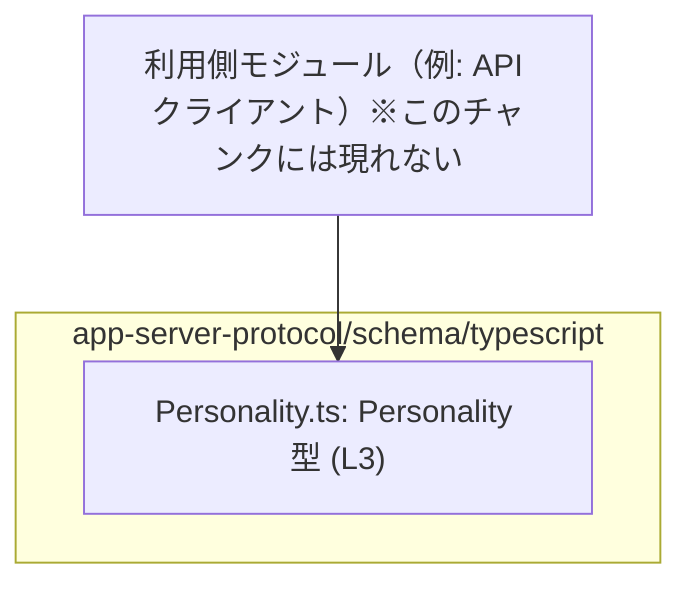
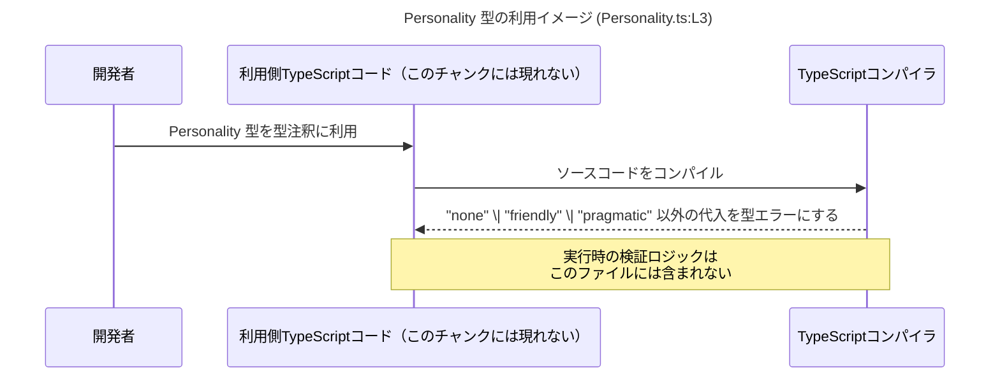

# app-server-protocol/schema/typescript/Personality.ts

## 0. ざっくり一言

`Personality` という文字列リテラルのユニオン型（複数の文字列のどれかであることを表す型）を公開する TypeScript スキーマ定義ファイルです（`Personality.ts:L3-3`）。

---

## 1. このモジュールの役割

### 1.1 概要

- このモジュールは、**パーソナリティ種別を表す文字列を `"none" | "friendly" | "pragmatic"` の 3 種類に制約する型**を提供します（`Personality.ts:L3-3`）。
- 実行時の処理ロジックは一切含まれず、**コンパイル時の型チェック専用**の定義になっています。

### 1.2 アーキテクチャ内での位置づけ

コードから直接分かる事実:

- このファイルは `export type Personality = ...` により、`Personality` 型を**公開**しています（`Personality.ts:L3-3`）。
- import や他モジュールへの依存は一切記述されていません（このチャンクには現れないため、依存関係の詳細は不明です）。

以下は、「他の TypeScript コードがこの型をインポートして利用する」という**一般的な利用イメージ**を表現した概念図です（利用側モジュールはこのチャンクには登場しません）。



### 1.3 設計上のポイント

- **生成コードであることが明示**されています  
  - `// GENERATED CODE! DO NOT MODIFY BY HAND!`（`Personality.ts:L1-1`）  
  - `// This file was generated by [ts-rs](...)`（`Personality.ts:L2-2`）  
  → 変更は**元となる定義やコードジェネレータ側で行う前提**になっています。
- **文字列リテラルユニオン型による制約**  
  - `"none" | "friendly" | "pragmatic"` の 3 値に限定されます（`Personality.ts:L3-3`）。
  - TypeScript のコンパイル時に、これ以外の文字列リテラルを代入すると型エラーになります。
- **状態やロジックを持たない**  
  - クラス・関数・変数定義は一切なく、**純粋な型宣言のみ**で構成されています（`Personality.ts:L3-3`のみ）。
- **エラー・並行性**  
  - 実行時コードが存在しないため、ランタイムエラーや並行性の問題（レースコンディションなど）はこのファイル単体では発生しません。
  - 安全性は**TypeScript の型チェックに限定**され、実行時の文字列値検証は別モジュールで行う必要があります（このチャンクにはその処理は現れません）。

---

## 2. 主要な機能一覧

このモジュールは 1 つの公開型のみを提供します。

- `Personality`: パーソナリティを `"none" | "friendly" | "pragmatic"` のいずれかに制約する文字列リテラルユニオン型（`Personality.ts:L3-3`）

---

## 3. 公開 API と詳細解説

### 3.1 型一覧（コンポーネントインベントリー）

このファイルに定義されている「コンポーネント」（型）の一覧です。

| 名前          | 種別                         | 役割 / 用途                                                                 | 定義行                         | 根拠 |
|---------------|------------------------------|------------------------------------------------------------------------------|--------------------------------|------|
| `Personality` | 型エイリアス（文字列ユニオン） | `"none"`, `"friendly"`, `"pragmatic"` のいずれかであることを表すパーソナリティ種別 | `Personality.ts:L3-3`          | `export type Personality = "none" \| "friendly" \| "pragmatic";`（`Personality.ts:L3-3`） |

#### 契約（Contract）

`Personality` 型が暗黙に表す契約は次のとおりです（いずれも `Personality.ts:L3-3` に基づきます）。

- 変数・プロパティ・引数などに `Personality` を付けた場合、その値は **必ず `"none"`, `"friendly"`, `"pragmatic"` のどれかである**。
- `null`, `undefined` やその他の任意文字列（例: `"aggressive"`）は **`Personality` とは互換性がない**。

### 3.2 関数詳細（最大 7 件）

- このファイルには**関数・メソッド定義が存在しません**（`Personality.ts:L1-3` のいずれにも `function` / `=>` 等のパターンが現れないため）。
- したがって、詳細テンプレートを適用すべき対象関数もありません。

### 3.3 その他の関数

- 補助関数やラッパー関数も**一切定義されていません**（このチャンクには現れません）。

---

## 4. データフロー

このファイル自体には実行時ロジックがないため、「データがどのように変換されるか」という処理フローは存在しません。  
ここでは、**コンパイル時における型チェックの流れ**という観点で、`Personality` 型の利用イメージを示します。



要点:

- `Personality` は**実行時データそのものではなく、データの「型」**を表すだけです（`Personality.ts:L3-3`）。
- 型に違反するコードは**コンパイル時にエラー**になりますが、実行時に外部から `"aggressive"` のような文字列が来ることまでは防げません。  
  このファイル内には実行時チェック処理が存在しないためです。

---

## 5. 使い方（How to Use）

### 5.1 基本的な使用方法

`Personality` 型を利用して、変数やオブジェクトのプロパティを制約する基本例です。

```typescript
// Personality 型をインポートする例（相対パスはプロジェクト構成に依存します）
import type { Personality } from "./Personality";  // Personality.ts:L3-3 でエクスポートされている型

// Personality 型の変数を宣言する
const p1: Personality = "friendly";  // OK: "friendly" はユニオンの一員

// const p2: Personality = "aggressive";  // コンパイルエラー: "aggressive" は許可されていない
```

このコードをコンパイルすると、`p2` の行は TypeScript コンパイラにより**型エラー**になります。  
`Personality` 型が `"none" | "friendly" | "pragmatic"` に制限されていることに基づく挙動です（`Personality.ts:L3-3`）。

### 5.2 よくある使用パターン

#### パターン1: オブジェクトのプロパティとして利用する

```typescript
import type { Personality } from "./Personality";  // Personality.ts:L3-3

// ユーザー設定などの型定義に Personality を組み込む例
interface UserConfig {
    name: string;               // ユーザー名
    personality: Personality;   // パーソナリティ種別: 3 値のどれか
}

const config: UserConfig = {
    name: "Alice",
    personality: "pragmatic",   // OK
    // personality: "other",    // コンパイルエラー
};
```

TypeScript の型推論により、`config.personality` は `Personality` 型として扱われ、  
誤った文字列を代入しようとするとコンパイルエラーになります。

#### パターン2: 関数の引数・戻り値に利用する

```typescript
import type { Personality } from "./Personality";  // Personality.ts:L3-3

// Personality を引数・戻り値に使う関数
function describePersonality(p: Personality): string {
    switch (p) {
        case "none":
            return "特に指定なし";
        case "friendly":
            return "フレンドリー";
        case "pragmatic":
            return "実務的";
        // default: ここには到達しない（p は 3 値に限定されているため）
    }
}

const label = describePersonality("friendly");  // OK
// describePersonality("other");               // コンパイルエラー
```

`switch` の分岐で `p` の値が 3 パターンに限定されるため、  
**分岐漏れや typo をコンパイル時に検出しやすくなる**のが利点です。

### 5.3 よくある間違い

1. **`any` を介して型安全性を失う**

```typescript
import type { Personality } from "./Personality";  // Personality.ts:L3-3

declare const raw: any;                 // 外部入力などを any で受けてしまう

const p: Personality = raw;            // コンパイルは通るが、実行時には何でも入りうる
```

- `raw` が `any` 型のため、`Personality` への代入時に型チェックが実質無効になります。
- このファイルには実行時バリデーションはないため（`Personality.ts:L1-3` にはロジックなし）、
  **実行時には `"aggressive"` のような未定義値も通ってしまいます**。

1. **`null` / `undefined` を許容したいのに型を拡張していない**

```typescript
import type { Personality } from "./Personality";  // Personality.ts:L3-3

// const p: Personality = null;                  // コンパイルエラー
// const p: Personality = undefined;             // コンパイルエラー

// null 許容が必要な場合は、利用側でユニオンを拡張する必要がある
type MaybePersonality = Personality | null;
```

### 5.4 使用上の注意点（まとめ）

**型安全性**

- `Personality` は **コンパイル時の型チェック**のみを提供します（`Personality.ts:L3-3`）。
- 実行時にはこの型情報は存在しないため、「外部から来る文字列が常に 3 値に収まる」という保証はありません。
  - 外部入力を受ける場合は、別途ランタイムバリデーションが必要です（このチャンクにはその実装は現れません）。

**エラーの性質**

- 型に違反する文字列を `Personality` 型に代入すると、**TypeScript コンパイル時にエラー**になります。
- 実行時エラー（例外）やパニックを投げるコードはこのファイルには存在しません（`Personality.ts:L1-3`）。

**並行性**

- このファイルには実行時コードがないため、スレッド安全性や非同期処理・ロックなどの並行性の問題は関係しません。

**セキュリティ上のポイント**

- 型定義だけでは入力値の検証はできないため、**セキュリティ上の境界（API 受入口など）では別途チェックが必要**です。
- 特に `any` や `unknown` を介した代入では、`Personality` による制約が実行時には効かなくなる点に注意が必要です。

**パフォーマンス**

- `export type ...` は型情報のみであり、コンパイル後の JavaScript には出力されないため、  
  実行時の性能やメモリ使用量への影響はほぼありません。

**トレードオフ**

- **利点**:  
  - 軽量でシンプル  
  - IDE 補完や型チェックの恩恵を得られる  
- **制約**:  
  - 実行時に自動検証されない（別途バリデーションが必要）  
  - 値の集合が増えるたびに `Personality` のユニオンを更新する必要がある（ただしこのファイルは生成物であり、直接編集は非推奨: `Personality.ts:L1-2`）。

---

## 6. 変更の仕方（How to Modify）

### 6.1 新しい機能（値）を追加する場合

コードコメントから、このファイルは `ts-rs` による**自動生成コード**であることが明示されています（`Personality.ts:L1-2`）。

- `// GENERATED CODE! DO NOT MODIFY BY HAND!`（`Personality.ts:L1-1`）
- `// This file was generated by [ts-rs](...)`（`Personality.ts:L2-2`）

そのため、**直接編集することは推奨されません**。

新しいパーソナリティ種別（例: `"creative"`）を追加したい場合、一般的には次のような手順になります（このチャンクからは元定義の場所は不明なので、抽象的な説明に留めます）。

1. **元となるスキーマ定義を探す**  
   - Rust コードや別のスキーマファイルなど、`ts-rs` が参照しているソースを特定する（このチャンクには場所は現れません）。
2. **元定義に新しい値を追加**  
   - 例: Rust の `enum Personality { None, Friendly, Pragmatic, Creative }` のような定義を更新する（あくまで一般例であり、このリポジトリの実コードかどうかは不明）。
3. **コード生成を再実行**  
   - `ts-rs` のコード生成コマンドを再実行し、新しい `Personality.ts` を生成する。
4. **利用側コードの影響範囲を確認**  
   - `switch` 文などで `Personality` の各値をハンドリングしている箇所があれば、新しい値に対応する分岐を追加する。

### 6.2 既存の機能を変更する場合

既存の 3 つの文字列値を変更・削除することは、利用側コードに影響が大きいため慎重な対応が必要です。

- **影響範囲の確認**  
  - `Personality` を利用している全ての TypeScript ファイル（import している箇所）を検索し、影響を把握する必要があります（このチャンクから利用箇所は不明）。
- **契約の変更**  
  - 例えば `"none"` を `"unspecified"` に変更すると、「`Personality` は `"none" | "friendly" | "pragmatic"` のどれか」として書かれていた契約が崩れます。
  - その結果、コンパイルエラーが発生する箇所や、実行時の挙動が変わる箇所が出ます。
- **テスト**  
  - このチャンクにはテストコードは含まれていませんが、利用側のテストで `Personality` の扱いを確認することが重要です。

リファクタリングという観点では、**必ず元スキーマから生成し直す**というプロセスを守ることが、定義の一貫性と保守性の観点で重要です。

---

## 7. 関連ファイル

このチャンクから直接分かる関連は限られていますが、コメントに基づいて次のように整理できます。

| パス / ツール                     | 役割 / 関係                                                                                      |
|-----------------------------------|--------------------------------------------------------------------------------------------------|
| `app-server-protocol/schema/typescript/Personality.ts` | 本ファイル。`Personality` 型を定義・エクスポートする TypeScript スキーマ（`Personality.ts:L3-3`）。 |
| `ts-rs`（外部ツール）            | コメントによれば、このファイルを生成したコードジェネレータ（`Personality.ts:L2-2`）。          |
| その他のスキーマファイル         | 同じディレクトリ配下に類似の自動生成ファイルが存在する可能性がありますが、このチャンクには現れません。 |

- テストコードや、`Personality` を実際に利用しているアプリケーション側のコードは、**このチャンクには現れない**ため、具体的なファイルパスや構造は不明です。

---

このファイルは非常に小さく、`Personality` 型 1 つのみを提供する構成ですが、  
TypeScript の型システムを活用することで、**パーソナリティ種別の取りうる値をコンパイル時に厳密に制約する役割**を担っています。
