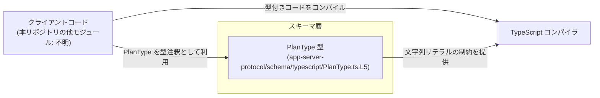
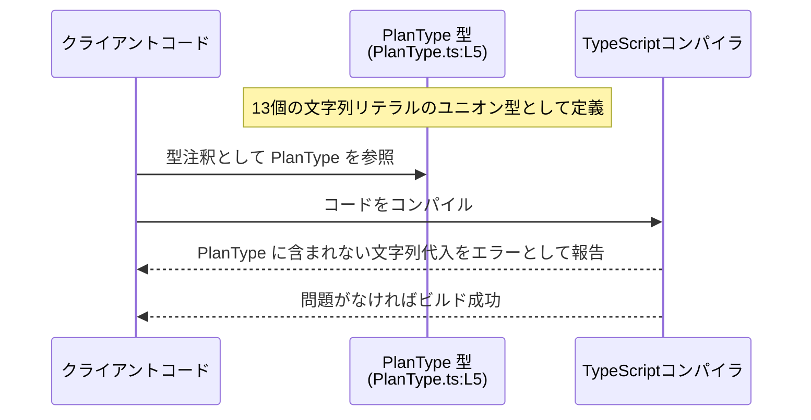

# app-server-protocol/schema/typescript/PlanType.ts コード解説

## 0. ざっくり一言

`PlanType` は、アプリケーション内で利用される「プラン種別」を **文字列リテラルのユニオン型** として定義する TypeScript の型エイリアスです（`PlanType.ts:L5`）。  
このファイルは ts-rs により自動生成されるため、手動で編集しない前提になっています（`PlanType.ts:L1-3`）。

---

## 1. このモジュールの役割

### 1.1 概要

- このモジュールは、アプリケーションで使用されるプランの種類を **有限個の文字列** に制限するための型 `PlanType` を提供します（`PlanType.ts:L5`）。
- 型レベルで許可されるプラン名を列挙することで、誤った文字列をコンパイル時に検出できるようにしています（TypeScript の文字列リテラルユニオン型の性質）。

### 1.2 アーキテクチャ内での位置づけ

- パス `app-server-protocol/schema/typescript/PlanType.ts` から、この型が **サーバープロトコルのスキーマ情報を TypeScript で表現したものの 1 要素** であることが読み取れますが、このチャンクからは具体的な利用箇所や他モジュール名は分かりません。
- コメントにより、このファイルは `ts-rs` により自動生成されることが明記されています（`PlanType.ts:L1-3`）。`ts-rs` は Rust 側の型定義から TypeScript 型を生成するツールとして知られています（外部知識）。

概念的な依存関係は次のようになります（※他モジュール名は抽象化してあります）。



### 1.3 設計上のポイント

コードから読み取れる設計上の特徴は次のとおりです。

- **自動生成ファイルであることの明示**  
  - 冒頭コメントで「GENERATED CODE」「Do not edit this file manually」と明記されています（`PlanType.ts:L1-3`）。
  - これにより、変更は元のスキーマ定義（Rust 側など）で行い、再生成する設計であることが分かります。
- **文字列リテラルユニオンによる制約**  
  - `PlanType` は 13 個の文字列リテラルのユニオン型として定義されています（`PlanType.ts:L5`）。
  - 任意の `string` ではなく、特定の値のみに型レベルで制限されます。
- **状態を持たない純粋な型定義**  
  - 実行時コード（変数・関数・クラスなど）は一切なく、コンパイル時のみ意味を持つ型情報だけを提供します（`PlanType.ts:L5`）。
- **エラーハンドリングや並行性は関与しない**  
  - このモジュールは型定義のみのため、ランタイムエラー処理や並行処理（スレッド・非同期処理）には直接関与しません。

---

## 2. 主要な機能一覧（コンポーネントインベントリー）

このファイルに含まれる主要コンポーネントは 1 つです。

- `PlanType`: プラン種別を表す文字列リテラルのユニオン型（`PlanType.ts:L5`）

表にまとめると次のようになります。

| 名前       | 種別          | 役割 / 用途                                                                 | 根拠 |
|------------|---------------|------------------------------------------------------------------------------|------|
| `PlanType` | 型エイリアス  | 許可されたプラン名の集合を定義する文字列リテラルユニオン型。アプリ内のプラン種別の型注釈に使うことが想定されます。 | `PlanType.ts:L5` |

---

## 3. 公開 API と詳細解説

### 3.1 型一覧（構造体・列挙体など）

#### `type PlanType`

```ts
export type PlanType =
  | "free"
  | "go"
  | "plus"
  | "pro"
  | "prolite"
  | "team"
  | "self_serve_business_usage_based"
  | "business"
  | "enterprise_cbp_usage_based"
  | "enterprise"
  | "edu"
  | "unknown";
```

**概要**

- `PlanType` は、プランの種別を `string` ではなく **特定の 13 種類の文字列** のいずれかに限定する型エイリアスです（`PlanType.ts:L5`）。
- TypeScript の文字列リテラルユニオン型を利用しており、これに含まれない文字列を代入しようとするとコンパイル時に型エラーになります。

**許可される文字列値**

すべて `PlanType.ts:L5` より。

- `"free"`
- `"go"`
- `"plus"`
- `"pro"`
- `"prolite"`
- `"team"`
- `"self_serve_business_usage_based"`
- `"business"`
- `"enterprise_cbp_usage_based"`
- `"enterprise"`
- `"edu"`
- `"unknown"`

ここで `"unknown"` は **文字列リテラル `"unknown"`** であり、TypeScript の型 `unknown` とは無関係です（紛らわしいですが型としては `PlanType` で区別されます）。

**型システム上の性質（TypeScript 特有）**

- `PlanType` は **`string` の部分型** です。すなわち `PlanType` の値は `string` に代入可能ですが、その逆は保証されません。
- `PlanType` に含まれない文字列リテラルを代入すると、コンパイル時エラーになります。
- `null` や `undefined` はユニオンに含まれていないため、`PlanType` には代入できません（`strictNullChecks` が有効な前提）。

**使用例**

```typescript
// PlanType 型をインポートして利用する例
import type { PlanType } from "./PlanType";  // type-only import を利用

// PlanType 型の変数を宣言
const currentPlan: PlanType = "pro";        // OK: "pro" は PlanType ユニオンに含まれる

// 間違った値の代入例
// const badPlan: PlanType = "gold";        // コンパイルエラー: "gold" は PlanType に含まれない
```

この例では、`currentPlan` に `"pro"` を代入できる一方で、`"gold"` のような未定義の文字列はコンパイル時に拒否されます。

**Edge cases（エッジケース）**

- 空文字列 `""`  
  - ユニオンに含まれていないため、`PlanType` には代入できません。
- 大文字・小文字の違い  
  - たとえば `"Pro"` や `"PRO"` はユニオンに含まれておらず、`"pro"` だけが許可されています（`PlanType.ts:L5`）。
- `null` / `undefined`  
  - ユニオンに含まれないため、`PlanType` 型への代入はコンパイルエラーになります。
- `"unknown"` と型 `unknown` の混同  
  - `"unknown"` は `PlanType` の一要素にすぎず、TypeScript の `unknown` 型とは異なります。

**使用上の注意点**

- **直接編集しないこと**  
  - ファイル冒頭のコメントで、手動編集禁止であることが明示されています（`PlanType.ts:L1-3`）。新しいプラン種別を追加・削除したい場合は、元になるスキーマ定義（Rust 側など）を変更し、`ts-rs` で再生成する必要があります。
- **文字列値との整合性**  
  - ランタイムで扱われるプラン名（例: サーバーから返される JSON の値）と `PlanType` の値の集合が一致していることが前提となります。一致しない場合、アプリケーション側では型キャストや fallback 処理が必要になります。
- **ロジックでの比較時の typo 防止**  
  - 文字列リテラルユニオンのため、`if (plan === "pro")` のような比較で typo があるとコンパイルエラーとして検出されます。これは型安全性の利点です。

### 3.2 関数詳細（最大 7 件）

- このファイルには関数・メソッド・クラスなどの **実行時ロジックは定義されていません**（`PlanType.ts:L1-5` 全体を確認すると `export type` 以外に実行時構文がないため）。

### 3.3 その他の関数

- 該当なし（ヘルパー関数やラッパー関数は存在しません）。

---

## 4. データフロー

このモジュール自体は型定義のみですが、典型的な利用シナリオとして「アプリケーションコードが `PlanType` を型注釈として利用し、TypeScript コンパイラが静的検査を行う」というフローが考えられます。



要点:

- 実行時に特別な処理が走るわけではなく、**全てはコンパイル時に完結する型チェック** です。
- したがって、この型の導入によるランタイム性能への影響はありません（TypeScript の型はトランスパイルで消えるため）。

---

## 5. 使い方（How to Use）

### 5.1 基本的な使用方法

`PlanType` を利用して、アプリケーションの変数やプロパティに型制約を与える例です。

```typescript
// PlanType.ts と同じディレクトリにあるファイルからの利用例
import type { PlanType } from "./PlanType";   // PlanType.ts:L5 で定義された型をインポート

// ユーザー情報の型を定義する
interface UserProfile {
    id: string;           // ユーザーID
    name: string;         // ユーザー名
    plan: PlanType;       // プラン種別: PlanType で制約
}

// PlanType の値を使ってオブジェクトを作成
const user: UserProfile = {
    id: "u_123",
    name: "Alice",
    plan: "plus",         // OK: "plus" は PlanType ユニオンに含まれる
};

// 間違ったプラン名を指定した場合
// const badUser: UserProfile = {
//     id: "u_999",
//     name: "Bob",
//     plan: "premium",    // コンパイルエラー: "premium" は PlanType に含まれない
// };
```

このように、`plan` プロパティに誤った文字列を指定するとコンパイル時に検出されます。

### 5.2 よくある使用パターン

1. **分岐処理での利用**

```typescript
function isPaidPlan(plan: PlanType): boolean {
    // PlanType の全てのケースを列挙することで、型チェックが漏れを検出できる
    switch (plan) {
        case "free":
            return false;
        case "unknown":
            return false;
        // 有償プラン候補の一部例
        case "pro":
        case "plus":
        case "business":
        case "enterprise":
        case "team":
        case "prolite":
        case "go":
        case "self_serve_business_usage_based":
        case "enterprise_cbp_usage_based":
        case "edu":
            return true;
        default:
            // PlanType は上記 13 パターンしかないため、
            // strict なコンパイル設定では default に到達しない設計にできます
            return false;
    }
}
```

このような `switch` 文で、`PlanType` に新しい値が追加された際にコンパイラが網羅性チェックで不足を指摘できる設定（`--noImplicitReturns` や ESLint ルールなど）と組み合わせると、安全性が高まります。

1. **API リクエスト/レスポンスの型注釈**

```typescript
// サーバーから受け取るレスポンスの一部として PlanType を用いる例
interface SubscriptionResponse {
    userId: string;
    plan: PlanType;      // サーバーから返されるプラン名
}
```

実際の API との整合性はこのチャンクからは不明ですが、一般的にこのような形で使用されます。

### 5.3 よくある間違い

```typescript
import { PlanType } from "./PlanType";

// 間違い例: 任意の string を使ってしまう
function setPlan(plan: string) {
    // "gold" などの不正な値も受け入れてしまう
}

// 正しい例: PlanType を引数の型に使う
function setPlanSafe(plan: PlanType) {
    // plan は PlanType に含まれる値のみ
}
```

- **誤り**: 引数やプロパティを単なる `string` として宣言する  
- **正解**: `PlanType` を使い、利用可能な値をコンパイル時に制限する

### 5.4 使用上の注意点（まとめ）

- このファイルを **直接編集しないこと**（`PlanType.ts:L1-3`）。
- ランタイム値（サーバーからのレスポンスなど）が `PlanType` に含まれない場合、コンパイルエラーや型キャストが必要になるため、スキーマ定義と実際の値の整合性が重要です。
- `"unknown"` はあくまで `PlanType` の一つの文字列値であり、TypeScript の `unknown` 型と混同しないように注意が必要です。
- 並行性・非同期処理とは無関係であり、`PlanType` 自体にはスレッド安全性やロックなどの懸念はありません（単なる型情報のため）。

---

## 6. 変更の仕方（How to Modify）

### 6.1 新しい機能（プラン種別）を追加する場合

このファイルは自動生成されるため、**直接 `PlanType.ts` を編集するべきではありません**（`PlanType.ts:L1-3`）。

一般的な手順（コードから推測できる範囲＋ts-rs の一般的な使われ方）:

1. **元のスキーマ定義を特定する**  
   - ts-rs により生成されていると明記されているため（`PlanType.ts:L3`）、Rust 側の型定義など、ts-rs の入力となる定義を探す必要があります。  
   - このチャンクには Rust ファイルは含まれていないため、具体的なパスは不明です。

2. **元の定義に新しいプラン値を追加**  
   - 追加したいプラン名の文字列を、元のスキーマ定義（列挙型など）に追加します。

3. **ts-rs を実行して TypeScript コードを再生成**  
   - 再生成により `PlanType.ts` のユニオン型にも新しい文字列が反映されます。

### 6.2 既存の機能を変更・削除する場合

- **値の名前を変更する場合**  
  - 元のスキーマ定義で名前を変更し、再生成します。  
  - その後、`PlanType` を使っているすべての箇所でコンパイルエラーが発生するため、順次修正できます。
- **値を削除する場合**  
  - 元定義から該当の値を削除し、再生成します。  
  - 既存コードでその値を使用している箇所があればコンパイルエラーになるため、影響範囲を特定しやすくなります。
- **注意すべき契約**  
  - `PlanType` に含まれる値の集合と、実際に利用されるプラン名（外部システムやデータベースに保存されている値）が一致していることが契約です。この契約が破られると、型チェックと実データの間に不整合が生じます。

---

## 7. 関連ファイル

このチャンクでは `PlanType.ts` 以外の具体的なファイルは提示されていませんが、パス情報から関連が想定されるものを挙げます（推測であることを明記します）。

| パス                                           | 役割 / 関係 |
|-----------------------------------------------|------------|
| `app-server-protocol/schema/typescript/`      | `PlanType.ts` を含む TypeScript スキーマ群のディレクトリと考えられますが、このチャンクには他ファイルは現れません。具体的なファイル名や役割は不明です。 |
| Rust 側の ts-rs 対応スキーマファイル（不明）   | コメントにある通り ts-rs による自動生成のため（`PlanType.ts:L3`）、Rust 側の型定義ファイルが元になっていると推測されますが、パスやファイル名はこのチャンクからは特定できません。 |

---

## Bugs / Security / Contracts / Tests / Performance などの補足

- **潜在的なバグ要因**  
  - ランタイムで扱う文字列値が `PlanType` に含まれない場合、型の観点では安全ですが、実際のビジネスロジックとの不整合がバグの原因になる可能性があります。
- **セキュリティ面**  
  - このファイルは型定義のみであり、データの検証やサニタイズなどは行いません。入力値の検証は別の層で実装する必要があります。
- **契約（Contracts）**  
  - 「プラン名は必ず `PlanType` のいずれかの文字列である」という前提が暗黙の契約になります。
- **テスト**  
  - このファイル自体にはテストコードは含まれていません（`PlanType.ts:L1-5`）。  
  - 一般に、`PlanType` を利用するロジック（条件分岐など）について単体テストを書く形になります。
- **Performance / Scalability**  
  - `PlanType` はコンパイル時のみ利用され、JavaScript 出力には含まれないため、ランタイムの性能やスケーラビリティに対する直接的な影響はありません。
- **並行性**  
  - 型定義のみであり、スレッドやイベントループといった並行性の問題には直接関与しません。

以上が、`app-server-protocol/schema/typescript/PlanType.ts` のコードから読み取れる範囲での構造・役割・利用方法の整理です。
