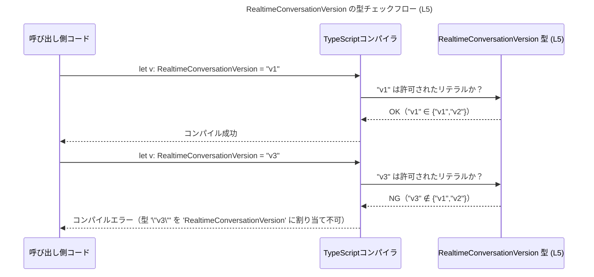

# app-server-protocol\schema\typescript\RealtimeConversationVersion.ts

## 0. ざっくり一言

- リアルタイム会話の「バージョン」を表すための **文字列リテラル型のユニオン**（`"v1"` または `"v2"`）を定義する、コード生成済みの TypeScript スキーマファイルです（`RealtimeConversationVersion.ts:L1-5`）。

---

## 1. このモジュールの役割

### 1.1 概要

- このモジュールは、リアルタイム会話機能の「バージョン」を型レベルで表現するために存在します。
- `RealtimeConversationVersion` という型エイリアスを定義し、その値を `"v1"` か `"v2"` のいずれかに制約します（`RealtimeConversationVersion.ts:L5-5`）。
- ファイル先頭コメントから、この定義は `ts-rs` によって自動生成されており、手動編集しないことが明記されています（`RealtimeConversationVersion.ts:L1-3`）。

### 1.2 アーキテクチャ内での位置づけ

- このファイルは **型定義のみ** を提供し、関数やロジックを持ちません（`RealtimeConversationVersion.ts:L5-5`）。
- 利用側（API クライアントやアプリケーションコードなど）は、この型をインポートして「バージョンの取りうる値」を TypeScript レベルで限定することが想定されますが、具体的な利用コードはこのチャンクには現れません。

この前提を図で表すと、次のようになります。

```mermaid
graph TD
    subgraph Generated["RealtimeConversationVersion.ts (L1-5)"]
        V["type RealtimeConversationVersion = \"v1\" | \"v2\" (L5)"]
    end

    U["利用側 TypeScript コード（このチャンクには現れない）"]

    U --> V
```

- 矢印は「利用側コードが `RealtimeConversationVersion` 型定義に依存する」ことを表します。
- 利用側の具体的なモジュール名やファイルパスはこのチャンクには出てこないため、「このチャンクには現れない」と明示しています。

### 1.3 設計上のポイント

- **コード生成ファイル**  
  - `ts-rs` によって生成されており、手動で変更しないことがコメントで明示されています（`RealtimeConversationVersion.ts:L1-3`）。
- **型エイリアス + 文字列リテラルユニオン**  
  - `RealtimeConversationVersion` は `type` キーワードで定義された **型エイリアス**であり、値を `"v1"` | `"v2"` の 2 値に限定します（`RealtimeConversationVersion.ts:L5-5`）。
- **状態・ロジックを持たない**  
  - クラス・オブジェクト・関数は一切定義されておらず、状態や振る舞いはありません（`RealtimeConversationVersion.ts:L1-5`）。
- **エラーや並行性に関する挙動**  
  - このファイル自体には実行時コードがないため、ランタイムエラー・例外・並行性制御などは発生しません。  
  - 代わりに、TypeScript コンパイル時の **型チェック**によって誤ったバージョン文字列の使用を防ぐ役割を持ちます。

---

## 2. 主要な機能一覧

このファイルで提供される機能は 1 つだけです。

- `RealtimeConversationVersion` 型定義: リアルタイム会話のバージョンを `"v1"` または `"v2"` のどちらかに制約する文字列リテラルユニオン型（`RealtimeConversationVersion.ts:L5-5`）。

---

## 3. 公開 API と詳細解説

### 3.1 型一覧（構造体・列挙体など）

このチャンクに現れる型「コンポーネント」のインベントリーです。

| 名前 | 種別 | 役割 / 用途 | 定義位置 |
|------|------|-------------|----------|
| `RealtimeConversationVersion` | 型エイリアス（文字列リテラルユニオン） | リアルタイム会話におけるバージョン文字列を `"v1"` または `"v2"` のみに制約する。アプリ側ではこの型を使うことで、誤ったバージョン名の使用をコンパイル時に検出できる。 | `app-server-protocol\schema\typescript\RealtimeConversationVersion.ts:L5-5` |

#### 型の意味（TypeScript の観点）

- **文字列リテラル型（string literal type）**  
  - `"v1"` や `"v2"` のように、特定の文字列値だけを許可する型です。
- **ユニオン型（union type）**  
  - `A | B` の形式で、「A または B のどちらか」を表す型です。
- このファイルでは、これらを組み合わせて  
  `type RealtimeConversationVersion = "v1" | "v2";`  
  という定義になっています（`RealtimeConversationVersion.ts:L5-5`）。

### 3.2 関数詳細（最大 7 件）

- このファイルには関数・メソッド・クラスコンストラクタなど、実行時に呼び出されるロジックは一切定義されていません（`RealtimeConversationVersion.ts:L1-5`）。
- したがって、詳細解説の対象となる「公開関数 API」は存在しません。

### 3.3 その他の関数

- 補助関数・ユーティリティ関数なども定義されていません（`RealtimeConversationVersion.ts:L1-5`）。

---

## 4. データフロー

このファイル単体では実行時の処理は行いませんが、**型チェックの観点**でデータ（= 文字列リテラル）がどのように扱われるかを、TypeScript コンパイル時のフローとして整理します。

### 4.1 型チェックの流れ（コンパイル時）

コンパイル時の典型的なフローを、シーケンス図で表します。



- 実際には `RealtimeConversationVersion` 型はコンパイル時にのみ存在し、JavaScript にトランスパイルされると消えます（TypeScript の型システムの一般的な仕様）。
- そのため、実行時のオーバーヘッドやパフォーマンスへの影響はありません。

---

## 5. 使い方（How to Use）

### 5.1 基本的な使用方法

`RealtimeConversationVersion` 型をインポートし、変数・関数引数・戻り値などに付与して利用します。

```typescript
// RealtimeConversationVersion 型をインポートする
// 実際のパスはプロジェクト構成に依存します。
// このチャンクからは相対パスは分からないため例示のみです。
import type { RealtimeConversationVersion } from "./RealtimeConversationVersion";

// 正しい使い方: "v1" または "v2" を代入
const version1: RealtimeConversationVersion = "v1";  // OK
const version2: RealtimeConversationVersion = "v2";  // OK

// 間違った例（コメントアウトを外すとコンパイルエラーになる想定）
// const invalidVersion: RealtimeConversationVersion = "v3"; 
// エラー: 型 '"v3"' を 'RealtimeConversationVersion' に割り当てることはできません
```

- ここで `"v1"` / `"v2"` 以外の文字列を代入すると、TypeScript コンパイラがエラーとして検出します。  
- 実行前に誤った文字列が弾かれるため、コード上でのバージョン指定ミスを防ぐことができます。

### 5.2 よくある使用パターン

#### 5.2.1 関数の引数・戻り値として使う

API クライアント関数などで、バージョンを引数として受け取る場合の例です。

```typescript
import type { RealtimeConversationVersion } from "./RealtimeConversationVersion";

// 指定されたバージョンでリアルタイム会話を開始する関数の例
function startRealtimeConversation(
    version: RealtimeConversationVersion,  // "v1" または "v2" に制約
): void {
    // version は型レベルで2値に限定されている
    // ここでは if / switch でバージョン分岐が可能
    if (version === "v1") {
        // v1 用の処理
    } else {
        // v2 用の処理
    }
}
```

- 呼び出し側が `"v3"` のような値を渡した場合、コンパイル時にエラーとなるため、関数内部では `"v1"` または `"v2"` であることが保証されます（TypeScript の型システムによる静的保証）。

#### 5.2.2 サーバーからのレスポンスの型として使う

サーバーからデシリアライズしたデータに対して、型アサーション（または型ガード）を併用するパターンです。

```typescript
import type { RealtimeConversationVersion } from "./RealtimeConversationVersion";

type ConversationInfo = {
    id: string;                         // 会話ID
    version: RealtimeConversationVersion; // バージョン: "v1" または "v2"
};

// サーバーから取得した JSON をパースした後に使う例
function handleConversation(info: ConversationInfo) {
    // info.version は "v1" | "v2" として扱える
    console.log(`Conversation ${info.id} runs on version ${info.version}`);
}
```

- 実際のネットワークレスポンスは実行時の `string` であるため、  
  ランタイムのバリデーションは別途必要ですが、アプリ内部では  
  「version は `RealtimeConversationVersion` 型である」という前提で安全に扱えます。

### 5.3 よくある間違い

#### 5.3.1 単なる `string` 型で受けてしまう

```typescript
// 間違い例: string で受けてしまう
function badStart(version: string) {
    // "v3" など誤った値も通ってしまう
}
```

```typescript
// 正しい例: RealtimeConversationVersion で受ける
import type { RealtimeConversationVersion } from "./RealtimeConversationVersion";

function goodStart(version: RealtimeConversationVersion) {
    // "v1" / "v2" 以外はコンパイル時に弾かれる
}
```

#### 5.3.2 ランタイム検証もしていると勘違いする

- `RealtimeConversationVersion` は **コンパイル時の型情報のみ** を提供します。
- 実行時に外部から受け取った文字列（JSON など）に対して、この型だけで自動的に検証が行われるわけではありません。
- ランタイムでの安全性が必要な場合は、別途バリデーションロジックやスキーマバリデーションライブラリを利用する必要があります。  
  （このファイルにはそのようなロジックは一切含まれていません：`RealtimeConversationVersion.ts:L1-5`）

### 5.4 使用上の注意点（まとめ）

- **コンパイル時専用**  
  - この型は TypeScript の型レベルの制約であり、JavaScript にトランスパイルされると消えます。  
    → 実行時の検証は別途必要です。
- **許可される値の範囲**  
  - 現状 `"v1"` と `"v2"` のみが許可されています（`RealtimeConversationVersion.ts:L5-5`）。  
    → 新しいバージョン（例: `"v3"`）を利用するには、生成元の定義を更新し、このファイルを再生成する必要があります。
- **コード生成ファイルであること**  
  - コメントに「手動で編集しない」と明記されています（`RealtimeConversationVersion.ts:L1-3`）。  
    → 直接変更すると、コード生成プロセスで上書きされる可能性があります。

---

## 6. 変更の仕方（How to Modify）

### 6.1 新しい機能を追加する場合

このファイルは `ts-rs` による生成コードであるため（`RealtimeConversationVersion.ts:L1-3`）、**直接編集は推奨されません**。

新しいバージョン（例: `"v3"`）を追加したい場合の一般的な方針は次のとおりです。

1. **生成元の定義を変更する**  
   - `ts-rs` は通常、Rust 側の型定義から TypeScript の型を生成しますが、  
     具体的な元ファイル（Rust 側の型）はこのチャンクには現れません。  
   - そのため、「どのファイルを変えるか」については、このファイル単体からは不明です。
2. **コード生成を再実行する**  
   - プロジェクトのビルド／スクリプト経由で `ts-rs` のコード生成を再実行し、  
     `RealtimeConversationVersion.ts` を再生成します。
3. **利用側コードの更新**  
   - 新しいバージョン `"v3"` に対応する処理（分岐など）を、利用側の TypeScript コードに追加します。  
   - 利用側コードはこのチャンクには現れないため、具体的な場所は不明です。

### 6.2 既存の機能を変更する場合

- 例えば `"v1"` を廃止したい、 `"v2"` の表記を `"v2.0"` に変えたい、といった場合も、
  基本的には **生成元の型定義** を変更し、再生成する流れになります。
- 変更時に注意すべき点:
  - **互換性**  
    - 既存コードで `"v1"` / `"v2"` を直接文字列リテラルとして使用している部分がある場合、  
      型エラーが発生する可能性があります。
  - **契約の前提条件**  
    - この型を引数や戻り値で公開している関数は、「バージョンは `RealtimeConversationVersion` に含まれる値のみ」という契約を暗黙に持っています。  
    - 値の追加・削除は、その契約を変えることになるため、利用箇所の影響調査が必要です。

---

## 7. 関連ファイル

このチャンクから分かる範囲での関連要素を整理します。

| パス / 要素 | 役割 / 関係 |
|------------|------------|
| `app-server-protocol\schema\typescript\RealtimeConversationVersion.ts` | 本ファイル。`RealtimeConversationVersion` 型エイリアスを定義するコード生成済み TypeScript スキーマ（`L1-5`）。 |
| `ts-rs`（外部ツール） | ファイル先頭コメントに記載されているコードジェネレータ。Rust などの型定義から本ファイルを生成していると考えられますが、生成元の具体的なファイルパスはこのチャンクには現れません（`RealtimeConversationVersion.ts:L2-3`）。 |
| 利用側 TypeScript コード | `RealtimeConversationVersion` をインポートして使用するコード。具体的なファイル名・パスはこのチャンクには現れないため不明です。 |

- このファイル内には他の TypeScript モジュールやファイルをインポートする記述はありません（`RealtimeConversationVersion.ts:L1-5`）。  
  そのため、依存関係の情報はほぼ「ts-rs による生成物である」というコメントに限られています。

---

### まとめ（安全性・エッジケース・並行性の観点）

- **安全性（型安全）**  
  - `"v1"` / `"v2"` 以外のバージョン指定をコンパイル時に検出できる点が、この型の主な安全性上の利点です。
- **エッジケース**  
  - 値の集合が非常に限定されているため、エッジケースは主に「定義されていないバージョン文字列を使おうとしたとき」に発生し、これはコンパイルエラーになります。
- **並行性**  
  - 実行時ロジック・共有状態・I/O が存在しないため、このファイル単体では並行性に関する懸念はありません。
