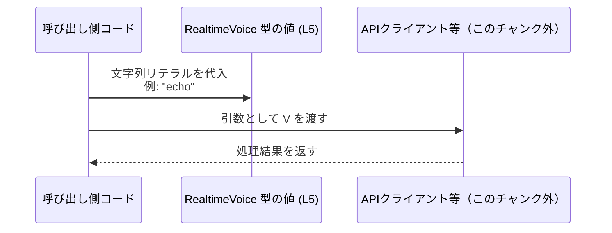

# app-server-protocol\schema\typescript\RealtimeVoice.ts コード解説

## 0. ざっくり一言

`RealtimeVoice.ts` は、`RealtimeVoice` という **文字列リテラル・ユニオン型**（特定の文字列だけを許可する型）を 1 つだけ公開する、自動生成された TypeScript ファイルです（`export type RealtimeVoice = ...`、L5）。

---

## 1. このモジュールの役割

### 1.1 概要

- このモジュールは、`RealtimeVoice` という型名で、19 個の特定の文字列リテラルのみを許可する **型エイリアス**（type alias）を提供します（L5）。
- 冒頭コメントから、このファイルは `ts-rs` によって自動生成され、手で編集すべきではないと明記されています（L1, L3）。
- 型名と文字列の内容から、何らかの「音声」や「ボイス」を識別する値の集合を表していると推測できますが、用途はこのチャンクからは確定できません。

### 1.2 アーキテクチャ内での位置づけ

- このファイルは **1 つの型を `export` するだけ**で、他モジュールの `import` はありません（L5）。
- 従って、このチャンクから分かるのは「他の TypeScript コードが `RealtimeVoice` をインポートして使うための、スキーマ定義ファイル」であるという点のみです。
- 実際にどのモジュールがこの型を参照しているかは、このチャンクには現れません。

依存関係（このチャンクで分かる範囲）の概略図です。


> 他モジュール（例: API クライアント、設定オブジェクトなど）との関係は、このチャンクには現れないため不明です。

### 1.3 設計上のポイント

- 自動生成コード  
  - 行頭コメントに「GENERATED CODE」「Do not edit this file manually」とあり（L1, L3）、ツール `ts-rs` による生成物であることが明示されています。
- 型のみで構成  
  - 実行時ロジックや関数は一切なく、**型定義のみ**が記述されています（L5）。
- 閉じた集合を表す文字列リテラル・ユニオン型  
  - `"alloy" | "arbor" | ... | "verse"` のように、列挙された 19 個の文字列のいずれかにしかならない型になっています（L5）。
  - これにより、`RealtimeVoice` を型として使うコードでは、「誤った文字列を渡す」ことをコンパイル時に防止できます。
- エラー処理・並行性  
  - このファイルは型定義のみで、実行時の処理を行わないため、**エラー処理や並行性・スレッド安全性に関するロジックは存在しません**。

---

## 2. 主要な機能一覧

このファイルが提供する「機能」は、実行時の関数ではなく、次の 1 つの型定義です。

- `RealtimeVoice` 型:  
  19 個の特定の文字列リテラル (`"alloy"`, `"arbor"`, …, `"verse"`) のいずれかを表す型エイリアスです（L5）。

---

## 3. 公開 API と詳細解説

### 3.1 型一覧（構造体・列挙体など）

このファイルで公開されている型は 1 つです。

| 名前           | 種別                  | 役割 / 用途（コードから読み取れる範囲）                                                                 | 根拠行番号 |
|----------------|-----------------------|----------------------------------------------------------------------------------------------------------|-----------|
| `RealtimeVoice` | 型エイリアス（ユニオン） | 19 個の特定の文字列リテラル（`"alloy"` 〜 `"verse"`）のいずれかを表す型。文字列値をこの集合に制約するために使われます。 | `RealtimeVoice.ts:L5` |

#### `RealtimeVoice` の型の意味

```ts
export type RealtimeVoice =
  | "alloy"
  | "arbor"
  | "ash"
  | "ballad"
  | "breeze"
  | "cedar"
  | "coral"
  | "cove"
  | "echo"
  | "ember"
  | "juniper"
  | "maple"
  | "marin"
  | "sage"
  | "shimmer"
  | "sol"
  | "spruce"
  | "vale"
  | "verse";
```

- TypeScript の **文字列リテラル・ユニオン型** です。
- `RealtimeVoice` 型の変数や引数には、上記 19 個の文字列のいずれかしか代入できません。
- `string` 全体ではなく列挙された値に制限することで、IDE 補完やコンパイル時チェックが効きます。

### 3.2 関数詳細（最大 7 件）

- **このファイルには関数定義が一切ありません**（L1–L5 を確認しても `function` や `=>` を用いた関数宣言が存在しないため）。
- 従って、このセクションで詳細解説するべき公開関数はありません。

### 3.3 その他の関数

- 補助的な関数やラッパー関数も、このファイルには存在しません。

---

## 4. データフロー

このファイルは型定義のみで実行時処理を持たないため、「ファイル内で完結するデータフロー」は存在しません。

一方で、`RealtimeVoice` 型を利用する典型的なデータフローは、次のように考えられます（**これは利用例であり、このチャンクには実装は現れません**）。



- 呼び出し側コードで `"echo"` などのリテラルを使って `RealtimeVoice` 型の値を作る。
- その値を API クライアントや設定オブジェクトの引数として渡す。
- `RealtimeVoice` 型であることで、存在しないボイス名をコンパイル時に防止できます。

---

## 5. 使い方（How to Use）

### 5.1 基本的な使用方法

`RealtimeVoice` 型を関数の引数や設定オブジェクトのプロパティに使うことで、許可される文字列を限定できます。

```typescript
// RealtimeVoice 型をインポートする                          // 型を使う側のファイル
import type { RealtimeVoice } from "./RealtimeVoice";         // パスはプロジェクト構成に応じて調整する

// RealtimeVoice を引数に持つ関数を定義する                  // 許可される文字列を型で制約
function startRealtimeSession(voice: RealtimeVoice) {         // voice は 19 個の文字列のどれかに限定される
    console.log("use voice:", voice);                         // voice は string だが、値の集合は制限されている
}

// 正しい使い方（コンパイル成功）                           // ユニオンに含まれる値
startRealtimeSession("echo");                                 // OK: "echo" は L5 に列挙されている

// 間違った使い方（コンパイルエラー）                       // ユニオンに含まれない値
// startRealtimeSession("unknown");                           // エラー: 型 '"unknown"' は RealtimeVoice に割り当てられない
```

- `RealtimeVoice` を使うことで、`"unknown"` のような無効な文字列をコンパイル時に検出できます。
- 実行時のエラーではなく **コンパイルエラー** になる点が、安全性の面で重要です。

### 5.2 よくある使用パターン

1. **設定オブジェクトのプロパティとして使う**

```typescript
import type { RealtimeVoice } from "./RealtimeVoice";   // RealtimeVoice 型を利用

// 設定オブジェクトの型定義                                   // voice プロパティを RealtimeVoice に限定
interface RealtimeConfig {
    voice: RealtimeVoice;                               // 19 個のいずれか
}

// 設定を使う例                                               // voice に無効な文字列を入れるとコンパイルエラー
const config: RealtimeConfig = {
    voice: "breeze",                                    // OK
    // voice: "other",                                  // NG: RealtimeVoice に含まれない
};
```

1. **ユーティリティ関数の返り値として使う**

```typescript
import type { RealtimeVoice } from "./RealtimeVoice";   // RealtimeVoice 型を利用

// 何らかのロジックでデフォルトのボイスを決める関数          // 戻り値が RealtimeVoice に制約される
function getDefaultVoice(): RealtimeVoice {
    return "alloy";                                     // OK: ユニオンに含まれる値
}
```

### 5.3 よくある間違い

**誤り例: 型を `string` のままにする**

```typescript
// 誤った例: string 型のままにしている                      // どんな文字列でも通ってしまう
function startRealtimeSessionBad(voice: string) {
    // ...
}

// "unknown" のような無効な値もコンパイルが通ってしまう      // エラーにならない
startRealtimeSessionBad("unknown");
```

**正しい例: `RealtimeVoice` 型を使う**

```typescript
// 正しい例: RealtimeVoice 型を使用                          // 許可される値を型で制約する
import type { RealtimeVoice } from "./RealtimeVoice";

function startRealtimeSessionGood(voice: RealtimeVoice) {
    // ...
}

// ユニオンにない値はコンパイルエラー                        // ランタイムに到達する前に検出できる
// startRealtimeSessionGood("unknown");                     // エラー
startRealtimeSessionGood("echo");                           // OK
```

### 5.4 使用上の注意点（まとめ）

- **前提条件 / コントラクト（契約）**
  - `RealtimeVoice` 型の値は、`"alloy"` から `"verse"` までの **19 個の文字列のいずれかであること** が契約です（L5）。
  - これ以外の文字列を代入しようとすると、TypeScript のコンパイルエラーになります。
- **エッジケース**
  - 空文字列 `""` や `null`, `undefined` は、いずれも `RealtimeVoice` ユニオンに含まれていないため、**そのままでは代入できません**。
  - 外部入力（ユーザー入力や API レスポンスなど）から値を受け取る場合は、**ランタイムで文字列をチェックしてから** `RealtimeVoice` として扱う必要があります。
- **セキュリティ / バグの観点**
  - このファイル自体は型定義のみで実行時ロジックがないため、直接的なセキュリティホールやバグ原因にはなりにくいです。
  - ただし、バックエンド側の許容値とこの TypeScript 型定義がずれた場合（生成が古いなど）、**フロントエンドではコンパイルが通るが、バックエンドではエラーになる** といった整合性の問題が起こりえます。
- **並行性**
  - 実行時の状態やスレッドを扱わない単なる型定義のため、並行性やスレッド安全性の懸念はありません。
- **パフォーマンス**
  - 型はコンパイル時にのみ意味を持ち、生成される JavaScript には影響しないため、ランタイムのパフォーマンス上のペナルティはありません。

---

## 6. 変更の仕方（How to Modify）

### 6.1 新しい機能（新しいボイス）を追加する場合

- コメントに **「GENERATED CODE! DO NOT MODIFY BY HAND!」** とあり、このファイルは `ts-rs` による自動生成物であることが明記されています（L1, L3）。
- したがって、**この TypeScript ファイルを直接編集して値を追加するべきではありません**。
- 一般的には、次の手順になります（ts-rs の仕様に基づく推測であり、このチャンクにはソースは現れません）:
  1. 生成元となる Rust 側の型定義（おそらく `RealtimeVoice` など）に新しいバリアントや文字列を追加する。
  2. `ts-rs` のコード生成を再実行し、この TypeScript ファイルを再生成する。
- 直接 `RealtimeVoice.ts` に `"new-voice"` を足しても、次回の生成で上書きされる可能性が高い点に注意が必要です。

### 6.2 既存の機能（既存のボイス）を変更する場合

- 既存の文字列リテラル名を変更・削除する場合も、**TypeScript ファイルを直接変更してはいけない**という点は同じです（L1, L3）。
- 変更の影響:
  - 型としては、ユニオンの要素が変わることで、既存コードのコンパイルエラーが発生する可能性があります。
  - 例えば `"echo"` を削除すると、`"echo"` を使っていたすべての呼び出し元がコンパイルエラーになります。
- 安全に変更するには:
  - 生成元の Rust などのスキーマ定義を変更し、ts-rs で生成しなおす。
  - その後、TypeScript 側で `RealtimeVoice` を使っている箇所をビルドし、コンパイルエラーとして影響範囲を確認する。
- 契約の観点:
  - この型は「許可される文字列のリスト」を表現しているため、値の追加・削除は **外部 API の契約変更** に相当します。
  - バックエンド・フロントエンド双方のスキーマが同期されていることを確認する必要があります。

---

## 7. 関連ファイル

このチャンクから直接分かる関連ファイルはありませんが、コメントから推測できる範囲を整理します。

| パス / 種別                         | 役割 / 関係                                                                                      |
|------------------------------------|---------------------------------------------------------------------------------------------------|
| （Rust 側の型定義ファイル）        | コメントにあるとおり `ts-rs` によって生成されているため（L3）、Rust 側に対応する型定義が存在すると考えられますが、このチャンクにはパスやファイル名は現れません。 |
| `app-server-protocol\schema\typescript\RealtimeVoice.ts` | 本ファイル。`RealtimeVoice` 型を TypeScript 側に提供するスキーマ定義。                          |

> テストコードや他の TypeScript モジュールとの具体的な関係は、このチャンクには現れないため不明です。

---

### コンポーネントインベントリー（このチャンクのまとめ）

| 種別     | 名前           | 概要                                                                           | 定義場所                           |
|----------|----------------|--------------------------------------------------------------------------------|------------------------------------|
| 型エイリアス | `RealtimeVoice` | 19 個の文字列リテラル（`"alloy"` 〜 `"verse"`）のいずれかを表すユニオン型。 | `RealtimeVoice.ts:L5`              |
| コメント | -              | 自動生成コードであり手動編集禁止、`ts-rs` による生成であることを示すコメント。 | `RealtimeVoice.ts:L1-3`            |

このファイルには関数・クラス・列挙体・インターフェースは存在せず、公開 API は `RealtimeVoice` 型 1 つのみです。
