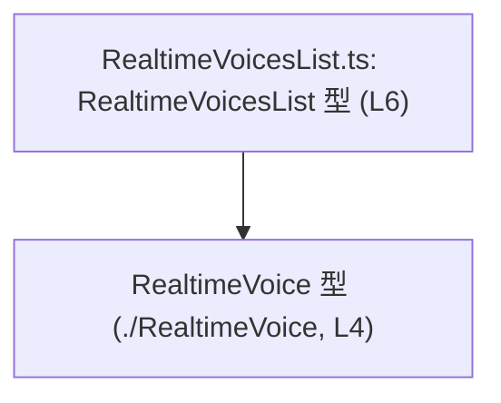
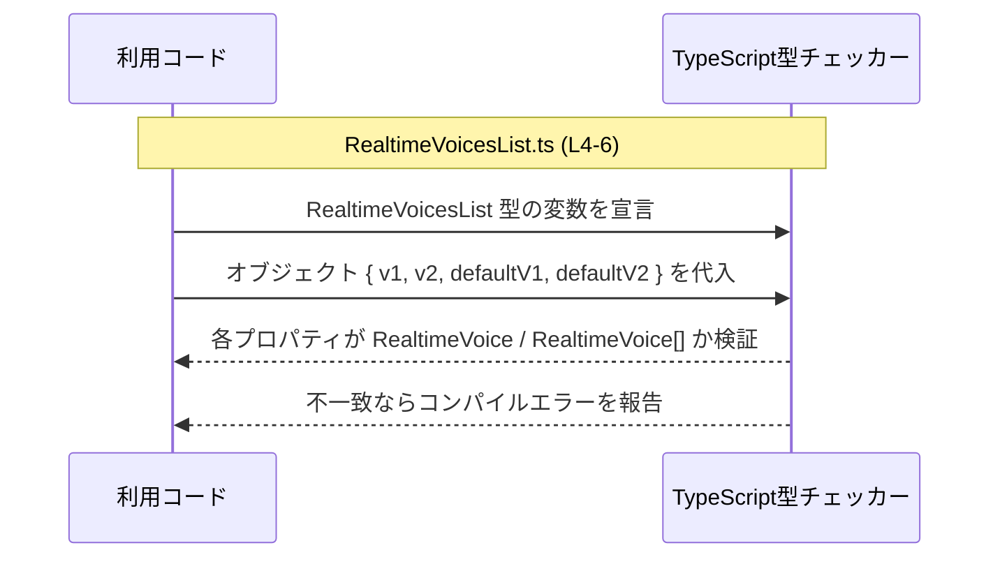

# app-server-protocol/schema/typescript/RealtimeVoicesList.ts

## 0. ざっくり一言

`RealtimeVoice` 型の配列とデフォルト値をまとめた、`RealtimeVoicesList` という TypeScript のオブジェクト型エイリアスを定義するファイルです（`RealtimeVoicesList.ts:L4-6`）。  
Rust から `ts-rs` によって自動生成されるため、手動編集は想定されていません（`RealtimeVoicesList.ts:L1-3`）。

---

## 1. このモジュールの役割

### 1.1 概要

- このモジュールは、`RealtimeVoice` 型の
  - 2 つの配列 `v1`, `v2`
  - 2 つの単一値 `defaultV1`, `defaultV2`  
  を持つオブジェクト型 `RealtimeVoicesList` をエクスポートします（`RealtimeVoicesList.ts:L4-6`）。
- 実行時の処理は一切含まず、型情報だけを提供します。

### 1.2 アーキテクチャ内での位置づけ

- 依存関係
  - このファイルは `./RealtimeVoice` から `RealtimeVoice` 型を type-only import しています（`RealtimeVoicesList.ts:L4`）。
  - 他のどのモジュールが `RealtimeVoicesList` を利用しているかは、このチャンクには現れません（不明）。

依存関係を簡略化した図は以下のとおりです。



### 1.3 設計上のポイント

- 自動生成コード  
  - ファイル先頭に「GENERATED CODE」「Do not edit this file manually」と明記されています（`RealtimeVoicesList.ts:L1-3`）。
  - 型定義を変更したい場合は、生成元（Rust 側 + ts-rs 設定）を変更する前提です。
- 型のみを提供  
  - `import type` により `RealtimeVoice` を参照しており（`RealtimeVoicesList.ts:L4`）、実行時コードは一切含まれません。
- 一貫した要素型  
  - `v1`, `v2`, `defaultV1`, `defaultV2` のすべてが `RealtimeVoice` 型で統一されています（`RealtimeVoicesList.ts:L4-6`）。
- 必須プロパティのみ  
  - 4 プロパティすべてに `?` が付いておらず、オプショナルではありません（`RealtimeVoicesList.ts:L6`）。

---

## 2. 主要な機能一覧

このモジュールは「型定義のみ」を提供します。

- `RealtimeVoicesList`:  
  `v1`, `v2` の 2 つの `RealtimeVoice[]` と、`defaultV1`, `defaultV2` の 2 つの `RealtimeVoice` を持つオブジェクト型（`RealtimeVoicesList.ts:L4-6`）。

---

## 3. 公開 API と詳細解説

### 3.1 型一覧（構造体・列挙体など）

| 名前                  | 種別          | 役割 / 用途                                                                 | 定義位置                               | 関連 |
|-----------------------|---------------|-----------------------------------------------------------------------------|----------------------------------------|------|
| `RealtimeVoicesList`  | 型エイリアス  | 2 つの `RealtimeVoice` 配列と 2 つの `RealtimeVoice` デフォルト値をまとめる | `RealtimeVoicesList.ts:L6`             | `RealtimeVoice`（`RealtimeVoicesList.ts:L4`） |

`RealtimeVoicesList` の構造（コードから分かる範囲）は次のとおりです（`RealtimeVoicesList.ts:L6`）。

```typescript
export type RealtimeVoicesList = {
    v1: Array<RealtimeVoice>;
    v2: Array<RealtimeVoice>;
    defaultV1: RealtimeVoice;
    defaultV2: RealtimeVoice;
};
```

> 補足: `RealtimeVoice` 型の中身は別ファイル `./RealtimeVoice` 側にあり、このチャンクには現れません（`RealtimeVoicesList.ts:L4`）。

### 3.2 関数詳細

- このモジュールには関数・メソッドは一切定義されていません（`RealtimeVoicesList.ts:L1-6`）。

### 3.3 その他の関数

- 該当なし（補助関数やラッパー関数は存在しません）。

---

## 4. データフロー

このファイル自体には実行時処理はありませんが、**型チェック時** にどのように関係するかを示します。

典型的な流れ（型レベル）:

1. 利用側コードが `RealtimeVoicesList` 型の変数を宣言する。
2. その変数に代入するオブジェクトの各プロパティについて、TypeScript コンパイラが
   - `v1`, `v2` が `RealtimeVoice[]` か
   - `defaultV1`, `defaultV2` が `RealtimeVoice` か  
   をチェックする（`RealtimeVoicesList.ts:L6`）。
3. 型が一致しない場合はコンパイルエラーになります。

この型レベルのやり取りをシーケンス図で表します。



---

## 5. 使い方（How to Use）

### 5.1 基本的な使用方法

`RealtimeVoicesList` 型を使って、オブジェクト構造を型安全に表現する例です。  
`RealtimeVoice` の具体的なフィールドはこのチャンクにはないため、ダミーの形にしています。

```typescript
// RealtimeVoicesList 型と RealtimeVoice 型を import する
// 実際の import パスはプロジェクト設定に応じて調整する必要があります。
import type { RealtimeVoicesList } from "app-server-protocol/schema/typescript/RealtimeVoicesList";
import type { RealtimeVoice } from "app-server-protocol/schema/typescript/RealtimeVoice";

// ダミーの RealtimeVoice 値（実際のフィールドは RealtimeVoice 定義を参照）
const sampleVoiceV1: RealtimeVoice = {
    // ... RealtimeVoice 型の必須フィールドをここに記述する
};

// RealtimeVoicesList 型の値を作成する
const voices: RealtimeVoicesList = {
    v1: [sampleVoiceV1],   // v1 は RealtimeVoice の配列
    v2: [],                // v2 も RealtimeVoice の配列（空配列でも可）
    defaultV1: sampleVoiceV1, // defaultV1 は RealtimeVoice 単体
    defaultV2: sampleVoiceV1, // defaultV2 も RealtimeVoice 単体
};

// voices 変数を用いることで、
// v1・v2 の各要素や defaultV1・defaultV2 に対して RealtimeVoice として型補完が効く。
```

このように、`RealtimeVoicesList` によって「構造」と「要素の型」が固定されるため、IDE での補完やコンパイル時チェックが有効に働きます。

### 5.2 よくある使用パターン

このチャンクだけからは具体的な利用箇所は分かりませんが、同様の型は一般に次のような場面で使われます（一般論です）。

1. **API レスポンスの型**  
   サーバー側が「利用可能な音声一覧 + デフォルト音声」を返す場合、その JSON 構造を `RealtimeVoicesList` で表現する。
2. **設定オブジェクトの型**  
   アプリケーション設定として、「候補となる音声」と「デフォルト音声」をまとめて持つ構造に型を付ける。

どの場合でも、`RealtimeVoicesList` 型を使うことで:

- `v1`, `v2` に別の型の配列を誤って入れる
- `defaultV1`, `defaultV2` を `null` や別の型にしてしまう  
といったミスをコンパイル時に検出できます（`RealtimeVoicesList.ts:L6`）。

### 5.3 よくある間違い

`RealtimeVoicesList` を使う際に起こり得る誤用例（可能性として）と、その修正版です。

```typescript
// 間違い例: v1 を配列ではなく単一の RealtimeVoice にしてしまう
const wrongVoices /*: RealtimeVoicesList*/ = {
    // v1 に RealtimeVoice を直接代入している（配列ではない）
    v1: sampleVoiceV1,
    v2: [],
    defaultV1: sampleVoiceV1,
    defaultV2: sampleVoiceV1,
};
// ↑ 型注釈を付けると、コンパイラが
//   「v1 プロパティは RealtimeVoice[] であるべき」とエラーにしてくれる（L6）


// 正しい例: v1 を RealtimeVoice の配列にする
const correctVoices: RealtimeVoicesList = {
    v1: [sampleVoiceV1],
    v2: [],
    defaultV1: sampleVoiceV1,
    defaultV2: sampleVoiceV1,
};
```

別の誤用パターンとして、プロパティ名のスペルミスがあります。

```typescript
// 間違い例: プロパティ名を typo している
const wrongKeys: RealtimeVoicesList = {
    v1: [sampleVoiceV1],
    V2: [],                  // 大文字・小文字が違うため、v2 とは別プロパティになる
    defaultV1: sampleVoiceV1,
    defaultV2: sampleVoiceV1,
};
// ↑ TypeScript は unknown プロパティ V2 をエラーにしないが、
//   v2 が不足しているとしてエラーまたは警告になる（strict 設定による）

// 正しい例
const correctKeys: RealtimeVoicesList = {
    v1: [sampleVoiceV1],
    v2: [],                  // 正しいプロパティ名
    defaultV1: sampleVoiceV1,
    defaultV2: sampleVoiceV1,
};
```

### 5.4 使用上の注意点（まとめ）

- **4 プロパティはすべて必須**  
  - `v1`, `v2`, `defaultV1`, `defaultV2` に `?` が付いていないため、省略はできません（`RealtimeVoicesList.ts:L6`）。
- **配列と単一値を混同しない**  
  - `v1`, `v2` は `RealtimeVoice[]`、`defaultV1`, `defaultV2` は `RealtimeVoice` 単体です（`RealtimeVoicesList.ts:L6`）。
- **実行時型は保証されない**  
  - TypeScript の型はコンパイル時のみ有効であり、ランタイムでのバリデーションは別途必要です（このファイルには実行時チェックはありません）。
- **自動生成ファイルを直接編集しない**  
  - コメントで「GENERATED CODE」「Do not edit manually」と明記されているため（`RealtimeVoicesList.ts:L1-3`）、変更は生成元で行うのが前提です。

---

## 6. 変更の仕方（How to Modify）

このファイルは `ts-rs` による自動生成であり、直接編集は推奨されません（`RealtimeVoicesList.ts:L1-3`）。

### 6.1 新しい機能を追加する場合

たとえば `RealtimeVoicesList` に新しいプロパティ（例: `experimental: RealtimeVoice[]`）を追加したい場合の一般的な手順です。

1. **Rust 側の型定義を変更する**  
   - `ts-rs` が参照している Rust の構造体や型定義に、対応するフィールドを追加します。  
   - 対応する Rust ファイルの場所はこのチャンクには現れないため不明です（パスはプロジェクト依存）。
2. **`ts-rs` によるコード生成を再実行する**  
   - ビルドスクリプトや専用コマンドで TypeScript スキーマを再生成します。
3. **生成された `RealtimeVoicesList.ts` を確認する**  
   - 新しいフィールドが型エイリアスに現れていることを確認します。

### 6.2 既存の機能を変更する場合

既存プロパティの型変更や名前変更を行う場合も、基本方針は同じです。

- **影響範囲の確認**
  - `RealtimeVoicesList` を import している TypeScript コードを検索し、どのプロパティを使っているかを確認します（このチャンクでは利用先は不明）。
- **契約の維持**
  - `v1`/`v2` が配列であること、`defaultV1`/`defaultV2` が単一値であることは、利用側コードの前提になっている可能性があります。
- **変更手順**
  1. Rust 側の型定義を変更。
  2. `ts-rs` で再生成。
  3. TypeScript 側でコンパイルエラーが出た箇所を修正。

---

## 7. 関連ファイル

このモジュールと密接に関連するファイルは、コードから次のように読み取れます。

| パス                                                   | 役割 / 関係 |
|--------------------------------------------------------|------------|
| `app-server-protocol/schema/typescript/RealtimeVoice.ts` | `RealtimeVoice` 型を定義していると推測されるファイル。`RealtimeVoicesList.ts` から `import type { RealtimeVoice } from "./RealtimeVoice";` されている（`RealtimeVoicesList.ts:L4`）。 |
| （Rust側の対応する型定義ファイル; パス不明）          | コメントにある `ts-rs` により、本ファイルの型定義が生成される元になっていると考えられますが、具体的なファイルパスや型名はこのチャンクには現れません（`RealtimeVoicesList.ts:L1-3`）。 |

---

### Bugs / Security / Contracts / Edge cases について（このファイルに関するまとめ）

- **バグ・セキュリティ**
  - 実行時コードを一切含まない型定義ファイルであるため、直接的な実行時バグやセキュリティ脆弱性は生じません（`RealtimeVoicesList.ts:L4-6`）。
- **契約（前提条件）**
  - `RealtimeVoicesList` 型の値は、4 つの必須プロパティを持ち、それぞれ `RealtimeVoice` または `RealtimeVoice[]` であることが前提です（`RealtimeVoicesList.ts:L6`）。
- **エッジケース**
  - `v1` / `v2` が空配列であることは型的に許容されます（配列型で `Array<RealtimeVoice>` のみ指定、長さ制約なし; `RealtimeVoicesList.ts:L6`）。
  - `defaultV1` / `defaultV2` は `RealtimeVoice` 必須であり、`null` や `undefined` は代入できません（strict null checks 前提）。
- **テスト**
  - このファイル自体にはテストは含まれていません（`RealtimeVoicesList.ts:L1-6`）。  
    利用側コードで、`RealtimeVoicesList` 型の値が期待どおり構築・シリアライズ・デシリアライズされるかをテストするのが一般的です（一般論）。
- **パフォーマンス / 並行性**
  - 型定義のみのため、パフォーマンス上・並行性上の懸念はありません。実際のコストは、この型を使う処理（API 通信、変換処理など）側に依存します。
