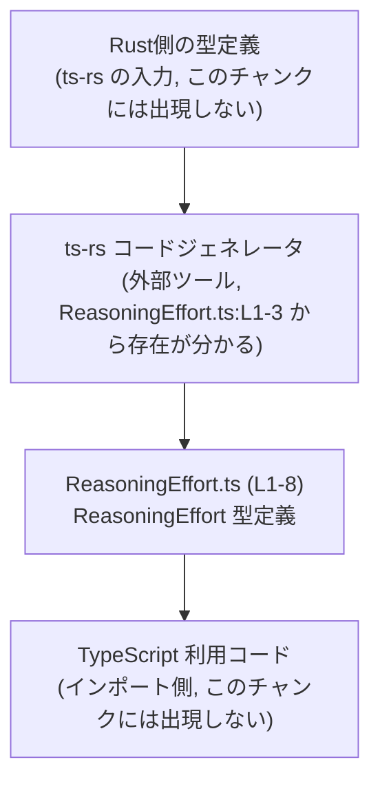
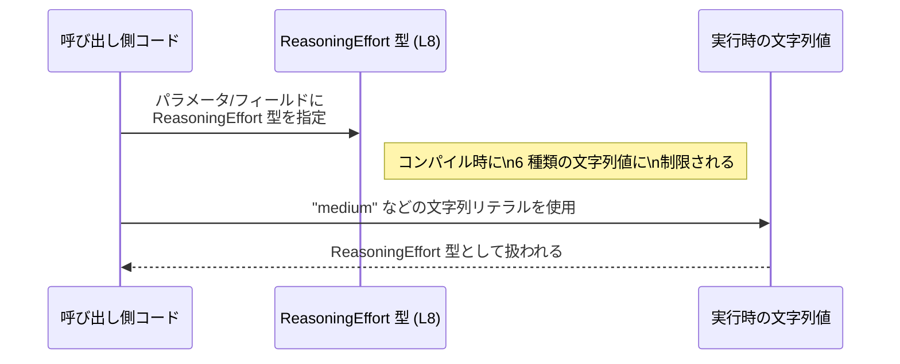

# app-server-protocol/schema/typescript/ReasoningEffort.ts コード解説

## 0. ざっくり一言

OpenAI の reasoning 機能に関連する「推論の強度」を表す文字列リテラル型 `ReasoningEffort` を定義する、自動生成された TypeScript スキーマファイルです（ReasoningEffort.ts:L1-3, L5-8）。

---

## 1. このモジュールの役割

### 1.1 概要

- このモジュールは、OpenAI の Reasoning ガイドへのリンク付きコメントを持ち（ReasoningEffort.ts:L5-6）、`ReasoningEffort` という型エイリアスを `export` しています（ReasoningEffort.ts:L8）。
- `ReasoningEffort` は `"none" | "minimal" | "low" | "medium" | "high" | "xhigh"` という **文字列リテラル型のユニオン** であり、許可された値の集合を表現します（ReasoningEffort.ts:L8）。
- コメントにより、このファイルが `ts-rs` によって **自動生成されたコード** であり、手動で編集すべきではないことが明示されています（ReasoningEffort.ts:L1-3）。

### 1.2 アーキテクチャ内での位置づけ

ディレクトリパス（`app-server-protocol/schema/typescript/`）とファイル先頭コメントから、次のような位置づけが読み取れます。

- `ts-rs` により生成された TypeScript スキーマ定義群の 1 ファイルである（ReasoningEffort.ts:L1-3）。
- 型レベルの情報のみを提供し、実行時ロジックやデータ処理は含みません（ReasoningEffort.ts:L8）。
- 実際にどのモジュールからインポートされているかは、このチャンクだけでは不明です（ReasoningEffort.ts:L1-8）。

概念的な依存関係を示す図を以下に示します（A, D はこのチャンクには現れず、コメントと一般的な ts-rs の利用形態からの推測であり、その旨を明示します）。



> A, D は **利用構成の一般的なイメージ** であり、具体的なファイル名や実装はこのチャンクからは分かりません。

### 1.3 設計上のポイント

- **自動生成コード**  
  - 冒頭コメントで「GENERATED CODE」「Do not edit manually」と明記されています（ReasoningEffort.ts:L1-3）。設計上、手動編集ではなく生成元（通常は Rust 側の型や ts-rs 設定）を変更する前提です。
- **列挙的な文字列ユニオン型**  
  - `ReasoningEffort` は 6 種類の文字列リテラルを列挙したユニオン型です（ReasoningEffort.ts:L8）。列挙体（`enum`）に近い役割を、ランタイムオーバーヘッドなしに型レベルで実現しています。
- **状態・ロジックを持たない純粋な型定義**  
  - クラスや関数、変数宣言はなく、型エイリアス 1 つのみです（ReasoningEffort.ts:L1-8）。したがって、このモジュールは状態や副作用、エラーハンドリングを持ちません。
- **TypeScript 特有の安全性**  
  - `ReasoningEffort` を利用することで、対応する引数・フィールドに対し、コンパイル時に `"none" | "minimal" | "low" | "medium" | "high" | "xhigh"` 以外の文字列を渡すとエラーにできます（ReasoningEffort.ts:L8）。

---

## 2. 主要な機能一覧

このファイルには関数やクラスは存在せず、主要な「機能」は 1 つの型定義に集約されています。

- `ReasoningEffort` 型定義: OpenAI reasoning 機能の「推論の強度」のような概念を、6 種類の文字列値に制限するための文字列リテラルユニオン型（ReasoningEffort.ts:L5-8）。

---

## 3. 公開 API と詳細解説

### 3.1 型一覧（構造体・列挙体など）

| 名前              | 種別                      | 役割 / 用途                                                                                      | 根拠 |
|-------------------|---------------------------|---------------------------------------------------------------------------------------------------|------|
| `ReasoningEffort` | 型エイリアス（文字列ユニオン） | `"none"`, `"minimal"`, `"low"`, `"medium"`, `"high"`, `"xhigh"` のいずれかであることを表す型。OpenAI Reasoning ガイドへのリンク付きコメントから、推論の「努力レベル」を指定するための型と解釈できる。 | ReasoningEffort.ts:L5-8 |

> このファイルには、構造体（`class` / `interface`）や `enum` は定義されていません（ReasoningEffort.ts:L1-8）。

#### `ReasoningEffort` の詳細

**概要**

- `ReasoningEffort` は、特定の用途向けに許可された文字列値を限定するための **文字列リテラルユニオン型** です（ReasoningEffort.ts:L8）。
- 許可される値は `"none" | "minimal" | "low" | "medium" | "high" | "xhigh"` の 6 種類で、コメントに記載された OpenAI Reasoning ガイド（ReasoningEffort.ts:L5-6）と型名から、推論の強度を指定するパラメータ向けであると解釈できます。

**内部構造**

- 実態は次の型エイリアスです（ReasoningEffort.ts:L8）。

```typescript
export type ReasoningEffort =
    | "none"
    | "minimal"
    | "low"
    | "medium"
    | "high"
    | "xhigh";
```

- これは TypeScript の **ユニオン型** であり、「どれか 1 つ」であることを表します。

**Errors / Panics**

- この型自体は実行時コードを持たないため、直接的にエラーやパニックを発生させることはありません（ReasoningEffort.ts:L1-8）。
- ただし、この型を使った関数・メソッドの定義に対して、許可されない文字列を渡そうとすると **コンパイル時エラー** になります。
  - 例: `const x: ReasoningEffort = "invalid";` は TypeScript コンパイラで型エラー。

**Edge cases（エッジケース）**

`ReasoningEffort` が取れる値そのものが有限であり、エッジケースは主に「型に定義されていない値」に関するものになります。

- 許可されていない文字列値  
  - `"none" | "minimal" | "low" | "medium" | "high" | "xhigh"` に含まれない文字列（例: `"very_high"`, `"x-high"`）は、型チェック時にエラーとなります。
- `null` / `undefined`  
  - `ReasoningEffort` は純粋な文字列ユニオンであり、`null` や `undefined` は含まれていません（ReasoningEffort.ts:L8）。  
    そのため、`ReasoningEffort | null` のようなユニオン型を別途定義しない限り、`null` や `undefined` を代入することはできません。
- 外部入力との整合性  
  - ランタイムに外部から取得した文字列（例: JSON ペイロード）を `ReasoningEffort` 型の変数に代入する場合、TypeScript の型システムだけでは値の妥当性は保証されません。  
    コンパイル時に安全でも、実行時に不正値が来る可能性があります（この点は TypeScript 一般の性質であり、このファイルには具体的なバリデーション処理は存在しません (ReasoningEffort.ts:L1-8)）。

**使用上の注意点**

- **自動生成コードであること**  
  - コメントで明示的に「GENERATED CODE」「Do not edit manually」とあるため（ReasoningEffort.ts:L1-3）、値の追加や変更は生成元（通常は Rust 側の型または ts-rs の設定）で行う設計です。
- **ランタイムバリデーションは自前で必要**  
  - この型はあくまでコンパイル時チェック用であり、実行時には存在しません。  
    外部入力をこの型にマッピングする場合、`if` 文やスキーマバリデーションライブラリなどで、6 種の値のいずれかであることを確認する必要があります。
- **`as any` / 型アサーションでの回避に注意**  
  - `as any` や不適切な型アサーションを多用すると、`ReasoningEffort` の型安全性を失い、実行時に不正値が流入する可能性があります。
- **将来的な値追加・削除の影響**  
  - 生成元の変更により `"xhigh"` などの値が追加・削除されると、`ReasoningEffort` に依存するコードのコンパイル結果や挙動が変わるため、依存箇所の確認が必要です。

### 3.2 関数詳細（最大 7 件）

- このファイルには関数宣言・メソッド・クラスメソッドなど **いかなる関数も定義されていません**（ReasoningEffort.ts:L1-8）。
- よって、本セクションで詳細解説すべき関数はありません。

### 3.3 その他の関数

| 関数名 | 役割（1 行） |
|--------|--------------|
| なし   | このファイルには関数は存在しません（ReasoningEffort.ts:L1-8）。 |

---

## 4. データフロー

このファイル単体には、処理ロジックや関数呼び出しが存在せず、データフローは定義されていません（ReasoningEffort.ts:L1-8）。  
以下は、**TypeScript の型として一般に想定される利用イメージ** を示す概念的なシーケンス図です。  
※この図は本チャンク外のコードを含むため、実際のリポジトリ構成と一致するかどうかは不明です。



要点:

- `ReasoningEffort` は **コンパイル時にのみ存在** し、実行時には単なる文字列として扱われます（ReasoningEffort.ts:L8）。
- 実行時にどのようなデータフローになるかは、`ReasoningEffort` を利用する他ファイルの実装に依存し、このチャンクからは分かりません。

---

## 5. 使い方（How to Use）

### 5.1 基本的な使用方法

ここでは、`ReasoningEffort` を関数引数や設定オブジェクトの型として利用する基本的な例を示します。  
インポートパスはプロジェクト構成に依存するため、例では相対パスを仮で用いています（このチャンクから実際のインポートパスは特定できません）。

```typescript
// ReasoningEffort 型をインポートする（パスは例示）                      // ReasoningEffort.ts から型をインポートする
import type { ReasoningEffort } from "./ReasoningEffort";                // 実際のパスはビルド/公開方法に応じて調整が必要

// ReasoningEffort を引数に取る関数を定義する                            // 推論の強度を指定する関数の例
function setReasoningEffort(effort: ReasoningEffort) {                   // effort は ReasoningEffort 型
    // ここで effort を外部 API などに渡す処理を書くと想定される           // 実際の処理内容はこのチャンクには現れない
    console.log("Reasoning effort:", effort);                            // effort は文字列として利用できる
}

// 正しい呼び出し例                                                        // 6 種のいずれかを渡す
setReasoningEffort("medium");                                            // OK: ReasoningEffort に含まれる値

// 型エラーとなる例（コンパイル時に検出される）                            // 許可されていない文字列
// setReasoningEffort("very_high");                                      // エラー: Type '"very_high"' is not assignable to type 'ReasoningEffort'.
```

このようにして、コンパイル時に `ReasoningEffort` 以外の文字列が渡されることを防ぐことができます（ReasoningEffort.ts:L8）。

### 5.2 よくある使用パターン

1. **設定オブジェクトのプロパティとして使う**

```typescript
// ReasoningEffort を用いる設定インターフェース                          // 設定オブジェクト内で使用する例
import type { ReasoningEffort } from "./ReasoningEffort";                // 型インポート

interface ReasoningConfig {                                              // 設定オブジェクトの型
    effort: ReasoningEffort;                                            // 推論の強度
    // 他の設定フィールド ...                                               // ここはこのチャンクには現れない
}

const config: ReasoningConfig = {                                       // 設定オブジェクトの作成
    effort: "high",                                                     // OK: 許可された値
    // 他の設定フィールド ...                                               // 省略
};
```

1. **オプショナルなパラメータとして使う**

```typescript
// オプショナルな ReasoningEffort フィールド                             // 設定の一部として optional にする例
import type { ReasoningEffort } from "./ReasoningEffort";                // 型インポート

interface OptionalReasoningConfig {                                      // 設定オブジェクトの型
    effort?: ReasoningEffort;                                           // 指定されない場合もある
}

const configA: OptionalReasoningConfig = {};                            // effort を省略（OK）
const configB: OptionalReasoningConfig = { effort: "minimal" };         // 許可された値（OK）
```

### 5.3 よくある間違い

1. **`string` 型を使ってしまい、型安全性を失う**

```typescript
// 間違い例: string 型で宣言してしまう                                     // 任意の文字列を許してしまう
function setEffortWrong(effort: string) {                                // string 型
    // "very_high" など不正な値も通ってしまう                              // 型チェックが弱い
}

// 正しい例: ReasoningEffort を利用する                                   // ユニオン型で値を制限する
import type { ReasoningEffort } from "./ReasoningEffort";                // 型インポート

function setEffortCorrect(effort: ReasoningEffort) {                     // ReasoningEffort 型
    // 許可された 6 種の値だけを受け取る                                   // コンパイル時にチェックされる
}
```

1. **型アサーションで安全性を損なう**

```typescript
import type { ReasoningEffort } from "./ReasoningEffort";                // 型インポート

declare const externalValue: string;                                     // 外部から来た任意の文字列

// 間違い例: 無条件に ReasoningEffort として扱う                            // 実行時に不正値が紛れ込む可能性
const unsafeEffort = externalValue as ReasoningEffort;                   // コンパイルは通るが、実行時チェックはない

// より安全な例: 値をチェックしてから代入する                               // 6 種のいずれかかを確認
function isReasoningEffort(value: string): value is ReasoningEffort {    // 型ガード関数
    return (
        value === "none" ||
        value === "minimal" ||
        value === "low" ||
        value === "medium" ||
        value === "high" ||
        value === "xhigh"
    );
}

let safeEffort: ReasoningEffort | undefined;                             // 検証済みの値を保持
if (isReasoningEffort(externalValue)) {                                  // 値をチェック
    safeEffort = externalValue;                                          // OK: ReasoningEffort と判定された
}
```

> 型ガード関数 `isReasoningEffort` の実装はこのファイルには含まれておらず、上記は利用側で実装する想定の例です（ReasoningEffort.ts:L1-8）。

### 5.4 使用上の注意点（まとめ）

- **コンパイル時専用であること**  
  - `ReasoningEffort` は TypeScript の型であり、実行時には存在しません（ReasoningEffort.ts:L8）。  
    実行時の入力検証は別途必要です。
- **外部入力のバリデーション**  
  - 外部 API やユーザ入力から取得した文字列を `ReasoningEffort` として扱う前に、自前で `"none" | "minimal" | "low" | "medium" | "high" | "xhigh"` のいずれかであることを確認する必要があります。
- **自動生成コードを直接編集しない**  
  - コメントにより手動編集禁止が宣言されているため（ReasoningEffort.ts:L1-3）、このファイルの変更は次回生成で失われる可能性があります。
- **並行性・スレッド安全性**  
  - 型定義のみで状態を持たないため、並行性やスレッド安全性に関する懸念はありません（ReasoningEffort.ts:L1-8）。  
    実際の並行処理の挙動は、この型を利用する実行時コード側に依存します。
- **セキュリティ面**  
  - この型自体は実行時の処理を含まないため、直接的なセキュリティリスクはありません。  
    しかし、不正な値がランタイムに混入すると、外部サービスへのリクエストが失敗するなどの影響はあり得るため、バリデーションの有無が重要になります。

---

## 6. 変更の仕方（How to Modify）

### 6.1 新しい機能を追加する場合

このファイルは `ts-rs` による自動生成コードであり、冒頭コメントで「DO NOT MODIFY BY HAND」と明記されています（ReasoningEffort.ts:L1-3）。  
したがって、通常はこのファイルを直接編集せず、生成元で変更を行う前提になります。

新しい推論強度レベル（例: `"ultra"`）を追加したい場合の一般的な手順（概念的なもの）:

1. **生成元の型定義を変更する**  
   - Rust 側の型定義や ts-rs の設定ファイルなど、`ReasoningEffort` の元となる定義を更新する（このチャンクには生成元のコードは現れないため、具体的な場所は不明です）。
2. **ts-rs による再生成を行う**  
   - `ts-rs` を実行し、TypeScript スキーマを再生成します。  
     これにより、`ReasoningEffort.ts` に新しい文字列リテラルが追加されることが期待されます。
3. **依存コードのビルドと型チェックを行う**  
   - 新しい値を利用するコードを追加するとともに、既存コードに影響がないか TypeScript コンパイラで確認します。

### 6.2 既存の機能を変更する場合

既存の値を削除・名称変更するような変更は、`ReasoningEffort` を利用するすべてのコードに影響します。

- **影響範囲の確認**  
  - `ReasoningEffort` をインポート・参照しているすべての箇所を検索し、どの値が使われているかを確認します。  
    このチャンクには利用箇所は現れないため、検索作業はリポジトリ全体で行う必要があります。
- **契約（前提条件）の維持**  
  - OpenAI の Reasoning ガイド（ReasoningEffort.ts:L5-6）との整合性を保つ必要があります。  
    例えば、外部 API が `"xhigh"` を認識しない場合、その値を削除する、といった外部仕様との整合性が重要です。
- **テスト・ビルドの確認**  
  - 変更後は TypeScript の型チェックを通し、ユニットテストや統合テストがあれば併せて実行して、想定外の影響がないか確認します。

---

## 7. 関連ファイル

このチャンクから直接参照できるのは `ReasoningEffort.ts` 自身と、コメント中の `ts-rs` リンクのみです（ReasoningEffort.ts:L1-3）。  
リポジトリ内の他ファイルとの具体的な関係は、このチャンクだけでは分かりません。

| パス / ツール名                                   | 役割 / 関係 |
|--------------------------------------------------|------------|
| `app-server-protocol/schema/typescript/ReasoningEffort.ts` | 本ドキュメントの対象ファイル。`ReasoningEffort` 型エイリアスを定義する自動生成スキーマファイル。 |
| `ts-rs` （<https://github.com/Aleph-Alpha/ts-rs）> | コメントで言及されているコードジェネレータ。TypeScript スキーマを生成する外部ツールとして利用されていることが示唆される（ReasoningEffort.ts:L1-3）。 |

> 同一ディレクトリ配下に他の TypeScript スキーマファイルが存在する可能性はありますが、このチャンクにはそれらの情報は現れていないため、具体的なファイル名や関係性は不明です。
