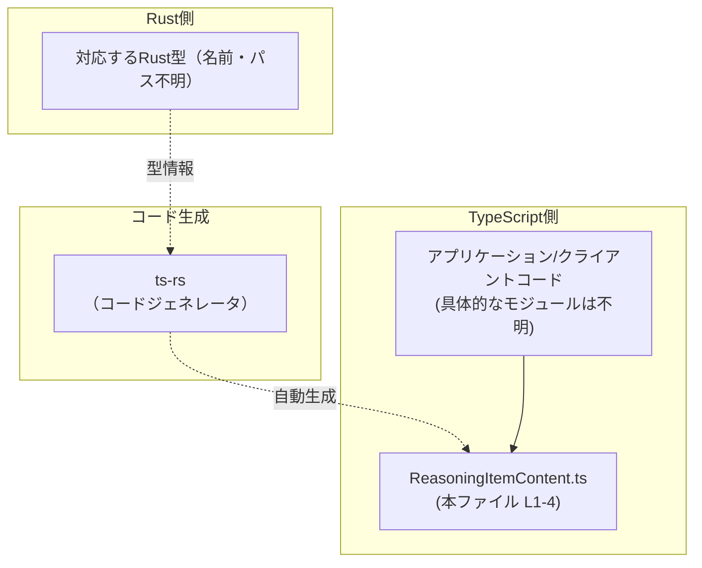
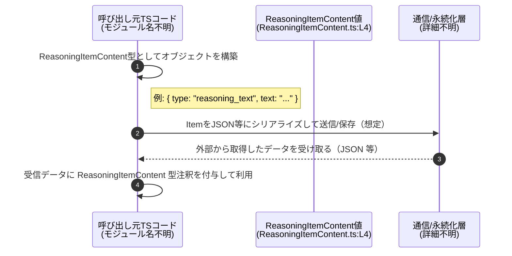

# app-server-protocol\schema\typescript\ReasoningItemContent.ts

## 0. ざっくり一言

`ReasoningItemContent` という **文字列ベースの内容を表す判別可能ユニオン型（discriminated union）** を 1 つだけ公開する、自動生成 TypeScript 型定義ファイルです。  
Rust 側の型から `ts-rs` によって生成されています（ReasoningItemContent.ts:L1-3）。

---

## 1. このモジュールの役割

### 1.1 概要

- このモジュールは、`ReasoningItemContent` という **「type」と「text」プロパティを持つオブジェクトのユニオン型** を定義します（ReasoningItemContent.ts:L4）。  
- `"type": "reasoning_text"` または `"type": "text"` の 2 種類を区別することで、アプリケーションコード側で分岐処理をしやすくする目的の型と解釈できます（命名とリテラル値からの推測であり、用途自体はこのファイル単体からは確定できません）。

```ts
// GENERATED CODE! DO NOT MODIFY BY HAND!                        // ReasoningItemContent.ts:L1

// This file was generated by [ts-rs](...) ...                   // ReasoningItemContent.ts:L3

export type ReasoningItemContent =                              // ReasoningItemContent.ts:L4
  { "type": "reasoning_text", text: string, } |
  { "type": "text", text: string, };
```

### 1.2 アーキテクチャ内での位置づけ

コメントから、**Rust 側の型定義 → ts-rs によるコード生成 → 本 TypeScript 型を利用するアプリケーションコード** という流れが存在することが分かります（ReasoningItemContent.ts:L1-3）。具体的な Rust ファイル名や TypeScript 利用箇所は、このチャンクからは分かりません。

以下は、その関係を抽象的に表した依存関係図です（ファイル名やコンポーネント名は「不明」と明記しています）。



※ `APP` ノードは「この型を利用するであろうコード」を抽象的に表しています。どのファイルかはこのチャンクからは分かりません。

### 1.3 設計上のポイント

- **自動生成コードであり、手動変更禁止**  
  冒頭コメントで「GENERATED CODE! DO NOT MODIFY BY HAND!」と明記されています（ReasoningItemContent.ts:L1-3）。  
  型を変更したい場合は、生成元である Rust 側と ts-rs の設定を変更する必要があります。

- **単一の公開 API: 判別可能ユニオン型**  
  `export type ReasoningItemContent = ...` の 1 行のみが公開 API です（ReasoningItemContent.ts:L4）。  
  2 つのオブジェクト型をユニオンし、`"type"` プロパティで分岐できる構造になっています。

- **状態やロジックを持たない純粋な型定義**  
  関数・クラス・変数定義は一切なく、実行時の状態や処理はこのファイルには含まれません（ReasoningItemContent.ts:L1-4）。

- **エラーハンドリング・並行性の懸念は型レベルのみ**  
  実行時処理が存在しないため、このファイル単体でのエラー処理や並行性の問題はありません。  
  ただし、**実行時データがこの型に「本当に一致しているか」はコンパイル時型チェックの範囲外**であり、利用側で注意が必要になります（一般的な TypeScript 型定義全般に共通する注意点です）。

---

## 2. 主要な機能（＝提供される型）一覧

このファイルが提供する「機能」は、実行ロジックではなく **型情報** です。

- `ReasoningItemContent`:  
  `"type"` プロパティで `"reasoning_text"` と `"text"` を区別する、テキストコンテンツ用の判別可能ユニオン型（ReasoningItemContent.ts:L4）。

---

## 3. 公開 API と詳細解説

### 3.1 型一覧（構造体・列挙体など）

| 名前 | 種別 | 役割 / 用途 | 定義位置 |
|------|------|------------|----------|
| `ReasoningItemContent` | 型エイリアス（判別可能ユニオン型） | `"type"` と `"text"` を持つ 2 種類のオブジェクト型のユニオン。呼び出し側は `"type"` の文字列リテラルで分岐処理が可能になる。 | ReasoningItemContent.ts:L4 |

`ReasoningItemContent` の 2 つの構成要素（インラインオブジェクト型）は以下の通りです。これはコード上は匿名型ですが、説明のために分けて記述します（両方とも ReasoningItemContent.ts:L4 に含まれます）。

1. **`"type": "reasoning_text"` バリアント**

   ```ts
   { "type": "reasoning_text", text: string, }
   ```

   - `"type"` プロパティが文字列リテラル `"reasoning_text"` に固定されたオブジェクト型です。
   - `text` プロパティは `string` で必須です。
   - 判別可能ユニオンの一部として、`item.type === "reasoning_text"` のようなチェックで型が絞り込まれます。

2. **`"type": "text"` バリアント**

   ```ts
   { "type": "text", text: string, }
   ```

   - `"type"` プロパティが `"text"` に固定されたオブジェクト型です。
   - `text` は同様に `string` です。
   - `item.type === "text"` と比較することで、このバリアントに絞り込まれます。

#### 契約（Contracts）とエッジケース

**契約（この型が前提とする条件）**

- どちらのバリアントでも必ず `text: string` が存在する（optional ではない）（ReasoningItemContent.ts:L4）。
- `"type"` プロパティは `"reasoning_text"` または `"text"` の厳密な文字列リテラルである（ReasoningItemContent.ts:L4）。
- 上記 2 つ以外の `"type"` 値は、この型の範囲外です。

**エッジケース・注意事項**

- 実行時のオブジェクトがこの型に合致しない場合  
  TypeScript の型チェックはコンパイル時のみなので、外部から受け取ったデータ（JSON 等）が `"type": "reasoning_text"` ではなく `"reasoningText"` などであっても、**そのまま信じて使うと実行時エラーの原因になる可能性**があります。  
  必要に応じてランタイムバリデーション（型ガード関数など）を用意する必要があります（このファイルには含まれていません）。

- どちらのバリアントも `text: string` であるため、`switch` 分岐後も利用可能な共通プロパティとして `text` を安全に使える点が特徴です。  
  一方で、バリアント固有のプロパティは定義されていないため、`reasoning_text` / `text` の違いは `"type"` の値のみです（ReasoningItemContent.ts:L4）。

#### Bugs / Security 観点（この型定義に関連する一般的なリスク）

- **型定義と実際のプロトコルのズレ**  
  Rust 側の型定義とこの TypeScript 型が食い違うと、送受信される JSON などのデータ形式と TypeScript の想定が異なり、実行時エラーや情報欠落を招く可能性があります。  
  コメントから、常に Rust 側から自動生成される仕組みで同期を取っていると考えられますが（ReasoningItemContent.ts:L1-3）、実際のビルドフローはこのチャンクからは分かりません。

- **検証なしで信頼すると不正データを扱う可能性**  
  クライアントが外部入力を `ReasoningItemContent` として扱う場合、悪意のある入力から `"type"` に不正な値を含むオブジェクトを受け取る可能性があります。  
  TypeScript の型注釈だけでは防げないため、必要に応じて追加のバリデーションが必要です（このファイルには実装がありません）。

- **並行性 / パフォーマンス**  
  このファイルは静的な型定義のみであり、実行時のロジックを持たないため、単体では並行性・パフォーマンス問題を引き起こしません。

### 3.2 関数詳細

このファイルには **関数・メソッド・クラスは一切定義されていません**（ReasoningItemContent.ts:L1-4）。  
したがって、「関数詳細」テンプレートを適用すべき対象は存在しません。

### 3.3 その他の関数

同様に、補助関数やラッパー関数も定義されていません（ReasoningItemContent.ts:L1-4）。

---

## 4. データフロー

このファイルには実行時処理が含まれないため、**データフローは「この型がどのような値の形を表すか」という意味でのみ存在**します（ReasoningItemContent.ts:L4）。

以下は、この型が一般的にどのように利用されるかのイメージを表した sequence diagram です。  
利用するコードや送受信層はこのチャンクには登場しないため、あくまで抽象的・参考的な図です。



この図が示すポイント（すべて一般的な TypeScript 型利用の話であり、特定の実装はこのチャンクには現れません）:

- `ReasoningItemContent` 型は、呼び出し元コードが **「このオブジェクトは "reasoning_text" か "text" のどちらかである」** と仮定するための契約として機能します。
- 実際の送受信処理やストレージ処理は別モジュールで行われ、その詳細はこのファイルからは分かりません。

---

## 5. 使い方（How to Use）

### 5.1 基本的な使用方法

`ReasoningItemContent` 型の値を生成し、`type` に応じて処理を分ける基本的な例です。

```typescript
// ReasoningItemContent型をインポートする例。
// 実際のパスはこのチャンクからは分からないため、仮のパスとしています。
import type { ReasoningItemContent } from "./ReasoningItemContent"; // 型インポート

// "reasoning_text" バリアントの値を作成する例
const reasoning: ReasoningItemContent = {                       // ReasoningItemContentとして宣言
    type: "reasoning_text",                                     // 判別用の文字列リテラル。"reasoning_text"に固定
    text: "内部的な推論や説明などを格納するテキスト",            // 任意の文字列
};

// "text" バリアントの値を作成する例
const plain: ReasoningItemContent = {                           // 同じ型だが別バリアント
    type: "text",                                               // 今度は"text"
    text: "ユーザー向けのシンプルなテキスト",                    // 任意の文字列
};

// 判別可能ユニオンとしての典型的な処理
function handleContent(content: ReasoningItemContent): void {   // 引数に型を付ける
    if (content.type === "reasoning_text") {                    // typeでバリアントを判定
        // このブロック内では content は
        // { type: "reasoning_text"; text: string } として扱われる
        console.log("Reasoning:", content.text);                // textを使用
    } else {                                                    // 残りは { type: "text"; text: string }
        console.log("Text:", content.text);                     // 同じくtextを使用
    }
}
```

この例から分かる TypeScript 特有のポイント:

- `ReasoningItemContent` は **判別可能ユニオン** なので、`content.type === "reasoning_text"` のように判定すると、TypeScript が自動的に型を絞り込んでくれます。
- どちらのバリアントにも `text: string` が共通して存在するため、分岐後も `content.text` を安全に利用できます。

### 5.2 よくある使用パターン

1. **配列として複数のコンテンツを扱う**

```typescript
import type { ReasoningItemContent } from "./ReasoningItemContent";

// 複数の ReasoningItemContent を配列として保持する
const contents: ReasoningItemContent[] = [                      // 配列型
    { type: "reasoning_text", text: "説明用のテキスト" },
    { type: "text",           text: "表示用のテキスト" },
];

// すべての要素を処理する
for (const item of contents) {                                  // 1つずつ取り出す
    if (item.type === "reasoning_text") {                       // 判別
        // 推論テキスト用の処理（イメージ）
        console.log("[R]", item.text);
    } else {                                                    // 残りは"text"
        console.log("[T]", item.text);
    }
}
```

1. **バリアントごとに別の関数に委譲する**

```typescript
import type { ReasoningItemContent } from "./ReasoningItemContent";

function handleReasoningText(text: string): void {              // reasoning_text用処理
    console.log("Reasoning text:", text);
}

function handlePlainText(text: string): void {                  // text用処理
    console.log("Plain text:", text);
}

function dispatch(content: ReasoningItemContent): void {        // Dispatcher
    switch (content.type) {                                     // typeで分岐
        case "reasoning_text":
            handleReasoningText(content.text);                  // reasoning用処理に委譲
            break;
        case "text":
            handlePlainText(content.text);                      // 通常テキスト処理に委譲
            break;
    }
}
```

### 5.3 よくある間違い（想定される誤用例）

この型に特有の誤用パターンとして、以下のようなものが考えられます。

```typescript
import type { ReasoningItemContent } from "./ReasoningItemContent";

// ❌ 間違い例: type の文字列を誤っている
const wrongType: ReasoningItemContent = {
    // @ts-expect-error: "reasoningText" は "reasoning_text" ではないためエラー
    type: "reasoningText",                                      // スペルミス
    text: "..." ,
};

// ❌ 間違い例: text を省略してしまう
const missingText: ReasoningItemContent = {
    // @ts-expect-error: text プロパティが必須のためエラー
    type: "text",
    // text: "..." がない
};

// ✅ 正しい例
const ok: ReasoningItemContent = {
    type: "text",                                               // 正しいリテラル
    text: "正しいオブジェクト",                                  // string を必ず指定
};
```

また、`as any` や `as ReasoningItemContent` で無理に型を付けると、コンパイル時チェックをすり抜けてしまうため、実行時エラーやバグの原因になります。  
このファイルにはそのようなキャストは含まれていませんが、利用側の実装で注意が必要です。

### 5.4 使用上の注意点（まとめ）

- **`type` の文字列は完全一致が必要**  
  `"reasoning_text"` と `"text"` 以外の文字列はエラーになります（ReasoningItemContent.ts:L4）。  
  スペルミスや大文字・小文字の違いに注意が必要です。

- **`text` は必須・string 型**  
  空文字列を許すかどうかはビジネスロジック次第ですが、`text` 自体を欠かすことはできません（ReasoningItemContent.ts:L4）。

- **自動生成コードを直接変更しない**  
  コメントにある通り、ファイルは自動生成されるため、直接編集すると次回のコード生成で上書きされます（ReasoningItemContent.ts:L1-3）。  
  仕様変更は Rust 側の型定義と ts-rs 設定から行う必要があります。

- **並行性・パフォーマンス上の注意**  
  この型定義自体はコンパイル時情報のみであり、実行時に直接負荷や競合を生じることはありません。

---

## 6. 変更の仕方（How to Modify）

### 6.1 新しい機能（バリアント）を追加する場合

このファイルはコメントにより「手動変更禁止」とされているため（ReasoningItemContent.ts:L1-3）、**直接編集するのではなく、生成元の Rust 側型定義を変更してから ts-rs による再生成を行う**のが前提になります。

一般的な手順（このチャンクに生成元コードはないため、抽象的な説明です）:

1. **Rust 側の対応する型に新たなバリアントを追加する**  
   例: Rust の enum / struct などに `"markdown"` や `"html"` といった新しい種類を表すバリアントを追加する。

2. **ts-rs の derive / 属性設定を更新する**  
   必要であれば、ts-rs の属性（`#[ts(...) ]`）等を調整して、期待する TypeScript 形にマッピングされるようにする。

3. **ts-rs によるコード生成を再実行する**  
   ビルドスクリプトや手動コマンド（`cargo` + `ts-rs` の統合など）を使い、`ReasoningItemContent.ts` を再生成する。

4. **TypeScript 側の利用箇所を更新する**  
   新バリアントに対する `switch` や `if` 分岐、ハンドリング処理を追加する。  
   生成された TypeScript コードに基づいて、`content.type === "新しいリテラル"` のような分岐を増やします。

### 6.2 既存の機能を変更する場合

既存バリアントのプロパティ名や `"type"` の値を変更する場合も、同様に **Rust 側の定義を先に変更し、ts-rs で再生成**する必要があります。

変更時に確認すべき点:

- **影響範囲の確認**
  - `"type"` の文字列リテラルを変更すると、TypeScript 側の `switch` / `if` 判定がすべて影響を受けます。
  - `text` の型や必須/任意を変更すると、TypeScript 側のオブジェクト生成箇所にも変更が必要になります。

- **契約の維持**
  - プロトコルとして外部システムとやり取りしている場合、変更が後方互換性を壊さないか（古いクライアントが動作するか）を確認する必要があります。  
    これはこのファイルからは確定できませんが、`app-server-protocol` というディレクトリ名からプロトコル用途が推測されます。

- **テストの更新**
  - このファイルにはテストコードは含まれていません（ReasoningItemContent.ts:L1-4）。  
  - 実際のアプリケーションでは、対応するユニットテスト／統合テストを更新し、変更されたバリアントやプロパティの扱いが正しいか検証する必要があります。

---

## 7. 関連ファイル

このチャンクに現れる情報から確実に言えるのは「ts-rs によって Rust 側から生成されている」という点のみです（ReasoningItemContent.ts:L1-3）。  
具体的なパスやファイル名は不明なため、その旨を明記します。

| パス | 役割 / 関係 |
|------|------------|
| 不明（Rust側型定義ファイル） | `ts-rs` によって本ファイルが生成される元となる Rust の型定義。コメントから存在は分かるが、ファイル名やモジュール構成はこのチャンクには現れません。 |
| 不明（ts-rs 設定 / ビルドスクリプト） | Rust 側で `ts-rs` を実行し、`ReasoningItemContent.ts` を出力するための設定やスクリプト。詳細はこのチャンクには含まれません。 |
| `app-server-protocol\schema\typescript\*.ts`（具体名不明） | 同ディレクトリ内の他のスキーマ型定義ファイルが存在する可能性がありますが、実際のファイル名や内容はこのチャンクからは特定できません。 |

---

### コンポーネントインベントリー（まとめ）

最後に、このファイル内のコンポーネントを表形式で整理します（要求されていた「インベントリー」と根拠行の明示です）。

| 種別 | 名前 / 説明 | 公開/非公開 | 定義位置 | 備考 |
|------|-------------|------------|----------|------|
| コメント | "GENERATED CODE! DO NOT MODIFY BY HAND!" 他 | - | ReasoningItemContent.ts:L1-3 | 自動生成コードであり手動変更禁止であること、`ts-rs` による生成であることを明示 |
| 型エイリアス | `ReasoningItemContent` | 公開 (`export`) | ReasoningItemContent.ts:L4 | `"type"` と `text` を持つ 2 つのオブジェクト型の判別可能ユニオン |
| 匿名オブジェクト型 | `{ "type": "reasoning_text", text: string }` | `ReasoningItemContent` に含まれる | ReasoningItemContent.ts:L4 | `"type"` が `"reasoning_text"` のバリアント |
| 匿名オブジェクト型 | `{ "type": "text", text: string }` | `ReasoningItemContent` に含まれる | ReasoningItemContent.ts:L4 | `"type"` が `"text"` のバリアント |

このファイルには、その他の関数・クラス・変数定義は存在しません（ReasoningItemContent.ts:L1-4）。
