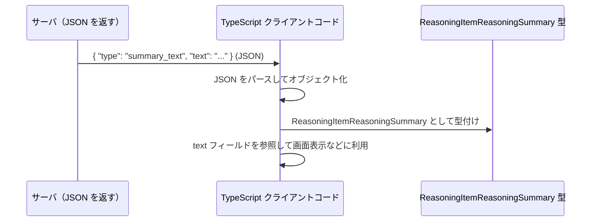

# app-server-protocol/schema/typescript/ReasoningItemReasoningSummary.ts コード解説

## 0. ざっくり一言

- Rust 向けライブラリ ts-rs により自動生成された、**推論結果の要約テキスト**を表現する TypeScript 型エイリアスです（ReasoningItemReasoningSummary.ts:L1-5）。
- フィールド `type` が `"summary_text"` に固定された、判別用フィールド付きオブジェクト型になっています（ReasoningItemReasoningSummary.ts:L5-5）。

---

## 1. このモジュールの役割

### 1.1 概要

- このモジュールは、アプリケーションサーバプロトコルの一部として使われると考えられる **要約テキスト要素** を TypeScript の型として表現します（型名とディレクトリ名からの推測であり、用途自体はコードからは断定できません）。
- 実体は `ReasoningItemReasoningSummary` という型エイリアスで、`type` フィールドと `text` フィールドを持つオブジェクト型を定義しています（ReasoningItemReasoningSummary.ts:L5-5）。

```typescript
export type ReasoningItemReasoningSummary = { "type": "summary_text", text: string, };
```

### 1.2 アーキテクチャ内での位置づけ

- 冒頭コメントから、このファイルは Rust 型定義から ts-rs によって自動生成されていることが分かります（ReasoningItemReasoningSummary.ts:L1-3）。
  - `// GENERATED CODE! DO NOT MODIFY BY HAND!`（ReasoningItemReasoningSummary.ts:L1-1）
  - `// This file was generated by [ts-rs] ...`（ReasoningItemReasoningSummary.ts:L3-3）
- ディレクトリ `app-server-protocol/schema/typescript` というパスから、この型は**アプリケーションサーバのプロトコルスキーマの TypeScript 表現群の一部**として配置されていることが読み取れます（ディレクトリ名からの位置づけであり、具体的な利用箇所はこのチャンクには現れません）。

代表的な関係イメージ（利用箇所は推測を含みます）:

```mermaid
flowchart LR
    %% ReasoningItemReasoningSummary (L1-5)
    R["Rust 型定義 (ts-rs 入力)\n（このチャンクには登場しない）」]
    G["ts-rs ジェネレータ\n(外部ツール)"]
    T["ReasoningItemReasoningSummary.ts\n(本ファイル, L1-5)"]
    C["TypeScript クライアントコード\n（このチャンクには登場しない）"]

    R --> G --> T --> C
```

### 1.3 設計上のポイント

- **自動生成コード**  
  - 手動編集禁止であることが明示されています（ReasoningItemReasoningSummary.ts:L1-3）。
- **判別用フィールドによる型表現**  
  - プロパティ `"type": "summary_text"` は **文字列リテラル型**で固定されており、このオブジェクトが「summary_text」種別であることを示すタグとして機能します（ReasoningItemReasoningSummary.ts:L5-5）。
- **純粋なデータコンテナ**  
  - 関数やメソッド定義はなく、状態や振る舞いを持たない単なるデータ型です（ReasoningItemReasoningSummary.ts:L5-5）。
- **エラーハンドリング・並行性**  
  - 実行時ロジックや非同期処理は一切含まれておらず、この型自体が直接エラー処理や並行性に関与することはありません（ReasoningItemReasoningSummary.ts:L1-5）。

---

## 2. 主要な機能一覧

このファイルが提供する機能は 1 つです。

- `ReasoningItemReasoningSummary` 型:  
  - `type` が `"summary_text"` に固定され、`text` に任意の文字列を保持するオブジェクトを表す型です（ReasoningItemReasoningSummary.ts:L5-5）。

---

## 3. 公開 API と詳細解説

### 3.1 型一覧（構造体・列挙体など）

| 名前                           | 種別      | 役割 / 用途                                                                                           | 定義箇所                                  |
|--------------------------------|-----------|--------------------------------------------------------------------------------------------------------|-------------------------------------------|
| `ReasoningItemReasoningSummary` | 型エイリアス | `type: "summary_text"` と `text: string` を持つオブジェクトを表現する。推論結果の要約テキスト要素に対応すると考えられる型。 | ReasoningItemReasoningSummary.ts:L5-5 |

#### `ReasoningItemReasoningSummary`

**概要**

- `type` プロパティが `"summary_text"` に固定されているオブジェクトを表現する型エイリアスです（ReasoningItemReasoningSummary.ts:L5-5）。
- `text` プロパティには任意の文字列を保持できます（ReasoningItemReasoningSummary.ts:L5-5）。

**構造**

```typescript
// ReasoningItemReasoningSummary.ts:L5-5
export type ReasoningItemReasoningSummary = {
    "type": "summary_text"; // 判別用のタグ（文字列リテラル型）
    text: string;           // 要約テキスト本体
};
```

**型の意味**

- `type: "summary_text"`  
  - このフィールドは `"summary_text"` という **文字列リテラル型**であり、この型に属する値は必ず `type` が `"summary_text"` になります（ReasoningItemReasoningSummary.ts:L5-5）。
  - これにより、将来的に他のバリアントと合わせて「判別共用体（discriminated union）」を構成する前提とみなすことができますが、他バリアントの定義はこのチャンクには現れません。
- `text: string`  
  - 要約テキストの本文を保持する文字列です（ReasoningItemReasoningSummary.ts:L5-5）。
  - `string` 型以外（`null` や `undefined` など）はこの型のプロパティとしては許可されません。

**Errors / Panics**

- この型はコンパイル時の型情報のみであり、実行時のエラー処理や例外は直接は関係しません。
- TypeScript のコンパイル時には、以下のような場合に型エラーが発生します（いずれも型定義から直接導かれるコンパイルエラーです）。
  - `type` に `"summary_text"` 以外の文字列を設定した場合。
  - `type` プロパティを省略した場合。
  - `text` に `string` 以外の型（`number` や `null` など）を割り当てた場合。

**Edge cases（エッジケース）**

- `text` が空文字列 `""` の場合  
  - 型としては許可されます（`string` の一種であるため）。長さの制約などはこのファイルからは読み取れません。
- `text` に非常に長い文字列を入れる場合  
  - 型としては制限がなく、このファイルからは長さ上限やエンコーディング等の制約は読み取れません。
- 追加プロパティを含むオブジェクト  
  - リテラルオブジェクトをそのまま `ReasoningItemReasoningSummary` として代入する場合、コンテキストによっては `type` / `text` 以外のプロパティが「余分なプロパティ」としてコンパイルエラーになる可能性があります（TypeScript の excess property check の挙動によるもの。型定義自体は追加プロパティを禁止する記述を持っていません）。

**使用上の注意点**

- このファイルは自動生成コードであり、「手動編集禁止」であることが明記されています（ReasoningItemReasoningSummary.ts:L1-3）。  
  変更が必要な場合は、元となる Rust 型定義（ts-rs の入力側）を変更する必要があります（元定義の位置はこのチャンクには現れません）。
- `type` プロパティはロジック上の判別タグとして扱われることが想定されるため、他の値（例: `"summary"` や `"text"`) を使うと静的型チェックでエラーになります（ReasoningItemReasoningSummary.ts:L5-5）。
- 実行時には JavaScript のオブジェクトであり、型情報は消えるため、外部から受け取ったデータに対しては別途バリデーションが必要になる場合があります。このファイルには実行時バリデーションのロジックは含まれていません（ReasoningItemReasoningSummary.ts:L1-5）。

### 3.2 関数詳細（最大 7 件）

- このファイルには関数定義は存在しません（ReasoningItemReasoningSummary.ts:L1-5）。

### 3.3 その他の関数

- 補助関数やラッパー関数も存在しません（ReasoningItemReasoningSummary.ts:L1-5）。

---

## 4. データフロー

このファイル自体は型定義のみであり、処理フローやシリアライズ/デシリアライズ処理は含まれていません（ReasoningItemReasoningSummary.ts:L1-5）。  
一般的な利用シナリオとして「JSON として受け取ったデータを `ReasoningItemReasoningSummary` として扱う場面」を例示します（あくまで想定される典型パターンであり、このチャンクから具体的な呼び出しコードは読み取れません）。



要点:

- サーバ等から `{ "type": "summary_text", "text": "..." }` のような JSON が送られてくると想定します。
- TypeScript 側ではこれをパースし、`ReasoningItemReasoningSummary` として扱うことで、`type` が `"summary_text"` であることと `text` が文字列であることをコンパイル時に保証できます（ReasoningItemReasoningSummary.ts:L5-5）。

---

## 5. 使い方（How to Use）

### 5.1 基本的な使用方法

`ReasoningItemReasoningSummary` 型の値を生成し、`text` を利用する最も単純な例です。

```typescript
// 型定義のインポート（実際のパスはプロジェクト構成に応じて調整する）
import type { ReasoningItemReasoningSummary } from "./ReasoningItemReasoningSummary"; // ファイル名は本ファイル名に基づく

// 要約テキスト要素を作成する
const summary: ReasoningItemReasoningSummary = {
    type: "summary_text",              // リテラル型。必ず "summary_text" である必要がある
    text: "モデルの推論を要約したテキストです", // 任意の文字列
};

// text フィールドを利用する
console.log(summary.text); // => "モデルの推論を要約したテキストです"
```

このコードでは、`type` に `"summary_text"` 以外を指定すると TypeScript のコンパイル時にエラーになります（ReasoningItemReasoningSummary.ts:L5-5）。

### 5.2 よくある使用パターン

#### 1. 関数の引数として受け取る

```typescript
import type { ReasoningItemReasoningSummary } from "./ReasoningItemReasoningSummary";

// 要約テキストを表示する関数
function renderSummary(item: ReasoningItemReasoningSummary): void {
    // item.type は常に "summary_text" と扱える
    console.log(`[summary] ${item.text}`);
}

// 使用例
renderSummary({
    type: "summary_text",
    text: "推論プロセスを簡潔にまとめています。",
});
```

- 関数内では `item.type` を `"summary_text"` として扱えるため、他の種別との分岐が不要です（ReasoningItemReasoningSummary.ts:L5-5）。

#### 2. 配列として複数の要約を扱う

```typescript
import type { ReasoningItemReasoningSummary } from "./ReasoningItemReasoningSummary";

const summaries: ReasoningItemReasoningSummary[] = [
    { type: "summary_text", text: "最初の要約" },
    { type: "summary_text", text: "2つ目の要約" },
];

for (const s of summaries) {
    // s.type は "summary_text"
    console.log(s.text);
}
```

- 配列を利用する場合も全ての要素で `type` が `"summary_text"` であることが保証されます（ReasoningItemReasoningSummary.ts:L5-5）。

### 5.3 よくある間違い

コンパイル時に起こりうる典型的な誤り例と正しい例です。

```typescript
import type { ReasoningItemReasoningSummary } from "./ReasoningItemReasoningSummary";

// 間違い例: type の値が定義と異なる
const bad1: ReasoningItemReasoningSummary = {
    // エラー: Type '"summary"' is not assignable to type '"summary_text"'.
    // type: "summary",
    type: "summary_text",
    text: "正しい値です",
};

// 間違い例: type フィールドの欠落
const bad2: ReasoningItemReasoningSummary = {
    // エラー: プロパティ 'type' が欠落している
    // text: "type を指定していない",
    type: "summary_text",
    text: "修正後",
};

// 間違い例: text が string ではない
const bad3: ReasoningItemReasoningSummary = {
    type: "summary_text",
    // エラー: Type 'number' is not assignable to type 'string'.
    // text: 123,
    text: "123",
};
```

いずれも、`ReasoningItemReasoningSummary` の型定義（ReasoningItemReasoningSummary.ts:L5-5）に反するためコンパイルエラーとなります。

### 5.4 使用上の注意点（まとめ）

- **手動編集禁止**  
  - コメントにより明示されている通り、このファイルは自動生成されており、手動で編集すべきではありません（ReasoningItemReasoningSummary.ts:L1-3）。
- **type フィールドの固定値**  
  - `type` は `"summary_text"` 以外を許容しないため、プログラム内で文字列を組み立てて代入する際には誤字に注意が必要です（ReasoningItemReasoningSummary.ts:L5-5）。
- **実行時バリデーションの欠如**  
  - この型自体はコンパイル時のチェックのみを提供し、実行時に外部入力を検証するロジックは含まれていません。  
    ネットワーク経由の入力などを直接 `ReasoningItemReasoningSummary` として扱う場合は、別途スキーマバリデーション等が必要になります。
- **並行性・スレッド安全性**  
  - JavaScript/TypeScript のオブジェクトであり、共有される場合でもこの型自体が特別な並行性の制約を追加することはありません。  
    変更可能なオブジェクトであるため、複数箇所から同じインスタンスを参照して書き換える場合の整合性は利用側の責任になります。

---

## 6. 変更の仕方（How to Modify）

### 6.1 新しい機能を追加する場合

- 冒頭コメントにある通り、このファイルは ts-rs による自動生成コードであり、**直接編集して新機能を追加するべきではありません**（ReasoningItemReasoningSummary.ts:L1-3）。
- 新しいフィールドの追加やバリアントの追加が必要な場合の一般的な流れは次の通りです（元の Rust コードの位置はこのチャンクには現れません）。

1. ts-rs の入力となる **Rust 側の型定義**（おそらく `ReasoningItemReasoningSummary` に対応する struct/enum）を変更する。
2. ts-rs によるコード生成プロセスを再実行し、TypeScript スキーマ群を再生成する。
3. 生成された新しい TypeScript 型に合わせて、クライアントコードを更新する。

### 6.2 既存の機能を変更する場合

特に注意すべき点:

- **フィールド名や型の変更**  
  - `type` / `text` の名前や型を変更する場合は、プロトコル仕様自体が変わるため、Rust 側・TypeScript 側双方のコードや外部インタフェースへの影響を確認する必要があります。  
  - このファイルを直接編集すると再生成時に上書きされるため、必ず元となる Rust 型を変更します（ReasoningItemReasoningSummary.ts:L1-3）。
- **後方互換性**  
  - 既存クライアントが `type: "summary_text"` を前提に動作している可能性があるため、`type` の値を変更・削除すると後方互換性が失われます。  
    この点に関する具体的な契約はこのチャンクからは読み取れませんが、プロトコル型であることを踏まえると注意が必要です。

---

## 7. 関連ファイル

このチャンクには他ファイルへの参照や import が存在しないため、厳密な関連ファイルは特定できません（ReasoningItemReasoningSummary.ts:L1-5）。  
本モジュール自体と、その一般的な位置づけのみを表として示します。

| パス                                                         | 役割 / 関係 |
|--------------------------------------------------------------|------------|
| `app-server-protocol/schema/typescript/ReasoningItemReasoningSummary.ts` | 本ドキュメントの対象ファイル。`ReasoningItemReasoningSummary` 型を定義する自動生成された TypeScript スキーマ。 |

- 同一ディレクトリ配下に、他のプロトコル型や `ReasoningItem` 関連の型が存在する可能性はありますが、このチャンクからは具体的なファイル名や依存関係は読み取れません。
