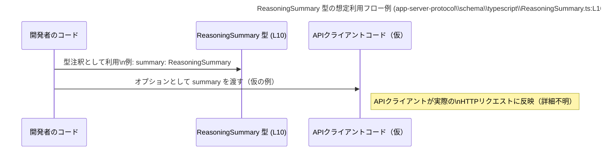

# app-server-protocol\schema\typescript\ReasoningSummary.ts コード解説

## 0. ざっくり一言

- モデルの「推論サマリ（reasoning summary）」の出力スタイルを表す **文字列リテラル型のユニオン** を定義する TypeScript スキーマファイルです（実行ロジックはありません）。  
  根拠: 自動生成コメントと `export type ReasoningSummary = "auto" | "concise" | "detailed" | "none";` のみが存在するためです【app-server-protocol\schema\typescript\ReasoningSummary.ts:L1-10】。

---

## 1. このモジュールの役割

### 1.1 概要

- このモジュールは、モデルが行った推論の要約（reasoning summary）のスタイルを指定・表現するための型 `ReasoningSummary` を提供します【L5-10】。
- 型は `"auto" | "concise" | "detailed" | "none"` の 4 種類の文字列リテラルのユニオンであり、それ以外の文字列を静的型チェックで排除する役割を持ちます【L10】。
- ファイルは `ts-rs` により自動生成されており、手動編集しないことが明記されています【L1-3】。

### 1.2 アーキテクチャ内での位置づけ

コードから読み取れる事実は次のとおりです。

- 本ファイルは `schema/typescript` ディレクトリ配下にあり、TypeScript クライアント側で利用されるスキーマ定義の 1 つと解釈できます【L1-3】。
- コメントにより `ts-rs` から生成されたと書かれているため、Rust 側の型定義から派生した TypeScript 型であることが分かります【L1-3】。

他の具体的なモジュール（どこから import されているかなど）は、このチャンクには現れません。

代表的な関係を、**本チャンクから分かる範囲 + 最小限の推測を明示**した図として示します。

```mermaid
graph TD
    subgraph "Rust 側スキーマ（推測）"
        R["Rust 型 (不明)\n(ts-rsの入力)"]
    end

    subgraph "TypeScript スキーマ定義\napp-server-protocol\\schema\\typescript\\ReasoningSummary.ts (L1-10)"
        RS["ReasoningSummary 型\n\"auto\" | \"concise\" | \"detailed\" | \"none\" (L10)"]
    end

    R -- "ts-rs により生成 (コメントから判明)" --> RS
```

- Rust 側の具体的な型名やファイル名は、このチャンクには現れないため不明です。

### 1.3 設計上のポイント

コードとコメントから読み取れる設計上の特徴は次のとおりです。

- **自動生成ファイル**  
  - `// GENERATED CODE! DO NOT MODIFY BY HAND!` と明記されており、ソース・オブ・トゥルースは別（Rust 側）にある構成です【L1-3】。
- **限定された文字列のユニオン型**  
  - `"auto" | "concise" | "detailed" | "none"` の 4 値に限定された文字列リテラル型です【L10】。
  - これにより、TypeScript の静的型チェックで値の取りうる範囲を厳密に制約できます。
- **ドキュメントとの結びつき**  
  - JSDoc コメントで OpenAI Platform の reasoning summaries ドキュメント URL が付与されています【L5-8】。
  - 型の意味が外部仕様（API ドキュメント）と一対一に対応していることが分かります。
- **状態やロジックを持たない**  
  - 関数やクラスは一切定義されておらず、実行時の状態や副作用はありません【L1-10】。
  - 並行性やエラーハンドリングはこのファイル単体では問題になりません。

---

## 2. 主要な機能一覧

このモジュールが提供する機能は 1 つです。

- `ReasoningSummary` 型: モデルの推論サマリのスタイルを `"auto" | "concise" | "detailed" | "none"` のいずれかに制約する TypeScript 型【L10】。

---

## 3. 公開 API と詳細解説

### 3.1 型一覧（構造体・列挙体など）

このチャンクに現れる公開型は 1 つだけです。

| 名前               | 種別           | 役割 / 用途                                                                                   | 定義位置 |
|--------------------|----------------|-----------------------------------------------------------------------------------------------|----------|
| `ReasoningSummary` | 型エイリアス（文字列リテラルユニオン） | モデルの推論サマリ出力のスタイルを `"auto" / "concise" / "detailed" / "none"` の 4 値に制約する型 | `app-server-protocol\schema\typescript\ReasoningSummary.ts:L10-10` |

#### 型の意味（コメントに基づく説明）

コメントから読み取れる、この型の意味を整理します【L5-8】。

- 「A summary of the reasoning performed by the model」  
  モデルが内部で行った推論の概要・要約のこと。
- 「useful for debugging and understanding the model's reasoning process」  
  デバッグや、モデルがどう考えたかを理解するのに役立つ情報。
- `ReasoningSummary` は、その要約の**出力スタイル／量**を選択するための値を表していると解釈できます（コメントと値名からの解釈であり、実際の挙動はリンク先ドキュメント依存です）。

#### 各リテラル値の意図（名前から読み取れる範囲）

コード上は説明コメントはありませんが、名前から推測できる範囲を、推測であることを明示したうえで整理します【L10】。

- `"auto"`（推測）  
  - API 側のデフォルト設定に従って自動的にサマリを生成するモードである可能性があります。
- `"concise"`（推測）  
  - 簡潔なサマリを出力するモードと思われます。
- `"detailed"`（推測）  
  - より詳細なサマリを出力するモードと思われます。
- `"none"`（推測）  
  - サマリを出力しない、あるいはサマリをリクエストしないモードと思われます。

> これらの挙動はコメントと命名からの推測であり、**実際の API の意味はリンク先ドキュメントの仕様に依存します**【L5-8】。

### 3.2 関数詳細（最大 7 件）

- このファイルには関数・メソッド・クラスは一切定義されていません【L1-10】。
- したがって、詳細解説すべき関数はありません。

### 3.3 その他の関数

- 補助関数やラッパー関数も定義されていません【L1-10】。

---

## 4. データフロー

このファイルは **型定義のみ** であり、実行時の処理フローやデータ変換ロジックは含まれていません【L1-10】。  
したがって、「このファイル単体から確定できる」データフローは存在しません。

一方で、実際にこの型が利用される場合を仮定した、**典型的な利用フローのイメージ図（推測を含む）** を示します。



- `API` や HTTP リクエスト部分は、このチャンクには登場しないため、**推測に基づくイメージ**です。
- 確定的に言えるのは、「開発者のコードが `ReasoningSummary` 型を使って変数や関数引数の値を 4 つの文字列に制約できる」という点のみです【L10】。

---

## 5. 使い方（How to Use）

### 5.1 基本的な使用方法

この型を利用する典型的なコードパターンとして、**関数引数や設定オブジェクトのプロパティに型を付ける**使い方が考えられます。ここでは、架空の API クライアントを例に、TypeScript の型安全性がどのように効くかを示します。

```typescript
// ReasoningSummary 型をインポートする（相対パスやパッケージ名はプロジェクト構成に依存）
import type { ReasoningSummary } from "./ReasoningSummary"; // 型定義のみをインポート

// 推論サマリの設定を含むオプションの型を定義する
interface RequestOptions {
    reasoningSummary: ReasoningSummary; // 推論サマリのスタイルを指定するプロパティ
}

// 架空のAPI呼び出し関数を定義する
function callModel(options: RequestOptions) {   // options.reasoningSummary は 4 値のいずれかに限定される
    // ここで options.reasoningSummary を使って
    // 実際の API リクエストに設定を反映させる想定
    console.log("reasoning summary:", options.reasoningSummary);
}

// 正しい呼び出し例
callModel({
    reasoningSummary: "concise", // OK: ReasoningSummary の一員
});

// 間違い例（コンパイルエラーになる例）
// callModel({
//     reasoningSummary: "verbose", // エラー: "verbose" は ReasoningSummary に含まれない
// });
```

この例から分かること:

- `ReasoningSummary` 型を利用すると、`"verbose"` のような誤った値がコンパイルエラーとして検知されます【L10】。
- 実行前に誤った文字列を排除できるため、API 仕様との不整合によるランタイムエラーを防ぎやすくなります（実際の API 仕様はリンク先ドキュメント依存です【L5-8】）。

### 5.2 よくある使用パターン

`ReasoningSummary` のユニオン型を活かせる代表的なパターンを 2 つ挙げます。

#### パターン 1: 設定値の選択 UI との連携

```typescript
import type { ReasoningSummary } from "./ReasoningSummary";

// 許可する選択肢を配列にする（as const によりリテラル型を維持）
const REASONING_SUMMARY_OPTIONS = ["auto", "concise", "detailed", "none"] as const;

// この配列から型を導出すると ReasoningSummary と互換の型になる
type ReasoningSummaryOption = (typeof REASONING_SUMMARY_OPTIONS)[number];

// UI から選ばれた値（文字列）を ReasoningSummary として扱う
function setReasoningSummary(summary: ReasoningSummaryOption) { // ReasoningSummary と同等
    // ここで summary をAPIの設定として利用する想定
}
```

- 配列と `as const`／インデックス型を組み合わせることで、「UI の選択肢」と「型上の制約」を同期させられます。
- `ReasoningSummary` そのものを使う／互換の型を使うどちらでも構いません。

#### パターン 2: `switch` による分岐（列挙に近い使い方）

```typescript
import type { ReasoningSummary } from "./ReasoningSummary";

// ReasoningSummary の値に応じて説明文を返す関数
function describeReasoningSummary(summary: ReasoningSummary): string {
    switch (summary) {
        case "auto":
            return "APIのデフォルト設定に従って推論サマリを出力します。";
        case "concise":
            return "簡潔な推論サマリを出力します。";
        case "detailed":
            return "詳細な推論サマリを出力します。";
        case "none":
            return "推論サマリをリクエストしません。";
        // default を書かないことで、将来値が追加されたときに
        // コンパイルエラーで漏れに気づける（TypeScript のユニオン型の利点）
    }
}
```

- `switch` 文で全てのケースを列挙することで、将来 `ReasoningSummary` に新しいリテラルが追加された際に、未対応ケースがコンパイルエラーで検出されます。
- これは TypeScript のユニオン型を列挙型のように使う典型的な方法です。

### 5.3 よくある間違い

この型に関して起こりうる典型的な誤用と、その修正例を示します。

```typescript
import type { ReasoningSummary } from "./ReasoningSummary";

// 間違い例: string 型をそのまま使ってしまう
function bad(summary: string) {               // NG: どんな文字列でも渡せてしまう
    // ... API に渡すなど
}

// 正しい例: ReasoningSummary 型を使って制約する
function good(summary: ReasoningSummary) {   // OK: 4 つの文字列のみに制約される
    // ... API に渡すなど
}
```

```typescript
import type { ReasoningSummary } from "./ReasoningSummary";

const summary: ReasoningSummary = "auto";

// 間違い例: 型アサーションで制約を回避してしまう
const unsafeSummary = "verbose" as ReasoningSummary; // コンパイルは通るが実行時には不正な値

// 正しい例: リテラルから直接代入し、ユニオン型によるチェックを活かす
const safeSummary: ReasoningSummary = "concise";      // OK
// const unsafeSummary2: ReasoningSummary = "verbose"; // コンパイルエラー
```

- 型アサーション（`as ReasoningSummary`）で本来の制約を無理にすり抜けないことが重要です。
- `string` 全体ではなく `ReasoningSummary` を使うことで、TypeScript の型安全性を活かせます。

### 5.4 使用上の注意点（まとめ）

- **前提条件**
  - `ReasoningSummary` 型の変数には、**必ず `"auto" | "concise" | "detailed" | "none"` のいずれかだけを代入する**ことが前提です【L10】。
- **禁止事項・注意点**
  - `as ReasoningSummary` などの不必要な型アサーションで、本来の制約を迂回しないこと。
  - このファイル自体は自動生成されるため、**手動で編集しないこと**【L1-3】。
- **エラー・パニック条件**
  - このファイル単体には実行時ロジックがないため、ランタイムエラーやパニックは発生しません。
  - 誤った文字列を `ReasoningSummary` として扱うようなコードを書いた場合、TypeScript のコンパイルエラーとして検知されるのが基本です。
- **並行性**
  - 共有状態や非同期処理が存在しないため、スレッドセーフティや並行性に関する懸念はありません。

---

## 6. 変更の仕方（How to Modify）

### 6.1 新しい機能を追加する場合

このファイルは `ts-rs` による自動生成であり、先頭コメントに「手で編集しないこと」が明記されています【L1-3】。  
したがって、**直接このファイルを編集して新しい値を追加するべきではありません**。

新しい文字列リテラル値（例: `"verbose"`）を追加したい場合の一般的な手順は次のようになります（Rust 側の構成はこのチャンクにはないため抽象的に記述します）。

1. **Rust 側の元となる型定義を探す（推測）**
   - `ts-rs` で TypeScript に出力される元の Rust 型（`enum` や `struct`）がどこかに存在するはずです【L1-3】。
   - そのファイルで、推論サマリに相当する型を探します（具体的なファイル名・型名はこのチャンクには現れないため不明です）。

2. **Rust 側の型に新しいバリアント／値を追加する（推測）**
   - 例えば Rust の `enum` に新しいバリアントを足すなど、Rust 側のソースを変更します。

3. **`ts-rs` によるコード生成を再実行する**
   - プロジェクト固有のビルド／コード生成手順に従い、`ts-rs` による TypeScript スキーマ生成をやり直します。
   - その結果として、この file の `ReasoningSummary` ユニオン型が更新されるはずです。

4. **TypeScript 側のコードで新しい値を利用する**
   - `ReasoningSummary` を使っている箇所で、新しい値に対応する処理・分岐（`switch` など）を追加します。

> Rust 側の具体的な変更手順やビルドコマンドは、このチャンクには現れないため不明です。

### 6.2 既存の機能を変更する場合

`"auto" | "concise" | "detailed" | "none"` のいずれかを削除・名称変更・意味変更したい場合も、基本的には **Rust 側の定義を変更して再生成**する流れになります【L1-3】。

変更時に意識すべきポイント:

- **影響範囲の確認**
  - TypeScript 全体で `ReasoningSummary` がどこで使われているかを検索し、`switch` 文や比較ロジックがすべて更新されているかを確認します。
- **契約（前提条件）の維持**
  - 型の値の意味（例: `"none"` が「サマリを出さない」という意味だったかどうか）は API の外部仕様と結びついています【L5-8】。
  - 外部向け仕様との整合性を崩さないよう、API ドキュメントと合わせて変更する必要があります。
- **テスト・利用箇所の再確認**
  - 型が変わると TypeScript コンパイル時に多くの箇所でエラーが出ることが期待されます（これがユニオン型の利点です）。
  - それに加えて、エンドツーエンドテスト・統合テストで実際の API 挙動も確認することが望まれます。

---

## 7. 関連ファイル

このチャンクから直接分かる関連ファイルは限られています。

| パス / 種別 | 役割 / 関係 |
|------------|------------|
| （Rust 側の ts-rs 入力ファイル）※不明 | コメントより、本ファイルは `ts-rs` によって生成されたことが分かるため、その入力となる Rust 型定義ファイルが存在すると考えられます【L1-3】。具体的なパスや型名はこのチャンクには現れません。 |
| `schema/typescript` ディレクトリ配下の他ファイル（推測） | ディレクトリ構成から、他にも TypeScript スキーマ定義が存在すると想定されますが、内容・関係はこのチャンクには現れません。 |

---

### 付記: 安全性・バグ・並行性の観点

- **バグの可能性**
  - このファイル単体にはロジックがないため、実行時バグの原因にはなりにくいです。
  - ただし、Rust 側の定義と OpenAI API の仕様が食い違っていれば、`ReasoningSummary` の値が API 側の受け付ける値とずれる可能性はあります（この点はこのチャンクからは確認できません）。
- **セキュリティ上の観点**
  - 型定義のみであり、入力値の検証・サニタイズ・暗号処理などは行っていません。
  - したがって、このファイル単体がセキュリティホールになる要素は見当たりません。
- **並行性**
  - 状態やスレッドを扱うコードが存在しないため、並行性に関する問題はありません【L1-10】。
