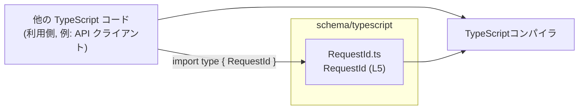
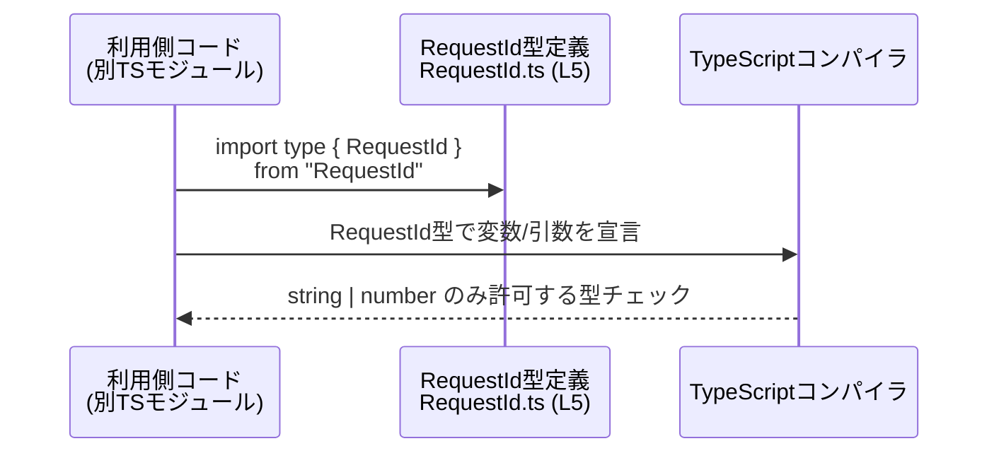

# app-server-protocol\schema\typescript\RequestId.ts コード解説

## 0. ざっくり一言

このファイルは、`RequestId` という「リクエストID」を表す型エイリアスを、`string | number` のユニオン型として公開する **スキーマ定義用 TypeScript モジュール**です（`RequestId.ts:L5-5`）。

---

## 1. このモジュールの役割

### 1.1 概要

- このモジュールは **リクエストIDを表す共通の型** を提供します。
- `RequestId` は `string` か `number` のどちらかであり、それ以外の型を排除する **型レベル制約** を与えます（`RequestId.ts:L5-5`）。
- ファイル先頭コメントから、この定義は [`ts-rs`](https://github.com/Aleph-Alpha/ts-rs) による **自動生成コード**であり、手動編集すべきではないことが分かります（`RequestId.ts:L1-3`）。

### 1.2 アーキテクチャ内での位置づけ

このチャンクには他モジュールからのインポートや利用箇所は現れませんが、`export type` で公開されているため、**他の TypeScript ファイルから参照される前提のスキーマ層**に位置づけられます。

代表的な依存関係イメージ（このチャンクから利用側は見えないため、一般的なパターンとしての図示です）:



※ 利用元モジュールの具体名やファイル構成は、このチャンクには現れないため不明です。

### 1.3 設計上のポイント

- **責務の分離**
  - 実行時ロジックを一切持たず、リクエストIDの **型定義だけ** を担うモジュールです（`RequestId.ts:L5-5`）。
- **型安全性**
  - `string | number` のユニオン型にすることで、「リクエストIDとして許される値の型」を制限します（`RequestId.ts:L5-5`）。
- **自動生成コード**
  - 冒頭コメントで「GENERATED CODE」「Do not edit this file manually」と明記されており（`RequestId.ts:L1-3`）、元定義は別の言語・ファイル（ts-rs の入力側）で管理されていることが分かります。
- **状態・エラーハンドリング**
  - 型エイリアスのみで、状態もエラーハンドリングも持ちません。エラーは **型チェック段階で検出されるだけ** です。

---

## 2. 主要な機能一覧

このモジュールが提供する機能は 1 つです。

- `RequestId` 型定義: リクエストIDを `string` または `number` として表現するための公開型エイリアス（`RequestId.ts:L5-5`）。

---

## 3. 公開 API と詳細解説

### 3.1 型一覧（構造体・列挙体など）

このファイルで公開されている型は 1 つです。

| 名前       | 種別        | 役割 / 用途                                                                 | 定義位置                                               |
|------------|-------------|------------------------------------------------------------------------------|--------------------------------------------------------|
| `RequestId` | 型エイリアス | リクエストIDを `string` または `number` で表現するための共通型。             | `app-server-protocol/schema/typescript/RequestId.ts:L5-5` |

#### `type RequestId = string | number`

**概要**

- `RequestId` は TypeScript の **ユニオン型**（複数の型のいずれかを許容する型）で、`string` または `number` の値だけを許可します（`RequestId.ts:L5-5`）。
- 実行時の構造を変えるわけではなく、**コンパイル時の型チェックにのみ影響**します。

**型の意味**

- `string`:
  - 文字列形式のリクエストID（例: `"req-123"`）を許可します。
- `number`:
  - 数値形式のリクエストID（例: `123`）を許可します。

**安全性・エラー挙動（TypeScript観点）**

- `RequestId` として宣言した変数や引数には、`string`・`number` 以外（`boolean`, `object`, `null`, `undefined` など）を代入すると **コンパイルエラー** になります。
- 実行時にはこの型情報は存在しないため、**型ガード（`typeof` など）での分岐**を行わずに `string` 前提のメソッド（`toUpperCase()` など）を呼び出すと、実行時エラーになる可能性があります。

**並行性との関係**

- 型エイリアスのみであり、実行時オブジェクトや共有状態を持たないため、並行性・スレッド安全性に関する固有の問題はありません。
- ただし、同じ ID を複数スレッドやプロセスで扱うアプリケーション側の設計は別途必要になりますが、このファイルからは読み取れません。

### 3.2 関数詳細（最大 7 件）

このファイルには **関数・メソッドは一切定義されていません**（`RequestId.ts:L1-5`）。  
したがって、関数の詳細解説テンプレートに適合する対象はありません。

### 3.3 その他の関数

- 該当なし（このチャンクには関数定義がありません）。

---

## 4. データフロー

このファイル自体は型の宣言だけを含み、実行時処理は持ちません。  
ここでは、**一般的な利用パターンとして**「他のモジュールが `RequestId` を型として利用する」場合のデータ（正確には型情報）の流れを示します。

※ このシナリオは TypeScript の一般的な使い方の例であり、このチャンクから実際の利用箇所が確認できるわけではありません。

1. 別モジュールが `RequestId` 型を `import type` などで読み込む。
2. そのモジュール内で、関数の引数やオブジェクトのプロパティに `RequestId` 型を適用する。
3. TypeScript コンパイラが `RequestId` を `string | number` として解釈し、型チェックを行う。
4. `string` / `number` 以外の値が渡された場合はコンパイルエラーとなる。

これをシーケンス図で表すと次のようになります。



---

## 5. 使い方（How to Use）

### 5.1 基本的な使用方法

`RequestId` を関数の引数型として利用し、**ユニオン型に対する型ガード**を行う例です。

```typescript
// RequestId 型をインポートする例                                   // RequestId 型定義を別モジュールから読み込む
import type { RequestId } from "./RequestId";                        // 型のみを参照するため import type を使用するのが推奨

// RequestId を引数に取る関数の例                                   // リクエストIDを受け取る関数を定義する
function handleRequest(id: RequestId) {                              // id の型を RequestId (string | number) に制約する
    if (typeof id === "string") {                                    // runtime で typeof により string かどうかを判定する
        console.log(id.toUpperCase());                               // string であることが分かっているので string メソッドを安全に呼べる
    } else {                                                         // 残りの可能性は number だけ (RequestId は string | number のため)
        console.log(id.toFixed(0));                                  // number に対するメソッド toFixed を安全に呼び出す
    }                                                                // if-else により全てのユニオン成分を網羅している
}                                                                    // handleRequest の本体ここまで

// 関数を呼び出す例                                                  // 上で定義した関数を実際に使用する
handleRequest("req-123");                                            // string 型の ID を渡す (コンパイル OK / 実行 OK)
handleRequest(456);                                                  // number 型の ID を渡す (コンパイル OK / 実行 OK)
// handleRequest(true);                                              // boolean は RequestId に代入できないのでコンパイルエラーになる
```

**ポイント**

- `RequestId` は `string | number` なので、**利用側で型ガードを行う**ことが実行時安全性の観点から重要です。
- TypeScript は `if (typeof id === "string")` ブロック内では `id` を `string` と推論し、`else` ブロックでは `number` と推論します（ユニオン型の絞り込み）。

### 5.2 よくある使用パターン

#### 1. オブジェクトのプロパティとして利用する

```typescript
// RequestId 型をプロパティに持つデータ構造の例                       // RequestId をプロパティ型として利用するインターフェースを定義
import type { RequestId } from "./RequestId";                        // RequestId 型をインポート

interface RequestInfo {                                              // リクエスト情報を表すインターフェースを定義
    id: RequestId;                                                   // id プロパティの型を RequestId (string | number) にする
    payload: unknown;                                                // その他のペイロードは unknown としておき、別途型ガードする
}                                                                    // RequestInfo の定義ここまで

const info: RequestInfo = {                                          // RequestInfo 型のオブジェクトを作成する
    id: "req-789",                                                   // id に string 型の RequestId をセット (OK)
    payload: { foo: "bar" },                                         // payload には任意の値を格納できる
};                                                                   // info オブジェクト定義ここまで
```

#### 2. Map / Record のキーや値として利用する

```typescript
// RequestId をキーにした Map を作る例                                // RequestId 型をキーにして状態を管理する
import type { RequestId } from "./RequestId";                        // RequestId 型をインポート

const requestStatus = new Map<RequestId, string>();                  // キー: RequestId, 値: string の Map を生成

requestStatus.set(1, "pending");                                     // number 型の RequestId をキーとして使用 (OK)
requestStatus.set("2", "done");                                      // string 型の RequestId もキーとして使用 (OK)
// requestStatus.set(true, "error");                                 // boolean は RequestId ではないためコンパイルエラーになる
```

**注意**: `Map` のキーは `1` と `"1"` を別のキーとして扱うため、同じ概念の ID を別の型で扱うと **バグの温床** になり得ます（例: `1` と `"1"` を別 ID とみなしてしまう）。  
この点はユニオン型自体ではなく、JS の比較・Map の仕様によるものです。

### 5.3 よくある間違い

#### 間違い例 1: `RequestId` を string 前提で扱ってしまう

```typescript
import type { RequestId } from "./RequestId";                        // RequestId 型をインポート

function logRequest(id: RequestId) {                                 // id: RequestId (string | number)
    // console.log(id.toUpperCase());                                // コンパイルエラー: number の可能性があるため toUpperCase は呼べない
}
```

#### 正しい例: 型ガードでユニオンを絞り込む

```typescript
import type { RequestId } from "./RequestId";                        // RequestId 型をインポート

function logRequest(id: RequestId) {                                 // id: RequestId
    if (typeof id === "string") {                                    // string かどうかをチェック
        console.log(id.toUpperCase());                               // string に絞り込まれているので OK
    } else {                                                         // それ以外 = number
        console.log(`#${id}`);                                       // number として文字列化して利用する
    }                                                                // if-else ブロックここまで
}
```

### 5.4 使用上の注意点（まとめ）

- **ユニオン型の性質**
  - `RequestId` は `string` と `number` を許可するため、**どちらかに決め打ちしてメソッドを呼ぶと危険**です。
  - 必要に応じて `typeof` などで型ガードを行い、ユニオン型を絞り込んでからメソッド呼び出しを行う必要があります。
- **識別子の一貫性**
  - 同じ概念の ID を `1` と `"1"` の両方で扱うとロジックが複雑になり、バグやセキュリティチェック漏れの原因になり得ます（例: アクセス制御のキー不一致）。
- **シリアライズ時の注意**
  - JSON などにシリアライズする場合、`1` と `"1"` は異なる表現を持つため、外部システムとのインタフェース仕様に合わせた統一が必要です。この仕様はこのチャンクからは読み取れないため、別のドキュメントやコードを確認する必要があります。
- **自動生成コードであること**
  - `RequestId.ts` は ts-rs によって生成されると明記されており（`RequestId.ts:L1-3`）、**直接編集すると再生成時に上書きされます**。

---

## 6. 変更の仕方（How to Modify）

### 6.1 新しい機能を追加する場合

- このファイルは「GENERATED CODE」「Do not edit this file manually」とコメントされているため（`RequestId.ts:L1-3`）、**直接新しい型やコードを追加することは推奨されません**。
- 新たな型やフィールドを追加したい場合は：
  - 元となる定義（ts-rs の入力側、通常は Rust の型定義であることが多いと考えられますが、このチャンクから具体的な場所は分かりません）に変更を加え、
  - ts-rs を再実行して TypeScript コードを再生成する、という手順になると考えられます。
- このファイルと無関係な新しい TypeScript 型を追加したい場合は、**別ファイルを作成**して管理するのが安全です。

### 6.2 既存の機能を変更する場合

`RequestId` の定義を変更することは、他の多くのコードに影響を与える可能性があります。

- 変更時に確認すべき点
  - `RequestId` を `string | number` から例えば `string` のみに変更すると、`number` を渡している全ての呼び出し元がコンパイルエラーになります。
  - 逆に、ユニオン型に新しい型（例: `bigint`）を追加すると、既存の `switch` や `if (typeof ...)` が **全ケースを網羅しなくなる**可能性があり、その箇所で型エラーや実行時エラーが起こり得ます。
- 手順のイメージ
  1. 元定義（ts-rs の入力）側で型の変更を行う。
  2. ts-rs で TypeScript コードを再生成する。
  3. プロジェクト全体をコンパイルし、`RequestId` に関連するコンパイルエラーを確認・修正する。
- 契約（前提条件）
  - `RequestId` が「リクエストを一意に識別する」という役割を持っている可能性がありますが、これは型名からの推測であり、このチャンクだけからは用途は断定できません。
  - そのため、用途や意味的な契約については、上位のドメインモデルやドキュメントを確認する必要があります。

---

## 7. 関連ファイル

このチャンクには、具体的なパスや他ファイル名は現れませんが、コメントから次の関連が推測されます。

| パス / コンポーネント | 役割 / 関係 |
|------------------------|------------|
| `ts-rs` の入力側（Rustなど）※パス不明 | `RequestId.ts` を生成する元となる型定義が存在すると考えられます。ただし、このチャンクから具体的なファイル位置は分かりません。 |
| その他の TypeScript モジュール（不特定） | `export type RequestId` により、他モジュールから `import type { RequestId }` して利用される前提の公開 API になっています。 |

※ 関連ファイルの具体的な一覧や依存グラフは、このチャンク単独からは把握できません。プロジェクト全体の依存関係は、ビルド設定や他ファイルを合わせて確認する必要があります。
