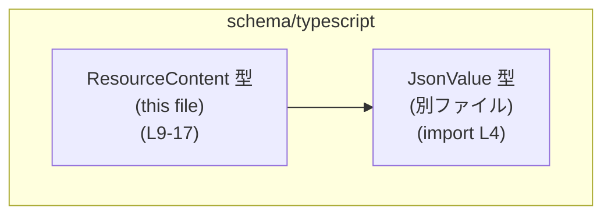
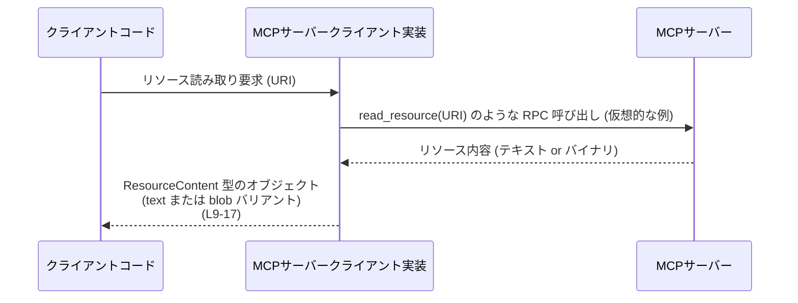

# app-server-protocol/schema/typescript/ResourceContent.ts

## 0. ざっくり一言

MCP サーバーからリソースを読み取ったときに返される「リソース内容」を、**テキスト形式**または**バイナリ（blob）形式**で表現する TypeScript のユニオン型定義です（`ResourceContent` 型、app-server-protocol/schema/typescript/ResourceContent.ts:L6-8, L9-17）。

---

## 1. このモジュールの役割

### 1.1 概要

- このモジュールは、**MCP サーバーからリソースを読み出した結果のデータ構造**を TypeScript 側に提供するために存在しています（コメントより、app-server-protocol/schema/typescript/ResourceContent.ts:L6-8）。
- `ResourceContent` 型を通じて、URI・MIME タイプ・テキスト内容またはバイナリ内容・任意のメタデータ（`JsonValue`）を一つの型で表現します（app-server-protocol/schema/typescript/ResourceContent.ts:L9-17）。
- ファイル先頭にあるコメントから、このファイルは `ts-rs` によって自動生成されるスキーマコードであり、手動で編集しない前提になっています（app-server-protocol/schema/typescript/ResourceContent.ts:L1, L3）。

### 1.2 アーキテクチャ内での位置づけ

このファイルで確認できる依存関係は次のとおりです。

- `ResourceContent` は `_meta` フィールドの型として `JsonValue` 型に依存します（app-server-protocol/schema/typescript/ResourceContent.ts:L4, L13, L17）。
- `JsonValue` は `./serde_json/JsonValue` モジュールで定義されており、このチャンクからは中身は分かりません（app-server-protocol/schema/typescript/ResourceContent.ts:L4）。

この関係を簡略図で表すと、次のようになります。



- `ResourceContent` はアプリケーション／クライアント側から見ると、**「MCP サーバーが返すリソース内容の型情報」**として利用される位置づけになります。
- 実際にどのモジュールから import されているかは、このチャンクには現れませんので「不明」です。

### 1.3 設計上のポイント

コードから読み取れる特徴は次のとおりです。

- **自動生成コードであること**  
  - 「GENERATED CODE! DO NOT MODIFY BY HAND!」というコメントと `ts-rs` への言及から、自動生成されるスキーマファイルであることが明示されています（app-server-protocol/schema/typescript/ResourceContent.ts:L1, L3）。
- **ユニオン型でテキスト／バイナリを分岐**  
  - `ResourceContent` は 2 つのオブジェクト型のユニオンとして定義されており、一方は `text` プロパティを持ち、もう一方は `blob` プロパティを持ちます（app-server-protocol/schema/typescript/ResourceContent.ts:L9, L13, L17）。
- **共通フィールドとバリアント固有フィールドの分離**  
  - 両バリアントに共通するフィールド: `uri: string`, `mimeType?: string`, `_meta?: JsonValue`（app-server-protocol/schema/typescript/ResourceContent.ts:L13, L17）。
  - バリアント固有のフィールド: `text: string` または `blob: string`（app-server-protocol/schema/typescript/ResourceContent.ts:L13, L17）。
- **実行時のロジックや I/O は含まれない**  
  - このファイルには関数・クラス・値定義はなく、型エイリアスのみが定義されています（app-server-protocol/schema/typescript/ResourceContent.ts:L1-17）。そのため、エラー処理・並行処理などはここでは扱われていません。
- **型安全のためのスキーマ専用モジュール**  
  - `export type` によって公開される型のみが含まれており、実装コードからこの型を import することで、コンパイル時にリソース内容の扱いを型チェックできる構造になっています（app-server-protocol/schema/typescript/ResourceContent.ts:L9）。

---

## 2. 主要な機能一覧

このファイルは関数を持たず、型スキーマのみを提供します。機能は次の 1 点に集約されます。

- `ResourceContent`: MCP サーバーから読み取ったリソース内容を  
  - `uri`（リソースの URI）  
  - 任意の `mimeType`  
  - テキスト内容（`text`）またはバイナリ内容（`blob`）  
  - 任意の JSON 形式メタデータ（`_meta: JsonValue`）  
 で表現するユニオン型です（app-server-protocol/schema/typescript/ResourceContent.ts:L6-8, L9-17）。

---

## 3. 公開 API と詳細解説

### 3.1 型一覧（構造体・列挙体など）

公開されている主要な型は次のとおりです。

| 名前             | 種別                           | 役割 / 用途                                                                                       | 定義箇所                                                    |
|------------------|--------------------------------|----------------------------------------------------------------------------------------------------|-------------------------------------------------------------|
| `ResourceContent`| 型エイリアス（オブジェクトのユニオン型） | MCP サーバーからリソース読み取り時に返される内容を表現する。テキスト版と blob 版の 2 バリアントを持つ。 | app-server-protocol/schema/typescript/ResourceContent.ts:L6-8, L9-17 |

補助的に利用される外部型:

| 名前       | 種別 | 役割 / 用途                                            | 定義箇所（このファイルから見える範囲）                        |
|------------|------|---------------------------------------------------------|----------------------------------------------------------------|
| `JsonValue`| 型   | `_meta` フィールドで利用される汎用 JSON 値の表現。中身はこのチャンクからは不明。 | import 文として参照（app-server-protocol/schema/typescript/ResourceContent.ts:L4） |

#### `ResourceContent`

**概要**

`ResourceContent` は、次の 2 つの形のどちらかを取るユニオン型です（app-server-protocol/schema/typescript/ResourceContent.ts:L9-17）。

```typescript
export type ResourceContent =
  | {
      /** The URI of this resource. */
      uri: string;
      mimeType?: string;
      text: string;
      _meta?: JsonValue;
    }
  | {
      /** The URI of this resource. */
      uri: string;
      mimeType?: string;
      blob: string;
      _meta?: JsonValue;
    };
```

- 上の 2 つのオブジェクト型の「どちらか 1 つ」に一致する値を表します。
- コメントにより、「MCP サーバーからリソースを読み込んだときに返される内容」であることが示されています（app-server-protocol/schema/typescript/ResourceContent.ts:L6-8）。

**フィールド一覧**

テキストバリアント（`text` を持つ形）:

| フィールド名 | 型         | 必須/任意     | 説明 | 根拠 |
|-------------|------------|--------------|------|------|
| `uri`       | `string`   | 必須         | リソースの URI（コメントより）（app-server-protocol/schema/typescript/ResourceContent.ts:L11-13） |
| `mimeType`  | `string`   | 任意（`?`）  | リソース内容の MIME タイプ（コメントはありませんが名前から用途が推測されます）。型定義より任意（`?`）です（app-server-protocol/schema/typescript/ResourceContent.ts:L13）。 |
| `text`      | `string`   | 必須         | リソース内容をテキストとして表した文字列（app-server-protocol/schema/typescript/ResourceContent.ts:L13）。 |
| `_meta`     | `JsonValue`| 任意（`?`）  | 付随するメタデータを JSON 形式で保持するフィールド。`JsonValue` 型として定義されています（app-server-protocol/schema/typescript/ResourceContent.ts:L13）。 |

blob バリアント（`blob` を持つ形）:

| フィールド名 | 型         | 必須/任意     | 説明 | 根拠 |
|-------------|------------|--------------|------|------|
| `uri`       | `string`   | 必須         | 上記と同じくリソースの URI（コメントより）（app-server-protocol/schema/typescript/ResourceContent.ts:L15-17）。 |
| `mimeType`  | `string`   | 任意（`?`）  | 上記と同じく MIME タイプを表すと解釈できます（app-server-protocol/schema/typescript/ResourceContent.ts:L17）。 |
| `blob`      | `string`   | 必須         | リソース内容をバイナリ（blob）として表した文字列（app-server-protocol/schema/typescript/ResourceContent.ts:L17）。実際にどのようなエンコードで表されるかは、このチャンクからは分かりません。 |
| `_meta`     | `JsonValue`| 任意（`?`）  | 上記と同じく JSON 形式のメタデータ（app-server-protocol/schema/typescript/ResourceContent.ts:L17）。 |

**型システム上の重要なポイント**

- **ユニオン型による分岐**  
  - `text` フィールドを持つ場合は「テキスト内容」、`blob` フィールドを持つ場合は「バイナリ内容」として扱うことができます。
  - TypeScript では、`"text" in content` あるいは `"blob" in content` というプロパティ存在チェックで型を絞り込むことができます。
- **共通フィールドの存在保証**  
  - どちらのバリアントでも `uri` は必須フィールドなので、「リソースがどこから来たか」は常に参照できます（app-server-protocol/schema/typescript/ResourceContent.ts:L13, L17）。
- **オプショナルフィールド**  
  - `mimeType` と `_meta` は両バリアントでオプショナル（`?`）になっており、存在しない場合もある前提で扱う必要があります（app-server-protocol/schema/typescript/ResourceContent.ts:L13, L17）。

**Examples（使用例）**

1. **テキストバリアントを返す関数の例**

```typescript
// ResourceContent 型をインポートする（パスはプロジェクト構成に応じて調整する）
import type { ResourceContent } from "./ResourceContent"; // 型のみ import

// テキストでリソース内容を表現する ResourceContent を作る例
function createTextContent(uri: string, text: string): ResourceContent {
  // text バリアントに該当するオブジェクトを返す
  return {
    uri,                     // リソースの URI
    mimeType: "text/plain",  // 任意: MIME タイプ
    text,                    // テキスト内容（必須）
    // _meta は省略可能
  };
}
```

1. **テキスト／blob の両方に対応した利用例（型ナローイング）**

```typescript
import type { ResourceContent } from "./ResourceContent";

// ResourceContent を受け取り、内容を人間可読な文字列に整形する例
function describeContent(content: ResourceContent): string {
  // text プロパティが存在するかどうかでバリアントを判定する
  if ("text" in content) {
    // ここでは content は { uri, mimeType?, text, _meta? } 型として扱われる
    return `Text content from ${content.uri}: ${content.text}`;
  } else {
    // それ以外は blob バリアントとみなされる
    // ここでは content は { uri, mimeType?, blob, _meta? } 型として扱われる
    return `Blob content from ${content.uri}: ${content.blob.length} chars`;
  }
}
```

**Errors / Panics（エラー・例外）**

- このファイルには関数や実行時コードが存在せず、`ResourceContent` は型定義のみです（app-server-protocol/schema/typescript/ResourceContent.ts:L1-17）。
- したがって、この型定義自体がエラーや例外を投げることはありません。
- TypeScript の型システムにより、コンパイル時に
  - `text` バリアントで `blob` にアクセスする
  - `blob` バリアントで `text` にアクセスする  
  などの誤用は、適切に型ナローイングを行っていれば検出できます。

**Edge cases（エッジケース）**

TypeScript の構造的型付けに基づく特性上、次のような挙動になります。

- **両方のフィールドを持つオブジェクト**  
  - `{ uri, text, blob }` のように `text` と `blob` の両方を持つオブジェクトも、型システム上は `ResourceContent` に代入可能です。  
    このような値がどのように扱われるか（どちらを優先するかなど）は、このチャンクからは分かりません。
- **どちらのフィールドも持たないオブジェクト**  
  - `uri` と `mimeType` のみを持つオブジェクトは、`text` も `blob` も必須のため、`ResourceContent` には代入できません（コンパイル時エラー）。
- **オプショナルフィールドの未定義**  
  - `mimeType` と `_meta` はオプショナルなので、省略・`undefined` のいずれもありえます。利用側では `if (content.mimeType)` のように null チェックを行う必要があります。
- **実行時の型不整合**  
  - `JSON.parse` などから得た値に対して `ResourceContent` を型アサーションした場合、実行時に構造が一致している保証はありません。この場合の挙動は呼び出し側のコードによります。

**使用上の注意点**

- **テキスト／blob の両方の可能性を考慮すること**  
  - `ResourceContent` を受け取る側は必ず `text` バリアントと `blob` バリアントの両方を考慮し、プロパティ存在チェック（`"text" in content` / `"blob" in content`）などで安全に分岐する必要があります。
- **オプショナルな `mimeType` / `_meta` の扱い**  
  - これらのフィールドは無い場合があるため、直接アクセスする前に存在チェックを行うことが前提になります。
- **自動生成コードの直接編集禁止**  
  - ファイル冒頭のコメントにより、「手動で編集しない」ことが明示されています（app-server-protocol/schema/typescript/ResourceContent.ts:L1, L3）。  
    型定義を変更したい場合は、元になっている Rust 側の定義など、`ts-rs` の入力を変更する必要があります。
- **並行性・スレッド安全性**  
  - このモジュールは型定義のみで状態を持たず、非同期処理や共有状態も扱いません。そのため、この型を複数のスレッドや非同期タスクで共有しても、TypeScript レベルでは追加の安全性上の懸念はありません。

### 3.2 関数詳細

- このファイルには関数・メソッドは定義されていません（app-server-protocol/schema/typescript/ResourceContent.ts:L1-17）。
- したがって、「関数詳細テンプレート」を適用すべき対象はこのチャンクには存在しません。

### 3.3 その他の関数

- 該当なし（関数定義自体がありません）。

---

## 4. データフロー

`ResourceContent` はコメントにより「リソースを MCP サーバーから読み出したときに返される内容」と説明されています（app-server-protocol/schema/typescript/ResourceContent.ts:L6-8）。  
このコメントから推測される、典型的なデータフローのイメージは次のようになります（実際の関数名やモジュール構成はこのチャンクには現れないため、あくまで概念図です）。



- クライアントコードは、MCP サーバークライアント実装から `ResourceContent` 型の値を受け取る想定です。
- 以降の処理（表示・保存・変換など）は、クライアントコード側で `ResourceContent` を解釈して行われます。
- 実際にどのような RPC 名や通信プロトコルが使われているか、どのモジュールがこの型を返すのかは、このチャンクからは分かりません。

---

## 5. 使い方（How to Use）

### 5.1 基本的な使用方法

ここでは、`ResourceContent` 型を利用する側の典型的なコードフロー例を示します。

```typescript
// ResourceContent 型をインポートする
import type { ResourceContent } from "./ResourceContent"; // このファイルへの相対パスは例示

// （例）MCP クライアントの API が ResourceContent を返すと仮定した関数
declare function readResource(uri: string): Promise<ResourceContent>; // 実体はこのチャンクには現れません

async function main() {
  const uri = "mcp://example/resource"; // 読み取り対象の URI

  // リソースを読み取る
  const content = await readResource(uri); // content: ResourceContent

  // バリアントに応じて処理を分岐する
  if ("text" in content) {
    console.log("Text resource:", content.text);
  } else {
    console.log("Blob resource length:", content.blob.length);
  }

  // 共通フィールド URI はどちらのバリアントでも利用可能
  console.log("Resource URI:", content.uri);

  // mimeType や _meta はあれば使う、無ければスキップする
  if (content.mimeType) {
    console.log("MIME type:", content.mimeType);
  }
  if (content._meta) {
    console.log("Meta JSON:", content._meta);
  }
}
```

この例では、`ResourceContent` のユニオン型を活かして、`"text" in content` による型ナローイングを行っています。

### 5.2 よくある使用パターン

1. **テキスト内容前提の処理**

```typescript
function requireText(content: ResourceContent): string {
  if (!("text" in content)) {
    // 実際のコードではエラーを投げる／戻り値を変えるなどの処理が必要になる
    throw new Error("Text content required");
  }
  return content.text;
}
```

- テキストしか受け付けない処理では、このように `text` バリアントを強制する形で利用できます。

1. **blob 内容の保存処理の前段階**

```typescript
function isBlobContent(content: ResourceContent): content is Extract<ResourceContent, { blob: string }> {
  return "blob" in content;
}

// どこかの処理内
if (isBlobContent(content)) {
  // ここでは content は blob バリアントとして扱える
  // 実際の保存処理はこのチャンクには現れません
}
```

- 型ガード関数を自前で定義しておくと、複数箇所で `blob` バリアントを扱うときに便利です。

### 5.3 よくある間違い

この型に基づいて起こりうる誤用例と、その修正版の例です。

```typescript
import type { ResourceContent } from "./ResourceContent";

// 誤り例: text が必ず存在する前提でアクセスしている
function printTextWrong(content: ResourceContent) {
  // content.text は ResourceContent の一部のバリアントにのみ存在するため、
  // ここでは TypeScript 的にはエラーになるか、any キャストを強要することになる
  console.log(content.text); // ❌ 安全ではない
}

// 正しい例: text バリアントであることを確認してからアクセスする
function printTextCorrect(content: ResourceContent) {
  if ("text" in content) {
    console.log(content.text); // ✅ テキストバリアントとして安全にアクセスできる
  } else {
    console.log("This resource is a blob, not text.");
  }
}
```

```typescript
// 誤り例: _meta が必ず存在すると仮定している
function useMetaWrong(content: ResourceContent) {
  // _meta はオプショナルなので、このアクセスは実行時に undefined になり得る
  console.log(content._meta); // ❌ null/undefined チェックがない
}

// 正しい例: 存在チェックを行う
function useMetaCorrect(content: ResourceContent) {
  if (content._meta !== undefined) {
    console.log("Meta:", content._meta); // ✅ _meta がある場合のみ利用
  }
}
```

### 5.4 使用上の注意点（まとめ）

- `ResourceContent` は **テキストと blob のユニオン型**であり、どちらかのみが存在するという前提で処理を組み立てる必要があります。
- `mimeType` と `_meta` はオプショナルなため、利用時には必ず存在チェックを行う必要があります。
- このファイルは `ts-rs` による自動生成コードであり、**直接編集しない**ことが前提になっています（app-server-protocol/schema/typescript/ResourceContent.ts:L1, L3）。
- この型はコンパイル時の型安全性を提供するだけであり、実行時に JSON や RPC から受け取るデータの検証は、別途実装する必要があります。

---

## 6. 変更の仕方（How to Modify）

### 6.1 新しい機能を追加する場合

このファイルは自動生成ファイルであり、コメントで「Do not edit this file manually」と明記されています（app-server-protocol/schema/typescript/ResourceContent.ts:L1, L3）。  
そのため、型を変更したい場合は、**このファイルではなく生成元**を変更する必要があります。

一般的な手順は次のようになります（生成元の具体的な場所はこのチャンクからは分かりません）。

1. `ts-rs` が参照している元の型定義（おそらく Rust 側の型）を特定する。  
   - 例: Rust の構造体や enum など。実際のファイルパスや型名はこのチャンクからは不明です。
2. その元の型定義に対して、フィールドを追加・削除・変更する。
3. `ts-rs` によるコード生成を再実行し、`ResourceContent.ts` を再生成する。
4. 生成された `ResourceContent.ts` の変更内容に応じて、TypeScript 側の利用コードを更新する。

### 6.2 既存の機能を変更する場合

`ResourceContent` の構造を変更する場合の注意点です。

- **影響範囲の確認**  
  - `ResourceContent` を import しているすべての TypeScript ファイルが影響を受けます。  
    実際どこから import されているかは、このチャンクには現れません。
- **契約（前提条件）の維持**  
  - `uri` が必須であること
  - テキスト／blob のいずれかの内容が必須であること
  - `mimeType` と `_meta` が任意であること  
  などの前提は、利用側コードが依存している可能性があります。
- **テスト・検証**  
  - 型変更後は、生成された TypeScript 型に基づくコンパイルと、実際に MCP サーバーとの間で送受信される JSON スキーマの整合性を再確認する必要があります（具体的なテストコードはこのチャンクには現れません）。

---

## 7. 関連ファイル

このモジュールと密接に関係するファイルとして、少なくとも次のものが挙げられます。

| パス                                      | 役割 / 関係 |
|-------------------------------------------|-------------|
| `app-server-protocol/schema/typescript/serde_json/JsonValue.ts` (または同名ファイル) | `_meta` フィールドの型として利用される `JsonValue` 型の定義を提供すると考えられます（import より）。実際のファイル名・拡張子はこのチャンクからは厳密には分かりませんが、パス `./serde_json/JsonValue` に対応するモジュールであることが分かります（app-server-protocol/schema/typescript/ResourceContent.ts:L4）。 |

その他、`ResourceContent` を利用しているモジュールや、`ts-rs` の生成元となる Rust 側の型定義ファイル等も関係ファイルになりますが、それらはこのチャンクには現れないため、具体的なパスや内容は「不明」です。
