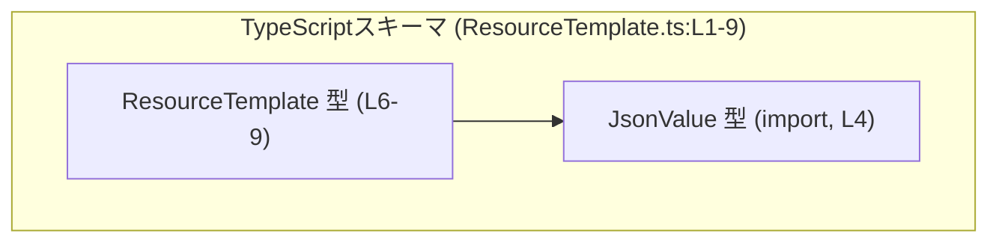
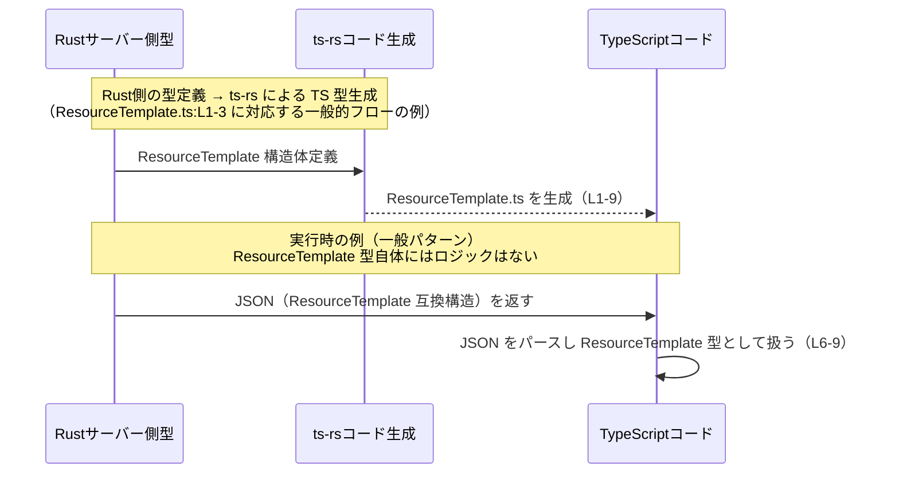

# app-server-protocol/schema/typescript/ResourceTemplate.ts

## 0. ざっくり一言

このファイルは、サーバ上で利用可能なリソースの「テンプレート情報」を表現する TypeScript の型 `ResourceTemplate` を定義する、自動生成されたスキーマファイルです（ResourceTemplate.ts:L1-3, L6-9）。

---

## 1. このモジュールの役割

### 1.1 概要

- このモジュールは **サーバ上のリソースに関するメタデータを表す型** を提供します（JSDoc: ResourceTemplate.ts:L6-8）。
- Rust 製のサーバ側コードから `ts-rs` によって自動生成された TypeScript 型であり、クライアント側 TypeScript コードで同じ構造のオブジェクトを型安全に扱うために存在します（ResourceTemplate.ts:L1-3）。

### 1.2 アーキテクチャ内での位置づけ

このファイルから分かる依存関係は以下のとおりです。

- `ResourceTemplate` は、`annotations` プロパティで `JsonValue` 型を利用します（ResourceTemplate.ts:L4, L9）。
- `JsonValue` は `"./serde_json/JsonValue"` からインポートされる、任意の JSON 値を表す型です（名前とパスから推測できますが、実体はこのチャンクには含まれません）。



このチャンクからは、`ResourceTemplate` をどのファイルが利用しているか（呼び出し元）は分かりません。

### 1.3 設計上のポイント

コードから読み取れる設計上の特徴は次のとおりです。

- **自動生成コードであることの明示**  
  - 冒頭コメントで「GENERATED CODE」「Do not edit this file manually」と明示されています（ResourceTemplate.ts:L1-3）。
  - 手書きでの変更は想定されていません。

- **状態やロジックを持たないピュアな型定義**  
  - 関数やクラスは一切なく、`export type` によるオブジェクト型エイリアスのみが定義されています（ResourceTemplate.ts:L9）。
  - 副作用・並行処理・エラーハンドリングはこのファイルには存在しません。

- **必須／任意プロパティの明確な区別**  
  - `uriTemplate`, `name` は必須、その他は `?` により任意プロパティとして定義されています（ResourceTemplate.ts:L9）。
  - TypeScript の型チェックにより、必須項目の未設定がコンパイル時に検出されます。

- **`JsonValue` による柔軟な拡張領域**  
  - `annotations?: JsonValue` は任意の JSON 構造を埋め込める汎用拡張フィールドとして機能します（ResourceTemplate.ts:L4, L9）。
  - 静的な型付けは弱くなる反面、柔軟にメタデータを付与できる設計です。

---

## 2. 主要な機能一覧

このモジュールは関数ではなく「型」を提供しますが、機能的な観点で整理すると次のようになります。

- **`ResourceTemplate` 型定義:**
  - サーバ上のリソーステンプレートのメタデータ（URI テンプレート、表示名、タイトル、説明、MIME タイプ、任意のアノテーション）を表現するオブジェクト型を提供します（ResourceTemplate.ts:L6-9）。
- **`JsonValue` を用いたアノテーション拡張:**
  - `annotations` プロパティを通じて、型付けのきつくない任意の JSON データを紐づけられるようにします（ResourceTemplate.ts:L4, L9）。

---

## 3. 公開 API と詳細解説

### 3.1 型一覧（構造体・列挙体など）

このファイルに現れる主な型・依存の一覧です。

| 名前 | 種別 | 役割 / 用途 | 定義 / 使用箇所 |
|------|------|-------------|-----------------|
| `ResourceTemplate` | 型エイリアス（オブジェクト型） | サーバ上のリソースについて、URI テンプレートや名前、説明等のメタデータを保持するための型。クライアント側でこの構造のオブジェクトを型安全に扱うために用いられます。 | 定義: ResourceTemplate.ts:L6-9 |
| `JsonValue` | 型（インポート） | `annotations` プロパティに格納される任意の JSON 値を表す型。具体的な定義は `"./serde_json/JsonValue"` 側にあります。 | インポート: ResourceTemplate.ts:L4 / 利用: ResourceTemplate.ts:L9 |

`ResourceTemplate` のプロパティ構造（ResourceTemplate.ts:L9）:

- `annotations?: JsonValue` — 任意。追加のメタデータを JSON 形式で表現する拡張フィールド。
- `uriTemplate: string` — 必須。リソースへの URI テンプレート文字列。
- `name: string` — 必須。リソーステンプレートの識別名。
- `title?: string` — 任意。人間向けのタイトル。
- `description?: string` — 任意。リソーステンプレートの説明文。
- `mimeType?: string` — 任意。関連する MIME タイプ（例: `"application/json"`）。  

※ プロパティの意味は JSDoc とプロパティ名からの読み取りに基づきます。

### 3.2 関数詳細（最大 7 件）

このファイルには関数・メソッドは定義されていません（ResourceTemplate.ts:L1-9）。  
したがって、このセクションで詳述すべき公開関数はありません。

### 3.3 その他の関数

同様に、このファイルに補助的な関数やラッパー関数も存在しません。

---

## 4. データフロー

このチャンクには `ResourceTemplate` を実際に生成・利用する処理は含まれていませんが、`ts-rs` による自動生成型の一般的な利用イメージとして、次のようなデータフローが **考えられます**。  
※ 実際に本リポジトリでこの通りに使われているかどうかは、このファイルからは分かりません（ResourceTemplate.ts:L1-3, L6-9）。



要点:

- このファイルは **コンパイル時の型情報** を提供するだけで、実行時の処理フロー（HTTP 送受信など）は含まれていません。
- 実際のエラーハンドリング・バリデーション・並行処理は、この型を利用する別のコード側に存在することになります。

---

## 5. 使い方（How to Use）

### 5.1 基本的な使用方法

`ResourceTemplate` 型に準拠したオブジェクトを作成し、関数やコンポーネントの引数として受け渡して利用します。

```typescript
import type { ResourceTemplate } from "./ResourceTemplate";          // 生成された型をインポートする
// JsonValue の具体的な構造は "./serde_json/JsonValue" 側の定義に依存する

// ResourceTemplate 型の値を生成する例
const userResource: ResourceTemplate = {                             // 必須フィールドを含むオブジェクトを作成
    uriTemplate: "/users/{id}",                                      // uriTemplate: string（必須）
    name: "UserResource",                                            // name: string（必須）
    title: "User resource",                                          // title?: string（任意）
    description: "Operations related to users",                      // description?: string（任意）
    mimeType: "application/json",                                    // mimeType?: string（任意）
    annotations: {                                                   // annotations?: JsonValue（任意）
        version: 1,
        deprecated: false,
    } as any,                                                        // ここでは JsonValue への具体的な型合わせは簡略化
};

// ResourceTemplate 型を引数に取る関数の例
function printResourceInfo(tmpl: ResourceTemplate) {                 // tmpl は ResourceTemplate 型
    console.log(tmpl.name, tmpl.uriTemplate);                        // 必須フィールドは undefined にはならない前提で扱える
}
```

このように、`uriTemplate` と `name` は必須なので、省略するとコンパイルエラーになります。任意プロパティは省略可能ですが、利用時は `undefined` である可能性を考慮する必要があります。

### 5.2 よくある使用パターン

1. **API レスポンスの型付け**

```typescript
async function fetchTemplates(): Promise<ResourceTemplate[]> {       // API から ResourceTemplate の配列を受け取る想定
    const res = await fetch("/api/templates");
    const json = await res.json();
    return json as ResourceTemplate[];                               // 実際の検証は別途必要（ここでは型アサーション）
}

async function main() {
    const templates = await fetchTemplates();
    for (const tmpl of templates) {
        console.log(tmpl.name, tmpl.uriTemplate);
    }
}
```

1. **スキーマ駆動の UI 生成**

```typescript
function buildLink(tmpl: ResourceTemplate, id: string): string {
    // 非常に単純化した置換例（実際のテンプレート展開ロジックは別実装）
    return tmpl.uriTemplate.replace("{id}", encodeURIComponent(id)); // uriTemplate は string であることが型で保証される
}
```

※ `uriTemplate` の具体的なフォーマットや展開ロジックは、このファイルからは分かりません。

### 5.3 よくある間違い

#### 1. 必須フィールドの欠落

```typescript
// 間違い例: 必須の name を指定していない
const invalidTemplate: ResourceTemplate = {
    uriTemplate: "/items/{id}",
    // name: "ItemResource",   // ← これを省略するとコンパイルエラー
};

// 正しい例
const validTemplate: ResourceTemplate = {
    uriTemplate: "/items/{id}",
    name: "ItemResource",
};
```

#### 2. 任意フィールドを `undefined` チェックなしで使用

```typescript
function showTitle(tmpl: ResourceTemplate) {
    // 間違い例: title が undefined の可能性を考慮していない
    // console.log(tmpl.title.toUpperCase());  // コンパイルエラーになるか、設定によっては実行時エラーの原因

    // 正しい例: undefined の可能性をチェックする
    if (tmpl.title) {
        console.log(tmpl.title.toUpperCase());
    }
}
```

### 5.4 使用上の注意点（まとめ）

- **前提条件**
  - `uriTemplate` と `name` は常に設定されている前提でコードを書くことができます（TypeScript の型システムにより保証されます）。
- **任意プロパティの取り扱い**
  - `annotations`, `title`, `description`, `mimeType` は `undefined` の可能性があるため、利用前に存在チェックが必要です。
- **型安全性と `JsonValue`**
  - `annotations` は `JsonValue` によって表現され、内部構造の静的な型チェックは弱い可能性があります。そのため、実際に利用する際には型ガードやランタイムチェックを組み合わせる必要があります。
- **エラー・バリデーション**
  - このファイルにはバリデーションロジックは含まれていません。値の整合性（URI テンプレート形式の妥当性、MIME タイプの正当性など）は、別の層で検証する必要があります。
- **並行性**
  - 本ファイルは純粋な型定義のみであり、共有状態や非同期処理を扱わないため、並行性に関する直接の問題はありません。

---

## 6. 変更の仕方（How to Modify）

### 6.1 新しい機能を追加する場合

このファイルは自動生成コードであり、先頭で「Do not edit this file manually」と明示されています（ResourceTemplate.ts:L1-3）。そのため、直接このファイルを編集することは想定されていません。

一般的な運用方針としては次のようになります。

1. **Rust 側の元定義を変更する**
   - `ts-rs` が参照している Rust の型定義（例: `struct ResourceTemplate` など）を変更・拡張します。
   - その具体的な場所や名前は、このチャンクには含まれていません（不明）。

2. **`ts-rs` による再生成を行う**
   - ビルドスクリプトや専用コマンドを通じて TypeScript 型を再生成し、新たなフィールドや変更を反映させます。
   - 再生成により、本ファイルの内容は上書きされます。

3. **TypeScript 側の利用コードを更新する**
   - 新しいプロパティを使うコードを追加したり、既存プロパティの意味変更に対応します。

### 6.2 既存の機能を変更する場合

既存フィールドの型変更や削除も、同様に TypeScript ファイルではなく元となる Rust 型定義を変更するのが前提です（ResourceTemplate.ts:L1-3）。

変更時の注意点:

- **互換性への影響**
  - `uriTemplate` や `name` の型を変える、必須／任意を入れ替えると、TypeScript 側でこの型を利用しているすべての箇所に影響します。
  - 影響箇所は IDE の型エラーや検索で確認する必要があります（このチャンクから具体的な利用箇所は分かりません）。

- **生成コードの上書き**
  - 手作業で本ファイルを変更しても、次回のコード生成で上書きされる可能性があります。そのため、恒久的な修正は元の定義側で行う必要があります。

- **テスト**
  - このファイルにはテストコードは含まれていません。型変更に伴う影響は、別途存在するテスト（もしあれば）やビルド時の型チェックで検出することになります。

---

## 7. 関連ファイル

このチャンクから確実に分かる関連ファイルは次のとおりです。

| パス | 役割 / 関係 |
|------|------------|
| `./serde_json/JsonValue` | `JsonValue` 型を提供するモジュールです。`ResourceTemplate` の `annotations` プロパティで利用され、任意の JSON 値を表現するために使用されます（ResourceTemplate.ts:L4, L9）。 |

その他の関連ファイル（Rust 側の元定義や、この型を利用する TypeScript ファイルなど）のパスや構成は、このチャンクには現れないため不明です。
