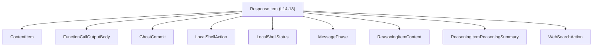
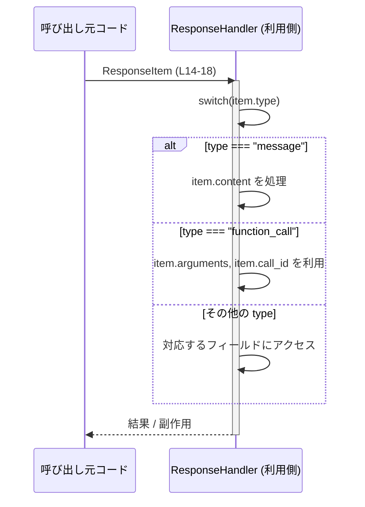

# app-server-protocol/schema/typescript/ResponseItem.ts

## 0. ざっくり一言

`ResponseItem` は、サーバーやバックエンドからクライアントに渡される **「レスポンスの 1 要素」を表すタグ付きユニオン型** です（`type` フィールドで 14 種類のバリアントを区別します）。  
実行ロジックは一切なく、**プロトコル（データ形式）の定義専用**のファイルです。

---

## 1. このモジュールの役割

### 1.1 概要

- このモジュールは、さまざまな種類のレスポンス要素を 1 つの TypeScript 型 `ResponseItem` としてまとめています（`export type ResponseItem = ...`）。  
  `ResponseItem.ts:L14-18`
- 各バリアントは `"type"` プロパティ（文字列リテラル）を持ち、TypeScript が提供する **判別可能ユニオン（discriminated union）** として利用できます。
- この型自体は実行コードを含まず、**静的型チェックと IDE 補完のためのスキーマ**として機能します。

### 1.2 アーキテクチャ内での位置づけ

このファイルは `schema/typescript` ディレクトリ下にあり、複数の型を import して `ResponseItem` に組み込んでいます。

- 依存している外部型（いずれも型のみ import）

  - `ContentItem`（`"./ContentItem"`）`ResponseItem.ts:L4`
  - `FunctionCallOutputBody`（`"./FunctionCallOutputBody"`）`ResponseItem.ts:L5`
  - `GhostCommit`（`"./GhostCommit"`）`ResponseItem.ts:L6`
  - `LocalShellAction`（`"./LocalShellAction"`）`ResponseItem.ts:L7`
  - `LocalShellStatus`（`"./LocalShellStatus"`）`ResponseItem.ts:L8`
  - `MessagePhase`（`"./MessagePhase"`）`ResponseItem.ts:L9`
  - `ReasoningItemContent`（`"./ReasoningItemContent"`）`ResponseItem.ts:L10`
  - `ReasoningItemReasoningSummary`（`"./ReasoningItemReasoningSummary"`）`ResponseItem.ts:L11`
  - `WebSearchAction`（`"./WebSearchAction"`）`ResponseItem.ts:L12`

これらの型定義ファイルの中身はこのチャンクには出てこないため、詳細な構造や意味は不明です。

#### 依存関係図（型レベル）

`ResponseItem` と、その依存関係を簡単に図示します。



### 1.3 設計上のポイント

コードから読み取れる設計上の特徴は次のとおりです。

- **タグ付きユニオン設計**  
  - すべてのバリアントが `"type"` プロパティ（文字列リテラル）を持ちます。  
    `ResponseItem.ts:L14-18`
  - これにより `switch (item.type)` などで分岐するとき、TypeScript の **型ナローイング** が機能します。
- **完全にイミュータブルなデータ定義**  
  - このファイルにはクラスやメソッド、ロジックは存在せず、型 alias のみです（実行時状態を持たない）。
- **エラーハンドリング／安全性は利用側に委ねる**  
  - `unknown`, `string`, `string | null` など、比較的ゆるい型も含まれています。  
    実行時の検証・バリデーションは利用側のコードで行う必要があります。
- **自動生成コード**  
  - 冒頭コメントに「GENERATED CODE! DO NOT MODIFY BY HAND!」とあり、`ts-rs` による自動生成ファイルであることが明示されています。  
    `ResponseItem.ts:L1-3`

---

## 2. 主要な機能一覧（データ構造レベル）

このファイルは関数を持たないため、「機能」は `ResponseItem` の各バリアント（ユニオン要素）の形で提供されます。

`ResponseItem` のバリアント一覧（`"type"` の値ごと）:

- `"message"` バリアント:  
  - `role: string`  
  - `content: Array<ContentItem>`  
  - `end_turn?: boolean`（任意）  
  - `phase?: MessagePhase`（任意）  
- `"reasoning"` バリアント:  
  - `summary: Array<ReasoningItemReasoningSummary>`  
  - `content?: Array<ReasoningItemContent>`（任意）  
  - `encrypted_content: string | null`  
- `"local_shell_call"` バリアント:  
  - `call_id: string | null`  
  - `status: LocalShellStatus`  
  - `action: LocalShellAction`  
- `"function_call"` バリアント:  
  - `name: string`  
  - `namespace?: string`（任意）  
  - `arguments: string`  
  - `call_id: string`  
- `"tool_search_call"` バリアント:  
  - `call_id: string | null`  
  - `status?: string`（任意）  
  - `execution: string`  
  - `arguments: unknown`  
- `"function_call_output"` バリアント:  
  - `call_id: string`  
  - `output: FunctionCallOutputBody`  
- `"custom_tool_call"` バリアント:  
  - `status?: string`（任意）  
  - `call_id: string`  
  - `name: string`  
  - `input: string`  
- `"custom_tool_call_output"` バリアント:  
  - `call_id: string`  
  - `name?: string`（任意）  
  - `output: FunctionCallOutputBody`  
- `"tool_search_output"` バリアント:  
  - `call_id: string | null`  
  - `status: string`  
  - `execution: string`  
  - `tools: unknown[]`  
- `"web_search_call"` バリアント:  
  - `status?: string`（任意）  
  - `action?: WebSearchAction`（任意）  
- `"image_generation_call"` バリアント:  
  - `id: string`  
  - `status: string`  
  - `revised_prompt?: string`（任意）  
  - `result: string`  
- `"ghost_snapshot"` バリアント:  
  - `ghost_commit: GhostCommit`  
- `"compaction"` バリアント:  
  - `encrypted_content: string`  
- `"other"` バリアント:  
  - フィールドなし（`{ "type": "other" }`）

すべて `ResponseItem.ts:L14-18` にまとめて定義されています。

---

## 3. 公開 API と詳細解説

### 3.1 型一覧（構造体・列挙体など）

このファイルで **名前付きで公開されている型** は 1 つです。

| 名前          | 種別      | 役割 / 用途                                                                             | 定義位置                        |
|---------------|-----------|----------------------------------------------------------------------------------------|---------------------------------|
| `ResponseItem` | 型エイリアス（ユニオン型） | `"type"` プロパティで 14 種類のレスポンス形態を表すタグ付きユニオン。プロトコルの中心的データ型。 | `ResponseItem.ts:L14-18` |

`ResponseItem` の各バリアントは匿名のオブジェクト型ですが、実質的にはそれぞれ別種の「構造体」に相当します。

#### `ResponseItem` ユニオンのバリアント概要（構造インベントリ）

| `"type"` 値                | 主なフィールド                                      | 備考（事実ベース）                         |
|---------------------------|----------------------------------------------------|-------------------------------------------|
| `"message"`               | `role: string`, `content: ContentItem[]`, `end_turn?: boolean`, `phase?: MessagePhase` | コンテンツ配列とロールを持つ |
| `"reasoning"`             | `summary: ReasoningItemReasoningSummary[]`, `content?: ReasoningItemContent[]`, `encrypted_content: string \| null` | 推論要約と（任意の）内容、暗号化コンテンツ |
| `"local_shell_call"`      | `call_id: string \| null`, `status: LocalShellStatus`, `action: LocalShellAction` | シェル関連の状態・アクション情報 |
| `"function_call"`         | `name: string`, `namespace?: string`, `arguments: string`, `call_id: string` | 汎用的な関数呼び出し情報 |
| `"tool_search_call"`      | `call_id: string \| null`, `status?: string`, `execution: string`, `arguments: unknown` | 実行内容と引数（unknown 型） |
| `"function_call_output"`  | `call_id: string`, `output: FunctionCallOutputBody` | 関数呼び出しの出力 |
| `"custom_tool_call"`      | `status?: string`, `call_id: string`, `name: string`, `input: string` | カスタムツールへの入力情報 |
| `"custom_tool_call_output"` | `call_id: string`, `name?: string`, `output: FunctionCallOutputBody` | カスタムツールの出力 |
| `"tool_search_output"`    | `call_id: string \| null`, `status: string`, `execution: string`, `tools: unknown[]` | 複数ツール情報を持つ出力 |
| `"web_search_call"`       | `status?: string`, `action?: WebSearchAction` | ウェブ検索関連のアクション情報 |
| `"image_generation_call"` | `id: string`, `status: string`, `revised_prompt?: string`, `result: string` | 画像生成関連の結果情報 |
| `"ghost_snapshot"`        | `ghost_commit: GhostCommit` | コミット状態を保持するスナップショット |
| `"compaction"`            | `encrypted_content: string` | 暗号化された内容をもつエントリ |
| `"other"`                 | （その他フィールドなし） | 不明または拡張用のフォールバックとみなせるが、コードからは意図不明 |

すべて `ResponseItem.ts:L14-18` に記述されています。

### 3.2 関数詳細（最大 7 件）

このファイルには **関数・メソッドが 1 つも定義されていません**。  
そのため、ここで詳細解説すべき関数はありません。

### 3.3 その他の関数

同様に、このファイルには補助関数やラッパー関数も存在しません。

---

## 4. データフロー

このファイルは型定義のみですが、`ResponseItem` を受け取るコード側での典型的なデータフローを、**判別可能ユニオンの利用**という観点で示します。

### 4.1 典型的なハンドリングフロー

`ResponseItem` を入力として受け取り、`type` に応じて処理を分ける場面を想定したシーケンスです。



このフローは、`ResponseItem` が **判別共用体の「タグ」 (`type`) として動作し、フィールドの型安全なアクセスを可能にする**という点を表しています。

---

## 5. 使い方（How to Use）

### 5.1 基本的な使用方法

`ResponseItem` を受け取って安全に処理する基本パターンです。  
`type` プロパティによる **型ナローイング** を活用します。

```typescript
// ResponseItem 型をインポートする                                   // 型定義を利用する
import type { ResponseItem } from "./ResponseItem";                   // このファイル自身からのインポート例

// ResponseItem を受け取って処理する関数                              // 判別ユニオンを使ったハンドラ
function handleResponse(item: ResponseItem): void {                   // item の型は ResponseItem
    switch (item.type) {                                              // "type" で分岐することで型が絞り込まれる
        case "message":                                               // type === "message" の場合
            // item は { type: "message", role, content, ... } として扱える
            console.log("role:", item.role);                          // role: string に安全にアクセス
            console.log("contents:", item.content);                   // content: ContentItem[] にアクセス
            if (item.end_turn) {                                      // end_turn?: boolean を安全に参照
                console.log("End of turn");                           // 任意の処理
            }
            break;

        case "function_call":                                         // type === "function_call" の場合
            // item は function_call バリアントとして扱える
            console.log("call:", item.name, "args:", item.arguments); // name: string, arguments: string にアクセス
            break;

        case "tool_search_call":                                      // type === "tool_search_call" の場合
            // arguments は unknown 型なので、そのまま使う前にチェックが必要
            console.log("execution:", item.execution);                // execution: string
            // ここではあえて typeof などで型チェックすることが望ましい
            break;

        default:                                                      // その他のすべての type
            // "other" を含む残りのバリアントがここに来る
            console.log("Unhandled type:", item.type);                // ログ出力など
            break;
    }
}
```

このコード例から分かるポイント:

- `switch (item.type)` によって、`item` の型が各ケースごとに絞り込まれます（TypeScript の判別ユニオン機能）。
- `unknown` や `string | null` を直接利用する場合は、**利用側で追加の型チェックが必要**になります。

### 5.2 よくある使用パターン

1. **すべてのバリアントを網羅して処理する**

   `switch` で全 `"type"` を列挙し、最後に `never` を使ってコンパイル時に網羅性をチェックするパターンです（安全性向上）。

   ```typescript
   function exhaustiveHandler(item: ResponseItem): void {             // すべてのバリアントを扱う想定
       switch (item.type) {
           case "message":
           case "reasoning":
           case "local_shell_call":
           case "function_call":
           case "tool_search_call":
           case "function_call_output":
           case "custom_tool_call":
           case "custom_tool_call_output":
           case "tool_search_output":
           case "web_search_call":
           case "image_generation_call":
           case "ghost_snapshot":
           case "compaction":
           case "other":
               // ここでそれぞれのバリアントごとの処理を書く            // 実際には case ごとに分ける
               break;

           default:                                                    // 型定義が変わったときに検出するための保険
               const _exhaustiveCheck: never = item;                   // item が never 型でないとコンパイルエラー
               return _exhaustiveCheck;
       }
   }
   ```

2. **特定のバリアントだけを処理し、それ以外は無視する**

   処理対象の `"type"` を絞り、残りはログ出力や無視にするパターンもよくあります。

### 5.3 よくある間違い

```typescript
// 間違い例: type を見ずにフィールドにアクセスしてしまう
function badHandler(item: ResponseItem) {
    // console.log(item.content);                                      // エラー: content は全バリアントに存在しない
    // console.log(item.output);                                       // エラー: output も同様に全バリアント共通ではない
}

// 正しい例: type を判別してから、該当フィールドにアクセスする
function goodHandler(item: ResponseItem) {
    if (item.type === "message") {                                    // "message" バリアントに絞る
        console.log(item.content);                                    // content はこのバリアントでは必須
    } else if (item.type === "function_call_output") {                // 別バリアントに絞る
        console.log(item.output);                                     // output: FunctionCallOutputBody を安全に参照
    }
}
```

### 5.4 使用上の注意点（まとめ）

- **必ず `type` による判別を行うこと**  
  - どのフィールドが存在するかはバリアントごとに異なります。`type` を見ずにフィールドアクセスすると型エラー、もしくは any 化などの原因になります。
- **`unknown` 型の扱い**  
  - `"tool_search_call"` や `"tool_search_output"` に含まれる `arguments: unknown` / `tools: unknown[]` は、そのまま利用すると危険です。  
    実行時に `typeof` やユーザー定義の型ガードでチェックしてから利用する必要があります。
- **`string | null` の `call_id` や `encrypted_content`**  
  - `null` を許容する設計になっているため、利用時は `null` チェックを忘れないことが前提です。
- **自動生成ファイルであること**  
  - 冒頭に「GENERATED CODE! DO NOT MODIFY BY HAND!」とあるため、手動で編集すると生成元との不整合が発生します。変更は生成元（おそらく Rust 側の ts-rs 対象型）で行う必要があります。

---

## 6. 変更の仕方（How to Modify）

### 6.1 新しい機能を追加する場合

このファイルは `ts-rs` による自動生成コードであり、冒頭コメントに「Do not edit this file manually」とあるため、**直接編集は推奨されません**。`ResponseItem.ts:L1-3`

新しい `"type"` のバリアントなどを追加したい場合の一般的な手順:

1. **生成元の定義を変更する**  
   - ts-rs が生成している元言語（通常は Rust）側の型定義に、新しいバリアント・フィールドを追加します。  
   - このチャンクからはそのファイルの場所は分かりません（不明）。
2. **コード生成を再実行する**  
   - ts-rs のビルドステップやコード生成コマンドを再実行し、TypeScript 側の `ResponseItem.ts` を再生成します。
3. **利用側コードを更新する**  
   - 新しい `"type"` を `switch` 文などに追加し、処理を実装します。
   - 網羅性チェック（`never` を用いたパターン）を利用している場合、新バリアントを扱わないとコンパイルエラーで検出できます。

### 6.2 既存の機能を変更する場合

既存バリアントのフィールドを変更したり、型を変えたい場合も同様に **生成元の型定義を変更** します。

変更時に注意すべき点:

- **影響範囲の確認**
  - どの `"type"` のバリアントにどのフィールドがあるかは、`ResponseItem.ts:L14-18` で確認できます。
  - 利用側で `item.type === "..."` としているコードを検索し、影響を確認する必要があります。
- **契約条件の維持**
  - たとえば `call_id` を `string | null` から `string` に変更すると、`null` を許容していた既存のプロトコルとの互換性が失われます。
- **テスト・シリアライズとの整合性**
  - この型はおそらくシリアライズされて送受信されるため（ディレクトリ名や ts-rs からの推測）、JSON などのシリアライズ形式での互換性も考慮する必要がありますが、詳細はこのチャンクからは分かりません。

---

## 7. 関連ファイル

このモジュールと密接に関係するのは、import されている型定義ファイルです。

| パス                               | 役割 / 関係（事実ベース）                                      |
|------------------------------------|---------------------------------------------------------------|
| `./ContentItem`                    | `"message"` バリアントの `content: ContentItem[]` に使用される型。構造はこのチャンクには現れない。 |
| `./FunctionCallOutputBody`         | `"function_call_output"` と `"custom_tool_call_output"` の `output` フィールドで使用。       |
| `./GhostCommit`                    | `"ghost_snapshot"` バリアントの `ghost_commit` に使用。                         |
| `./LocalShellAction`               | `"local_shell_call"` バリアントの `action` に使用。内容は不明。                  |
| `./LocalShellStatus`               | `"local_shell_call"` バリアントの `status` に使用。内容は不明。                  |
| `./MessagePhase`                   | `"message"` バリアントの `phase?: MessagePhase` に使用。内容は不明。             |
| `./ReasoningItemContent`           | `"reasoning"` バリアントの `content?: ReasoningItemContent[]` に使用。           |
| `./ReasoningItemReasoningSummary`  | `"reasoning"` バリアントの `summary: ReasoningItemReasoningSummary[]` に使用。   |
| `./WebSearchAction`                | `"web_search_call"` バリアントの `action?: WebSearchAction` に使用。             |

これらのファイルの具体的な内容・仕様は、このチャンクには現れておらず、不明です。

---

### 補足: 安全性・エッジケースに関する契約

- **エッジケース**
  - `call_id: string | null` のように `null` を許容するフィールドは、ID がまだ付与されていない／不要な状況を表現している可能性がありますが、コードからは断定できません。  
    いずれにせよ、利用側で `null` を前提にコーディングする必要があります。
  - `"other"` バリアントは、未定義・拡張用のフォールバックとして使われる可能性がありますが、ドキュメントやコメントはありません。
- **セキュリティ観点（型レベル）**
  - `arguments: string` や `input: string`、`execution: string` など、任意の文字列を受け取るフィールドが複数あります。  
    これらが実際に何に使われるかはこのファイルからは分かりませんが、**利用側でエスケープや検証を行わない限り、コードインジェクション等のリスクが残ります**。
  - `unknown` / `unknown[]` を適切にチェックせずに信頼してしまうと、期待と異なる構造のデータが入ってくる可能性があります。

このファイル自体は静的な型定義のみであり、実行時の安全性やエラー処理は、**すべてこれを利用する側のコードの責任**で設計される必要があります。
