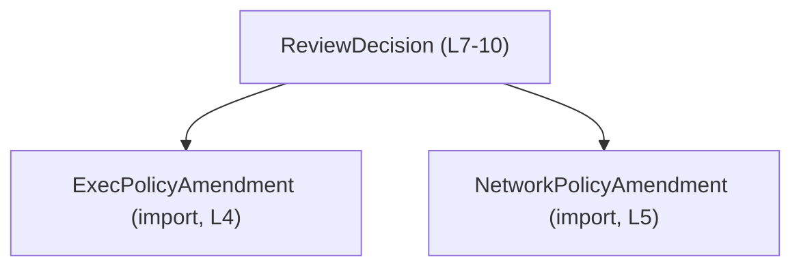
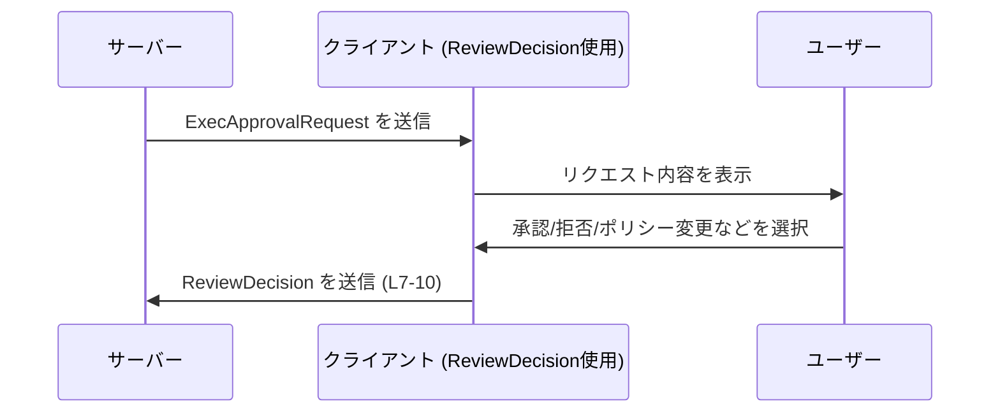

# app-server-protocol/schema/typescript/ReviewDecision.ts コード解説

## 0. ざっくり一言

このファイルは、`ExecApprovalRequest` に対するユーザーの意思決定を表す TypeScript のユニオン型 `ReviewDecision` を定義する、自動生成されたコードです。  
`ReviewDecision` は、単純な承認／拒否だけでなく、実行ポリシーやネットワークポリシーの変更案を伴う承認も表現できます。  
（コメントと型定義より: ReviewDecision.ts:L7-10）

---

## 1. このモジュールの役割

### 1.1 概要

- このモジュールは、「ExecApprovalRequest に対するユーザーの決定」を表現するための型 `ReviewDecision` を提供します。（ReviewDecision.ts:L7-10）
- 文字列リテラルとオブジェクト形式を組み合わせたユニオン型により、決定の種類と、必要に応じて添付されるポリシー変更情報を型安全に表現します。（ReviewDecision.ts:L4-5, L10）

### 1.2 アーキテクチャ内での位置づけ

- ファイルパスから、この型は `app-server-protocol` プロジェクトの TypeScript スキーマ (`schema/typescript`) の一部であることが分かります。
- `ReviewDecision` は、他モジュールで定義された `ExecPolicyAmendment` と `NetworkPolicyAmendment` 型を参照しており（ReviewDecision.ts:L4-5）、それらの値を内包する形で決定内容を表します。（ReviewDecision.ts:L10）
- コメントにより、この型は `ExecApprovalRequest` に対するユーザーの応答として利用されることが明示されています。（ReviewDecision.ts:L7-8）

依存関係を簡易な Mermaid 図で表すと次のようになります。



### 1.3 設計上のポイント

- 自動生成コード  
  - 冒頭コメントにより、このファイルは `ts-rs` によって生成されたものであり、手動編集してはいけないことが明示されています。（ReviewDecision.ts:L1-3）
- ユニオン型による状態表現  
  - `ReviewDecision` は文字列リテラル型とオブジェクト型のユニオンとして定義されており、取りうる状態を列挙的に制限しています。（ReviewDecision.ts:L10）
- 追加データ付きのバリアント  
  - 一部のバリアントでは、`ExecPolicyAmendment` や `NetworkPolicyAmendment` を内包したオブジェクト形式を用いることで、決定に付随するポリシー変更案を同時に伝達できる形になっています。（ReviewDecision.ts:L4-5, L10）
- 型のみ・ロジックなし  
  - このファイルには関数や実行ロジックは存在せず、純粋な型定義のみを提供します。（ReviewDecision.ts:L4-10）

---

## 2. 主要な機能一覧

このモジュールの「機能」は、`ReviewDecision` 型が表すバリアント（選択肢）です。（ReviewDecision.ts:L7-10）

- `"approved"`: そのまま承認したことを表すリテラル値
- `{ "approved_execpolicy_amendment": { proposed_execpolicy_amendment: ExecPolicyAmendment } }`  
  実行ポリシー変更案を添えた承認
- `"approved_for_session"`: セッション限定で承認したことを表すリテラル値
- `{ "network_policy_amendment": { network_policy_amendment: NetworkPolicyAmendment } }`  
  ネットワークポリシーの変更案を添えた意思決定
- `"denied"`: 拒否
- `"timed_out"`: ユーザー応答がタイムアウトした状態
- `"abort"`: 処理自体の中止を表す状態

（すべて ReviewDecision.ts:L10）

---

## 3. 公開 API と詳細解説

### 3.1 型一覧（構造体・列挙体など）

このファイル内で登場する主な型コンポーネントの一覧です。

| 名前 | 種別 | 役割 / 用途 | 定義/参照位置 |
|------|------|-------------|----------------|
| `ReviewDecision` | 型エイリアス（ユニオン型） | `ExecApprovalRequest` に対するユーザーの決定（承認・拒否・ポリシー変更付きなど）を表す | ReviewDecision.ts:L7-10 |
| `ExecPolicyAmendment` | import された型 | `ReviewDecision` の一バリアント内で、`proposed_execpolicy_amendment` プロパティの型として使用される | ReviewDecision.ts:L4, L10 |
| `NetworkPolicyAmendment` | import された型 | `ReviewDecision` の一バリアント内で、`network_policy_amendment` プロパティの型として使用される | ReviewDecision.ts:L5, L10 |

※ `ExecPolicyAmendment` および `NetworkPolicyAmendment` の実体定義はこのチャンクには現れません。

#### `ReviewDecision` の内部構造（ユニオン構成）

`ReviewDecision` は次の 7 通りの形のいずれかです。（ReviewDecision.ts:L10）

1. `"approved"`
2. `{ "approved_execpolicy_amendment": { proposed_execpolicy_amendment: ExecPolicyAmendment } }`
3. `"approved_for_session"`
4. `{ "network_policy_amendment": { network_policy_amendment: NetworkPolicyAmendment } }`
5. `"denied"`
6. `"timed_out"`
7. `"abort"`

TypeScript の観点では「**文字列リテラル型 + オブジェクト型のユニオン**」になっており、これにより許される値が上記に厳密に限定されます。（ReviewDecision.ts:L10）

### 3.2 関数詳細

このファイルには関数・メソッドは定義されていません。  
そのため、このセクションで詳細説明すべき公開関数は存在しません。（ReviewDecision.ts:L1-10）

### 3.3 その他の関数

このファイルには補助関数やラッパー関数もありません。（ReviewDecision.ts:L1-10）

---

## 4. データフロー

### 4.1 代表的な処理シナリオ

コメントから、この型は `ExecApprovalRequest` に対する「ユーザーの決定」を表すために使われることが分かります。（ReviewDecision.ts:L7-8）  
実際の処理ロジックはこのチャンクにはありませんが、典型的なデータフローは次のように整理できます。

1. サーバーがクライアントに `ExecApprovalRequest` を送信する。
2. クライアントはユーザーに内容を表示する。
3. ユーザーが承認／拒否／ポリシー変更付き承認などを選択する。
4. クライアントが選択内容に対応する `ReviewDecision` 値を作成し、サーバーに返送する。

これをシーケンス図で示します。



※ 実際の関数名やエンドポイント名などは、このチャンクには現れないため不明です。

---

## 5. 使い方（How to Use）

ここでは TypeScript コードから `ReviewDecision` を利用する典型的な方法を示します。

### 5.1 基本的な使用方法

`ReviewDecision` を直接値として扱うシンプルな例です。

```typescript
// ReviewDecision 型をインポートする例
import type { ReviewDecision } from "./ReviewDecision"; // モジュールパスはこのファイル自身

// 単純な承認
const decision1: ReviewDecision = "approved"; // OK: ユニオンに含まれるリテラル（ReviewDecision.ts:L10）

// セッション単位の承認
const decision2: ReviewDecision = "approved_for_session"; // OK（ReviewDecision.ts:L10）

// 拒否
const decision3: ReviewDecision = "denied"; // OK（ReviewDecision.ts:L10）
```

ポリシー変更案を含むバリアントを利用する例です。

```typescript
import type { ReviewDecision } from "./ReviewDecision";
import type { ExecPolicyAmendment } from "./ExecPolicyAmendment"; // ReviewDecision.ts:L4
import type { NetworkPolicyAmendment } from "./NetworkPolicyAmendment"; // ReviewDecision.ts:L5

declare const execPolicy: ExecPolicyAmendment;         // どこか別の場所で構築された値
declare const netPolicy: NetworkPolicyAmendment;

// 実行ポリシーの変更案付き承認
const decisionExec: ReviewDecision = {
    approved_execpolicy_amendment: {                  // ReviewDecision.ts:L10
        proposed_execpolicy_amendment: execPolicy,    // ReviewDecision.ts:L10
    },
};

// ネットワークポリシーの変更案
const decisionNet: ReviewDecision = {
    network_policy_amendment: {                       // ReviewDecision.ts:L10
        network_policy_amendment: netPolicy,          // ReviewDecision.ts:L10
    },
};
```

### 5.2 よくある使用パターン

#### パターン 1: ユニオン型の分岐処理（型ガード）

`ReviewDecision` はユニオン型なので、`switch` や `if` を用いて分岐処理を行うのが一般的です。

```typescript
function handleDecision(decision: ReviewDecision) {
    if (decision === "approved") {
        // シンプル承認
        // ...
    } else if (decision === "approved_for_session") {
        // セッション限定の承認
        // ...
    } else if (decision === "denied") {
        // 拒否
        // ...
    } else if (decision === "timed_out") {
        // タイムアウト
        // ...
    } else if (decision === "abort") {
        // 中止
        // ...
    } else if ("approved_execpolicy_amendment" in decision) {
        // 実行ポリシー変更案付き承認
        const amendment = decision.approved_execpolicy_amendment.proposed_execpolicy_amendment;
        // ExecPolicyAmendment を利用した処理
    } else if ("network_policy_amendment" in decision) {
        // ネットワークポリシー変更案
        const net = decision.network_policy_amendment.network_policy_amendment;
        // NetworkPolicyAmendment を利用した処理
    } else {
        // TypeScript上、ここには到達しないはず（ユニオンが網羅されているため）（ReviewDecision.ts:L10）
        const _exhaustiveCheck: never = decision;
        return _exhaustiveCheck;
    }
}
```

- 文字列バリアントとオブジェクトバリアントを組み合わせる場合、`"approved_execpolicy_amendment" in decision` のような **in 型ガード** が有効です。

#### パターン 2: JSON シリアライズ／デシリアライズ

プロトコルスキーマであることから、`ReviewDecision` は JSON として送受信される可能性が高いと考えられますが、このチャンクにはシリアライズ処理は現れません。  
JSON として扱う場合でも、TypeScript の型チェックはコンパイル時のみなので、**受信データに対するランタイム検証が必要**になります。

### 5.3 よくある間違い

#### 間違い例 1: ユニオンに存在しない文字列を使う

```typescript
// 間違い例: "approve" はユニオンに含まれていない
// const badDecision: ReviewDecision = "approve"; // コンパイルエラー（ReviewDecision.ts:L10）

// 正しい例:
const okDecision: ReviewDecision = "approved"; // OK（ReviewDecision.ts:L10）
```

#### 間違い例 2: オブジェクトバリアントの構造を間違える

```typescript
import type { ReviewDecision } from "./ReviewDecision";
import type { ExecPolicyAmendment } from "./ExecPolicyAmendment";

declare const execPolicy: ExecPolicyAmendment;

// 間違い例: ネストが足りない・プロパティ名が違う
/*
const badDecision: ReviewDecision = {
    proposed_execpolicy_amendment: execPolicy, // コンパイルエラー
};
*/

// 正しい例
const goodDecision: ReviewDecision = {
    approved_execpolicy_amendment: {                  // 外側のキー（ReviewDecision.ts:L10）
        proposed_execpolicy_amendment: execPolicy,    // 内側のキー（ReviewDecision.ts:L10）
    },
};
```

### 5.4 使用上の注意点（まとめ）

- **自動生成ファイルであること**  
  - コメントにある通り、手動編集は想定されていません。変更は ts-rs の元となる Rust 側の定義を更新し、再生成する必要があります。（ReviewDecision.ts:L1-3）
- **ユニオンの網羅性**  
  - 新しいバリアントが追加された場合、`switch` / `if` 分岐の網羅性が崩れる可能性があります。`never` チェックなどで網羅性を担保することが望ましいです。（ReviewDecision.ts:L10）
- **ランタイム検証の必要性**  
  - TypeScript の型安全性はコンパイル時のみ保証されます。JSON 等から復元した値に対しては、ユニオン構造（文字列値とオブジェクト形状）が正しいか検証する必要があります。（ReviewDecision.ts:L10）
- **並行性（Concurrency）について**  
  - このファイルは型定義のみであり、共有状態やミューテーションを持ちません。そのため、このファイル自体が並行性上の問題を引き起こすことはありません。  
    複数スレッド／タブ／リクエストで `ReviewDecision` 型を同時に使用しても、型システムの観点では安全です。

---

## 6. 変更の仕方（How to Modify）

### 6.1 新しい機能を追加する場合（新たな決定バリアントなど）

- コメントから、このファイルは `ts-rs` による自動生成であることが分かります。（ReviewDecision.ts:L1-3）
- そのため、**このファイルを直接編集するのではなく**、ts-rs が参照する元の Rust 型（おそらく `enum` または `struct`）側にバリアントやフィールドを追加する必要があります。
- 追加手順（高レベル）:
  1. Rust 側で `ReviewDecision` に対応する型定義を探す（このチャンクには場所は現れません）。
  2. その型に新しいバリアントやフィールドを追加する。
  3. ts-rs のコード生成フローを実行し、TypeScript 側のスキーマを再生成する。
  4. TypeScript 側の利用箇所で、新しいバリアントへの対応（分岐追加など）を行う。

### 6.2 既存の機能を変更する場合（バリアント名や構造の変更）

- **影響範囲**  
  - `ReviewDecision` を引数・戻り値・プロパティとして利用している全ての箇所に影響します。  
  - 特に、`if/else` や `switch` による文字列比較、`in` 型ガードによる分岐の部分はすべて確認が必要になります。（ReviewDecision.ts:L10）
- **契約（前提条件）の維持**  
  - 例えば `"approved"` を `"granted"` にリネームすると、以前 `"approved"` に依存していたロジックの意味が変わります。  
  - コメントにある「ExecApprovalRequest に対するユーザーの決定」という意味が崩れないように変更する必要があります。（ReviewDecision.ts:L7-8）
- **テスト**  
  - このチャンクにはテストコードは含まれていませんが、プロトコル変更はサーバー／クライアント双方に影響するため、エンドツーエンドテストや互換性テストが重要になります。

---

## 7. 関連ファイル

このモジュールと密接に関係するファイル・モジュールは次の通りです。

| パス / モジュール指定 | 役割 / 関係 |
|-----------------------|------------|
| `./ExecPolicyAmendment` | `ReviewDecision` の `"approved_execpolicy_amendment"` バリアント内で `proposed_execpolicy_amendment` プロパティの型として利用される型を提供します。実体定義はこのチャンクには現れません。（ReviewDecision.ts:L4, L10） |
| `./NetworkPolicyAmendment` | `ReviewDecision` の `"network_policy_amendment"` バリアント内で `network_policy_amendment` プロパティの型として利用される型を提供します。実体定義はこのチャンクには現れません。（ReviewDecision.ts:L5, L10） |
| （Rust 側の ts-rs 対応型） | この TypeScript ファイルを生成する元となる Rust の型です。コメントから ts-rs による生成であることのみが分かりますが、具体的なパスや型名はこのチャンクには現れません。（ReviewDecision.ts:L1-3） |

---

### まとめ（安全性・エッジケース・バグ／セキュリティ観点）

- **型安全性**:  
  - ユニオン型により、不正な文字列や構造をコンパイル時に排除できます。（ReviewDecision.ts:L10）
- **エッジケース**:
  - 文字列が `"approved"` などの列挙された値以外であればコンパイルエラー。
  - オブジェクトバリアントでネスト構造やプロパティ名が一致しない場合もコンパイルエラー。（ReviewDecision.ts:L10）
  - ただし、JSON からの入力など、ランタイムでの不正値は別途検証が必要です。
- **セキュリティ**:
  - 型定義そのものはセキュリティホールを直接含みませんが、不正な `ReviewDecision` を受け入れてしまうと、承認・拒否ロジックに影響し得ます。  
    → 受信側での厳格な検証が重要です。
- **パフォーマンス／スケーラビリティ**:
  - このファイルは型定義のみであり、実行時オーバーヘッドはありません。コンパイル時チェックのみに影響します。

このように、`ReviewDecision` はプロトコルレベルで「ユーザーのレビュー結果」を表す中核的な型であり、サーバー／クライアント双方の実装で正しく扱うことが重要な要素になっています。
