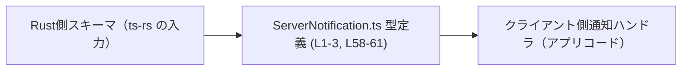
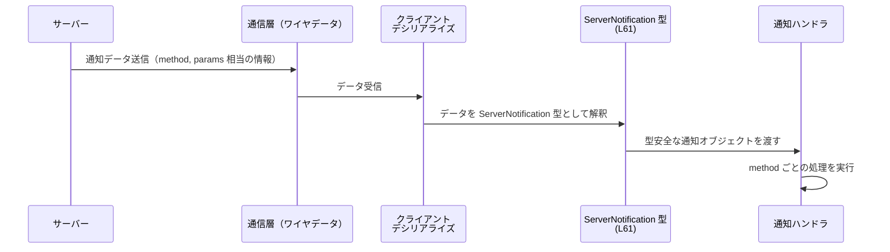

# app-server-protocol\schema\typescript\ServerNotification.ts

## 0. ざっくり一言

サーバーからクライアントへ送られる「通知メッセージ」を、1 つの型 `ServerNotification` の判別共用体（discriminated union）としてまとめた TypeScript の型定義ファイルです（`ServerNotification.ts:L58-61`）。

---

## 1. このモジュールの役割

### 1.1 概要

- このモジュールは、**サーバーからクライアントに送られるあらゆる通知の一覧とその型** を提供します（`ServerNotification.ts:L58-61`）。
- `method` 文字列と `params` のペイロード型を 1 対 1 で結びつけた判別共用体により、クライアント側で通知を型安全に扱うことを目的としています。
- ファイル先頭のコメントから、この型定義は Rust 側の型から `ts-rs` によって **自動生成されたコード** であることが分かります（`ServerNotification.ts:L1-3`）。

### 1.2 アーキテクチャ内での位置づけ

このモジュールは、「Rust 側のスキーマ」と「TypeScript クライアントコード」の間の橋渡しとして機能します。



- Rust 側のスキーマから `ts-rs` によって `ServerNotification` 型が生成されます（`ServerNotification.ts:L1-3`）。
- クライアント側では、この `ServerNotification` 型に基づいて通知ハンドラを実装することで、通知ペイロードに対する型安全が得られます（`ServerNotification.ts:L61-61`）。

### 1.3 設計上のポイント

- **判別共用体設計**  
  - すべての通知が  
    `{"method": <文字列リテラル>, "params": <対応する型>}`  
    という形の union として表現されています（`ServerNotification.ts:L61-61`）。
  - `method` が判別キー（discriminant）として機能します。
- **単一の公開エントリポイント**  
  - このファイルで **公開されているのは `ServerNotification` 型のみ** です（`ServerNotification.ts:L61-61`）。
  - そのため、「サーバー通知」を受け取る API は基本的にこの型 1 つを入口にすればよい構造になっています。
- **依存型の集約**  
  - 個々の通知ペイロード型（`ErrorNotification` など）は、別ファイルで定義され、本ファイルでは `import type` で参照するだけです（`ServerNotification.ts:L4-56`）。
- **コード生成前提**  
  - `// GENERATED CODE! DO NOT MODIFY BY HAND!` および `ts-rs` のコメントにより、**手動編集しない前提** で設計されています（`ServerNotification.ts:L1-3`）。
- **実行時ロジックなし**  
  - 関数やクラスは一切なく、型定義のみで構成されているため、実行時のエラーや並行性に関わる処理は含まれていません（`ServerNotification.ts:L4-61`）。

---

## 2. 主要な機能一覧

このモジュールが提供する機能は「型レベル」のものです。

- サーバー通知の統一表現: すべての通知を `ServerNotification` という 1 つの union 型で表現する（`ServerNotification.ts:L61-61`）。
- `method` と `params` の対応付け: 各通知の `method` 文字列と、そのペイロード型の対応を型レベルで保証する（`ServerNotification.ts:L61-61`）。
- 型安全な分岐処理の支援: `notification.method` による分岐で、`params` の型が自動的に絞り込まれるようにする（判別共用体の性質に基づく）。

---

## 3. 公開 API と詳細解説

### 3.1 型一覧（構造体・列挙体など）

#### このファイルで定義・公開される型

| 名前               | 種別              | 役割 / 用途                                                                 | 根拠 |
|--------------------|-------------------|-----------------------------------------------------------------------------|------|
| `ServerNotification` | 型エイリアス（判別共用体） | サーバーからクライアントに送られるすべての通知を表すトップレベルの union 型 | `ServerNotification.ts:L58-61` |

#### このファイルが参照する外部型（import type）

> いずれも「〜Notification」という名前の型であり、本ファイルでは **ペイロード型として参照するだけ** です。中身の構造はこのチャンクからは分かりません。

| 名前                                             | 種別           | 役割 / 用途（このチャンクから分かる範囲）                                          | 根拠 |
|--------------------------------------------------|----------------|-----------------------------------------------------------------------------------|------|
| `FuzzyFileSearchSessionCompletedNotification`    | 型（詳細不明） | `"fuzzyFileSearch/sessionCompleted"` 通知の `params` 型                             | `ServerNotification.ts:L4, L61` |
| `FuzzyFileSearchSessionUpdatedNotification`      | 型（詳細不明） | `"fuzzyFileSearch/sessionUpdated"` 通知の `params` 型                               | `ServerNotification.ts:L5, L61` |
| `AccountLoginCompletedNotification`              | 型（詳細不明） | `"account/login/completed"` 通知の `params` 型                                     | `ServerNotification.ts:L6, L61` |
| `AccountRateLimitsUpdatedNotification`           | 型（詳細不明） | `"account/rateLimits/updated"` 通知の `params` 型                                  | `ServerNotification.ts:L7, L61` |
| `AccountUpdatedNotification`                     | 型（詳細不明） | `"account/updated"` 通知の `params` 型                                            | `ServerNotification.ts:L8, L61` |
| `AgentMessageDeltaNotification`                  | 型（詳細不明） | `"item/agentMessage/delta"` 通知の `params` 型                                     | `ServerNotification.ts:L9, L61` |
| `AppListUpdatedNotification`                     | 型（詳細不明） | `"app/list/updated"` 通知の `params` 型                                           | `ServerNotification.ts:L10, L61` |
| `CommandExecOutputDeltaNotification`             | 型（詳細不明） | `"command/exec/outputDelta"` 通知の `params` 型                                    | `ServerNotification.ts:L11, L61` |
| `CommandExecutionOutputDeltaNotification`        | 型（詳細不明） | `"item/commandExecution/outputDelta"` 通知の `params` 型                           | `ServerNotification.ts:L12, L61` |
| `ConfigWarningNotification`                      | 型（詳細不明） | `"configWarning"` 通知の `params` 型                                              | `ServerNotification.ts:L13, L61` |
| `ContextCompactedNotification`                   | 型（詳細不明） | `"thread/compacted"` 通知の `params` 型                                           | `ServerNotification.ts:L14, L61` |
| `DeprecationNoticeNotification`                  | 型（詳細不明） | `"deprecationNotice"` 通知の `params` 型                                          | `ServerNotification.ts:L15, L61` |
| `ErrorNotification`                              | 型（詳細不明） | `"error"` 通知の `params` 型                                                       | `ServerNotification.ts:L16, L61` |
| `FileChangeOutputDeltaNotification`              | 型（詳細不明） | `"item/fileChange/outputDelta"` 通知の `params` 型                                 | `ServerNotification.ts:L17, L61` |
| `FsChangedNotification`                          | 型（詳細不明） | `"fs/changed"` 通知の `params` 型                                                 | `ServerNotification.ts:L18, L61` |
| `HookCompletedNotification`                      | 型（詳細不明） | `"hook/completed"` 通知の `params` 型                                             | `ServerNotification.ts:L19, L61` |
| `HookStartedNotification`                        | 型（詳細不明） | `"hook/started"` 通知の `params` 型                                               | `ServerNotification.ts:L20, L61` |
| `ItemCompletedNotification`                      | 型（詳細不明） | `"item/completed"` 通知の `params` 型                                             | `ServerNotification.ts:L21, L61` |
| `ItemGuardianApprovalReviewCompletedNotification`| 型（詳細不明） | `"item/autoApprovalReview/completed"` 通知の `params` 型                           | `ServerNotification.ts:L22, L61` |
| `ItemGuardianApprovalReviewStartedNotification`  | 型（詳細不明） | `"item/autoApprovalReview/started"` 通知の `params` 型                             | `ServerNotification.ts:L23, L61` |
| `ItemStartedNotification`                        | 型（詳細不明） | `"item/started"` 通知の `params` 型                                               | `ServerNotification.ts:L24, L61` |
| `McpServerOauthLoginCompletedNotification`       | 型（詳細不明） | `"mcpServer/oauthLogin/completed"` 通知の `params` 型                              | `ServerNotification.ts:L25, L61` |
| `McpServerStatusUpdatedNotification`             | 型（詳細不明） | `"mcpServer/startupStatus/updated"` 通知の `params` 型                             | `ServerNotification.ts:L26, L61` |
| `McpToolCallProgressNotification`                | 型（詳細不明） | `"item/mcpToolCall/progress"` 通知の `params` 型                                   | `ServerNotification.ts:L27, L61` |
| `ModelReroutedNotification`                      | 型（詳細不明） | `"model/rerouted"` 通知の `params` 型                                             | `ServerNotification.ts:L28, L61` |
| `PlanDeltaNotification`                          | 型（詳細不明） | `"item/plan/delta"` 通知の `params` 型                                            | `ServerNotification.ts:L29, L61` |
| `RawResponseItemCompletedNotification`           | 型（詳細不明） | `"rawResponseItem/completed"` 通知の `params` 型                                   | `ServerNotification.ts:L30, L61` |
| `ReasoningSummaryPartAddedNotification`          | 型（詳細不明） | `"item/reasoning/summaryPartAdded"` 通知の `params` 型                             | `ServerNotification.ts:L31, L61` |
| `ReasoningSummaryTextDeltaNotification`          | 型（詳細不明） | `"item/reasoning/summaryTextDelta"` 通知の `params` 型                             | `ServerNotification.ts:L32, L61` |
| `ReasoningTextDeltaNotification`                 | 型（詳細不明） | `"item/reasoning/textDelta"` 通知の `params` 型                                    | `ServerNotification.ts:L33, L61` |
| `ServerRequestResolvedNotification`              | 型（詳細不明） | `"serverRequest/resolved"` 通知の `params` 型                                      | `ServerNotification.ts:L34, L61` |
| `SkillsChangedNotification`                      | 型（詳細不明） | `"skills/changed"` 通知の `params` 型                                             | `ServerNotification.ts:L35, L61` |
| `TerminalInteractionNotification`                | 型（詳細不明） | `"item/commandExecution/terminalInteraction"` 通知の `params` 型                  | `ServerNotification.ts:L36, L61` |
| `ThreadArchivedNotification`                     | 型（詳細不明） | `"thread/archived"` 通知の `params` 型                                            | `ServerNotification.ts:L37, L61` |
| `ThreadClosedNotification`                       | 型（詳細不明） | `"thread/closed"` 通知の `params` 型                                              | `ServerNotification.ts:L38, L61` |
| `ThreadNameUpdatedNotification`                  | 型（詳細不明） | `"thread/name/updated"` 通知の `params` 型                                        | `ServerNotification.ts:L39, L61` |
| `ThreadRealtimeClosedNotification`               | 型（詳細不明） | `"thread/realtime/closed"` 通知の `params` 型                                     | `ServerNotification.ts:L40, L61` |
| `ThreadRealtimeErrorNotification`                | 型（詳細不明） | `"thread/realtime/error"` 通知の `params` 型                                      | `ServerNotification.ts:L41, L61` |
| `ThreadRealtimeItemAddedNotification`            | 型（詳細不明） | `"thread/realtime/itemAdded"` 通知の `params` 型                                  | `ServerNotification.ts:L42, L61` |
| `ThreadRealtimeOutputAudioDeltaNotification`     | 型（詳細不明） | `"thread/realtime/outputAudio/delta"` 通知の `params` 型                           | `ServerNotification.ts:L43, L61` |
| `ThreadRealtimeSdpNotification`                  | 型（詳細不明） | `"thread/realtime/sdp"` 通知の `params` 型                                        | `ServerNotification.ts:L44, L61` |
| `ThreadRealtimeStartedNotification`              | 型（詳細不明） | `"thread/realtime/started"` 通知の `params` 型                                    | `ServerNotification.ts:L45, L61` |
| `ThreadRealtimeTranscriptUpdatedNotification`    | 型（詳細不明） | `"thread/realtime/transcriptUpdated"` 通知の `params` 型                           | `ServerNotification.ts:L46, L61` |
| `ThreadStartedNotification`                      | 型（詳細不明） | `"thread/started"` 通知の `params` 型                                             | `ServerNotification.ts:L47, L61` |
| `ThreadStatusChangedNotification`                | 型（詳細不明） | `"thread/status/changed"` 通知の `params` 型                                      | `ServerNotification.ts:L48, L61` |
| `ThreadTokenUsageUpdatedNotification`            | 型（詳細不明） | `"thread/tokenUsage/updated"` 通知の `params` 型                                  | `ServerNotification.ts:L49, L61` |
| `ThreadUnarchivedNotification`                   | 型（詳細不明） | `"thread/unarchived"` 通知の `params` 型                                          | `ServerNotification.ts:L50, L61` |
| `TurnCompletedNotification`                      | 型（詳細不明） | `"turn/completed"` 通知の `params` 型                                             | `ServerNotification.ts:L51, L61` |
| `TurnDiffUpdatedNotification`                    | 型（詳細不明） | `"turn/diff/updated"` 通知の `params` 型                                          | `ServerNotification.ts:L52, L61` |
| `TurnPlanUpdatedNotification`                    | 型（詳細不明） | `"turn/plan/updated"` 通知の `params` 型                                          | `ServerNotification.ts:L53, L61` |
| `TurnStartedNotification`                        | 型（詳細不明） | `"turn/started"` 通知の `params` 型                                               | `ServerNotification.ts:L54, L61` |
| `WindowsSandboxSetupCompletedNotification`       | 型（詳細不明） | `"windowsSandbox/setupCompleted"` 通知の `params` 型                               | `ServerNotification.ts:L55, L61` |
| `WindowsWorldWritableWarningNotification`        | 型（詳細不明） | `"windows/worldWritableWarning"` 通知の `params` 型                                | `ServerNotification.ts:L56, L61` |

※ 実際のフィールド構造やバリデーションは、各型定義ファイル側を確認する必要があります。このチャンクからは分かりません。

### 3.2 関数詳細（最大 7 件）

このファイルには **関数定義は存在しません**（`ServerNotification.ts:L4-61`）。  
代わりに、公開 API の中心である型 `ServerNotification` について、関数詳細テンプレートに準じた形で解説します。

#### `ServerNotification`

**概要**

- サーバーからクライアントに送信される全通知を表現する判別共用体型です（`ServerNotification.ts:L58-61`）。
- すべてのバリアントは次の形を取ります：
  - `{"method": "<固定の文字列リテラル>", "params": <対応する Notification 型>}`（`ServerNotification.ts:L61-61`）。

**フィールド**

| フィールド名 | 型                               | 説明 |
|-------------|----------------------------------|------|
| `method`    | 各バリアントで異なる文字列リテラル型 | 通知の種類を表す識別子。`"thread/started"` など固定の文字列です（`ServerNotification.ts:L61-61`）。 |
| `params`    | 対応する `*Notification` 型       | 通知に固有のペイロード。import された型に対応します（`ServerNotification.ts:L4-56, L61`）。 |

**内部構造（判別共用体の形）**

- 型レベルでは、次のような union になっています（抜粋）:

  ```ts
  // 実際の定義の一部を概念的に書き直したもの
  export type ServerNotification =
      | { method: "error"; params: ErrorNotification }
      | { method: "thread/started"; params: ThreadStartedNotification }
      | { method: "thread/status/changed"; params: ThreadStatusChangedNotification }
      // ... 他多数 ...
      | { method: "account/login/completed"; params: AccountLoginCompletedNotification };
  // （根拠: 実際の union は 1 行に連結されています: ServerNotification.ts:L61）
  ```

- TypeScript の判別共用体の性質により、
  - `notification.method` で分岐すると、その分岐の中では `notification.params` の型が対応する `*Notification` 型に自動的に絞り込まれます。

**Examples（使用例）**

1. `method` を使った型安全な分岐の例

```typescript
// サーバーからの通知を受け取り、ログに出力する関数の例
function logNotification(notification: ServerNotification) {      // ServerNotification を受け取る
    switch (notification.method) {                                // method で分岐（判別共用体のキー）
        case "error":                                             // "error" 通知の場合
            // ここでは notification.params は ErrorNotification 型に絞り込まれる
            console.error("Server error:", notification.params);  // エラー内容をログに出力
            break;
        case "thread/started":                                    // "thread/started" 通知の場合
            // ここでは notification.params は ThreadStartedNotification 型
            console.log("Thread started:", notification.params);  // スレッド開始情報を出力
            break;
        // 他の case を必要に応じて追加
        default:                                                  // 将来のバリアント追加に備えて default を残す
            // ここに来るのは、型定義に含まれない method を手動でキャストした場合など
            console.warn("Unknown notification:", notification);  // 未知の通知を警告ログに出力
    }
}
```

1. 特定の通知だけを扱うヘルパーの例

```typescript
// error 通知だけを扱うヘルパーの例
function isErrorNotification(
    notification: ServerNotification,                             // 任意の通知
): notification is Extract<ServerNotification, { method: "error" }> {
    return notification.method === "error";                       // method で判定
}

// 利用例
function handleIfError(notification: ServerNotification) {        // 通知を受け取る
    if (isErrorNotification(notification)) {                      // error 通知かどうか判定
        // ここでは notification.params は ErrorNotification 型
        console.error("Error:", notification.params);            // エラーとして処理
    }
}
```

**Errors / Panics**

- このファイルは **型定義のみ** であり、実行時コードを含まないため、ここで直接エラーや例外が発生することはありません。
- 型安全性に関するポイント:
  - `notification.method` で分岐するコードを書かない場合、特定のバリアントを処理し忘れてもコンパイルエラーにはなりません（ロジック側の問題）。
  - ただし `switch (notification.method)` で全バリアントを列挙し、`default` を `never` で扱うようなパターンを取れば、**新しい method 追加時にコンパイルエラーで気付ける** 設計が可能です（ロジック側の実装による）。

**Edge cases（エッジケース）**

- **未知の method を含む生データ**  
  - ネットワークから受信した生のオブジェクトが `ServerNotification` 型に合致しない（未知の `method` や `params` の形違い）場合、本来は `ServerNotification` 型とはみなせません。
  - しかし、`as ServerNotification` のように **無理な型アサーションを行うとコンパイラはそれを受け入れてしまう** ため、実行時にロジックが前提とするフィールドが存在しないといった問題が起こり得ます。
- **部分的なハンドリング**  
  - すべての `method` をハンドリングしていないコードはコンパイル上は問題ありませんが、**新しい通知が追加されても無視される** という論理的なエッジケースになります。

**使用上の注意点**

- 型安全性:
  - 可能な限り **`as ServerNotification` のような型アサーションを避ける** ことが推奨されます。  
    代わりに、受信した生データに対して runtime のバリデーションを行い、条件を満たすものだけを `ServerNotification` として扱う設計が安全です。
- 将来の拡張:
  - この型はコード生成されるため、Rust 側スキーマに新しい通知が追加されると `ServerNotification` にもバリアントが増える可能性があります（`ServerNotification.ts:L1-3, L61`）。
  - `switch` 文などで `method` ごとの処理を書いている場合、**新規バリアントのハンドリング漏れ** に注意が必要です。
- 並行性:
  - このファイルは型定義のみであり、Promise やコールバックなどの非同期・並行処理は含まれていません。並行性に関する問題は通知を処理する側のコードで発生します。

### 3.3 その他の関数

- このファイルには補助関数やラッパー関数は定義されていません（`ServerNotification.ts:L4-61`）。

---

## 4. データフロー

この型を用いた一般的な処理フローのイメージです。  
実際の通信・デシリアライズ処理はこのチャンクには含まれていないため、ここでは概念図として示します。



- **ServerNotification 型 (L61)** は、「デシリアライズされた通知データ」と「アプリケーションの通知ハンドラ」の間で使われる型として機能します。
- 実行時のバリデーションやログ出力、エラーハンドリングは、この図の `C` や `H` に相当する別コンポーネントで実装される想定です（このチャンクには現れません）。

---

## 5. 使い方（How to Use）

### 5.1 基本的な使用方法

`ServerNotification` を受け取り、`method` に応じて処理を分岐するのが基本パターンです。

```typescript
// サーバー通知を処理するメインハンドラの例
function handleServerNotification(notification: ServerNotification) { // すべての通知を一手に受ける
    switch (notification.method) {                                     // method による分岐
        case "error":                                                  // エラー通知
            console.error("Error:", notification.params);              // ErrorNotification 型として扱う
            break;
        case "thread/started":                                         // スレッド開始通知
            console.log("Thread started:", notification.params);       // ThreadStartedNotification 型
            break;
        case "thread/closed":                                          // スレッド終了通知
            console.log("Thread closed:", notification.params);        // ThreadClosedNotification 型
            break;
        // ... 必要な method を追加 ...
        default:                                                       // 想定外の method
            console.warn("Unhandled notification:", notification);     // ハンドリングしていない通知を警告
    }
}
```

### 5.2 よくある使用パターン

1. **通知種別ごとのサブハンドラ分割**

```typescript
// thread 関連通知だけを処理するヘルパーの例
function handleThreadNotification(notification: ServerNotification) {   // 任意の通知を受ける
    switch (notification.method) {                                      // method で分岐
        case "thread/started":
        case "thread/archived":
        case "thread/unarchived":
        case "thread/closed":
        case "thread/status/changed":
        case "thread/name/updated":
        case "thread/tokenUsage/updated":
        case "thread/compacted":
            // ここでは各 case で params の型がそれぞれの Notification 型に絞られる
            console.log("Thread-related:", notification.method);       // 共通的な処理
            break;
        default:
            // thread 関連以外はここでは処理しない
            break;
    }
}
```

1. **型ガードで特定の通知だけを抽出**

```typescript
// Windows 関連警告だけを扱う型ガード
function isWindowsWarning(
    n: ServerNotification,                                              // 任意の通知
): n is Extract<ServerNotification, { method: "windows/worldWritableWarning" }> {
    return n.method === "windows/worldWritableWarning";                 // method が一致するかを確認
}
```

### 5.3 よくある間違い

```typescript
// 間違い例: 生の any オブジェクトを無条件にキャストしてしまう
function handleRaw(obj: any) {
    const notification = obj as ServerNotification;      // コンパイルは通るが、実際の構造は検証していない
    // ここで notification.method や notification.params を前提に処理すると、
    // 実際にそのフィールドが存在しない場合に実行時エラーの原因になる
}

// 正しい方向性の例: バリデーションを挟んでから扱う（概念例）
function isServerNotification(obj: unknown): obj is ServerNotification {
    // 実装例はこのチャンクにはないが、method が文字列かどうか、
    // params の構造が妥当かどうかをチェックすることで安全性を高められる
    return typeof (obj as any)?.method === "string";      // ここでは簡略化した例
}
```

### 5.4 使用上の注意点（まとめ）

- **型アサーションの乱用に注意**  
  - `as ServerNotification` を頻繁に使うと、TypeScript の型安全性を失い、実行時エラーにつながりやすくなります。
- **新規バリアント追加への備え**  
  - コード生成元（Rust スキーマ）が変わると `ServerNotification` に新しい `method` が追加され得ます（`ServerNotification.ts:L1-3, L61`）。  
    `switch` 文などでは、`default` 分岐で警告ログを出すなど、新規追加に気付きやすい設計が有用です。
- **セキュリティ観点**  
  - ネットワークなど外部からの入力を直接 `ServerNotification` とみなすと、想定外のデータによってロジックが壊れる可能性があります。  
    この型は **コンパイル時の型定義** であり、実行時検証を行わないため、別途入力検証が必要です。
- **パフォーマンス**  
  - `ServerNotification` は型定義のみで、JavaScript にコンパイルされた際には実体が消えるため、**実行時の性能への影響はありません**（TypeScript の一般的な性質）。

---

## 6. 変更の仕方（How to Modify）

### 6.1 新しい機能を追加する場合

- ファイル先頭に `// GENERATED CODE! DO NOT MODIFY BY HAND!` とある通り、**このファイル自体を手で編集することは想定されていません**（`ServerNotification.ts:L1-3`）。
- 新しい通知種別を追加したい場合の一般的な流れは次のようになります（ts-rs 利用前提の推定であり、このチャンクから直接は分かりません）:
  1. Rust 側のスキーマに新しい通知型（例: `NewNotification`）を追加する。
  2. `ts-rs` のコード生成を再実行し、`ServerNotification.ts` を再生成する。
  3. 生成された `ServerNotification` union に新しい `method` バリアントが含まれるようになる（`ServerNotification.ts:L61` に追加）。
  4. クライアント側で `method` の分岐に新しい case を追加する。

### 6.2 既存の機能を変更する場合

- **直接編集非推奨**  
  - コメントで手動編集禁止と明示されているため（`ServerNotification.ts:L1-3`）、`ServerNotification` の union を直接書き換えると、次回のコード生成で上書きされます。
- **影響範囲の確認ポイント**
  - `ServerNotification` を引数に取る関数や、`notification.method` による分岐箇所が影響を受けます。
  - method 名の変更や削除は、**コンパイルエラーとして現れないケース** もあります（文字列を別の場所で直接比較している場合など）。
- **契約（前提条件）**
  - `method` の文字列リテラルと `params` の型は 1 対 1 で対応している、という前提でクライアントコードが書かれていると考えられます。  
    これを崩す変更（同じ method で params が別の型になるなど）は、ロジック側の修正も必須になります。
- **テスト**
  - このファイルにはテストは含まれていませんが、通知のハンドリングロジックに対するテストで、  
    「特定の `method` を受け取ったときの挙動」がカバーされているかを確認する必要があります。

---

## 7. 関連ファイル

このモジュールと密接に関係するのは、すべての `*Notification` 型を定義しているファイルです。  
それぞれが `ServerNotification` のバリアントの `params` 型として利用されています（`ServerNotification.ts:L4-56, L61`）。

| パス                                                         | 役割 / 関係 |
|--------------------------------------------------------------|------------|
| `app-server-protocol/schema/typescript/FuzzyFileSearchSessionCompletedNotification.ts` | `"fuzzyFileSearch/sessionCompleted"` 通知のペイロード型を定義（このチャンクから中身は不明） |
| `app-server-protocol/schema/typescript/FuzzyFileSearchSessionUpdatedNotification.ts`   | `"fuzzyFileSearch/sessionUpdated"` 通知のペイロード型 |
| `app-server-protocol/schema/typescript/v2/AccountLoginCompletedNotification.ts`       | `"account/login/completed"` 通知のペイロード型 |
| `app-server-protocol/schema/typescript/v2/AccountRateLimitsUpdatedNotification.ts`    | `"account/rateLimits/updated"` 通知のペイロード型 |
| `app-server-protocol/schema/typescript/v2/AccountUpdatedNotification.ts`              | `"account/updated"` 通知のペイロード型 |
| `app-server-protocol/schema/typescript/v2/AgentMessageDeltaNotification.ts`           | `"item/agentMessage/delta"` 通知のペイロード型 |
| `app-server-protocol/schema/typescript/v2/AppListUpdatedNotification.ts`              | `"app/list/updated"` 通知のペイロード型 |
| `app-server-protocol/schema/typescript/v2/CommandExecOutputDeltaNotification.ts`      | `"command/exec/outputDelta"` 通知のペイロード型 |
| `app-server-protocol/schema/typescript/v2/CommandExecutionOutputDeltaNotification.ts` | `"item/commandExecution/outputDelta"` 通知のペイロード型 |
| `app-server-protocol/schema/typescript/v2/ConfigWarningNotification.ts`               | `"configWarning"` 通知のペイロード型 |
| `app-server-protocol/schema/typescript/v2/ContextCompactedNotification.ts`            | `"thread/compacted"` 通知のペイロード型 |
| `app-server-protocol/schema/typescript/v2/DeprecationNoticeNotification.ts`           | `"deprecationNotice"` 通知のペイロード型 |
| `app-server-protocol/schema/typescript/v2/ErrorNotification.ts`                       | `"error"` 通知のペイロード型 |
| `app-server-protocol/schema/typescript/v2/FileChangeOutputDeltaNotification.ts`       | `"item/fileChange/outputDelta"` 通知のペイロード型 |
| `app-server-protocol/schema/typescript/v2/FsChangedNotification.ts`                   | `"fs/changed"` 通知のペイロード型 |
| `app-server-protocol/schema/typescript/v2/HookCompletedNotification.ts`               | `"hook/completed"` 通知のペイロード型 |
| `app-server-protocol/schema/typescript/v2/HookStartedNotification.ts`                 | `"hook/started"` 通知のペイロード型 |
| `app-server-protocol/schema/typescript/v2/ItemCompletedNotification.ts`               | `"item/completed"` 通知のペイロード型 |
| `app-server-protocol/schema/typescript/v2/ItemGuardianApprovalReviewCompletedNotification.ts` | `"item/autoApprovalReview/completed"` 通知のペイロード型 |
| `app-server-protocol/schema/typescript/v2/ItemGuardianApprovalReviewStartedNotification.ts`   | `"item/autoApprovalReview/started"` 通知のペイロード型 |
| `app-server-protocol/schema/typescript/v2/ItemStartedNotification.ts`                 | `"item/started"` 通知のペイロード型 |
| `app-server-protocol/schema/typescript/v2/McpServerOauthLoginCompletedNotification.ts`| `"mcpServer/oauthLogin/completed"` 通知のペイロード型 |
| `app-server-protocol/schema/typescript/v2/McpServerStatusUpdatedNotification.ts`      | `"mcpServer/startupStatus/updated"` 通知のペイロード型 |
| `app-server-protocol/schema/typescript/v2/McpToolCallProgressNotification.ts`         | `"item/mcpToolCall/progress"` 通知のペイロード型 |
| `app-server-protocol/schema/typescript/v2/ModelReroutedNotification.ts`               | `"model/rerouted"` 通知のペイロード型 |
| `app-server-protocol/schema/typescript/v2/PlanDeltaNotification.ts`                   | `"item/plan/delta"` 通知のペイロード型 |
| `app-server-protocol/schema/typescript/v2/RawResponseItemCompletedNotification.ts`    | `"rawResponseItem/completed"` 通知のペイロード型 |
| `app-server-protocol/schema/typescript/v2/ReasoningSummaryPartAddedNotification.ts`   | `"item/reasoning/summaryPartAdded"` 通知のペイロード型 |
| `app-server-protocol/schema/typescript/v2/ReasoningSummaryTextDeltaNotification.ts`   | `"item/reasoning/summaryTextDelta"` 通知のペイロード型 |
| `app-server-protocol/schema/typescript/v2/ReasoningTextDeltaNotification.ts`          | `"item/reasoning/textDelta"` 通知のペイロード型 |
| `app-server-protocol/schema/typescript/v2/ServerRequestResolvedNotification.ts`       | `"serverRequest/resolved"` 通知のペイロード型 |
| `app-server-protocol/schema/typescript/v2/SkillsChangedNotification.ts`               | `"skills/changed"` 通知のペイロード型 |
| `app-server-protocol/schema/typescript/v2/TerminalInteractionNotification.ts`         | `"item/commandExecution/terminalInteraction"` 通知のペイロード型 |
| `app-server-protocol/schema/typescript/v2/ThreadArchivedNotification.ts`              | `"thread/archived"` 通知のペイロード型 |
| `app-server-protocol/schema/typescript/v2/ThreadClosedNotification.ts`                | `"thread/closed"` 通知のペイロード型 |
| `app-server-protocol/schema/typescript/v2/ThreadNameUpdatedNotification.ts`           | `"thread/name/updated"` 通知のペイロード型 |
| `app-server-protocol/schema/typescript/v2/ThreadRealtimeClosedNotification.ts`        | `"thread/realtime/closed"` 通知のペイロード型 |
| `app-server-protocol/schema/typescript/v2/ThreadRealtimeErrorNotification.ts`         | `"thread/realtime/error"` 通知のペイロード型 |
| `app-server-protocol/schema/typescript/v2/ThreadRealtimeItemAddedNotification.ts`     | `"thread/realtime/itemAdded"` 通知のペイロード型 |
| `app-server-protocol/schema/typescript/v2/ThreadRealtimeOutputAudioDeltaNotification.ts` | `"thread/realtime/outputAudio/delta"` 通知のペイロード型 |
| `app-server-protocol/schema/typescript/v2/ThreadRealtimeSdpNotification.ts`           | `"thread/realtime/sdp"` 通知のペイロード型 |
| `app-server-protocol/schema/typescript/v2/ThreadRealtimeStartedNotification.ts`       | `"thread/realtime/started"` 通知のペイロード型 |
| `app-server-protocol/schema/typescript/v2/ThreadRealtimeTranscriptUpdatedNotification.ts` | `"thread/realtime/transcriptUpdated"` 通知のペイロード型 |
| `app-server-protocol/schema/typescript/v2/ThreadStartedNotification.ts`               | `"thread/started"` 通知のペイロード型 |
| `app-server-protocol/schema/typescript/v2/ThreadStatusChangedNotification.ts`         | `"thread/status/changed"` 通知のペイロード型 |
| `app-server-protocol/schema/typescript/v2/ThreadTokenUsageUpdatedNotification.ts`     | `"thread/tokenUsage/updated"` 通知のペイロード型 |
| `app-server-protocol/schema/typescript/v2/ThreadUnarchivedNotification.ts`            | `"thread/unarchived"` 通知のペイロード型 |
| `app-server-protocol/schema/typescript/v2/TurnCompletedNotification.ts`               | `"turn/completed"` 通知のペイロード型 |
| `app-server-protocol/schema/typescript/v2/TurnDiffUpdatedNotification.ts`             | `"turn/diff/updated"` 通知のペイロード型 |
| `app-server-protocol/schema/typescript/v2/TurnPlanUpdatedNotification.ts`             | `"turn/plan/updated"` 通知のペイロード型 |
| `app-server-protocol/schema/typescript/v2/TurnStartedNotification.ts`                 | `"turn/started"` 通知のペイロード型 |
| `app-server-protocol/schema/typescript/v2/WindowsSandboxSetupCompletedNotification.ts`| `"windowsSandbox/setupCompleted"` 通知のペイロード型 |
| `app-server-protocol/schema/typescript/v2/WindowsWorldWritableWarningNotification.ts` | `"windows/worldWritableWarning"` 通知のペイロード型 |

これらのファイルの具体的な中身（フィールド構造、バリデーション方針など）は、このチャンクには含まれていません。
