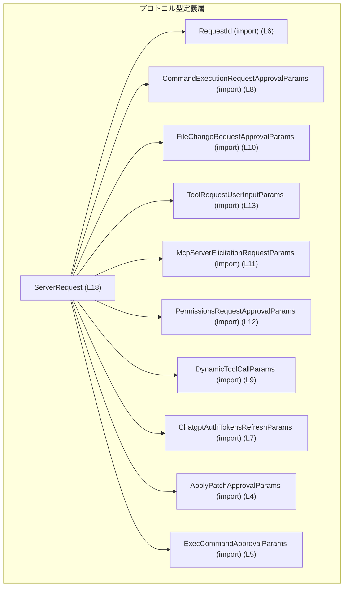
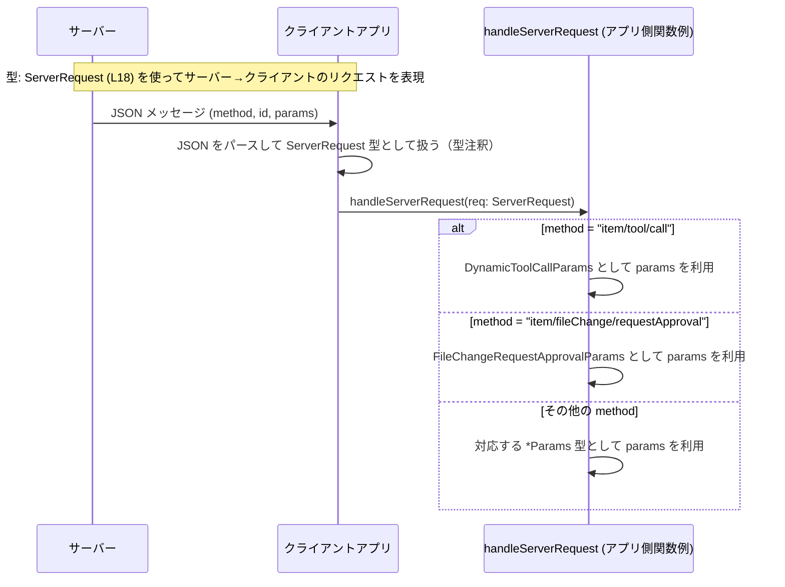

# app-server-protocol/schema/typescript/ServerRequest.ts コード解説

---

## 0. ざっくり一言

`ServerRequest` は、**サーバーからクライアントに送られるすべての「リクエスト」メッセージの型を表す判別付きユニオン型**です（根拠: `ServerRequest.ts:L15-18`）。  
`method` 文字列と `params` 型の組み合わせで、複数種類のリクエストを一元的に表現します（根拠: `ServerRequest.ts:L18-18`）。

---

## 1. このモジュールの役割

### 1.1 概要

- このモジュールは、「サーバーが開始しクライアントに送信するリクエスト」の型を定義します（根拠: `ServerRequest.ts:L15-16`）。
- 具体的には、コマンド実行承認、ファイル変更承認、ツール呼び出し、権限要求、トークン更新など複数種類のリクエストを、`ServerRequest` という 1 つのユニオン型で表現しています（根拠: `ServerRequest.ts:L18-18`）。
- ファイルは `ts-rs` によって Rust 側の型定義から自動生成されており、手動で編集すべきでないことが明記されています（根拠: `ServerRequest.ts:L1-3`）。

### 1.2 アーキテクチャ内での位置づけ

このファイルは「プロトコル定義層」に属し、サーバーとクライアント間の通信フォーマット（TypeScript 側の静的型）を表現します。

- `ServerRequest` はプロトコルの **サーバー → クライアント方向** のメッセージを表します（根拠: `ServerRequest.ts:L15-16`）。
- 各リクエストの詳細なパラメータ型は、別ファイルで定義された `*Params` 型に依存しています（根拠: `ServerRequest.ts:L4-13, L18-18`）。
- これらの型は TypeScript の `import type` で参照されており、**コンパイル時の型チェック専用**であることが分かります（根拠: `ServerRequest.ts:L4-13`）。

Mermaid による依存関係図（このファイルの範囲: `ServerRequest.ts:L4-18`）:



### 1.3 設計上のポイント

- **判別付きユニオン型（Discriminated Union）**  
  - すべてのバリアントが `"method"` プロパティを持ち、その値が文字列リテラル型になっているため、TypeScript の制御フロー解析により `switch (req.method)` などで安全に型分岐ができます（根拠: `ServerRequest.ts:L18-18`）。
- **`import type` の利用**  
  - すべての依存は `import type` で読み込まれ、実行時には存在しない純粋な型依存になっています。これはバンドルサイズや実行時依存の削減、安全性向上に寄与します（根拠: `ServerRequest.ts:L4-13`）。
- **自動生成コード**  
  - 「GENERATED CODE! DO NOT MODIFY BY HAND!」と明記されており、このファイル自体は直接変更せず、元になるスキーマ（Rust 側など）を変更する前提になっています（根拠: `ServerRequest.ts:L1-3`）。
- **エラー／安全性／並行性について**  
  - このファイルは **型定義のみ** であり、実行時のエラー処理や並行性制御ロジックは含みません。  
    型レベルでは、`method` と `params` の組み合わせの整合性をコンパイル時に保証しますが、実行時に受信する JSON がこの型に適合するかは、別のバリデーション層に依存します（この点はコードからは定義されていません）。

---

## 2. 主要な機能一覧

このモジュールが提供する「機能」は、すべて **型レベルの表現** です。`ServerRequest` ユニオンの各バリアントを機能として列挙します（根拠: `ServerRequest.ts:L18-18`）。

- コマンド実行承認リクエスト:  
  `"item/commandExecution/requestApproval"` と `CommandExecutionRequestApprovalParams` で表現。
- ファイル変更承認リクエスト:  
  `"item/fileChange/requestApproval"` と `FileChangeRequestApprovalParams` で表現。
- ツールによるユーザー入力要求:  
  `"item/tool/requestUserInput"` と `ToolRequestUserInputParams` で表現。
- MCP サーバーからの情報引き出しリクエスト:  
  `"mcpServer/elicitation/request"` と `McpServerElicitationRequestParams` で表現。
- 権限承認リクエスト:  
  `"item/permissions/requestApproval"` と `PermissionsRequestApprovalParams` で表現。
- 動的ツール呼び出しリクエスト:  
  `"item/tool/call"` と `DynamicToolCallParams` で表現。
- ChatGPT 認証トークン更新リクエスト:  
  `"account/chatgptAuthTokens/refresh"` と `ChatgptAuthTokensRefreshParams` で表現。
- パッチ適用承認リクエスト:  
  `"applyPatchApproval"` と `ApplyPatchApprovalParams` で表現。
- コマンド実行承認リクエスト（別系統）:  
  `"execCommandApproval"` と `ExecCommandApprovalParams` で表現。

---

## 3. 公開 API と詳細解説

### 3.1 型一覧（構造体・列挙体など）

このファイルで **定義または使用** されている主要な型の一覧です。

| 名前 | 種別 | 役割 / 用途 | 定義/使用箇所（根拠） |
|------|------|-------------|------------------------|
| `ServerRequest` | 型エイリアス（判別付きユニオン） | サーバー → クライアントに送信されるすべてのリクエストを表すトップレベル型 | 定義: `ServerRequest.ts:L18-18` |
| `RequestId` | 型（別ファイル定義） | すべてのリクエストに共通の ID。レスポンスとの対応付け・トレーシングなどに用いられると推測されます（型の用途自体はこのチャンクからは不明） | import: `ServerRequest.ts:L6-6` / 使用: `ServerRequest.ts:L18-18` |
| `ApplyPatchApprovalParams` | 型（別ファイル定義） | `"applyPatchApproval"` リクエストのパラメータ。パッチ適用の詳細を表すと推測されます（詳細はこのチャンクにはありません） | import: `ServerRequest.ts:L4-4` / 使用: `ServerRequest.ts:L18-18` |
| `ExecCommandApprovalParams` | 型（別ファイル定義） | `"execCommandApproval"` リクエストのパラメータ | import: `ServerRequest.ts:L5-5` / 使用: `ServerRequest.ts:L18-18` |
| `ChatgptAuthTokensRefreshParams` | 型（別ファイル定義） | `"account/chatgptAuthTokens/refresh"` リクエストのパラメータ | import: `ServerRequest.ts:L7-7` / 使用: `ServerRequest.ts:L18-18` |
| `CommandExecutionRequestApprovalParams` | 型（別ファイル定義） | `"item/commandExecution/requestApproval"` リクエストのパラメータ | import: `ServerRequest.ts:L8-8` / 使用: `ServerRequest.ts:L18-18` |
| `DynamicToolCallParams` | 型（別ファイル定義） | `"item/tool/call"` リクエストのパラメータ | import: `ServerRequest.ts:L9-9` / 使用: `ServerRequest.ts:L18-18` |
| `FileChangeRequestApprovalParams` | 型（別ファイル定義） | `"item/fileChange/requestApproval"` リクエストのパラメータ | import: `ServerRequest.ts:L10-10` / 使用: `ServerRequest.ts:L18-18` |
| `McpServerElicitationRequestParams` | 型（別ファイル定義） | `"mcpServer/elicitation/request"` リクエストのパラメータ | import: `ServerRequest.ts:L11-11` / 使用: `ServerRequest.ts:L18-18` |
| `PermissionsRequestApprovalParams` | 型（別ファイル定義） | `"item/permissions/requestApproval"` リクエストのパラメータ | import: `ServerRequest.ts:L12-12` / 使用: `ServerRequest.ts:L18-18` |
| `ToolRequestUserInputParams` | 型（別ファイル定義） | `"item/tool/requestUserInput"` リクエストのパラメータ | import: `ServerRequest.ts:L13-13` / 使用: `ServerRequest.ts:L18-18` |

> 備考: `*Params` 各型の内部構造・バリデーションルールなどは、このチャンクには含まれておらず不明です。

#### `ServerRequest` の契約（Contracts）とエッジケース（型レベル）

**契約（型レベルで保証されること）**

- `ServerRequest` のすべてのバリアントは次の 3 プロパティを持ちます（根拠: `ServerRequest.ts:L18-18`）。
  - `"method"`: 文字列リテラル型（9 種類のいずれか）。
  - `id`: `RequestId`。
  - `params`: `method` に対応する `*Params` 型。
- `method` と `params` の組み合わせは固定であり、例えば `"item/tool/call"` のとき `params` は必ず `DynamicToolCallParams` です（根拠: `ServerRequest.ts:L18-18`）。

**エッジケース / 型安全性上のポイント**

- TypeScript コード内で `ServerRequest` を扱う限り、`switch (req.method)` などで分岐すると、各分岐内の `req.params` の型は対応する `*Params` に自動的に絞り込まれます。これは **コンパイル時の型安全性** を高めます。
- 一方、実際にネットワーク経由で受信した JSON がこの型に適合するかどうかは、別途ランタイムでの検証（スキーマバリデーションなど）が必要です。このファイル自体にはそうした検証処理は含まれていません。

### 3.2 関数詳細（最大 7 件）

このファイルには **関数やメソッドの定義は一切存在しません**。  
唯一の公開 API は型エイリアス `ServerRequest` です（根拠: `ServerRequest.ts:L18-18`）。

したがって、関数詳細テンプレートの適用対象となる関数はありません。

### 3.3 その他の関数

- 関数は定義されていません（このチャンクには現れません）。

---

## 4. データフロー

このセクションでは、`ServerRequest` がどのようにデータフローの中で利用されるかを、想定される典型的なシナリオに沿って説明します。  
ここで述べるフローは、`ServerRequest` のコメント「Request initiated from the server and sent to the client」に基づくものです（根拠: `ServerRequest.ts:L15-16`）。

### 4.1 代表的なフロー: サーバー → クライアントのリクエスト受信

Mermaid のシーケンス図（`ServerRequest (L18)` を利用）:



要点:

- サーバーはプロトコル仕様に従って JSON を送信し、クライアント側ではそれを `ServerRequest` として扱います。
- クライアント側で `method` に応じて処理を分岐させることで、各 `params` を型安全に扱うことができます（型安全性は TypeScript コンパイラによって保証されます）。

---

## 5. 使い方（How to Use）

### 5.1 基本的な使用方法

ここでは、クライアントアプリケーション側で `ServerRequest` を受け取り、`method` に基づいて分岐処理を行う典型的な例を示します。

```typescript
// ServerRequest 型をインポートする                                  // このファイルで定義された ServerRequest を使用する
import type { ServerRequest } from "./ServerRequest";               // 実際のパスはプロジェクト構成に依存

// サーバーから受信したメッセージを処理する関数の例                  // ServerRequest を引数に取り、method ごとに分岐する
function handleServerRequest(req: ServerRequest) {                  // req は判別付きユニオン型
    switch (req.method) {                                           // method で分岐すると、各ケースで params の型が絞られる
        case "item/commandExecution/requestApproval":               // このブロックでは params は CommandExecutionRequestApprovalParams 型になる
            // req.params は CommandExecutionRequestApprovalParams  // 型安全にフィールドへアクセスできる
            // handleCommandExecutionApproval(req.id, req.params);  // 実際の処理（ここでは擬似コード）
            break;

        case "item/fileChange/requestApproval":                     // ファイル変更承認
            // req.params は FileChangeRequestApprovalParams
            break;

        case "item/tool/requestUserInput":                          // ユーザー入力要求
            // req.params は ToolRequestUserInputParams
            break;

        case "mcpServer/elicitation/request":                       // MCP サーバーからのリクエスト
            // req.params は McpServerElicitationRequestParams
            break;

        case "item/permissions/requestApproval":                    // 権限承認
            // req.params は PermissionsRequestApprovalParams
            break;

        case "item/tool/call":                                      // ツール呼び出し
            // req.params は DynamicToolCallParams
            break;

        case "account/chatgptAuthTokens/refresh":                   // トークン更新
            // req.params は ChatgptAuthTokensRefreshParams
            break;

        case "applyPatchApproval":                                  // パッチ適用承認
            // req.params は ApplyPatchApprovalParams
            break;

        case "execCommandApproval":                                 // コマンド実行承認（別系統）
            // req.params は ExecCommandApprovalParams
            break;

        default:
            // この default に入るのは、型定義外の値が実行時に来た場合のみ   // TypeScript 上は到達不能だが、実ランタイムではあり得る
            // ログ出力やエラー処理を行うと安全
            break;
    }
}
```

この例のポイント:

- `req` の型を `ServerRequest` とすることで、`switch` の各ケースに応じて `params` の型が自動的に決まり、IDE の補完やコンパイラによるチェックが効きます。
- TypeScript の型システムは **コンパイル時のみ** 有効であり、ネットワーク経由の JSON を安全に扱うには、別途ランタイムのバリデーションが必要です。

### 5.2 よくある使用パターン

#### パターン 1: リクエストオブジェクトの構築（サーバー側）

サーバー側コードで `ServerRequest` を構築するイメージ例です。  
※ 実際の `params` の中身はこのチャンクからは分からないため、コメントで擬似的に表現します。

```typescript
import type { ServerRequest } from "./ServerRequest";
import type { RequestId } from "./RequestId";
import type { DynamicToolCallParams } from "./v2/DynamicToolCallParams";

function createToolCallRequest(id: RequestId, params: DynamicToolCallParams): ServerRequest {
    return {
        method: "item/tool/call",   // method は文字列リテラル型。誤字があるとコンパイルエラーになる
        id,                          // RequestId 型
        params,                      // DynamicToolCallParams 型
    };
}
```

#### パターン 2: 実行時型チェックを組み合わせる

TypeScript の型だけではランタイム検証ができないため、`method` の値をチェックしてから安全にキャストするパターンです。

```typescript
import type { ServerRequest } from "./ServerRequest";

function isServerRequest(value: unknown): value is ServerRequest {
    // 非常に単純なチェック例（実際にはもっと厳密な検証が必要）       // ここでは method と id があるかだけを確認
    return typeof value === "object" && value !== null && "method" in value && "id" in value;
}
```

### 5.3 よくある間違い

**誤り例 1: `method` の文字列を誤記する**

```typescript
// 間違い例: method の文字列が定義にない                             // "item/tool/calls" は定義されていない文字列
const badReq: ServerRequest = {
    // @ts-expect-error: Type '"item/tool/calls"' is not assignable
    method: "item/tool/calls",                                         
    id: "req-1" as any,            // ここも実際には RequestId 型である必要がある
    params: {} as any,             // 型安全性が失われている
};
```

**正しい例: 定義済みの文字列リテラルを使用**

```typescript
const goodReq: ServerRequest = {
    method: "item/tool/call",     // ServerRequest.ts:L18-18 で定義されている文字列リテラル
    id: "req-1" as any,           // 実際には RequestId 型
    params: {} as any,            // 実際には DynamicToolCallParams 型
};
```

このように `method` は **誤字や未定義の値を防ぐガード** として機能しますが、`as any` を多用すると型安全性が失われる点に注意が必要です。

### 5.4 使用上の注意点（まとめ）

- **自動生成ファイルを直接編集しない**  
  - ファイル先頭コメントに明示されているとおり、手で書き換えると元スキーマとの不整合を生む可能性があります（根拠: `ServerRequest.ts:L1-3`）。
- **実行時バリデーションの不足**  
  - `ServerRequest` は静的型のみを提供します。実際に受信した JSON がこの型に適合するかの検証は別途実装する必要があります（このファイルにはそのロジックは含まれていません）。
- **すべての `method` をハンドリングすること**  
  - `switch` などで `method` を分岐する際、将来的にユニオンのバリアントが追加された場合に備え、`default` で未知の `method` をログに記録するなどの対策が推奨されます（ここは一般的な使用上の注意であり、コードから直接は読み取れません）。
- **並行性**  
  - このファイルは型定義のみであり、非同期処理や並行性制御ロジックを持ちません。実際の I/O は別の層で管理されます。

---

## 6. 変更の仕方（How to Modify）

### 6.1 新しい機能を追加する場合

このファイルは自動生成されているため、通常は **直接変更せず、元のスキーマ定義（おそらく Rust 側）を変更** する運用になります（根拠: `ServerRequest.ts:L1-3`）。

一般的な手順（推測を含みます。具体的な生成元コードはこのチャンクにはありません）:

1. 元となる型定義（Rust の struct / enum など）に新しいリクエスト種別とパラメータ型を追加する。
2. `ts-rs` のコード生成を再実行する。
3. 生成された `ServerRequest.ts` に、新しい `"method"` と対応する `params` 型が追加されていることを確認する（`export type ServerRequest = ...` のユニオンに現れるはずです）。

### 6.2 既存の機能を変更する場合

- **影響範囲の確認**  
  - いずれかの `*Params` 型のフィールドを変更した場合、それを利用しているすべてのクライアントコードにコンパイルエラーが発生しうるため、使用箇所を IDE の参照検索などで確認する必要があります。
- **契約の維持**  
  - `method` の文字列値はプロトコルの一部であり、サーバーとクライアント双方で一致している必要があります。  
    `ServerRequest.ts` の `"method"` リテラルを変更したい場合も、元スキーマおよびサーバー実装を同時に更新すべきです（根拠: `ServerRequest.ts:L18-18`）。
- **テスト**  
  - このファイルにはテストは含まれていません（テストコードはこのチャンクには現れません）。  
    プロトコル変更時には、別途用意されているエンドツーエンドテストやスキーマ検証テストを更新する必要があります。

---

## 7. 関連ファイル

このモジュールと密接に関係するファイルは、すべて `import type` の対象として現れています（根拠: `ServerRequest.ts:L4-13`）。

| パス | 役割 / 関係 |
|------|------------|
| `./ApplyPatchApprovalParams` | `"applyPatchApproval"` リクエストの `params` 型を定義するファイル（と推測されます）。 |
| `./ExecCommandApprovalParams` | `"execCommandApproval"` リクエストの `params` 型。 |
| `./RequestId` | すべての `ServerRequest` に共通する `id` の型。 |
| `./v2/ChatgptAuthTokensRefreshParams` | `"account/chatgptAuthTokens/refresh"` の `params` 型。 |
| `./v2/CommandExecutionRequestApprovalParams` | `"item/commandExecution/requestApproval"` の `params` 型。 |
| `./v2/DynamicToolCallParams` | `"item/tool/call"` の `params` 型。 |
| `./v2/FileChangeRequestApprovalParams` | `"item/fileChange/requestApproval"` の `params` 型。 |
| `./v2/McpServerElicitationRequestParams` | `"mcpServer/elicitation/request"` の `params` 型。 |
| `./v2/PermissionsRequestApprovalParams` | `"item/permissions/requestApproval"` の `params` 型。 |
| `./v2/ToolRequestUserInputParams` | `"item/tool/requestUserInput"` の `params` 型。 |

> これらのファイルの中身はこのチャンクには含まれていないため、具体的なフィールドや制約はここからは分かりません。「パラメータ型を提供する」という関係のみが言及できます。
