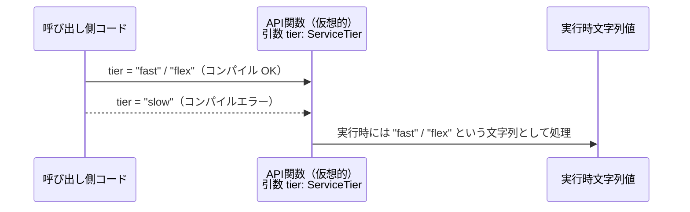

# app-server-protocol/schema/typescript/ServiceTier.ts コード解説

## 0. ざっくり一言

`ServiceTier.ts` は、サービスの種別を `"fast"` または `"flex"` の 2 通りの文字列だけに制約する TypeScript の型エイリアスを自動生成したファイルです（`ServiceTier.ts:L1-1, L3-3, L5-5`）。

---

## 1. このモジュールの役割

### 1.1 概要

- このモジュールは、サービスの「ティア（層・プラン）」を表すための `ServiceTier` 型を提供します（`ServiceTier.ts:L5-5`）。
- `ServiceTier` は `"fast"` と `"flex"` の 2 つの文字列リテラルのみを許可する **ユニオン型** になっており、それ以外の文字列をコンパイル時に弾く役割を持ちます（`ServiceTier.ts:L5-5`）。
- ファイル全体は `ts-rs` によって自動生成されており、手動編集しないことが明示されています（`ServiceTier.ts:L1-1, L3-3`）。

### 1.2 アーキテクチャ内での位置づけ

このチャンクから分かる範囲では、`ServiceTier.ts` は次のような立ち位置になります。

- コード生成ツール `ts-rs` がこのファイルを生成します（コメントより事実として読み取れます）（`ServiceTier.ts:L3-3`）。
- ファイルは `export type ServiceTier = ...` によって型を公開しており、他の TypeScript モジュールからインポートされて使用されることが想定されます（`ServiceTier.ts:L5-5`）。
- 具体的にどのファイルが `ServiceTier` を利用しているかは、このチャンクには現れません。

この関係を簡単な依存関係図として表すと、次のようになります。


### 1.3 設計上のポイント

コードから読み取れる設計上の特徴を列挙します。

- **自動生成コード**  
  - 先頭コメントにより、「手で編集してはいけない」自動生成ファイルであることが明示されています（`ServiceTier.ts:L1-1, L3-3`）。
- **文字列リテラル・ユニオン型**  
  - `ServiceTier` は `"fast" | "flex"` の 2 値だけを許可する **文字列リテラル・ユニオン型** です（`ServiceTier.ts:L5-5`）。  
  - これにより、TypeScript の型チェックで不正な文字列が検出されます。
- **状態やロジックを持たない**  
  - 関数・クラス・変数の定義はなく、型エイリアスのみです（`ServiceTier.ts:L5-5`）。  
  - ランタイム状態やビジネスロジックは一切持たず、純粋にコンパイル時型制約のためのモジュールになっています。
- **エラーハンドリング/並行性要素はなし**  
  - 実行時コードを含まないため、ランタイムエラー処理やスレッド／並行性に関するロジックは存在しません。

---

## 2. 主要な機能一覧

このファイルは 1 つの型エイリアスのみを提供します。

- `ServiceTier` 型定義: サービスの種別を `"fast"` または `"flex"` の 2 つの文字列に制限する型。

---

## 3. 公開 API と詳細解説

### 3.1 型一覧（構造体・列挙体など）

このファイルに含まれる型コンポーネントのインベントリーです。

| 名前         | 種別                                | 役割 / 用途                                                                 | 定義位置                 |
|--------------|-------------------------------------|------------------------------------------------------------------------------|--------------------------|
| `ServiceTier` | 型エイリアス（string リテラル union） | サービスティアを `"fast"` / `"flex"` のいずれかに制約する型として公開する | `ServiceTier.ts:L5-5` |

> 備考: クラス・インターフェース・列挙体・関数など、他のコンポーネントはこのチャンクには現れません。

### 3.2 関数詳細（このファイルには関数はないため、型の詳細を記載）

このファイルには関数定義が存在しないため、代わりに公開 API である `ServiceTier` 型の詳細を、関数テンプレートに準じた形式で説明します。

#### `export type ServiceTier = "fast" | "flex"`

**概要**

- `ServiceTier` は、サービス種別を表す **文字列リテラル・ユニオン型** です（`ServiceTier.ts:L5-5`）。
- 値として許可されるのは `"fast"` または `"flex"` のみで、それ以外の文字列はコンパイル時に型エラーになります（`ServiceTier.ts:L5-5`）。

**「引数」に相当するもの**

型エイリアスであり引数は持たないため、この項目は該当しません。

**戻り値に相当するもの**

- `ServiceTier` は何らかの関数の戻り値や、オブジェクトのプロパティ型、関数引数型として利用されることが想定されますが、このチャンクには利用側のコードは現れません。

**内部処理の流れ（アルゴリズム）**

- 実行時処理を持たない純粋な型定義のため、アルゴリズムは存在しません。
- TypeScript コンパイラが、次のような形で静的チェックを行うことが想定されます（一般論）:
  1. 変数やパラメータに `ServiceTier` 型が付けられる。
  2. 代入される値が `"fast"` または `"flex"` のいずれかであるかをコンパイル時にチェック。
  3. それ以外の文字列を代入しようとすると、コンパイルエラーになる。

**Examples（使用例）**

> ここからのコードは、このリポジトリ内に実在するものではなく、`ServiceTier` の使い方を示す一般的な例です。

```typescript
// ServiceTier 型をインポートする（想定される利用例）
// import type { ServiceTier } from "./ServiceTier";

// サービスプランを受け取って処理する関数の例
function startService(tier: ServiceTier) {             // tier は "fast" または "flex" のみ許可
    if (tier === "fast") {                             // "fast" の場合の分岐
        // 高速プラン向けの処理 …
    } else {                                           // 残りは "flex" のみ
        // 柔軟プラン向けの処理 …
    }
}

// 正しい呼び出し例
startService("fast");                                   // OK: ServiceTier 型に適合
startService("flex");                                   // OK: ServiceTier 型に適合

// 間違った呼び出し例（コンパイルエラーになる想定）
// startService("slow");                                // エラー: Type '"slow"' is not assignable to type 'ServiceTier'
```

**Errors / Panics / 安全性**

- `ServiceTier` 自体は型レベルの概念であり、ランタイムエラーや panic を直接発生させることはありません。
- 型安全性:
  - `ServiceTier` を正しく使用している限り、`"fast"` / `"flex"` 以外の値を **コンパイル時に排除**できます。
  - ただし、TypeScript の `any` 型や、無理な型アサーション（例: `"slow" as any as ServiceTier`）を使うことで、この安全性を容易に破ることも可能です（これは TypeScript 言語一般の性質です）。
- セキュリティ上の影響:
  - 型レベルの制約であり、直接的な脆弱性（SQL インジェクション等）とは関係しません。
  - ただし、サービスティアに応じて権限やリソースを切り替えるような設計の場合、`ServiceTier` 型をすり抜ける誤用（`any` など）を行うと、想定外のプランで処理が動くリスクがあります。

**Edge cases（エッジケース）**

`ServiceTier` は文字列リテラルの union なので、主なエッジケースは次のようになります。

- `"fast"` / `"flex"` 以外の文字列を代入しようとした場合  
  - 正しく型アノテーションしていれば、コンパイル時にエラーになります。
- 値が `null` や `undefined` の場合  
  - `ServiceTier` 自体には `null` / `undefined` は含まれていないため、`tier: ServiceTier` に `null` を代入しようとすると型エラーになります。  
  - `ServiceTier | null` のように union を拡張すれば許可できますが、このファイルにはそのような型は現れません。
- JSON などランタイムデータからパースする場合  
  - ランタイムの文字列が `"fast"` / `"flex"` 以外だった場合、TypeScript の型だけでは検知できないため、実行時チェックが必要になります（一般論）。  
  - このファイルには、そのような実行時バリデーションロジックは含まれていません。

**使用上の注意点**

- `any` や過度な型アサーションを用いて `ServiceTier` をすり抜けないこと。これは型安全性を損ないます。
- ランタイム入力（HTTP ボディなど）をそのまま `ServiceTier` として扱う場合は、実行時に `"fast"` / `"flex"` かどうかを検証するロジックを別途用意する必要があります。
- 並行性・非同期処理:
  - `ServiceTier` は不変な文字列型であり、共有しても競合状態（レースコンディション）などは発生しません。
  - 非同期処理の中でも自由に利用できますが、どのレイヤーで `"fast"` / `"flex"` を解釈するかを設計上整理しておく必要があります（このチャンクからは詳細不明）。

### 3.3 その他の関数

- このファイルには関数・メソッド・ヘルパー関数は定義されていません（`ServiceTier.ts:L1-5`）。

---

## 4. データフロー

このファイルは型定義のみですが、`ServiceTier` がどのようにデータフローに関わるかを、抽象的なシナリオで示します。

- 呼び出し側コードが、サービスティアを引数や設定として指定する際に `ServiceTier` 型が使われる想定です。
- TypeScript コンパイラは、`ServiceTier` 型に対して `"fast"` / `"flex"` 以外の文字列を渡した場合にコンパイルエラーにします。
- ランタイム上では単なる文字列として扱われるため、実行時のデータフロー自体は `"fast"` / `"flex"` の文字列が渡される形になります。



> 注: `Api` はこのチャンクには存在しない「仮想的な関数」の例です。`ServiceTier` を使うとどのように型チェックが働くかを示すための図です。

---

## 5. 使い方（How to Use）

### 5.1 基本的な使用方法

`ServiceTier` を使ってサービスティアを表現する基本的な例です。

```typescript
// ServiceTier 型のインポート例（パスはプロジェクト構成に依存）
// 実際のパスはこのチャンクからは分かりません。
// import type { ServiceTier } from "./ServiceTier";

// ServiceTier をフィールドに持つ設定オブジェクトの例
interface ServiceConfig {                          // サービス全体の設定を表すインターフェース
    tier: ServiceTier;                             // tier フィールドは "fast" または "flex"
}

// ServiceTier を受け取って処理する関数の例
function createService(config: ServiceConfig) {    // config.tier の型は ServiceTier
    if (config.tier === "fast") {                  // "fast" の場合に高速モードで初期化
        // 高速モードの初期化処理 …
    } else {                                       // 残りは "flex" のみ
        // 柔軟モードの初期化処理 …
    }
}

// 使用例
const configFast: ServiceConfig = {
    tier: "fast",                                  // OK: ServiceTier に適合
};

const configFlex: ServiceConfig = {
    tier: "flex",                                  // OK: ServiceTier に適合
};

// const invalidConfig: ServiceConfig = {
//     tier: "slow",                                // コンパイルエラー: "slow" は ServiceTier ではない
// };
```

### 5.2 よくある使用パターン

1. **関数引数として使う**

```typescript
// ある操作の「サービスティア」を指定する関数の例
function performOperation(tier: ServiceTier) {     // tier: "fast" または "flex"
    // tier の値に応じて処理内容や優先度を変えることができる
}
```

1. **設定やレスポンスの型として使う**

```typescript
interface ApiResponse {                            // API レスポンスを表す型の例
    serviceTier: ServiceTier;                      // レスポンスに含まれるティア情報
    // 他のフィールド …
}

// 受け取ったレスポンスを使う例
function handleResponse(res: ApiResponse) {
    if (res.serviceTier === "fast") {
        // 高速プランの応答処理 …
    }
}
```

### 5.3 よくある間違い

```typescript
// 間違い例: string 型で受け取ってしまう
function wrongOperation(tier: string) {            // ただの string なので何でも入ってしまう
    // `"slow"` なども受け入れてしまい、バグの原因になりうる
}

// 正しい例: ServiceTier 型を使う
function correctOperation(tier: ServiceTier) {     // "fast" | "flex" に型レベルで制約
    // tier の値はコンパイル時にチェックされる
}

// 間違い例: 無理な型アサーションで型安全性を壊す
const unsafeTier = "slow" as any as ServiceTier;   // コンパイルは通るが、実質的には不正な値

// 正しい例: 値が妥当か実行時にチェックしてから型付けする（一般論）
function asServiceTier(value: string): ServiceTier | undefined {
    if (value === "fast" || value === "flex") {
        return value;                              // value は ServiceTier として扱える
    }
    return undefined;                              // 不正値の場合
}
```

### 5.4 使用上の注意点（まとめ）

- `ServiceTier` はコンパイル時の型チェックにのみ影響し、実行時にはただの文字列です。
- `any` や安易な `as` キャストで `ServiceTier` を回避すると、型安全性が失われます。
- ランタイムの入力値（JSON, HTTP など）を扱う場合は、`"fast"` / `"flex"` かどうかの実行時チェックを別途用意する必要があります。
- 並行性・パフォーマンス:
  - `ServiceTier` は単なる文字列型であり、パフォーマンスへの影響は事実上ありません。
  - 不変のプリミティブ値なので、複数スレッド／タスク間で共有しても競合状態は発生しません（一般的な TypeScript/JavaScript の文字列の性質）。

---

## 6. 変更の仕方（How to Modify）

### 6.1 新しい機能を追加する場合（サービスティアを増やす等）

このファイルには「自動生成コードなので手で変更してはいけない」と明記されています（`ServiceTier.ts:L1-1, L3-3`）。  
そのため、**直接 `ServiceTier.ts` を編集するべきではありません。**

一般的な `ts-rs` の使い方に基づいた説明になりますが:

1. **生成元の定義を探す**  
   - 通常は Rust 側などに `ServiceTier` に対応する型定義が存在し、`ts-rs` がそこから TypeScript を生成します。  
   - このリポジトリのどこにあるかは、このチャンクからは分かりません。
2. **生成元に値を追加する**  
   - 例: 新しいティア `"premium"` を追加したい場合、生成元の列挙などに `"premium"` を追加する想定です。
3. **ts-rs による再生成を実行する**  
   - ビルドスクリプトやコマンドなどで TypeScript コードを再生成します（方法はリポジトリ依存で、このチャンクには現れません）。
4. **利用側コードの更新とテスト**  
   - 新しいティアを扱う分岐やテストコードを追加する必要があります。

### 6.2 既存の機能を変更する場合

- 既存値の名前変更（例: `"fast"` → `"speedy"`）や削除は、**既存の利用箇所すべてに影響**します。
- 変更時に確認すべき点（一般論）:
  - `ServiceTier` を引数・プロパティとして使っているすべての TypeScript ファイル。
  - サーバー側／クライアント側で `"fast"` / `"flex"` を前提にしたロジック（文字列比較など）。
  - 変更後に `"古い文字列"` を受け取ったときの互換性（後方互換性）が必要かどうか。
- 直接 `ServiceTier.ts` を編集するのではなく、生成元とコード生成設定を変更することが推奨されます（コメントの指示に従う意味での推奨です）。

---

## 7. 関連ファイル

このチャンクから直接特定できる関連ファイルはありませんが、論理的に関係しうるものを整理します。

| パス / 種別                 | 役割 / 関係 |
|----------------------------|------------|
| `ts-rs` による生成元ファイル（場所不明） | コメントより、この型の元になっている定義が存在することが推測されますが、具体的なファイルパスはこのチャンクには現れません（`ServiceTier.ts:L3-3`）。 |
| `ServiceTier` をインポートしている TypeScript ファイル群（不明） | `export type ServiceTier` が公開されているため、何らかの利用ファイルが存在するはずですが、パスや内容はこのチャンクには現れません（`ServiceTier.ts:L5-5`）。 |

> このファイル単体からはテストコードやユーティリティとの具体的な関係は読み取れません。
