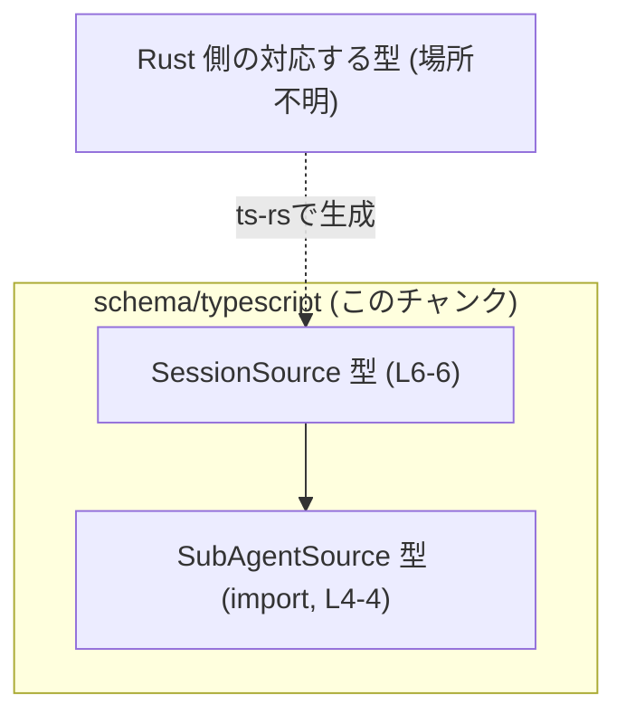
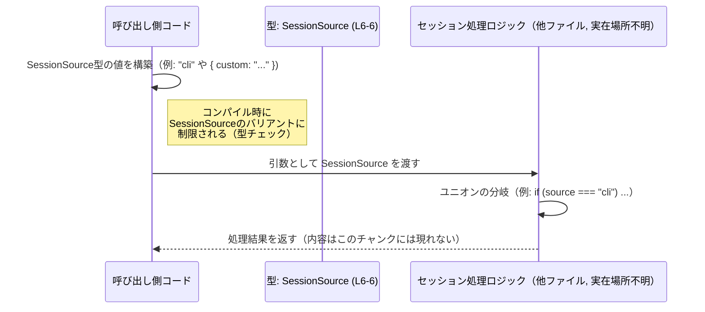

# app-server-protocol/schema/typescript/SessionSource.ts コード解説

## 0. ざっくり一言

- Rust 側の型から `ts-rs` によって生成された、「セッションの生成元（source）」を表す TypeScript の共用体（ユニオン）型定義です (SessionSource.ts:L1-3, L6-6)。

---

## 1. このモジュールの役割

### 1.1 概要

- このモジュールは、セッションがどこから来たかを表す `SessionSource` 型を提供します (SessionSource.ts:L6-6)。
- CLI / VSCode / 外部プロセス実行 / MCP / カスタム / サブエージェント / 不明 といった複数のバリエーションを 1 つの型で扱えるようにします (SessionSource.ts:L6-6)。
- 型定義のみを含み、実行時ロジックや関数は含まれていません (SessionSource.ts:L1-6)。

### 1.2 アーキテクチャ内での位置づけ

- `SessionSource` は、この TypeScript スキーマ層における「セッションの起点情報」を表す基本的な型です (SessionSource.ts:L6-6)。
- `"subagent"` バリアントにおいて、別ファイル `./SubAgentSource` の型 `SubAgentSource` に依存します (SessionSource.ts:L4-4, L6-6)。
- ファイル先頭のコメントから、この定義は Rust 側の型定義を `ts-rs` で変換した結果であり、Rust の型と 1:1 で対応していると考えられますが、Rust 側の具体的な場所はこのチャンクには現れません (SessionSource.ts:L1-3)。



### 1.3 設計上のポイント

- **共用体（ユニオン）型による表現**  
  - 文字列リテラル型とオブジェクト型のユニオンで、セッションの起点を表現しています (SessionSource.ts:L6-6)。
- **拡張可能なオブジェクトバリアント**  
  - カスタムソース用に `{ "custom": string }`、サブエージェント用に `{ "subagent": SubAgentSource }` を用意し、将来の拡張や追加データを持つケースを吸収できる構造になっています (SessionSource.ts:L6-6)。
- **既知・未知ソースの明示**  
  - 既知のソース（`"cli"`, `"vscode"` など）に加えて `"unknown"` を含め、判別不能なケースを明示的に表現できるようにしています (SessionSource.ts:L6-6)。
- **型定義のみで状態やロジックを持たない**  
  - このファイルにはクラスや関数、変数などの実行時オブジェクトは存在せず、状態や副作用は一切ありません (SessionSource.ts:L1-6)。

---

## 2. 主要な機能一覧

このモジュールが提供する機能は、すべて `SessionSource` 型定義に集約されています。

- `SessionSource`: セッションの生成元を表すユニオン型定義 (SessionSource.ts:L6-6)  

内訳として次のバリアントが存在します (SessionSource.ts:L6-6)。

- `"cli"`: CLI から開始されたセッションを表す文字列リテラル型
- `"vscode"`: VSCode 経由のセッションを表す文字列リテラル型
- `"exec"`: 外部プロセスによる実行を表すと考えられる文字列リテラル型（用途はコードからは断定不可）
- `"mcp"`: MCP に関連するソースを表す文字列リテラル型（具体的な意味はこのチャンクには現れません）
- `{ "custom": string }`: 任意のカスタムソース名を保持するオブジェクトバリアント
- `{ "subagent": SubAgentSource }`: サブエージェント経由のセッション元を、別型 `SubAgentSource` で詳細に表現するバリアント
- `"unknown"`: それ以外または不明なソースを表す文字列リテラル型

※ 各バリアント名の具体的なビジネス意味は命名から推測されますが、このファイル単体からは確定できません。

---

## 3. 公開 API と詳細解説

### 3.1 型一覧（構造体・列挙体など）

このファイル内の型・依存関係のインベントリーです。

| 名前 | 種別 | 定義/使用行 | 役割 / 用途 |
|------|------|-------------|-------------|
| `SessionSource` | 型エイリアス（ユニオン型） | SessionSource.ts:L6-6 | セッションの生成元を表す共用体型。既知の文字列リテラルと 2 種類のオブジェクトバリアントを持つ。 |
| `SubAgentSource` | 型（別ファイル） | SessionSource.ts:L4-4, L6-6 | `"subagent"` バリアントで利用される型。具体的な定義は `./SubAgentSource` 側にあり、このチャンクには現れません。 |

#### `SessionSource` の詳細

```ts
export type SessionSource =
    "cli"
  | "vscode"
  | "exec"
  | "mcp"
  | { "custom": string }
  | { "subagent": SubAgentSource }
  | "unknown";
```

(原文そのまま、SessionSource.ts:L6-6)

- **型の性質**  
  - 7 通りのバリアントを持つユニオン型です (SessionSource.ts:L6-6)。
  - 4 つは文字列リテラル型、2 つはオブジェクト型、1 つは `"unknown"` です (SessionSource.ts:L6-6)。

- **TypeScript 特有の安全性**  
  - 変数に `SessionSource` 型を付けると、コンパイル時に上記以外の値（例: `"CLI"` や数値など）を代入しようとするとエラーになります。これは TypeScript の文字列リテラル型・ユニオン型の基本挙動に基づく説明です。
  - オブジェクトバリアントは `"custom"` または `"subagent"` というプロパティ名をキーにした**判別可能なユニオン**として扱えるため、`"custom" in source` のような型ガードで安全に分岐できます (SessionSource.ts:L6-6)。

- **ランタイムの挙動とエラー**  
  - このファイルには実行時コードが存在しないため、ここで直接例外やエラーが発生することはありません (SessionSource.ts:L1-6)。
  - 実際のエラーは、この型を使う側のコード（入力のパースやバリデーション処理）で起こり得ますが、このチャンクではそのコードは確認できません。

### 3.2 関数詳細（最大 7 件）

- このファイルには関数・メソッド・クラスの定義は含まれていません (SessionSource.ts:L1-6)。  
  したがって、関数に対する詳細テンプレートの適用対象はありません。

### 3.3 その他の関数

- このチャンクには補助的な関数やラッパー関数も存在しません (SessionSource.ts:L1-6)。

---

## 4. データフロー

このファイルには実行時処理はありませんが、`SessionSource` 型がどのように「流れる」かを理解するための代表的な使用シナリオを、概念的なデータフローとして示します。  
ここで示す関数名やモジュール名は**使用例**であり、このリポジトリ内に実在するとは限りません。



要点:

- **型レベルの安全性**  
  - `Caller` が `SessionSource` 型変数を構築する段階で、定義済みのバリアント以外を使おうとするとコンパイルエラーになります (SessionSource.ts:L6-6)。
- **ユニオンの分岐**  
  - `Handler` 側では、文字列バリアント（`"cli"` など）とオブジェクトバリアント（`{ custom: ... }` など）を判別し、それぞれに応じた処理を実装できます。この分岐ロジックはこのファイルには現れませんが、ユニオン型の基本的な利用パターンです。

---

## 5. 使い方（How to Use）

### 5.1 基本的な使用方法

`SessionSource` 型を関数の引数に使い、バリアントごとに処理を分ける例です。  
このコードは「この型の典型的な使い方」を示すものであり、このリポジトリ内の実在コードではありません。

```typescript
// SessionSource 型をインポートする（パスはこのファイルの位置に依存）
// 実際のパスはプロジェクト構成に合わせて調整する必要があります。
import type { SessionSource } from "./SessionSource";  // このファイル自身を想定

// SessionSourceを受け取ってログ出力する関数                       // SessionSource型の値を引数に取る
function logSessionSource(source: SessionSource): void {          // 不正な値はコンパイル時に弾かれる
    // まず文字列かオブジェクトかで分岐する                        // typeofでユニオンを絞り込む
    if (typeof source === "string") {                             // sourceが"cli"|"vscode"|...|"unknown"のとき
        console.log("session source (string):", source);          // 文字列としてそのまま利用できる
        return;                                                   // ここで関数を終了
    }

    // ここに来るのはオブジェクトバリアントのときだけ               // { custom: string } または { subagent: SubAgentSource }
    if ("custom" in source) {                                     // customバリアントかを判定
        console.log("custom session source:", source.custom);     // カスタム名の文字列を取り出す
    } else if ("subagent" in source) {                            // subagentバリアントかを判定
        console.log("subagent session source:", source.subagent); // SubAgentSource型の詳細を表示
    }
}

// 使用例: CLI由来のセッション                                    // "cli"はSessionSourceの一つのバリアント
const src1: SessionSource = "cli";                                // OK

// 使用例: カスタムソース                                        // customバリアントのオブジェクト
const src2: SessionSource = { custom: "integration-test" };       // OK

logSessionSource(src1);                                           // 呼び出し例
logSessionSource(src2);                                           // 呼び出し例

// const invalid: SessionSource = "CLI";                          // コンパイルエラー: "CLI"は定義されていない
```

ポイント:

- 文字列バリアントとオブジェクトバリアントで扱いを分ける場合は、`typeof` と `"key" in obj` を組み合わせた型ガードを使うのが典型です。
- `SessionSource` 型を使うことで、有効なバリアント以外（例: `"CLI"` のような大文字表記）の代入をコンパイル時に防止できます (SessionSource.ts:L6-6)。

### 5.2 よくある使用パターン

1. **セッション情報を含むモデルの一部として使う**

```typescript
import type { SessionSource } from "./SessionSource";             // SessionSource型のインポート

// セッション情報を表す型                                   // SessionSourceをフィールドに組み込む
interface SessionInfo {
    id: string;                                                   // セッションID（文字列）
    source: SessionSource;                                        // セッションの生成元
}

const session: SessionInfo = {                                    // SessionInfo型の値を作成
    id: "sess-123",                                              // 任意のID
    source: "vscode",                                            // VSCode由来を指定
};
```

1. **入力バリデーション後の型として利用する**

```typescript
import type { SessionSource } from "./SessionSource";             // SessionSource型のインポート

// 任意の入力値をSessionSourceにパースした後の戻り値型として使う       // 実際のパース処理は別途実装
function handleSessionSource(source: SessionSource) {             // パース済みなのでここでは安全に扱える
    // sourceのバリアントに応じて処理                         // 具体的なロジックはユースケースに依存
}
```

1. **`"unknown"` バリアントを利用して安全なフォールバックを用意する**

```typescript
function normalizeSource(source: SessionSource): SessionSource {  // SessionSourceを受け取りSessionSourceを返す
    if (typeof source === "string") {                             // 文字列バリアントの場合
        return source;                                            // そのまま返す
    }
    // オブジェクトバリアントをまとめてunknownに落とす例       // 方針次第で挙動を変えられる
    return "unknown";                                             // 不明扱いとして返却
}
```

### 5.3 よくある間違い

`SessionSource` を使う際に起こり得る典型的な誤用と、その修正版です。

```typescript
import type { SessionSource } from "./SessionSource";

// 誤り例: 単なるstring型で扱ってしまう                          // 制約がなくなる
function bad(source: string) {                                    // stringだと任意の文字列が渡せてしまう
    // "CLI" や "editor" など、定義されていない値も通ってしまう    // 型によるチェックが効かない
}

// 正しい例: SessionSource型を使う                               // 許可された値に限定される
function good(source: SessionSource) {                            // ユニオン型で安全に制約
    // "cli"や"vscode"など、定義されたバリアントのみが渡される    // コンパイル時にチェックされる
}
```

```typescript
import type { SessionSource } from "./SessionSource";

// 誤り例: バリアントのスペルミス                                // 定義されていないリテラル
// const src: SessionSource = "CLI";                              // コンパイルエラー

// 正しい例: 定義されたリテラルを使用                            // "cli"が正しい
const src: SessionSource = "cli";                                // OK
```

### 5.4 使用上の注意点（まとめ）

- **手動編集は禁止**  
  - ファイル先頭コメントに「GENERATED CODE! DO NOT MODIFY BY HAND!」とあり、`ts-rs` による生成コードであることが明示されています (SessionSource.ts:L1-3)。  
    変更が必要な場合は、生成元の Rust 側の型定義を変更し、`ts-rs` を再実行する必要があります。
- **実行時の入力検証は別途必要**  
  - `SessionSource` はコンパイル時の型制約を提供しますが、生の JSON やユーザー入力からこの型の変数に値を代入する場合は、別途ランタイムの検証が必要です。このファイルにはその検証ロジックは含まれません (SessionSource.ts:L1-6)。
- **並行性 / スレッド安全性**  
  - 型定義のみで実行時状態を持たないため、このファイル自体には並行性やスレッド安全性に関する問題はありません (SessionSource.ts:L1-6)。

---

## 6. 変更の仕方（How to Modify）

### 6.1 新しい機能を追加する場合

このファイルは自動生成であり、直接編集しない前提です (SessionSource.ts:L1-3)。  
新しいセッションソースを追加したい場合の一般的な手順は次のとおりです。

1. **Rust 側の型定義を変更する**  
   - `ts-rs` は通常、Rust 側の構造体・列挙体に `#[derive(TS)]` 等を付与して TypeScript を生成します。  
   - どの Rust ファイルが生成元かはこのチャンクには現れないため、プロジェクト全体の構成を確認する必要があります（場所不明）。
2. **`ts-rs` による再生成を行う**  
   - Rust 側の型を更新した後、`ts-rs` のビルドステップまたはスクリプトを実行し、`SessionSource.ts` を再生成します (SessionSource.ts:L1-3)。
3. **TypeScript 側のコンパイルエラーを解消する**  
   - 新しいバリアントを追加した場合、`SessionSource` を exhaustively に扱っている `switch` や `if` 文でコンパイルエラーが発生する可能性があります。  
   - それらを修正して、新しいバリアントを適切に処理する必要があります。

### 6.2 既存の機能を変更する場合

- **既存バリアント名の変更・削除**  
  - Rust 側でバリアント名を変更 / 削除すると、`SessionSource` のユニオンからも該当バリアントが変化します (SessionSource.ts:L6-6)。  
  - これに伴い、TypeScript 側で `"cli"` などのリテラルに依存している箇所がコンパイルエラーとなるため、影響範囲を確認する必要があります（このチャンクには使用箇所は現れません）。
- **`SubAgentSource` の構造変更**  
  - `SubAgentSource` の定義を変更すると、`{ "subagent": SubAgentSource }` バリアントの構造が変わります (SessionSource.ts:L4-4, L6-6)。  
  - これに依存するコード（`source.subagent` を参照する箇所）も合わせて確認する必要がありますが、そのコードはこのチャンクには現れません。

---

## 7. 関連ファイル

このモジュールと密接に関係するファイルは、インポートやコメントから次のように読み取れます。

| パス | 役割 / 関係 |
|------|------------|
| `schema/typescript/SubAgentSource.ts`（と推定される） | `import type { SubAgentSource } from "./SubAgentSource";` から、`SessionSource` の `"subagent"` バリアントで使用される型定義ファイルであることが分かります (SessionSource.ts:L4-4, L6-6)。実際のファイルパスはプロジェクト構成に依存します。 |
| Rust 側の対応する型定義ファイル（場所不明） | ファイル先頭コメントより、この TypeScript ファイルは `ts-rs` によって生成されているため、元となる Rust の型定義が存在します (SessionSource.ts:L1-3)。ただし、このチャンクにはその場所や型名は現れません。 |

---

### まとめ（安全性 / エッジケース / テスト / パフォーマンス）

- **安全性（型 / セキュリティ）**  
  - `SessionSource` により、セッションの起点を表す値を限定されたユニオン型に絞り込めるため、スペルミスや無効な値をコンパイル時に検出しやすくなります (SessionSource.ts:L6-6)。  
  - セキュリティ上の懸念（入力検証など）は、この型単体では解決されず、利用側のコードに依存します。このチャンクにはその実装は現れません (SessionSource.ts:L1-6)。

- **Contracts / Edge Cases（契約と境界条件）**  
  - 許可される値は `SessionSource` の 7 バリアントに限定されます (SessionSource.ts:L6-6)。  
  - `"unknown"` バリアントを使うことで、「起点が特定できない」ケースを表現する契約を持たせることができますが、その意味づけは利用側の設計によります（このファイルからは判断できません）。

- **テスト**  
  - このファイルにはテストコードは含まれておらず (SessionSource.ts:L1-6)、テストの有無や内容はこのチャンクからは分かりません。

- **パフォーマンス / スケーラビリティ**  
  - 型定義のみでランタイム処理がないため、このファイル自体がパフォーマンスに与える影響はごく僅か（型チェック時のみ）であり、ランタイムのオーバーヘッドはありません (SessionSource.ts:L1-6)。
