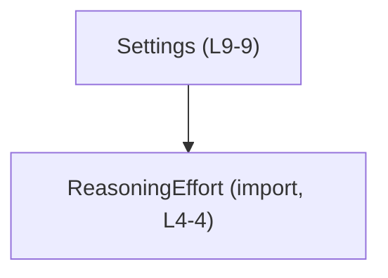
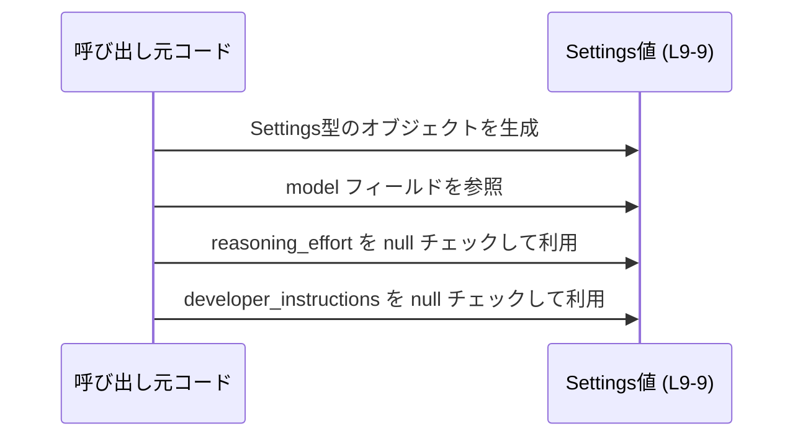

# app-server-protocol/schema/typescript/Settings.ts

## 0. ざっくり一言

`Settings` 型は、「コラボレーションモード」の設定情報を TypeScript 側で表現するための、**自動生成されたシンプルな設定オブジェクトの型定義**です（根拠: Settings.ts:L1-3, L6-9）。

---

## 1. このモジュールの役割

### 1.1 概要

- このモジュールは、コラボレーションモードに関する設定値をまとめて表現するための **`Settings` 型エイリアス**を提供します（根拠: Settings.ts:L6-7, L9-9）。
- `Settings` は 3 つのフィールドを持つオブジェクトで、モデル名 (`model`)、推論の強度を表すと考えられる `reasoning_effort`、開発者向けの追加指示 `developer_instructions` を格納します（根拠: Settings.ts:L9-9）。
- このファイルは `ts-rs` によって **自動生成されており、手動で編集しない前提**になっています（根拠: Settings.ts:L1-3）。

### 1.2 アーキテクチャ内での位置づけ

- このモジュールは、`ReasoningEffort` 型に依存しています（根拠: Settings.ts:L4-4, L9-9）。
- 逆方向の依存（`Settings` をどこから使っているか）は、このチャンクには現れません。

依存関係を簡単な Mermaid 図で表します。



- `Settings` は、自身のフィールド `reasoning_effort` の型として `ReasoningEffort` を参照しています（根拠: Settings.ts:L9-9）。
- `ReasoningEffort` の中身や定義場所の詳細は、このチャンクには現れません。

### 1.3 設計上のポイント

- **自動生成コード**  
  - 冒頭コメントにより、`ts-rs` による自動生成であることと、「手で編集しない」方針が明示されています（根拠: Settings.ts:L1-3）。
- **シンプルなレコード型**  
  - `Settings` はクラスではなく、プロパティ 3 つを持つプレーンなオブジェクト型（type エイリアス）です（根拠: Settings.ts:L9-9）。
- **null を用いた任意フィールド表現**  
  - `reasoning_effort` と `developer_instructions` は `T | null` という形で、「存在しない場合は `null`」という表現になっています（根拠: Settings.ts:L9-9）。
- **型専用インポート**  
  - `ReasoningEffort` は `import type` でインポートされており、コンパイル後には消える「型情報のみ」の依存になっています（根拠: Settings.ts:L4-4）。

---

## 2. 主要な機能一覧

このファイルは関数を持たず、**型定義のみ**を提供します。

- `Settings` 型: コラボレーションモードの設定を表現するオブジェクト型（根拠: Settings.ts:L6-7, L9-9）
  - `model`: 使用するモデル名の文字列
  - `reasoning_effort`: 推論の強度やモードを表すと推測される `ReasoningEffort` 型または `null`
  - `developer_instructions`: 追加の指示文などを格納すると考えられる `string` または `null`  
    （用途はプロパティ名・コメントからの推測であり、仕様はこのチャンクには現れません）

---

## 3. 公開 API と詳細解説

### 3.1 型一覧（構造体・列挙体など）

このチャンクに現れる主要な型・依存型の一覧です。

| 名前                | 種別           | 役割 / 用途                                                                                  | 定義/参照箇所                 |
|---------------------|----------------|----------------------------------------------------------------------------------------------|--------------------------------|
| `Settings`          | 型エイリアス   | コラボレーションモードの設定を表すオブジェクト型。3 つのフィールドを持つ。                  | Settings.ts:L6-7, L9-9        |
| `ReasoningEffort`   | 型（外部依存） | `Settings.reasoning_effort` の型。推論の強度・レベルなどを表す型と解釈できるが詳細は不明。 | インポートのみ: Settings.ts:L4-4 |

> `ReasoningEffort` の具体的な定義や値のバリエーションは、このチャンクには現れません。「推論の強度」という解釈は、名前からの推測です。

#### `Settings` 型の構造

```typescript
export type Settings = {
    model: string,
    reasoning_effort: ReasoningEffort | null,
    developer_instructions: string | null,
};
```

（整形のため改行を入れています。元コード: Settings.ts:L9-9）

- `model: string`  
  - 任意の文字列が許可されます。空文字や未知のモデル名も型レベルでは許可されており、制約はかかっていません（根拠: Settings.ts:L9-9）。
- `reasoning_effort: ReasoningEffort | null`  
  - `ReasoningEffort` 型の値、または設定されていないことを表す `null` です（根拠: Settings.ts:L9-9）。
- `developer_instructions: string | null`  
  - 文字列の指示文、または未指定を表す `null` です（根拠: Settings.ts:L9-9）。

### 3.2 関数詳細（最大 7 件）

このファイルには **関数・メソッド定義は存在しません**（根拠: Settings.ts:L1-9 全体を確認しても `function` やメソッド構文がない）。

したがって、関数詳細テンプレートの対象となる API はこのチャンクには現れません。

### 3.3 その他の関数

- 該当なし（このチャンクには関数定義が存在しません）。

---

## 4. データフロー

このファイル単体には処理ロジックや関数が無いため、「アプリケーション全体におけるデータフロー」は読み取れません（根拠: Settings.ts:L1-9）。  
ここでは、**`Settings` 型の値がコード内でどのように扱われるか**という観点で、典型的な利用フローの例を示します。  
（以下は、この型定義から導かれる一般的な TypeScript コード例であり、このリポジトリで実際に使われているかどうかは、このチャンクからは分かりません。）



この図が表す流れ（一般的な例）:

1. 呼び出し元コードが `Settings` 型のオブジェクトを作成する（根拠: `Settings` がオブジェクト型であること, Settings.ts:L9-9）。
2. 必須フィールド `model` を文字列で指定する。
3. `reasoning_effort` と `developer_instructions` は、必要に応じて値を設定するか、未指定の場合は `null` とする。
4. 利用側でこれらのフィールドを参照する際には、`null` の可能性を考慮して条件分岐する。

---

## 5. 使い方（How to Use）

### 5.1 基本的な使用方法

`Settings` 型の値を生成して利用する、最も基本的なコード例です。

```typescript
// Settings.ts から Settings 型をインポートする（パスはプロジェクト構成に応じて調整）
import type { Settings } from "./Settings";               // Settings 型定義を読み込む

// ReasoningEffort 型も型としてインポートする
import type { ReasoningEffort } from "./ReasoningEffort"; // reasoning_effort フィールドの型

// どこかで定義されている ReasoningEffort 値を仮定する
declare const defaultEffort: ReasoningEffort;             // 実体の定義はこのチャンクには現れない

// Settings 型の値を生成する
const settings: Settings = {                              // Settings 型のオブジェクトを作成
    model: "gpt-4o",                                      // 必須の文字列フィールド（根拠: Settings.ts:L9-9）
    reasoning_effort: defaultEffort,                      // ReasoningEffort 型の値
    developer_instructions: "System-level instructions",  // null ではない文字列
};

// 利用側の例（null 許容フィールドの扱い）
if (settings.reasoning_effort !== null) {                 // null チェック（根拠: Settings.ts:L9-9）
    // reasoning_effort が設定されている場合の処理
}

if (settings.developer_instructions !== null) {           // null チェック（根拠: Settings.ts:L9-9）
    // developer_instructions を利用する処理
}
```

ポイント:

- `model` は必須フィールドなので、省略すると TypeScript の型チェックでエラーになります（型からの推論）。
- `reasoning_effort` / `developer_instructions` は `null` を取り得るため、利用する際には `null` チェックが必要です（根拠: Settings.ts:L9-9）。

### 5.2 よくある使用パターン

#### パターン1: 最低限の設定のみを指定する

`reasoning_effort` と `developer_instructions` を未指定（`null`）にしたい場合の例です。

```typescript
import type { Settings } from "./Settings";

const settingsMinimal: Settings = {
    model: "gpt-4o",              // 必須（string）
    reasoning_effort: null,       // 未指定を null で表現
    developer_instructions: null, // 未指定を null で表現
};
```

- このように、**必須なのは `model` だけ**であり、他の 2 フィールドは `null` を入れることで「設定なし」を表現できます（根拠: Settings.ts:L9-9）。

#### パターン2: developer_instructions だけを指定する

`reasoning_effort` は未指定のままにし、`developer_instructions` のみ設定する例です。

```typescript
import type { Settings } from "./Settings";

const settingsWithInstructions: Settings = {
    model: "gpt-4o",
    reasoning_effort: null,                    // デフォルトの推論強度に任せるイメージ
    developer_instructions: "Use short answers only.", // 追加の指示文
};
```

- 用途として「開発者からの追加指示」と解釈できますが、正確な意味・フォーマットはこのチャンクには現れません（根拠: プロパティ名とコメント, Settings.ts:L6-7, L9-9）。

### 5.3 よくある間違い

この型定義から推測される、起こりがちな誤用例とその修正版です。

```typescript
import type { Settings } from "./Settings";

// 誤り例: 必須フィールド model を省略している
const badSettings1: Settings = {
    // model: "gpt-4o",             // 省略するとコンパイルエラー（型的に必須, Settings.ts:L9-9）
    reasoning_effort: null,
    developer_instructions: null,
};

// 誤り例: null 許容フィールドに undefined を入れている
const badSettings2: Settings = {
    model: "gpt-4o",
    reasoning_effort: undefined,  // 型定義上は ReasoningEffort | null なのでエラー（Settings.ts:L9-9）
    developer_instructions: null,
};

// 正しい例
const goodSettings: Settings = {
    model: "gpt-4o",
    reasoning_effort: null,       // 未指定は null で表現
    developer_instructions: null,
};
```

- `reasoning_effort` と `developer_instructions` は `T | null` であり、`undefined` は許可されていません（根拠: Settings.ts:L9-9）。
- `model` のみが required であり、必ず指定する必要があります（根拠: Settings.ts:L9-9）。

### 5.4 使用上の注意点（まとめ）

- **null の扱い**  
  - `reasoning_effort` / `developer_instructions` は `null` を取り得るため、利用前に `null` チェックが必要です（根拠: Settings.ts:L9-9）。
- **`undefined` を使わない**  
  - `T | null` で定義されているため、未指定状態を `undefined` で表現しようとすると型エラーになります（根拠: Settings.ts:L9-9）。
- **モデル名の妥当性**  
  - 型レベルでは任意の文字列を許します。実際に利用可能なモデル名かどうかのチェックは、別のレイヤー（実行時バリデーションなど）で行う必要があります。このチャンクにはそのロジックは現れません。
- **並行性・エラー処理**  
  - このファイルは純粋な型定義であり、非同期処理や並行処理、ランタイム例外は含まれていません（根拠: Settings.ts:L1-9）。

---

## 6. 変更の仕方（How to Modify）

### 6.1 新しい機能を追加する場合

このファイルは冒頭に「GENERATED CODE! DO NOT MODIFY BY HAND!」と明記されているため、**直接編集することは意図されていません**（根拠: Settings.ts:L1-3）。

一般的な前提として:

- この TypeScript 型は `ts-rs` によって自動生成されています（根拠: Settings.ts:L2-3）。
- 新しいフィールドを追加したい場合、通常は **元になっている Rust 側の型定義**を変更し、`ts-rs` のコード生成を再実行する形になります。  
  ただし、その Rust 側の位置や構造は、このチャンクには現れません。

変更のステップ例（このチャンクから推測できる範囲）:

1. Rust 側の元の設定構造体（おそらく `Settings` 相当）にフィールドを追加・変更する。  
   （どこに存在するかは、このチャンクには現れません。）
2. `ts-rs` のコード生成を再実行して、`Settings.ts` を再生成する。
3. TypeScript 側で `Settings` 型を使っている箇所がコンパイルエラーになっていないか確認する。

### 6.2 既存の機能を変更する場合

`Settings` 型の構造を変えると、これを参照している全ての TypeScript コードに影響します。

注意点:

- `model` を optional に変える、型を変更する等の操作は、型定義を前提とした呼び出し側コードとの「契約」を変更することになります。
- `reasoning_effort` や `developer_instructions` の null 許容性を変更すると、`null` チェックを前提としたロジック・型ガードが動かなくなる可能性があります。
- このファイルは自動生成であるため、**直接の編集は推奨されません**。変更は元の定義（Rust 側）で行い、このファイルは生成物として扱うのが安全です（根拠: Settings.ts:L1-3）。

---

## 7. 関連ファイル

このチャンクから読み取れる、密接に関係するファイルは以下の通りです。

| パス                                                | 役割 / 関係                                                                                   |
|-----------------------------------------------------|----------------------------------------------------------------------------------------------|
| `app-server-protocol/schema/typescript/ReasoningEffort.ts` | `ReasoningEffort` 型の定義が存在すると推測されるファイル。`Settings.reasoning_effort` の型として利用される（根拠: Settings.ts:L4-4, L9-9）。 |

> `ReasoningEffort.ts` の正確な内容や構造は、このチャンクには現れません。「.ts」を付けたパスは、相対インポート `"./ReasoningEffort"` からディレクトリ構造を推定したものです。

---

### Bugs / Security / Contracts / Edge Cases について

- **Bugs**  
  - このファイルは型定義のみであり、実行時ロジックを含まないため、このチャンク単体から具体的なバグは読み取れません（根拠: Settings.ts:L1-9）。
- **Security**  
  - セキュリティ関連のロジック（認可・検証など）は含まれていません。  
    入力値の検証・サニタイズは、`Settings` 型を利用する別の層で行う必要があります。
- **Contracts（契約）**  
  - `model` は必須の `string`。空文字や不正な値も受け付けるが、型レベルでは禁止されていない（根拠: Settings.ts:L9-9）。
  - `reasoning_effort` は「設定されていないことを `null` で表現する」契約になっています（根拠: Settings.ts:L9-9）。
  - `developer_instructions` も同様に `string | null` の契約です（根拠: Settings.ts:L9-9）。
- **Edge Cases**  
  - `model` に空文字 (`""`) や未知のモデル名を渡しても、型レベルでは許可されます。実行時にどう扱うかはこのチャンクには現れません。
  - `reasoning_effort` / `developer_instructions` が `null` の場合、そのまま参照するとランタイムで `null` のアクセスに起因する問題が起こり得ます。TypeScript で `strictNullChecks` が有効であれば、コンパイル時に警告されます。

### Tests / Performance / Observability について

- **Tests**  
  - このファイル内にテストコードは存在しません（根拠: Settings.ts:L1-9）。
  - 型定義の正しさは主にコンパイル時に検証される性質のものであり、テストはこれを利用するロジック側で行うことになります。
- **Performance / Scalability**  
  - 型定義はコンパイル後に JavaScript からは消えるため、このファイル自体が実行時パフォーマンスに直接影響することはありません（TypeScript の一般仕様）。
- **Observability**  
  - ログ出力やメトリクスなどの観測機構は含まれていません（根拠: Settings.ts:L1-9）。  

以上が、このチャンクから客観的に読み取れる `Settings` 型の役割と利用方法です。
