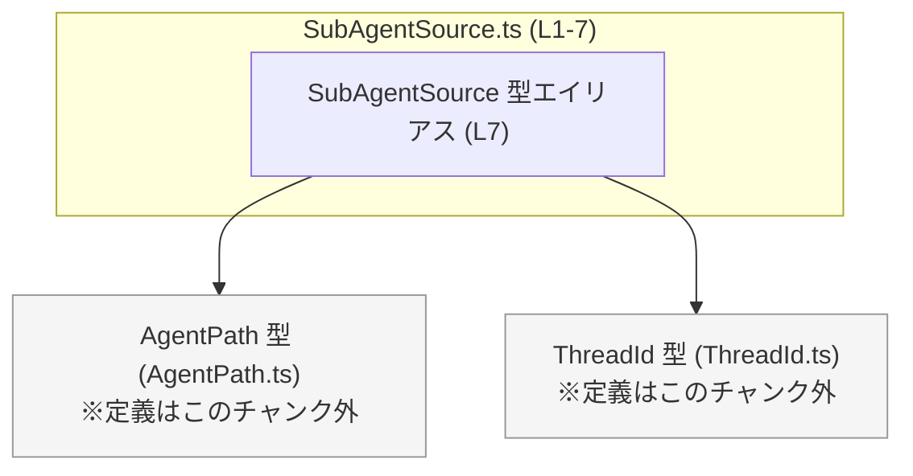
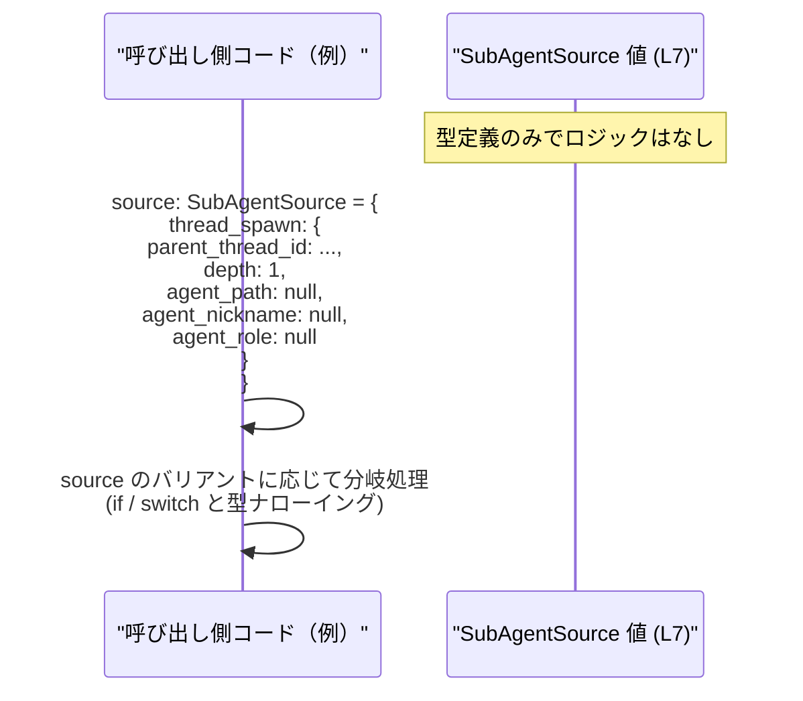

# app-server-protocol/schema/typescript/SubAgentSource.ts コード解説

## 0. ざっくり一言

`SubAgentSource` は、ある「サブエージェント」がどのような経路・理由で生成されたかを、TypeScript のユニオン型として表現するための型定義です（`SubAgentSource.ts:L7`）。  
文字列リテラルと、詳細情報を持つオブジェクト型の両方を含む **判別可能ユニオン的な型** になっています。

---

## 1. このモジュールの役割

### 1.1 概要

- このモジュールは、`SubAgentSource` という型エイリアスを 1 つだけ公開します（`SubAgentSource.ts:L7`）。
- `SubAgentSource` は、`"review"` や `"compact"` などの文字列リテラル、`"thread_spawn"` / `"other"` といったキーを持つオブジェクトを含むユニオン型で、**サブエージェントの発生源を表現する列挙型的な役割**を持つと解釈できます（命名とバリアント名からの推測であり、厳密な意味はこのチャンクからは分かりません）。
- ファイル全体はコメントにあるとおり ts-rs により自動生成されており、手動編集は想定されていません（`SubAgentSource.ts:L1-3`）。

### 1.2 アーキテクチャ内での位置づけ

このファイルの依存関係は次のとおりです。

- 依存先
  - `AgentPath` 型（`./AgentPath` からの type import, `SubAgentSource.ts:L4, L7`）
  - `ThreadId` 型（`./ThreadId` からの type import, `SubAgentSource.ts:L5, L7`）
- 公開するもの
  - `SubAgentSource` 型エイリアス（`SubAgentSource.ts:L7`）

他のモジュールから `SubAgentSource` がどのように使用されているかは、このチャンクには現れていません。



この図は、`SubAgentSource` が `AgentPath` と `ThreadId` に型レベルで依存している構造を示します。

### 1.3 設計上のポイント

コードから読み取れる設計上の特徴は次のとおりです。

- **自動生成ファイル**  
  - 冒頭コメントに「GENERATED CODE」「Do not edit this file manually」と明記されています（`SubAgentSource.ts:L1, L3`）。
  - 型の変更は、生成元（ts-rs によるスキーマ）を通じて行う前提になっています。生成元がどこにあるかは、このチャンクからは分かりません。

- **判別可能ユニオンに近い構造**  
  - `"review" | "compact" | "memory_consolidation"` という **文字列リテラル型** と（`SubAgentSource.ts:L7`）、
  - `{ "thread_spawn": { ... } }` / `{ "other": string }` という **オブジェクト型** をまとめたユニオンになっています（`SubAgentSource.ts:L7`）。
  - `"thread_spawn"` と `"other"` のキーがそれぞれバリアントを判別する「タグ」として機能します。

- **外部 ID 型の利用**  
  - `thread_spawn` バリアント内で `ThreadId` と `AgentPath | null` を利用し、別モジュールの ID 型・パス型に依存する構造になっています（`SubAgentSource.ts:L4-5, L7`）。

- **状態・ロジックを持たない**  
  - このファイルは型定義のみで、関数や実行時ロジックは含みません（`SubAgentSource.ts:L1-7`）。
  - エラーハンドリングや並行処理は、この型を利用する側のコードに委ねられます。

---

## 2. 主要な機能一覧

このモジュールが提供する「機能」は、実行時の処理ではなく **型レベルの表現力** にあります。

- `SubAgentSource` 型:
  - サブエージェントの生成元を、文字列リテラルとオブジェクトを組み合わせたユニオン型として表現する。
  - `thread_spawn` バリアントで、親スレッド ID・深さ・エージェントのパスやニックネームなどの補足情報を保持できる（`SubAgentSource.ts:L7`）。
  - `other` バリアントで、文字列による自由記述の理由を表現できる。

---

## 3. 公開 API と詳細解説

### 3.1 型一覧（構造体・列挙体など）

#### 本ファイルで定義されている型

| 名前             | 種別          | 行範囲                          | 役割 / 用途 |
|------------------|---------------|----------------------------------|-------------|
| `SubAgentSource` | 型エイリアス  | `SubAgentSource.ts:L7-7`        | サブエージェントの発生源を表すユニオン型。文字列リテラルとデータ付きオブジェクトのバリアントを持つ。 |

#### 本ファイルが参照する外部型

| 名前       | 種別       | 参照箇所                           | 役割 / 関係（わかる範囲） |
|------------|------------|------------------------------------|---------------------------|
| `AgentPath`| 型（import）| import と `thread_spawn.agent_path`（`SubAgentSource.ts:L4, L7`） | `thread_spawn` バリアント内で、エージェントに関するパスらしき情報を表す型として利用されていると解釈できます（名前からの推測）。|
| `ThreadId` | 型（import）| import と `thread_spawn.parent_thread_id`（`SubAgentSource.ts:L5, L7`） | `thread_spawn` バリアント内で、親スレッドを識別する ID 型として利用されていると解釈できます（名前からの推測）。 |

#### `SubAgentSource` の構造詳細

元コード（1 行）を読みやすく分割すると、次のようなユニオン型です（`SubAgentSource.ts:L7`）。

```typescript
export type SubAgentSource =
    | "review"
    | "compact"
    | {
        "thread_spawn": {
            parent_thread_id: ThreadId;
            depth: number;
            agent_path: AgentPath | null;
            agent_nickname: string | null;
            agent_role: string | null;
        };
    }
    | "memory_consolidation"
    | {
        "other": string;
    };
```

バリアントごとの説明（意味は名前からの推測を含みます）:

1. `"review"`  
   - 文字列リテラル型。
   - レビュー目的で作られたサブエージェントのソースを表している可能性があります。

2. `"compact"`  
   - 文字列リテラル型。
   - 何らかの「圧縮」や「要約」用途のサブエージェントを表している可能性があります。

3. `{ "thread_spawn": { ... } }`  
   - オブジェクト型。トップレベルに `"thread_spawn"` キーを持ち、その値はさらにオブジェクトです。
   - 内部フィールド:
     - `parent_thread_id: ThreadId`  
       親スレッドを識別する ID 型（`SubAgentSource.ts:L5, L7`）。
     - `depth: number`  
       ネストの深さや生成階層を示す整数値と思われます（`SubAgentSource.ts:L7`）
     - `agent_path: AgentPath | null`  
       エージェントのパス情報か、その情報が存在しない場合は `null`（`SubAgentSource.ts:L4, L7`）。
     - `agent_nickname: string | null`  
       エージェントのニックネームか、ない場合は `null`。
     - `agent_role: string | null`  
       エージェントのロール名か、ない場合は `null`。

4. `"memory_consolidation"`  
   - 文字列リテラル型。
   - 記憶の統合・整理のような処理のためのサブエージェントを表している可能性があります。

5. `{ "other": string }`  
   - オブジェクト型。トップレベルに `"other"` キーを持ち、その値は自由な文字列理由です。
   - 列挙にない理由を柔軟に表現するためのフォールバック的なバリアントと考えられます。

**型安全性・契約に関するポイント**

- `SubAgentSource` 型を使うことで、**許可されたバリアント以外の文字列や構造をコンパイル時に排除**できます（TypeScript の静的型チェックによる）。
- `thread_spawn` バリアント内の `agent_path` / `agent_nickname` / `agent_role` は `null` を許容しますが、`undefined` は型に含まれていません（`SubAgentSource.ts:L7`）。
  - `strictNullChecks` が有効な設定では、`undefined` を代入するとコンパイルエラーになります。
- TypeScript の型は実行時には存在しないため、**外部入力が本当にこの形を満たしているかは実行時に別途検証する必要があります**。

### 3.2 関数詳細（このファイルには関数なし）

このファイルには関数・メソッド・クラスは定義されていません（`SubAgentSource.ts:L1-7`）。  
そのため、このセクションで詳細に解説する対象となる関数はありません。

### 3.3 その他の関数

補助関数やラッパー関数も、このチャンクには一切登場しません。

---

## 4. データフロー

`SubAgentSource` 自体は型定義のみであり、実行時の処理フローは持ちません。  
ここでは、**典型的な利用シナリオの例**として、「値の生成からハンドリングまで」のデータフローを概念的に示します。実際にどのモジュールがこの型を使っているかは、このチャンクからは分かりません。



要点:

- 呼び出し側は `SubAgentSource` 型として値を構築します（`SubAgentSource.ts:L7`）。
- その後、`source === "review"` のような文字列比較、または `"thread_spawn" in source` のようなキー存在チェックでバリアントごとに分岐し、それぞれの情報を利用します。
- 実際の関数呼び出し関係は、このチャンクには現れません。

---

## 5. 使い方（How to Use）

### 5.1 基本的な使用方法

`SubAgentSource` をインポートして、バリアントごとに分岐する典型的な例です。

```typescript
// SubAgentSource 型をインポートする                                     // このファイルと同じディレクトリにあると仮定
import type { SubAgentSource } from "./SubAgentSource";                   // 型のみをインポート（実行時コードは生成されない）

// SubAgentSource 型の値を処理する関数                                   // 呼び出し側から SubAgentSource を受け取る
function handleSubAgentSource(source: SubAgentSource): void {             // 戻り値はここでは void の例
    if (source === "review") {                                            // 文字列リテラル "review" の場合
        console.log("source: review");                                    // review 用の処理を書く
    } else if (source === "compact") {                                    // 文字列リテラル "compact" の場合
        console.log("source: compact");                                   // compact 用の処理
    } else if (source === "memory_consolidation") {                       // 文字列リテラル "memory_consolidation" の場合
        console.log("source: memory consolidation");                      // memory_consolidation 用の処理
    } else if ("thread_spawn" in source) {                                // オブジェクトで "thread_spawn" キーを持つバリアントの場合
        const ts = source.thread_spawn;                                   // thread_spawn の中身を取り出す
        console.log("parent_thread_id:", ts.parent_thread_id);            // 親スレッド ID を利用
        console.log("depth:", ts.depth);                                  // 深さを利用
        console.log("agent_path:", ts.agent_path);                        // パス（null の可能性あり）
        console.log("agent_nickname:", ts.agent_nickname);                // ニックネーム（null の可能性あり）
        console.log("agent_role:", ts.agent_role);                        // ロール（null の可能性あり）
    } else if ("other" in source) {                                       // オブジェクトで "other" キーを持つバリアントの場合
        console.log("source: other =", source.other);                     // other に格納された任意の文字列を利用
    } else {                                                              // 型的にはここに来ないはずのパス
        // この分岐に入るのは、型定義と実際のデータが食い違っているなどの異常時のみ
        console.warn("Unknown SubAgentSource value:", source);            // デバッグ用のログなど
    }
}
```

この例のポイント:

- `SubAgentSource` のユニオン型により、**許可された文字列以外はコンパイル時に拒否**されます。
- オブジェクトバリアントは `"thread_spawn" in source` / `"other" in source` のようなキー存在チェックで安全に判別できます。
- `agent_path` など `null` 許容フィールドは、そのまま `null` を扱うコードを書く必要があります。

### 5.2 よくある使用パターン

1. **単純な文字列バリアントの利用**

```typescript
// SubAgentSource 型を引数に取る関数を定義                             // source が "review" などの文字列でもオブジェクトでも受け取れる
function setSubAgentSource(source: SubAgentSource) {                     // ここでは処理内容は省略
    // ...
}

// 呼び出し側で単純な文字列バリアントを渡す例                         // "review" は SubAgentSource の許可された値
setSubAgentSource("review");                                             // OK

// setSubAgentSource("REVIEWS");                                        // 型エラー: "REVIEWS" は定義されていないバリアント
```

1. **`thread_spawn` バリアントを構築して渡す**

```typescript
import type { SubAgentSource } from "./SubAgentSource";                  // 型のインポート
import type { ThreadId } from "./ThreadId";                              // ThreadId 型のインポート
import type { AgentPath } from "./AgentPath";                            // AgentPath 型のインポート

function createThreadSpawnSource(                                       // thread_spawn バリアントを構築する関数
    parentThreadId: ThreadId,                                           // 親スレッド ID を受け取る
    depth: number,                                                      // 深さを受け取る
    path: AgentPath | null,                                             // パス（null も可）
): SubAgentSource {                                                     // 戻り値の型は SubAgentSource
    return {                                                            // オブジェクトバリアントを返す
        thread_spawn: {                                                 // "thread_spawn" キーがバリアントのタグ
            parent_thread_id: parentThreadId,                           // 引数をそのままフィールドに設定
            depth,                                                      // 短縮記法で代入
            agent_path: path,                                           // 引数 path をフィールドに設定
            agent_nickname: null,                                       // ニックネームはここでは未設定（null）
            agent_role: null,                                           // ロールも未設定（null）
        },
    };
}
```

### 5.3 よくある間違い

この型から想定される誤用例と、その修正例です。

```typescript
import type { SubAgentSource } from "./SubAgentSource";

// 間違い例 1: 定義されていない文字列を使う                             // "Review" は SubAgentSource のバリアントではない
// const src1: SubAgentSource = "Review";                               // ← コンパイルエラーになる（strict な設定を想定）

// 正しい例: 定義済みの文字列リテラルを使う                            // "review" は許可された値
const src1: SubAgentSource = "review";                                  // OK

// 間違い例 2: thread_spawn 内の null 許容フィールドに undefined を入れる
/*
const src2: SubAgentSource = {
    thread_spawn: {
        parent_thread_id: someThreadId,
        depth: 1,
        agent_path: undefined,                                         // ← 型は AgentPath | null のため、strictNullChecks ではエラー
        agent_nickname: undefined,                                     // ← 同上
        agent_role: undefined,                                         // ← 同上
    },
};
*/

// 正しい例: null を明示的に使う                                       // 型定義に合わせて null を使用
const src2: SubAgentSource = {
    thread_spawn: {
        parent_thread_id: {} as any,                                   // ここでは ThreadId の具体型が不明なため any キャストの例
        depth: 1,
        agent_path: null,                                              // null を代入
        agent_nickname: null,                                          // null を代入
        agent_role: null,                                              // null を代入
    },
};
```

### 5.4 使用上の注意点（まとめ）

- **自動生成ファイルであること**  
  - コメントにある通り、手動編集は想定されていません（`SubAgentSource.ts:L1-3`）。
  - 型を変更したい場合は、ts-rs の生成元定義を変更して再生成する必要があります（生成元の場所はこのチャンクには現れません）。

- **型はコンパイル時のみ有効**  
  - TypeScript の型は実行時には削除されるため、外部から受け取ったデータがこの形を満たしているかどうかは **別途ランタイムバリデーションが必要**です。
  - これを怠ると、`source as SubAgentSource` のようなキャスト経由で不正な値が入り込み、セキュリティや信頼性に影響する可能性があります。

- **null 許容フィールドの扱い**  
  - `agent_path` / `agent_nickname` / `agent_role` は `null` を許容し、`undefined` は型に含まれていません（`SubAgentSource.ts:L7`）。
  - 呼び出し側コードでは、`null` チェックを明示的に行う必要があります。

- **並行性・スレッド安全性**  
  - この型は文字列・数値・（おそらく）イミュータブルな ID 型やパス型で構成された **プレーンなデータ構造**です。
  - JavaScript / TypeScript の通常のオブジェクトと同様、複数の非同期処理から同じオブジェクトを共有・ミュートする場合は、アプリケーション側の設計で整合性を保つ必要があります（型自体は並行性制御を提供しません）。

- **パフォーマンス上の側面**  
  - 型エイリアスの定義自体は実行時には存在せず、パフォーマンスに直接の影響はありません。
  - `thread_spawn` バリアント内にどの程度の情報を格納するか（特に `AgentPath` や `other` の文字列長）は、実際の利用コード側の設計事項になります。

---

## 6. 変更の仕方（How to Modify）

### 6.1 新しい機能を追加する場合（バリアント追加など）

このファイルは ts-rs による自動生成であり、手動編集は上書きされる可能性が高いため（`SubAgentSource.ts:L1-3`）、一般的な手順としては次のようになります。

1. **生成元のスキーマを探す**  
   - コメントから、この型の定義元は ts-rs の生成設定であることが分かります（`SubAgentSource.ts:L3`）。
   - 具体的にどのファイルかはこのチャンクには現れないため、リポジトリ全体を検索する必要があります。

2. **新しいバリアントやフィールドを生成元に追加する**  
   - 例: `"analysis"` という新しい文字列バリアントを追加したい場合、生成元スキーマに対応するバリアントを追加します。
   - `thread_spawn` バリアントにフィールドを足したい場合も同様です。

3. **ts-rs による再生成を実行する**  
   - プロジェクトのビルド・生成手順に従って TypeScript スキーマを再生成します。
   - このステップにより `SubAgentSource.ts` が更新されます。

4. **利用箇所のコンパイルエラーを確認する**  
   - ユニオン型にバリアントを追加した場合、それを受け取る関数の `switch` / `if` 分岐が **網羅的でなくなるとコンパイルエラーになる**可能性があります（`never` 到達チェックなど）。
   - すべての利用箇所が新バリアントに対応していることを確認します。

### 6.2 既存の機能を変更する場合（フィールド型変更など）

既存のバリアントやフィールドを変更する際の注意点です。

- **影響範囲の確認**  
  - `SubAgentSource` を引数や戻り値に使っている関数・メソッドをすべて検索し、どのバリアントに依存しているかを把握する必要があります。
  - このチャンクには利用箇所が現れていないため、リポジトリ全体の検索が必要です。

- **契約の変更に注意**  
  - 例: `agent_nickname: string | null` を `string` に変更する場合、`null` を前提としていたコード（存在チェックなど）が破綻する可能性があります。
  - 逆に `null` 非許容にすると、`null` を代入しているコードがコンパイルエラーになります。

- **追加・削除したバリアントに対する分岐の見直し**  
  - `other` バリアントを削除する／構造を変える場合、`"other" in source` のようなチェックを行う箇所の修正が必要になります。

- **テスト**  
  - このファイル自体にはテストは含まれていません（`SubAgentSource.ts:L1-7`）。
  - 実際には、`SubAgentSource` を利用する上位層のテスト（API 経由でのシリアライズ / デシリアライズなど）で、スキーマ変更の影響を確認することが重要です。

---

## 7. 関連ファイル

このモジュールと直接関係するファイルは、import から次が確認できます。

| パス                                             | 役割 / 関係 |
|--------------------------------------------------|------------|
| `app-server-protocol/schema/typescript/AgentPath.ts` | `AgentPath` 型を提供しているファイルです（`SubAgentSource.ts:L4`）。`SubAgentSource` の `thread_spawn.agent_path` フィールドの型として利用されています（`SubAgentSource.ts:L7`）。具体的な構造・意味はこのチャンクには現れません。 |
| `app-server-protocol/schema/typescript/ThreadId.ts`  | `ThreadId` 型を提供しているファイルです（`SubAgentSource.ts:L5`）。`SubAgentSource` の `thread_spawn.parent_thread_id` の型として利用されています（`SubAgentSource.ts:L7`）。具体的な構造・意味はこのチャンクには現れません。 |

その他、この TypeScript ファイルを生成している ts-rs 側の設定・スキーマが存在するはずですが、その位置や具体的なファイル名は、このチャンクからは分かりません。
