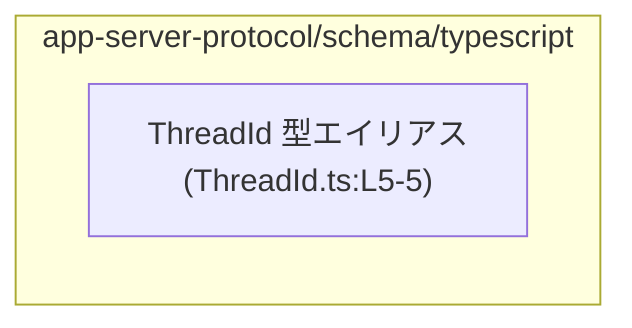
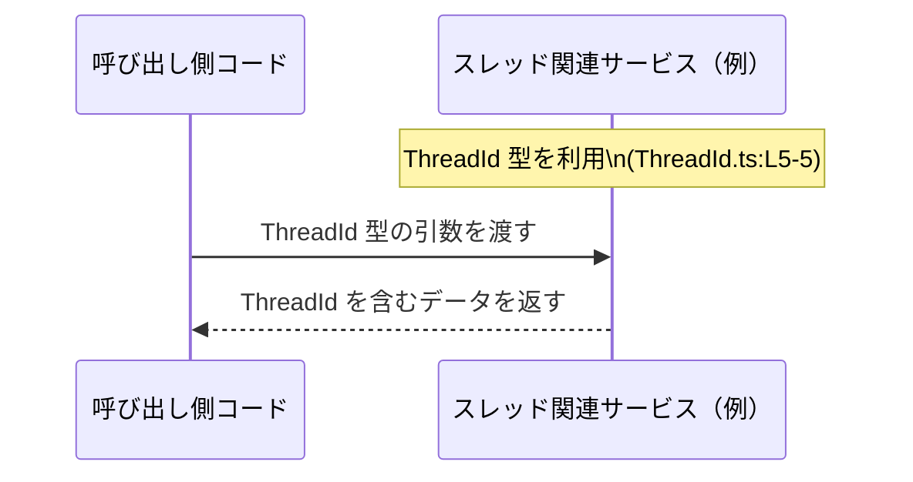

# app-server-protocol\\schema\\typescript\\ThreadId.ts コード解説

## 0. ざっくり一言

- `ThreadId` という **型エイリアス**（別名）を `string` 型として定義してエクスポートする、自動生成された TypeScript 型定義ファイルです。（`ThreadId.ts:L1-5`）

---

## 1. このモジュールの役割

### 1.1 概要

- このモジュールは、`ThreadId` という名前付きの型を提供し、その実体を単なる `string` 型として定義しています。（`ThreadId.ts:L5-5`）
- 冒頭コメントにより、`ts-rs` というツールによって自動生成されたファイルであり、手動編集しないことが明示されています。（`ThreadId.ts:L1-3`）
- 型名から、スレッド ID を表現する用途が想定されていると解釈できますが、具体的な形式や意味はコードからは分かりません。

### 1.2 アーキテクチャ内での位置づけ

- ディレクトリ `schema/typescript` 配下にあり、**プロトコル用の TypeScript 型定義を集約する領域の一部**と考えられますが、このチャンク単体から他ファイルとの関係は特定できません。
- このファイル自身は他のモジュールを `import` しておらず、**依存は一切持たない純粋な型定義モジュール**になっています。（`ThreadId.ts:L1-5`）

依存関係（このチャンク内で分かる範囲）を Mermaid で示します。



- エッジ（矢印）は、このチャンク内からは判定できないため描いていません。

### 1.3 設計上のポイント

- **自動生成コードであることの明示**  
  - コメントに `GENERATED CODE! DO NOT MODIFY BY HAND!` および `Do not edit this file manually.` と書かれており、生成物であることと手動変更禁止が明示されています。（`ThreadId.ts:L1-3`）
- **型エイリアスによる名前付け**  
  - `export type ThreadId = string;` により、単なる `string` に `ThreadId` という名前を付けて再利用しやすくしています。（`ThreadId.ts:L5-5`）
- **ランタイム処理なし**  
  - 関数・クラスなどの実行時ロジックは一切なく、コンパイル時の型付けのためだけのモジュールです。（`ThreadId.ts:L1-5`）
- **構造的な制約なし**  
  - `string` に対するエイリアスなので、値の形式（例: UUID 形式など）に関する制約や検証は、型レベルでは付与されていません。（`ThreadId.ts:L5-5`）

---

## 2. 主要な機能一覧

このファイルが提供する公開 API（機能）は 1 つだけです。

- `ThreadId` 型: スレッド ID などを表すと想定される文字列に、`ThreadId` という名前を付けたエクスポート用の型エイリアスです。（`ThreadId.ts:L5-5`）

---

## 3. 公開 API と詳細解説

### 3.1 型一覧（構造体・列挙体など）

このチャンクに現れる「主要な型コンポーネント」のインベントリーです。

| 名前       | 種別                 | 役割 / 用途                                                                                   | 定義箇所               |
|------------|----------------------|-----------------------------------------------------------------------------------------------|------------------------|
| `ThreadId` | 型エイリアス`string` | 文字列型に `ThreadId` という意味的な名前を付与するためのエクスポート型。具体的な用途はコードからは不明。 | `ThreadId.ts:L5-5`     |

#### `ThreadId` 型の性質（TypeScript 観点）

- **静的型付け**  
  - TypeScript コンパイラ上では、`ThreadId` 型として宣言された変数には文字列 (`string`) しか代入できません。  
    これは TypeScript の標準的な型システムの挙動です。（`ThreadId.ts:L5-5`）
- **実行時の挙動**  
  - 実行時には `ThreadId` という型情報は JavaScript に残らず、単なる文字列として扱われます。  
    そのため、型だけではフォーマットチェックや ID の妥当性検証は行われません。
- **構造的型付け（別名にすぎない）**  
  - `ThreadId` は `string` と完全に同一視される型エイリアスであり、`string` 型の値は自由に `ThreadId` として扱えますし、その逆も同様です。  
    型レベルで `ThreadId` と「その他の文字列」を区別することはできません。（`ThreadId.ts:L5-5`）

### 3.2 関数詳細（最大 7 件）

- このファイルには、関数・メソッド・クラスなど、呼び出し可能な公開 API は定義されていません。（`ThreadId.ts:L1-5`）

### 3.3 その他の関数

- 補助関数やラッパー関数も一切定義されていません。（`ThreadId.ts:L1-5`）

---

## 4. データフロー

### 4.1 このファイルで定義されるデータフロー

- このファイルは `ThreadId` 型を定義してエクスポートするだけであり、**実行時の処理フローやデータフローは定義していません**。（`ThreadId.ts:L5-5`）
- 実際のデータの流れ（どの関数からどの関数へ `ThreadId` が渡されるか）は、このチャンクには現れません。

### 4.2 概念的な利用イメージ（例示）

以下は、`ThreadId` 型が他のコードから利用される「典型的なイメージ」を示す概念図です。  
ここに出てくる関数やサービスは **例示用であり、このファイルには定義されていません**。



- この図が表しているのは、「アプリケーションコードが `ThreadId` 型の値をサービスに渡し、サービスがまた別の `ThreadId` を含むデータを返す」といった **型レベルの契約** です。
- 実際にどのようなサービスや API が存在するかは、このチャンクからは分かりません。

---

## 5. 使い方（How to Use）

### 5.1 基本的な使用方法

同一ディレクトリ内の別ファイルから `ThreadId` 型を利用する典型的な例です。  
（モジュールパスや関数名は**例示**であり、このチャンクには登場しません。）

```typescript
// Thread.ts: ThreadId 型の利用例                                    // 例示用の別ファイル
import type { ThreadId } from "./ThreadId";                           // 同一ディレクトリの ThreadId から型をインポート（仮定）

// スレッド情報を表すインターフェース                                // スレッドを表現する構造
interface Thread {                                                    // Thread インターフェースの宣言
  id: ThreadId;                                                       // スレッド ID を ThreadId 型として定義
  title: string;                                                      // タイトルは通常の string 型
}

// ThreadId を引数として受け取る関数                                 // ThreadId 型を受け取る関数の例
function fetchThread(id: ThreadId): Promise<Thread> {                 // id 引数に ThreadId 型を指定
  // 実装はプロジェクト固有のため省略                                // 実際の処理はアプリケーションに依存
  return Promise.reject(new Error("not implemented"));                // ダミーの戻り値（未実装を示す）
}
```

このように、`ThreadId` は:

- インターフェース / 型のプロパティ
- 関数の引数・戻り値の型

として利用されることが考えられます。ただし、これらの利用例はあくまで一般的な TypeScript コードの例であり、実際のプロジェクト構成はこのチャンクからは分かりません。

### 5.2 よくある使用パターン

#### パターン 1: 変数としての利用

```typescript
import type { ThreadId } from "./ThreadId";                           // 型エイリアスをインポート

const id: ThreadId = "thread-123";                                    // 直接文字列リテラルを代入
// コンパイル時には string 型との互換性がチェックされる              // TypeScript が型チェックを行う
```

#### パターン 2: 他の string からの代入

```typescript
import type { ThreadId } from "./ThreadId";                           // 型エイリアスをインポート

const rawId: string = "thread-123";                                   // 通常の string 型
const threadId: ThreadId = rawId;                                     // そのまま代入可能（型は string 互換）
// 実行時には変換処理は行われず、単なる文字列の代入になる            // ランタイムでの追加コストはない
```

- `ThreadId` は `string` の別名なので、`string` 型の変数をそのまま代入して利用できます。（`ThreadId.ts:L5-5`）

### 5.3 よくある間違い

**勘違いしがちな点**: `ThreadId` が `string` とは別物の厳密な型だと考えてしまうケースです。

```typescript
import type { ThreadId } from "./ThreadId";                           // 型エイリアスをインポート

let threadId: ThreadId = "thread-1";                                  // ThreadId 型の変数
let userId: string = "user-1";                                        // 単なる string 型の変数

threadId = userId;                                                    // コンパイルも実行も通ってしまう
// ThreadId は string の別名にすぎないため、                        // 型レベルで ThreadId と他の string を
// TypeScript はこれを許可する                                       // 区別することはできない
```

- このコードは **型エラーになりません**。  
  `ThreadId` は nominal 型（名前で区別される型）ではなく、単なる `string` の別名であるためです。
- 「ユーザー ID を誤ってスレッド ID として扱わないようにしたい」といった目的であれば、現状の定義だけでは不十分です。

### 5.4 使用上の注意点（まとめ）

- `ThreadId` は **純粋な型エイリアス**であり、実行時のチェックや変換は行われません。（`ThreadId.ts:L5-5`）
- **値の形式の保証はない**  
  - 空文字や任意の文字列も `ThreadId` として許容されます。形式やバリデーションは別の層で実装する必要があります。
- **他の `string` 型との区別はコンパイル時にも行われない**  
  - `string` 全般と相互代入可能なため、「別種の ID と取り違えない」ことを型だけで保証することはできません。
- **スレッド安全性 / 並行性**  
  - このモジュールは型定義だけであり、状態やスレッドに関するコードを持たないため、並行性やスレッド安全性に関する問題は直接は発生しません。
- **エラー／例外**  
  - 関数呼び出しを持たないため、このファイルに起因するランタイムエラーや例外は存在しません。

---

## 6. 変更の仕方（How to Modify）

### 6.1 新しい機能を追加する場合

- コメントに `GENERATED CODE! DO NOT MODIFY BY HAND!` とあるため、**このファイルを手動で編集しないことが前提**です。（`ThreadId.ts:L1-3`）
- `ThreadId` 周りに新たな型情報やフィールドを追加したい場合は、次の方針になります。
  1. `ts-rs` の入力側（通常は別言語側の型定義など）に変更を加える。  
     - 入力側の具体的な場所はこのチャンクからは分かりません。
  2. `ts-rs` によるコード生成プロセスを再実行し、`ThreadId.ts` を再生成する。
- このファイルに直接新しい型や関数を足すと、次回の自動生成で上書きされる可能性が高い点に注意が必要です。

### 6.2 既存の機能を変更する場合

例えば、`ThreadId` を `string` ではなく別の型（例: `number` や `string` のユニオン）に変更したい場合の注意点です。

- **変更手順の原則**
  - このファイルを直接編集せず、`ts-rs` の生成元の定義を変更し、再生成する。（`ThreadId.ts:L1-3`）
- **影響範囲**
  - `ThreadId` を利用しているすべてのコード（他ファイル）が影響を受けます。
  - このチャンクから具体的な利用箇所は分かりませんが、型名から想定されるように、スレッド関連の広い範囲に影響しうることが考えられます。
- **契約（コンタラクト）の維持**
  - `ThreadId` が「文字列である」という前提に依存している呼び出し側コードが存在する場合、その前提が崩れることでコンパイルエラーやロジックの変更が必要になります。
- **テスト**
  - このチャンクにはテストコードは含まれていないため、変更時には、`ThreadId` を利用する側のテスト（別ファイル）を再実行して、型変更による影響を確認する必要があります。

---

## 7. 関連ファイル

このチャンクから **明示的に参照されている他ファイルやモジュールはありません**。  
そのため、以下は「分からない」という情報を明示する形になります。

| パス | 役割 / 関係 |
|------|------------|
| 不明 | このチャンクには、`ThreadId` 型をどこから利用しているか、また生成元の定義がどのファイルかといった情報は現れません。 |

---

### まとめ（安全性 / エラー / 並行性 の観点）

- **安全性**: `ThreadId` は `string` の別名であり、型システムによる最低限の型安全性（「文字列であること」）は得られますが、ID の種類や形式までは区別できません。（`ThreadId.ts:L5-5`）
- **エラー**: 実行時ロジックがないため、このファイル由来のランタイムエラーや例外はありません。
- **並行性**: 状態や処理を持たない型定義のみのモジュールであり、並行実行・スレッドセーフティの問題は直接関与しません。

このように、このファイルはプロジェクト全体における「型の名前付け」のためのごく薄いレイヤとなっていることがコードから読み取れます。
