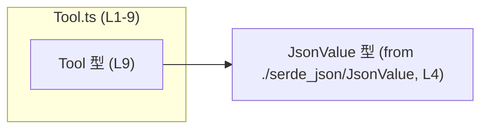
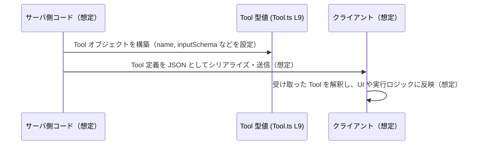

# app-server-protocol/schema/typescript/Tool.ts コード解説

## 0. ざっくり一言

- クライアントが呼び出す「ツール」の定義を TypeScript の型として表現した、**自動生成された型定義ファイル**です（`Tool.ts:L1-3, L6-9`）。

---

## 1. このモジュールの役割

### 1.1 概要

- このモジュールは、`Tool` 型を通じて「クライアントが呼び出せるツール」を表現するための**構造（スキーマ）を定義**します（`Tool.ts:L6-9`）。
- ファイル先頭のコメントから、この型定義は Rust 側から `ts-rs` によって**自動生成されており、手動編集してはいけないこと**が明示されています（`Tool.ts:L1-3`）。
- 実行時のロジックは一切含まず、**静的な型情報のみ**を提供します（`Tool.ts:L4-9`）。

### 1.2 アーキテクチャ内での位置づけ

- 唯一の依存として `JsonValue` 型を `./serde_json/JsonValue` からインポートしています（`Tool.ts:L4-4`）。
- `Tool` 型は、そのフィールドに `JsonValue` を多用することで、ツールに関するスキーマやメタ情報を**JSON 互換の値**として保持できるようになっています（`Tool.ts:L4, L9`）。
- このファイルからは、`Tool` 型がどのモジュールから利用されているか、またはどのようにシリアライズ／送信されるかは読み取れません（このチャンクには現れません）。

依存関係を簡単な Mermaid 図で表すと、次のようになります。



### 1.3 設計上のポイント

- **自動生成コード**  
  - ファイル先頭コメントで「GENERATED CODE! DO NOT MODIFY BY HAND!」と明示されており、`ts-rs` による自動生成物であることが示されています（`Tool.ts:L1-3`）。
  - 変更は TypeScript 側ではなく、元になっている Rust 型定義側で行う前提の設計です（`Tool.ts:L1-3`）。

- **単一の公開型 `Tool` のみを定義**  
  - モジュール内には関数やクラスは存在せず、`Tool` という型エイリアスが 1 つだけエクスポートされています（`Tool.ts:L9-9`）。
  - 状態やロジックは持たず、「構造（フィールドの集合）」だけを定義する**純粋なデータ定義**です。

- **柔軟な JSON ベースの表現**  
  - `inputSchema`, `outputSchema`, `annotations`, `icons`, `_meta` などの複数フィールドに `JsonValue` が使われています（`Tool.ts:L4, L9`）。
  - `JsonValue` の中身はこのファイルからは不明ですが、名前からは「任意の JSON 値を表現する型」であると解釈できます（推測であり、このチャンクには具体的定義は現れません）。

- **TypeScript の安全性と限界**  
  - `name` と `inputSchema` は必須フィールドであり、これらが欠けたオブジェクトはコンパイル時に `Tool` 型として受理されません（`Tool.ts:L9`）。
  - 一方で、`JsonValue` によって表現される内部構造については、この型だけでは詳細な制約を与えていないため、その部分の型安全性は限定的です（`Tool.ts:L4, L9`）。

- **並行性・エラー処理**  
  - 実行コードを含まないため、並行処理やランタイムエラーに関する要素は存在しません（`Tool.ts:L1-9`）。
  - TypeScript レベルでは、`Tool` 型による**コンパイル時の構造チェックのみ**を提供します。

---

## 2. 主要な機能一覧

このモジュールは関数ではなく、`Tool` 型を通じて次のような「機能」を提供します（`Tool.ts:L6-9`）。

- ツール識別情報の保持: `name`, `title`, `description` でツールの識別子や表示名、説明を表現する。
- 入力スキーマの定義: `inputSchema: JsonValue` で、ツールの入力の構造・制約を JSON ベースで表現する（具体的な形式はこのチャンクには現れません）。
- 出力スキーマの定義: `outputSchema?: JsonValue` で、ツールの出力の構造・制約を表現する（任意）。
- 付加的なメタ情報の付与: `annotations?: JsonValue`, `_meta?: JsonValue` で、タグ・メタデータなどの拡張情報を保持する。
- 表示用アイコン情報の保持: `icons?: Array<JsonValue>` で、ツールに関連するアイコン情報を配列で保持する。

---

## 3. 公開 API と詳細解説

### 3.1 型一覧（構造体・列挙体など）

このファイルで定義・利用されている主な型は次の通りです。

#### 型インベントリ

| 名前       | 種別                         | 役割 / 用途                                                                 | 定義位置              |
|------------|------------------------------|-----------------------------------------------------------------------------|-----------------------|
| `Tool`     | 型エイリアス（オブジェクト型） | クライアントが呼び出せる「ツール」の定義（名前・説明・入出力スキーマ等）を表現する | `Tool.ts:L6-9`        |
| `JsonValue`| 型（詳細不明）               | `Tool` 内のスキーマやメタ情報を JSON 互換の値として表現するために利用される     | `Tool.ts:L4-4`（インポート） |

#### `Tool` 型のフィールド構成

`Tool` は次のプロパティを持つオブジェクト型として定義されています（`Tool.ts:L9-9`）。

| プロパティ名   | 型                      | 必須/任意 | 説明（名前からの解釈）                                                                                          | 定義位置        |
|----------------|-------------------------|----------|------------------------------------------------------------------------------------------------------------------|-----------------|
| `name`         | `string`                | 必須     | ツールを一意に識別するための内部名・ID を表すと解釈できます（コード上は名前のみで、用途の詳細説明はありません）。 | `Tool.ts:L9`    |
| `title`        | `string`                | 任意     | 表示用のタイトルなど、人間向けの名称を表すと解釈できます（用途は名前からの推測です）。                          | `Tool.ts:L9`    |
| `description`  | `string`                | 任意     | ツールの説明文を格納するフィールドと解釈できます（名前からの推測です）。                                        | `Tool.ts:L9`    |
| `inputSchema`  | `JsonValue`             | 必須     | ツールの **入力** の構造・制約を記述したスキーマ情報を格納するフィールドと推測されます。                         | `Tool.ts:L9`    |
| `outputSchema` | `JsonValue`             | 任意     | ツールの **出力** のスキーマ情報を格納すると推測される任意フィールドです。                                      | `Tool.ts:L9`    |
| `annotations`  | `JsonValue`             | 任意     | 任意のメタ情報（タグやカテゴリ等）を格納する拡張領域と解釈できます。                                            | `Tool.ts:L9`    |
| `icons`        | `Array<JsonValue>`      | 任意     | アイコン情報を複数持つための配列フィールドと解釈できます。アイコンの具体的構造はこのチャンクには現れません。      | `Tool.ts:L9`    |
| `_meta`        | `JsonValue`             | 任意     | バージョンや作成元などのメタデータを格納するための内部用フィールドと推測されます（先頭 `_` は内部利用を示す慣習的記法）。 | `Tool.ts:L9` |

> 備考: 各フィールドの詳細な意味・スキーマ形式については、コメントや追加の型情報がこのファイルには存在しないため、**名前からの推測**にとどまります。

### 3.2 関数詳細（最大 7 件）

- このファイルには関数・メソッドは定義されていません（`Tool.ts:L1-9`）。
- したがって、呼び出し可能な API の解説はなく、`Tool` 型の**構造定義のみ**が公開 API となります。

### 3.3 その他の関数

- 補助的な関数やラッパー関数も定義されていません（`Tool.ts:L1-9`）。

---

## 4. データフロー

このファイルは型定義のみで処理ロジックは持たないため、**実際の関数呼び出しフロー**はコードからは読み取れません（このチャンクには現れません）。  
ただし、JSDoc コメント「Definition for a tool the client can call.」に基づき（`Tool.ts:L6-8`）、想定される典型的な利用シナリオを**概念図として**示します。これは推測であり、このファイル単体の事実ではないことに注意が必要です。



- この図は「`Tool` 型値がサーバコードからクライアントへ渡される」という **一般的なパターンを想定したもの**であり、実際にこのように使われているかどうかは、このファイルからは確認できません。
- `Tool` 型の内部での「データの流れ」はなく、各フィールドに値が格納されるだけの**静的な構造**です（`Tool.ts:L9`）。

---

## 5. 使い方（How to Use）

### 5.1 基本的な使用方法

典型的な利用としては、`Tool` 型をインポートし、ツール定義オブジェクトに型を付けることで**コンパイル時の構造チェック**を受ける、という形が考えられます。  
以下の例は、`JsonValue` が任意の JSON 値を許容する型だと仮定したものです（`JsonValue` の実態はこのチャンクには現れません）。

```typescript
// Tool 型をインポートする（パスはプロジェクト構成に応じて変更が必要です）
import type { Tool } from "./Tool"; // このファイル自身を想定した相対パス

// Tool 型の値を定義する例
const echoTool: Tool = {                               // echoTool は Tool 型のオブジェクト
    name: "echo",                                      // 必須フィールド: ツールの識別子
    title: "Echo tool",                                // 任意フィールド: 表示用タイトル
    description: "Echoes back the input string",       // 任意フィールド: 説明文
    // 以下は JsonValue 型だと想定して JSON ライクなオブジェクトを記述
    inputSchema: {                                     // 必須フィールド: 入力スキーマ（仮の例）
        type: "object",
        properties: {
            message: { type: "string" }
        },
        required: ["message"]
    },
    outputSchema: {                                    // 任意フィールド: 出力スキーマ（仮の例）
        type: "object",
        properties: {
            message: { type: "string" }
        },
        required: ["message"]
    },
    annotations: {                                     // 任意フィールド: メタ情報（仮の例）
        category: "utility"
    },
    icons: [                                           // 任意フィールド: アイコン情報の配列（仮の例）
        { type: "emoji", value: "💬" }
    ],
    _meta: {                                           // 任意フィールド: 内部メタデータ（仮の例）
        version: 1
    }
};
```

- このコードは、**構造的に `Tool` 型に適合するかどうか**を TypeScript がチェックする例です。
- `JsonValue` の実際の定義内容によっては、上記のようなオブジェクトリテラルがそのまま代入できない可能性もあります。その場合は `JsonValue` に合わせた形に調整する必要があります（このチャンクには `JsonValue` の定義が現れないため不明です）。

### 5.2 よくある使用パターン

`Tool` 型定義を前提に考えられるよくあるパターンを挙げます（いずれも一般的な利用方法の想定であり、このリポジトリ固有の利用方法はこのチャンクには現れません）。

1. **複数ツールの一覧を定義する**

```typescript
import type { Tool } from "./Tool";                 // Tool 型をインポート

const tools: Tool[] = [                             // Tool 型の配列としてツール一覧を定義
    {
        name: "echo",
        inputSchema: {/* JsonValue として有効な値を想定 */}
    },
    {
        name: "reverse",
        inputSchema: {/* JsonValue として有効な値を想定 */}
    }
];
```

1. **関数の引数として型付けする**

```typescript
import type { Tool } from "./Tool";                 // Tool 型をインポート

// ツール定義を受け取り、何らかの登録処理を行う関数の例（実装は任意）
function registerTool(tool: Tool) {                 // 引数 tool の型を Tool にすることで構造チェックを強化
    // 実際の登録処理はこのチャンクには現れません
}
```

### 5.3 よくある間違い

TypeScript の型チェック観点で起こり得る誤用例と修正版を示します。

```typescript
import type { Tool } from "./Tool";

// 間違い例: 必須フィールド inputSchema を省略している
const invalidTool: Tool = {
    name: "no-input-schema"          // inputSchema が無いためコンパイルエラーになるはず
    // inputSchema: ... が必要
};

// 正しい例: inputSchema を追加する
const validTool: Tool = {
    name: "with-input-schema",       // 必須フィールド
    inputSchema: null as any         // JsonValue に適合する適当な値（ここでは簡略化のため any を使用）
    // 実際には JsonValue に沿った値を設定する必要がある
};
```

- `name` と `inputSchema` は必須であるため、省略するとコンパイルエラーになります（`Tool.ts:L9`）。
- `title`, `description`, `outputSchema`, `annotations`, `icons`, `_meta` はオプションプロパティであるため、省略しても型エラーにはなりません（`Tool.ts:L9`）。

### 5.4 使用上の注意点（まとめ）

**前提条件・契約**

- `Tool` 型に適合するオブジェクトを作る際は、最低限 `name: string` と `inputSchema: JsonValue` を必ず含める必要があります（`Tool.ts:L9`）。
- その他のプロパティは `undefined`/未定義でもよい設計になっていますが、利用側コードがそれらを前提にしている場合は適切に設定する必要があります（利用側はこのチャンクには現れません）。

**JSON スキーマ部分の型安全性**

- `JsonValue` は名前から「任意の JSON 値」を意味すると推測されるため、`inputSchema` / `outputSchema` / `annotations` / `icons` / `_meta` の内部構造については TypeScript が詳細をチェックできない可能性があります（`Tool.ts:L4, L9`）。
- 入出力スキーマを厳密に扱いたい場合は、別途 TypeScript の型やバリデーションロジックを用意する必要があります（そのようなコードはこのチャンクには現れません）。

**バグ・セキュリティ観点（一般論）**

- このファイル自身にはロジックが無く、直接的なバグや脆弱性は含まれません（`Tool.ts:L1-9`）。
- ただし、`inputSchema` がユーザ入力の検証に使われる設計になっている場合、スキーマ定義を誤ると入力検証が不十分になり、セキュリティ上のリスクにつながる可能性があります。これはこの型の**利用側の問題**であり、このファイルからは具体的な挙動は分かりません。

**並行性・パフォーマンス・観測性**

- `Tool` はただの型定義であり、スレッドやイベントループを直接扱うコードは存在しません。そのため、並行性に関する注意点はありません（`Tool.ts:L1-9`）。
- パフォーマンスやスケーラビリティは、この型をどのように使うか（どの程度の数の `Tool` を扱うか、どれほど大きな `JsonValue` を持つか）に依存し、このファイル単体からは判断できません。
- ロギングやメトリクスといった観測性に関するコードも含まれていません（`Tool.ts:L1-9`）。

---

## 6. 変更の仕方（How to Modify）

### 6.1 新しい機能を追加する場合

このファイルは自動生成コードであり、先頭コメントで「DO NOT MODIFY BY HAND!」と明言されています（`Tool.ts:L1-3`）。  
そのため、`Tool` 型にフィールドを追加したい場合は、**直接この TypeScript ファイルを編集してはいけません**。

一般的な手順（コメントから読み取れる範囲の推測）:

1. 元になっている Rust 側の構造体や型（`ts-rs` によってエクスポートされているもの）を変更する。  
   - Rust 側の具体的な型定義ファイルは、このチャンクには現れません。
2. `ts-rs` のコード生成プロセスを再実行して、この `Tool.ts` を再生成する（`Tool.ts:L2-3`）。
3. 生成された `Tool` 型を使う TypeScript コード側で、新たなフィールドに対応する処理を追加する。

### 6.2 既存の機能を変更する場合

- **フィールド名の変更や削除**  
  - これも Rust 側の元定義を変更し、`ts-rs` で再生成する必要があります（`Tool.ts:L1-3`）。
  - 変更すると、`Tool` 型を利用している全ての TypeScript コードに影響するため、コンパイルエラーを手掛かりに影響範囲を確認するのが一般的です。

- **フィールドの意味や契約の変更**  
  - 例えば「`inputSchema` が必須でなくなる」「`annotations` は必ず特定の形を取る」などの仕様変更は、Rust 側・TypeScript 側双方のドキュメントと実装を更新する必要があります。
  - このファイルには仕様に関する詳細なコメントがほとんどないため、変更の意図や契約は別のドキュメントや上位コードで管理されている可能性が高いです（このチャンクには現れません）。

- **テスト**  
  - このファイルにはテストコードは含まれていません（`Tool.ts:L1-9`）。
  - `Tool` 型を使うコードのテスト（例えば、ツール定義をシリアライズ／検証する処理のテスト）は、別ファイルで用意する必要があります。

---

## 7. 関連ファイル

このモジュールと直接関係が確認できるファイルは、インポートされている `JsonValue` の定義ファイルのみです。

| パス                        | 役割 / 関係                                                                                           |
|-----------------------------|--------------------------------------------------------------------------------------------------------|
| `./serde_json/JsonValue`    | `JsonValue` 型を提供するモジュール。`Tool` 型内の `inputSchema`, `outputSchema`, `annotations`, `icons`, `_meta` などのフィールドの型として使用されている（`Tool.ts:L4, L9`）。 |

- Rust 側の元定義（`ts-rs` が参照する型）は、このチャンクには現れませんが、`Tool` 型の実質的なソースと考えられます（`Tool.ts:L2-3`）。
- `Tool` 型を実際に利用するコード（ツール一覧を生成する・クライアントに送るなど）は、このファイルには含まれておらず、どのファイルかもこのチャンクからは分かりません。
