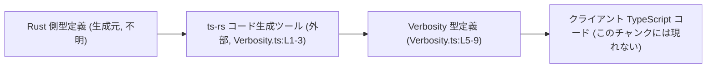
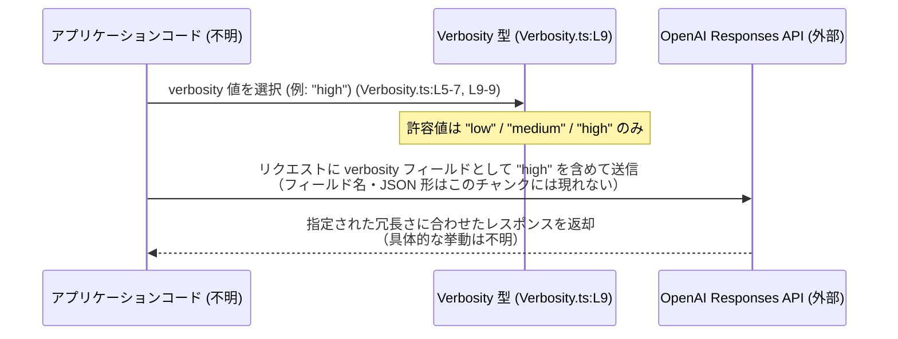

# app-server-protocol/schema/typescript/Verbosity.ts

## 0. ざっくり一言

- OpenAI Responses API（GPT-5 モデル）向けの「出力の長さ／詳細度」を `"low" | "medium" | "high"` の 3 値で表す **TypeScript の文字列リテラル型エイリアス** を定義するファイルです（Verbosity.ts:L5-7, Verbosity.ts:L9-9）。

---

## 1. このモジュールの役割

### 1.1 概要

- このモジュールは、GPT-5 モデルを使う OpenAI Responses API において、出力の長さや詳細度（verbosity）を制御するための値を **型安全に表現する** ために存在しています（Verbosity.ts:L5-7）。
- 許可される値は小文字の `"low"`, `"medium"`, `"high"` のみであり、OpenAI API に合わせたシリアライズとなるように設計されています（Verbosity.ts:L7-7, Verbosity.ts:L9-9）。

### 1.2 アーキテクチャ内での位置づけ

- このファイルは `ts-rs` によって Rust 側の定義から自動生成された TypeScript 型定義です（Verbosity.ts:L1-3）。
- TypeScript コードからは `Verbosity` 型を通じて、Responses API へ渡す「冗長さ指定」を表現する役割を担います（Verbosity.ts:L5-7, Verbosity.ts:L9-9）。
- このチャンクには他モジュールや具体的な呼び出し元コードは現れませんが、コメントから Rust 側のスキーマとクライアントコードの存在が推測されます（ただし構造やパスは不明です）。

依存関係（概念図）は次のようになります。



> Rust 側型定義およびクライアントコードの具体的な構造・ファイルパスは、このチャンクには現れません。

### 1.3 設計上のポイント

- **自動生成コードであり手動編集禁止**  
  - 「GENERATED CODE! DO NOT MODIFY BY HAND!」および `ts-rs` による生成である旨のコメントがあり、手動での修正は想定されていません（Verbosity.ts:L1-3）。
- **純粋な型定義のみ**  
  - 実行時のロジックや関数はなく、`export type Verbosity = "low" | "medium" | "high";` という型エイリアスのみが定義されています（Verbosity.ts:L9-9）。
- **OpenAI API に合わせた小文字シリアライズ**  
  - 「Serialized with lowercase values to match the OpenAI API.」とあり、小文字の文字列リテラルのみを許可する設計になっています（Verbosity.ts:L7-7, Verbosity.ts:L9-9）。
- **TypeScript 特有の型安全性**  
  - `"low" | "medium" | "high"` の **文字列リテラルユニオン型** とすることで、その他の文字列や `null` / `undefined` が誤って渡されることをコンパイル時に防ぎます（Verbosity.ts:L9-9）。

---

## 2. 主要な機能一覧

このファイルが提供する主要な「機能」は 1 つの型定義です。

- `Verbosity` 型: Responses API で GPT-5 モデルの出力長・詳細度を `"low" | "medium" | "high"` のいずれかの小文字文字列で指定するための型エイリアスです（Verbosity.ts:L5-7, Verbosity.ts:L9-9）。

---

## 3. 公開 API と詳細解説

### 3.1 型一覧（構造体・列挙体など）

| 名前        | 種別                                     | 役割 / 用途                                                                                                     | 定義位置                 |
|-------------|------------------------------------------|------------------------------------------------------------------------------------------------------------------|--------------------------|
| `Verbosity` | 型エイリアス（文字列リテラルのユニオン） | GPT-5 モデル向け Responses API の出力の長さ／詳細度を `"low" \| "medium" \| "high"` のいずれかで表現するための型 | Verbosity.ts:L9-9        |

### 3.2 主要 API 詳細（このファイルでは型 `Verbosity`）

このファイルには関数が定義されていないため、主要な公開要素である型 `Verbosity` を関数テンプレートに準じて詳述します。

#### `Verbosity` （型エイリアス）

```ts
export type Verbosity = "low" | "medium" | "high";
```

（Verbosity.ts:L9-9）

**概要**

- GPT-5 モデルを使う Responses API における「出力の長さ／詳細度」を表すための、3 値限定の文字列リテラル型です（Verbosity.ts:L5-7, Verbosity.ts:L9-9）。
- 値は小文字の `"low"`, `"medium"`, `"high"` のみが許容され、OpenAI API の仕様に揃える意図がコメントから読み取れます（Verbosity.ts:L7-7, Verbosity.ts:L9-9）。

**許容される値**

| 値        | 説明（相対的な意味合い）                             |
|-----------|------------------------------------------------------|
| `"low"`   | 低い冗長さ／短い・簡潔な出力を指定する識別子（想定） |
| `"medium"`| 中程度の冗長さを指定する識別子（想定）               |
| `"high"`  | 高い冗長さ／より詳細な出力を指定する識別子（想定）   |

> 具体的に各レベルがどの程度の長さ・詳細さになるかは、このチャンクには現れません。コメントには「Controls output length/detail」とあるのみです（Verbosity.ts:L6-6）。

**戻り値 / 実行時の挙動**

- 型エイリアスであり、関数ではないため「戻り値」は存在しません。
- TypeScript の型システム上の制約として働き、コンパイル時に `"low" | "medium" | "high"` 以外の文字列や `null` / `undefined` が代入されることを防ぎます（Verbosity.ts:L9-9）。

**内部処理の流れ（アルゴリズム）**

- 実行時の処理は存在せず、コンパイル時の型チェックのみが行われます。
  1. TypeScript コンパイラは変数やプロパティに `Verbosity` 型注釈が付いている箇所を解析します。
  2. 代入されている値が `"low"`, `"medium"`, `"high"` いずれかのリテラル、またはそれらに絞られた型であるかをチェックします。
  3. それ以外の文字列や `null` / `undefined` などが代入されている場合、コンパイルエラーとなります。
- これらは TypeScript 言語仕様による挙動であり、このファイルに特有の追加ロジックは存在しません（Verbosity.ts:L1-9）。

**Examples（使用例）**

> 実際の `import` パスやモジュール名はこのチャンクには現れないため、ここでは `Verbosity` がスコープ内にある前提で示します。

```ts
// Verbosity 型の変数を宣言する例
let v: Verbosity = "medium";      // OK: 許可された 3 値の 1 つ（Verbosity.ts:L9-9）
// v = "verbose";                 // コンパイルエラー: "verbose" は Verbosity 型に代入できない
// v = "LOW";                     // コンパイルエラー: 大文字小文字が異なる

// API オプション型の一部として使用する例
interface ResponseOptions {
  verbosity: Verbosity;          // 出力冗長さを指定するフィールド
}

const opts: ResponseOptions = {
  verbosity: "high",             // OK
  // verbosity: "low-detail",    // コンパイルエラー
};
```

**Errors / Panics**

- この型に関連するエラーは **コンパイル時エラーのみ** です。
  - `"low" | "medium" | "high"` 以外の文字列を `Verbosity` 型の変数に代入した場合、TypeScript コンパイラがエラーとして報告します（Verbosity.ts:L9-9）。
  - `null` や `undefined` を代入する場合も同様にエラーとなります（`Verbosity` がそれらを含んでいないため）。
- 実行時に `Verbosity` が原因でパニックや例外が発生するようなロジックは、このファイルには存在しません（Verbosity.ts:L1-9）。

**Edge cases（エッジケース）**

- **大文字小文字の違い**  
  - `"Low"` や `"HIGH"` のように大文字を含む値は `Verbosity` には代入できません（Verbosity.ts:L7-7, Verbosity.ts:L9-9）。
- **その他の文字列**  
  - `"verbose"` や `"short"` など、コメント的には意味が近く見える文字列であっても、3 値以外はすべてコンパイルエラーになります（Verbosity.ts:L9-9）。
- **`null` / `undefined`**  
  - `Verbosity` はこれらを含んでいないため、`let v: Verbosity = null;` のような代入はコンパイルエラーになります。
- **外部入力**  
  - JSON 等から自由な文字列として読み込んだ値は、TypeScript の型チェックだけでは制約されません。実行時に `"low" | "medium" | "high"` かどうかを確認する必要がありますが、そのロジックはこのチャンクには現れません。

**使用上の注意点**

- **小文字で 3 値のみ**  
  - コメントに「Serialized with lowercase values to match the OpenAI API.」とあり、小文字の `"low"`, `"medium"`, `"high"` のみが許可される設計です（Verbosity.ts:L7-7, Verbosity.ts:L9-9）。
- **`undefined` を許容したい場合**  
  - オプション設定として `undefined` を許容する場合は、`Verbosity | undefined` のように別途ユニオン型を定義する必要があります。このファイル単体ではそのような型は提供されていません（Verbosity.ts:L9-9）。
- **実行時の検証は別途必要**  
  - TypeScript の型は実行時には消えるため、外部から来る任意の文字列を `Verbosity` 相当として扱う場合には、`if (v === "low" || v === "medium" || v === "high")` のような実行時チェックが必要です。このチェック処理はこのチャンクには現れません。

### 3.3 その他の関数

- このファイルには関数やメソッド、補助的なラッパー関数は一切定義されていません（Verbosity.ts:L1-9）。

---

## 4. データフロー

このファイル自体には処理フローはありませんが、コメントから読み取れる想定利用フローを示します。

1. アプリケーションコードが `Verbosity` 型の値（例: `"high"`）を決定する（Verbosity.ts:L5-7, Verbosity.ts:L9-9）。
2. その値が Responses API へ送信するリクエストボディの一部としてシリアライズされる（Verbosity.ts:L6-7）。
3. OpenAI Responses API が、その値に応じた出力長／詳細度でレスポンスを返す（詳細挙動はこのチャンクには現れません）。



> リクエストの JSON キー名や具体的なレスポンス構造は、このチャンクには現れません。上図はコメント「Controls output length/detail on GPT-5 models via the Responses API.」に基づく概念図です（Verbosity.ts:L6-6）。

---

## 5. 使い方（How to Use）

### 5.1 基本的な使用方法

最も単純な使い方は、「変数や設定オブジェクトのプロパティに `Verbosity` を型として付与する」ことです。

```ts
// Verbosity 型の変数を宣言する
let verbosity: Verbosity = "low";        // OK (Verbosity.ts:L9-9)

// verbosity = "verbose";               // コンパイルエラー: 許可されていない値
// verbosity = "LOW";                   // コンパイルエラー: 大文字小文字が異なる
```

設定オブジェクトの一部として使う例です。

```ts
interface RequestConfig {
  // GPT-5 Responses API に渡す冗長さ指定
  verbosity: Verbosity;                 // "low" | "medium" | "high" （Verbosity.ts:L9-9）
}

// 使用例
const config: RequestConfig = {
  verbosity: "high",                    // OK
};
```

> 実際にどの API ラッパーやクライアントがこの `config` を利用するかは、このチャンクには現れません。

### 5.2 よくある使用パターン

1. **API オプションのプロパティ型として利用**

    ```ts
    interface ResponsesOptions {
      verbosity?: Verbosity;             // 任意指定にしたい場合は `?` でオプションにする
    }

    function callApi(options: ResponsesOptions) {
      // options.verbosity をそのまま API リクエストに転送する想定
    }

    callApi({ verbosity: "medium" });    // OK
    // callApi({ verbosity: "verbose" }); // コンパイルエラー
    ```

2. **関数引数として直接指定**

    ```ts
    function setVerbosity(v: Verbosity) {  // 引数で 3 値に限定
      // 実際の処理はこのチャンクには現れない
    }

    setVerbosity("low");                    // OK
    // setVerbosity("LOW");                // コンパイルエラー
    ```

### 5.3 よくある間違い

```ts
// 間違い例: 型を string のままにしてしまう
let verbosity1: string = "high";  // どんな文字列でも代入できてしまう

// 正しい例: Verbosity 型で 3 値に限定する
let verbosity2: Verbosity = "high";   // "low" / "medium" / "high" に限定（Verbosity.ts:L9-9)
```

```ts
// 間違い例: 大文字を含めた値を使う
// let v: Verbosity = "HIGH";        // コンパイルエラー

// 正しい例: 小文字で指定
let v: Verbosity = "high";           // OK（Verbosity.ts:L7-7, L9-9）
```

### 5.4 使用上の注意点（まとめ）

- `Verbosity` は **小文字の 3 値のみ** を許可します（Verbosity.ts:L7-7, Verbosity.ts:L9-9）。
- `undefined` や `null` を許容する必要がある場合は、`Verbosity | undefined` のように別途ユニオン型を定義する必要があります（Verbosity.ts:L9-9）。
- この型は TypeScript のコンパイル時チェックにのみ影響し、実行時には存在しません。外部入力に対しては、別途ランタイム検証が必要です（検証ロジックはこのチャンクには現れません）。
- 並行性やスレッド安全性に関する懸念はありません。状態を持たない単純な型定義のみであり、共有可変状態は存在しません（Verbosity.ts:L1-9）。

---

## 6. 変更の仕方（How to Modify）

### 6.1 新しい機能を追加する場合

- このファイルは `ts-rs` により生成されたものであり、「DO NOT MODIFY BY HAND」と明記されています（Verbosity.ts:L1-3）。
- そのため、**この TypeScript ファイルを直接編集するのではなく**、生成元である Rust 側の型定義を変更し、`ts-rs` によって再生成するのが前提です。
  1. Rust 側で、対応する型（このチャンクには現れない）の定義に新しい冗長さレベルを追加する。
  2. `ts-rs` を再実行し、`Verbosity.ts` を再生成する（生成手順はコードからは不明です）。
  3. TypeScript 側で `Verbosity` を使用している箇所が新しい値も扱えるよう、必要に応じてロジックを拡張する。

> Rust 側型定義の具体的なファイル名・パスや生成コマンドは、このチャンクには現れません。

### 6.2 既存の機能を変更する場合

- `"low" | "medium" | "high"` のいずれかの値を削除・名称変更する場合も、同様に **Rust 側の定義を変更して再生成** する必要があります（Verbosity.ts:L1-3, L9-9）。
- 変更時の注意点:
  - 既存の TypeScript コードで `"medium"` などをハードコードしている箇所がコンパイルエラーになる可能性があります（影響箇所はこのチャンクには現れません）。
  - OpenAI API 側の仕様（受け付ける文字列）との不整合がないかを確認する必要がありますが、その仕様詳細はこのチャンクには現れません。
- 自動生成ファイルを直接編集すると、次回のコード生成で上書きされるため、変更が失われるリスクがあります（Verbosity.ts:L1-3）。

---

## 7. 関連ファイル

このチャンクから確実に分かる関連は限定的です。

| パス / 名称                     | 役割 / 関係                                                                                              |
|--------------------------------|-----------------------------------------------------------------------------------------------------------|
| Rust 側の元定義（ファイルパス不明） | `ts-rs` によるコード生成の元となる型定義。`Verbosity` に相当する Rust の型が定義されていると考えられます（Verbosity.ts:L1-3）。パスや内容はこのチャンクには現れません。 |
| `ts-rs` コード生成設定（不明） | TypeScript への変換方法を決める設定やマクロ。コメントから `ts-rs` の利用が分かりますが、場所や内容はこのチャンクには現れません（Verbosity.ts:L1-3）。 |
| 同ディレクトリの他の schema TS ファイル（不明） | `schema/typescript` 配下の他ファイル群と併せて、OpenAI API やアプリケーションプロトコル全体の型定義を構成していると想定されますが、具体的なファイル名・内容はこのチャンクには現れません。 |

---

### Bugs / Security / Contracts の観点（補足）

- **Bugs**  
  - このファイル自体は単一の型エイリアスのみであり、典型的なバグ（分岐ミスや計算ミス）は存在しません（Verbosity.ts:L9-9）。
  - ただし、OpenAI API 側で新しい verbosity レベルが追加されたのに Rust 側・`Verbosity` が更新されない場合、**新しい値を使えない** という仕様不整合が発生し得ます（構造上のリスク）。
- **Security**  
  - 型定義のみであり、I/O やシリアライズ処理は含まれないため、このファイル単体でセキュリティ脆弱性となる要素は見当たりません（Verbosity.ts:L1-9）。
- **Contracts / Edge Cases**  
  - 契約として、「`Verbosity` 型の値は小文字の `"low" | "medium" | "high"` のいずれかである」ことが明示されています（Verbosity.ts:L7-7, L9-9）。
  - それ以外の値を許容したい場合は、この契約自体を変更する（Rust 側定義から再生成する）必要があります。
