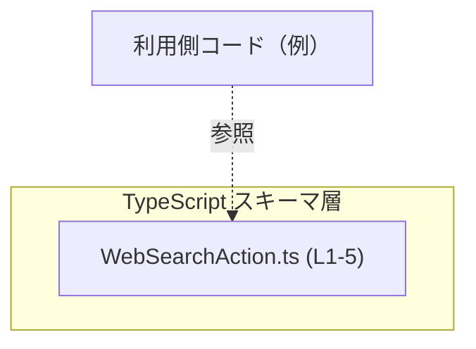
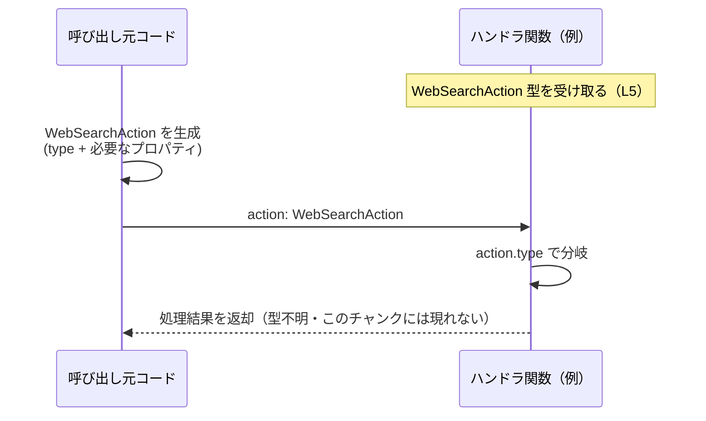

# app-server-protocol/schema/typescript/WebSearchAction.ts

## 0. ざっくり一言

- Web検索に関する複数種類のアクションを、`type` フィールドで判別する **判別可能ユニオン型（discriminated union）** `WebSearchAction` として定義した、自動生成の TypeScript 型定義ファイルです（`WebSearchAction.ts:L1-3, L5-5`）。

---

## 1. このモジュールの役割

### 1.1 概要

- このモジュールは、文字列リテラル `"search" | "open_page" | "find_in_page" | "other"` を `type` フィールドに持つ4種類のオブジェクトのユニオン型 `WebSearchAction` をエクスポートします（`WebSearchAction.ts:L5-5`）。
- 各バリアントは、検索クエリやURL、検索パターンなどを表すオプションの文字列プロパティ（`query`, `queries`, `url`, `pattern`）を持ちます（`WebSearchAction.ts:L5-5`）。
- ファイル先頭コメントから、この型は Rust 側の型定義から `ts-rs` により自動生成されており、手動編集は想定されていません（`WebSearchAction.ts:L1-3`）。

### 1.2 アーキテクチャ内での位置づけ

- パス `app-server-protocol/schema/typescript/WebSearchAction.ts` から、このファイルは「アプリケーションサーバのプロトコル・スキーマを TypeScript で表現する層」の一部として配置されていると読み取れます（パス情報）。
- このファイル自体には `import` / `require` などの依存は一切なく、他モジュールに依存しない **単独の型定義モジュール** です（`WebSearchAction.ts:L5-5`）。
- 逆向き（誰がこの型を使うか）については、このチャンクには import 情報などが存在しないため、具体的な依存元は分かりません。

概念的な位置づけを、依存関係図として示します（あくまで構造レベルの図であり、利用側モジュール名は仮のラベルです）。



### 1.3 設計上のポイント

- **自動生成コード**
  - 「GENERATED CODE! DO NOT MODIFY BY HAND!」というコメントがあり（`WebSearchAction.ts:L1-1`）、`ts-rs` で生成されたコードであることが明示されています（`WebSearchAction.ts:L3-3`）。
- **判別可能ユニオン（discriminated union）**
  - すべてのバリアントが `"type"` プロパティを持ち、その値によりバリアントを判別できる構造になっています（`WebSearchAction.ts:L5-5`）。
- **オプションプロパティ**
  - `query?`, `queries?`, `url?`, `pattern?` はすべてオプションであり、対応するバリアントであっても `undefined` の可能性があります（`WebSearchAction.ts:L5-5`）。
- **純粋なデータ構造**
  - 関数・メソッド・クラスなどの振る舞いは一切定義されておらず、**データ形状だけを表す型** です（`WebSearchAction.ts:L5-5`）。

---

## 2. 主要な機能一覧

このファイルは関数を提供せず、1つの型 `WebSearchAction` が表現する「アクションの種類」が主な「機能」に相当します（`WebSearchAction.ts:L5-5`）。

- `"search"` バリアント: 検索アクションを表すオブジェクト（`query?`, `queries?`）  
  ※名称とプロパティ名からそのように解釈できますが、用途の詳細はこのチャンクからは分かりません。
- `"open_page"` バリアント: ページを開くアクションを表すオブジェクト（`url?`）
- `"find_in_page"` バリアント: ページ内検索アクションを表すオブジェクト（`url?`, `pattern?`）
- `"other"` バリアント: 上記以外のアクションを表すフォールバック用オブジェクト（追加プロパティは定義されていません）

---

## 3. 公開 API と詳細解説

### 3.1 型一覧（構造体・列挙体など）

このファイルで公開されている型は1つだけです。

| 名前              | 種別               | 役割 / 用途の概要                                                                                                                                              | 定義位置                         |
|-------------------|--------------------|---------------------------------------------------------------------------------------------------------------------------------------------------------------|----------------------------------|
| `WebSearchAction` | 判別可能ユニオン型 | `"type"` フィールドで4種類（`"search"`, `"open_page"`, `"find_in_page"`, `"other"`）のアクションオブジェクトを表すユニオン型。追加のオプション文字列プロパティを持つ。 | `WebSearchAction.ts:L5-5` |

#### `WebSearchAction` の構造（根拠）

```ts
export type WebSearchAction =
  { "type": "search",     query?: string,         queries?: Array<string>, } |
  { "type": "open_page",  url?: string,                                     } |
  { "type": "find_in_page", url?: string, pattern?: string,                 } |
  { "type": "other" };
```

（整形。元コード: `WebSearchAction.ts:L5-5`）

### 3.2 関数詳細（このファイルには関数なし）

- このファイルには、関数・メソッド・クラスなどの実行可能な API は一切定義されていません（`export` されているのは `type WebSearchAction` のみです。`WebSearchAction.ts:L5-5`）。
- そのため、「関数詳細」テンプレートに従って詳述すべき対象となる関数はありません。

代わりに、本ファイルの主要な公開 API である `WebSearchAction` 型について、関数テンプレートに近い形で詳細を整理します。

#### `WebSearchAction`（判別可能ユニオン型）

**概要**

- `WebSearchAction` は、`type` プロパティに応じて4種類のオブジェクト形状のいずれかになるユニオン型です（`WebSearchAction.ts:L5-5`）。
- TypeScript の型システム上は、`type` プロパティで **絞り込み（ナローイング）** を行うことで、安全に各バリアント固有のプロパティにアクセスできます。

**プロパティ**

| プロパティ名 | 型                                | 説明 / 備考                                                                                             | 出現バリアント                              | 根拠 |
|--------------|-----------------------------------|--------------------------------------------------------------------------------------------------------|---------------------------------------------|------|
| `type`       | `"search" \| "open_page" \| "find_in_page" \| "other"` | バリアントを識別するための文字列リテラル型。全バリアントで必須プロパティです。                                   | すべて                                      | `WebSearchAction.ts:L5-5` |
| `query`      | `string`（オプション）           | 検索クエリを表すと考えられる文字列。`"search"` バリアントのオプションプロパティです。                           | `"search"`                                  | `WebSearchAction.ts:L5-5` |
| `queries`    | `Array<string>`（オプション）    | 複数の検索クエリを表すと考えられる文字列配列。`"search"` バリアントのオプションプロパティです。               | `"search"`                                  | `WebSearchAction.ts:L5-5` |
| `url`        | `string`（オプション）           | URL（ページ位置）を表すと考えられる文字列。`"open_page"` と `"find_in_page"` バリアントのオプションプロパティです。 | `"open_page"`, `"find_in_page"`             | `WebSearchAction.ts:L5-5` |
| `pattern`    | `string`（オプション）           | ページ内で検索するパターンを表すと考えられる文字列。`"find_in_page"` バリアントのオプションプロパティです。    | `"find_in_page"`                            | `WebSearchAction.ts:L5-5` |

※ プロパティの意味は名前からの推測を含みますが、実際の仕様や用途はこのチャンクからは断定できません。

**内部処理の流れ（アルゴリズム）**

- この型は純粋なデータ構造であり、内部処理やアルゴリズムは存在しません。そのため、この項目は該当しません。

**Examples（使用例）**

1. 基本的な4バリアントの生成と使用例

```ts
// WebSearchAction 型をインポートする（実際のパスはプロジェクト構成に依存）
import type { WebSearchAction } from "./WebSearchAction";  // パスは例

// "search" バリアントの例
const searchAction: WebSearchAction = {
  type: "search",              // バリアントを識別する必須フィールド
  query: "rust tutorial",      // 単一クエリ（オプション）
  // queries は省略可能
};

// "open_page" バリアントの例
const openPageAction: WebSearchAction = {
  type: "open_page",
  url: "https://example.com",  // 開くページの URL（オプション）
};

// "find_in_page" バリアントの例
const findInPageAction: WebSearchAction = {
  type: "find_in_page",
  url: "https://example.com/article",
  pattern: "TypeScript",       // ページ内で探す文字列（オプション）
};

// "other" バリアントの例
const otherAction: WebSearchAction = {
  type: "other",               // 追加プロパティは定義されていない
};
```

1. `type` で判別して安全に扱う処理の例

```ts
import type { WebSearchAction } from "./WebSearchAction";

// WebSearchAction を受け取って、バリアントごとに処理を分岐する関数
function handleWebSearchAction(action: WebSearchAction): void {
  switch (action.type) {
    case "search":
      // query と queries はオプションのため、存在チェックが必要
      if (action.query) {
        console.log("単一クエリで検索:", action.query);
      } else if (action.queries && action.queries.length > 0) {
        console.log("複数クエリで検索:", action.queries);
      } else {
        console.log("検索クエリが指定されていません");
      }
      break;

    case "open_page":
      if (action.url) {
        console.log("ページを開く:", action.url);
      } else {
        console.log("URL が指定されていません");
      }
      break;

    case "find_in_page":
      if (action.url && action.pattern) {
        console.log(`ページ内検索: ${action.url} 内で "${action.pattern}" を探す`);
      } else {
        console.log("URL または pattern が不足しています");
      }
      break;

    case "other":
      console.log("その他のアクション");
      break;

    // default は不要だが、追加バリアントに備えて never チェックを挟むことも可能
  }
}
```

**Errors / Panics（型安全性・エラー）**

- このファイルには実行時コードがなく、**ランタイムのエラーやパニックを発生させる処理は存在しません。**
- TypeScript の型チェックにより、次のような誤りはコンパイル時エラーになります（例）：
  - `type` に定義外の文字列を代入しようとした場合  
    （例: `type: "search_page"` は `WebSearchAction` に代入不可。`WebSearchAction.ts:L5-5` で許可される値が限定されているため）
  - `query` に数値を渡すなど、プロパティ型が一致しない場合
- いっぽう、プロパティがオプションであるため、**存在チェックをせずに使用すると実行時に `undefined` になる可能性**があります。これは型システム上はエラーではなく、呼び出し側のロジックで扱う必要があります。

**Edge cases（エッジケース）**

- `"search"` バリアントで `query` も `queries` も指定されていないオブジェクトは、型としては許容されます（両方 `?` であるため）。  
  → 呼び出し側で「クエリがない状態」をどう扱うかを決める必要があります。
- `"open_page"` や `"find_in_page"` バリアントで `url` が省略されている場合も、型としては許容されます。  
  → 実際にページ移動などを行う処理では、`url` の存在チェックとバリデーションが必要になります。
- `"find_in_page"` バリアントで `pattern` が空文字列や `undefined` の場合の扱いも、型では規定されていません。
- `"other"` バリアントは追加プロパティを持たない定義ですが、TypeScript の構造的型付けの性質上、利用シーンによっては追加フィールドを持つオブジェクトも代入可能なケースがあります（とくに変数経由の代入時）。  
  → どのプロパティを実際に参照するかは利用側の実装次第になります。

**使用上の注意点**

- ファイル先頭に「DO NOT MODIFY BY HAND」とあるように、**この TypeScript ファイルを直接編集しないことが前提**です。変更が必要な場合は、元になっている Rust 側の型定義を変更し、`ts-rs` で再生成する必要があります（`WebSearchAction.ts:L1-3`）。
- すべての追加プロパティ（`query`, `queries`, `url`, `pattern`）はオプションであるため、利用時には `undefined` を考慮したロジックが必要です。
- この型は **型レベルの制約のみ** を提供し、入力値の妥当性チェックやサニタイズなどは一切行いません。検索クエリや URL にユーザ入力が入る場合、XSS や SSRF などのセキュリティ対策は別途実装する必要があります。
- 並行性・スレッド安全性に関する情報はありませんが、型定義のみであり、共有ミュータブル状態も保持しないため、この型自体が並行アクセスに起因する問題を引き起こすことはありません。

### 3.3 その他の関数

- このファイルには補助的な関数やラッパー関数は一切定義されていません（`WebSearchAction.ts:L1-5`）。

---

## 4. データフロー

このファイルには実際の処理関数はないため、「データフロー」はあくまで **`WebSearchAction` 型を利用する典型的なコードのイメージ**として説明します。実際にどのようなコンポーネントが存在するかは、このチャンクからは分かりません。

### 4.1 代表的なシナリオ（概念図）

- あるコンポーネントが `WebSearchAction` 型の値を生成します（`type` と必要なプロパティをセット）。
- 生成された値は、ハンドラ関数やサービスに渡され、`type` に応じて処理が分岐します。
- ハンドラ内部では、`type` に応じて `query`, `queries`, `url`, `pattern` を参照し、実際の検索・ページ遷移・ページ内検索などを行うことが想定されます（用途は名称からの推測）。



---

## 5. 使い方（How to Use）

### 5.1 基本的な使用方法

以下は、`WebSearchAction` 型の値を生成し、ハンドラ関数で処理する典型的なコードフローの例です（すべて例示であり、実際のプロジェクト構成や関数名はこのチャンクからは分かりません）。

```ts
// 1. 型のインポート
import type { WebSearchAction } from "./WebSearchAction";  // パスはプロジェクトに合わせて調整

// 2. メイン処理: WebSearchAction を受け取って処理する
function handleAction(action: WebSearchAction): void {
  switch (action.type) {
    case "search":
      // query / queries はオプションなので存在確認を行う
      if (action.query) {
        // 単一クエリ
        console.log("検索:", action.query);
      } else if (action.queries) {
        // 複数クエリ
        console.log("複数検索:", action.queries.join(", "));
      } else {
        console.log("検索クエリが未指定です");
      }
      break;

    case "open_page":
      if (action.url) {
        console.log("ページを開く:", action.url);
      } else {
        console.log("URL が未指定です");
      }
      break;

    case "find_in_page":
      if (action.url && action.pattern) {
        console.log(`"${action.pattern}" を ${action.url} 内で検索`);
      } else {
        console.log("URL または pattern が不足しています");
      }
      break;

    case "other":
      console.log("その他のアクション");
      break;
  }
}

// 3. 呼び出し側: WebSearchAction を構築して handleAction を呼ぶ
const action: WebSearchAction = {
  type: "search",
  query: "typescript discriminated union",
};

handleAction(action);
```

### 5.2 よくある使用パターン

1. **単一クエリでの検索**

```ts
const searchBySingleQuery: WebSearchAction = {
  type: "search",
  query: "rust book",  // 単一クエリ
};
```

1. **複数クエリをまとめて扱う**

```ts
const searchByMultipleQueries: WebSearchAction = {
  type: "search",
  queries: ["rust book", "typescript handbook"],
};
```

1. **ページを開く**

```ts
const openPage: WebSearchAction = {
  type: "open_page",
  url: "https://example.com/docs",
};
```

1. **ページ内検索**

```ts
const findInPage: WebSearchAction = {
  type: "find_in_page",
  url: "https://example.com/blog",
  pattern: "WebSearchAction",
};
```

### 5.3 よくある間違い

1. **オプションプロパティを存在チェックせずに使う**

```ts
import type { WebSearchAction } from "./WebSearchAction";

function wrongUsage(action: WebSearchAction) {
  if (action.type === "search") {
    // 間違い例: query を必ずある前提で使っている
    console.log(action.query.toUpperCase()); // コンパイルエラー: query は string | undefined
  }
}

// 正しい例
function correctUsage(action: WebSearchAction) {
  if (action.type === "search" && action.query) {
    console.log(action.query.toUpperCase()); // OK: query が string として絞り込まれている
  }
}
```

1. **`switch` で `"other"` バリアントを処理し忘れる**

```ts
function handleActionIncomplete(action: WebSearchAction) {
  switch (action.type) {
    case "search":
      // ...
      break;
    case "open_page":
      // ...
      break;
    case "find_in_page":
      // ...
      break;
    // "other" を処理していない → 将来の仕様変更時にバグの原因になり得る
  }
}
```

`"other"` を含めた上で、`never` チェックなどを用いると将来の追加バリアントにも気付きやすくなります。

### 5.4 使用上の注意点（まとめ）

- **自動生成ファイルであること**
  - `WebSearchAction.ts` は `ts-rs` による生成コードであり、コメントにある通り手動編集は避ける必要があります（`WebSearchAction.ts:L1-3`）。
- **オプションプロパティの存在チェック**
  - `query`, `queries`, `url`, `pattern` はすべてオプションであり、`undefined` を想定したロジックを組み立てる必要があります。
- **入力値の妥当性**
  - 型定義は文字列であることだけを保証し、文字列表現が有効な URL か、空でないクエリか、といった妥当性までは保証しません。
- **セキュリティ**
  - URL のオープンやクエリの表示などで外部入力を扱う場合、XSS・CSRF・SSRF などのリスクに対する防御は別途実装が必要です。この型は防御ロジックを提供しません。
- **並行性**
  - この型自体はイミュータブルなデータ構造の表現に過ぎず、スレッドやイベントループとの直接的な関係はありません。複数の非同期処理で共有しても、型自体が競合状態を引き起こすことはありません。

---

## 6. 変更の仕方（How to Modify）

### 6.1 新しい機能を追加する場合

※ ここでいう「新しい機能」は、`WebSearchAction` に新しいバリアントやプロパティを追加することを指します。

- **直接編集しない**
  - コメントに `GENERATED CODE! DO NOT MODIFY BY HAND!` とある通り、この TypeScript ファイルを直接編集することは想定されていません（`WebSearchAction.ts:L1-1`）。
- **元となる Rust 側の定義を変更**
  - `ts-rs` は Rust の型定義から TypeScript の型を自動生成するツールであるとコメントで説明されています（`WebSearchAction.ts:L3-3`）。
  - 新しいバリアント（例: `"autocomplete"` など）やプロパティを追加するには、**対応する Rust の型定義** を変更し、`ts-rs` で再生成する必要があります。  
    → ただし、その Rust ファイルの具体的な場所や型名は、このチャンクからは分かりません。
- **利用側コードの更新**
  - 追加したバリアントを正しく扱うために、`switch (action.type)` のような処理分岐を行っているすべての箇所を更新する必要があります。  
    → どこで使われているかは、このチャンクだけからは特定できません。

### 6.2 既存の機能を変更する場合

- `type` の値を変更したり、プロパティ名や型を変更する場合も、同様に **Rust 側の元定義を変更して再生成** するのが前提です（`WebSearchAction.ts:L1-3`）。
- 変更時の注意点:
  - `type` の文字列リテラルを変更すると、既存の利用側コード（`switch` 文など）がコンパイルエラーになる可能性があります。
  - オプションを必須に変更したり、その逆を行うと、代入しているオブジェクトリテラル側に修正が必要になります。
  - `url` や `query` の型を `string` 以外に変えると、既存コードがコンパイルエラーになる可能性が高いです。
- 影響範囲:
  - どのファイルが `WebSearchAction` を import しているかは、このチャンクには現れません。実際のリポジトリでは、IDE などで参照先検索を行うことが推奨されます。

---

## 7. 関連ファイル

このチャンクから確実に分かる関連情報のみを列挙します。

| パス / 情報                                       | 役割 / 関係                                                                                         |
|--------------------------------------------------|------------------------------------------------------------------------------------------------------|
| `app-server-protocol/schema/typescript/WebSearchAction.ts` | 本ドキュメントの対象。`WebSearchAction` 判別可能ユニオン型を定義する自動生成 TypeScript ファイル。        |
| Rust 側の対応する型定義（パス不明）             | コメントから `ts-rs` による自動生成元であることが分かるが、具体的なファイルパスや型名はこのチャンクからは不明（`WebSearchAction.ts:L3-3`）。 |
| `ts-rs`（外部ツール）                            | Rust の型から TypeScript の型定義を生成するツール。コメントで参照 URL が示されている（`WebSearchAction.ts:L3-3`）。 |

- `WebSearchAction` を実際に import / 使用している TypeScript ファイルは、このチャンクには現れないため、一覧化できません。
