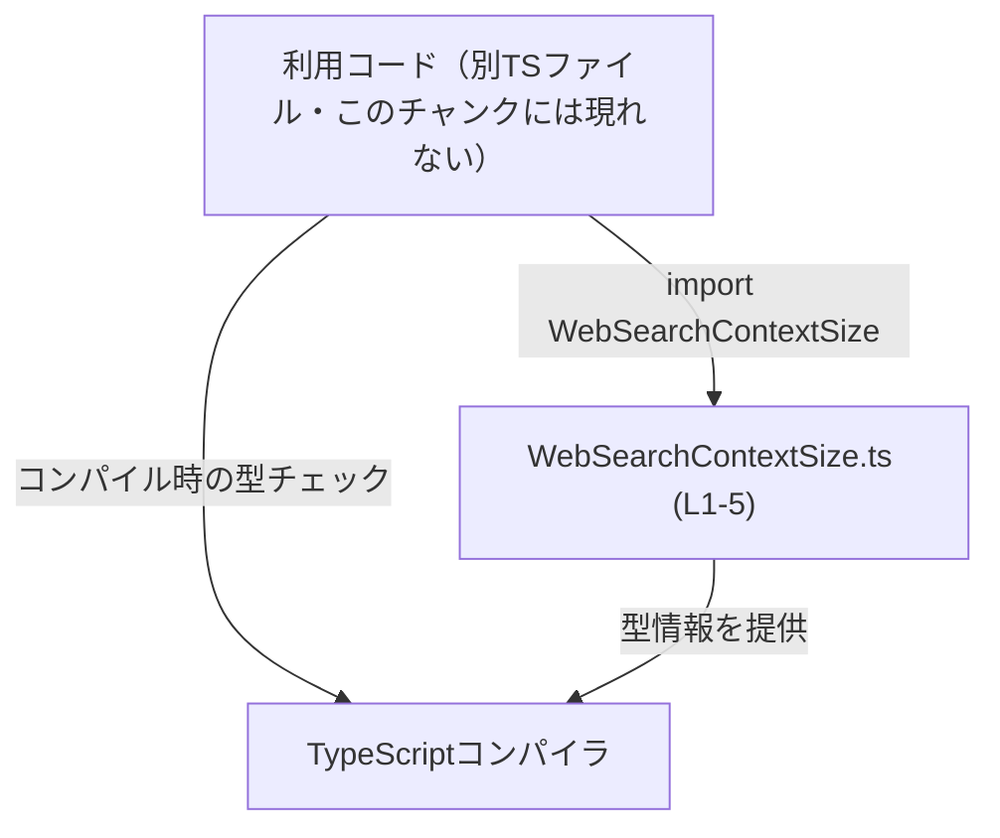
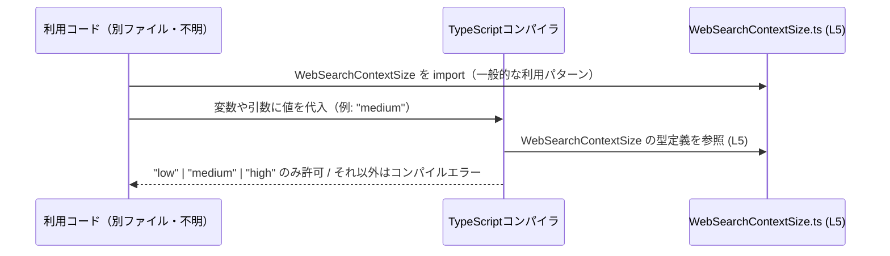

# app-server-protocol/schema/typescript/WebSearchContextSize.ts

## 0. ざっくり一言

- Web検索におけるコンテキストサイズを `"low" | "medium" | "high"` の3種類の文字列で表現する、TypeScriptの文字列リテラル型エイリアスを定義するファイルです（`WebSearchContextSize.ts:L5-5`）。

---

## 1. このモジュールの役割

### 1.1 概要

- このモジュールは、Web検索の「コンテキストサイズ」を表す値を、**あらかじめ決められた3つの文字列に限定するための型**を提供します（`WebSearchContextSize.ts:L5-5`）。
- ファイル先頭のコメントから、この型定義は `ts-rs` というツールにより**自動生成**されており、手動で編集しない前提になっています（`WebSearchContextSize.ts:L1-3`）。

### 1.2 アーキテクチャ内での位置づけ

- ファイルパスから、`app-server-protocol/schema/typescript` 配下にある **プロトコルスキーマの TypeScript 表現の一部**であることが分かります。
- `export type` で公開されているため、他の TypeScript ファイルから import されて使われることが想定されます（一般的な TypeScript の利用パターンに基づく説明であり、このチャンク内には具体的な import 元コードは現れません）。

概念的な依存関係は次のように整理できます。



- この図は、「`WebSearchContextSize` 型が他のコードから import され、コンパイル時に型チェックに利用される」という一般的な流れを表しています。実際の利用元ファイル名や構造は、このチャンクには現れていません。

### 1.3 設計上のポイント

- **自動生成ファイル**  
  - 先頭コメントに「GENERATED CODE」「Do not edit this file manually」と明記されています（`WebSearchContextSize.ts:L1-3`）。  
    → 設計として、このファイルは生成物であり、変更は生成元（このチャンクには現れない）で行う想定です。
- **状態やロジックを持たない**  
  - 定義されているのは1つの型エイリアスのみで、関数やクラス、実行時ロジックは一切ありません（`WebSearchContextSize.ts:L5-5`）。
- **閉じた集合の表現**  
  - `"low" | "medium" | "high"` という **有限の文字列リテラルのユニオン型**により、コンテキストサイズを3パターンに限定する設計です（`WebSearchContextSize.ts:L5-5`）。
- **エラーハンドリングの方針**  
  - この型はコンパイル時の型チェックにのみ関与し、実行時のエラー処理ロジックは含みません。  
    → 不正な値は TypeScript のコンパイルエラーとして検出され、実行時例外ではありません。

---

## 2. 主要な機能一覧

- `WebSearchContextSize` 型: Web検索のコンテキストサイズを `"low" | "medium" | "high"` の3段階に限定する文字列リテラル型（`WebSearchContextSize.ts:L5-5`）。
- 型レベル制約: コンパイル時に、これ以外の文字列が使われた場合に型エラーとすることで、値のばらつきを防ぐ役割を持ちます（TypeScript の一般的な文字列リテラル型の挙動に基づく説明）。

---

## 3. 公開 API と詳細解説

### 3.1 型一覧（構造体・列挙体など）

| 名前                   | 種別                            | 役割 / 用途                                                                 | 根拠 |
|------------------------|---------------------------------|------------------------------------------------------------------------------|------|
| `WebSearchContextSize` | 文字列リテラル型ユニオンの型エイリアス | Web検索コンテキストのサイズを `"low"`, `"medium"`, `"high"` のいずれかに限定して表現する | `WebSearchContextSize.ts:L5-5` |

#### `WebSearchContextSize`

**概要**

- `"low" | "medium" | "high"` の3つの文字列だけを許可する、文字列リテラル型ユニオンの型エイリアスです（`WebSearchContextSize.ts:L5-5`）。
- これにより、「コンテキストサイズ」が取りうる値の集合を静的に限定できます。

**定義**

```typescript
export type WebSearchContextSize = "low" | "medium" | "high"; // Web検索コンテキストサイズを3つの文字列で表す型
```

**意味**

- `"low"`: 小さいコンテキストサイズ（具体的な意味や数値は、このチャンクには現れません）
- `"medium"`: 中程度のコンテキストサイズ
- `"high"`: 大きいコンテキストサイズ  
※ これらの文字列の具体的なビジネス上の意味や処理内容は、別のモジュール側に依存し、このチャンクからは分かりません。

**型としての契約（Contract）**

- この型を使うコードは、**必ず `"low"`, `"medium"`, `"high"` のいずれかだけを扱う**ことが前提になります。
- それ以外の文字列（例: `"Low"`, `"HIGH"`, `"small"` など）を代入しようとすると、TypeScript のコンパイルエラーとなります。

**Edge cases（エッジケース）**

- 大文字・小文字違い: `"Low"` や `"HIGH"` は許可されません（文字列リテラル型は値を厳密に比較するため）。
- 余計な空白を含む文字列: `" low"` や `"medium "` なども別の文字列と見なされ、許可されません。
- `string` 型変数: 型が単なる `string` の変数は、この型に代入できません（`string` は `"low" | "medium" | "high"` より広い型のため）。代入するには、型を絞るか型アサーションが必要になります。

**使用上の注意点**

- この型は **コンパイル時専用** であり、実行時には特別なチェックは行われません。  
  外部から受け取った文字列（APIレスポンスやユーザー入力など）がこの型に合致するかどうかは、別途ランタイムバリデーションが必要になります。
- 自動生成ファイルであるため、値の候補（low/medium/high）を変更したい場合でも、このファイルを直接編集するべきではありません（`WebSearchContextSize.ts:L1-3`）。生成元（このチャンクには現れない）を変更して再生成する必要があります。

### 3.2 関数詳細（最大 7 件）

- このファイルには関数・メソッドは定義されていません（`WebSearchContextSize.ts:L1-5` 全体を見ても、`export type` 以外の実行可能なコードは存在しません）。

### 3.3 その他の関数

- 補助関数やラッパー関数なども、このチャンクには一切現れません。

---

## 4. データフロー

このファイル単体には実行時ロジックがないため、**コンパイル時の型チェックの流れ**という観点でデータ（値と型情報）の流れを説明します。

### 4.1 コンパイル時の型チェックフロー（概念図）



- `S` は、このファイル内の `WebSearchContextSize` 定義そのものを表しています（`WebSearchContextSize.ts:L5-5`）。
- 利用コードや具体的な関数名は、このチャンクには現れないため、図では抽象的に「利用コード」としています。
- 実際の実行時には型情報は削除されるため、`WebSearchContextSize` 自体は JavaScript のランタイムには存在しません（TypeScript の一般的仕様に基づく説明）。

---

## 5. 使い方（How to Use）

### 5.1 基本的な使用方法

この型を利用して、コンテキストサイズを表す変数やプロパティに **許可された3値のみ** を割り当てる例です。  
import パスはプロジェクト構成に依存するため、ここでは仮の相対パスを用いています。

```typescript
import type { WebSearchContextSize } from "./WebSearchContextSize"; // WebSearchContextSize型をインポート（パスはプロジェクトに応じて調整する）

const size: WebSearchContextSize = "medium";                        // 許可された3つの文字列の1つを代入（コンパイル時に型チェックされる）

// const invalid: WebSearchContextSize = "MEDIUM";                  // コンパイルエラーの例: "MEDIUM" は定義されていない文字列リテラル
```

- `size` には `"low"`, `"medium"`, `"high"` のいずれかしか代入できません。
- コメントアウトしている `invalid` の行のような値は、TypeScript コンパイル時にエラーになります。

### 5.2 よくある使用パターン

#### 5.2.1 オプションオブジェクトでの利用

検索処理用のオプション型に `WebSearchContextSize` を組み込む例です。

```typescript
import type { WebSearchContextSize } from "./WebSearchContextSize"; // WebSearchContextSize型をインポート

interface WebSearchOptions {                                       // Web検索のオプション全体を表すインターフェース
    query: string;                                                 // 検索クエリ文字列
    contextSize: WebSearchContextSize;                             // コンテキストサイズは "low" | "medium" | "high" のいずれか
}

function runWebSearch(options: WebSearchOptions) {                 // Web検索を実行する関数の例
    console.log(options.query, options.contextSize);               // ここで contextSize に応じた処理を行う（例としてログ出力）
}
```

- `WebSearchOptions` の `contextSize` フィールドは、3つの文字列以外を受け付けません。
- `runWebSearch` を呼ぶ側で、`contextSize: "low"` などの形で使用することが想定されます（このチャンクには呼び出し側は現れません）。

#### 5.2.2 既定値との組み合わせ

既定値を `"medium"` にしつつ、必要に応じて上書きできるようにする例です。

```typescript
import type { WebSearchContextSize } from "./WebSearchContextSize"; // WebSearchContextSize型をインポート

const DEFAULT_CONTEXT_SIZE: WebSearchContextSize = "medium";        // 既定のコンテキストサイズを定義

function normalizeContextSize(                                      // コンテキストサイズを正規化する関数の例
    size?: WebSearchContextSize                                    // 引数は省略可能な WebSearchContextSize
): WebSearchContextSize {                                          // 戻り値も WebSearchContextSize
    return size ?? DEFAULT_CONTEXT_SIZE;                           // 渡されていなければ既定値を返す
}
```

- `normalizeContextSize` のように、関数の引数や戻り値の型として使うことで、関数間の契約としても利用できます。

### 5.3 よくある間違い

#### 5.3.1 単なる `string` として扱ってしまう

```typescript
import type { WebSearchContextSize } from "./WebSearchContextSize"; // WebSearchContextSize型をインポート

let sizeStr: string = "medium";                                     // 一般的な文字列として値を保持している

// NG例（コンパイルエラー）
// const size: WebSearchContextSize = sizeStr;                      // string型は "low" | "medium" | "high" より広いので、そのまま代入できない

// 正しい例: 型を絞り込む、または型アサーションを行う必要がある
const sizeOk: WebSearchContextSize = "medium";                      // 直接リテラルを指定すれば型が一致する
```

- `string` 型の値は、`WebSearchContextSize` に直接代入できません。
- 外部から受け取った文字列をこの型に変換したい場合は、ランタイムで値をチェックし、問題ない場合に限り型アサーションを使う、といった対応が必要です。

#### 5.3.2 大文字・小文字の違いを見落とす

```typescript
import type { WebSearchContextSize } from "./WebSearchContextSize"; // WebSearchContextSize型をインポート

// NG例（コンパイルエラー）
// const sizeInvalid: WebSearchContextSize = "High";                // "High" は定義されていない文字列リテラル

const sizeValid: WebSearchContextSize = "high";                     // 定義通りの小文字の "high" は有効
```

- 文字列リテラル型は **完全一致** で比較されます。大文字小文字の違いも別の値として扱われる点に注意が必要です。

### 5.4 使用上の注意点（まとめ）

- **実行時の安全性**  
  - この型はコンパイル時にのみ効力を持ちます。  
    外部入力やシリアライズされたデータに対しては、**別途ランタイムバリデーション**を行わない限り、実行時に `"low" | "medium" | "high"` 以外の値が紛れ込む可能性があります。
- **ケースセンシティブ**  
  - `"low"`, `"LOW"`, `"Low"` はすべて異なる値として扱われます。定義された文字列と完全に一致する必要があります。
- **自動生成ファイルの編集禁止**  
  - ファイル先頭に「Do not edit this file manually」と明記されているため（`WebSearchContextSize.ts:L1-3`）、**このファイルを直接編集して値の候補を増減させることは推奨されません**。
- **並行性・パフォーマンスへの影響**  
  - 実行時には存在しない純粋な型定義のため、スレッド安全性の問題やパフォーマンスへの影響はありません（JavaScript ランタイムには型情報が残らない、という TypeScript の一般仕様に基づく説明です）。

---

## 6. 変更の仕方（How to Modify）

### 6.1 新しい機能を追加する場合

このファイルは自動生成であり、手動編集禁止と明記されているため（`WebSearchContextSize.ts:L1-3`）、**直接の編集は前提とされていません**。

- 例として `"very_high"` のような新しいコンテキストサイズを追加したい場合:
  1. 変更すべきなのは **このファイルではなく生成元の定義**（このチャンクには現れません）です。
  2. 生成元（おそらく ts-rs の入力側定義）を更新したうえで、ts-rs によるコード生成プロセスを再実行して、このファイルを再生成する必要があります。
- このチャンクからは生成元の場所や形式は分からないため、具体的にどのファイルを直すかは不明です。

### 6.2 既存の機能を変更する場合

- 既存の `"low"`, `"medium"`, `"high"` の意味やマッピングを変えたい場合も、やはり生成元を変更して再生成する必要があります。
- 変更時に注意すべき点:
  - **型の契約変更**:  
    - 既存コードは `"low" | "medium" | "high"` のいずれかを前提としているため、この集合を変えると利用側コードにも影響が及びます。
  - **影響範囲の確認**:  
    - `WebSearchContextSize` を import している全ての TypeScript ファイル（このチャンクには現れない）で、コンパイルエラーや動作の変化が発生しないか確認する必要があります。

---

## 7. 関連ファイル

このチャンクから直接わかる関連は、ファイルパスに含まれるディレクトリ名のみです。具体的な他ファイル名や内容は、このチャンクには現れません。

| パス                                           | 役割 / 関係 |
|----------------------------------------------|------------|
| `app-server-protocol/schema/typescript/`     | 本ファイル `WebSearchContextSize.ts` が配置されているディレクトリです。ディレクトリ名から、アプリケーションサーバのプロトコルスキーマを TypeScript で表現したファイル群を置く場所である可能性がありますが、他のファイルの具体的な内容はこのチャンクからは分かりません。 |

- テストコードや他のスキーマ型（例: 別の `.ts` ファイル）の存在は、このチャンクには現れないため「不明」です。

---
