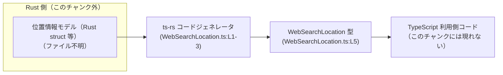
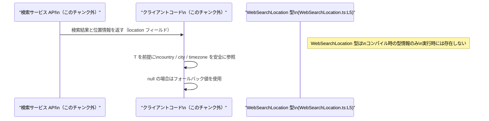

# app-server-protocol/schema/typescript/WebSearchLocation.ts

## 0. ざっくり一言

- Web 検索に関連する位置情報（国・地域・都市・タイムゾーン）を表す **TypeScript の型定義**です（`WebSearchLocation.ts:L5`）。
- `ts-rs` によって Rust 側から自動生成されており、**手動で編集しないこと**が明示されています（`WebSearchLocation.ts:L1-3`）。

---

## 1. このモジュールの役割

### 1.1 概要

- このモジュールは、Web 検索に紐づく「位置情報」を TypeScript 上で表現するための **スキーマ（型情報）** を提供します（`WebSearchLocation.ts:L5`）。
- 実行時のロジックや関数は持たず、**コンパイル時の型チェックと IDE 補完のための型情報**のみを定義します。
- コメントから、この型は Rust 側の定義をもとに `ts-rs` により自動生成されていることが分かります（`WebSearchLocation.ts:L1-3`）。

### 1.2 アーキテクチャ内での位置づけ

- ファイルパス `app-server-protocol/schema/typescript` から、この型が **アプリケーションサーバのプロトコル・スキーマを TypeScript 向けに表現したもの**と解釈できます（パス名からの推測です）。
- コメントより、Rust 側のモデル → `ts-rs` → この TypeScript 型 というコード生成パイプラインが存在すると読み取れます（`WebSearchLocation.ts:L1-3`）。



- 上図は、**Rust 側モデルから本ファイルが自動生成され、さらに TypeScript コードから利用される**という一般的な流れを示しています。Rust 側の具体的なファイルや利用側コードの詳細は、このチャンクには現れません。

### 1.3 設計上のポイント

- **自動生成コードであること**  
  - 冒頭コメントで「GENERATED CODE」「Do not edit this file manually」と明示されています（`WebSearchLocation.ts:L1-3`）。  
  - 設計として、このファイルは **読み取り専用** として扱う前提になっています。
- **型のみ定義し、実行時のロジックを持たない**  
  - `export type WebSearchLocation = { ... };` の 1 行のみで、クラスや関数は存在しません（`WebSearchLocation.ts:L5`）。  
  - 実行時にはこの型定義は消え、**コンパイル時の型チェック専用**です（TypeScript の仕様による）。
- **プロパティは「必須だが値は null を許容」**  
  - `country`, `region`, `city`, `timezone` はいずれも `string | null` 型で、キー自体は必須、値として `null` が許されます（`WebSearchLocation.ts:L5`）。  
  - 呼び出し側は **null を常に考慮して扱う必要がある**という契約になります。
- **エラー / 並行性**  
  - このモジュール自体には実行時コードがなく、**例外スローや非同期処理、並行性に関する要素は存在しません**。  
  - 型の使い方を誤ると（例: null を考慮しない）、その利用側コードでランタイムエラーが発生しうる点のみ注意が必要です。

---

## 2. 主要な機能一覧（コンポーネントインベントリー）

このファイルが提供するコンポーネントは 1 つだけです。

- **WebSearchLocation 型**: Web 検索に関連する位置情報（国・地域・都市・タイムゾーン）を表すオブジェクトの形を定義します（`WebSearchLocation.ts:L5`）。

---

## 3. 公開 API と詳細解説

### 3.1 型一覧（構造体・列挙体など）＝コンポーネント一覧

| 名前               | 種別           | 役割 / 用途                                                                                  | 主なフィールド（型）                                                                                         | 定義位置                        |
|--------------------|----------------|-----------------------------------------------------------------------------------------------|--------------------------------------------------------------------------------------------------------------|---------------------------------|
| `WebSearchLocation` | 型エイリアス（オブジェクト型） | Web 検索結果などに付随する位置情報を表すデータ構造。クライアント側で型安全に扱うためのスキーマを提供します。 | `country: string \| null`, `region: string \| null`, `city: string \| null`, `timezone: string \| null` | `WebSearchLocation.ts:L5` |

> フィールドの意味（国 / 地域 / 都市 / タイムゾーン）は名称からの解釈であり、詳細な仕様はこのファイル単体からは分かりません。

#### フィールド詳細（`WebSearchLocation`）

いずれも **プロパティは必須** ですが、**値に `null` を取ることができます**（`WebSearchLocation.ts:L5`）。

| フィールド名 | 型              | 説明（名前からの解釈）                       | 契約上のポイント（型から読み取れる事実）                     |
|--------------|-----------------|----------------------------------------------|--------------------------------------------------------------|
| `country`    | `string \| null` | 国を表す文字列（国コードや国名などが想定されます） | `null` の可能性があるため、常に null チェックが必要です。   |
| `region`     | `string \| null` | 地域（州・県・地方など）が想定されます       | 同上。                                                        |
| `city`       | `string \| null` | 都市名が想定されます                         | 同上。                                                        |
| `timezone`   | `string \| null` | タイムゾーン（例: `"Asia/Tokyo"`）が想定されます | 同上。                                                        |

### 3.2 関数詳細（このファイルには関数なし）

- このファイルには **関数・メソッド・クラスの定義は存在しません**。  
  - 実体は `export type WebSearchLocation = { ... };` の型エイリアス 1 つのみです（`WebSearchLocation.ts:L5`）。
- したがって、エラー返却・panic・非同期処理・並行性など、関数レベルの挙動はこのチャンクからは読み取れません。

### 3.3 その他の関数

- 該当なし（ヘルパー関数やラッパー関数も定義されていません）。

---

## 4. データフロー

このファイル自体には処理ロジックがなく、純粋な型定義のみが存在します（`WebSearchLocation.ts:L5`）。  
ここでは、**「WebSearchLocation 型を利用したときに、データがどう流れるか」という典型的な利用イメージ**を示します。  
※ 以下はあくまで利用例であり、実際の実装がこの通りであるという情報は、このチャンクからは得られません。



要点:

- `WebSearchLocation` は **「位置情報オブジェクトの形」だけを決める**役割を持ちます（`WebSearchLocation.ts:L5`）。
- 実際のデータ（JSON など）は API など別コンポーネントから供給され、この型に沿ってパース・利用されると想定されます（API 名・実装はこのチャンクには現れません）。
- 型定義は **実行時には存在しない**ため、null ハンドリングを怠った場合のランタイムエラーは、利用側コードの責任になります。

---

## 5. 使い方（How to Use）

### 5.1 基本的な使用方法

`WebSearchLocation` 型を用いて、位置情報オブジェクトを扱う基本的な例です。

```typescript
// WebSearchLocation 型をインポートする（実際の相対パスはプロジェクト構成に依存します）
import type { WebSearchLocation } from "./WebSearchLocation";  // WebSearchLocation.ts:L5 に定義された型

// WebSearchLocation 型の値を作成する
const location: WebSearchLocation = {                          // 4 つのプロパティはすべて必須
    country: "JP",                                             // 国。null も許容される
    region: "Tokyo",                                           // 地域（例: 都道府県）
    city: null,                                                // 都市。情報がないので null
    timezone: "Asia/Tokyo",                                    // タイムゾーン ID
};

// 位置情報を整形して表示用の文字列を返す関数
function formatLocation(loc: WebSearchLocation): string {      // loc は WebSearchLocation 型
    const country = loc.country ?? "不明な国";                 // null の場合はフォールバック値を使用
    const region = loc.region ?? "不明な地域";                 // 同様に null 対応
    const city = loc.city ?? "";                               // city が null なら空文字
    const tz = loc.timezone ?? "タイムゾーン不明";             // timezone のフォールバック

    // フォーマットした文字列を返す
    return `${country} ${region} ${city} (${tz})`.trim();      // 余分なスペースを除去して返す
}

// 生成した location を使ってフォーマットする
const text = formatLocation(location);                         // text は string 型
console.log(text);                                             // => "JP Tokyo  (Asia/Tokyo)" など
```

ポイント:

- `import type` を使うことで、この型が **型チェック専用** であることを明示できます。
- すべてのプロパティが `string | null` なので、**`??`（null 合体演算子）などを用いて null を必ず処理**することが重要です。
- 型の安全性（TypeScript の静的型チェック）によって、`country` を number として扱う等の誤りをコンパイル時に検出できます。

### 5.2 よくある使用パターン

1. **検索結果オブジェクトの一部として使う**

```typescript
// 検索結果全体を表す型の一例（実際のプロジェクト構造とは限りません）
interface WebSearchResult {
    title: string;                          // 検索結果のタイトル
    url: string;                            // リンク URL
    location: WebSearchLocation;            // 位置情報。必ず存在するが中身は null を含みうる
}

// API からのレスポンスを受け取って使う想定
function handleResult(result: WebSearchResult) {
    // location.timezone が null の可能性を考慮した処理
    const tz = result.location.timezone ?? "タイムゾーン不明";
    console.log(`Timezone: ${tz}`);
}
```

1. **部分更新のために `Partial<WebSearchLocation>` を使う**

```typescript
// WebSearchLocation の一部だけ更新したい場合の例
function updateLocation(
    original: WebSearchLocation,              // 元の位置情報
    patch: Partial<WebSearchLocation>,        // 更新したいフィールドだけ渡す
): WebSearchLocation {
    // スプレッド構文でマージ（patch に存在するプロパティだけ上書き）
    return { ...original, ...patch };
}
```

### 5.3 よくある間違い

```typescript
import type { WebSearchLocation } from "./WebSearchLocation";

// 間違い例 1: 必須プロパティを省略している
const badLocation1: WebSearchLocation = {
    country: "JP",
    // region がない → コンパイルエラー（プロパティ 'region' が型に存在しない）
    // city, timezone も必須
};

// 正しい例: すべてのプロパティを指定し、値を null にできる
const okLocation: WebSearchLocation = {
    country: "JP",
    region: null,
    city: null,
    timezone: null,
};

// 間違い例 2: null を考慮せずにメソッド呼び出しを行う
function printCountry(loc: WebSearchLocation) {
    // コンパイルエラーにならない設定の場合でも、実行時に loc.country が null だとエラーになる
    console.log(loc.country.toUpperCase());   // Runtime Error の可能性
}

// 正しい例: null チェックを行う
function safePrintCountry(loc: WebSearchLocation) {
    if (loc.country) {                         // null / undefined でない場合のみ
        console.log(loc.country.toUpperCase());
    } else {
        console.log("国情報がありません");
    }
}
```

### 5.4 使用上の注意点（まとめ）

- **前提条件**
  - `WebSearchLocation` 型の値を作る際は、4 つのプロパティすべてを指定する必要があります（`WebSearchLocation.ts:L5`）。
- **null 取り扱い**
  - 各プロパティは `null` を取りうるため、**文字列メソッド呼び出し前には必ず null チェック**を行う必要があります。
- **型 vs 実行時**
  - TypeScript の型はコンパイル時のみ存在するため、実行時の JSON データがこの型に一致しているかどうかは別途検証が必要です（バリデーションはこのファイルには含まれません）。
- **編集禁止**
  - コメントで手動編集禁止が明示されているため、**直接このファイルを書き換えない**ことが重要です（`WebSearchLocation.ts:L1-3`）。

---

## 6. 変更の仕方（How to Modify）

このファイルは `ts-rs` によって自動生成されることがコメントで明示されています（`WebSearchLocation.ts:L1-3`）。  
したがって、**直接ファイルを編集するのではなく、生成元（おそらく Rust 側の型定義）を変更して再生成する**のが前提です。

### 6.1 新しい機能を追加する場合（例: 新しいフィールドを追加）

1. **生成元のモデルを特定する**
   - `ts-rs` は Rust の型から TypeScript の型を生成するライブラリであるため、対応する Rust の struct（例: `WebSearchLocation` に相当するもの）がどこかに存在すると考えられます（`WebSearchLocation.ts:L3` からの推測）。
   - その Rust ファイルや `ts-rs` の設定は、このチャンクには現れません。

2. **Rust 側でフィールドを追加**
   - 例として `continent: Option<String>` のようなフィールドを Rust struct に追加するケースが想定されます（推測）。
   - `ts-rs` の導出属性（`#[derive(TS)]` など）に従って、必要に応じて属性を調整します。

3. **コード生成を再実行**
   - `build.rs` や専用スクリプトなど（このチャンクには現れません）を通じて `ts-rs` を再実行し、この TypeScript ファイルを再生成します。

4. **利用側コードの修正**
   - 新しいフィールドに対して TypeScript 側で null ハンドリングなどを追加します。

### 6.2 既存の機能を変更する場合（例: null を許容しないようにする）

1. **契約の確認**
   - 現状は `string | null` であり、「値が存在しない」ケースを null で表現する契約になっています（`WebSearchLocation.ts:L5`）。
   - これを `string` のみに変更すると、**既存のクライアントコードの前提が崩れる**可能性があります。

2. **生成元の修正**
   - Rust 側で `Option<String>` を `String` に変更する、あるいは `ts-rs` の属性で `null` の扱いを変えるなどの修正が必要です（具体的な属性はこのチャンクには現れません）。

3. **影響範囲の確認**
   - TypeScript 側で `null` 前提のコード（`location.country ?? ...` など）を検索し、仕様変更に合わせて修正します。
   - API 仕様書などがあれば、それとの整合性を確認します（このチャンクには存在しません）。

---

## 7. 関連ファイル

このチャンクから直接参照できるのは `ts-rs` による自動生成であることのみです（`WebSearchLocation.ts:L1-3`）。  
関連しうるファイル・コンポーネントを、分かる範囲と不明な範囲を分けて記載します。

| パス / コンポーネント               | 役割 / 関係 |
|-------------------------------------|------------|
| `Rust 側モデル（ファイル不明）`     | `ts-rs` の入力として、この `WebSearchLocation` 型と対応する Rust の struct などが存在すると考えられます。コメント「This file was generated by ts-rs」からの推測です（`WebSearchLocation.ts:L3`）。 |
| `ts-rs の設定 / ビルドスクリプト（ファイル不明）` | 本ファイルを生成する `ts-rs` の設定やビルドスクリプト（`build.rs` など）が別途存在すると考えられますが、このチャンクには現れません（`WebSearchLocation.ts:L1-3`）。 |
| `app-server-protocol/schema/typescript` 配下の他ファイル | 同じプロトコルスキーマに属する TypeScript 型定義が存在する可能性がありますが、このチャンクにはそれらの内容は含まれていません。 |

---

### まとめ（安全性・エッジケース・並行性の観点）

- **安全性 / エラー**
  - この型自体は例外をスローしませんが、`string | null` を適切に扱わない利用側コードでランタイムエラーが起こりえます。
  - すべてのプロパティに対して **null を考慮したコードを書くことが契約上の前提**と言えます（`WebSearchLocation.ts:L5`）。
- **エッジケース**
  - すべてのフィールドが `null` のケース（位置情報が一切判明していない）を想定する必要があります。
  - 一部だけ `null` のケース（都市だけ不明、タイムゾーンだけ不明など）もありうるため、フィールド個別にフォールバックを用意するのが安全です。
- **並行性**
  - このモジュールには実行時コードがないため、JavaScript / TypeScript の並行性（Promise, Web Worker 等）に関する問題は直接は発生しません。
  - 同じ `WebSearchLocation` 型の値を複数の非同期処理で共有する場合も、オブジェクトは通常の JS オブジェクトとして扱われるだけで、この型自体が特別なスレッド安全性を要求することはありません。
