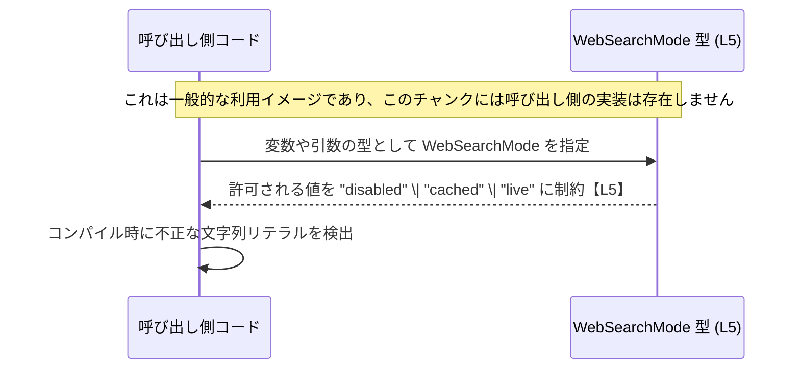

# app-server-protocol/schema/typescript/WebSearchMode.ts コード解説

## 0. ざっくり一言

Web 検索機能の「動作モード」を `"disabled" | "cached" | "live"` の 3 通りに制約して表現する、文字列リテラル・ユニオン型 `WebSearchMode` を定義する自動生成ファイルです【app-server-protocol/schema/typescript/WebSearchMode.ts:L1-5】。

---

## 1. このモジュールの役割

### 1.1 概要

- このモジュールは、Web 検索機能のオン/オフや実行方法を表現するための **型エイリアス `WebSearchMode`** を 1 つだけ公開しています【…/WebSearchMode.ts:L5-5】。
- 型は文字列リテラル `"disabled"`, `"cached"`, `"live"` のユニオンとして定義されており、**TypeScript の型チェックにより、モード指定のタイポや不正なモード値をコンパイル時に防ぐ**ことを目的とした構造になっています【…/WebSearchMode.ts:L5-5】。
- ファイル全体は `ts-rs` というツールにより自動生成されており、コメントで「手作業で編集しないこと」が明示されています【…/WebSearchMode.ts:L1-3】。

### 1.2 アーキテクチャ内での位置づけ

- このファイルは、**アプリケーションコードからインポートされる「共通のスキーマ定義」**として機能する位置づけです。
- 依存関係としては、このチャンクに現れる範囲では
  - 上流に「コード生成ツール `ts-rs`」
  - 下流に「`WebSearchMode` を利用する任意の TypeScript コード」
  が存在すると読み取れます【…/WebSearchMode.ts:L1-3, L5-5】。

```mermaid
graph LR
    subgraph "コード生成 (コメントより)【L1-3】"
        tsrs["ts-rs ツール"]
    end

    webSearchMode["WebSearchMode 型<br/>\"disabled\" | \"cached\" | \"live\"【L5】"]
    consumer["利用側 TypeScript コード<br/>(このチャンクには未登場)"]

    tsrs --> webSearchMode
    consumer --> webSearchMode
```

※ 図は、このファイル内から読み取れる関係のみを示しています。`consumer` 側の具体的なモジュール名・構成はこのチャンクには現れません。

### 1.3 設計上のポイント

- **自動生成コード**  
  - コメントに「GENERATED CODE」「Do not edit this file manually」とあり【…/WebSearchMode.ts:L1-3】、このファイル自体は人間が直接編集しない前提で設計されています。
- **単一の公開型のみを提供**  
  - `export type WebSearchMode = "disabled" | "cached" | "live";` の 1 行のみが公開 API です【…/WebSearchMode.ts:L5-5】。
- **文字列リテラル・ユニオンによる型安全性**  
  - 任意の `string` ではなく、3 つのリテラルに値を制限することで、**コンパイル時にモード指定の誤りを検出可能**とする設計です【…/WebSearchMode.ts:L5-5】。
- **状態やロジックを持たない**  
  - 関数・クラス・変数定義はなく、**実行時の処理や状態は一切持たない純粋な型定義ファイル**です【…/WebSearchMode.ts:L1-5】。

---

## 2. 主要な機能一覧

このモジュールが提供する機能は 1 つだけです。

- `WebSearchMode` 型:  
  Web 検索機能のモードを `"disabled"`, `"cached"`, `"live"` の 3 種類に制約するための文字列リテラル・ユニオン型です【…/WebSearchMode.ts:L5-5】。

---

## 3. 公開 API と詳細解説

### 3.1 型一覧（構造体・列挙体など）

| 名前            | 種別                               | 役割 / 用途                                                                                           | 定義                                                                                                  | ソース |
|----------------|------------------------------------|--------------------------------------------------------------------------------------------------------|-------------------------------------------------------------------------------------------------------|--------|
| `WebSearchMode` | 型エイリアス（文字列リテラルユニオン） | Web 検索機能のモードを `"disabled"`, `"cached"`, `"live"` のいずれかに制約し、モード指定を型安全に表現する | `export type WebSearchMode = "disabled" \| "cached" \| "live";`                                       | `app-server-protocol/schema/typescript/WebSearchMode.ts:L5-5` |

#### `WebSearchMode`

**概要**

- Web 検索の動作モードを表すための TypeScript 型エイリアスです【…/WebSearchMode.ts:L5-5】。
- 許可される値は `"disabled"`, `"cached"`, `"live"` の 3 つに限定されており、それ以外の文字列リテラルを代入しようとするとコンパイル時エラーになります【…/WebSearchMode.ts:L5-5】。

**意味（各リテラルの解釈）**

コードから読み取れるのは「モード名」のみであり、具体的な挙動はこのチャンクには現れていません。

- `"disabled"`: 「無効」状態を示すモード名と解釈できますが、**実際に何を無効にするか（例: Web 検索自体を行わない等）はコードからは分かりません**【…/WebSearchMode.ts:L5-5】。
- `"cached"`: キャッシュ利用を示唆するモード名ですが、**キャッシュの具体的な仕組みや条件は不明です**【…/WebSearchMode.ts:L5-5】。
- `"live"`: ライブ（リアルタイム）アクセスを示唆するモード名ですが、**どのような外部リソースにアクセスするかなどは不明です**【…/WebSearchMode.ts:L5-5】。

**型としての役割**

- 任意の `string` 型の代わりに `WebSearchMode` を用いることで、**モード値が 3 つのいずれかであることをコンパイル時に保証**できます【…/WebSearchMode.ts:L5-5】。
- これにより、タイポ（例: `"diasbled"`）や未対応のモード名の混入を型システムで防ぎます（ただし、`any` や型アサーションなどで型安全性を崩した場合は除きます）。

**Errors / Panics**

- この型はコンパイル時にのみ意味を持ち、**実行時のエラーや例外処理は含みません**。
- 型チェックの観点では、不正な値を代入しようとした場合、コンパイラがエラーを報告します（これは TypeScript のコンパイルエラーであり、実行時エラーとは異なります）。

**Edge cases（エッジケース）**

- `"disabled"`, `"cached"`, `"live"` 以外の文字列リテラルを `WebSearchMode` 型の変数に代入するコードは、コンパイルエラーになります。
- 一方で、外部入力から読み込んだ値に対して **型アサーションや `as unknown as WebSearchMode` などを適用すると、コンパイラのチェックを回避できてしまう**ため、その場合は実行時に不正な値を持つ可能性があります。  
  これは TypeScript 全般の挙動であり、このファイル固有の実装ではありません。

**使用上の注意点**

- このファイルは自動生成であり、コメントに「手で編集しないこと」が明記されています【…/WebSearchMode.ts:L1-3】。  
  **モードの種類を増減したい場合は、生成元の定義（このチャンクからは場所・形式は不明）を変更する必要があります。**
- 実行時に外部から取り込んだデータ（例: JSON, HTTP レスポンスなど）を `WebSearchMode` として扱う場合は、**ランタイムでのバリデーションが別途必要**です。型定義だけでは不正値の混入を防げません。

### 3.2 関数詳細（最大 7 件）

このファイルには関数・メソッドは定義されていません【…/WebSearchMode.ts:L1-5】。

### 3.3 その他の関数

このファイルには補助関数やラッパー関数も存在しません【…/WebSearchMode.ts:L1-5】。

---

## 4. データフロー

このファイル自体には処理ロジックがなく、`WebSearchMode` 型を利用する側のコードもこのチャンクには現れていません【…/WebSearchMode.ts:L1-5】。  
ここでは、**一般的な利用イメージ**として、呼び出し側と `WebSearchMode` 型の関係を sequence diagram で示します。



要点：

- `WebSearchMode` は **実行時に何かをするコンポーネントではなく、コンパイル時の型制約として機能するコンポーネント**です【…/WebSearchMode.ts:L5-5】。
- データそのもの（文字列 `"disabled"` など）は呼び出し側コードで生成・受信され、`WebSearchMode` 型を通じて **「どの値が許容されているか」を記述するメタ情報**を与えています。

---

## 5. 使い方（How to Use）

### 5.1 基本的な使用方法

`WebSearchMode` 型をインポートして、関数の引数や設定オブジェクトなどに適用するのが基本的な使い方です。

```typescript
// 例: WebSearchMode 型の利用側コード
// 実際の import パスはプロジェクト構成に応じて調整する必要があります。
import type { WebSearchMode } from "./WebSearchMode";  // WebSearchMode 型をインポートする

// Web 検索を実行する関数の例
function performSearch(query: string, mode: WebSearchMode): void {  // mode は WebSearchMode 型で制約される
    if (mode === "disabled") {               // モードが "disabled" の場合
        // 検索を行わない、または別の処理にフォールバックするなどのロジックを実装する想定
        return;
    }

    if (mode === "cached") {                 // モードが "cached" の場合
        // キャッシュを利用した検索ロジックをここに書く想定
    } else {                                 // 上記以外のモードは "live" のみ
        // 常にライブな検索を行うロジックをここに書く想定
    }
}

// 呼び出し側の例
performSearch("example query", "live");      // OK: "live" は WebSearchMode に含まれる
// performSearch("example query", "offline"); // コンパイルエラー: "offline" は WebSearchMode に含まれない
```

この例では、`performSearch` の呼び出し時に `"offline"` といった未定義モードを渡そうとするとコンパイルエラーとなり、**誤ったモード値の使用を事前に防げます**。

### 5.2 よくある使用パターン

1. **設定オブジェクトのプロパティとして利用**

```typescript
// Web 検索機能に関する設定の例
import type { WebSearchMode } from "./WebSearchMode";  // WebSearchMode 型をインポートする

type AppSettings = {
    webSearchMode: WebSearchMode;                      // 設定値として WebSearchMode を利用
};

const settings: AppSettings = {
    webSearchMode: "cached",                           // "disabled" / "cached" / "live" のいずれかを設定できる
};
```

1. **アプリケーション状態（state）として利用**

```typescript
import type { WebSearchMode } from "./WebSearchMode";  // WebSearchMode 型をインポートする

// 現在の Web 検索モードを保持する変数
let currentMode: WebSearchMode = "live";               // 初期値として "live" を設定

// モード切り替え関数の例
function setMode(mode: WebSearchMode) {                // 渡せる値が 3 つに制限される
    currentMode = mode;
}
```

1. **API の引数・戻り値として利用**

```typescript
import type { WebSearchMode } from "./WebSearchMode";  // WebSearchMode 型をインポートする

// 現在のモードを取得する API の例
function getWebSearchMode(): WebSearchMode {           // 戻り値として WebSearchMode を約束
    return "disabled";                                 // 3 つのうちのいずれかを返す
}
```

### 5.3 よくある間違い

**1. 任意の `string` 型で代用してしまう**

```typescript
// 間違い例: string 型を使ってしまう
let mode: string = "disable";      // "disabled" のタイポでもコンパイルは通る

// 正しい例: WebSearchMode 型を利用する
import type { WebSearchMode } from "./WebSearchMode";

let safeMode: WebSearchMode = "disabled";  // 許可された値のみ代入可能
// safeMode = "disable";                   // コンパイルエラー: "disable" は許可されていない
```

**2. `any` や型アサーションで型安全性を崩す**

```typescript
import type { WebSearchMode } from "./WebSearchMode";

const raw: any = "disable";                  // 外部入力を any で受け取る

// 間違い例: 強制的な型アサーション
const unsafe: WebSearchMode = raw as WebSearchMode;  // コンパイルは通るが、実行時には不正な値を持ちうる
```

このような書き方をすると、**型チェックが期待通りに働かず、`WebSearchMode` の安全性が損なわれます**。

### 5.4 使用上の注意点（まとめ）

- **自動生成ファイルを直接編集しない**  
  コメントに「GENERATED CODE」「Do not edit this file manually」と明記されているため【…/WebSearchMode.ts:L1-3】、このファイルの内容を変えたい場合は **生成元の定義** を変更する必要があります（生成元がどこにあるかは、このチャンクからは分かりません）。
- **実行時のバリデーションは別途必要**  
  `WebSearchMode` はコンパイル時の型制約のみを提供し、実行時に値をチェックするコードは含まれていません【…/WebSearchMode.ts:L1-5】。外部入力を扱う場合は、 `"disabled"`, `"cached"`, `"live"` 以外の値を弾くバリデーションを別途実装する必要があります。
- **並行性・スレッド安全性**  
  実行時の状態や副作用を持たない単なる型定義であるため、**並行性に関する特別な注意点は存在しません**【…/WebSearchMode.ts:L1-5】。

---

## 6. 変更の仕方（How to Modify）

### 6.1 新しい機能を追加する場合

このファイルは自動生成されることが明示されています【…/WebSearchMode.ts:L1-3】。  
そのため、`WebSearchMode` に新しいモードを追加したい場合でも、**このファイルを直接編集することは推奨されません**。

一般的な流れ（このチャンクから読み取れる範囲で言えること）は次のとおりです。

1. コメントにあるとおり、このファイルは `ts-rs` によって生成されています【…/WebSearchMode.ts:L1-3】。
2. 新しいモードを追加したい場合は、**生成元の定義（例: 何らかのスキーマ定義）を変更し、`ts-rs` による再生成を行う必要がある**と考えられますが、  
   生成元の場所や形式はこのチャンクには現れません。
3. 生成元を変更した後にコード生成を実行すると、`export type WebSearchMode = ...` の中身が更新される想定です【…/WebSearchMode.ts:L5-5】。

### 6.2 既存の機能を変更する場合

`"disabled"`, `"cached"`, `"live"` のいずれかを削除・名称変更したい場合も、同様に **生成元を変更してから再生成する**必要があります【…/WebSearchMode.ts:L1-3, L5-5】。

変更時の注意点：

- **影響範囲**  
  - `WebSearchMode` を利用しているすべての TypeScript コードが影響を受けます。具体的な利用箇所はこのチャンクには現れていないため、エディタの参照検索などで洗い出す必要があります。
- **契約（前提条件）の維持**  
  - `WebSearchMode` を引数や設定値として受け取る関数は、「3 モードのいずれか」という前提で実装されている可能性があります。モードの増減は、その契約の変更にあたります。
- **テストの確認**  
  - テストコードはこのチャンクには含まれていませんが、`WebSearchMode` に依存するテストが存在する場合、モードの増減に応じてテストケースを追加・修正する必要があります。

---

## 7. 関連ファイル

このチャンクには、`WebSearchMode` を利用しているファイルや、生成元のファイルパスは一切現れていません【…/WebSearchMode.ts:L1-5】。  
そのため、具体的な関連ファイルは「不明」として扱います。

| パス | 役割 / 関係 |
|------|------------|
| （不明） | `WebSearchMode` 型の生成元および利用元のファイルは、このチャンクには現れていません。コメントより、生成元は `ts-rs` による何らかのスキーマ定義であることのみが分かります【…/WebSearchMode.ts:L1-3】。 |

---

### コンポーネントインベントリーまとめ（このファイル内）

| 種別 | 名前          | 説明                                                                                         | ソース |
|------|---------------|----------------------------------------------------------------------------------------------|--------|
| コメント | 自動生成警告    | コードが `ts-rs` によって生成されており、手作業で編集すべきでないことを示すコメント               | `app-server-protocol/schema/typescript/WebSearchMode.ts:L1-3` |
| 型    | `WebSearchMode` | `"disabled"`, `"cached"`, `"live"` の 3 つの文字列リテラルからなるユニオン型。Web 検索モードを表現。 | `app-server-protocol/schema/typescript/WebSearchMode.ts:L5-5` |

このファイルには関数・クラス・変数定義は存在せず、公開 API は `WebSearchMode` 型エイリアスのみです【…/WebSearchMode.ts:L1-5】。
