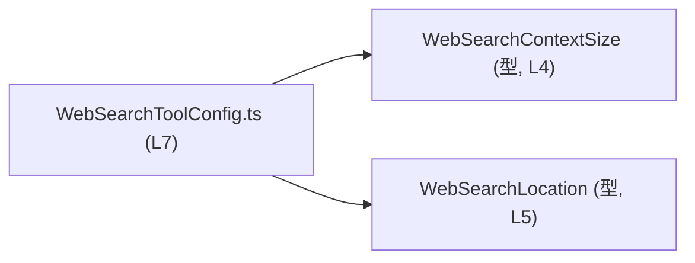
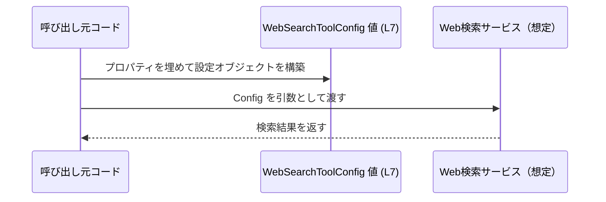

# app-server-protocol\schema\typescript\WebSearchToolConfig.ts

## 0. ざっくり一言

`WebSearchToolConfig` という **Web 検索ツールの設定オブジェクト** を表す TypeScript 型エイリアスを 1 つだけ定義した、自動生成ファイルです（`WebSearchToolConfig.ts:L1-3, L7`）。

---

## 1. このモジュールの役割

### 1.1 概要

- このモジュールは、`WebSearchToolConfig` 型を通じて **Web 検索ツールの設定情報を表現するためのスキーマ** を提供します（`WebSearchToolConfig.ts:L7`）。
- ファイル先頭に「GENERATED CODE」「ts-rs により生成」と明記されており、この TypeScript 型は Rust 側の型定義から自動生成されたものであることが分かります（`WebSearchToolConfig.ts:L1-3`）。
- 実行時のロジックや関数は一切含まず、**静的な型定義専用のモジュール**です（`WebSearchToolConfig.ts:L4-7`）。

### 1.2 アーキテクチャ内での位置づけ

- ディレクトリ名 `app-server-protocol\schema\typescript` から、このファイルは **アプリケーションサーバのプロトコルスキーマの TypeScript 表現の一部**として配置されていると解釈できます。ただし、実際の利用箇所（どのサービス／関数が使うか）は、このチャンクからは分かりません。
- 型は他の 2 つの型定義モジュールに依存しています。
  - `WebSearchContextSize`（`./WebSearchContextSize` からの type import, `WebSearchToolConfig.ts:L4`）
  - `WebSearchLocation`（`./WebSearchLocation` からの type import, `WebSearchToolConfig.ts:L5`）

依存関係を簡略図で示します。



- すべて `import type` で読み込まれており、**実行時には JavaScript の import を発生させない純粋な型依存**であることが分かります（`WebSearchToolConfig.ts:L4-5`）。

### 1.3 設計上のポイント

- **自動生成コード**  
  - 「GENERATED CODE! DO NOT MODIFY BY HAND!」と明記されており（`WebSearchToolConfig.ts:L1-3`）、直接編集しないことが前提です。
  - 変更が必要な場合は ts-rs 側（Rust の元定義）を変更して再生成する設計であると考えられます（コメント中の ts-rs 言及, `WebSearchToolConfig.ts:L3`）。
- **型専用モジュール**  
  - `import type` のみを使用し（`WebSearchToolConfig.ts:L4-5`）、関数・クラス・実行時処理を一切持たないため、**副作用を持たず、型チェック専用**です。
- **nullable フィールドによる「任意設定」表現**  
  - 3 つのプロパティはすべて `... | null` で定義されています（`WebSearchToolConfig.ts:L7`）。
  - TypeScript における「プロパティが存在しない（`undefined`）」ではなく、「プロパティはあるが `null` が入る」形で「未設定」を表現している点が特徴です。
- **エラー・並行性に関するロジックは無し**  
  - このファイル単体にはエラー処理／例外／並行実行に関わるコードは存在せず、これらは利用側のコードの責務になります（`WebSearchToolConfig.ts:L1-7`）。

---

## 2. 主要な機能一覧（コンポーネントインベントリー）

このファイルが提供する主な「機能」は 1 つの型定義です。

- `WebSearchToolConfig` 型の定義:  
  Web 検索ツールの設定オブジェクト構造を表す型エイリアスです（`WebSearchToolConfig.ts:L7`）。

コンポーネントインベントリーを表にまとめます。

| 名前                 | 種別         | 役割 / 用途                                           | 定義位置 (根拠)                    |
|----------------------|--------------|--------------------------------------------------------|-------------------------------------|
| `WebSearchToolConfig` | 型エイリアス | Web 検索ツールの設定を表すオブジェクト型を定義する    | `WebSearchToolConfig.ts:L7-7`      |

---

## 3. 公開 API と詳細解説

### 3.1 型一覧（構造体・列挙体など）

#### 型: `WebSearchToolConfig`

```ts
export type WebSearchToolConfig = {
    context_size: WebSearchContextSize | null,
    allowed_domains: Array<string> | null,
    location: WebSearchLocation | null,
};
```

（`WebSearchToolConfig.ts:L4-5, L7`）

**概要**

- Web 検索ツールの設定値をまとめて表現するオブジェクト型です。
- 3 つのプロパティを持ち、それぞれが `null` を許容します（`WebSearchToolConfig.ts:L7`）。

**フィールド一覧**

| プロパティ名      | 型                                   | 説明（役割）                                                                                           | 根拠 |
|-------------------|--------------------------------------|--------------------------------------------------------------------------------------------------------|------|
| `context_size`    | `WebSearchContextSize \| null`       | 検索コンテキストのサイズを表す設定値。型定義は `./WebSearchContextSize` に存在し、`null` も許容します。 | `WebSearchToolConfig.ts:L4, L7` |
| `allowed_domains` | `Array<string> \| null`              | 許可されたドメインの一覧を文字列配列で表現。`null` も許容します。                                     | `WebSearchToolConfig.ts:L7` |
| `location`        | `WebSearchLocation \| null`          | 検索位置情報（地域など）を表す設定値。型定義は `./WebSearchLocation` に存在し、`null` も許容します。     | `WebSearchToolConfig.ts:L5, L7` |

> `WebSearchContextSize` と `WebSearchLocation` の具体的な中身は、このチャンクには現れません（`WebSearchToolConfig.ts:L4-5`）。名前から用途は推測できますが、正確な構造は不明です。

**TypeScript 特有の安全性**

- `import type` により、これら 2 つの型は **型チェックのみに使用され、コンパイルされた JavaScript には含まれません**（`WebSearchToolConfig.ts:L4-5`）。
- コンパイル時には、各プロパティに
  - `context_size`: `WebSearchContextSize` または `null`
  - `allowed_domains`: `string` の配列または `null`
  - `location`: `WebSearchLocation` または `null`
  以外の値を代入するとコンパイルエラーになります（TypeScript の通常の型チェックの挙動）。

**エッジケースと契約（前提条件）**

この型自体は値を持たない「型情報」ですが、その使用時に重要になるエッジケースと前提を整理します。

- `null` と `undefined` の違い
  - 3 プロパティはすべて `... | null` であり、`undefined` は許容されません（`WebSearchToolConfig.ts:L7`）。
  - `config.context_size = undefined;` のような代入は、`strictNullChecks` 有効時にはコンパイルエラーになります。
- `allowed_domains` の `null` と空配列 `[]`
  - 型としては `null` の他に `[]` という「空配列」も取り得ます。
  - `null` と `[]` の意味（「制限なし」なのか「何も許可しない」のか）は、このファイルからは読み取れません。
  - そのため、**利用側で `null` と空配列の意味を明確に決めておく必要**があります。
- すべてのフィールドが `null` のケース
  - `{ context_size: null, allowed_domains: null, location: null }` も型的には有効です（`WebSearchToolConfig.ts:L7`）。
  - 実際にこれを許可するかどうかは利用側のロジック次第であり、このファイルからは分かりません。

**使用上の注意点**

- **null チェックの徹底**
  - すべてのプロパティが `null` を取り得るため、利用時には必ず null チェックを行う必要があります。
  - 例: `config.allowed_domains.map(...)` と書くと、`allowed_domains` が `null` のときに実行時エラーになります。
- **セキュリティ上の意味の可能性**
  - `allowed_domains` は名前から「アクセス許可されるドメイン一覧」を表す可能性が高く、セキュリティ境界に関わる設定となり得ます。
  - **`null` の扱い（＝制限なし／デフォルト値／無視 など）を仕様として明確にする必要があります**。ただし、このチャンクから具体的な仕様は分かりません。
- **自動生成コードであること**
  - 直接フィールド名や型を変更すると、次回のコード生成で上書きされる可能性があります（`WebSearchToolConfig.ts:L1-3`）。
  - 変更は必ず ts-rs の生成元（Rust 側）を更新し、再生成する前提の設計です。

### 3.2 関数詳細（最大 7 件）

- このファイルには **関数・メソッドは一切定義されていません**（コメントと型定義のみ, `WebSearchToolConfig.ts:L1-7`）。

### 3.3 その他の関数

- 補助関数やラッパー関数も **存在しません**（`WebSearchToolConfig.ts:L1-7`）。

---

## 4. データフロー

このモジュールは型定義のみですが、`WebSearchToolConfig` を用いる典型的なデータフロー（想定）を示します。  
※ 下記は一般的な利用イメージであり、このファイルから具体的な呼び出し元や関数名までは分かりません。



- `Config` ノードは、**このチャンクで定義されている `WebSearchToolConfig (L7)` の値**を表します。
- `Service` は、この config を実際に利用する側のコンポーネントを抽象化したものです（具体的な実装はこのチャンクには現れません）。

---

## 5. 使い方（How to Use）

### 5.1 基本的な使用方法

ここでは、`WebSearchToolConfig` を利用側コードでどのように扱うかの基本パターンを示します。

> 注意: 実際のプロジェクトでは `WebSearchContextSize` / `WebSearchLocation` は別ファイルから import されますが、ここでは説明簡略化のために型の中身を定義していません。

```typescript
// WebSearchToolConfig 型をインポートする                      // 型定義のみをインポート
import type { WebSearchToolConfig } from "./WebSearchToolConfig"; // WebSearchToolConfig.ts を参照

// 設定オブジェクトを構築する                                  // WebSearchToolConfig に適合するオブジェクトを作成
const config: WebSearchToolConfig = {                             // 3 つのプロパティはすべて必須（null は許容）
    context_size: null,                                           // context_size を指定しない（null を明示）
    allowed_domains: ["example.com", "example.org"],              // 許可するドメイン一覧（null でも可）
    location: null,                                               // location も未指定（null）
};

// 利用時は null チェックを行う                                 // null を考慮したコードが必要
if (config.allowed_domains && config.allowed_domains.length > 0) { // null でなく、要素が 1 つ以上あるかを確認
    // allowed_domains を安全に利用できる                      // ここでは配列であることが保証される
    console.log(config.allowed_domains.join(", "));
}
```

この例では、型定義通りに 3 つすべてのプロパティを持ちつつ、一部を `null` にして「未設定」を表現しています（`WebSearchToolConfig.ts:L7`）。

### 5.2 よくある使用パターン

1. **必要な項目だけ非 null にする**

```typescript
import type { WebSearchToolConfig } from "./WebSearchToolConfig";

const config: WebSearchToolConfig = {
    context_size: null,                          // サーバ側のデフォルトや別設定に任せる想定（意味は仕様依存）
    allowed_domains: ["example.com"],           // ドメイン制限だけ指定
    location: null,                              // 位置情報は利用しない
};
```

1. **すべての項目を設定する（型的には可能）**

```typescript
import type { WebSearchToolConfig } from "./WebSearchToolConfig";
import type { WebSearchContextSize } from "./WebSearchContextSize";
import type { WebSearchLocation } from "./WebSearchLocation";

// 実際には、WebSearchContextSize / WebSearchLocation の実際の型に合わせて値を用意する必要があります。
declare const contextSize: WebSearchContextSize;  // 実際の値をどこかで取得
declare const location: WebSearchLocation;        // 実際の値をどこかで取得

const config: WebSearchToolConfig = {
    context_size: contextSize,    // null ではなく具体値を指定
    allowed_domains: null,        // ドメイン制限は設定しない
    location: location,           // 位置情報を指定
};
```

> `declare` を使っているため、この例は「コンパイラに存在を教える」だけの簡略化であり、実際の取得方法は別途実装が必要です。

### 5.3 よくある間違い

**1. `undefined` を使ってしまう**

```typescript
import type { WebSearchToolConfig } from "./WebSearchToolConfig";

const badConfig: WebSearchToolConfig = {
    // ❌ 間違い例: undefined は型に含まれていない
    context_size: undefined,            // エラー: WebSearchContextSize | null に undefined は代入できない
    allowed_domains: undefined,         // 同上
    location: undefined,                // 同上
};
```

```typescript
// ✅ 正しい例: 未設定を表したいときは null を使う
const goodConfig: WebSearchToolConfig = {
    context_size: null,
    allowed_domains: null,
    location: null,
};
```

**2. null チェックなしで配列メソッドを呼ぶ**

```typescript
function usesConfig(config: WebSearchToolConfig) {
    // ❌ 間違い例: allowed_domains が null の可能性を無視している
    // config.allowed_domains.map(domain => { ... }); // 実行時に TypeError: Cannot read properties of null が起き得る
}

function safeUsesConfig(config: WebSearchToolConfig) {
    // ✅ 正しい例: null チェックを行う
    if (config.allowed_domains) {
        config.allowed_domains.forEach(domain => {
            console.log("allowed:", domain);
        });
    }
}
```

### 5.4 使用上の注意点（まとめ）

- **すべてのプロパティが必須（ただし値は null 可）**  
  型としては 3 つのプロパティは省略できず、必ず存在します（`WebSearchToolConfig.ts:L7`）。未設定を表すには `null` を使います。
- **null ハンドリングを徹底する**  
  `context_size`, `allowed_domains`, `location` すべてが `null` を取り得るため、利用側では必ず null チェックを行う設計が必要です。
- **セキュリティ上の意味を仕様で明確に**  
  特に `allowed_domains` はアクセス制御に関わる可能性があるため、`null` や空配列の意味をプロジェクトの仕様として明文化することが重要です（このチャンクでは意味は不明）。
- **自動生成ファイルを直接編集しない**  
  コメントで明示的に禁止されています（`WebSearchToolConfig.ts:L1-3`）。変更は ts-rs の生成元（Rust 側）で行う必要があります。

---

## 6. 変更の仕方（How to Modify）

### 6.1 新しい機能を追加する場合（フィールド追加など）

このファイルは自動生成のため、**直接編集すべきではありません**（`WebSearchToolConfig.ts:L1-3`）。

新しい設定項目を追加したい場合の一般的な手順は次のようになります（このチャンクから生成元コードの場所は分からないため、手順は抽象的になります）。

1. **Rust 側の元型定義を特定する**
   - コメントに `ts-rs` が記載されているため（`WebSearchToolConfig.ts:L3`）、Rust 側では `#[derive(TS)]` などの ts-rs マクロが付与された構造体が存在する可能性があります。
   - プロジェクト全体から `WebSearchToolConfig` に対応する Rust 型を検索します（このチャンクでは不明）。
2. **元の Rust 型にプロパティを追加**
   - 追加したいフィールド（例: `timeout` 等）を Rust 構造体に追加し、ts-rs の属性がそのフィールドも TypeScript に出力するように設定します。
3. **ts-rs を実行して TypeScript を再生成**
   - プロジェクトのビルド手順またはスクリプトに従い、ts-rs によるコード生成を再実行します。
4. **生成された `WebSearchToolConfig.ts` を確認**
   - 新しいフィールドが `WebSearchToolConfig` 型に反映されていることを確認します。

### 6.2 既存の機能を変更する場合（型や意味を変える）

既存フィールドの型や意味を変更する際の注意点です。

- **影響範囲の確認**
  - `WebSearchToolConfig` を import しているすべての TypeScript ファイルが影響を受けます。
  - リネーム・削除・型変更を行う場合は、プロジェクト全体で参照箇所を検索して確認する必要があります（このチャンクでは参照側は不明）。
- **契約（前提条件）の維持／更新**
  - `null` の意味（未設定・デフォルトに任せる 等）を変更する場合は、利用側のロジックも含めて仕様を見直す必要があります。
  - 特に `allowed_domains` はセキュリティ上重要な意味を持つ可能性があるため、慎重な変更が必要です。
- **テストの更新**
  - 生成元の Rust コードおよび TypeScript 側の利用コードに対して、設定値に関するテスト（ユニットテスト・統合テスト）が存在する場合、それらを更新／追加する必要があります。
  - このチャンクにはテストに関する情報は出てきません。

---

## 7. 関連ファイル

このモジュールと直接関係するファイル／モジュールは、import から次の 2 つが読み取れます。

| パス / モジュール名      | 役割 / 関係                                                                                     | 根拠 |
|--------------------------|--------------------------------------------------------------------------------------------------|------|
| `./WebSearchContextSize` | `WebSearchToolConfig.context_size` の型として使用される。`import type` で参照される型定義。   | `WebSearchToolConfig.ts:L4, L7` |
| `./WebSearchLocation`    | `WebSearchToolConfig.location` の型として使用される。`import type` で参照される型定義。       | `WebSearchToolConfig.ts:L5, L7` |

> これら 2 ファイルの具体的な実装内容や内部構造は、このチャンクには現れません。「位置情報」「コンテキストサイズ」という名前から用途は推測できますが、正確な定義は実際のファイルを参照する必要があります。
