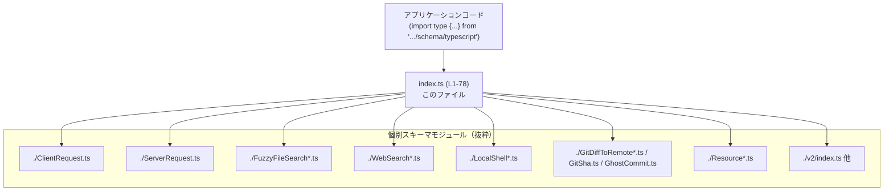
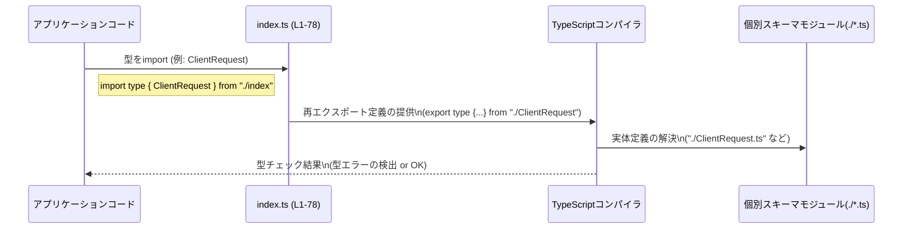

# app-server-protocol/schema/typescript/index.ts コード解説

---

## 0. ざっくり一言

- TypeScript で定義された「アプリケーションサーバープロトコル」の各種スキーマ型を **一括で再エクスポートするインデックス（バレル）モジュール** です。[`index.ts:L1-1`, `index.ts:L3-78`]
- このファイル自身にはロジックはなく、**型定義ファイル群への入口として機能する公開 API** になっています。

---

## 1. このモジュールの役割

### 1.1 概要

- このモジュールは、`./AbsolutePathBuf` や `./ClientRequest` など、同一ディレクトリ内の多数の型定義ファイルから **型を再エクスポート** するために存在します。[`index.ts:L3-77`]
- すべて `export type { ... } from "./X";` 形式であり、**型専用のエクスポート** のため、JavaScript 出力には影響しません。[`index.ts:L3-77`]
- さらに `export * as v2 from "./v2";` により、`v2` 名前空間として別バージョン／サブ API 群をまとめて公開しています。[`index.ts:L78-78`]

### 1.2 アーキテクチャ内での位置づけ

このファイルは「スキーマ型」の集約ポイントです。アプリケーションコードは通常、この `index.ts` から型をインポートし、実際の詳細は各 `./*.ts` に定義されています。



- 図は「アプリケーション → index.ts → 個別スキーマモジュール」という **型情報の依存関係** を示しています。
- 個別モジュールの中身はこのチャンクには現れないため、詳細な型構造や相互依存関係は不明です（`./*.ts` ファイルは未提供）。

### 1.3 設計上のポイント

コードから読み取れる特徴は以下の通りです。

- **生成コードであることが明示**  
  - 先頭コメントに `// GENERATED CODE! DO NOT MODIFY BY HAND!` とあり、生成ツールによって管理されるファイルであると分かります。[`index.ts:L1-1`]
- **型専用エクスポートのみ**  
  - すべて `export type { X } from "./X";` 形式であり、実行時には存在しない「型情報だけ」を公開します。[`index.ts:L3-77`]
- **集約ポイント（バレルモジュール）**  
  - 多数の型をこのファイルから再エクスポートしているため、利用側は個々のファイルパスを意識せず、ここからまとめてインポートできます。[`index.ts:L3-77`]
- **バージョン／サブ API 用の名前空間エクスポート**  
  - `export * as v2 from "./v2";` により、`v2` という名前空間に `./v2` 配下をまとめています。[`index.ts:L78-78`]
- **状態やロジックを一切持たない**  
  - 関数定義やクラス、変数定義はなく、**並行性・エラー処理・副作用はこのファイル単体では発生しません**。

---

## 2. 主要な機能一覧

このモジュール自身が提供する「機能」は、次の 2 点に集約されます。

- **スキーマ型の一括公開**  
  - `AbsolutePathBuf` / `ClientRequest` / `ServerNotification` / `WebSearchAction` など、プロトコルに関わる多様な型を **一つの import 元** から利用できるようにします。[`index.ts:L3-77`]
- **`v2` 名前空間の公開**  
  - `./v2` 配下のすべてのエクスポートを `v2` として公開し、将来のバージョニングやサブプロトコルを名前空間で区別できるようにしています。[`index.ts:L78-78`]

個々の型の具体的な挙動や構造は、このチャンクには含まれていません（`./*.ts` 側のコードが未提供のため不明）。

---

## 3. 公開 API と詳細解説

### 3.1 型一覧（構造体・列挙体など）

このファイルは 76 個の公開エンティティをエクスポートしています（型 75 + 名前空間 1）。すべて「再エクスポート」であり、実体は別ファイルにあります。

> 役割 / 用途の欄は、このファイルから分かる範囲（= プロトコルスキーマの一部であること）のみを記載します。具体的なフィールド構造や意味は、このチャンクには現れません。

| 名前 | 種別 | 定義ファイル | このファイルでの宣言位置 |
|------|------|--------------|----------------------------|
| `AbsolutePathBuf` | 型（再エクスポート） | `"./AbsolutePathBuf"` | `index.ts:L3-3` |
| `AgentPath` | 型（再エクスポート） | `"./AgentPath"` | `index.ts:L4-4` |
| `ApplyPatchApprovalParams` | 型（再エクスポート） | `"./ApplyPatchApprovalParams"` | `index.ts:L5-5` |
| `ApplyPatchApprovalResponse` | 型（再エクスポート） | `"./ApplyPatchApprovalResponse"` | `index.ts:L6-6` |
| `AuthMode` | 型（再エクスポート） | `"./AuthMode"` | `index.ts:L7-7` |
| `ClientInfo` | 型（再エクスポート） | `"./ClientInfo"` | `index.ts:L8-8` |
| `ClientNotification` | 型（再エクスポート） | `"./ClientNotification"` | `index.ts:L9-9` |
| `ClientRequest` | 型（再エクスポート） | `"./ClientRequest"` | `index.ts:L10-10` |
| `CollaborationMode` | 型（再エクスポート） | `"./CollaborationMode"` | `index.ts:L11-11` |
| `ContentItem` | 型（再エクスポート） | `"./ContentItem"` | `index.ts:L12-12` |
| `ConversationGitInfo` | 型（再エクスポート） | `"./ConversationGitInfo"` | `index.ts:L13-13` |
| `ConversationSummary` | 型（再エクスポート） | `"./ConversationSummary"` | `index.ts:L14-14` |
| `ExecCommandApprovalParams` | 型（再エクスポート） | `"./ExecCommandApprovalParams"` | `index.ts:L15-15` |
| `ExecCommandApprovalResponse` | 型（再エクスポート） | `"./ExecCommandApprovalResponse"` | `index.ts:L16-16` |
| `ExecPolicyAmendment` | 型（再エクスポート） | `"./ExecPolicyAmendment"` | `index.ts:L17-17` |
| `FileChange` | 型（再エクスポート） | `"./FileChange"` | `index.ts:L18-18` |
| `ForcedLoginMethod` | 型（再エクスポート） | `"./ForcedLoginMethod"` | `index.ts:L19-19` |
| `FunctionCallOutputBody` | 型（再エクスポート） | `"./FunctionCallOutputBody"` | `index.ts:L20-20` |
| `FunctionCallOutputContentItem` | 型（再エクスポート） | `"./FunctionCallOutputContentItem"` | `index.ts:L21-21` |
| `FuzzyFileSearchMatchType` | 型（再エクスポート） | `"./FuzzyFileSearchMatchType"` | `index.ts:L22-22` |
| `FuzzyFileSearchParams` | 型（再エクスポート） | `"./FuzzyFileSearchParams"` | `index.ts:L23-23` |
| `FuzzyFileSearchResponse` | 型（再エクスポート） | `"./FuzzyFileSearchResponse"` | `index.ts:L24-24` |
| `FuzzyFileSearchResult` | 型（再エクスポート） | `"./FuzzyFileSearchResult"` | `index.ts:L25-25` |
| `FuzzyFileSearchSessionCompletedNotification` | 型（再エクスポート） | `"./FuzzyFileSearchSessionCompletedNotification"` | `index.ts:L26-26` |
| `FuzzyFileSearchSessionUpdatedNotification` | 型（再エクスポート） | `"./FuzzyFileSearchSessionUpdatedNotification"` | `index.ts:L27-27` |
| `GetAuthStatusParams` | 型（再エクスポート） | `"./GetAuthStatusParams"` | `index.ts:L28-28` |
| `GetAuthStatusResponse` | 型（再エクスポート） | `"./GetAuthStatusResponse"` | `index.ts:L29-29` |
| `GetConversationSummaryParams` | 型（再エクスポート） | `"./GetConversationSummaryParams"` | `index.ts:L30-30` |
| `GetConversationSummaryResponse` | 型（再エクスポート） | `"./GetConversationSummaryResponse"` | `index.ts:L31-31` |
| `GhostCommit` | 型（再エクスポート） | `"./GhostCommit"` | `index.ts:L32-32` |
| `GitDiffToRemoteParams` | 型（再エクスポート） | `"./GitDiffToRemoteParams"` | `index.ts:L33-33` |
| `GitDiffToRemoteResponse` | 型（再エクスポート） | `"./GitDiffToRemoteResponse"` | `index.ts:L34-34` |
| `GitSha` | 型（再エクスポート） | `"./GitSha"` | `index.ts:L35-35` |
| `ImageDetail` | 型（再エクスポート） | `"./ImageDetail"` | `index.ts:L36-36` |
| `InitializeCapabilities` | 型（再エクスポート） | `"./InitializeCapabilities"` | `index.ts:L37-37` |
| `InitializeParams` | 型（再エクスポート） | `"./InitializeParams"` | `index.ts:L38-38` |
| `InitializeResponse` | 型（再エクスポート） | `"./InitializeResponse"` | `index.ts:L39-39` |
| `InputModality` | 型（再エクスポート） | `"./InputModality"` | `index.ts:L40-40` |
| `LocalShellAction` | 型（再エクスポート） | `"./LocalShellAction"` | `index.ts:L41-41` |
| `LocalShellExecAction` | 型（再エクスポート） | `"./LocalShellExecAction"` | `index.ts:L42-42` |
| `LocalShellStatus` | 型（再エクスポート） | `"./LocalShellStatus"` | `index.ts:L43-43` |
| `MessagePhase` | 型（再エクスポート） | `"./MessagePhase"` | `index.ts:L44-44` |
| `ModeKind` | 型（再エクスポート） | `"./ModeKind"` | `index.ts:L45-45` |
| `NetworkPolicyAmendment` | 型（再エクスポート） | `"./NetworkPolicyAmendment"` | `index.ts:L46-46` |
| `NetworkPolicyRuleAction` | 型（再エクスポート） | `"./NetworkPolicyRuleAction"` | `index.ts:L47-47` |
| `ParsedCommand` | 型（再エクスポート） | `"./ParsedCommand"` | `index.ts:L48-48` |
| `Personality` | 型（再エクスポート） | `"./Personality"` | `index.ts:L49-49` |
| `PlanType` | 型（再エクスポート） | `"./PlanType"` | `index.ts:L50-50` |
| `RealtimeConversationVersion` | 型（再エクスポート） | `"./RealtimeConversationVersion"` | `index.ts:L51-51` |
| `RealtimeVoice` | 型（再エクスポート） | `"./RealtimeVoice"` | `index.ts:L52-52` |
| `RealtimeVoicesList` | 型（再エクスポート） | `"./RealtimeVoicesList"` | `index.ts:L53-53` |
| `ReasoningEffort` | 型（再エクスポート） | `"./ReasoningEffort"` | `index.ts:L54-54` |
| `ReasoningItemContent` | 型（再エクスポート） | `"./ReasoningItemContent"` | `index.ts:L55-55` |
| `ReasoningItemReasoningSummary` | 型（再エクスポート） | `"./ReasoningItemReasoningSummary"` | `index.ts:L56-56` |
| `ReasoningSummary` | 型（再エクスポート） | `"./ReasoningSummary"` | `index.ts:L57-57` |
| `RequestId` | 型（再エクスポート） | `"./RequestId"` | `index.ts:L58-58` |
| `Resource` | 型（再エクスポート） | `"./Resource"` | `index.ts:L59-59` |
| `ResourceContent` | 型（再エクスポート） | `"./ResourceContent"` | `index.ts:L60-60` |
| `ResourceTemplate` | 型（再エクスポート） | `"./ResourceTemplate"` | `index.ts:L61-61` |
| `ResponseItem` | 型（再エクスポート） | `"./ResponseItem"` | `index.ts:L62-62` |
| `ReviewDecision` | 型（再エクスポート） | `"./ReviewDecision"` | `index.ts:L63-63` |
| `ServerNotification` | 型（再エクスポート） | `"./ServerNotification"` | `index.ts:L64-64` |
| `ServerRequest` | 型（再エクスポート） | `"./ServerRequest"` | `index.ts:L65-65` |
| `ServiceTier` | 型（再エクスポート） | `"./ServiceTier"` | `index.ts:L66-66` |
| `SessionSource` | 型（再エクスポート） | `"./SessionSource"` | `index.ts:L67-67` |
| `Settings` | 型（再エクスポート） | `"./Settings"` | `index.ts:L68-68` |
| `SubAgentSource` | 型（再エクスポート） | `"./SubAgentSource"` | `index.ts:L69-69` |
| `ThreadId` | 型（再エクスポート） | `"./ThreadId"` | `index.ts:L70-70` |
| `Tool` | 型（再エクスポート） | `"./Tool"` | `index.ts:L71-71` |
| `Verbosity` | 型（再エクスポート） | `"./Verbosity"` | `index.ts:L72-72` |
| `WebSearchAction` | 型（再エクスポート） | `"./WebSearchAction"` | `index.ts:L73-73` |
| `WebSearchContextSize` | 型（再エクスポート） | `"./WebSearchContextSize"` | `index.ts:L74-74` |
| `WebSearchLocation` | 型（再エクスポート） | `"./WebSearchLocation"` | `index.ts:L75-75` |
| `WebSearchMode` | 型（再エクスポート） | `"./WebSearchMode"` | `index.ts:L76-76` |
| `WebSearchToolConfig` | 型（再エクスポート） | `"./WebSearchToolConfig"` | `index.ts:L77-77` |
| `v2` | 名前空間エクスポート | `"./v2"` | `index.ts:L78-78` |

> これらの型が具体的に何を表現しているか（フィールド名・型・制約など）は、**このチャンクのコードからは分かりません**。詳細は各 `./*.ts` の中身に依存します。

### 3.2 関数詳細

- このファイルには **関数・メソッド・クラスの定義は一切存在しません**。  
  すべてが `export type` もしくは `export * as v2` であり、ロジックを持つ公開 API はありません。[`index.ts:L3-78`]

そのため、「関数詳細テンプレート」を適用すべき対象はありません。

### 3.3 その他の関数

- 補助的な関数・ラッパー関数も存在しません。  
  このモジュールは純粋な **型エクスポート専用** です。

---

## 4. データフロー

このファイル自体には実行時ロジックがないため、**ランタイムでの値の流れ** は定義されていません。  
ただし、「型情報の流れ」という観点で、TypeScript コンパイル時のフローを図示できます。



- この図は、**アプリケーションコードが index.ts を経由して型定義にアクセスし、TypeScript コンパイラが個別モジュールの実体を解決する**プロセスを表しています。
- どの型がどのリクエスト／レスポンスに使われるかといった「プロトコル上のデータフロー」は、`./*.ts` の具体的な中身が無いためこのチャンクからは分かりません。

---

## 5. 使い方（How to Use）

### 5.1 基本的な使用方法

このモジュールは「型の集約ポイント」なので、利用側はここから型をインポートして関数の引数や戻り値に付けます。

```typescript
// schema/typescript/index.ts と同じディレクトリにあると仮定した例
import type { ClientRequest, ServerNotification } from "./index"; // このファイルから型を読み込む
                                                                  // 実際のパスはプロジェクト構成に応じて変更する

// プロトコルに従ってクライアントリクエストを処理する関数のシグネチャ例
function handleClientRequest(req: ClientRequest): ServerNotification { // 引数と戻り値に型を付ける
    // TODO: 実際の処理内容はアプリケーション側で実装する
    throw new Error("not implemented");                               // ここでは例示のため未実装
}
```

- ここで `ClientRequest` や `ServerNotification` の **具体的なフィールドには触れていません**。  
  このチャンクではそれらの構造が不明なためです。
- `import type` を使うことで、「型としてだけ」インポートし、JavaScript 出力からは削除されます。

### 5.2 よくある使用パターン

#### パターン1: 単一型を型注釈に利用する

```typescript
import type { RequestId } from "./index";        // RequestId 型を取り込む

function logRequest(id: RequestId): void {       // RequestId を引数型に使う
    console.log("request id:", id);              // 実行時には型情報は存在せず、単なる値として扱われる
}
```

#### パターン2: まとめて名前空間経由で利用する（`v2` 名前空間）

`v2` の中身はこのチャンクでは不明ですが、TypeScript では次のように名前空間として扱えます。

```typescript
import type * as Schema from "./index";                   // index.ts 全体を型としてインポート
                                                           // Schema.v2.XXX でアクセスできる

function handleV2Request(req: Schema.v2.ServerRequest): void { // v2 名前空間配下の型を使う
    // TODO: v2 用の処理
}
```

> `Schema.v2.ServerRequest` といった具体的な型名が存在するかどうかは、このチャンクでは断定できません。  
> 上記は「export * as v2 from "./v2";`に基づく一般的な利用例です。[`index.ts:L78-78`]

### 5.3 よくある間違い

#### 間違い例: 型を値として使おうとする

```typescript
import { ClientRequest } from "./index";

// 間違い: ClientRequest をコンストラクタのように扱っている
// const req = new ClientRequest();  // ← 型エラー: 'ClientRequest' は値として参照できない可能性が高い
```

- `index.ts` は `export type` しか行っていないため、**実行時には `ClientRequest` という値は存在しない可能性が高い** です。[`index.ts:L3-77`]
- TypeScript では、型は **型空間** と呼ばれる別の領域に存在し、`new` などでインスタンス化することはできません。

##### 正しい例（型としてのみ利用）

```typescript
import type { ClientRequest } from "./index";  // import type で型としてのみ参照する

function isValidRequest(req: ClientRequest): boolean { // 型注釈にだけ使う
    // TODO: バリデーションロジック（このチャンクでは不明）
    return true;
}
```

### 5.4 使用上の注意点（まとめ）

- **このファイルは型専用**  
  - すべて `export type` であるため、**値として使えるものは存在しない** と考えるのが安全です。[`index.ts:L3-77`]
- **生成コードのため直接編集しない**  
  - コメントにある通り、手作業での編集は推奨されません。[`index.ts:L1-1`]
- **具体的な型構造は各 `./*.ts` を参照**  
  - このファイルだけではフィールド名や制約が分からないため、実装時には元の定義ファイルを見る必要があります。
- **ランタイム依存がない**  
  - 型しか扱わないため、エラー処理や並行性に関する懸念は、このファイル単体では存在しません。

---

## 6. 変更の仕方（How to Modify）

### 6.1 新しい機能（型）を追加する場合

- このファイルは **生成コード** であり、手で変更すると次の生成で上書きされる可能性があります。[`index.ts:L1-1`]
- 一般的な手順としては:
  1. 元となるスキーマ定義／コード生成設定を変更して、新しい型（例: `NewFeatureParams`）を追加する。  
     - 具体的な生成元（OpenAPI, JSON Schema など）はこのチャンクには現れないため「不明」です。
  2. コード生成ツールを再実行して、この `index.ts` に `export type { NewFeatureParams } from "./NewFeatureParams";` が追加されることを期待する。
  3. 生成された結果を確認し、アプリケーションコードで新しい型を利用する。

- どうしても手動で追加したい場合は、`export type { NewFeatureParams } from "./NewFeatureParams";` のような行を追加すれば公開できますが、**次回の自動生成で消えるリスク**があります。

### 6.2 既存の機能（型）を変更する場合

- `index.ts` は単に再エクスポートしているだけなので、**実際に変更すべき箇所は各 `./*.ts` 側**です。
- 変更時の注意点:
  - 型のフィールドを追加・削除・名前変更すると、その型を利用しているすべてのコードに影響が及びます。
  - `index.ts` から型名を削除した場合（例: `export type { ClientRequest } ...` を消す）、外部からその型をインポートしているコードはコンパイルエラーになります。
  - `v2` 名前空間配下の型を移動・変更する場合は、`export * as v2 from "./v2";` の構造自体は変わらないものの、実際の型の存在場所が変わるため、`./v2` 側の構成を確認する必要があります。[`index.ts:L78-78`]

---

## 7. 関連ファイル

このモジュールは、同一ディレクトリおよび `./v2` 配下の多数のファイルと密接に関係します。

代表的な関連ファイルを挙げます（すべてこのチャンクからパスのみが分かるものです）。

| パス | 役割 / 関係 |
|------|------------|
| `app-server-protocol/schema/typescript/ClientRequest.ts` | `ClientRequest` 型の実体定義を持つと推定されるファイル。この `index.ts` から再エクスポートされる。[`index.ts:L10-10`] |
| `app-server-protocol/schema/typescript/ServerRequest.ts` | `ServerRequest` 型の実体定義を持つと推定されるファイル。[`index.ts:L65-65`] |
| `app-server-protocol/schema/typescript/ServerNotification.ts` | `ServerNotification` 型の実体定義を持つと推定されるファイル。[`index.ts:L64-64`] |
| `app-server-protocol/schema/typescript/FuzzyFileSearchParams.ts` | `FuzzyFileSearchParams` 型など、ファジーファイル検索系の型を提供するファイル。[`index.ts:L23-27`] |
| `app-server-protocol/schema/typescript/WebSearchAction.ts` ほか | Web検索関連の型 (`WebSearchAction`, `WebSearchMode` など) を定義するファイル群。[`index.ts:L73-77`] |
| `app-server-protocol/schema/typescript/LocalShellAction.ts` ほか | ローカルシェル操作に関する型 (`LocalShellAction`, `LocalShellStatus` など) を定義するファイル群。[`index.ts:L41-43`] |
| `app-server-protocol/schema/typescript/GitDiffToRemoteParams.ts` ほか | Git 連携関連の型 (`GitDiffToRemoteParams`, `GitSha` など) を定義するファイル群。[`index.ts:L32-35`] |
| `app-server-protocol/schema/typescript/Resource.ts` ほか | リソース表現 (`Resource`, `ResourceContent`, `ResourceTemplate`) に関する型を定義するファイル群。[`index.ts:L59-61`] |
| `app-server-protocol/schema/typescript/v2/index.ts` など | `export * as v2 from "./v2";` によりまとめて公開されるサブモジュール群。詳細な構成はこのチャンクには現れません。[`index.ts:L78-78`] |

> 上記の「役割」説明はすべてファイル名・型名からの推測であり、**実際の中身はこのチャンクには存在しません**。  
> 厳密な仕様は各ファイルの実体定義を確認する必要があります。

---

## Bugs / Security / Contracts / Edge Cases / Tests / Performance について

このファイルに関して、要求されている観点をこのチャンクから分かる範囲でまとめます。

- **Bugs / Security**
  - ロジックや副作用を持たないため、**実行時バグやセキュリティホールが直接生じるコードは含まれていません**。
  - ただし、ここでエクスポートされる型定義がサーバー実装と齟齬を起こした場合、型安全性が期待通りに働かない可能性はあります（生成パイプライン側の問題）。
- **Contracts / Edge Cases**
  - それぞれの型がプロトコル上の契約（Contract）を表していると考えられますが、**契約内容の詳細やエッジケース（必須フィールド、許容値など）はこのチャンクには現れません**。
- **Tests**
  - このチャンクにはテストコードは含まれていません。
- **Performance / Scalability**
  - `export type` だけで構成されているため、JavaScript バンドルサイズや実行時パフォーマンスへの影響はほぼありません。
  - 影響があるのは TypeScript コンパイル時の型チェックコストですが、ここで見えるのは再エクスポートの宣言だけであり、実際のコストは各 `./*.ts` の型の複雑さに依存します。
- **並行性**
  - このファイルには並行処理や共有状態は存在せず、**並行性に関する懸念はありません**。

このチャンクから分かる情報は以上です。各型の中身やプロトコル全体の具体的な挙動を把握するには、対応する `./*.ts` ファイルと `./v2` 配下のコードを併せて確認する必要があります。
