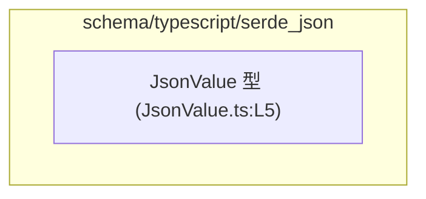
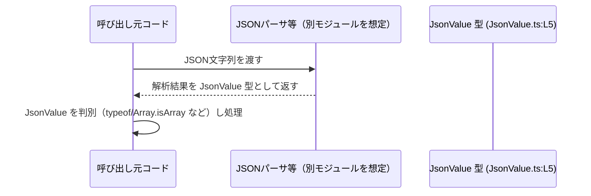

# app-server-protocol/schema/typescript/serde_json/JsonValue.ts コード解説

## 0. ざっくり一言

- JSON の値（数値・文字列・配列・オブジェクトなど）を TypeScript のユニオン型で表現するための、自動生成された型定義ファイルです（JsonValue.ts:L1-3, L5）。

---

## 1. このモジュールの役割

### 1.1 概要

- このモジュールは、JSON で表現できるすべての値の型を `JsonValue` という TypeScript のユニオン型として定義しています（JsonValue.ts:L5）。
- ファイル冒頭に「GENERATED CODE」「ts-rs による自動生成」であることが明記されており、手動編集しない前提の出力ファイルです（JsonValue.ts:L1-3）。

### 1.2 アーキテクチャ内での位置づけ

- このファイルは `export type JsonValue = ...;` という型定義のみを含み、他モジュールの `import` はありません（JsonValue.ts:L1-5）。
  - したがって、このファイルが **依存している側**（依存先）は存在しません。
  - 逆に、この型を `import` して利用する **依存元** のモジュールは、このチャンクには現れないため不明です。
- パス `schema/typescript/serde_json` から、JSON スキーマや Rust 側の `serde_json` と対応する型定義群の一部であると考えられますが、具体的な他ファイルとの関係はこのチャンクからは分かりません。

Mermaid による位置づけ（このチャンク内で分かる範囲）:



### 1.3 設計上のポイント

- **自動生成コード**  
  - 先頭コメントで自動生成であり、手動編集禁止であることが明示されています（JsonValue.ts:L1-3）。
- **再帰的ユニオン型**  
  - `JsonValue` は自分自身を要素とする配列 `Array<JsonValue>` と、値が `JsonValue` のオブジェクト `{ [key in string]?: JsonValue }` を含む再帰的なユニオン型です（JsonValue.ts:L5）。
- **JSON 構造の網羅**  
  - JSON の基本型（number, string, boolean, null）と、配列・オブジェクトをすべて含むため、「任意の JSON 値」を表現できます（JsonValue.ts:L5）。
- **オブジェクト値のオプションプロパティ**  
  - オブジェクト部分が `{ [key in string]?: JsonValue }` となっており、任意の文字列キーを持てますが、各プロパティはオプション扱い（存在しても良いし、無くても良い）になります（JsonValue.ts:L5）。
  - TypeScript 的には `obj[key]` の型が `JsonValue | undefined` となる点に注意が必要です。
- **実行時ロジックなし**  
  - 関数・クラス・変数定義は一切なく、コンパイル時の型情報のみを提供します（JsonValue.ts:L1-5）。

---

## 2. 主要な機能一覧

- `JsonValue` 型: 任意の JSON 値（数値・文字列・真偽値・配列・オブジェクト・null）を表現する再帰的ユニオン型（JsonValue.ts:L5）。

---

## 3. 公開 API と詳細解説

### 3.1 型一覧（構造体・列挙体など）

| 名前       | 種別                   | 役割 / 用途                                                                 | 定義箇所                      |
|-----------|------------------------|-----------------------------------------------------------------------------|--------------------------------|
| `JsonValue` | 型エイリアス（ユニオン型） | 任意の JSON 値を TypeScript 上で型安全に表現するための基本型                | `JsonValue.ts:L5-5`           |

#### `JsonValue` の構造

`JsonValue` の定義（JsonValue.ts:L5）:

```typescript
export type JsonValue =
    number
  | string
  | boolean
  | Array<JsonValue>
  | { [key in string]?: JsonValue }
  | null;
```

構成要素:

- `number`  
  - JSON の数値を表します。
- `string`  
  - JSON の文字列を表します。
- `boolean`  
  - `true` / `false` を表します。
- `Array<JsonValue>`  
  - 要素がすべて `JsonValue` である配列です。ネストした配列も表現できます。
- `{ [key in string]?: JsonValue }`  
  - キーが文字列、値が `JsonValue` であるオブジェクト。各プロパティはオプションです（存在しない場合もある）。
- `null`  
  - JSON の `null` リテラルを表します。

### 3.2 関数詳細（最大 7 件）

- このファイルには関数・メソッド・クラスは定義されていません（JsonValue.ts:L1-5）。  
  そのため、詳細解説すべき関数はありません。

### 3.3 その他の関数

- 補助関数・ラッパー関数も定義されていません（JsonValue.ts:L1-5）。

---

## 4. データフロー

このファイル自体には処理ロジックがなく、`JsonValue` 型の利用側はこのチャンクには現れません。  
ここでは、**一般的な利用像** を示す概念的なシーケンス図を示します（利用側コンポーネント名は想定であり、このリポジトリ内にあるかどうかはこのチャンクからは分かりません）。



要点:

- `JsonValue` は「JSON 解析結果」や「JSON 化する値」の型として使える汎用的な型です。
- TypeScript のユニオン型であるため、呼び出し側では `typeof value === "string"` や `Array.isArray(value)` などの**型ガード**による分岐で具体的な型に絞り込んで扱うことになります。
- このファイルには実際のパーサやシリアライザは定義されていないため、どのモジュールが生成・消費しているかは不明です。

---

## 5. 使い方（How to Use）

このセクションのコード例は、**この型定義を利用する一般的な方法** を示すものであり、リポジトリ内に同名の関数が存在することを意味するものではありません。

### 5.1 基本的な使用方法

例: `JsonValue` を import し、関数の引数・戻り値として使うパターン。

```typescript
// JsonValue 型を現在のファイルから import する例                     // JsonValue 型定義を読み込む
import type { JsonValue } from "./JsonValue";                            // 実際の相対パスはプロジェクト構成に依存

// JsonValue を受け取って内容に応じてログ出力する関数                   // 任意の JSON 値を安全に処理するサンプル
function logJsonValue(value: JsonValue): void {                          // 引数 value は JsonValue 型
    if (typeof value === "string") {                                     // 文字列かどうか判定
        console.log("string:", value);                                   // 文字列として扱える
    } else if (typeof value === "number") {                              // 数値かどうか判定
        console.log("number:", value);                                   // 数値として扱える
    } else if (Array.isArray(value)) {                                   // 配列かどうか判定
        console.log("array length:", value.length);                      // 配列として扱える
    } else if (value && typeof value === "object") {                     // null でなくオブジェクトかどうか判定
        console.log("object keys:", Object.keys(value));                 // オブジェクトとして扱える
    } else {                                                             
        console.log("null or unknown:", value);                          // null などその他
    }
}
```

このように、`JsonValue` を使うことで「JSON 的な値である」ことを型レベルで保証しつつ、実行時には型ガードで具体的な型を絞り込んで扱えます。

### 5.2 よくある使用パターン

1. **外部 API からの JSON レスポンスを表現**

    ```typescript
    import type { JsonValue } from "./JsonValue";                         // JsonValue を読み込む

    // 任意の JSON レスポンスを表す型                                  // 外部 API のレスポンス型として利用
    type ApiResponse = JsonValue;                                         // そのままエイリアスしてもよい

    async function fetchData(url: string): Promise<ApiResponse> {         // 戻り値を JsonValue ベースにする
        const res = await fetch(url);                                     // fetch でレスポンス取得
        const data = await res.json();                                    // JSON をパース
        return data as JsonValue;                                         // 型アサーションで JsonValue とみなす
    }
    ```

2. **任意の JSON 設定値を保持するフィールド**

    ```typescript
    import type { JsonValue } from "./JsonValue";                         // JsonValue を読み込む

    interface Config {                                                    // 設定オブジェクトの例
        name: string;                                                     // 名前
        extra: JsonValue;                                                 // 任意の JSON 形式の追加設定
    }
    ```

### 5.3 よくある間違い

`JsonValue` の構造から起こり得る誤用例を示します。

```typescript
import type { JsonValue } from "./JsonValue";

// 間違い例: undefined をトップレベルの JSON 値として扱おうとしている
let value1: JsonValue;
// value1 = undefined; // コンパイルエラー: JsonValue には undefined は含まれない

// 正しい例: "値が存在しない" 状態を表現するときは union に undefined を加える
let value2: JsonValue | undefined;                                       // undefined を許容したい場合は union を拡張する

// 間違い例: Date を JsonValue として直接扱う
// const createdAt: JsonValue = new Date(); // エラー: Date は JsonValue に含まれない

// 正しい例: ISO 文字列として表現する
const createdAtJson: JsonValue = new Date().toISOString();               // string は JsonValue に含まれる
```

- `JsonValue` には `undefined` や `Date` などは含まれていないため、それらを直接代入するとコンパイルエラーになります。
- 必要な場合は、`JsonValue | undefined` のように **利用側で union を拡張** して扱う必要があります。

### 5.4 使用上の注意点（まとめ）

- **トップレベルに `undefined` は含まれない**  
  - `JsonValue` のユニオンに `undefined` は含まれていないため、トップレベルの値として `undefined` を扱うことはできません（JsonValue.ts:L5）。
- **オブジェクトのプロパティは `JsonValue | undefined` 相当**  
  - `{ [key in string]?: JsonValue }` のため、存在しないプロパティにアクセスすると `JsonValue | undefined` となる点に注意が必要です（JsonValue.ts:L5）。
- **JavaScript の `number` の限界**  
  - 非常に大きな整数（53ビットを超える整数など）は `number` では正確に表現できません。JSON 上は整数でも、TypeScript 側では丸め誤差が生じる可能性があります。
- **実行時チェックは行われない**  
  - `JsonValue` は型定義のみであり、実行時に自動で検証されるわけではありません。外部から来る値に対しては、必要に応じてランタイムのバリデーションを行う必要があります。
- **並行性・非同期性の要素はない**  
  - このファイルは型定義だけであり、Promise や非同期処理、スレッドなどの並行性に関する要素は含みません（JsonValue.ts:L1-5）。

---

## 6. 変更の仕方（How to Modify）

### 6.1 新しい機能を追加する場合

- 先頭コメントに「GENERATED CODE! DO NOT MODIFY BY HAND!」とあり、`ts-rs` によって生成されたファイルであることが明示されています（JsonValue.ts:L1-3）。
- そのため、**このファイルに直接コードを追加することは想定されていません。**

新しい機能（例えば別の JSON 関連型）を追加したい場合の一般的な方針:

1. **このファイルとは別の場所に手書きの TypeScript ファイルを追加する。**  
   - 例: `JsonHelpers.ts` などを新規作成し、そこに関数や追加の型を定義する。
2. もしくは、**ts-rs の生成元（Rust 側の型定義）を変更する**ことで、新たな TypeScript 型を自動生成させる。  
   - 具体的な Rust 側のファイル名や型名はこのチャンクからは分かりませんが、「ts-rs による生成」というコメント（JsonValue.ts:L3）から、そのような構成が想定されます。

### 6.2 既存の機能を変更する場合

`JsonValue` の定義内容（どの型を含むか）を変更したい場合:

- **このファイルを直接編集すべきではありません。**  
  - コメントで手動編集禁止が明記されています（JsonValue.ts:L1-3）。
- 影響範囲:
  - `JsonValue` を型として利用している全ての TypeScript コードに影響します。  
    ただし、このチャンクには利用箇所が現れないため、具体的な影響範囲は不明です。
- 一般的な手順:
  - ts-rs の生成元である Rust の型定義を変更し、再生成する。
  - その後、TypeScript 側で `JsonValue` を利用している箇所のコンパイルエラーを確認し、必要な修正を行う。

---

## 7. 関連ファイル

このチャンクには import 文や他ファイルへの参照がないため、**コード上から直接分かる関連ファイルはありません**（JsonValue.ts:L1-5）。

パス構造から推測できる範囲を含めて整理すると、次のようになります（推測を含むものはその旨を明記します）。

| パス                                    | 役割 / 関係 |
|----------------------------------------|------------|
| `app-server-protocol/schema/typescript/serde_json/JsonValue.ts` | 本ファイル。任意の JSON 値を表現する型定義（JsonValue.ts:L5）。 |
| （不明）                               | このチャンクには、`JsonValue` を import して利用する具体的なファイルは現れません。 |
| （推測）`schema/typescript/serde_json` 配下の他ファイル | ディレクトリ名から、同様に `ts-rs` により自動生成された JSON 関連の型定義が存在する可能性がありますが、このチャンクからはファイル名や内容は分かりません。 |

---

### まとめ

- `JsonValue` は、JSON 仕様に対応した再帰的ユニオン型として、任意の JSON 値を型安全に表現するための基礎的な型です（JsonValue.ts:L5）。
- ファイルは `ts-rs` による自動生成であり、**直接編集してはならない** とコメントされています（JsonValue.ts:L1-3）。
- 実行時ロジックや関数は一切含まれておらず、TypeScript の型システムを通じた安全性向上が主な役割となっています。
