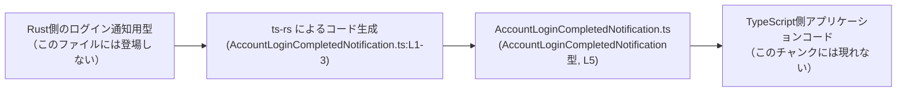
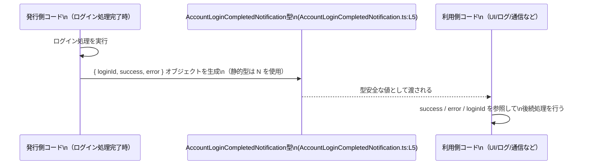

# app-server-protocol/schema/typescript/v2/AccountLoginCompletedNotification.ts

## 0. ざっくり一言

`AccountLoginCompletedNotification` 型は、ログイン完了時の結果（成功かどうかと、関連する ID やエラーメッセージ）を運ぶための **データ構造だけを定義した自動生成の TypeScript 型エイリアス** です（AccountLoginCompletedNotification.ts:L1-5）。

---

## 1. このモジュールの役割

### 1.1 概要

- このモジュールは、ログイン処理完了を通知するオブジェクトの **形（スキーマ）** を TypeScript の型として提供します（AccountLoginCompletedNotification.ts:L5-5）。
- 実際の処理ロジックは一切含まず、型チェックと IDE 補完のための情報のみを提供します（AccountLoginCompletedNotification.ts:L5-5）。
- ファイル先頭のコメントから、Rust から TypeScript 型を自動生成するツール **ts-rs** によって生成されていることがわかります（AccountLoginCompletedNotification.ts:L1-3）。

### 1.2 アーキテクチャ内での位置づけ

- コメントにより「このファイルは ts-rs による自動生成であり、手で編集してはいけない」ことが明示されています（AccountLoginCompletedNotification.ts:L1-3）。
- ts-rs は一般に「Rust の型定義 → TypeScript の型定義」という変換を行うライブラリです（外部知識）。
- このファイル単体からは、どの Rust 型から生成されているか、どのモジュールがこの型を使うかは特定できませんが、「Rust 側の定義」と「TypeScript クライアントコード」の橋渡しとして位置づけられていると考えられます（根拠: ファイルパスと ts-rs コメント、AccountLoginCompletedNotification.ts:L1-3）。

代表的な依存関係イメージを Mermaid 図で表します（ts-rs の一般的な利用形態に基づく概念図です）。



※ A・D の具体的な型名・ファイルパスは、このチャンクには現れません。

### 1.3 設計上のポイント

- **自動生成コード**  
  - 冒頭コメントにより、自動生成であることと手動編集禁止であることが明示されています（AccountLoginCompletedNotification.ts:L1-3）。
- **純粋なデータ型（状態やメソッドなし）**  
  - `export type ... = { ... }` のみが存在し、クラスや関数、メソッドは定義されていません（AccountLoginCompletedNotification.ts:L5-5）。
- **必須プロパティ + null 許容**  
  - `loginId` と `error` は `string | null`、`success` は `boolean` で、すべてオブジェクトの必須プロパティですが、値として `null` を取り得るようになっています（AccountLoginCompletedNotification.ts:L5-5）。
- **エラーハンドリング方針は型には埋め込まれていない**  
  - `success` と `error` の関係（成功時は `error` が常に `null` になる、など）の制約は型としては表現されていません（AccountLoginCompletedNotification.ts:L5-5）。

---

## 2. 主要な機能一覧（コンポーネントインベントリー）

このファイルは 1 つの公開型のみを提供します（AccountLoginCompletedNotification.ts:L5-5）。

- `AccountLoginCompletedNotification`: ログイン完了結果を表すオブジェクト型（AccountLoginCompletedNotification.ts:L5-5）

関数やクラスは存在しません（AccountLoginCompletedNotification.ts:L1-5）。

---

## 3. 公開 API と詳細解説

### 3.1 型一覧（構造体・列挙体など）

| 名前                             | 種別      | 役割 / 用途                                                                 | 定義位置                             |
|----------------------------------|-----------|------------------------------------------------------------------------------|--------------------------------------|
| `AccountLoginCompletedNotification` | 型エイリアス | ログイン完了通知オブジェクトの形を表す。`loginId`, `success`, `error` を持つ | AccountLoginCompletedNotification.ts:L5-5 |

#### `AccountLoginCompletedNotification`

**概要**

- ログイン処理の結果を伝えるためのオブジェクト型です（AccountLoginCompletedNotification.ts:L5-5）。
- 3 つのプロパティを持ちます（AccountLoginCompletedNotification.ts:L5-5）。
  - `loginId: string | null`
  - `success: boolean`
  - `error: string | null`

**プロパティ**

| プロパティ名 | 型              | 説明（コードからわかる範囲）                                                     | 定義位置                             |
|--------------|-----------------|----------------------------------------------------------------------------------|--------------------------------------|
| `loginId`    | `string \| null` | ログイン処理に関連する ID と思われる文字列または `null`。必須プロパティだが値は null 許容 | AccountLoginCompletedNotification.ts:L5-5 |
| `success`    | `boolean`       | ログイン処理が成功したかどうかを表すブール値                                     | AccountLoginCompletedNotification.ts:L5-5 |
| `error`      | `string \| null` | エラー内容を表す文字列または `null`。必須プロパティだが値は null 許容             | AccountLoginCompletedNotification.ts:L5-5 |

> 補足: `success` と `error` の値の組み合わせに関する制約（例: `success === true` のとき `error` は必ず `null` である、など）はこの型定義からは読み取れません。

### 3.2 関数詳細（最大 7 件）

このファイルには **関数・メソッドが一切定義されていません**（AccountLoginCompletedNotification.ts:L1-5）。  
したがって、詳細な関数解説セクションは該当なしです。

### 3.3 その他の関数

- 該当なし（このチャンクには関数定義が存在しません）（AccountLoginCompletedNotification.ts:L1-5）。

---

## 4. データフロー

この型は純粋なデータコンテナであり、実行ロジックを持たないため、ここでは「コードがこの型をどのように受け渡すか」という観点での **典型的なデータフローイメージ** を示します。



- この図は、**発行側コード → 型 → 利用側コード** という一般的な流れを表現したものであり、具体的なクラス名やモジュール名はこのチャンクには現れません。
- 実際には、HTTP レスポンスのボディや WebSocket メッセージのペイロードの型として使われる可能性がありますが、これはファイル名・パスからの推測であり、このファイル単体からは確定できません。

---

## 5. 使い方（How to Use）

### 5.1 基本的な使用方法

この型を使って、ログイン完了通知オブジェクトを扱う基本的な例です。

```typescript
// AccountLoginCompletedNotification 型をインポートする
import type { AccountLoginCompletedNotification } from "./AccountLoginCompletedNotification"; // パスはプロジェクト構成に依存

// ログイン完了通知を受け取り、結果を処理する関数
function handleLoginCompleted(
    notification: AccountLoginCompletedNotification, // 型注釈により IDE 補完と型チェックが効く
): void {
    // success フラグで結果を分岐
    if (notification.success) {
        // loginId は string | null なので null チェックが必要
        if (notification.loginId !== null) {
            console.log(`ログイン成功: loginId=${notification.loginId}`);
        } else {
            console.log("ログイン成功: loginId は提供されていません");
        }
    } else {
        // error も string | null なので null チェックが必要
        const message = notification.error ?? "原因不明のエラー";
        console.error(`ログイン失敗: ${message}`);
    }
}
```

この例では、`loginId` と `error` が `null` を取り得ることを前提に、必ず null チェックや `??` 演算子で補うようにしています（AccountLoginCompletedNotification.ts:L5-5）。

### 5.2 よくある使用パターン

1. **関数の戻り値として利用する**

```typescript
import type { AccountLoginCompletedNotification } from "./AccountLoginCompletedNotification";

// ログイン処理を行い、結果オブジェクトを返す関数
async function login(
    username: string,
    password: string,
): Promise<AccountLoginCompletedNotification> {
    // ここでは擬似的な処理とする
    const ok = username === "user" && password === "pass"; // ダミー判定

    if (ok) {
        return {
            loginId: "abc123", // string
            success: true,
            error: null,       // エラーは発生していないので null
        };
    } else {
        return {
            loginId: null,                       // ログイン失敗なので ID は無効
            success: false,
            error: "ユーザー名またはパスワードが違います", // エラー内容
        };
    }
}
```

1. **外部から受け取った JSON をこの型として扱う**

```typescript
import type { AccountLoginCompletedNotification } from "./AccountLoginCompletedNotification";

function parseNotification(json: string): AccountLoginCompletedNotification {
    // JSON.parse の戻り値は any なので、現実的にはバリデーションが必要
    const raw = JSON.parse(json) as AccountLoginCompletedNotification; // 型アサーション

    // 実運用ではここで runtime バリデーションを行うことが望ましい
    return raw;
}
```

> 注意: TypeScript の型はコンパイル時だけの情報であり、`JSON.parse` の結果は実行時には検証されません。安全性を高めるには、`zod` などのバリデーションライブラリと併用することが多いです。

### 5.3 よくある間違い

1. **null を考慮せずにプロパティを使う**

```typescript
// 間違い例
function badHandler(n: AccountLoginCompletedNotification) {
    // loginId は string | null なのに、null の可能性を無視して length を参照している
    console.log(n.loginId.length); // 実行時に n.loginId が null だと TypeError
}
```

```typescript
// 正しい例（null を考慮）
function goodHandler(n: AccountLoginCompletedNotification) {
    if (n.loginId !== null) {
        console.log(n.loginId.length);
    } else {
        console.log("loginId は null です");
    }
}
```

1. **自動生成ファイルを直接編集する**

```typescript
// 間違い例: 直接このファイルにプロパティを追加する
// export type AccountLoginCompletedNotification = {
//     loginId: string | null,
//     success: boolean,
//     error: string | null,
//     extra: string, // ← 手で追加してしまう
// };
```

- コメントに「GENERATED CODE! DO NOT MODIFY BY HAND!」とあるため、手動編集すると**次回のコード生成で上書きされる**可能性が高く、変更が失われます（AccountLoginCompletedNotification.ts:L1-3）。

### 5.4 使用上の注意点（まとめ）

- `loginId` と `error` は `null` を取り得るため、**常に null チェックまたは `??` などでのフォールバックが必要**です（AccountLoginCompletedNotification.ts:L5-5）。
- 型としては `success`, `loginId`, `error` の組み合わせに関するビジネスルールが表現されていないため、**ロジック側で規約を決めて徹底する必要があります**（例: `success === true` の場合は `error` を無視する、など）。
- このファイルは自動生成されるため、**変更は元となる Rust 側定義やコード生成設定に対して行う**のが前提です（AccountLoginCompletedNotification.ts:L1-3）。
- TypeScript の型は実行時には存在しないため、**外部入力をそのままこの型として扱う場合は実行時バリデーションを併用する**ことが安全です。

---

## 6. 変更の仕方（How to Modify）

### 6.1 新しい機能を追加する場合

このファイルは自動生成であるため、**直接編集して機能を追加するのは前提に反します**（AccountLoginCompletedNotification.ts:L1-3）。  
新しいフィールドを追加したい場合の一般的な手順は次のようになります。

1. **Rust 側の元定義を変更する**  
   - ts-rs は Rust の構造体・列挙体から TypeScript 型を生成するため、まず元の Rust 型にフィールドを追加します（Rust 側ファイルの具体名はこのチャンクには現れません）。
2. **ts-rs によるコード生成を再実行する**  
   - ビルドスクリプトや専用コマンドを実行し、TypeScript スキーマを再生成します（AccountLoginCompletedNotification.ts:L1-3 のコメントがコード生成済みであることを示す）。
3. **生成された TypeScript 型を利用するコードを更新する**  
   - 新しく追加したフィールドを参照するロジックを TypeScript 側に追加します。

このファイルを直接編集すると、次回生成時に変更が消えるだけでなく、Rust 側と TypeScript 側の型定義が不整合になる可能性があります。

### 6.2 既存の機能を変更する場合

既存フィールドの型や意味を変更する場合も、基本方針は同じです。

- **影響範囲の確認**
  - `AccountLoginCompletedNotification` 型を参照している TypeScript ファイルを検索し、すべての利用箇所を把握します（利用箇所はこのチャンクには現れません）。
- **契約の確認**
  - 例えば `loginId` を必ず非 null にしたい場合、Rust 側・TypeScript 側の両方で「どのタイミングで必ず値が入るか」を検討する必要があります（AccountLoginCompletedNotification.ts:L5-5）。
- **変更手順**
  1. Rust 側の型定義を変更
  2. ts-rs で再生成
  3. TypeScript 側の利用コードを修正・テスト

---

## 7. 関連ファイル

このファイル単体からは、具体的な関連ファイルのパスは特定できませんが、一般的に関係しうるものを「不明」であることを明示した上で整理します。

| パス / 種別                    | 役割 / 関係                                                                 |
|--------------------------------|------------------------------------------------------------------------------|
| （不明: Rust 側定義ファイル）      | ts-rs が参照する元の Rust 構造体/型定義。ここを変更して再生成すると本ファイルも変わる可能性が高い（AccountLoginCompletedNotification.ts:L1-3）。 |
| （不明: ts-rs 設定/ビルドスクリプト） | TypeScript スキーマ生成の設定やビルド処理。どの Rust 型からどのファイルへ出力するかを制御（AccountLoginCompletedNotification.ts:L1-3）。 |
| （不明: TypeScript 利用側コード）   | `AccountLoginCompletedNotification` 型を import して実際にログイン結果を処理するコード。 |

> 具体的なファイル名やディレクトリ構成は、このチャンクには現れないため不明です。

---

### 補足: バグ・セキュリティ・エッジケース・テスト・性能などの観点

- **バグになりやすい点**
  - `loginId` / `error` の `null` を考慮しないロジックは実行時エラーや誤った UI 表示の原因になります（AccountLoginCompletedNotification.ts:L5-5）。
  - `success` と `error` の関係性を勝手に仮定（例: `success === false` なら `error` は必ず非 null など）すると、将来の仕様変更に弱くなります。
- **セキュリティ**
  - この型自体はデータ構造のみですが、`error` メッセージをそのままクライアントに表示すると情報漏えいにつながる可能性があります。ログインエラー文言の扱いには注意が必要です（この点は型ではなく利用側ロジックの課題）。
- **エッジケース**
  - すべてのプロパティが「存在するが値は null」のケース（`{ loginId: null, success: false, error: null }` など）も型としては許容されます（AccountLoginCompletedNotification.ts:L5-5）。このようなケースをどう扱うかは仕様で決める必要があります。
- **テスト**
  - このファイルにはテストは含まれていません（AccountLoginCompletedNotification.ts:L1-5）。  
    テストは通常、型を利用するロジック側のユニットテストや統合テストとして実装されます。
- **性能・スケーラビリティ**
  - 単なる小さなオブジェクト型なので、性能・スケーラビリティへの直接の影響はごく小さいと考えられます。
- **観測性（ログ/トレース）**
  - `success` / `error` / `loginId` はログ出力に適していますが、`loginId` が個人情報に結びつく場合は、マスキングや匿名化が必要になることがあります。
