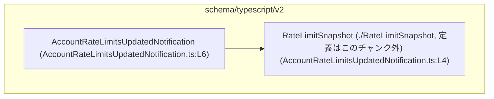
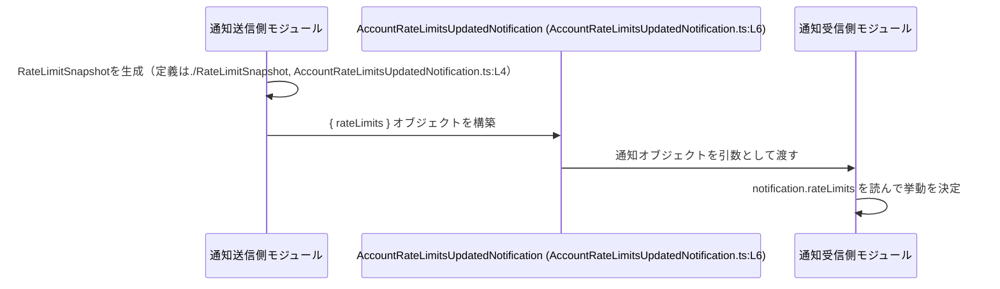

# app-server-protocol/schema/typescript/v2/AccountRateLimitsUpdatedNotification.ts コード解説

## 0. ざっくり一言

- アカウントのレートリミット情報が更新されたことを通知するための **TypeScript 型定義（オブジェクト型エイリアス）** を 1 つだけ提供するファイルです（`AccountRateLimitsUpdatedNotification.ts:L6-6`）。
- Rust との型連携ツール **ts-rs により自動生成されており、手動編集を禁止** していることがコメントで明示されています（`AccountRateLimitsUpdatedNotification.ts:L1-3`）。

---

## 1. このモジュールの役割

### 1.1 概要

- このモジュールは、**「アカウントのレートリミットが更新された」という通知メッセージの形」を型として表現**します。
- 通知には `rateLimits` プロパティが含まれ、その型として `RateLimitSnapshot` が用いられます（`AccountRateLimitsUpdatedNotification.ts:L4-6`）。
- 実装は型定義のみであり、**ロジックや関数は一切含みません**（`AccountRateLimitsUpdatedNotification.ts:L1-6`）。

### 1.2 アーキテクチャ内での位置づけ

このファイルは `schema/typescript/v2` 配下にあり、アプリケーションサーバープロトコルの **スキーマ（型定義）層** の一部と考えられます。  
具体的な利用箇所（どのモジュールがこの型を使うか）は、このチャンクからは分かりません。

依存関係を簡易に図示すると、次のようになります。



- `AccountRateLimitsUpdatedNotification` は `RateLimitSnapshot` を参照する **型レベルの依存** を持っています（`import type`、`AccountRateLimitsUpdatedNotification.ts:L4`）。
- `import type` を使っているため、**実行時の依存は発生せず、コンパイル時の型チェックだけに利用**されます（TypeScript の言語仕様上の挙動）。

### 1.3 設計上のポイント

コードから読み取れる設計上の特徴は次のとおりです。

- **自動生成コード**  
  - `// GENERATED CODE! DO NOT MODIFY BY HAND!` というコメントにより、自動生成であることと手動編集禁止が明示されています（`AccountRateLimitsUpdatedNotification.ts:L1`）。
  - `ts-rs` によって生成されたこともコメントで示されています（`AccountRateLimitsUpdatedNotification.ts:L3`）。
- **型のみを提供する純粋なスキーマ定義**  
  - `import type` と `export type` のみで構成されており、実行時コードはありません（`AccountRateLimitsUpdatedNotification.ts:L4-6`）。
- **シンプルなオブジェクト構造**  
  - `AccountRateLimitsUpdatedNotification` は 1 フィールド `rateLimits` のみを持つオブジェクト型として定義されています（`AccountRateLimitsUpdatedNotification.ts:L6`）。
- **エラーハンドリング・状態保持・並行性は持たない**  
  - 関数やクラスが存在しないため、エラー処理や状態管理、並行処理（非同期処理）に関わるロジックは一切含まれていません（`AccountRateLimitsUpdatedNotification.ts:L1-6`）。

---

## 2. 主要な機能一覧

このモジュールが提供する機能は型定義 1 つだけです。

- `AccountRateLimitsUpdatedNotification` 型定義:  
  アカウントのレートリミット情報更新を表す通知メッセージの構造を、`rateLimits: RateLimitSnapshot` という 1 フィールドのオブジェクトとして表現します（`AccountRateLimitsUpdatedNotification.ts:L6`）。

---

## 3. 公開 API と詳細解説

### 3.1 型一覧（構造体・列挙体など）

#### 型・インポートのインベントリー

| 名前 | 種別 | 役割 / 用途 | 定義元 / 出典 | 根拠 |
|------|------|-------------|----------------|------|
| `AccountRateLimitsUpdatedNotification` | 型エイリアス（オブジェクト型） | アカウントのレートリミット更新通知メッセージの型。`rateLimits` プロパティを 1 つ持つ。 | このファイル内 | `AccountRateLimitsUpdatedNotification.ts:L6-6` |
| `RateLimitSnapshot` | 型（詳細不明） | レートリミットのスナップショット情報を表す型と推測されるが、構造はこのチャンクには現れない。`rateLimits` の型として利用される。 | `./RateLimitSnapshot` からの型インポート | `AccountRateLimitsUpdatedNotification.ts:L4-4` |

> `RateLimitSnapshot` の具体的なフィールド構成や意味は、**このチャンクには現れません**。ファイル名と型名からレートリミット関連であることは推測できますが、詳細な仕様は不明です。

#### `AccountRateLimitsUpdatedNotification` の構造

```ts
export type AccountRateLimitsUpdatedNotification = {
  rateLimits: RateLimitSnapshot,
};
```

- プロパティ:
  - `rateLimits: RateLimitSnapshot`  
    - 型安全性：`rateLimits` に代入される値は、コンパイル時に `RateLimitSnapshot` 型との互換性がチェックされます。
    - `RateLimitSnapshot` 自体の null / undefined 許容性などは、このファイルからは分かりません。

**契約（Contract）**

TypeScript の型としての契約は次のとおりです（すべてコンパイル時の話です）。

- **必須プロパティ**  
  - `rateLimits` は必須プロパティです。  
    `AccountRateLimitsUpdatedNotification` 型を要求する場所に `{}` や `{ somethingElse: ... }` のようなオブジェクトを渡すと、コンパイルエラーになります。
- **プロパティ名の厳格性**  
  - `rateLimit`（末尾に `s` が無い）など、プロパティ名を誤って書くと型エラーになります。
- **値の型**  
  - `rateLimits` に `RateLimitSnapshot` 以外の型（例えば `string` や `number`）を渡すとコンパイルエラーになります。

**エッジケース（型レベル）**

- `rateLimits` を省略した場合:  
  - TypeScript はコンパイル時にエラーとして検出します。
- 追加プロパティがある場合（例: `{ rateLimits, extra: 1 }`）:  
  - 「どこに代入するか」によります。構造的部分型に基づき、代入先の型が `AccountRateLimitsUpdatedNotification` であれば、追加プロパティは通常許容されます（TypeScript の一般仕様）。
- ランタイムの JS オブジェクト:  
  - 実行時はこの型情報は存在しないため、ランタイムで誤った形のオブジェクトが渡される可能性は残ります。  
    このファイル単体では、その検証ロジックは提供されていません。

### 3.2 関数詳細（最大 7 件）

- **このファイルには関数・メソッドは一切定義されていません**（`AccountRateLimitsUpdatedNotification.ts:L1-6`）。
- したがって、エラーハンドリングや非同期処理に関するロジックは、このモジュールには存在しません。

### 3.3 その他の関数

- 補助関数・ユーティリティ関数なども定義されていません（`AccountRateLimitsUpdatedNotification.ts:L1-6`）。

---

## 4. データフロー

このモジュール自体にはロジックはありませんが、**典型的な利用シナリオ** として、`RateLimitSnapshot` が生成され、それを含む通知オブジェクトが構築・受信される流れを想定できます（以下はあくまで利用イメージであり、実際の呼び出し元はこのチャンクには現れません）。

### 4.1 代表的なデータフロー（想定）

1. どこか別のモジュールが現在のレートリミット状態を収集し、`RateLimitSnapshot` 型の値を生成する（定義は別ファイル、`AccountRateLimitsUpdatedNotification.ts:L4`）。
2. その値を `rateLimits` プロパティとして持つオブジェクトを構築し、型 `AccountRateLimitsUpdatedNotification` として扱う（`AccountRateLimitsUpdatedNotification.ts:L6`）。
3. 構築された通知オブジェクトが、通知受信側のモジュール（例えばクライアントや別サービス）に渡される。

これをシーケンス図で表すと、次のようなイメージになります。



- 上記の `P` や `C` は、**このファイルには登場しない概念的なモジュール** です。  
  実際にどのモジュールが送信/受信を行うかは、このチャンクからは分かりません。

---

## 5. 使い方（How to Use）

### 5.1 基本的な使用方法

`AccountRateLimitsUpdatedNotification` は、**関数の引数や戻り値、イベントハンドラのペイロードなどの型アノテーション** として利用するのが基本です。

#### 例: 通知ハンドラの型付け

```ts
// AccountRateLimitsUpdatedNotification 型をインポートする
import type { AccountRateLimitsUpdatedNotification } from "./AccountRateLimitsUpdatedNotification"; // このファイル自身を想定

// レートリミット更新通知を処理する関数
function handleRateLimitsUpdated(
  notification: AccountRateLimitsUpdatedNotification, // 型アノテーションにより、構造が保証される
) {
  // notification.rateLimits は RateLimitSnapshot 型として認識される
  console.log(notification.rateLimits); // IDE で補完が効き、型安全にアクセスできる
}
```

- `notification` の型を指定することで:
  - 必ず `rateLimits` プロパティが存在することがコンパイル時に保証されます。
  - `RateLimitSnapshot` の構造に応じて IDE の補完や型チェックが機能します。

#### 例: 通知オブジェクトの生成

```ts
import type {
  AccountRateLimitsUpdatedNotification,
} from "./AccountRateLimitsUpdatedNotification";
import type { RateLimitSnapshot } from "./RateLimitSnapshot";

// どこかで RateLimitSnapshot 型の値を得る（実装はこのリポジトリとは無関係な例）
declare function getCurrentRateLimitSnapshot(): RateLimitSnapshot;

const snapshot: RateLimitSnapshot = getCurrentRateLimitSnapshot(); // 型安全に取得

const notification: AccountRateLimitsUpdatedNotification = {
  rateLimits: snapshot, // RateLimitSnapshot 型なので OK
};

// 以降、notification を WebSocket 送信やイベント発火のペイロードとして利用できる
```

### 5.2 よくある使用パターン

- **イベント駆動処理のペイロード型**  
  - WebSocket / SSE / メッセージキューなどで「レートリミット更新」イベントのペイロードとして、この型を利用する。
- **API レスポンスの一部**  
  - REST / RPC のレスポンスボディの一部として `AccountRateLimitsUpdatedNotification` を使い回し、サーバーとクライアント間で型を共有する。
- **テスト用ダミーデータの型付け**  
  - テストコード側でモック通知を作る際にこの型を使うことで、実際の通知構造と乖離しないようにする。  
  - このチャンクにはテストコードは現れませんが、そのような利用が一般的に想定できます。

### 5.3 よくある間違い（想定される誤用例）

TypeScript の型として想定される誤用と、その結果を示します。

```ts
import type { AccountRateLimitsUpdatedNotification } from "./AccountRateLimitsUpdatedNotification";

// 間違い例: 必須プロパティ rateLimits を指定していない
const invalidNotification1: AccountRateLimitsUpdatedNotification = {
  // コンパイルエラー:
  // プロパティ 'rateLimits' は型 '{ }' に存在しません
};

// 間違い例: プロパティ名のスペルミス
const invalidNotification2: AccountRateLimitsUpdatedNotification = {
  rateLimit: {} as any, // コンパイルエラー: 'rateLimits' が存在せず 'rateLimit' は無視される
};

// 間違い例: プロパティの型が違う
const invalidNotification3: AccountRateLimitsUpdatedNotification = {
  rateLimits: "not a snapshot", // コンパイルエラー: string は RateLimitSnapshot 型に割り当てられない
};

// 正しい例
const validNotification: AccountRateLimitsUpdatedNotification = {
  rateLimits: {} as any as import("./RateLimitSnapshot").RateLimitSnapshot,
};
```

- これらのエラーはすべて **コンパイル時に検出される** ため、ランタイムエラーを未然に防止できます。

### 5.4 使用上の注意点（まとめ）

- **自動生成ファイルを直接編集しない**  
  - 冒頭コメントに「GENERATED CODE」「Do not edit this file manually」とあるため（`AccountRateLimitsUpdatedNotification.ts:L1-3`）、このファイルを直接変更すると、再生成時に上書きされる可能性があります。
- **型レベルでのみ機能する**  
  - `import type` / `export type` のみで構成されているため、ランタイムでのバリデーションやエラーチェックは行いません（`AccountRateLimitsUpdatedNotification.ts:L4-6`）。  
  - 実際の受信データの検証は、別途ランタイムのバリデーションロジックが必要になります（このチャンクには現れません）。
- **並行性・非同期性に関する配慮は不要**  
  - この型は不変な構造の記述に過ぎないため、スレッドセーフティやロックなどを考慮する必要はありません。
- **セキュリティ上の観点**  
  - このファイルは単なる型宣言であり、入力値のフィルタリングやサニタイズを行いません。  
  - 外部から受信したデータに対しては、別途入力検証や認可チェックが必要ですが、その実装はこのチャンクにはありません。

---

## 6. 変更の仕方（How to Modify）

### 6.1 新しい機能を追加する場合

このファイルは ts-rs により自動生成されているため（`AccountRateLimitsUpdatedNotification.ts:L1-3`）、**直接変更すべきではありません**。

一般的な手順としては次のようになります（元の Rust コードなどはこのチャンクには現れません）。

1. **元になっている Rust 側の型定義を変更する**  
   - 例えば、レートリミット通知に新しいフィールド（例: 更新理由）を追加したい場合は、Rust 側の構造体にそのフィールドを追加する必要があると考えられますが、具体的な型名や場所はこのチャンクからは分かりません。
2. **ts-rs を用いて TypeScript 定義を再生成する**  
   - ts-rs のビルドプロセス（Cargo ビルドスクリプトなど）によって、このファイルが再生成される想定です（詳細はこのチャンクには現れません）。
3. **生成された TypeScript ファイルを参照して利用コードを更新する**  
   - フィールドが増減した場合、`AccountRateLimitsUpdatedNotification` を利用している箇所でコンパイルエラーが発生するので、それを手掛かりに修正します。

### 6.2 既存の機能を変更する場合

- **フィールド名を変えたい / 型を変えたい**  
  - 同様に、元の Rust 側の定義を変更し、ts-rs による再生成に任せるのが前提となります。
- **影響範囲の確認**  
  - `AccountRateLimitsUpdatedNotification` 型を利用している全ての箇所が影響を受けます。  
  - TypeScript コンパイラが型不一致を報告することで、変更漏れを検知できます。
- **契約維持への注意**  
  - この型は「通知の外部公開インターフェース」に相当する可能性が高いため、破壊的変更（プロパティ削除・意味変更）はクライアント側との契約を破るリスクがあります。  
  - 互換性を維持する場合は、フィールドの追加のみ行い、既存フィールドはそのまま残す設計が一般的です（この方針自体は一般論であり、このリポジトリ固有のポリシーはこのチャンクからは分かりません）。

---

## 7. 関連ファイル

このモジュールと直接関係するファイルは次のとおりです。

| パス | 役割 / 関係 | 根拠 |
|------|------------|------|
| `./RateLimitSnapshot` | `RateLimitSnapshot` 型の定義元。`rateLimits` プロパティの型として利用される。構造はこのチャンクには現れない。 | `AccountRateLimitsUpdatedNotification.ts:L4-4` |

その他、`AccountRateLimitsUpdatedNotification` を実際に利用するコード（通知送信・受信ロジックやテストコードなど）は、**このチャンクには現れません**。
