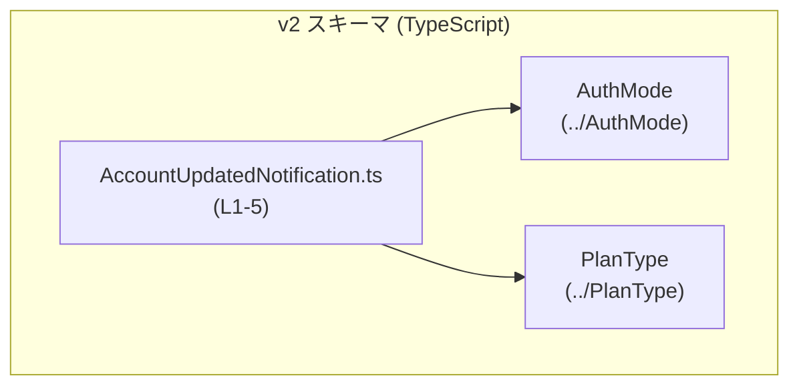
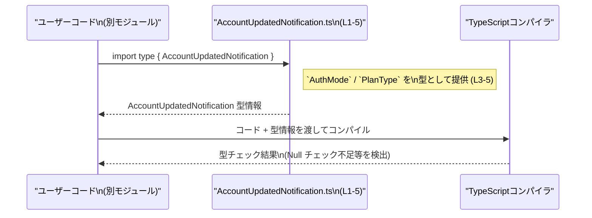

# app-server-protocol/schema/typescript/v2/AccountUpdatedNotification.ts

## 0. ざっくり一言

`AccountUpdatedNotification` という **アカウント更新通知用のペイロード型（TypeScript の型エイリアス）** を定義する、生成コードのファイルです。

---

## 1. このモジュールの役割

### 1.1 概要

- このモジュールは、アカウントに関する何らかの更新通知を表す **データ構造の型定義** を提供します。
- 通知オブジェクトは `authMode` と `planType` の 2 つのフィールドを持ち、それぞれが `AuthMode` / `PlanType` または `null` になり得ることを表現します（`AccountUpdatedNotification.ts:L5`）。
- ファイル先頭のコメントから、Rust 側の型定義から `ts-rs` によって自動生成されたものであり、**手動編集は想定されていません**（`AccountUpdatedNotification.ts:L1-2`）。

### 1.2 アーキテクチャ内での位置づけ

このファイルは **型レベルの依存関係** として、他の型定義モジュールに依存しています。



- `AccountUpdatedNotification` は `AuthMode` と `PlanType` に依存します（型インポート、`AccountUpdatedNotification.ts:L3-4`）。
- `import type` を使っているため、**コンパイル後の JavaScript には依存が現れず、純粋に型チェックのためのモジュール**です（`AccountUpdatedNotification.ts:L3-4`）。

### 1.3 設計上のポイント

- **生成コード**  
  - `// GENERATED CODE! DO NOT MODIFY BY HAND!` と `ts-rs` による生成コメントがあり（`AccountUpdatedNotification.ts:L1-2`）、元のスキーマは別（Rust 側）に存在することが分かります。
- **状態を持たない定義専用モジュール**  
  - 実行時のロジックや変数は一切なく、**型エイリアス定義のみ**を提供します（`AccountUpdatedNotification.ts:L5`）。
- **Null 許容フィールド**  
  - `authMode: AuthMode | null`、`planType: PlanType | null` とされており（`AccountUpdatedNotification.ts:L5`）、各フィールドが「必須プロパティだが値として `null` を取りうる」ことが明示されています。
- **エラーハンドリング／並行性**  
  - このファイルには関数・メソッド・非同期処理は含まれないため、直接的なエラーハンドリングや並行性に関するロジックは存在しません。

---

## 2. 主要な機能一覧

このモジュールが提供する機能は、1 つの型定義に集約されています。

- `AccountUpdatedNotification` 型の定義:  
  アカウント更新通知オブジェクトの構造（`authMode` と `planType` が `null` を取りうる）を表現する TypeScript の型エイリアス。

---

## 3. 公開 API と詳細解説

### 3.1 型一覧（構造体・列挙体など）

このファイル内の「コンポーネントインベントリー」です。

| 名前                         | 種別        | 公開範囲 | 役割 / 用途 | 根拠 |
|------------------------------|-------------|----------|------------|------|
| `AccountUpdatedNotification` | 型エイリアス | `export` | アカウント更新通知オブジェクトの構造を表す。`authMode` と `planType` を持ち、それぞれ `AuthMode` / `PlanType` または `null` を取りうる。 | `AccountUpdatedNotification.ts:L5` |
| `AuthMode`                   | 型（外部）  | import   | 認証モードを表す型（詳細はこのチャンクには現れません）。`authMode` フィールドの型として使用。 | `AccountUpdatedNotification.ts:L3, L5` |
| `PlanType`                   | 型（外部）  | import   | プラン種別を表す型（詳細はこのチャンクには現れません）。`planType` フィールドの型として使用。 | `AccountUpdatedNotification.ts:L4, L5` |

> `AuthMode` と `PlanType` の具体的な中身は、このチャンクには定義がないため不明です。

#### `AccountUpdatedNotification` の構造

```ts
export type AccountUpdatedNotification = {
    authMode: AuthMode | null;
    planType: PlanType | null;
};
```

（整形していますが内容は `AccountUpdatedNotification.ts:L5` と同じです）

- **必須プロパティ + Null 許容**  
  - `authMode` / `planType` は **プロパティ自体は必須** ですが、「値として `null` を取ることが許される」型になっています。
  - これは `authMode?: AuthMode`（プロパティ省略可）とは異なり、「キーは必ず存在し、値だけが `null` かもしれない」という契約を表現します。
- **型安全性**  
  - TypeScript は `AuthMode | null` に対して、メソッド呼び出しや比較をする際に **null チェックを強制**するため、ランタイムの `null` 参照エラーを減らせます。

**Contracts（契約） / 前提条件（型レベル）**

- この型を引数などで受け取る関数は、次を前提にしてよいです（型定義から読み取れる範囲）。
  - `authMode` キーは必ず存在するが、値は `AuthMode` か `null`。
  - `planType` キーも必ず存在するが、値は `PlanType` か `null`。
- `undefined` は型に含まれていないため、`authMode: undefined` や `planType: undefined` は **型エラー**になります。

**Edge Cases（エッジケース）**

- 両方 `null` のオブジェクト  
  - `{ authMode: null, planType: null }` は型的には有効です。  
    ただし、この場合のビジネス的な意味（「何も変更されていない通知」なのか等）は、コードからは分かりません。
- 片方だけ `null`  
  - `{ authMode: someAuthMode, planType: null }` なども有効であり、「片方だけが有効な値を持つ」という状態を表現できます。
- 不正な値  
  - `authMode` に `string` を代入する、`planType` に `number` を代入するなどは、コンパイル時に型エラーになります。

**Bugs / Security 観点（型レベル）**

- **Null チェック漏れによるロジックバグ**  
  - 呼び出し側が `authMode` や `planType` を使用する際に null チェックを行わず、`AuthMode` / `PlanType` として扱うと、実行時に `null` を想定外に扱ってしまう可能性があります。
- **セキュリティ**  
  - このモジュールは型定義のみであり、入力検証や認可などのロジックは含みません。  
    外部から受け取ったデータをこの型にキャストする場合は、別途ランタイムバリデーションが必要です。

### 3.2 関数詳細（最大 7 件）

このファイルには **関数は定義されていません**（`AccountUpdatedNotification.ts:L1-5` 全体を確認）。

- したがって、関数用テンプレートに従った詳細な説明項目（引数・戻り値・内部処理など）は該当しません。

### 3.3 その他の関数

- 補助的な関数やラッパー関数も、このチャンクには存在しません。

---

## 4. データフロー

このチャンクには、この型がどこから呼ばれ、どこへ渡されるかといった **実行時の処理フロー** は一切記述されていません。そのため、ここでは「**型定義としての利用フロー**」を示します。

### 4.1 型定義レベルのフロー概要

- `AccountUpdatedNotification.ts` は `AuthMode` / `PlanType` をインポートし（`AccountUpdatedNotification.ts:L3-4`）、それらを用いて `AccountUpdatedNotification` 型を定義します（`AccountUpdatedNotification.ts:L5`）。
- 他のモジュールは、このファイルから `AccountUpdatedNotification` をインポートして、自身の関数やクラスの **型注釈** に利用します。
- TypeScript コンパイラはこの型情報を使って、コンパイル時に型チェックを行います。

### 4.2 Mermaid シーケンス図（型利用のイメージ）



> この図は、このチャンクから読み取れる「型定義としての役割」に基づく一般的な利用イメージです。  
> 実際にどのモジュールがどのようにインポートしているかは、このチャンクには現れません。

---

## 5. 使い方（How to Use）

### 5.1 基本的な使用方法

`AccountUpdatedNotification` を引数として受け取り、`authMode` と `planType` を安全に扱う関数の例です。

```ts
// 型定義のインポート（相対パスはプロジェクト構成に応じて調整）
import type { AccountUpdatedNotification } from "./AccountUpdatedNotification"; // このファイル

// 通知オブジェクトを扱う関数の例
function handleAccountUpdated(notification: AccountUpdatedNotification) {
    // authMode は AuthMode または null なので、null チェックが必要
    if (notification.authMode !== null) {
        // ここでは notification.authMode は AuthMode に絞り込まれている
        // AuthMode 固有の処理を安全に行える
    } else {
        // authMode が null の場合の処理
    }

    // planType も同様に PlanType | null
    if (notification.planType !== null) {
        // PlanType として安全に使用できる
    } else {
        // planType が null の場合の処理
    }
}

// 型に一致するオブジェクトを作る例
const exampleNotification: AccountUpdatedNotification = {
    authMode: null,   // AuthMode または null
    planType: null,   // PlanType または null
};
```

このコード例が示すポイント:

- `AccountUpdatedNotification` を使うことで、
  - 必須プロパティであること（キーが必ず存在）
  - 値が `null` を取りうること  
  をコンパイラレベルで表現できます。
- `!== null` のチェックにより、TypeScript の **型ナローイング**（型絞り込み）が働き、`AuthMode` / `PlanType` として安全に扱えるようになります。

### 5.2 よくある使用パターン

1. **イベントハンドラの引数型**

```ts
import type { AccountUpdatedNotification } from "./AccountUpdatedNotification";

// 何らかの「アカウント更新」イベントを処理するハンドラの型注釈として利用
type AccountUpdatedHandler = (payload: AccountUpdatedNotification) => void;
```

1. **デシリアライズ後の型付け**

```ts
import type { AccountUpdatedNotification } from "./AccountUpdatedNotification";

function parsePayload(json: string): AccountUpdatedNotification {
    const raw = JSON.parse(json) as AccountUpdatedNotification; // コンパイル時の型付け
    // 実運用ではここでランタイムバリデーションを加えることが望ましい
    return raw;
}
```

> 上記のように `as AccountUpdatedNotification` を使うと「コンパイル時には正しい型」と見なされますが、  
> 実際の JSON がこの構造に従っているかは別問題のため、必要に応じて `zod` などで **ランタイムチェック**を行う必要があります。

### 5.3 よくある間違い

```ts
import type { AccountUpdatedNotification } from "./AccountUpdatedNotification";

function handle(notification: AccountUpdatedNotification) {
    // ❌ 間違い例: null チェックをせずに AuthMode / PlanType として扱っている
    // notification.authMode.someMethod(); // コンパイルエラー (authMode は AuthMode | null)

    // ✅ 正しい例: null チェックを行ってから使用する
    if (notification.authMode) {
        // ここでは notification.authMode は AuthMode にナローイングされる
        // notification.authMode.someMethod();
    }

    // ❌ 間違い例: undefined を代入しようとする
    // const bad: AccountUpdatedNotification = {
    //     authMode: undefined,   // コンパイルエラー
    //     planType: null,
    // };

    // ✅ 正しい例: null を使用する
    const ok: AccountUpdatedNotification = {
        authMode: null,
        planType: null,
    };
}
```

- **誤用ポイント**
  - Null 許容型 (`AuthMode | null`) に対する null チェックの不足。
  - 型定義上は `undefined` が許されていない点の見落とし。

### 5.4 使用上の注意点（まとめ）

- **Null チェック必須**
  - `authMode` / `planType` を使用する前に、`null` でないことをチェックする必要があります。
- **`null` と `undefined` の違い**
  - 型は `AuthMode | null` / `PlanType | null` であり、`undefined` は許容されません。
- **ランタイムバリデーションは別途必要**
  - このファイルは型定義のみであり、実際のデータがこの型に従っているかどうかは保証しません。
  - 外部入力（JSON 等）に対しては、別の層でバリデーションを行う必要があります。
- **並行性・スレッド安全性**
  - このモジュール自体は実行時のオブジェクトや状態を持たないため、並行性に関する問題はありません。

---

## 6. 変更の仕方（How to Modify）

### 6.1 新しい機能を追加する場合

このファイルは `ts-rs` による **生成コード** であり、先頭に明示的に「手で変更しない」旨が書かれています（`AccountUpdatedNotification.ts:L1-2`）。

- **重要:** 新しいフィールドや機能を追加したい場合は、このファイルを直接編集するのではなく、  
  **元になっている Rust 側の型定義やスキーマ**を変更し、`ts-rs` の生成プロセスを再実行する必要があります。

一般的な手順（このチャンクから推測できる範囲にとどめます）:

1. Rust 側の対応する型（おそらく `AccountUpdatedNotification` に対応する構造体など）にフィールドを追加・変更する。
2. `ts-rs` のコード生成を再実行する。
3. 生成されたこのファイルの `AccountUpdatedNotification` 型が更新される。
4. TypeScript 側のコンパイルエラーを確認し、利用箇所を必要に応じて修正する。

### 6.2 既存の機能を変更する場合

同様に、直接編集は推奨されません。

- 型の意味（例: `authMode` を必須からオプションにしたい等）を変えたい場合は、まず元のスキーマ（Rust 型）側を変更し、その結果として生成されるこの型定義を利用する必要があります。
- 契約の変更時に注意すべき点:
  - フィールドの型を `AuthMode | null` から `AuthMode` に変更する場合、既存コードで `null` を送っている箇所がすべてコンパイルエラーになります。
  - フィールド名の変更や削除は、全ての利用箇所に影響します。
- 変更後は、`AccountUpdatedNotification` を使っている全モジュールでコンパイルを実行し、型エラーの有無を確認することが重要です。

---

## 7. 関連ファイル

このモジュールと直接関係するファイルは、インポートされている型定義です。

| パス                  | 役割 / 関係 |
|-----------------------|------------|
| `../AuthMode`         | `AuthMode` 型を定義するモジュール。`authMode` フィールドの型として使用される（`AccountUpdatedNotification.ts:L3, L5`）。 |
| `../PlanType`         | `PlanType` 型を定義するモジュール。`planType` フィールドの型として使用される（`AccountUpdatedNotification.ts:L4, L5`）。 |

> これらモジュールの内容は、このチャンクには含まれていないため詳細は不明です。  
> それぞれのファイルを参照することで、`AuthMode` / `PlanType` の具体的な列挙値や構造を確認できます。
