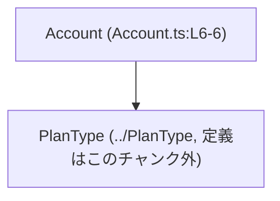
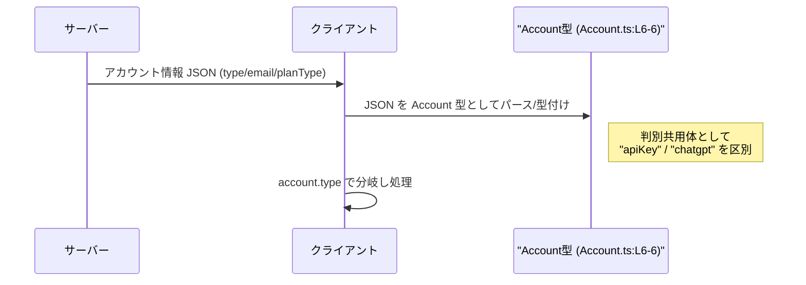

# app-server-protocol/schema/typescript/v2/Account.ts コード解説

## 0. ざっくり一言

`Account` という名前の **判別共用体（discriminated union）型** を定義し、「API キー型アカウント」と「ChatGPT 型アカウント」の 2 種類を表現する TypeScript スキーマファイルです（`Account.ts:L6-6`）。

---

## 1. このモジュールの役割

### 1.1 概要

- このモジュールは、アプリケーションサーバーのプロトコルにおける **アカウント情報の型定義** を提供します。
- アカウントには 2 種類があり、`type` フィールドで `"apiKey"` と `"chatgpt"` を区別します（`Account.ts:L6-6`）。
- `"chatgpt"` の場合のみ、`email` と `planType` が存在し、`planType` は別モジュール `../PlanType` の型に依存します（`Account.ts:L4-6`）。

### 1.2 アーキテクチャ内での位置づけ

- このファイルは `schema/typescript/v2` 配下にあり、**プロトコル v2 の TypeScript 型定義** の一部であることが分かります（パス情報より）。
- `PlanType` 型をインポートし（`Account.ts:L4`）、それを用いて `Account` 型を定義し、外部にエクスポートします（`Account.ts:L6`）。
- ts-rs により Rust 側の型から自動生成されているため（`Account.ts:L1-3`）、**スキーマのソース・オブ・トゥルースは別言語側（Rust など）にある**構造です。

依存関係を簡略図で示すと次のようになります。



### 1.3 設計上のポイント

- **自動生成コード**  
  - 冒頭コメントにより、このファイルは ts-rs により自動生成され、手動編集禁止であることが明示されています（`Account.ts:L1-3`）。
- **判別共用体によるアカウント種別の表現**  
  - 共通フィールド `type` の文字列リテラル（`"apiKey"` / `"chatgpt"`）を discriminator（判別タグ）として用いています（`Account.ts:L6`）。
  - これにより、TypeScript の制御フロー解析で `type` による分岐ごとにプロパティが型安全に絞り込まれます。
- **外部型への依存**  
  - アカウントのプラン種別 `planType` は別モジュール `../PlanType` に委譲されており、ここでは詳細を持ちません（`Account.ts:L4, L6`）。
- **状態やロジックを持たない**  
  - このファイルは型エイリアス定義のみであり、関数やクラスなどの実行時ロジックや状態を保持しません（`Account.ts:L6`）。

---

## 2. 主要な機能一覧

このファイルは実行時機能ではなく **型定義のみ** を提供します。

- `Account` 型:  
  - API キー型アカウント（`{ type: "apiKey" }`）と  
  - ChatGPT 型アカウント（`{ type: "chatgpt", email: string, planType: PlanType }`）  
  を表現する判別共用体（`Account.ts:L6`）。

---

## 3. 公開 API と詳細解説

### 3.1 型一覧（構造体・列挙体など）

| 名前      | 種別        | 役割 / 用途                                                                 | 定義箇所              |
|-----------|-------------|-----------------------------------------------------------------------------|-----------------------|
| `Account` | 型エイリアス | アカウント情報を「API キー型」か「ChatGPT 型」の 2 種類で表現する判別共用体 | `Account.ts:L6-6`     |
| `PlanType` | 型（外部） | アカウントのプラン種別を表す型。内容はこのチャンクでは不明                  | `Account.ts:L4, L6`   |

#### `Account` 型の詳細構造

`Account` は次の 2 つのオブジェクト型の共用体です（`Account.ts:L6`）。

1. **API キー型アカウント**

   ```typescript
   { "type": "apiKey", }
   ```

   - フィールド:
     - `type`: `"apiKey"` 固定の文字列リテラル型。
   - 他のフィールドは定義されていません（`Account.ts:L6`）。

2. **ChatGPT 型アカウント**

   ```typescript
   { "type": "chatgpt", email: string, planType: PlanType, }
   ```

   - フィールド:
     - `type`: `"chatgpt"` 固定の文字列リテラル型。
     - `email`: `string` 型。メールアドレスを表すと解釈できます（フィールド名より、コード自体には説明なし）（`Account.ts:L6`）。
     - `planType`: `PlanType` 型。プラン種別。`../PlanType` で定義される型です（`Account.ts:L4, L6`）。

> 補足: `"type"` がダブルクォート付きで記述されていますが、TypeScript では `"type"` と `type` は同じプロパティ名として扱われます（`Account.ts:L6`）。

### 3.2 関数詳細（最大 7 件）

このファイルには関数（通常の関数・メソッド・クラスメソッドなど）は一切定義されていません（`Account.ts:L1-6`）。  
したがって、呼び出し可能な公開 API は **`Account` 型そのもの** だけです。

### 3.3 その他の関数

このファイル内に補助的な関数やラッパー関数は存在しません（`Account.ts:L1-6`）。

---

## 4. データフロー

このファイル自体には処理ロジックはありませんが、`Account` 型が典型的にどのようなデータフローで使われるかの **想定される利用イメージ** を示します。  
（この節は TypeScript 判別共用体の一般的な使い方の例であり、具体的な呼び出し元コードはこのチャンクには存在しません。）

### 想定される利用シナリオの概要

1. サーバーがクライアントに対し、アカウント情報 JSON を返す。
2. クライアント側 TypeScript コードがその JSON を `Account` 型として扱う。
3. `account.type` で分岐して、API キー型と ChatGPT 型で異なる処理を行う。

これをシーケンス図で表現します。



> 注意: 実際のパース処理・HTTP 通信などはこのチャンクには含まれておらず、この図は `Account` 型の典型的な利用イメージを示したものです。

---

## 5. 使い方（How to Use）

### 5.1 基本的な使用方法

`Account` 型を利用して、アカウント種別ごとに型安全に処理を分岐する例です。  
TypeScript の判別共用体により、`type` の値に応じて利用可能なプロパティが自動的に絞り込まれます。

```typescript
// app-server-protocol/schema/typescript/v2/Account.ts から Account をインポートする想定
import type { Account } from "./Account";             // Account 型を型としてインポート
// PlanType の詳細はこのチャンクには無いが、Account 型経由で利用される

// Account を受け取り、種別ごとに処理する関数
function describeAccount(account: Account): string {  // account は Account 型
    switch (account.type) {                           // 判別タグ type による分岐
        case "apiKey":
            // この分岐内では account は { type: "apiKey" } 型に絞り込まれる
            return "API キー型アカウントです。";

        case "chatgpt":
            // この分岐内では account は
            // { type: "chatgpt", email: string, planType: PlanType } 型に絞り込まれる
            return `ChatGPT アカウント: ${account.email} (${String(account.planType)})`;
        default:
            // Account 型が Exhaustive であればここには到達しない想定
            // tsconfig によってはコンパイラが到達不能として警告する
            return "未知のアカウント種別です。";
    }
}
```

この例では:

- `account.type` に対する `switch` 分岐により、各ケース内で `account` の型が自動的に狭くなります。
- `"apiKey"` ケースでは `email` や `planType` にアクセスするとコンパイルエラーになります（静的型安全性）。
- `"chatgpt"` ケースでは `email` と `planType` が必須プロパティとして扱われます（`Account.ts:L6`）。

### 5.2 よくある使用パターン

1. **型ガード関数を用意して読みやすくする**

```typescript
import type { Account } from "./Account";

// ChatGPT 型かどうかを判定する型ガード
function isChatGptAccount(account: Account): account is Extract<Account, { type: "chatgpt" }> {
    return account.type === "chatgpt";              // 判別タグで判定
}

function handle(account: Account) {
    if (isChatGptAccount(account)) {
        // ここでは account は { type: "chatgpt", email: string, planType: PlanType } として扱える
        console.log(account.email);                 // OK
    } else {
        // ここでは account は { type: "apiKey" } として扱える
    }
}
```

1. **API レスポンスの型注釈**

```typescript
import type { Account } from "./Account";

async function fetchAccount(): Promise<Account> {
    const res = await fetch("/api/account");
    // 実際にはレスポンスのバリデーションが別途必要
    return await res.json() as Account;            // as Account で型アサーション
}
```

> 注意: `as Account` はコンパイラに対する約束事であり、ランタイムでの検証は行われません。入力検証を別途行う必要があります。

### 5.3 よくある間違い

```typescript
import type { Account } from "./Account";

function incorrect(account: Account) {
    if (account.type === "apiKey") {
        // 間違い例: apiKey なのに email にアクセスしようとしている
        // console.log(account.email);              // コンパイルエラーになるのが期待される
    }
}
```

```typescript
// 正しい例: type による絞り込みを前提に扱う
function correct(account: Account) {
    if (account.type === "chatgpt") {
        console.log(account.email);                // OK: chatgpt ケースでのみ email を参照
    }
}
```

### 5.4 使用上の注意点（まとめ）

- **自動生成コードを直接編集しないこと**  
  - ファイル先頭に「`GENERATED CODE! DO NOT MODIFY BY HAND!`」と明記されています（`Account.ts:L1-3`）。
  - 仕様変更が必要な場合は、元となる Rust 側の型定義や ts-rs の設定を変更し、再生成する必要があります。
- **ランタイムでの型保証はないこと**  
  - TypeScript の型はコンパイル時のみであり、実際に受け取る JSON が `Account` の構造と異なっていても、コンパイラは検出できません。
  - セキュリティ上・信頼性上、**入力検証やスキーマバリデーションは別レイヤーで行う必要**があります（このチャンクにはそのコードは存在しません）。
- **並行性への影響はない**  
  - このファイルは型定義のみで、状態や I/O を伴う処理は一切含まれていません。  
    したがって、ここ自体には並行性・同期の問題はありません。

---

## 6. 変更の仕方（How to Modify）

### 6.1 新しい機能を追加する場合

このファイルは ts-rs による自動生成であり、コメントにより手動編集禁止とされています（`Account.ts:L1-3`）。  
そのため、**直接の編集ではなく元定義側の変更**が前提になります。

一般的な変更手順（推測を含まない範囲での方針）:

1. Rust など ts-rs の入力となる元の型定義（このチャンクには現れません）に新しいバリアントやフィールドを追加する。
2. ts-rs によるコード生成処理を再実行する。
3. 再生成された `Account.ts` の `Account` 型に変更が反映される。

例えば「新しい種別のアカウント (`"enterprise"` など) を追加したい」場合も、同様に元定義側でバリアントを追加し、生成し直す必要があります。  
TypeScript ファイル側だけを手で書き換えると、**Rust 側との不整合**が生じる可能性があります。

### 6.2 既存の機能を変更する場合

- **影響範囲の確認**  
  - `Account` 型がどこで参照されているか（コンパイルエラーや IDE の参照検索で）を確認する必要があります。  
    このチャンクには参照側コードは含まれていません。
- **契約の維持**  
  - `type` による判別という契約（`"apiKey"` / `"chatgpt"` が存在し、その値によってフィールド構造が変わる）は、多くの呼び出し側で前提になっている可能性があります（`Account.ts:L6`）。
  - 既存の `type` の値を変更したり、フィールドを省略可能にする場合、**全ての利用箇所での制御フロー・null チェック**の見直しが必要になります。
- **テストの再確認**  
  - このチャンクにはテストコードは含まれていません。  
    ただし、プロトコルの互換性を維持するために、サーバー側・クライアント側のテスト（存在する場合）を再実行する必要があります。

---

## 7. 関連ファイル

このモジュールと密接に関係するファイル・ディレクトリ（このチャンクから読み取れる範囲）を示します。

| パス / モジュール       | 役割 / 関係                                                                 |
|-------------------------|------------------------------------------------------------------------------|
| `../PlanType`           | `PlanType` 型を提供するモジュール。`Account` の `planType` フィールドの型として使用（`Account.ts:L4, L6`）。定義内容はこのチャンクには現れません。 |
| `schema/typescript/v2` ディレクトリ | プロトコル v2 用の TypeScript 型定義群が配置されるディレクトリと考えられます（パスからの情報。中身はこのチャンクには現れません）。 |

---

## コンポーネントインベントリ（まとめ）

最後に、このチャンクに現れるコンポーネントの一覧と根拠行をまとめます。

| 種別          | 名前      | 説明                                                         | 根拠 |
|---------------|-----------|--------------------------------------------------------------|------|
| 型エイリアス  | `Account` | API キー型・ChatGPT 型アカウントを表現する判別共用体       | `Account.ts:L6-6` |
| 型（外部依存）| `PlanType`| アカウントのプラン種別を表す外部型。詳細はこのチャンク外   | `Account.ts:L4, L6` |

このファイルには関数・クラス・列挙体・実行時ロジックは存在しません（`Account.ts:L1-6`）。
