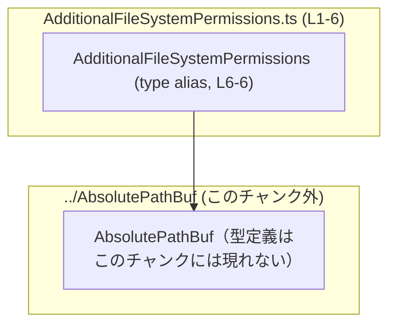
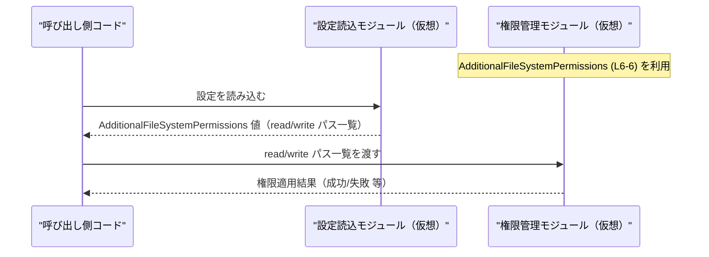

# app-server-protocol/schema/typescript/v2/AdditionalFileSystemPermissions.ts

---

## 0. ざっくり一言

追加のファイルシステム権限として、「読み取り」「書き込み」可能な絶対パス（`AbsolutePathBuf`）の一覧を表現する TypeScript のオブジェクト型エイリアスです（`AdditionalFileSystemPermissions.ts:L4-6`）。  
Rust 側の型から `ts-rs` によって自動生成されたコードであり、手動編集は前提にしていません（`AdditionalFileSystemPermissions.ts:L1-3`）。

---

## 1. このモジュールの役割

### 1.1 概要

- このモジュールは、アプリケーションが扱う「追加ファイルシステム権限」を型として表現するために存在しています（`AdditionalFileSystemPermissions.ts:L6-6`）。
- 読み取り用と書き込み用の絶対パス一覧を、それぞれ `read` / `write` プロパティで保持します（`AdditionalFileSystemPermissions.ts:L6-6`）。
- 型定義のみを含み、実行時の処理ロジックは含まれていません（`AdditionalFileSystemPermissions.ts:L1-6`）。

### 1.2 アーキテクチャ内での位置づけ

- このファイルは TypeScript 側の「v2 スキーマ定義」の一部です（パス名 `schema/typescript/v2` から推測されます）。
- `AbsolutePathBuf` 型に依存しており、各パーミッションはこの型の配列として表現されます（`AdditionalFileSystemPermissions.ts:L4-6`）。
- 依存関係は「この型 → `../AbsolutePathBuf`」という一方向です。



この図は、このチャンク内で確認できる依存関係（`import type { AbsolutePathBuf } from "../AbsolutePathBuf";`）のみを示しています（`AdditionalFileSystemPermissions.ts:L4-4`）。

### 1.3 設計上のポイント

- **自動生成コード**  
  - ファイル冒頭に `GENERATED CODE! DO NOT MODIFY BY HAND!` とあり、`ts-rs` による生成コードであることが明示されています（`AdditionalFileSystemPermissions.ts:L1-3`）。
- **型のみ定義**  
  - 実行時の関数やクラスは定義されておらず、データ構造（型エイリアス）のみを提供します（`AdditionalFileSystemPermissions.ts:L6-6`）。
- **null 許容のプロパティ**  
  - `read` / `write` は `Array<AbsolutePathBuf> | null` であり、「配列がある」か「null」の2状態を取る契約になっています（`AdditionalFileSystemPermissions.ts:L6-6`）。
- **厳密な依存の分離**  
  - パス表現は `AbsolutePathBuf` に委譲し、このファイルは「どのパスにどの権限か」をマッピングする役割に専念しています（`AdditionalFileSystemPermissions.ts:L4-6`）。

---

## 2. 主要な機能一覧

このファイルは型定義のみのため、「機能」は 1 つの型エイリアスに集約されています。

- `AdditionalFileSystemPermissions` 型:  
  追加のファイルシステム権限として、読み取り用／書き込み用の絶対パス一覧を保持するオブジェクト型です（`AdditionalFileSystemPermissions.ts:L6-6`）。

---

## 3. 公開 API と詳細解説

### 3.1 型一覧（構造体・列挙体など）

#### このチャンク内で定義されている型

| 名前 | 種別 | 役割 / 用途 | 定義箇所 |
|------|------|-------------|----------|
| `AdditionalFileSystemPermissions` | 型エイリアス（オブジェクト型） | 追加のファイルシステム権限を表現する。`read` と `write` に絶対パス一覧を保持する。 | `AdditionalFileSystemPermissions.ts:L6-6` |

#### このチャンクに登場する外部型（定義は別ファイル）

| 名前 | 種別 | 役割 / 用途（このチャンクから分かる範囲） | 出現箇所 |
|------|------|-----------------------------------------|----------|
| `AbsolutePathBuf` | `import type` された型 | 絶対パスを表現する型と推測されますが、実際の定義はこのチャンクには含まれていません。 | `AdditionalFileSystemPermissions.ts:L4-4` |

> `AbsolutePathBuf` の具体的な中身（例: `string` エイリアスか、ブランド付き型か等）は、このチャンクには現れないため不明です。

##### `AdditionalFileSystemPermissions` の構造（詳細）

```ts
export type AdditionalFileSystemPermissions = {
  read: Array<AbsolutePathBuf> | null;
  write: Array<AbsolutePathBuf> | null;
};
```

- `read`:  
  - 型: `Array<AbsolutePathBuf> | null`（`AdditionalFileSystemPermissions.ts:L6-6`）  
  - 説明: 読み取り権限を付与する対象パス（`AbsolutePathBuf`）の配列、または権限情報がないことを示す `null`。
- `write`:  
  - 型: `Array<AbsolutePathBuf> | null`（`AdditionalFileSystemPermissions.ts:L6-6`）  
  - 説明: 書き込み権限を付与する対象パス（`AbsolutePathBuf`）の配列、または権限情報がないことを示す `null`。

### 3.2 関数詳細（最大 7 件）

このファイルには関数・メソッド・クラスは定義されていません（`AdditionalFileSystemPermissions.ts:L1-6`）。  
そのため、関数詳細テンプレートに沿って解説すべき公開関数は存在しません。

### 3.3 その他の関数

このチャンクには、補助的な関数やラッパー関数も含まれていません（`AdditionalFileSystemPermissions.ts:L1-6`）。

---

## 4. データフロー

### 4.1 このチャンクから分かる範囲

- このファイルは型定義のみであり、`AdditionalFileSystemPermissions` が実際にどこで生成・利用・シリアライズされるかといった具体的な処理フローは、このチャンクには現れません。
- したがって、**実際の実装に基づくデータフローは不明**です。

### 4.2 一般的な利用イメージ（参考・推測）

以下は、TypeScript アプリケーション内でこの型が利用される典型例をイメージした **参考図** です。  
この通りのコードが実際に存在するかどうかは、このチャンクからは分かりません。



---

## 5. 使い方（How to Use）

### 5.1 基本的な使用方法

この型をインポートし、既に `AbsolutePathBuf` 型として存在するパスを組み合わせて値を作る例です。  
`AbsolutePathBuf` の具体的な型は不明なため、ここでは `declare` で既存値がある前提としています。

```typescript
// 追加のファイルシステム権限の型をインポートする                      // 型のみインポート（実行時には影響しない）
import type { AdditionalFileSystemPermissions } from "./schema/typescript/v2/AdditionalFileSystemPermissions";
// パスを表す AbsolutePathBuf 型もインポートする                        // 定義は別ファイルにあるため、このチャンクでは不明
import type { AbsolutePathBuf } from "./schema/typescript/v2/AbsolutePathBuf";

// どこか別の場所で用意された AbsolutePathBuf 型の値があると仮定する      // 実際には適切な方法で値を用意する必要がある
declare const logPath: AbsolutePathBuf;                                    // 読み取り対象のログファイルのパス
declare const dataDir: AbsolutePathBuf;                                    // 読み書き対象のデータディレクトリのパス

// AdditionalFileSystemPermissions 型の値を構築する                        // read/write それぞれにパス一覧をセット
const permissions: AdditionalFileSystemPermissions = {
    read: [logPath],                                                      // 読み取り権限を付与するパス一覧
    write: [dataDir],                                                     // 書き込み権限を付与するパス一覧
};

// 例: この permissions を別の関数に渡して権限設定に利用する               // 具体的な利用先の実装はこのチャンクには現れない
function applyPermissions(p: AdditionalFileSystemPermissions) {
    // ...
}
applyPermissions(permissions);
```

このコード例では、「read/write が `null` ではなく配列の場合」の基本形を示しています。

### 5.2 よくある使用パターン（想定されるもの）

このチャンクから直接は読み取れませんが、型から想定されるパターンを列挙します：

- `read` / `write` の片方のみを設定し、もう一方を `null` にする。
- 両方とも `null` にして「追加権限なし」を表現する。
- 空配列（`[]`）と `null` を意味的に使い分ける（例: 「フィールドは存在するが権限対象がない」 vs 「そもそも追加権限を指定していない」）。  
  ※どのように解釈するかは、実際の利用コードを確認する必要があります。このチャンクからは分かりません。

### 5.3 よくある間違い（起こりうる誤用）

型定義から推測できる誤用例と、その修正版です。

```typescript
// 誤りの可能性がある例: null を考慮していない
function listReadablePaths(p: AdditionalFileSystemPermissions): AbsolutePathBuf[] {
    // return p.read;                                // エラー: p.read は null かもしれない
    return p.read ?? [];                             // null の場合は空配列にフォールバックする
}

// 誤りの可能性がある例: プロパティ自体を省略している
const invalidPermissions: AdditionalFileSystemPermissions = {
    // read: undefined,                             // 型にないためエラー
    // write: undefined,                            // 型にないためエラー
    read: null,
    write: null,
};
```

### 5.4 使用上の注意点（まとめ）

- **`null` を必ず考慮する必要がある**  
  - `read` / `write` はどちらも `Array<AbsolutePathBuf> | null` であり、`null` を許容しています（`AdditionalFileSystemPermissions.ts:L6-6`）。  
    `p.read!` のように非 null 前提で扱うとランタイムエラーの原因になる可能性があります。
- **プロパティは省略せず、必ず存在させる必要がある**  
  - 型上、`read` / `write` は必須プロパティであり、`undefined` や「プロパティそのものの欠落」は許されません（`AdditionalFileSystemPermissions.ts:L6-6`）。
- **このファイルを直接編集しない**  
  - 自動生成コードであるため、手動編集すると生成元（Rust 側の定義）との不整合が発生する可能性があります（`AdditionalFileSystemPermissions.ts:L1-3`）。

---

## 6. 変更の仕方（How to Modify）

### 6.1 新しい機能を追加する場合

- このファイルは `ts-rs` による生成コードであり、**直接の修正は想定されていません**（`AdditionalFileSystemPermissions.ts:L1-3`）。
- 追加のプロパティや構造変更を行いたい場合は、一般的には以下の手順になります（推測）:
  1. Rust 側の元となる型定義（`ts-rs` の `#[ts(export)]` 等が付いている構造体・型）を変更する。
  2. `ts-rs` を用いて TypeScript スキーマを再生成する。
  3. 生成された TypeScript コード（本ファイル）を再度確認する。

実際の Rust 側の型や生成フローはこのチャンクには現れないため、具体的なパスやコマンドは不明です。

### 6.2 既存の機能を変更する場合

- **影響範囲の確認**  
  - `AdditionalFileSystemPermissions` を利用している TypeScript コード（このチャンクには現れない）を全て検索し、`read` / `write` プロパティへの依存関係を確認する必要があります。
- **契約の維持**  
  - `null` 許容をやめて `Array<AbsolutePathBuf>` のみにする、プロパティ名を変更する等の変更は、利用側との契約を破るため、慎重なマイグレーションが必要です。
- **テスト**  
  - このチャンクにはテストコードは含まれていません（`AdditionalFileSystemPermissions.ts:L1-6`）。  
    実際にどのようなテストがあるかはリポジトリ全体を確認する必要があります。

---

## 7. 関連ファイル

このチャンクから分かる範囲での関連ファイルは次の通りです。

| パス | 役割 / 関係 |
|------|-------------|
| `schema/typescript/v2/AdditionalFileSystemPermissions.ts` | 本ドキュメントの対象ファイル。追加のファイルシステム権限を表す TypeScript 型エイリアスを定義する（`AdditionalFileSystemPermissions.ts:L6-6`）。 |
| `schema/typescript/v2/AbsolutePathBuf.ts`（想定パス） | `AbsolutePathBuf` 型が定義されていると推測されるファイル（実際のファイル名・場所は、このチャンクには現れないため不明）。`AdditionalFileSystemPermissions` のフィールド型として利用される（`AdditionalFileSystemPermissions.ts:L4-4`）。 |

---

### Bugs / Security / Contracts / Edge Cases（このファイルに関するまとめ）

- **Bugs（バグ）**  
  - このファイルは型定義のみであり、実行時ロジックを含まないため、直接のバグ原因にはなりません（`AdditionalFileSystemPermissions.ts:L1-6`）。
- **Security（セキュリティ）**  
  - 型名とプロパティ名から、ファイルシステム権限の制御に関係するデータであると推測されますが、このチャンクだけでは OS やミドルウェアへの具体的な影響は分かりません。
- **Contracts（契約）**  
  - `read` / `write` は必須プロパティだが `null` を許容する、という契約が明示されています（`AdditionalFileSystemPermissions.ts:L6-6`）。
- **Edge Cases（エッジケース）**  
  - `read` / `write` が `null` の場合  
  - `read` / `write` が空配列（`[]`）の場合  
  - 同一パスが重複して含まれている場合  
  これらの扱いは利用側の実装に依存し、このチャンクからは挙動を判断できません。

### Performance / Scalability / Observability

- **Performance / Scalability**  
  - 型定義のみのため、直接的な性能・スケーラビリティへの影響はありません。
- **Observability（ログ・メトリクス等）**  
  - このファイルにはログ出力やメトリクス関連コードは存在しません（`AdditionalFileSystemPermissions.ts:L1-6`）。
