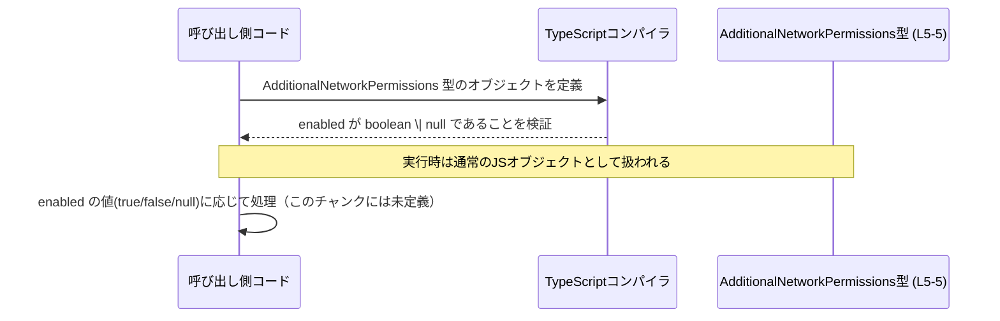

# app-server-protocol/schema/typescript/v2/AdditionalNetworkPermissions.ts

## 0. ざっくり一言

`AdditionalNetworkPermissions` という型エイリアスを 1 つだけ公開する、自動生成された TypeScript 型定義ファイルです（手動編集禁止と明記されています: `AdditionalNetworkPermissions.ts:L1-3`）。

---

## 1. このモジュールの役割

### 1.1 概要

- コメントから、このファイルは自動生成コードであり、手動で編集すべきではないことが分かります（`AdditionalNetworkPermissions.ts:L1-3`）。
- 実際のコード本体は、`enabled: boolean | null` という 1 つのプロパティを持つオブジェクト型 `AdditionalNetworkPermissions` の型エイリアス定義です（`AdditionalNetworkPermissions.ts:L5-5`）。
- ランタイム処理や関数は含まず、「型情報のみ」を提供するモジュールになっています。

### 1.2 アーキテクチャ内での位置づけ

- パス `app-server-protocol/schema/typescript/v2` から、このファイルが「何らかのプロトコル／スキーマ定義の TypeScript 版」の一部であることが推測されますが、他ファイルとの具体的な関係はこのチャンクには現れていません。
- 少なくとも、「他の TypeScript コードからインポートされて利用される型定義ファイル」という位置づけであることは確実です。

依存関係を単純化した図は次のようになります。


### 1.3 設計上のポイント

- 自動生成コード  
  - 冒頭コメントで「GENERATED CODE! DO NOT MODIFY BY HAND!」と明示されています（`AdditionalNetworkPermissions.ts:L1-1`）。
  - `ts-rs` によって生成されたことがコメントに記載されています（`AdditionalNetworkPermissions.ts:L3-3`）。
- 純粋な型定義
  - 関数・クラス・定数などは一切定義されておらず、1 つの型エイリアスだけがエクスポートされています（`AdditionalNetworkPermissions.ts:L5-5`）。
  - したがって、このモジュール自体はエラー処理・並行性・状態管理などのロジックを持ちません。
- `boolean | null` によるプロパティ型
  - `enabled` プロパティは常に存在し、その値として `boolean` または `null` のいずれかを許容する構造になっています（`AdditionalNetworkPermissions.ts:L5-5`）。
  - `enabled?: boolean` のような「プロパティの有無」で状態を表すのではなく、「必須プロパティだが値に null を許す」設計になっている点が特徴です。

---

## 2. 主要な機能一覧

このファイルが提供する「機能」は、すべて型レベルのものです。

- `AdditionalNetworkPermissions` 型: `enabled: boolean | null` という形のオブジェクト構造を表す型エイリアスです（`AdditionalNetworkPermissions.ts:L5-5`）。

---

## 3. 公開 API と詳細解説

### 3.1 型一覧（構造体・列挙体など）

公開されている型は 1 つです。

| 名前 | 種別 | 役割 / 用途 | 根拠 |
|------|------|-------------|------|
| `AdditionalNetworkPermissions` | 型エイリアス（オブジェクト型） | `enabled` プロパティを持つオブジェクトの形を表す | `AdditionalNetworkPermissions.ts:L5-5` |

#### フィールド構造

`AdditionalNetworkPermissions` が表すオブジェクトのフィールドは次のとおりです。

| フィールド名 | 型 | 説明（構造上の意味） | 根拠 |
|-------------|----|----------------------|------|
| `enabled`   | `boolean \| null` | 常に存在する必須プロパティであり、値として `true` / `false` / `null` のいずれかをとることができる | `AdditionalNetworkPermissions.ts:L5-5` |

> 備考: `null` の具体的な意味（例: 「未設定」や「継承」など）は、このチャンクには記述がなく、不明です。

### 3.2 関数詳細（最大 7 件）

- このファイルには関数・メソッドは定義されていません（コメント行と型エイリアス定義のみです: `AdditionalNetworkPermissions.ts:L1-5`）。
- したがって、関数に関するエラー条件・パニック・エッジケースはこのモジュールには存在しません。

### 3.3 その他の関数

- なし（このチャンクに関数定義は現れません）。

---

## 4. データフロー

このモジュールは型定義のみなので、データフローは「値の生成・利用」と「コンパイル時の型チェック」に限定されます。

典型的な流れのイメージは次のとおりです。

1. 呼び出し側コードが `AdditionalNetworkPermissions` 型としてオブジェクトリテラルを作成する。
2. TypeScript コンパイラが `enabled` プロパティの存在と型（`boolean | null`）をチェックする。
3. 実行時には単なる JavaScript オブジェクトとして利用され、`enabled` の値に応じて後続ロジックが動作する（後続ロジックはこのチャンクには現れない）。



---

## 5. 使い方（How to Use）

### 5.1 基本的な使用方法

`AdditionalNetworkPermissions` 型をインポートして、`enabled` プロパティを持つオブジェクトを定義するのが基本的な利用方法です。

```typescript
// 型をインポートする（パスは実際の配置に応じて調整する）
import type { AdditionalNetworkPermissions } from "./AdditionalNetworkPermissions";

// 追加のネットワーク権限（のようなもの）を表す値を作成する
const perms: AdditionalNetworkPermissions = {
    enabled: true,  // true / false / null のいずれかを設定できる
};

// 利用例: enabled が true の場合のみ処理を行う
if (perms.enabled === true) {
    // 許可されている場合の処理
}
```

ポイント:

- `enabled` プロパティは必須です。省略すると型エラーになります（`AdditionalNetworkPermissions.ts:L5-5`）。
- `enabled` には `true` / `false` / `null` の 3 パターンがあり得るため、条件分岐では厳密比較（`===`）を用いるのが安全です。

### 5.2 よくある使用パターン

#### パターン1: 3 状態を明示的に扱う

`boolean | null` であるため、3 通りの状態を明示的に分けて処理することができます。

```typescript
function handlePermissions(perms: AdditionalNetworkPermissions) {
    if (perms.enabled === true) {
        // 有効な場合の処理
    } else if (perms.enabled === false) {
        // 無効な場合の処理
    } else {
        // perms.enabled === null の場合の処理
        // 「未指定」など、何らかの特別扱いが必要なケースに使える
    }
}
```

> `null` の意味づけ（「未指定」や「継承」など）は、このファイルからは読み取れないため、利用側の仕様に依存します。

#### パターン2: デフォルト値を適用する

`null` を「値が決まっていない状態」とみなして、Null 合体演算子でデフォルト値を適用する例です。

```typescript
function isEffectivelyEnabled(
    perms: AdditionalNetworkPermissions,
    defaultValue: boolean,
): boolean {
    // enabled が null の場合は defaultValue を使う
    return perms.enabled ?? defaultValue;
}
```

### 5.3 よくある間違い

#### 誤用例1: 真偽値チェックで null を取りこぼす

```typescript
// 誤りの可能性がある例
if (perms.enabled) {
    // enabled が true のときのみ実行されるが、
    // false や null の場合はどちらもここに入らない
}
```

- この書き方では `false` と `null` の区別ができず、意図しない挙動の原因になり得ます。
- 正しくは、必要に応じて `true` / `false` / `null` を区別した条件を記述する必要があります。

```typescript
// より明確な例
if (perms.enabled === true) {
    // 明示的に true の場合
}
```

#### 誤用例2: `enabled` プロパティを省略する

```typescript
// 型エラーになる例
const perms: AdditionalNetworkPermissions = {
    // enabled が必須だが定義されていない
};
```

- 型定義上 `enabled` は必須プロパティなので、定義しないとコンパイルエラーになります（`AdditionalNetworkPermissions.ts:L5-5`）。

### 5.4 使用上の注意点（まとめ）

- **前提条件 / 契約**
  - `AdditionalNetworkPermissions` 型の値は、必ず `enabled` プロパティを含み、その型は `boolean | null` である、という契約になっています（`AdditionalNetworkPermissions.ts:L5-5`）。
  - 呼び出し側は `enabled` に null が入り得ることを前提にコードを書く必要があります。
- **エッジケース**
  - `enabled === null` のケースをどう扱うかは、このファイルからは分かりません。利用側で仕様を決め、それに従って条件分岐を実装する必要があります。
  - JavaScript レベルでは `undefined` を設定することも可能ですが、型定義上は許可されていないため、TypeScript の型チェックを通すには `null` を使う必要があります。
- **安全性・セキュリティ**
  - この型自体は単なるデータ構造であり、セキュリティロジックは内包していません。
  - ただし、権限や許可の有効／無効を制御するロジックが別に存在する場合、`null` をどう解釈するかによりバグや権限の誤設定につながる可能性があります（例: 「null を true とみなすのか false とみなすのか」など）。
- **並行性**
  - 型定義のみであり、同期／非同期・スレッド安全性などの概念とは無関係です。並行アクセスに伴う問題は値を利用する側の実装に依存します。
- **自動生成であること**
  - コメントで「手動で編集しないこと」が明示されているため（`AdditionalNetworkPermissions.ts:L1-3`）、変更は必ず元のスキーマ／生成設定側で行う必要があります。

---

## 6. 変更の仕方（How to Modify）

### 6.1 新しい機能を追加する場合

このファイルは自動生成コードであり、コメントで手動編集禁止と明記されています（`AdditionalNetworkPermissions.ts:L1-3`）。したがって、

- 直接このファイルにフィールドを追加したり、型を変更したりするのは推奨されません。
- 新しいプロパティ（例: `reason`, `expiresAt` など）を追加したい場合は、
  - **元になっているスキーマ定義** または
  - **コード生成ツール（コメントでは ts-rs と記載）側の設定**
  
  を変更する必要がありますが、それが具体的にどのファイルなのかは、このチャンクには現れていません。

一般的な手順のイメージ（このリポジトリに特化したものではありません）:

1. TypeScript 型の元になっている定義（おそらく別言語または別ファイル）を探す。
2. そこで新しいフィールドを追加・変更する。
3. コード生成ツールを再実行して、このファイルを再生成する。

### 6.2 既存の機能を変更する場合

`enabled` の型や存在自体を変えたい場合も、同様に自動生成元を変更する必要があります。

- 影響範囲:
  - `AdditionalNetworkPermissions` 型を参照しているすべてのコード（このチャンクからは、どこで参照されているかは分かりません）。
  - 関連するテストコード（`AdditionalNetworkPermissions` 型を利用したテストが存在する場合）。
- 注意点:
  - `enabled: boolean | null` を、例えば `enabled?: boolean` に変更すると、「プロパティの有無」と「値が null」の扱いが大きく変わるため、利用側のロジックを全面的に見直す必要があります。
  - セマンティクスの変更は、型を使うすべての箇所でコンパイルエラーまたはランタイム挙動の変化につながるため、変更前後でのテスト確認が重要です。

---

## 7. 関連ファイル

このチャンクには、直接の関連ファイルパスは現れていません。ただしコメントから、何らかの「元定義」と「生成ツール」が存在することだけは分かります。

| パス | 役割 / 関係 |
|------|------------|
| （不明） | `AdditionalNetworkPermissions` 型の元になっているスキーマ定義。コメントから ts-rs による自動生成であることは分かるが、具体的なファイルや言語はこのチャンクには現れません。 |
| （不明） | `AdditionalNetworkPermissions` 型をインポートして利用している他の TypeScript ファイル。どのファイルが参照しているかは、このチャンクからは不明です。 |

---

### コンポーネントインベントリー（まとめ）

最後に、このファイル内の「コンポーネント」を行番号付きで整理します。

| 種別 | 名前 | 概要 | 定義位置 |
|------|------|------|----------|
| コメント | 自動生成警告 | 「GENERATED CODE! DO NOT MODIFY BY HAND!」と、自動生成であること・手動編集禁止であることを示すコメント | `AdditionalNetworkPermissions.ts:L1-3` |
| 型エイリアス | `AdditionalNetworkPermissions` | `enabled: boolean \| null` を持つオブジェクト型を表す公開 API | `AdditionalNetworkPermissions.ts:L5-5` |

関数・クラス・定数など、他のコンポーネントはこのチャンクには存在しません。
