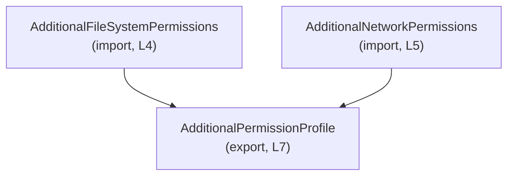
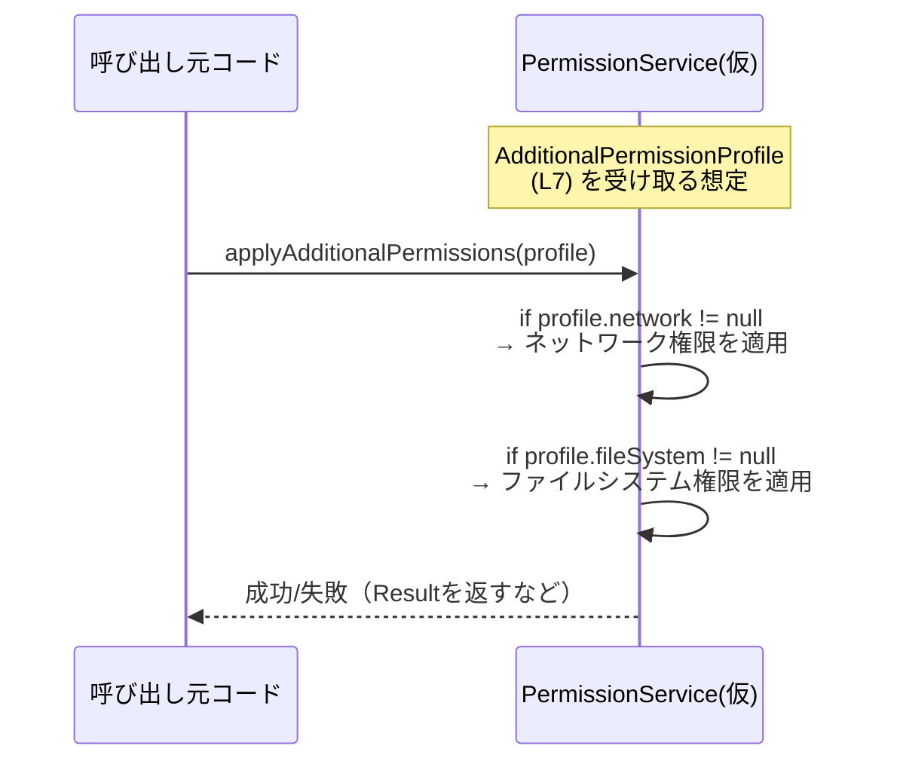

# app-server-protocol/schema/typescript/v2/AdditionalPermissionProfile.ts

## 0. ざっくり一言

`AdditionalPermissionProfile` は、追加のネットワーク権限とファイルシステム権限を 1 つのオブジェクトに束ねるための **TypeScript 型エイリアス** です（AdditionalPermissionProfile.ts:L7-7）。

---

## コンポーネントインベントリー（本チャンク）

| 種別 | 名前 | 定義/参照行 | 説明 |
|------|------|------------|------|
| 型（import） | `AdditionalFileSystemPermissions` | AdditionalPermissionProfile.ts:L4-4 | 追加のファイルシステム権限を表す型（詳細は別ファイル。内容はこのチャンクには現れません）。 |
| 型（import） | `AdditionalNetworkPermissions` | AdditionalPermissionProfile.ts:L5-5 | 追加のネットワーク権限を表す型（詳細は別ファイル。内容はこのチャンクには現れません）。 |
| 型（export） | `AdditionalPermissionProfile` | AdditionalPermissionProfile.ts:L7-7 | `network` と `fileSystem` の 2 プロパティを持つオブジェクト型。どちらも `null` を許容します。 |

---

## 1. このモジュールの役割

### 1.1 概要

このモジュールは、追加のネットワーク権限とファイルシステム権限をまとめて扱うための **権限プロファイル型** を提供します（AdditionalPermissionProfile.ts:L4-5, L7-7）。  
コード冒頭のコメントから、このファイルは `ts-rs` によって自動生成されており、手動編集しないことが前提です（AdditionalPermissionProfile.ts:L1-3）。

### 1.2 アーキテクチャ内での位置づけ

このモジュールは 2 つの権限型に依存し、それらを 1 つのプロファイルとして公開する位置づけになっています（AdditionalPermissionProfile.ts:L4-5, L7-7）。



> 図は、このファイル内（L4–L7）での依存関係のみを表しています。

### 1.3 設計上のポイント

- **自動生成コード**  
  - `ts-rs` により生成されることが明示されており、手で編集しない前提です（AdditionalPermissionProfile.ts:L1-3）。
- **状態を持たない定義モジュール**  
  - 実行時の状態やロジックは持たず、型定義のみを提供します（AdditionalPermissionProfile.ts:L4-7）。
- **null 許容による表現力**  
  - `network` と `fileSystem` はいずれも `null` を許容し、「追加権限が存在しない」状態を明示的に表現できるようになっています（AdditionalPermissionProfile.ts:L7-7）。

---

## 2. 主要な機能一覧

このファイルは関数を持たず、型定義のみを提供します。主な「機能」は次の 1 点です。

- 追加権限プロファイル型の提供: `network` と `fileSystem` の 2 種類の追加権限を 1 つのオブジェクトにまとめる（AdditionalPermissionProfile.ts:L7-7）。

---

## 3. 公開 API と詳細解説

### 3.1 型一覧（構造体・列挙体など）

| 名前 | 種別 | 役割 / 用途 | フィールド概要 |
|------|------|-------------|----------------|
| `AdditionalPermissionProfile` | 型エイリアス | 追加の権限設定をまとめて受け渡しするためのプロファイル型です（AdditionalPermissionProfile.ts:L7-7）。 | `network: AdditionalNetworkPermissions \| null` – 追加のネットワーク権限。<br>`fileSystem: AdditionalFileSystemPermissions \| null` – 追加のファイルシステム権限。 |

#### `AdditionalPermissionProfile`

```ts
export type AdditionalPermissionProfile = {
    network: AdditionalNetworkPermissions | null,
    fileSystem: AdditionalFileSystemPermissions | null,
};
```

（AdditionalPermissionProfile.ts:L7-7）

**概要**

- ネットワークとファイルシステムそれぞれの追加権限をまとめて扱うためのオブジェクト型です。
- 両フィールドとも `null` を許容するため、「その種別の追加権限が未設定・なし」という状態を表現できます（型定義から読み取れる事実として）。

**契約（Contract）**

- `network` プロパティは常に存在しますが、値は `AdditionalNetworkPermissions` または `null` のいずれかです（AdditionalPermissionProfile.ts:L7-7）。
- `fileSystem` プロパティも同様に、常にプロパティ自体は存在し、値は `AdditionalFileSystemPermissions` または `null` です（AdditionalPermissionProfile.ts:L7-7）。
- `AdditionalNetworkPermissions` / `AdditionalFileSystemPermissions` の具体的な中身や制約は、このチャンクには現れません（AdditionalPermissionProfile.ts:L4-5）。

**TypeScript における安全性**

- `null` をユニオン型に含めることで、利用側で **コンパイル時に null チェックの有無を検査** できます。  
  例: `strictNullChecks` が有効な場合、`profile.network` をそのまま使用するとコンパイラが警告/エラーを出し得ます。
- `import type` を使用しており、このファイルは型情報だけを依存として参照し、JavaScript の実行時コードには影響しません（AdditionalPermissionProfile.ts:L4-5）。

### 3.2 関数詳細（最大 7 件）

このファイルには関数・メソッドは一切定義されていません（AdditionalPermissionProfile.ts:L1-7）。  
したがって、関数詳細テンプレートに沿って説明すべき対象はありません。

### 3.3 その他の関数

- 補助関数やラッパー関数も定義されていません（AdditionalPermissionProfile.ts:L1-7）。

---

## 4. データフロー

このファイル単独では処理ロジックが存在しないため、実行時のデータフローは定義されていません。  
ここでは、`AdditionalPermissionProfile` を消費する典型的な処理のイメージを示します（あくまで利用側の一例であり、このチャンクには現れません）。



- 実際の適用ロジック（`PermissionService` や `applyAdditionalPermissions` 等）がどこにあり、何をするかは、このチャンクには現れません。

---

## 5. 使い方（How to Use）

### 5.1 基本的な使用方法

`AdditionalPermissionProfile` 型を使って、ネットワーク／ファイルシステムの追加権限を 1 つの値として扱う例です。

```ts
import type {
    AdditionalPermissionProfile,
} from "./AdditionalPermissionProfile"; // このファイルをインポート（パスは利用側プロジェクト構成に依存）

// 何らかの権限設定を受け取り、それを適用する関数の例
function configurePermissions(profile: AdditionalPermissionProfile) { // profile は型安全に扱える
    if (profile.network !== null) {                                   // null チェックが必要
        // profile.network の型は AdditionalNetworkPermissions に絞り込まれる
        // ネットワークの追加権限適用処理を書く
    }

    if (profile.fileSystem !== null) {                               // 同様に null チェック
        // profile.fileSystem は AdditionalFileSystemPermissions 型
        // ファイルシステムの追加権限適用処理を書く
    }
}
```

### 5.2 よくある使用パターン

1. **片方のみ追加権限を持つプロファイル**

```ts
const networkOnlyProfile: AdditionalPermissionProfile = {
    network: {/* AdditionalNetworkPermissions の値 */} as any, // ※ここでは型の中身がこのチャンクにないため as any で例示
    fileSystem: null,                                          // ファイルシステムの追加権限はなし
};
```

1. **どちらの追加権限も持たない（すべて null）プロファイル**

```ts
const noAdditionalPermissions: AdditionalPermissionProfile = {
    network: null,
    fileSystem: null,
};
```

> `AdditionalNetworkPermissions` / `AdditionalFileSystemPermissions` の具体的なフィールドは、このチャンクには現れないため、上記では `as any` で例示しています。

### 5.3 よくある間違い

**誤り例: null を考慮しない使用**

```ts
function badUsage(profile: AdditionalPermissionProfile) {
    // コンパイル設定によっては、strictNullChecks 時にエラーになる可能性がある
    profile.network.someMethod();      // network が null の可能性を無視している
}
```

**正しい例: null チェックを行う**

```ts
function goodUsage(profile: AdditionalPermissionProfile) {
    if (profile.network !== null) {    // null チェック
        profile.network.someMethod();  // ここでは network は AdditionalNetworkPermissions 型に絞り込まれる
    }
}
```

### 5.4 使用上の注意点（まとめ）

- **null の扱い**  
  - `network` / `fileSystem` はいずれも `null` を取り得るため、利用側で必ず null チェックを行う必要があります（AdditionalPermissionProfile.ts:L7-7）。
- **自動生成コードの編集禁止**  
  - 冒頭コメントで「手で編集しない」ことが示されており（AdditionalPermissionProfile.ts:L1-3）、変更は元となる定義（おそらく Rust 側など）で行う必要があります。
- **セキュリティ的な意味合い**  
  - 型名から権限情報に関係することが推測されますが、どの権限をどのように適用するか、またそれがどの程度安全かは、このファイルだけからは判断できません。アクセス制御の実装側で適切な検証・制限を行う必要があります。
- **並行性**  
  - このファイルは純粋な型定義のみであり、並行処理・スレッドセーフティに関するロジックは一切含んでいません。並行アクセス時の安全性は、この型を利用する実装側の責務になります。

---

## 6. 変更の仕方（How to Modify）

### 6.1 新しい機能を追加する場合

- 冒頭コメントにある通り、このファイルは `ts-rs` によって生成されています（AdditionalPermissionProfile.ts:L1-3）。
- 新しいフィールドや権限種別を追加したい場合は、**この TypeScript ファイルではなく、`ts-rs` の生成元（おそらく Rust 側の型定義）を変更する**必要があります。
- 生成元を変更後、`ts-rs` のコード生成を再実行することで、このファイルの内容が更新される構成と考えられます（ただし、具体的なビルドフローはこのチャンクには現れません）。

### 6.2 既存の機能を変更する場合

- `network` / `fileSystem` プロパティの型や null 許容性を変更すると、これを利用するすべてのコードに影響します。
  - たとえば `null` を許容しないようにすると、既存コードでの null ハンドリングが不要になる一方、既存の `null` を渡している箇所はコンパイルエラーになります。
- 影響範囲を確認する際は、`AdditionalPermissionProfile` を参照している箇所（型注釈、関数引数、戻り値、シリアライズ/デシリアライズ処理など）を検索する必要があります。
- このファイルを直接編集しても、次回のコード生成で上書きされる可能性が高いため、恒久的な変更は生成元の定義に対して行うことが前提と考えられます（AdditionalPermissionProfile.ts:L1-3）。

---

## 7. 関連ファイル

| パス | 役割 / 関係 |
|------|------------|
| `app-server-protocol/schema/typescript/v2/AdditionalFileSystemPermissions.ts` | `AdditionalFileSystemPermissions` 型の定義があると推測されますが、このチャンクにはその内容は現れません。`fileSystem` プロパティの型として使用されています（AdditionalPermissionProfile.ts:L4-4, L7-7）。 |
| `app-server-protocol/schema/typescript/v2/AdditionalNetworkPermissions.ts` | `AdditionalNetworkPermissions` 型の定義があると推測されますが、このチャンクにはその内容は現れません。`network` プロパティの型として使用されています（AdditionalPermissionProfile.ts:L5-5, L7-7）。 |

> 上記の関連ファイル名は、import 文の相対パスから読み取れる範囲での記述です（AdditionalPermissionProfile.ts:L4-5）。内容や内部構造はこのチャンクには現れません。

---

### テスト・バグ・パフォーマンスに関する補足

- **テスト**  
  - このファイル内にはテストコードや型チェック以外の検証ロジックは含まれていません（AdditionalPermissionProfile.ts:L1-7）。
- **潜在的なバグ/エッジケース**  
  - 主なエッジケースは「`network` / `fileSystem` が `null` である場合」であり、これを想定せずに利用するとランタイムエラーが発生し得ます。  
    ただし、そのエラーはこの型を利用する側のコードで発生します。
- **パフォーマンス/スケーラビリティ**  
  - 型定義のみであり、実行時のオーバーヘッドはありません。大規模な権限データを扱う場合でも、このファイル自体がボトルネックになることは想定しにくい構造です（AdditionalPermissionProfile.ts:L4-7）。
