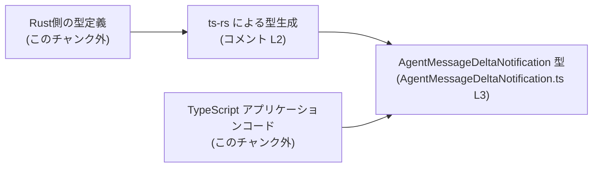
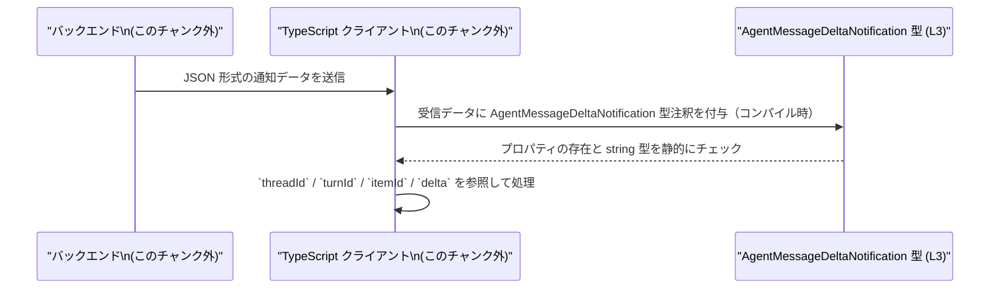

# app-server-protocol/schema/typescript/v2/AgentMessageDeltaNotification.ts

## 0. ざっくり一言

このファイルは、自動生成された TypeScript の型エイリアス `AgentMessageDeltaNotification` を 1 つだけ定義し、4 つの必須 string フィールドを持つオブジェクトの構造を表現しています（`AgentMessageDeltaNotification.ts:L1-3`）。

---

## 1. このモジュールの役割

### 1.1 概要

- このモジュールは、`AgentMessageDeltaNotification` という名前のオブジェクト型を公開し、  
  `threadId`, `turnId`, `itemId`, `delta` の 4 フィールドを `string` として持つデータ構造を定義します（`AgentMessageDeltaNotification.ts:L3-3`）。
- ファイル先頭のコメントから、この定義は `ts-rs` によって Rust 側から自動生成された TypeScript バインディングであることが分かります（`AgentMessageDeltaNotification.ts:L1-2`）。

### 1.2 アーキテクチャ内での位置づけ

このファイル単体では他モジュールとの依存関係は出てきません（import がないため）。  
コメントから、Rust 側の型定義を `ts-rs` でエクスポートした結果であり、アプリケーション側 TypeScript コードから参照される立場にあると解釈できます。



※ Rust 側の型やアプリケーションコードの具体的な場所や内容は、このチャンクには現れません。

### 1.3 設計上のポイント

- **自動生成であることの明示**  
  - 「手で変更してはいけない」旨が明記されています（`AgentMessageDeltaNotification.ts:L1-2`）。
- **型のみを提供する構造**  
  - 関数やクラスは一切なく、型エイリアス 1 つだけをエクスポートします（`AgentMessageDeltaNotification.ts:L3-3`）。
- **必須フィールドのみ**  
  - 4 つのプロパティはすべて `?` が付いていないため必須であり、すべて `string` 型です（`AgentMessageDeltaNotification.ts:L3-3`）。
- **言語固有の安全性**  
  - TypeScript の静的型チェックにより、これらのプロパティが欠けていたり型が違う場合はコンパイル時エラーになります。
  - ただし、実行時のバリデーションは含まれないため、外部入力に対しては別途チェックが必要です。

---

## 2. 主要な機能一覧

「機能」というよりは、公開される型定義が 1 つ存在します。

- `AgentMessageDeltaNotification` 型:  
  4 つの string フィールド（`threadId`, `turnId`, `itemId`, `delta`）を持つオブジェクト構造を表します（`AgentMessageDeltaNotification.ts:L3-3`）。

---

## 3. 公開 API と詳細解説

### 3.1 型一覧（構造体・列挙体など）

| 名前 | 種別 | フィールド概要 | 役割 / 用途 | 定義箇所 |
|------|------|----------------|------------|----------|
| `AgentMessageDeltaNotification` | 型エイリアス（オブジェクト型） | `threadId: string`, `turnId: string`, `itemId: string`, `delta: string` | 4 つの string フィールドを持つオブジェクトの構造を表す。用途（意味論）はこのチャンクからは特定できません。 | `AgentMessageDeltaNotification.ts:L3-3` |

#### 型の契約（Contract）

この型に対して TypeScript が課す契約は次のとおりです（いずれもコンパイル時のルールです）。

- 4 つのプロパティはすべて **必須**。
- 各プロパティの値は `string` 型でなければならない。
- 追加プロパティの有無はコンパイラ設定（`noImplicitAny`, `exactOptionalPropertyTypes` など）によりますが、この定義自体は追加プロパティを明示的に禁止してはいません。

### 3.2 関数詳細（最大 7 件）

このファイルには関数定義が存在しません（メタ情報 `functions=0` およびコード全体 `AgentMessageDeltaNotification.ts:L1-3` より）。

### 3.3 その他の関数

このファイルには補助関数・ラッパー関数も一切定義されていません。

---

## 4. データフロー

このチャンクには、`AgentMessageDeltaNotification` を実際に生成・送受信するコードは含まれていません。  
ただし、TypeScript 型として一般的に想定される利用イメージを示すと、次のような流れになります（**図はあくまで典型例であり、実際の処理フローはこのチャンクからは分かりません**）。



- 型定義 `AgentMessageDeltaNotification` 自体はコンパイル時にのみ存在し、実行時には消えます（TypeScript の通常の振る舞い）。
- 実行時のデータ整合性（プロパティ欠落や型不一致）については、この型だけでは保証されません。

---

## 5. 使い方（How to Use）

### 5.1 基本的な使用方法

ここでは、同じディレクトリにこのファイルがあると仮定したインポート例を示します。  
実際のインポートパスはプロジェクトの構成に依存し、このチャンクからは特定できません。

```typescript
// AgentMessageDeltaNotification 型をインポートする                      // この型を他ファイルから利用する前提
import type { AgentMessageDeltaNotification } from "./AgentMessageDeltaNotification"; // 実際のパスはプロジェクト構成による

// 通知オブジェクトを受け取って処理する関数                             // この型を引数の型として利用
function handleNotification(notification: AgentMessageDeltaNotification) {  // notification は 4 つの string フィールドを持つ
    console.log(notification.threadId);                                     // threadId は string として補完・型チェックされる
    console.log(notification.delta);                                        // delta も string 型で参照可能
    // ここで必要な処理を記述                                             // 実際の処理内容はこのチャンクからは不明
}

// 型に従ったオブジェクトを作成する例                                   // すべてのフィールドを指定する必要がある
const n: AgentMessageDeltaNotification = {
    threadId: "thread-123",                                                 // string 型
    turnId: "turn-1",                                                       // string 型
    itemId: "item-42",                                                      // string 型
    delta: "差分の内容",                                                   // string 型
};

handleNotification(n);                                                      // 型が一致しているのでコンパイルエラーは起きない
```

このように、型注釈として利用することで、フィールド名の補完や型チェック（誤った型の代入の検出）が得られます。

### 5.2 よくある使用パターン

1. **配列としてまとめて扱う**

```typescript
import type { AgentMessageDeltaNotification } from "./AgentMessageDeltaNotification"; // 型をインポート

// 通知の配列を受け取る関数                                             // 複数件まとめて処理する想定
function processAll(notifications: AgentMessageDeltaNotification[]) {      // 配列要素の型が明確になる
    for (const n of notifications) {                                       // 1 件ずつ取り出す
        console.log(n.itemId, n.delta);                                    // itemId, delta は string として扱える
    }
}
```

1. **戻り値の型として利用する**

```typescript
import type { AgentMessageDeltaNotification } from "./AgentMessageDeltaNotification";

// 通知オブジェクトを作って返す関数                                     // 戻り値に型を付ける例
function createNotification(/* ... */): AgentMessageDeltaNotification {    // 戻り値の形が明確になる
    return {
        threadId: "thread-123",                                            // ここで型チェックが行われる
        turnId: "turn-1",
        itemId: "item-42",
        delta: "差分の内容",
    };
}
```

### 5.3 よくある間違い

TypeScript の型チェックによって検出される典型的な誤り例です。

```typescript
import type { AgentMessageDeltaNotification } from "./AgentMessageDeltaNotification";

// 間違い例 1: 必須プロパティの欠落
const bad1: AgentMessageDeltaNotification = {
    threadId: "thread-123",
    turnId: "turn-1",
    // itemId がない                                          // コンパイルエラー: プロパティ 'itemId' が不足
    delta: "差分の内容",
};

// 間違い例 2: 型の不一致
const bad2: AgentMessageDeltaNotification = {
    threadId: "thread-123",
    turnId: "turn-1",
    itemId: "item-42",
    delta: 123,                                              // コンパイルエラー: number を string に代入している
};

// 正しい例
const good: AgentMessageDeltaNotification = {
    threadId: "thread-123",
    turnId: "turn-1",
    itemId: "item-42",
    delta: "差分の内容",                                     // 4 つすべて string で揃っている
};
```

### 5.4 使用上の注意点（まとめ）

- **手動で編集しないこと**  
  - ファイル先頭で「GENERATED CODE」「Do not edit manually」と明示されているため（`AgentMessageDeltaNotification.ts:L1-2`）、仕様変更は元の Rust 側定義と `ts-rs` の生成設定で行う必要があります。
- **実行時チェックがないこと**  
  - この型は TypeScript のコンパイル時チェックにのみ影響し、実行時に JSON を検証したりはしません。外部からの入力（HTTP レスポンスなど）にこの型をそのまま付ける場合、ランタイムのバリデーション（`zod` や自前の type guard など）が別途必要です。
- **string 以外の情報は表現されていないこと**  
  - 各 ID や `delta` のフォーマット（UUID かどうか、空文字を許すかどうかなど）は型では表現されていません。これらの制約がある場合は、コメントやランタイムチェックで補う必要があります。
- **並行性・パフォーマンスへの影響**  
  - 型エイリアスのみであり、実行時のオブジェクトレイアウトやパフォーマンス、並行性に直接の影響はありません。

---

## 6. 変更の仕方（How to Modify）

### 6.1 新しい機能（フィールド）を追加する場合

このファイルは `ts-rs` によって生成されており、コメントでも「手動で変更しない」旨が書かれています（`AgentMessageDeltaNotification.ts:L1-2`）。  
そのため、フィールド追加などの変更は **このファイルではなく元の Rust 側定義** で行うのが前提になります。

一般的な手順（元定義の場所はこのチャンクからは分かりません）:

1. Rust プロジェクト内で、`AgentMessageDeltaNotification` に対応する構造体（推測される）が定義されているファイルを探す。  
   - どのファイルかはこのチャンクには現れないため、不明です。
2. その構造体にフィールドを追加し、`ts-rs` が認識できるように適切な属性を付与する（`#[ts(export)]` など）。  
   - 具体的な属性名は `ts-rs` のドキュメントに依存します。
3. `ts-rs` のコード生成を再実行し、TypeScript 側の定義を更新する。
4. TypeScript プロジェクトをビルドし、追加フィールドを参照している箇所で型エラーがないことを確認する。

### 6.2 既存のフィールドを変更する場合

- **型変更（例: `string` → `string | null`）**  
  - 変更後は、この型を利用しているすべての TypeScript コードで、該当フィールドの取り扱いを見直す必要があります。
  - `strictNullChecks` 有効時は、`null` の可能性を処理するコードを追加しないとコンパイルエラーが発生します。
- **フィールド名変更（例: `itemId` → `messageId`）**  
  - 参照しているすべての箇所で名前を更新する必要があります。
  - 自動リファクタリング機能（IDE）を使わない場合、見落としが発生しやすいため注意が必要です。
- **後方互換性への影響**  
  - 型の変更は、同じプロトコルを共有している他コンポーネント（別サービスやフロントエンドアプリ）にも影響し得ます。
  - このファイル単体からはどこで使われているか分からないため、利用箇所の検索と影響範囲の確認が重要です。

---

## 7. 関連ファイル

このチャンクには具体的な関連ファイルのパスは現れていませんが、概念的に関係が深いものを整理します。

| パス / 区分 | 役割 / 関係 |
|------------|------------|
| （Rust 側の元定義ファイル、パス不明） | `ts-rs` が参照する Rust の型定義。ここでの変更が本ファイルに反映されると考えられます（コメント `AgentMessageDeltaNotification.ts:L2-2` より推測）。 |
| `app-server-protocol/schema/typescript/v2/` 内の他の `.ts` ファイル（推測） | 同じプロトコルスキーマの別型定義が格納されている可能性がありますが、このチャンクには具体的な情報はありません。 |
| この型を `import` しているアプリケーションコード（パス不明） | `AgentMessageDeltaNotification` 型を利用して通知を処理する側のロジック。どこに存在するかは本チャンクからは分かりません。 |

---

### このチャンクから読み取れる事実の根拠（行番号付き）

- 自動生成コードであり手動変更禁止であること: `// GENERATED CODE! DO NOT MODIFY BY HAND!`（`AgentMessageDeltaNotification.ts:L1-1`）、`// This file was generated by [ts-rs](...). Do not edit this file manually.`（`AgentMessageDeltaNotification.ts:L2-2`）
- 公開されている型定義が `AgentMessageDeltaNotification` ただ 1 つであること:  
  `export type AgentMessageDeltaNotification = { threadId: string, turnId: string, itemId: string, delta: string, };`（`AgentMessageDeltaNotification.ts:L3-3`）
- フィールドが 4 つすべて `string` 型で、いずれもオプションでないこと: 同上 `AgentMessageDeltaNotification.ts:L3-3`
