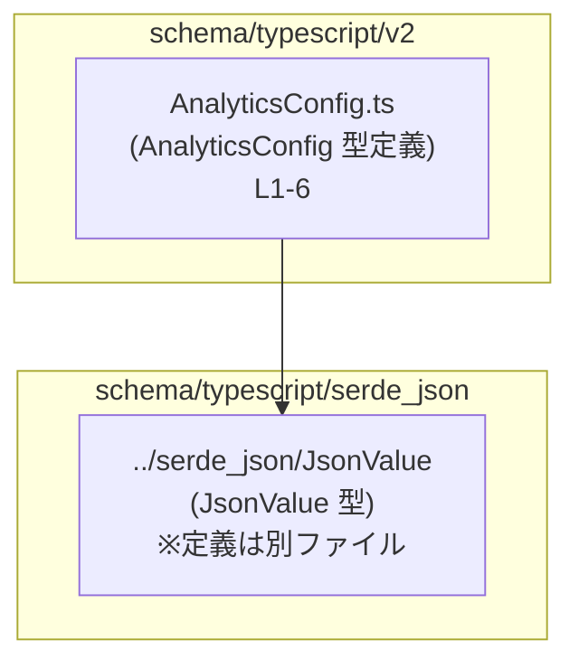
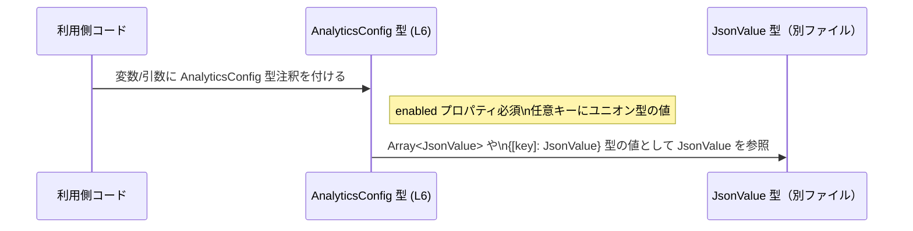

# app-server-protocol/schema/typescript/v2/AnalyticsConfig.ts コード解説

## 0. ざっくり一言

- `AnalyticsConfig` という設定オブジェクトの **型エイリアス**（TypeScript の型定義）だけを公開するモジュールです。  
- `enabled` という必須フラグと、任意の文字列キーに対する複数種類の値を持てる「柔軟な設定マップ」を型レベルで表現しています（`AnalyticsConfig.ts:L6-6`）。

---

## 1. このモジュールの役割

### 1.1 概要

- このモジュールは、`AnalyticsConfig` という 1 つの型エイリアスを提供します（`AnalyticsConfig.ts:L6-6`）。
- `AnalyticsConfig` は次の 2 つを **交差型（intersection type）** で組み合わせた型です。
  - 必須プロパティ `enabled: boolean | null`
  - 文字列キーに対する任意の追加設定（値は限定されたユニオン型）
- 実行時の処理や関数は含まれず、**静的な型情報のみ** を提供します。

### 1.2 アーキテクチャ内での位置づけ

- このファイルは `JsonValue` 型をインポートしています（`AnalyticsConfig.ts:L4-4`）。
- `AnalyticsConfig` 自体は他のファイルからインポートされて、設定オブジェクトの型注釈などに使われることが想定されますが、実際の利用箇所はこのチャンクには現れません。



- 上図は、このファイル内で確認できる依存関係のみを示しています。
  - `AnalyticsConfig.ts` は `JsonValue` をインポートして型定義に利用しています（`AnalyticsConfig.ts:L4-6`）。
  - `JsonValue` の中身や、`AnalyticsConfig` を利用する側のコードは、このチャンクには現れません。

### 1.3 設計上のポイント

コードから読み取れる設計上の特徴は次のとおりです。

- **自動生成コード**  
  - 冒頭コメントにより、このファイルは `ts-rs` によって自動生成され、手動編集が禁止されていることが明示されています（`AnalyticsConfig.ts:L1-3`）。
- **交差型による必須 + 任意プロパティの組み合わせ**  
  - `{ enabled: boolean | null }` と、文字列キーのインデックスシグネチャを交差させることで、「`enabled` は必須」「その他の任意キーも許容」という構造になっています（`AnalyticsConfig.ts:L6-6`）。
- **ユニオン型による値の制限**  
  - 任意キーの値は `number | string | boolean | Array<JsonValue> | { [key in string]?: JsonValue } | null` に限定されています（`AnalyticsConfig.ts:L6-6`）。
- **状態やエラー処理を持たない**  
  - 関数やクラスはなく、型のみの定義なので、実行時の状態管理・エラーハンドリング・並行性への直接の関与はありません。

---

## 2. 主要な機能一覧（コンポーネントインベントリー）

このモジュールが提供する「機能」は、型定義 1 件のみです。

- `AnalyticsConfig`:  
  - `enabled` という必須の有効フラグと、任意の文字列キーに対する設定値を表現する設定オブジェクト型（`AnalyticsConfig.ts:L6-6`）。

補助的なコンポーネントとして、次のインポートがあります。

- `JsonValue`（インポートのみ）:  
  - 任意の JSON 風の値を表す型と推測されますが、このチャンクには定義がないため、詳細は不明です（`AnalyticsConfig.ts:L4-4`）。

---

## 3. 公開 API と詳細解説

### 3.1 型一覧（構造体・列挙体など）

#### 型エイリアス一覧

| 名前              | 種別        | 役割 / 用途                                                                                         | 定義位置                         |
|-------------------|-------------|------------------------------------------------------------------------------------------------------|----------------------------------|
| `AnalyticsConfig` | 型エイリアス | `enabled` フラグと任意の文字列キーに対する設定値を持つオブジェクトの構造を表す                     | `AnalyticsConfig.ts:L6-6`       |

#### `AnalyticsConfig` の詳細

```ts
export type AnalyticsConfig = {
    enabled: boolean | null,
} & {
    [key in string]?: number
        | string
        | boolean
        | Array<JsonValue>
        | { [key in string]?: JsonValue }
        | null
};
```

**構造の分解（すべて `AnalyticsConfig.ts:L6-6` に基づく）：**

1. **必須プロパティ部分**

   ```ts
   { enabled: boolean | null }
   ```

   - `enabled` は **必須プロパティ** です（オプショナル `?` が付いていない）。
   - 型は `boolean | null` なので、`true` / `false` / `null` のいずれかを受け取ります。
     - `null` を許容しているため、「未設定」や「不明」を表現できる設計になっています。

2. **任意プロパティ部分（インデックスシグネチャ）**

   ```ts
   { [key in string]?: number
       | string
       | boolean
       | Array<JsonValue>
       | { [key in string]?: JsonValue }
       | null
   }
   ```

   - 任意の文字列 `key` をプロパティ名として追加できます（オプショナル `?` が付いているため、存在しなくてもよい）。
   - 値の型は次のユニオン型のいずれかです。
     - `number`
     - `string`
     - `boolean`
     - `Array<JsonValue>`
     - `{ [key in string]?: JsonValue }`（文字列キーを持つオブジェクトで、各プロパティは `JsonValue` 型）
     - `null`
   - これにより、数値や文字列、真偽値、`JsonValue` の配列・オブジェクトなど、ある程度限定された JSON 風の値を格納できます。

3. **交差型（intersection）**

   ```ts
   { enabled: boolean | null } & { [key in string]?: ... }
   ```

   - 交差型 `&` により、**両方の条件を同時に満たす** オブジェクトであることが要求されます。
     - `enabled` プロパティが必須であること。
     - かつ任意の追加キーを持てること。
   - `enabled` というキーはインデックスシグネチャにも該当しますが、値の許容型に `boolean` と `null` が含まれているため、型として矛盾はありません。

### 3.2 関数詳細（最大 7 件）

- このファイルには **関数・メソッドは定義されていません**（コメント・インポート・型エイリアスのみです。`AnalyticsConfig.ts:L1-6`）。
- したがって、ここで解説すべき関数 API やエラーハンドリングロジックは存在しません。

### 3.3 その他の関数

- 補助的な関数やラッパー関数も、このチャンクには存在しません。

---

## 4. データフロー

このモジュールは型定義のみであり、実行時に値を生成・変換するロジックは含みません。そのため、データフローはあくまで「型注釈として利用される」という静的な関係になります。

### 4.1 典型的な利用イメージ（型レベルのフロー）



- このファイル自体は実行時に何も処理しません。
- 利用側コードは、`AnalyticsConfig` を変数や関数引数の型として使い、コンパイル時に次のような型チェックを受けます。
  - `enabled` が欠けていないか。
  - 任意キーの値が許可された型（`number | string | boolean | Array<JsonValue> | { [key in string]?: JsonValue } | null`）になっているか。

---

## 5. 使い方（How to Use）

### 5.1 基本的な使用方法

`AnalyticsConfig` 型を使って設定オブジェクトを定義する基本例です。  
`JsonValue` の構造はこのチャンクからは分からないため、`declare` で外部から与えられるものとして扱っています。

```ts
import type { AnalyticsConfig } from "./AnalyticsConfig";      // このファイルから AnalyticsConfig をインポートする（パスは利用側の位置に応じて調整）
import type { JsonValue } from "../serde_json/JsonValue";      // JsonValue も型としてインポート（`AnalyticsConfig.ts:L4-4` に一致）

declare const someJson: JsonValue;                             // どこかから渡される JsonValue 型の値（構造はこのチャンクからは不明）

// AnalyticsConfig 型の値を作成する基本例
const config: AnalyticsConfig = {                              // config に AnalyticsConfig 型を付ける
    enabled: true,                                             // 必須プロパティ: boolean | null
    sample_rate: 0.5,                                          // 任意キー: number なので許可される
    endpoint: "https://example.com/analytics",                 // 任意キー: string も許可
    debug: false,                                              // 任意キー: boolean も許可
    extra_data: [someJson],                                    // 任意キー: Array<JsonValue> も許可
    nested: {                                                  // 任意キー: オブジェクト（{[key]: JsonValue}）も許可
        foo: someJson,                                         // ここで JsonValue 型を利用
    },
    unused: null,                                              // 任意キー: null も許可
};
```

この例では、TypeScript コンパイラが次の点をチェックします。

- `enabled` が必須であり、`boolean` か `null` であること。
- その他のプロパティの値が、許された型のいずれかであること。

### 5.2 よくある使用パターン

#### パターン 1: 関数の引数として渡す

```ts
import type { AnalyticsConfig } from "./AnalyticsConfig";

function initializeAnalytics(config: AnalyticsConfig) {        // 引数に AnalyticsConfig を指定
    // ここでは config.enabled が存在し、boolean | null であることが保証される
    if (config.enabled === false) {                            // false の場合は何もしない
        return;
    }

    // enabled が true か null（未定義扱い）であれば、追加の設定キーを読む
    const endpoint = config.endpoint as string | undefined;    // endpoint の存在と型は呼び出し側に依存
    // ... 実際の初期化処理はこのファイルからは不明
}
```

- 利用側関数は、`enabled` が必ず存在する前提で実装できます。
- 任意キー（例: `endpoint`）については存在確認や型チェックを適宜行う必要があります。

#### パターン 2: 部分的な設定を組み合わせて最終形を作る

```ts
import type { AnalyticsConfig } from "./AnalyticsConfig";

const baseConfig: AnalyticsConfig = {
    enabled: true,
};

const envConfig: AnalyticsConfig = {
    enabled: null,                                             // 「環境に依存する」といった意味合いで null を使うことも可能
    log_level: "info",
};

const finalConfig: AnalyticsConfig = {
    ...baseConfig,
    ...envConfig,                                              // スプレッドでマージするのも通常のオブジェクトと同様
    enabled: envConfig.enabled ?? baseConfig.enabled,          // enabled の解決ロジックを明示的に書くこともできる
};
```

- 通常のオブジェクト同様、スプレッド構文でマージ可能です。
- `enabled` は必須のため、最終的にどの値を採用するかを明示しておくと、読みやすくなります。

### 5.3 よくある間違い

#### 1. `enabled` を省略してしまう

```ts
import type { AnalyticsConfig } from "./AnalyticsConfig";

const badConfig: AnalyticsConfig = {
    // enabled: true,                                          // ❌ 必須プロパティを省略している
    sample_rate: 0.5,
};
```

- `AnalyticsConfig` の定義では `enabled` が必須なので、上記はコンパイルエラーになります。  
  （根拠: `enabled` には `?` が付いていない。`AnalyticsConfig.ts:L6-6`）

#### 2. 許可されていない型の値を入れてしまう

```ts
import type { AnalyticsConfig } from "./AnalyticsConfig";

const badConfig2: AnalyticsConfig = {
    enabled: true,
    startedAt: new Date(),                                     // ❌ Date 型は union に含まれていない
};
```

- 任意キーの値のユニオン型には `Date` は含まれていません（`AnalyticsConfig.ts:L6-6`）。
- そのため、コンパイラは型エラーを報告します。

#### 3. `enabled` を `undefined` にする

```ts
const badConfig3: AnalyticsConfig = {
    enabled: undefined,                                        // ❌ boolean | null に undefined は含まれない
};
```

- `enabled` の型は `boolean | null` であり、`undefined` は許可されていません（`AnalyticsConfig.ts:L6-6`）。

### 5.4 使用上の注意点（まとめ）

- **`enabled` は必須 & `boolean | null`**
  - `undefined` や値の欠落はコンパイルエラーになります。
- **任意キーの値の型制約**
  - `number | string | boolean | Array<JsonValue> | { [key in string]?: JsonValue } | null` 以外の型は許可されません。
  - 特に `Date` や関数、クラスインスタンスなどはすべて型エラーになります。
- **JsonValue の構造はこのチャンクからは不明**
  - `JsonValue` の中身に依存したロジックを書く場合は、別ファイルの定義を確認する必要があります（`AnalyticsConfig.ts:L4-4`）。
- **実行時のバリデーションは別途必要**
  - TypeScript の型はコンパイル時チェックのみです。外部から JSON を受け取る場合などは、実行時の検証ロジックを別途用意する必要があります。

---

## 6. 変更の仕方（How to Modify）

このファイルはコメントにより自動生成であることが明示されているため、**直接編集すると次回の生成で上書きされる** 点に注意が必要です（`AnalyticsConfig.ts:L1-3`）。

### 6.1 新しい機能（新しい値の型など）を追加する場合

- 一般的には、元になっているスキーマまたは Rust 側の型定義（`ts-rs` の入力）を変更し、再生成する形になると考えられますが、その詳細はこのチャンクには現れません。
- `AnalyticsConfig` に新たな値の型を追加したい場合の影響:
  - 例: `| Date` を追加したい、など。
  - 変更すべき箇所（概念的）:
    - 任意キーの値のユニオン部分  
      `number | string | boolean | Array<JsonValue> | { [key in string]?: JsonValue } | null`（`AnalyticsConfig.ts:L6-6`）
  - 影響:
    - `AnalyticsConfig` を使用している全てのコードで、新しい型がコンパイル時に許可されるようになります。
    - 実行時にその型を想定していない処理がある場合、ロジック側の修正も必要になります。

### 6.2 既存の機能（プロパティ構造）を変更する場合

- **`enabled` の型を変更する場合**
  - 例: `boolean` のみとし `null` を許容しないようにする  
    → 型定義を `enabled: boolean` に変更する必要があります（`AnalyticsConfig.ts:L6-6`）。
  - 影響:
    - これまで `enabled: null` を代入していた箇所がすべてコンパイルエラーになります。
- **任意キーの許可型を絞る・増やす場合**
  - 例: `string` のみ許可する、逆に `bigint` を追加する、など。
  - 影響:
    - 現在のユニオン型に応じて書かれている利用側コードのコンパイル結果が変わるため、変更前後での互換性に注意が必要です。
- **変更時の注意点**
  - このファイルは自動生成なので、直接編集ではなく生成元を変更する必要があります（`AnalyticsConfig.ts:L1-3`）。
  - 変更後は、`AnalyticsConfig` を利用している全ての箇所でコンパイルエラーが出ないかを確認する必要があります。

---

## 7. 関連ファイル

このモジュールと密接に関係するファイル・ディレクトリは次のとおりです。

| パス                         | 役割 / 関係                                                                 |
|------------------------------|------------------------------------------------------------------------------|
| `../serde_json/JsonValue`    | `JsonValue` 型を提供するモジュール。`AnalyticsConfig` の値の一部で利用される（`AnalyticsConfig.ts:L4-6`）。 |
| （不明）                     | `AnalyticsConfig` を実際にインポートして利用しているコードは、このチャンクには現れません。               |

---

### 言語固有の安全性・エラー・並行性に関する補足

- **静的型安全性**
  - `AnalyticsConfig` によって、設定オブジェクトの構造がコンパイル時にチェックされます。
  - 必須プロパティ `enabled` の存在と、その型（`boolean | null`）が保証されます。
- **エラー**
  - このファイル自体は実行時のエラー処理を行いませんが、型に違反するコードは TypeScript コンパイラがエラーとして検出します。
- **並行性**
  - 型定義のみであり、スレッドや非同期処理に関する状態は一切持ちません。
  - 並行性・同期制御は、この型を利用する側のロジックで扱うことになります。
