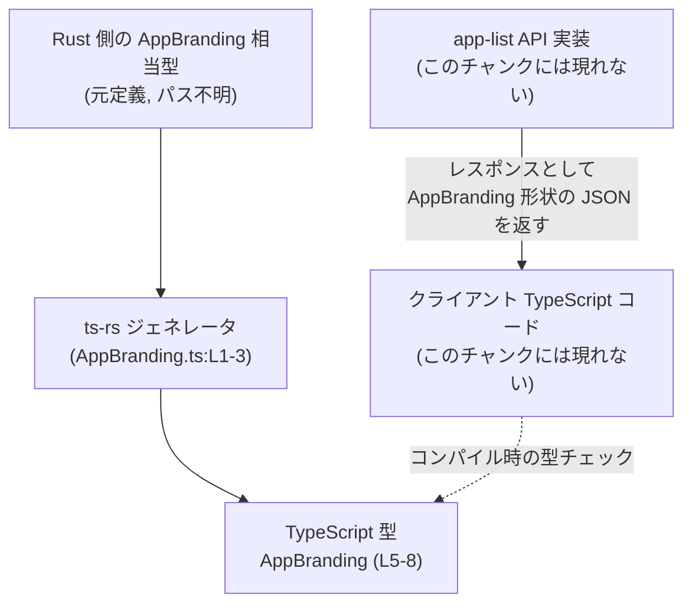
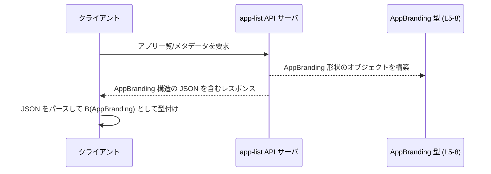

# app-server-protocol/schema/typescript/v2/AppBranding.ts コード解説

## 0. ざっくり一言

app-list API が返す「アプリのブランド情報（メタデータ）」を表現するための **自動生成された TypeScript 型定義**です（`AppBranding` 型）。

---

## 1. このモジュールの役割

### 1.1 概要

- このモジュールは **app-list API が返すアプリのメタデータを型安全に表現する**ために存在します（コメントより, AppBranding.ts:L5-7）。
- Rust 側の定義から `ts-rs` によって自動生成された TypeScript の `export type AppBranding` を 1 つだけ公開します（AppBranding.ts:L1-3, L8-8）。
- 文字列系フィールドは `string | null` として定義されており、「値がない」状態を `null` で表現します（AppBranding.ts:L8-8）。

### 1.2 アーキテクチャ内での位置づけ

このファイルはコメントから、Rust 側の型定義から `ts-rs` により生成された TypeScript スキーマであることが分かります（AppBranding.ts:L1-3）。  
また `EXPERIMENTAL - app metadata returned by app-list APIs.` という説明から、app-list API のレスポンススキーマの一部であることが分かります（AppBranding.ts:L5-6）。

その関係を簡略化すると、次のような構造になります。



> Rust 側の具体的な型名やファイルパス、app-list API の実装位置は、このチャンクには現れないため不明です。

### 1.3 設計上のポイント

コードから読み取れる設計上の特徴は次のとおりです。

- **自動生成コードであることの明示**  
  - ファイル冒頭のコメントで、「GENERATED CODE」「Do not edit this file manually」と明示されています（AppBranding.ts:L1-3）。  
  - 直接編集ではなく、元の Rust 定義を更新して `ts-rs` で再生成する前提のファイルです。
- **公開 API は 1 つの型エイリアスのみ**  
  - `export type AppBranding = { ... }` という **型エイリアス（type alias）** のみを公開しています（AppBranding.ts:L8-8）。
- **null 許容の文字列プロパティと必須 boolean**  
  - `category`, `developer`, `website`, `privacyPolicy`, `termsOfService` はすべて `string | null` です（AppBranding.ts:L8-8）。
  - `isDiscoverableApp` は `boolean` で、`null` や `undefined` は許容されない型になっています（AppBranding.ts:L8-8）。
- **状態やロジックは持たない**  
  - クラスや関数はなく、純粋に「データの形」を表すだけの宣言です。  
  - エラーハンドリングや並行性制御などのロジックは、このファイル内には一切ありません。

---

## 2. 主要な機能一覧

このファイルが提供する「機能」は 1 つの型定義だけです。

- `AppBranding` 型: app-list API が返すとコメントされているアプリのメタデータ（カテゴリ、開発者、Web サイト、各種ポリシー URL、ディスカバリ可能かどうか）を表現するオブジェクト型です（AppBranding.ts:L5-8）。

---

## 3. 公開 API と詳細解説

### 3.1 型一覧（構造体・列挙体など）

#### 3.1.1 型インベントリ

| 名前 | 種別 | 役割 / 用途 | 定義位置 |
|------|------|-------------|----------|
| `AppBranding` | 型エイリアス（オブジェクト型） | app-list API で返されるアプリのブランド情報メタデータを表現する。| `AppBranding.ts:L5-8` |

#### 3.1.2 `AppBranding` のフィールド一覧

元の定義は 1 行ですが（AppBranding.ts:L8-8）、内容を読みやすく整形すると次のようになります。

```typescript
export type AppBranding = {                          // AppBranding.ts:L8-8
    category: string | null;                         // アプリのカテゴリ
    developer: string | null;                        // 開発者名
    website: string | null;                          // Web サイト URL
    privacyPolicy: string | null;                    // プライバシーポリシー URL
    termsOfService: string | null;                   // 利用規約 URL
    isDiscoverableApp: boolean;                      // ディスカバリ可能かどうかのフラグ
};
```

各プロパティの型と意味（名前から読み取れる範囲の説明）は次のとおりです。説明が推測ベースである箇所には「※命名からの推測」を付けています。

| プロパティ名 | 型 | 説明 | 定義位置 |
|-------------|----|------|----------|
| `category` | `string \| null` | アプリのカテゴリ名（例: 「Productivity」等）を表す文字列と思われます。値がない場合は `null`。※命名からの推測 | `AppBranding.ts:L8-8` |
| `developer` | `string \| null` | 開発者名または開発元の名称を表す文字列と思われます。値がない場合は `null`。※命名からの推測 | `AppBranding.ts:L8-8` |
| `website` | `string \| null` | アプリや開発者の Web サイトの URL を表す文字列と思われます。値がない場合は `null`。※命名からの推測 | `AppBranding.ts:L8-8` |
| `privacyPolicy` | `string \| null` | プライバシーポリシーへの URL を表す文字列と思われます。値がない場合は `null`。※命名からの推測 | `AppBranding.ts:L8-8` |
| `termsOfService` | `string \| null` | 利用規約への URL を表す文字列と思われます。値がない場合は `null`。※命名からの推測 | `AppBranding.ts:L8-8` |
| `isDiscoverableApp` | `boolean` | このアプリが「発見可能」かどうかを示す真偽値フラグと思われます。※命名からの推測 | `AppBranding.ts:L8-8` |

**型レベルの契約（Contracts）**

TypeScript 側の型定義として読み取れる契約は次のとおりです。

- オブジェクトは必ず上記 6 つのプロパティを持つ（**プロパティ自体は省略不可**）  
  - TypeScript 型上はすべて必須プロパティであり、`?` は付いていません（AppBranding.ts:L8-8）。
- `category`, `developer`, `website`, `privacyPolicy`, `termsOfService`  
  - **値として `string` か `null` のいずれか** を取ります（AppBranding.ts:L8-8）。
- `isDiscoverableApp`  
  - **必ず `true` か `false` のいずれか**であり、`null` は許容されません（AppBranding.ts:L8-8）。

> 実際の JSON レスポンスでこれらのプロパティが常に存在するかどうかは、このチャンクには現れないため不明です。TypeScript の型としては「必ず存在する」と宣言されています。

#### エッジケース（AppBranding 型）

- 文字列プロパティが `null` の場合  
  - 例えば `developer` が `null` の場合、`branding.developer.toUpperCase()` のようにそのままメソッドを呼び出すと、コンパイル時にエラー（`object is possibly 'null'`）となります（`strictNullChecks` 有効時）。
  - ランタイムで `null` が来ることを前提に、必ず null チェックやデフォルト値の設定が必要です。
- プロパティ欠落  
  - 型上は許容されませんが、実際の API からプロパティが欠落した JSON が返った場合、TypeScript のコンパイラは検出できません（型情報は実行時には消えるため）。  
  - その場合、ランタイムで `branding.privacyPolicy` が `undefined` になりうる点に注意が必要です。
- `isDiscoverableApp` 未設定  
  - 型では必須なので、`undefined` を代入するとコンパイルエラーになります。  
  - サーバ側では必ず true/false のどちらかを埋める設計であることが期待されますが、このチャンクからはサーバ実装は分かりません。

#### 使用上の注意点（AppBranding 型）

- 文字列プロパティは **`null` 許容** であり、UI やロジックで利用する際には必ず null チェックを行う必要があります。
- TypeScript の型はコンパイル時のみで、**実行時に JSON の検証は行われません**。外部から受け取るデータを信頼しすぎると、`undefined` や不正フォーマットが紛れ込む可能性があります。
- この型は純粋なデータコンテナであり、**エラー・例外・並行処理の制御は一切行いません**。これらは別のレイヤー（API クライアント、サービス層など）で扱う必要があります。

### 3.2 関数詳細（最大 7 件）

このファイルには **関数やメソッドの定義は存在しません**（AppBranding.ts 全体を確認）。  
そのため、ここで詳細テンプレートを適用すべき関数はありません。

### 3.3 その他の関数

- 該当なし（このチャンクには関数が現れません）。

---

## 4. データフロー

### 4.1 代表的な処理シナリオ

コメントから分かる範囲での典型的なデータフローは次のようになります（AppBranding.ts:L5-6）。

1. クライアントがサーバに対して app-list API を呼び出す。
2. サーバ側はアプリ情報を取得し、そのメタデータ部分を **AppBranding 型相当の構造**として組み立てる。
3. サーバは JSON でレスポンスを返す。
4. TypeScript クライアント側では、この JSON を `AppBranding` 型として扱い、カテゴリや開発者名などを表示に用いる。

これをシーケンス図で表すと次のようになります。



> 実際に `AppBranding` がレスポンスのトップレベルなのか、レスポンスの一部フィールドなのかは、このチャンクには現れないため不明です。  
> 上の図は「AppBranding 形状のデータがレスポンスのどこかに含まれる」ことを示す抽象的なイメージです。

---

## 5. 使い方（How to Use）

### 5.1 基本的な使用方法

ここでは、同じディレクトリに `AppBranding.ts` がある別ファイルから利用する例を示します（インポートパスは例です）。

```typescript
// AppBranding 型をインポートする（同一ディレクトリにあると仮定）          // コンパイル時の型情報としてのみ利用
import type { AppBranding } from "./AppBranding";                           // 実行時には消える型

// サーバから特定アプリの AppBranding を取得する関数の例                   // データ取得の基本フロー
async function fetchAppBranding(appId: string): Promise<AppBranding> {      // 戻り値の型に AppBranding を指定
    const response = await fetch(`/api/apps/${appId}/branding`);            // app-list 系 API を呼び出す（URL は例）
    if (!response.ok) {                                                     // HTTP エラーをチェック
        throw new Error("failed to fetch app branding");                    // 適宜エラーを投げる
    }
    const data = await response.json();                                     // JSON をパース（実行時の構造は未検証）
    return data as AppBranding;                                             // data が AppBranding 形状であると仮定して型アサーション
}
```

ポイント:

- `AppBranding` は **型だけ**であり、ランタイムには出てきません（TypeScript 全般の性質）。
- `data as AppBranding` はコンパイル時には便利ですが、**実行時の検証は行わないため安全ではありません**。  
  必要に応じて Zod や io-ts などで検証するのが一般的です（本リポジトリで実際に使われているかどうかはこのチャンクからは不明です）。

### 5.2 よくある使用パターン

#### パターン1: アプリ一覧を `AppBranding[]` として扱う

app-list API のレスポンスの一部として、`AppBranding` の配列を扱う例です。

```typescript
import type { AppBranding } from "./AppBranding";                            // AppBranding 型をインポート

// 複数アプリのブランド情報を取得する関数の例                            // 一覧取得の想定
async function fetchAllBrandings(): Promise<AppBranding[]> {                 // 配列として返す
    const response = await fetch("/api/apps/branding");                      // URL は例
    const data = await response.json();                                      // JSON をパース
    return data as AppBranding[];                                            // 配列を AppBranding[] として扱う（要注意）
}

// ブランド情報を UI に描画する処理の例                                   // null を考慮した表示
function renderBrandingList(list: AppBranding[]): void {                     // 引数に AppBranding[] を受け取る
    for (const branding of list) {                                           // 各要素を順に処理
        const name = branding.developer ?? "Unknown developer";              // developer が null の場合はデフォルト文字列
        const category = branding.category ?? "Uncategorized";               // category も同様
        console.log(`${name} - ${category}`);                                // 表示に利用
    }
}
```

#### パターン2: null 許容文字列を安全に扱う

`string | null` のプロパティを使う際の典型的なパターンです。

```typescript
import type { AppBranding } from "./AppBranding";                            // 型をインポート

function printDeveloper(branding: AppBranding): void {                       // AppBranding を引数に取る
    if (branding.developer) {                                                // null でなく、空文字でない場合のみ
        // developer は string として安全に扱える                          // 型推論により string に絞られる
        console.log(branding.developer.toUpperCase());                       // 大文字にして表示
    } else {                                                                 // null または空文字の場合
        console.log("Developer not specified");                              // デフォルトメッセージ
    }
}
```

### 5.3 よくある間違い

#### 間違い例: `null` を考慮せずに文字列メソッドを呼ぶ

```typescript
import type { AppBranding } from "./AppBranding";

function badPrintDeveloper(branding: AppBranding) {
    // 間違い例: developer は string | null なのに、そのままメソッドを呼んでいる
    // strictNullChecks 有効時はコンパイルエラー:
    //   Object is possibly 'null'.
    console.log(branding.developer.toUpperCase());
}
```

#### 正しい例: null を考慮する

```typescript
import type { AppBranding } from "./AppBranding";

function goodPrintDeveloper(branding: AppBranding) {
    if (branding.developer !== null) {                                       // null を明示的にチェック
        console.log(branding.developer.toUpperCase());                       // ここでは developer は string 型
    } else {
        console.log("Developer not specified");                              // null の場合のフォールバック
    }
}
```

#### 間違い例: プロパティを省略してオブジェクトを作る

```typescript
// 間違い例: 型上はすべてのプロパティが必須だが、一部を省略している
const badBranding: AppBranding = {
    category: null,
    developer: "Example Dev",
    // website を付け忘れている -> コンパイルエラー（Property 'website' is missing）
    privacyPolicy: null,
    termsOfService: null,
    isDiscoverableApp: true,
};
```

### 5.4 使用上の注意点（まとめ）

- **null の扱い**
  - 文字列系プロパティはすべて `string | null` であり、UI 表示や文字列操作を行う前に null チェックが必要です。
- **型と実データの乖離**
  - TypeScript の型は実行時には存在しないため、サーバから返る JSON が常にこの型どおりとは限りません。  
    不正なレスポンスに備える場合は、別途実行時バリデーションが必要です。
- **並行性・スレッド安全性**
  - `AppBranding` はただのデータ構造で、副作用や共有状態を持ちません。  
    TypeScript/JavaScript のイベントループや Promise と組み合わせて並行処理を行っても、**この型そのものが並行性に関する問題を起こすことはありません**。
- **パフォーマンス**
  - 型エイリアスはコンパイル時のみの概念であり、ランタイムでの追加オーバーヘッドはありません。  
    大量の `AppBranding` オブジェクトを扱う場合でも、パフォーマンスは主に JSON サイズやネットワーク、アプリ側のロジックに依存します。

---

## 6. 変更の仕方（How to Modify）

### 6.1 新しい機能（フィールド）を追加する場合

このファイルは `ts-rs` による自動生成であり、冒頭で「Do not edit this file manually」と明示されています（AppBranding.ts:L1-3）。  
そのため、**直接この TypeScript ファイルを編集するのではなく、元になっている Rust 側の定義を変更する**必要があります。

一般的な手順（元ファイルはこのチャンクには現れないためパスは不明です）:

1. Rust 側の `AppBranding` 相当の構造体や型に、新しいフィールドを追加する。  
   - 例: `icon_url: Option<String>` のようなフィールドを追加する（Rust 側の例であり、このリポジトリに存在するかどうかは不明です）。
2. `ts-rs` のコード生成を再実行する。  
   - これにより `AppBranding.ts` が再生成され、新しいプロパティが TypeScript 側にも追加されます。
3. TypeScript コード側で、新フィールドを使う箇所を更新する。  
   - 例: `branding.iconUrl` を表示する UI などを追加。
4. API レスポンスの JSON が新フィールドを含むように、サーバ実装を更新・確認する。

**変更時の注意点**

- 既存クライアントとの互換性  
  - 新しいフィールドを追加するだけなら、通常は後方互換性がありますが、既存クライアントが古いスキーマを前提としている場合の挙動に注意が必要です。
- null/必須の設計  
  - 文字列系の新フィールドを追加する場合、既存のパターンに合わせて `string | null` とするか、`string` のみにするかを慎重に決める必要があります（どちらにするかは仕様次第であり、このチャンクからは決められません）。

### 6.2 既存のフィールドを変更する場合

既存フィールドの型や意味を変更する場合も、Rust 側の定義から変更して再生成する必要があります。

変更時に確認すべき点:

- **影響範囲の把握**
  - TypeScript プロジェクト内で `AppBranding` を利用しているすべての箇所（関数の引数・戻り値、UI コンポーネントなど）を検索し、変更に伴うコンパイルエラーやロジックの不整合を確認します。
- **契約の変更**
  - 例えば `website: string | null` を `website: string` に変更すると、「必ず URL がある」契約に変わります。  
    サーバ側とクライアント側の両方で、この契約を満たすように実装をそろえる必要があります。
- **テスト**
  - このチャンクにはテストコードは現れません。  
    変更後は app-list API のレスポンスとクライアント側の利用コードに対するテスト（型チェックと実行時の統合テストの両方）が必要です。

---

## 7. 関連ファイル

このチャンクから直接参照できる関連情報は限定的です。分かる範囲でまとめます。

| パス | 役割 / 関係 |
|------|------------|
| `app-server-protocol/schema/typescript/v2/AppBranding.ts` | 本ファイル。`AppBranding` 型を定義する TypeScript スキーマ（自動生成）。|
| （パス不明）Rust 側の AppBranding 相当型 | `ts-rs` による生成元の定義。`AppBranding.ts` の冒頭コメントから存在が推測されますが、このチャンクには現れません（AppBranding.ts:L1-3）。|
| （パス不明）app-list API 実装 | コメントにある「app metadata returned by app-list APIs」に対応するサーバ側実装。具体的な位置はこのチャンクには現れません（AppBranding.ts:L5-6）。|
| （パス不明）TypeScript クライアントコード | `AppBranding` 型をインポートして利用するクライアント側コード。存在が想定されますが、このチャンクには現れません。|

このファイル単体はロジックや処理フローを持たず、「app-list API が返すメタデータの形」を TypeScript の型として表現することに特化していることが特徴です。
